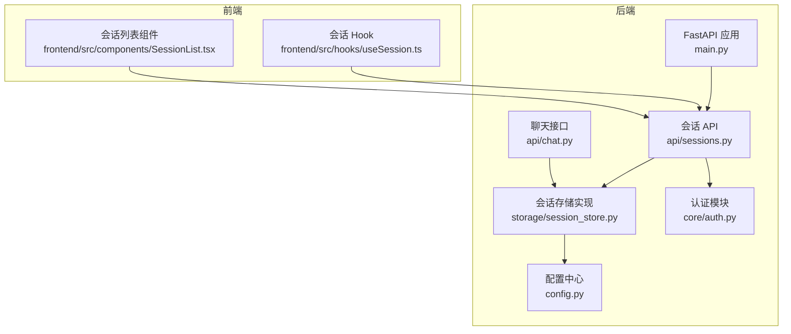
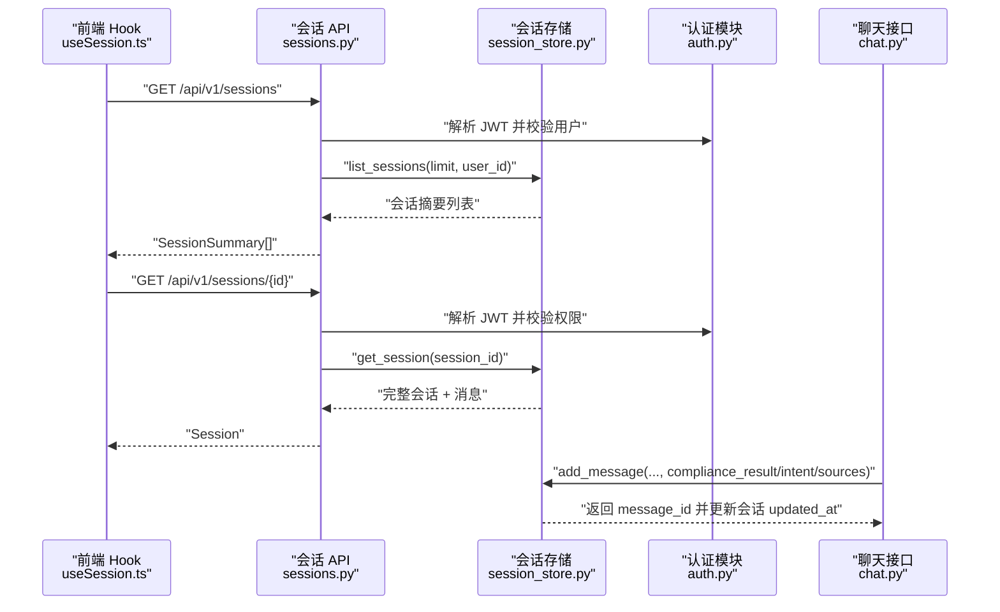
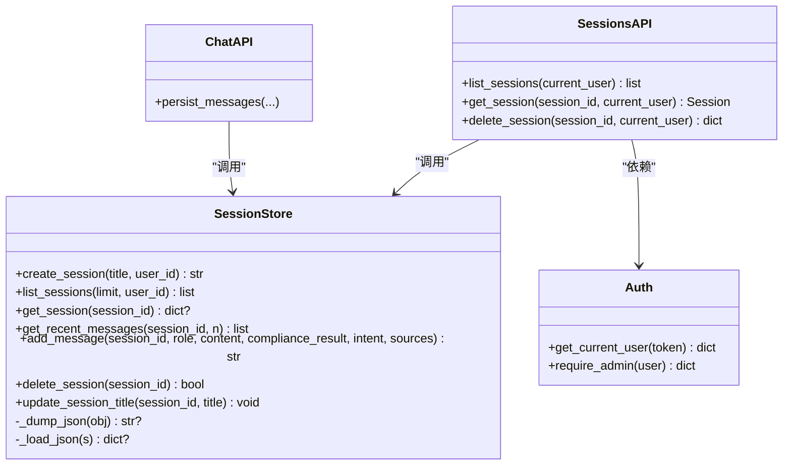
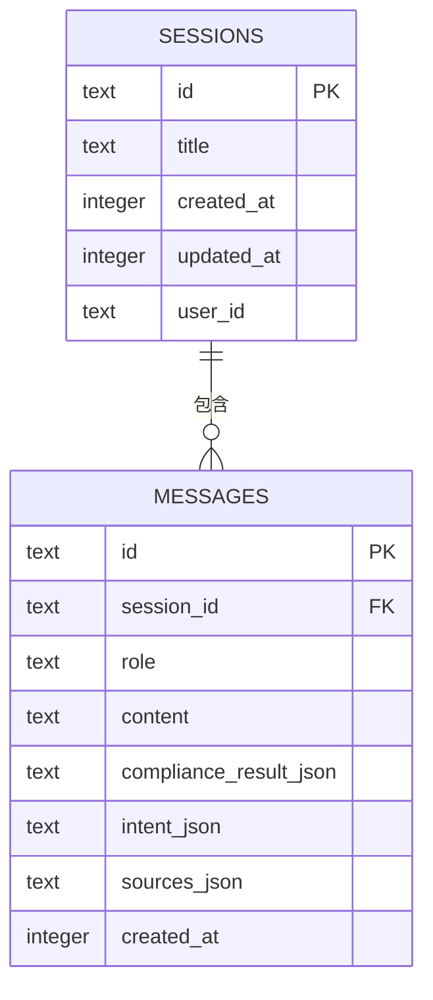
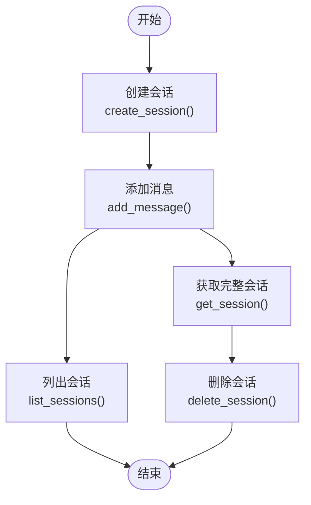

# 会话存储

<cite>
**本文引用的文件**
- [session_store.py](file://backend/app/storage/session_store.py)
- [schemas.py](file://backend/app/models/schemas.py)
- [sessions.py](file://backend/app/api/sessions.py)
- [config.py](file://backend/app/config.py)
- [auth.py](file://backend/app/core/auth.py)
- [chat.py](file://backend/app/api/chat.py)
- [useSession.ts](file://frontend/src/hooks/useSession.ts)
- [SessionList.tsx](file://frontend/src/components/SessionList.tsx)
- [main.py](file://backend/app/main.py)
</cite>

## 目录
1. [简介](#简介)
2. [项目结构](#项目结构)
3. [核心组件](#核心组件)
4. [架构总览](#架构总览)
5. [详细组件分析](#详细组件分析)
6. [依赖关系分析](#依赖关系分析)
7. [性能考量](#性能考量)
8. [故障排查指南](#故障排查指南)
9. [结论](#结论)
10. [附录](#附录)

## 简介
本文件聚焦“会话存储”模块，系统性阐述会话数据的持久化设计、表结构、ID生成策略、过期时间管理、生命周期管理、序列化与反序列化、并发与事务、一致性保障、性能优化、安全考虑以及典型使用场景与示例。该模块采用 SQLite 作为本地存储后端，围绕会话与消息两条核心表进行数据持久化，并通过 FastAPI 提供受认证保护的会话管理 API。

## 项目结构
会话存储位于后端 Python 代码的 storage 层，配合 API 层、模型层与前端 Hook/组件共同构成完整的会话生命周期闭环。

图表来源
- [main.py:1-76](file://backend/app/main.py#L1-L76)
- [sessions.py:1-79](file://backend/app/api/sessions.py#L1-L79)
- [session_store.py:1-251](file://backend/app/storage/session_store.py#L1-L251)
- [auth.py:1-60](file://backend/app/core/auth.py#L1-L60)
- [config.py:1-183](file://backend/app/config.py#L1-L183)
- [chat.py:1-200](file://backend/app/api/chat.py#L1-L200)
- [useSession.ts:1-161](file://frontend/src/hooks/useSession.ts#L1-L161)
- [SessionList.tsx:1-134](file://frontend/src/components/SessionList.tsx#L1-L134)

章节来源
- [main.py:1-76](file://backend/app/main.py#L1-L76)
- [sessions.py:1-79](file://backend/app/api/sessions.py#L1-L79)
- [session_store.py:1-251](file://backend/app/storage/session_store.py#L1-L251)
- [auth.py:1-60](file://backend/app/core/auth.py#L1-L60)
- [config.py:1-183](file://backend/app/config.py#L1-L183)
- [chat.py:1-200](file://backend/app/api/chat.py#L1-L200)
- [useSession.ts:1-161](file://frontend/src/hooks/useSession.ts#L1-L161)
- [SessionList.tsx:1-134](file://frontend/src/components/SessionList.tsx#L1-L134)

## 核心组件
- 会话存储实现：负责 SQLite 初始化、表结构迁移、会话与消息的增删查改、JSON 序列化/反序列化、索引维护。
- 会话 API：提供会话列表、详情、删除等受认证保护的接口，支持按用户过滤与权限校验。
- 模型定义：定义会话、消息、合规结果等数据结构，确保前后端一致的数据契约。
- 认证与权限：基于 JWT 的用户解析与管理员权限校验，保障会话访问与删除的安全性。
- 前端集成：Hook 负责与后端 API 交互，组件负责展示与交互。

章节来源
- [session_store.py:1-251](file://backend/app/storage/session_store.py#L1-L251)
- [sessions.py:1-79](file://backend/app/api/sessions.py#L1-L79)
- [schemas.py:234-264](file://backend/app/models/schemas.py#L234-L264)
- [auth.py:1-60](file://backend/app/core/auth.py#L1-L60)

## 架构总览
会话存储采用“存储实现 + API 控制器 + 认证 + 前端 Hook/组件”的分层设计。聊天接口在生成回复时也会写入会话存储，形成“对话即记录”的闭环。

图表来源
- [useSession.ts:15-63](file://frontend/src/hooks/useSession.ts#L15-L63)
- [sessions.py:17-78](file://backend/app/api/sessions.py#L17-L78)
- [session_store.py:74-235](file://backend/app/storage/session_store.py#L74-L235)
- [auth.py:41-59](file://backend/app/core/auth.py#L41-L59)
- [chat.py:183-200](file://backend/app/api/chat.py#L183-L200)

## 详细组件分析

### 会话存储实现（session_store.py）
- 数据库与连接
  - 使用 SQLite 文件数据库，路径由配置中心的 data_dir 决定，默认在 data/sessions.db。
  - 首次访问时自动创建目录与连接，禁用线程检查以适配异步/多线程场景。
- 表结构与索引
  - sessions 表：主键 id、标题 title、创建时间 created_at、更新时间 updated_at、可选 user_id。
  - messages 表：主键 id、外键 session_id 引用 sessions.id（级联删除）、角色 role、内容 content、合规结果/意图/来源 JSON 字段、创建时间 created_at。
  - 索引：messages.session_id、sessions.updated_at DESC。
  - 迁移：为旧表增加 user_id 列（若不存在）。
- 会话生命周期
  - 创建：生成 UUID 作为 session_id，插入 sessions，同时记录 created_at/updated_at。
  - 查询：支持按 user_id 过滤的最近会话列表（按 updated_at 降序），支持获取完整会话（含全部消息）。
  - 更新：支持更新标题；消息写入时同步更新会话 updated_at。
  - 删除：删除会话及其全部消息（由外键约束触发级联删除）。
- 序列化与反序列化
  - 使用 JSON 字符串存储复杂对象（合规结果、意图、来源列表）。
  - 提供 _dump_json/_load_json 工具函数，异常时返回 None，保证健壮性。
- 并发与事务
  - 单连接模式：全局共享连接，未显式开启事务块，所有写操作在 commit() 后生效。
  - 线程安全：禁用同线程检查，但未引入锁或 WAL/并发控制，需注意并发写入的潜在竞争。
- 性能与扩展
  - 已建立必要索引；支持按 user_id 过滤与按更新时间排序。
  - 未内置过期清理任务，可通过外部定时任务或应用内扫描实现。

章节来源
- [session_store.py:1-251](file://backend/app/storage/session_store.py#L1-L251)
- [config.py:150-151](file://backend/app/config.py#L150-L151)

### 会话 API（sessions.py）
- 端点
  - GET /api/v1/sessions：返回最近会话摘要列表，支持按用户过滤（admin 可查看全部）。
  - GET /api/v1/sessions/{id}：返回完整会话（含消息、合规结果、意图、来源）。
  - DELETE /api/v1/sessions/{id}：删除指定会话。
- 权限控制
  - 非 admin 用户只能查看/删除自己的会话；admin 可查看全部。
- 数据转换
  - 将存储层返回的字典映射为 Pydantic 模型（Session/SessionSummary/SessionMessage）。

章节来源
- [sessions.py:1-79](file://backend/app/api/sessions.py#L1-L79)
- [schemas.py:234-264](file://backend/app/models/schemas.py#L234-L264)

### 认证与权限（auth.py）
- JWT 解析：基于 HS256 算法，从 Authorization: Bearer 中提取 token 并解码。
- 用户解析：从 token 中提取 sub（用户 ID），查询用户信息并返回 {id, username, role}。
- 管理员校验：require_admin 依赖 get_current_user，仅允许 role=admin 的用户访问特定资源。

章节来源
- [auth.py:1-60](file://backend/app/core/auth.py#L1-L60)
- [config.py:173-176](file://backend/app/config.py#L173-L176)

### 前端集成（useSession.ts 与 SessionList.tsx）
- useSession.ts
  - 加载会话列表、打开会话、新建会话、删除会话、发送消息。
  - 与后端 /api/v1/sessions 与 /api/v1/chat 交互。
- SessionList.tsx
  - 展示会话列表，按时间分组（今天/昨天/最近7天/更早），支持删除操作。

章节来源
- [useSession.ts:1-161](file://frontend/src/hooks/useSession.ts#L1-L161)
- [SessionList.tsx:1-134](file://frontend/src/components/SessionList.tsx#L1-L134)

### 聊天接口与会话写入（chat.py）
- 在生成回复时，调用会话存储写入消息（包含合规结果、意图、来源等复杂对象），并同步更新会话 updated_at。
- 该流程确保“对话即记录”，便于后续检索与审计。

章节来源
- [chat.py:183-200](file://backend/app/api/chat.py#L183-L200)
- [session_store.py:186-217](file://backend/app/storage/session_store.py#L186-L217)

## 依赖关系分析

图表来源
- [session_store.py:74-235](file://backend/app/storage/session_store.py#L74-L235)
- [sessions.py:17-78](file://backend/app/api/sessions.py#L17-L78)
- [auth.py:41-59](file://backend/app/core/auth.py#L41-L59)
- [chat.py:183-200](file://backend/app/api/chat.py#L183-L200)

章节来源
- [session_store.py:74-235](file://backend/app/storage/session_store.py#L74-L235)
- [sessions.py:17-78](file://backend/app/api/sessions.py#L17-L78)
- [auth.py:41-59](file://backend/app/core/auth.py#L41-L59)
- [chat.py:183-200](file://backend/app/api/chat.py#L183-L200)

## 性能考量
- 索引设计
  - messages.session_id：加速按会话查询消息。
  - sessions.updated_at DESC：加速按更新时间排序的列表查询。
- 查询优化
  - 列表查询使用聚合统计（消息计数、最后一条用户消息预览），减少不必要的 JOIN。
  - 最近消息查询按 created_at DESC 限制数量并逆序还原时间顺序。
- 缓存机制
  - 存储层未内置缓存；可在应用层对热点会话或近期列表做内存缓存（需注意缓存失效与一致性）。
- 并发与事务
  - 单连接模式未显式事务块，写操作逐条提交；在高并发写入场景下建议引入 WAL、事务块或连接池。
- 过期与清理
  - 未内置过期清理逻辑；可通过定时任务扫描 sessions.updated_at 并删除超期会话，或在业务侧限制会话数量。

章节来源
- [session_store.py:37-70](file://backend/app/storage/session_store.py#L37-L70)
- [session_store.py:87-131](file://backend/app/storage/session_store.py#L87-L131)
- [session_store.py:170-183](file://backend/app/storage/session_store.py#L170-L183)

## 故障排查指南
- 会话不存在
  - API 返回 404；检查 session_id 是否正确或已被删除。
- 无权限访问
  - 非 admin 用户访问他人会话返回 403；确认用户身份与会话 user_id。
- JSON 解析异常
  - 存储层对 JSON 反序列化做了异常兜底（返回 None），若出现字段缺失，前端应具备容错显示。
- 数据库文件权限
  - data/sessions.db 所在目录需具备读写权限；首次启动会自动创建目录。
- 并发写入冲突
  - 单连接模式下可能出现竞态；建议在上层协调写入顺序或引入事务/锁。

章节来源
- [sessions.py:35-78](file://backend/app/api/sessions.py#L35-L78)
- [session_store.py:244-251](file://backend/app/storage/session_store.py#L244-L251)
- [config.py:150-151](file://backend/app/config.py#L150-L151)

## 结论
会话存储模块以 SQLite 为核心，提供了简洁可靠的会话与消息持久化能力。其设计强调：
- 明确的表结构与索引，满足常见查询需求；
- 会话生命周期完整（创建/查询/更新/删除）；
- JSON 序列化支持复杂对象存储；
- 通过 API 与认证模块实现安全访问；
- 前后端协同完成“对话即记录”的闭环。

在生产环境中，建议结合业务规模引入 WAL、事务块、连接池与缓存策略，并补充会话过期清理与审计日志，以进一步提升稳定性与可观测性。

## 附录

### 会话表结构与关系图

图表来源
- [session_store.py:37-62](file://backend/app/storage/session_store.py#L37-L62)

### 会话生命周期流程图

图表来源
- [session_store.py:74-235](file://backend/app/storage/session_store.py#L74-L235)

### 实际使用场景与示例（路径指引）
- 前端加载会话列表
  - 路径：[useSession.ts:16-26](file://frontend/src/hooks/useSession.ts#L16-L26)
- 打开会话并展示消息
  - 路径：[useSession.ts:29-43](file://frontend/src/hooks/useSession.ts#L29-L43)
- 发送消息并写入会话
  - 路径：[useSession.ts:66-148](file://frontend/src/hooks/useSession.ts#L66-L148)
- 后端会话 API 访问
  - 路径：[sessions.py:17-78](file://backend/app/api/sessions.py#L17-L78)
- 聊天接口写入会话
  - 路径：[chat.py:183-200](file://backend/app/api/chat.py#L183-L200)