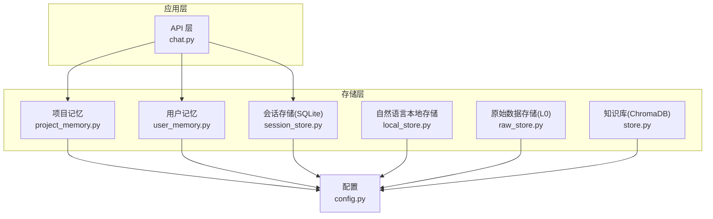
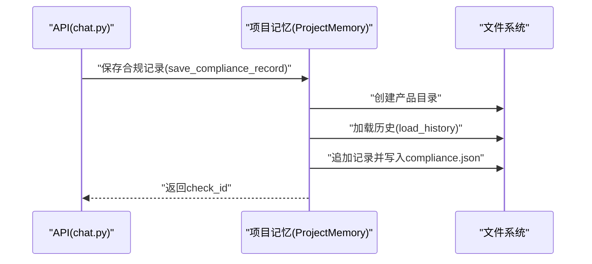
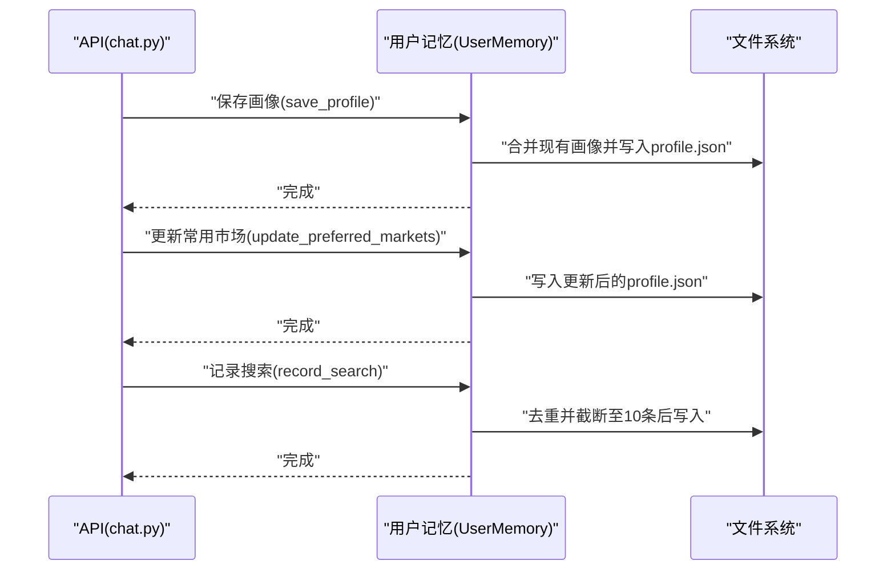
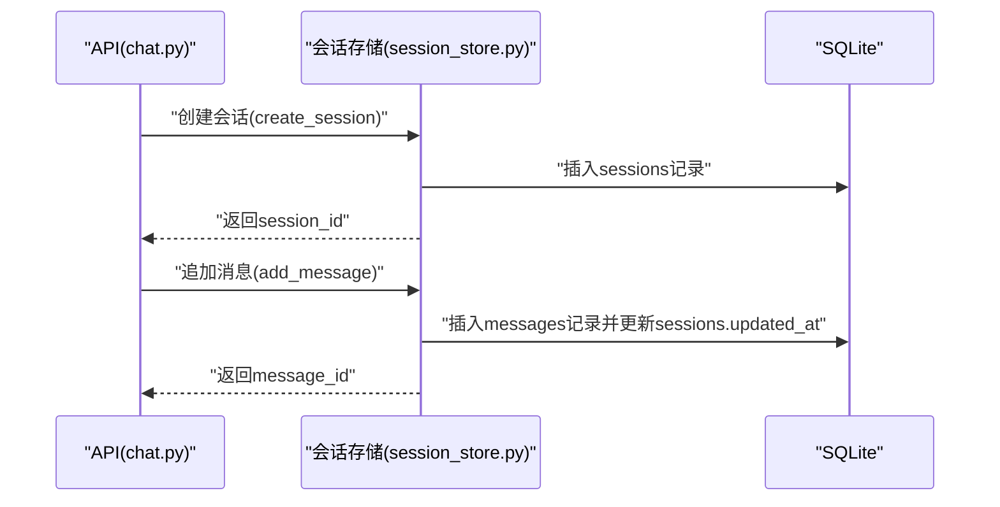
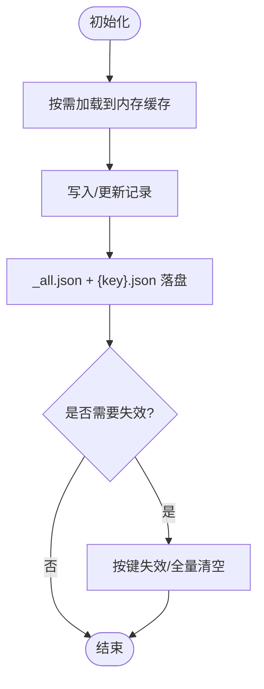
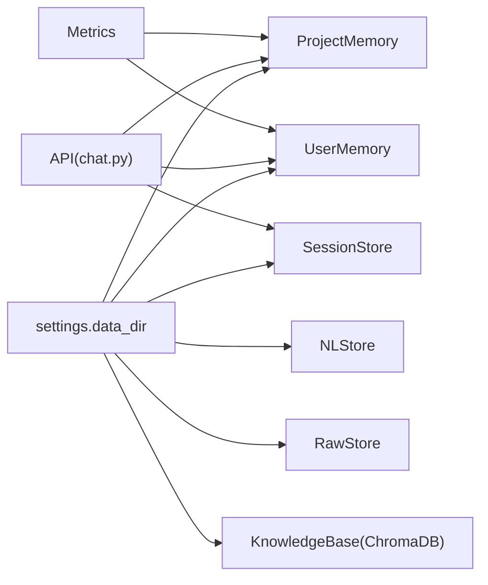

# 内存存储

<cite>
**本文引用的文件**
- [project_memory.py](file://backend/app/storage/project_memory.py)
- [user_memory.py](file://backend/app/storage/user_memory.py)
- [config.py](file://backend/app/config.py)
- [chat.py](file://backend/app/api/chat.py)
- [metrics.py](file://backend/app/core/metrics.py)
- [local_store.py](file://backend/app/core/local_store.py)
- [session_store.py](file://backend/app/storage/session_store.py)
- [store.py](file://backend/app/knowledge/store.py)
</cite>

## 目录
1. [简介](#简介)
2. [项目结构](#项目结构)
3. [核心组件](#核心组件)
4. [架构总览](#架构总览)
5. [详细组件分析](#详细组件分析)
6. [依赖分析](#依赖分析)
7. [性能考量](#性能考量)
8. [故障排查指南](#故障排查指南)
9. [结论](#结论)
10. [附录](#附录)

## 简介
本文件聚焦于项目级内存存储（L2 项目记忆）与用户级内存存储（L3 用户记忆）的设计与实现，结合现有代码梳理其数据结构、缓存策略、生命周期管理、与持久化存储的协作方式，并给出性能优化与运维建议。需要特别说明的是：仓库中并未发现传统意义上的“内存缓存”（如 LRU、LFU、TTL 等）实现；项目记忆与用户记忆均采用文件系统持久化，辅以少量内存缓存（如 L0 原始数据存储、自然语言本地存储）以提升读取性能。

## 项目结构
- 存储层位于 backend/app/storage，包含项目记忆与用户记忆两大模块，以及会话持久化存储等。
- 配置模块 backend/app/config 提供 data_dir 等关键路径配置，决定各层存储的物理位置。
- API 层 backend/app/api/chat 在合规检查完成后，调用项目记忆与会话存储进行持久化。
- 核心模块 backend/app/core/local_store 提供自然语言本地存储，具备内存缓存与文件持久化能力，可作为理解“内存缓存 + 文件持久化”的参考实现。
- 知识库层 backend/app/knowledge/store 使用 ChromaDB 向量库，属于另一类“内存型”存储（向量嵌入在内存中），与项目/用户记忆不同。

图表来源
- [project_memory.py:1-141](file://backend/app/storage/project_memory.py#L1-L141)
- [user_memory.py:1-84](file://backend/app/storage/user_memory.py#L1-L84)
- [session_store.py:1-251](file://backend/app/storage/session_store.py#L1-L251)
- [local_store.py:1-293](file://backend/app/core/local_store.py#L1-L293)
- [config.py:150-152](file://backend/app/config.py#L150-L152)

章节来源
- [project_memory.py:1-141](file://backend/app/storage/project_memory.py#L1-L141)
- [user_memory.py:1-84](file://backend/app/storage/user_memory.py#L1-L84)
- [session_store.py:1-251](file://backend/app/storage/session_store.py#L1-L251)
- [local_store.py:1-293](file://backend/app/core/local_store.py#L1-L293)
- [config.py:150-152](file://backend/app/config.py#L150-L152)

## 核心组件
- 项目记忆（L2）：面向产品合规档案，按 product_id 维度隔离，写入合规检查历史，读取历史与最新检查结果。
- 用户记忆（L3）：面向用户画像/偏好/历史，按 user_id 维度隔离，支持画像合并更新、常用市场更新、最近搜索记录维护。
- 会话存储（L4）：SQLite 持久化，存储会话与消息，支持会话 CRUD、消息追加、最近消息读取。
- 自然语言本地存储（LNL）：内存缓存 + 文件持久化，提供命名空间维度的记录管理与全文搜索。
- 原始数据存储（L0）：内存缓存 + 文件读取，按分类/文件名键缓存 JSON 数据，支持热加载失效。
- 知识库（L1）：ChromaDB 向量库，内存中维护向量索引，提供多市场集合。

章节来源
- [project_memory.py:20-141](file://backend/app/storage/project_memory.py#L20-L141)
- [user_memory.py:18-84](file://backend/app/storage/user_memory.py#L18-L84)
- [session_store.py:25-251](file://backend/app/storage/session_store.py#L25-L251)
- [local_store.py:80-293](file://backend/app/core/local_store.py#L80-L293)
- [store.py:43-78](file://backend/app/knowledge/store.py#L43-L78)

## 架构总览
项目记忆与用户记忆均采用“文件系统持久化 + 少量内存缓存”的混合策略：
- 项目记忆：以 product_id 为目录隔离，合规历史以 JSON 文件形式追加写入，读取时按需加载。
- 用户记忆：以 user_id 为目录隔离，用户画像以 JSON 文件形式合并写入，读取时按需加载。
- 会话存储：SQLite 表 sessions/messages，消息体以 JSON 文本字段存储，提供索引与迁移。
- 自然语言本地存储：内存缓存 namespace -> 记录列表，定期落盘至 _all.json 与各记录文件。
- 原始数据存储：内存缓存 category/filename -> 数据，支持按键失效与全量清空。
- 知识库：ChromaDB 持久化客户端，按市场创建 collection，内存中维护向量索引。

```mermaid
graph TB
subgraph "项目记忆(L2)"
PM_DIR["目录: data_dir/project_memory/{product_id}"]
PM_FILE["文件: compliance.json"]
PM_WRITE["写入: 追加历史"]
PM_READ["读取: 历史/最新检查"]
end
subgraph "用户记忆(L3)"
UM_DIR["目录: data_dir/user_memory/{user_id}"]
UM_FILE["文件: profile.json"]
UM_UPDATE["更新: 合并画像"]
UM_READ["读取: 用户画像"]
end
subgraph "会话存储(L4)"
DB_SQLITE["SQLite: sessions.db"]
TBL_S["表: sessions"]
TBL_M["表: messages"]
IDX["索引: session_id, updated_at"]
end
subgraph "自然语言本地存储(LNL)"
CACHE_NL["内存缓存: namespace -> 记录列表"]
FILE_NL["文件: _all.json + {key}.json"]
end
subgraph "原始数据存储(L0)"
CACHE_RAW["内存缓存: category/filename -> 数据"]
FILE_RAW["文件: data_dir/raw/*"]
end
subgraph "知识库(L1)"
CHROMA["ChromaDB 客户端"]
COL_EU["集合: eu_knowledge"]
COL_US["集合: us_knowledge"]
end
PM_DIR --> PM_FILE --> PM_WRITE --> PM_READ
UM_DIR --> UM_FILE --> UM_UPDATE --> UM_READ
DB_SQLITE --> TBL_S --> IDX
DB_SQLITE --> TBL_M --> IDX
CACHE_NL --> FILE_NL
CACHE_RAW --> FILE_RAW
CHROMA --> COL_EU
CHROMA --> COL_US
```

图表来源
- [project_memory.py:28-98](file://backend/app/storage/project_memory.py#L28-L98)
- [user_memory.py:26-83](file://backend/app/storage/user_memory.py#L26-L83)
- [session_store.py:37-70](file://backend/app/storage/session_store.py#L37-L70)
- [local_store.py:109-145](file://backend/app/core/local_store.py#L109-L145)
- [store.py:43-78](file://backend/app/knowledge/store.py#L43-L78)

## 详细组件分析

### 项目记忆（L2）设计与使用
- 隔离粒度：按 product_id 维度隔离，每个产品拥有独立目录与合规历史文件。
- 写入流程：生成 check_id，组装记录，加载历史并追加，写入 JSON 文件。
- 读取流程：加载历史列表、获取最新检查、列举产品摘要。
- 生命周期：以文件为单位长期保存，无显式 TTL/淘汰策略；可通过业务逻辑定期清理或归档。
- 与会话存储协作：在合规检查完成后，同时写入会话存储与项目记忆，保证上下文与历史的一致性。

图表来源
- [chat.py:184-203](file://backend/app/api/chat.py#L184-L203)
- [project_memory.py:36-87](file://backend/app/storage/project_memory.py#L36-L87)

章节来源
- [project_memory.py:20-141](file://backend/app/storage/project_memory.py#L20-L141)
- [chat.py:184-203](file://backend/app/api/chat.py#L184-L203)

### 用户记忆（L3）设计与使用
- 隔离粒度：按 user_id 维度隔离，用户画像以 profile.json 存储。
- 写入流程：合并更新画像、更新常用市场、维护最近搜索（最多 10 条）。
- 读取流程：按 user_id 加载 profile.json。
- 生命周期：以文件为单位长期保存；常用市场与最近搜索具备简单去重与截断策略。
- 与仪表盘协作：指标模块从用户记忆读取偏好市场，用于健康评分与趋势计算。

图表来源
- [chat.py:184-203](file://backend/app/api/chat.py#L184-L203)
- [user_memory.py:31-66](file://backend/app/storage/user_memory.py#L31-L66)

章节来源
- [user_memory.py:18-84](file://backend/app/storage/user_memory.py#L18-L84)
- [metrics.py:81-91](file://backend/app/core/metrics.py#L81-L91)

### 会话存储（L4）设计与使用
- 数据模型：sessions 表与 messages 表，messages 外键关联 sessions。
- 写入流程：创建会话、追加消息、更新会话时间戳。
- 读取流程：获取会话详情、最近 N 条消息、会话列表（支持用户过滤）。
- 索引与迁移：为 messages.session_id 与 sessions.updated_at 建立索引；迁移时尝试新增 user_id 列。
- 与项目/用户记忆协作：在合规检查后写入会话，同时写入项目记忆与用户记忆，形成闭环。

图表来源
- [chat.py:184-203](file://backend/app/api/chat.py#L184-L203)
- [session_store.py:74-217](file://backend/app/storage/session_store.py#L74-L217)

章节来源
- [session_store.py:25-251](file://backend/app/storage/session_store.py#L25-L251)

### 自然语言本地存储（LNL）与原始数据存储（L0）对比
- 自然语言本地存储（NLStore）：内存缓存 namespace -> 记录列表，写入时落盘至 _all.json 与各记录文件；适合小规模、频繁读写的结构化记录。
- 原始数据存储（RawStore）：内存缓存 category/filename -> 数据，提供按键失效与全量清空；适合静态规则数据的快速读取与热加载。

图表来源
- [local_store.py:109-145](file://backend/app/core/local_store.py#L109-L145)
- [local_store.py:225-272](file://backend/app/core/local_store.py#L225-L272)
- [raw_store.py:22-53](file://backend/app/storage/raw_store.py#L22-L53)

章节来源
- [local_store.py:80-293](file://backend/app/core/local_store.py#L80-L293)
- [raw_store.py:19-134](file://backend/app/storage/raw_store.py#L19-L134)

### 知识库（L1）与内存使用
- ChromaDB：本地持久化客户端，按市场创建集合，内存中维护向量索引；查询失败时降级为空结果，不影响主流程。
- 内存占用：主要来自向量嵌入与索引；可通过集合数量与文档数量控制。

章节来源
- [store.py:43-78](file://backend/app/knowledge/store.py#L43-L78)
- [store.py:127-192](file://backend/app/knowledge/store.py#L127-L192)

## 依赖分析
- 项目记忆与用户记忆依赖配置 settings.data_dir 决定存储根目录。
- API 层在合规检查完成后，统一调用项目记忆与会话存储进行持久化。
- 指标模块从项目记忆与用户记忆读取数据，用于仪表盘聚合。
- 自然语言本地存储与原始数据存储提供内存缓存能力，减少磁盘 IO。

图表来源
- [config.py:150-152](file://backend/app/config.py#L150-L152)
- [project_memory.py:23-24](file://backend/app/storage/project_memory.py#L23-L24)
- [user_memory.py:21-22](file://backend/app/storage/user_memory.py#L21-L22)
- [session_store.py:21](file://backend/app/storage/session_store.py#L21)
- [local_store.py:26](file://backend/app/core/local_store.py#L26)
- [store.py:48-51](file://backend/app/knowledge/store.py#L48-L51)
- [chat.py:184-203](file://backend/app/api/chat.py#L184-L203)
- [metrics.py:49-91](file://backend/app/core/metrics.py#L49-L91)

章节来源
- [config.py:150-152](file://backend/app/config.py#L150-L152)
- [chat.py:184-203](file://backend/app/api/chat.py#L184-L203)
- [metrics.py:49-91](file://backend/app/core/metrics.py#L49-L91)

## 性能考量
- 读取性能
  - 项目记忆与用户记忆：按需加载，适合低频读取；对于高频读取场景，可在上层引入轻量内存缓存（例如按 user_id/product_id 缓存最近读取的数据）。
  - 会话存储：建立索引，支持按会话与时间排序查询；注意避免一次性读取过多消息。
  - 自然语言本地存储与原始数据存储：内存缓存显著降低磁盘 IO；写入后统一落盘，保证一致性。
  - 知识库：查询失败降级，避免阻塞主流程；集合数量与文档数量直接影响内存占用。
- 写入性能
  - 项目记忆与用户记忆：写入为追加/合并写入，单文件写入；建议批量写入或异步写入，避免阻塞请求。
  - 会话存储：单条消息写入，事务提交；批量写入可减少事务开销。
- 并发控制
  - 项目记忆与用户记忆：文件写入为原子性（一次性写入 JSON 文件）；并发写入同一文件时建议加锁或使用队列串行化。
  - 会话存储：SQLite 支持多线程连接（check_same_thread=False），但仍需注意事务与锁竞争。
- 内存使用监控
  - 自然语言本地存储与原始数据存储：可通过统计缓存大小与文件数量评估内存占用。
  - 知识库：监控集合数量与文档数量，必要时清理或压缩。
- 数据压缩与序列化
  - 当前实现使用 JSON 序列化；可考虑二进制序列化（如 msgpack）或压缩（gzip/lz4）以降低磁盘与网络开销。
- 批量操作
  - 项目记忆与用户记忆：批量写入时先合并内存数据，再一次性写入文件。
  - 会话存储：批量消息写入时复用连接与事务，减少往返开销。
- 缓存穿透与雪崩
  - 项目记忆与用户记忆：无显式缓存层，读取失败即返回空；可通过上层缓存与默认值缓解穿透；雪崩可通过限流与熔断控制上游流量。
- 内存使用限制与资源监控
  - 建议对内存缓存设置容量上限与淘汰策略（如 LRU），并对缓存命中率、未命中率进行监控。
  - 对 SQLite 连接池与 ChromaDB 客户端进行资源限制与健康检查。

## 故障排查指南
- 项目记忆/用户记忆读取为空
  - 检查 data_dir 配置是否正确，确认目录与文件是否存在。
  - 确认写入流程是否成功（API 层调用是否抛出异常被吞掉）。
- 会话存储异常
  - 检查 sessions.db 是否存在，索引是否正常；关注迁移过程中新增列失败的情况。
  - 确认消息 JSON 字段是否可反序列化。
- 自然语言本地存储/原始数据存储
  - 检查内存缓存是否命中；必要时触发失效或全量清空。
  - 确认文件写入是否成功，落盘是否及时。
- 知识库查询失败
  - ChromaDB 客户端初始化是否成功；集合是否存在；查询异常时是否按预期降级为空结果。

章节来源
- [project_memory.py:91-98](file://backend/app/storage/project_memory.py#L91-L98)
- [user_memory.py:70-83](file://backend/app/storage/user_memory.py#L70-L83)
- [session_store.py:37-70](file://backend/app/storage/session_store.py#L37-L70)
- [session_store.py:244-250](file://backend/app/storage/session_store.py#L244-L250)
- [local_store.py:225-272](file://backend/app/core/local_store.py#L225-L272)
- [store.py:163-173](file://backend/app/knowledge/store.py#L163-L173)

## 结论
- 项目记忆与用户记忆采用文件系统持久化，具备清晰的隔离粒度与稳定的读写流程。
- 会话存储提供结构化的历史上下文，与项目/用户记忆共同构成完整的业务闭环。
- 自然语言本地存储与原始数据存储展示了“内存缓存 + 文件持久化”的可行模式，可作为扩展项目记忆/用户记忆缓存层的参考。
- 知识库以向量索引为核心，内存占用与查询性能需结合集合规模进行治理。
- 建议在上层引入轻量内存缓存、批量写入与并发控制，以进一步提升性能与稳定性。

## 附录
- 最佳实践
  - 为高频读取的用户画像与产品历史引入上层缓存（如 LRU），并设置合理的失效策略。
  - 批量写入时合并内存数据，减少磁盘 IO 与文件碎片。
  - 对并发写入进行串行化或加锁，避免竞态。
  - 对 SQLite 与 ChromaDB 进行资源限制与健康检查，防止资源耗尽。
  - 对关键路径（API 写入）进行降级与重试策略，确保用户体验。
- 使用示例（路径指引）
  - 保存合规记录：[project_memory.py:36-87](file://backend/app/storage/project_memory.py#L36-L87)
  - 保存用户画像：[user_memory.py:31-51](file://backend/app/storage/user_memory.py#L31-L51)
  - 追加会话消息：[session_store.py:186-217](file://backend/app/storage/session_store.py#L186-L217)
  - 获取用户偏好市场：[metrics.py:81-91](file://backend/app/core/metrics.py#L81-L91)