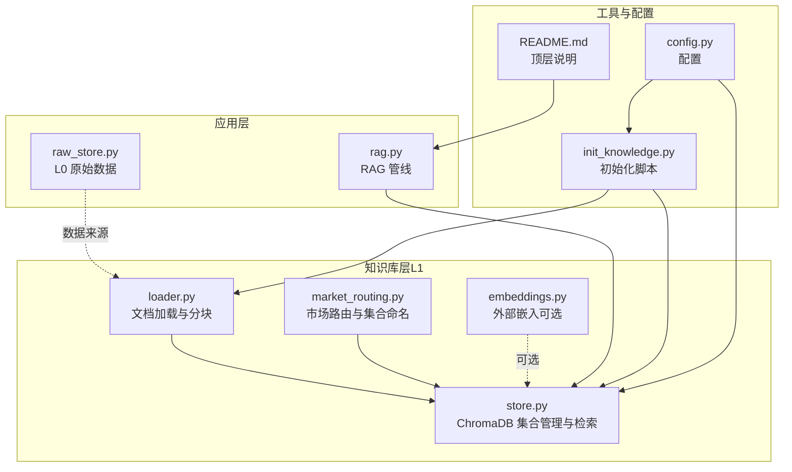
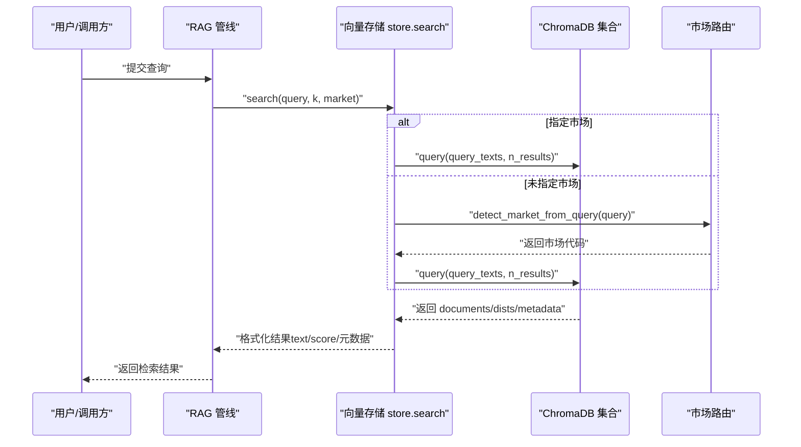
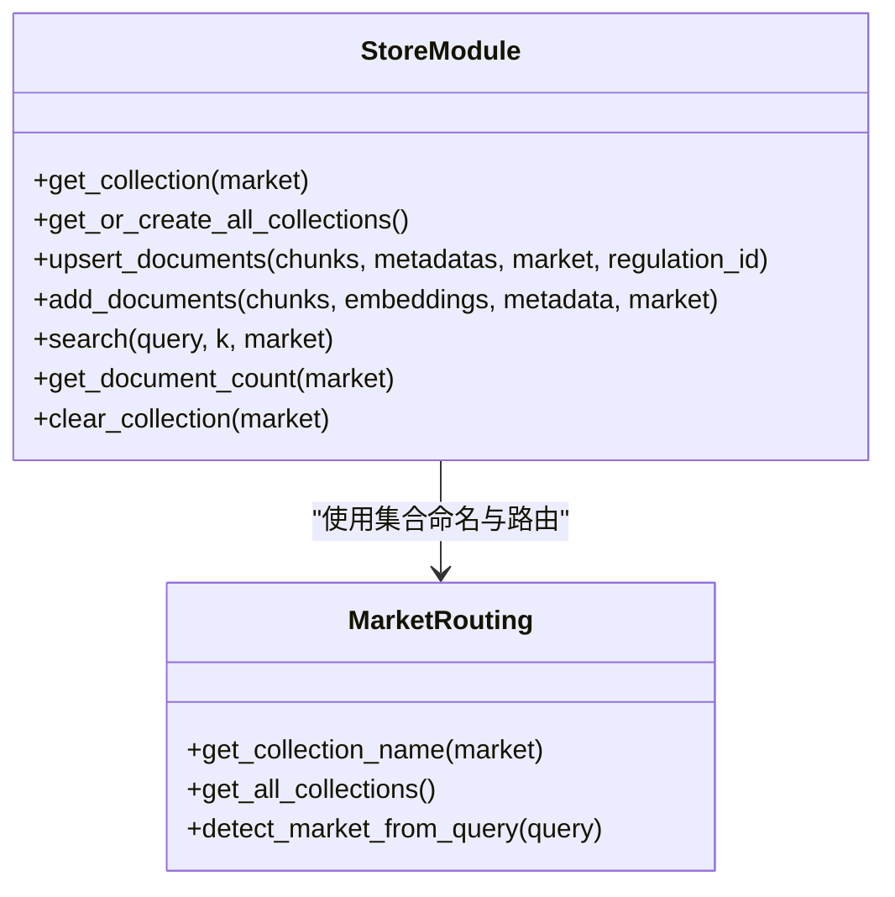
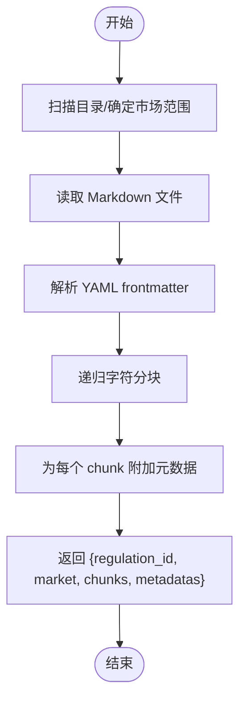
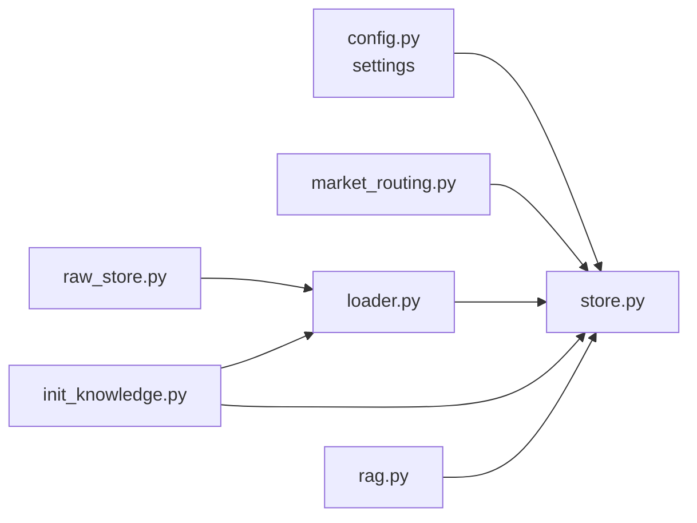

# 向量存储

<cite>
**本文引用的文件**
- [backend/app/knowledge/store.py](file://backend/app/knowledge/store.py)
- [backend/app/knowledge/loader.py](file://backend/app/knowledge/loader.py)
- [backend/app/knowledge/market_routing.py](file://backend/app/knowledge/market_routing.py)
- [backend/app/knowledge/embeddings.py](file://backend/app/knowledge/embeddings.py)
- [backend/app/core/rag.py](file://backend/app/core/rag.py)
- [backend/app/storage/raw_store.py](file://backend/app/storage/raw_store.py)
- [backend/scripts/init_knowledge.py](file://backend/scripts/init_knowledge.py)
- [backend/app/config.py](file://backend/app/config.py)
- [backend/README.md](file://README.md)
</cite>

## 目录
1. [简介](#简介)
2. [项目结构](#项目结构)
3. [核心组件](#核心组件)
4. [架构总览](#架构总览)
5. [组件详解](#组件详解)
6. [依赖关系分析](#依赖关系分析)
7. [性能考量](#性能考量)
8. [故障排查指南](#故障排查指南)
9. [结论](#结论)
10. [附录](#附录)

## 简介
本文件聚焦“向量存储”主题，系统梳理项目中基于 ChromaDB 的向量数据库集成方案，涵盖数据库连接配置、集合管理、向量索引优化、原始数据存储（L0）设计、文档分块与元数据管理、批量写入优化、向量检索实现机制（相似度计算、过滤条件、结果排序）、性能调优策略（批量操作、索引维护、内存管理）、版本控制与增量更新、数据同步机制、检索最佳实践与查询优化、缓存策略，以及实际应用场景与性能基准测试建议。文档同时给出面向非技术读者的可读性说明，并通过可视化图表帮助理解系统架构与数据流。

## 项目结构
本项目的向量存储相关代码主要分布在以下模块：
- 知识库加载与分块：backend/app/knowledge/loader.py
- 向量存储与检索：backend/app/knowledge/store.py
- 市场路由与集合命名：backend/app/knowledge/market_routing.py
- 外部嵌入（可选）：backend/app/knowledge/embeddings.py
- RAG 管线：backend/app/core/rag.py
- 原始数据存储（L0）：backend/app/storage/raw_store.py
- 初始化脚本：backend/scripts/init_knowledge.py
- 配置：backend/app/config.py
- 顶层说明：backend/README.md

**图表来源**
- [backend/app/knowledge/store.py:1-227](file://backend/app/knowledge/store.py#L1-L227)
- [backend/app/knowledge/loader.py:1-142](file://backend/app/knowledge/loader.py#L1-L142)
- [backend/app/knowledge/market_routing.py:1-77](file://backend/app/knowledge/market_routing.py#L1-L77)
- [backend/app/knowledge/embeddings.py:1-35](file://backend/app/knowledge/embeddings.py#L1-L35)
- [backend/app/core/rag.py:1-59](file://backend/app/core/rag.py#L1-L59)
- [backend/app/storage/raw_store.py:1-134](file://backend/app/storage/raw_store.py#L1-L134)
- [backend/scripts/init_knowledge.py:1-129](file://backend/scripts/init_knowledge.py#L1-L129)
- [backend/app/config.py:1-183](file://backend/app/config.py#L1-L183)
- [backend/README.md:1-316](file://README.md#L1-L316)

**章节来源**
- [backend/README.md:1-316](file://README.md#L1-L316)
- [backend/app/config.py:147-151](file://backend/app/config.py#L147-L151)

## 核心组件
- ChromaDB 向量存储与检索：封装集合创建、文档 upsert、查询、计数、清空等能力，支持多市场集合隔离与懒加载。
- 文档加载与分块：从 Markdown 文件读取并按层级与段落进行递归分块，保留 YAML frontmatter 元数据。
- 市场路由：根据查询关键词自动路由到对应市场的集合，支持 EU/US/JP/KR/DE。
- 外部嵌入（可选）：通过 OpenRouter 兼容 API 生成嵌入向量，便于与 ChromaDB 的本地嵌入形成对比或替换。
- RAG 管线：检索相关法规片段并格式化为 LLM 上下文。
- 原始数据存储（L0）：缓存静态 JSON 数据，提供 HS 编码、VAT 税率、认证矩阵的快速查询。
- 初始化脚本：批量加载文档、分块、upsert 到 ChromaDB，支持重置与预览。

**章节来源**
- [backend/app/knowledge/store.py:1-227](file://backend/app/knowledge/store.py#L1-L227)
- [backend/app/knowledge/loader.py:1-142](file://backend/app/knowledge/loader.py#L1-L142)
- [backend/app/knowledge/market_routing.py:1-77](file://backend/app/knowledge/market_routing.py#L1-L77)
- [backend/app/knowledge/embeddings.py:1-35](file://backend/app/knowledge/embeddings.py#L1-L35)
- [backend/app/core/rag.py:1-59](file://backend/app/core/rag.py#L1-L59)
- [backend/app/storage/raw_store.py:1-134](file://backend/app/storage/raw_store.py#L1-L134)
- [backend/scripts/init_knowledge.py:1-129](file://backend/scripts/init_knowledge.py#L1-L129)

## 架构总览
向量存储采用“文档加载与分块（L0→L1）→ChromaDB（L1）→RAG（应用层）”的三层结构。文档加载阶段从 Markdown 文件提取 YAML frontmatter 并进行分块，随后写入对应市场的集合。检索阶段根据查询关键词路由到相应集合，执行语义相似度检索，返回带完整元数据的结果。

**图表来源**
- [backend/app/core/rag.py:10-18](file://backend/app/core/rag.py#L10-L18)
- [backend/app/knowledge/store.py:127-192](file://backend/app/knowledge/store.py#L127-L192)
- [backend/app/knowledge/market_routing.py:48-76](file://backend/app/knowledge/market_routing.py#L48-L76)

## 组件详解

### ChromaDB 向量存储与检索（store.py）
- 连接与懒加载
  - 使用持久化客户端，路径来自配置；关闭遥测。
  - 首次使用时才加载嵌入函数，避免启动时网络下载。
- 集合管理
  - 按市场创建集合，名称映射为 eu_knowledge、de_knowledge、us_knowledge、jp_knowledge、kr_knowledge。
  - 集合元数据包含相似度空间（余弦）与市场标识。
- 文档写入
  - upsert_documents：幂等写入，ID 由 regulation_id 与索引组合，避免重复。
  - add_documents：向后兼容接口，接受外部嵌入参数但会被忽略，实际使用 ChromaDB 的 SentenceTransformer 自动嵌入。
- 检索
  - search：支持指定市场或自动路由；若自动路由无结果，则全库聚合并按分数排序。
  - query_col：对单集合执行查询，透传元数据，将距离转换为相似度分数。
- 辅助能力
  - get_document_count：统计集合或全库文档数量。
  - clear_collection：清空指定或全部集合。

**图表来源**
- [backend/app/knowledge/store.py:54-78](file://backend/app/knowledge/store.py#L54-L78)
- [backend/app/knowledge/store.py:81-125](file://backend/app/knowledge/store.py#L81-L125)
- [backend/app/knowledge/store.py:127-192](file://backend/app/knowledge/store.py#L127-L192)
- [backend/app/knowledge/market_routing.py:31-76](file://backend/app/knowledge/market_routing.py#L31-L76)

**章节来源**
- [backend/app/knowledge/store.py:43-78](file://backend/app/knowledge/store.py#L43-L78)
- [backend/app/knowledge/store.py:81-125](file://backend/app/knowledge/store.py#L81-L125)
- [backend/app/knowledge/store.py:127-192](file://backend/app/knowledge/store.py#L127-L192)
- [backend/app/knowledge/store.py:195-227](file://backend/app/knowledge/store.py#L195-L227)

### 文档加载与分块（loader.py）
- 加载范围
  - 支持按市场目录或全库扫描，读取 Markdown 文件。
- Frontmatter 解析
  - 使用正则解析 YAML frontmatter，提取 regulation_id、name、source_url、effective_date、tags 等。
- 分块策略
  - 使用递归字符分割器，设定 chunk_size 与 chunk_overlap，按标题层级与段落分隔符进行分块。
- 输出结构
  - 返回每个文档的 regulation_id、market、chunks、metadatas（与 chunks 等长，包含 market、regulation_id、chunk_index 等）。

**图表来源**
- [backend/app/knowledge/loader.py:57-118](file://backend/app/knowledge/loader.py#L57-L118)

**章节来源**
- [backend/app/knowledge/loader.py:19-24](file://backend/app/knowledge/loader.py#L19-L24)
- [backend/app/knowledge/loader.py:29-52](file://backend/app/knowledge/loader.py#L29-L52)
- [backend/app/knowledge/loader.py:57-118](file://backend/app/knowledge/loader.py#L57-L118)

### 市场路由与集合命名（market_routing.py）
- 集合映射
  - eu → eu_knowledge；de → de_knowledge；us → us_knowledge；jp → jp_knowledge；kr → kr_knowledge。
- 路由逻辑
  - detect_market_from_query：根据关键词优先级（DE > EU > US > JP > KR）自动选择集合。
- 兼容性
  - 默认集合用于兼容旧数据。

**章节来源**
- [backend/app/knowledge/market_routing.py:19-45](file://backend/app/knowledge/market_routing.py#L19-L45)
- [backend/app/knowledge/market_routing.py:48-76](file://backend/app/knowledge/market_routing.py#L48-L76)

### 外部嵌入（embeddings.py）
- 作用
  - 通过 OpenRouter 兼容 API 生成嵌入向量，模型与密钥来自配置。
- 使用场景
  - 可用于对比不同嵌入模型的效果，或在 ChromaDB 本地嵌入不可用时的替代方案。

**章节来源**
- [backend/app/knowledge/embeddings.py:1-35](file://backend/app/knowledge/embeddings.py#L1-L35)
- [backend/app/config.py:132-134](file://backend/app/config.py#L132-L134)

### RAG 管线（rag.py）
- 检索
  - retrieve_context：当知识库存在文档时，调用 store.search 获取 top_k 结果。
- 格式化
  - format_context_for_llm：将检索结果格式化为带来源链接与生效日期的上下文字符串。
- 增强
  - enrich_with_rag：整合检索与格式化流程。

**章节来源**
- [backend/app/core/rag.py:10-18](file://backend/app/core/rag.py#L10-L18)
- [backend/app/core/rag.py:21-52](file://backend/app/core/rag.py#L21-L52)
- [backend/app/core/rag.py:55-58](file://backend/app/core/rag.py#L55-L58)

### 原始数据存储（L0）（raw_store.py）
- 设计目标
  - 缓存静态 JSON 数据，避免每次磁盘 IO；提供 HS 编码、VAT 税率、认证矩阵的快速查询。
- 缓存管理
  - 内存缓存，支持按分类/文件名精确清理或批量失效。
- 查询接口
  - HS 编码：模糊匹配产品名到 HS 条目。
  - VAT：按国家查询标准税率。
  - 认证：按国家查询所需认证列表（未知国家回退至德国）。

**章节来源**
- [backend/app/storage/raw_store.py:19-53](file://backend/app/storage/raw_store.py#L19-L53)
- [backend/app/storage/raw_store.py:56-92](file://backend/app/storage/raw_store.py#L56-L92)
- [backend/app/storage/raw_store.py:96-129](file://backend/app/storage/raw_store.py#L96-L129)

### 初始化脚本（init_knowledge.py）
- 功能
  - 扫描指定市场目录，加载并分块文档，调用 upsert_documents 写入 ChromaDB。
  - 支持重置、预览、批量市场初始化、先拉取后初始化等选项。
- 输出
  - 统计写入数量与全库总数。

**章节来源**
- [backend/scripts/init_knowledge.py:28-67](file://backend/scripts/init_knowledge.py#L28-L67)
- [backend/scripts/init_knowledge.py:70-124](file://backend/scripts/init_knowledge.py#L70-L124)

## 依赖关系分析
- store.py 依赖 market_routing.py 进行集合命名与路由；依赖配置 settings 提供 ChromaDB 持久化路径。
- loader.py 依赖 LangChain 的递归字符分割器；依赖配置 settings 提供数据目录。
- rag.py 依赖 store.search 进行检索。
- raw_store.py 依赖配置 settings 提供数据目录。
- init_knowledge.py 依赖 loader.load_regulations_dir 与 store.upsert_documents。

**图表来源**
- [backend/app/knowledge/store.py:18-19](file://backend/app/knowledge/store.py#L18-L19)
- [backend/app/knowledge/market_routing.py:19-25](file://backend/app/knowledge/market_routing.py#L19-L25)
- [backend/app/knowledge/loader.py:17-17](file://backend/app/knowledge/loader.py#L17-L17)
- [backend/app/storage/raw_store.py:16-23](file://backend/app/storage/raw_store.py#L16-L23)
- [backend/scripts/init_knowledge.py:23-25](file://backend/scripts/init_knowledge.py#L23-L25)
- [backend/app/core/rag.py:7-7](file://backend/app/core/rag.py#L7-L7)

**章节来源**
- [backend/app/knowledge/store.py:18-19](file://backend/app/knowledge/store.py#L18-L19)
- [backend/app/knowledge/market_routing.py:19-25](file://backend/app/knowledge/market_routing.py#L19-L25)
- [backend/app/knowledge/loader.py:17-17](file://backend/app/knowledge/loader.py#L17-L17)
- [backend/app/storage/raw_store.py:16-23](file://backend/app/storage/raw_store.py#L16-L23)
- [backend/scripts/init_knowledge.py:23-25](file://backend/scripts/init_knowledge.py#L23-L25)
- [backend/app/core/rag.py:7-7](file://backend/app/core/rag.py#L7-L7)

## 性能考量
- 批量写入优化
  - upsert_documents 使用连续 ID 序列，避免重复写入；分块大小与重叠比例平衡检索精度与存储开销。
- 懒加载与内存管理
  - ChromaDB 客户端与嵌入函数懒加载，减少启动时间与内存占用。
  - market_routing 缓存集合句柄，避免重复创建。
- 检索性能
  - 自动路由优先命中目标市场集合，减少全库扫描；若无结果再聚合全库并排序。
  - query_col 限制返回数量不超过集合内文档数，避免无效查询。
- 索引与相似度
  - 集合元数据设置余弦空间，适合多语言嵌入模型（如 multilingual-MiniLM-L12-v2）。
- 外部嵌入对比
  - embeddings.py 提供 OpenRouter 兼容接口，便于评估不同嵌入模型的检索效果与成本。

**章节来源**
- [backend/app/knowledge/store.py:43-51](file://backend/app/knowledge/store.py#L43-L51)
- [backend/app/knowledge/store.py:54-78](file://backend/app/knowledge/store.py#L54-L78)
- [backend/app/knowledge/store.py:127-192](file://backend/app/knowledge/store.py#L127-L192)
- [backend/app/knowledge/loader.py:20-24](file://backend/app/knowledge/loader.py#L20-L24)
- [backend/app/knowledge/embeddings.py:19-29](file://backend/app/knowledge/embeddings.py#L19-L29)

## 故障排查指南
- ChromaDB 查询失败
  - 现象：查询异常返回空结果。
  - 处理：检查集合是否存在文档（count 是否为 0）；确认嵌入函数已正确懒加载；查看日志警告信息。
- 集合不存在或为空
  - 现象：检索无结果。
  - 处理：确认已通过 init_knowledge.py 初始化对应市场的集合；检查数据目录与 frontmatter 是否正确。
- 路由错误导致检索范围过大
  - 现象：检索结果质量下降或响应变慢。
  - 处理：在查询中显式指定市场；或优化 detect_market_from_query 的关键词权重。
- 外部嵌入不可用
  - 现象：OpenRouter API 请求失败。
  - 处理：检查配置中的 base_url 与 api_key；确认网络连通性；必要时回退到本地嵌入。

**章节来源**
- [backend/app/knowledge/store.py:161-192](file://backend/app/knowledge/store.py#L161-L192)
- [backend/app/knowledge/store.py:195-210](file://backend/app/knowledge/store.py#L195-L210)
- [backend/app/knowledge/market_routing.py:48-76](file://backend/app/knowledge/market_routing.py#L48-L76)
- [backend/app/knowledge/embeddings.py:9-16](file://backend/app/knowledge/embeddings.py#L9-L16)

## 结论
本项目通过“文档加载与分块 + ChromaDB 多市场集合 + RAG 管线”的架构，实现了高效、可扩展的合规知识向量检索。结合懒加载、集合路由、批量 upsert、元数据透传与错误降级等策略，系统在准确性与性能之间取得良好平衡。建议在生产环境中持续监控集合规模、检索延迟与嵌入模型效果，定期评估索引与分块参数，以获得更优的检索体验。

## 附录

### 配置要点（来自 settings）
- ChromaDB 持久化路径：用于持久化向量数据。
- 数据目录：用于存放 regulations 与 raw 数据。
- OpenRouter 嵌入模型与密钥：用于外部嵌入生成。
- LLM 主备配置：影响 RAG 管线的最终输出质量。

**章节来源**
- [backend/app/config.py:147-151](file://backend/app/config.py#L147-L151)
- [backend/app/config.py:132-134](file://backend/app/config.py#L132-L134)

### 实际应用场景与性能基准建议
- 场景一：多市场合规问答
  - 使用 market_routing.detect_market_from_query 自动路由，提升检索准确率。
- 场景二：法规变更监控
  - 定期运行 init_knowledge.py 重置并重建集合，确保检索数据最新。
- 场景三：成本敏感环境
  - 对比 embeddings.py 与 ChromaDB 本地嵌入的效果与成本，选择最优方案。
- 基准测试建议
  - 采集指标：初始化耗时（分块+upsert）、检索延迟（P50/P95）、召回率（@K）、误检率（@K）。
  - 变量：分块大小、重叠比例、top_k、集合数量、并发查询数。
  - 建议在不同数据规模与硬件环境下进行对比实验，形成性能基线。

[本节为概念性建议，无需具体文件引用]