# 存储层设计

<cite>
**本文引用的文件**
- [backend/app/storage/__init__.py](file://backend/app/storage/__init__.py)
- [backend/app/storage/user_store.py](file://backend/app/storage/user_store.py)
- [backend/app/storage/session_store.py](file://backend/app/storage/session_store.py)
- [backend/app/storage/raw_store.py](file://backend/app/storage/raw_store.py)
- [backend/app/storage/project_memory.py](file://backend/app/storage/project_memory.py)
- [backend/app/storage/user_memory.py](file://backend/app/storage/user_memory.py)
- [backend/app/storage/event_store.py](file://backend/app/storage/event_store.py)
- [backend/app/storage/agent_config_store.py](file://backend/app/storage/agent_config_store.py)
- [backend/app/storage/model_config_store.py](file://backend/app/storage/model_config_store.py)
- [backend/app/knowledge/store.py](file://backend/app/knowledge/store.py)
- [backend/app/knowledge/loader.py](file://backend/app/knowledge/loader.py)
- [backend/app/knowledge/embeddings.py](file://backend/app/knowledge/embeddings.py)
- [backend/app/config.py](file://backend/app/config.py)
- [backend/scripts/migrate_storage.py](file://backend/scripts/migrate_storage.py)
- [backend/app/models/database.py](file://backend/app/models/database.py)
</cite>

## 目录
1. [简介](#简介)
2. [项目结构](#项目结构)
3. [核心组件](#核心组件)
4. [架构总览](#架构总览)
5. [详细组件分析](#详细组件分析)
6. [依赖分析](#依赖分析)
7. [性能考虑](#性能考虑)
8. [故障排查指南](#故障排查指南)
9. [结论](#结论)
10. [附录](#附录)

## 简介
本文件系统性阐述本项目的分层存储架构与实现细节，涵盖用户存储、会话存储、原始数据存储、项目/用户记忆层、事件链层以及向量数据库集成（ChromaDB）。文档从数据模型、访问模式、性能优化策略、抽象层设计理念（统一接口、事务与并发控制）、到运维层面的数据迁移、备份恢复、容量规划与监控，提供面向工程实践的完整说明。

## 项目结构
存储相关代码集中于 backend/app/storage 与 backend/app/knowledge，并通过配置模块 backend/app/config.py 统一管理数据目录与外部服务参数。迁移脚本 backend/scripts/migrate_storage.py 负责从旧结构平滑过渡到 L0-L5 分层存储。

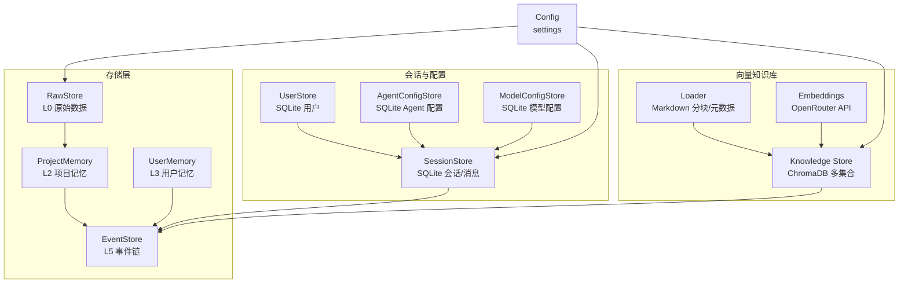

图表来源
- [backend/app/storage/raw_store.py:19-134](file://backend/app/storage/raw_store.py#L19-L134)
- [backend/app/storage/project_memory.py:20-141](file://backend/app/storage/project_memory.py#L20-L141)
- [backend/app/storage/user_memory.py:18-84](file://backend/app/storage/user_memory.py#L18-L84)
- [backend/app/storage/event_store.py:59-269](file://backend/app/storage/event_store.py#L59-L269)
- [backend/app/storage/session_store.py:27-251](file://backend/app/storage/session_store.py#L27-L251)
- [backend/app/storage/user_store.py:22-133](file://backend/app/storage/user_store.py#L22-L133)
- [backend/app/storage/agent_config_store.py:163-310](file://backend/app/storage/agent_config_store.py#L163-L310)
- [backend/app/storage/model_config_store.py:20-174](file://backend/app/storage/model_config_store.py#L20-L174)
- [backend/app/knowledge/store.py:43-227](file://backend/app/knowledge/store.py#L43-L227)
- [backend/app/knowledge/loader.py:57-142](file://backend/app/knowledge/loader.py#L57-L142)
- [backend/app/knowledge/embeddings.py:19-35](file://backend/app/knowledge/embeddings.py#L19-L35)
- [backend/app/config.py:39-46](file://backend/app/config.py#L39-L46)

章节来源
- [backend/app/storage/__init__.py:1-2](file://backend/app/storage/__init__.py#L1-L2)
- [backend/app/config.py:39-46](file://backend/app/config.py#L39-L46)

## 核心组件
- L0 原始数据存储（RawStore）：读取 data/raw/ 下的静态 JSON/MARKDOWN，按需缓存至内存，提供 HS 编码、VAT 税率、认证矩阵等查询能力。
- L2 项目/产品记忆（ProjectMemory）：按产品维度持久化合规检查历史，支持追加写入与历史查询。
- L3 用户记忆（UserMemory）：按用户维度持久化画像/偏好/历史，支持合并更新与常用市场、近期搜索记录维护。
- L5 事件链（EventStore）：统一记录系统事件与用户操作链，支持按条件筛选、链 ID 列表、向后兼容旧目录迁移。
- 会话存储（SessionStore）：SQLite 存储会话与消息，带索引与外键约束，支持最近消息检索与级联删除。
- 用户存储（UserStore）：SQLite 用户表，密码哈希、唯一用户名约束、管理员初始化。
- Agent 配置存储（AgentConfigStore）：SQLite 存储多 Agent 配置，含默认预设与启用排序。
- 模型配置存储（ModelConfigStore）：SQLite 存储大模型与嵌入配置，支持激活切换与热重载 settings。
- 向量知识库（ChromaDB）：多市场集合，SentenceTransformer 嵌入，支持 upsert、查询、统计与清理。

章节来源
- [backend/app/storage/raw_store.py:19-134](file://backend/app/storage/raw_store.py#L19-L134)
- [backend/app/storage/project_memory.py:20-141](file://backend/app/storage/project_memory.py#L20-L141)
- [backend/app/storage/user_memory.py:18-84](file://backend/app/storage/user_memory.py#L18-L84)
- [backend/app/storage/event_store.py:59-269](file://backend/app/storage/event_store.py#L59-L269)
- [backend/app/storage/session_store.py:27-251](file://backend/app/storage/session_store.py#L27-L251)
- [backend/app/storage/user_store.py:22-133](file://backend/app/storage/user_store.py#L22-L133)
- [backend/app/storage/agent_config_store.py:163-310](file://backend/app/storage/agent_config_store.py#L163-L310)
- [backend/app/storage/model_config_store.py:20-174](file://backend/app/storage/model_config_store.py#L20-L174)
- [backend/app/knowledge/store.py:43-227](file://backend/app/knowledge/store.py#L43-L227)

## 架构总览
分层存储采用“L0-L5”层级划分，分别对应原始数据、项目记忆、用户记忆、会话与配置、事件链与审计。向量知识库独立于 L1 层，通过 ChromaDB 实现多市场集合与语义检索。

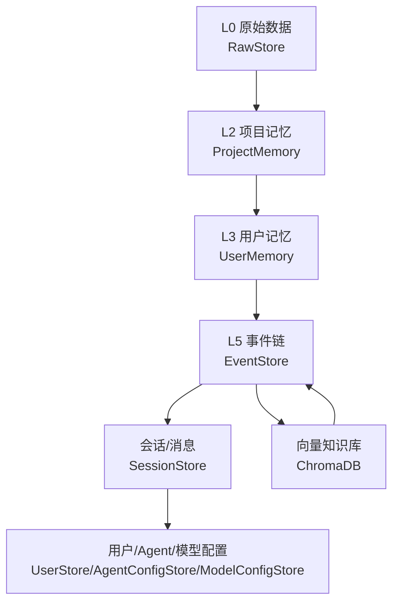

图表来源
- [backend/app/storage/raw_store.py:19-134](file://backend/app/storage/raw_store.py#L19-L134)
- [backend/app/storage/project_memory.py:20-141](file://backend/app/storage/project_memory.py#L20-L141)
- [backend/app/storage/user_memory.py:18-84](file://backend/app/storage/user_memory.py#L18-L84)
- [backend/app/storage/event_store.py:59-269](file://backend/app/storage/event_store.py#L59-L269)
- [backend/app/storage/session_store.py:27-251](file://backend/app/storage/session_store.py#L27-L251)
- [backend/app/storage/user_store.py:22-133](file://backend/app/storage/user_store.py#L22-L133)
- [backend/app/storage/agent_config_store.py:163-310](file://backend/app/storage/agent_config_store.py#L163-L310)
- [backend/app/storage/model_config_store.py:20-174](file://backend/app/storage/model_config_store.py#L20-L174)
- [backend/app/knowledge/store.py:43-227](file://backend/app/knowledge/store.py#L43-L227)

## 详细组件分析

### 用户存储（UserStore）
- 数据模型：users 表，包含 id、username（唯一）、hashed_pw、role、created_at。
- 访问模式：创建用户（唯一用户名约束）、按 id/username 查询、枚举列表、删除、更新角色与密码。
- 安全与一致性：bcrypt 哈希、异常捕获用户名冲突、初始化默认管理员。
- 并发与事务：单连接池（全局连接），提交/回滚由调用方控制；建议上层封装事务。

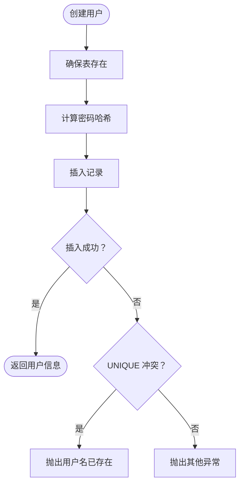

图表来源
- [backend/app/storage/user_store.py:48-65](file://backend/app/storage/user_store.py#L48-L65)

章节来源
- [backend/app/storage/user_store.py:22-133](file://backend/app/storage/user_store.py#L22-L133)

### 会话存储（SessionStore）
- 数据模型：sessions（id、title、created_at、updated_at、user_id 可选）与 messages（id、session_id 外键、role、content、合规/意图/来源 JSON、created_at）。
- 访问模式：创建会话、分页列出会话（支持按 user_id 过滤）、获取会话详情（含消息列表）、最近 N 条消息、新增消息（同步更新会话 updated_at）、删除会话（CASCADE 删除消息）、更新标题。
- 性能优化：messages(session_id) 与 sessions(updated_at DESC) 索引；消息查询按时间排序；JSON 字段序列化/反序列化。
- 并发与事务：全局连接，外键约束保障引用完整性；建议上层使用事务包裹批量写入。

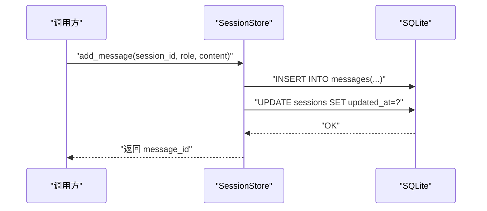

图表来源
- [backend/app/storage/session_store.py:186-217](file://backend/app/storage/session_store.py#L186-L217)

章节来源
- [backend/app/storage/session_store.py:27-251](file://backend/app/storage/session_store.py#L27-L251)

### 原始数据存储（RawStore）
- 数据模型：以 data/raw/ 下的 JSON/MARKDOWN 文件为数据源，按 category/filename 缓存至内存。
- 访问模式：HS 编码加载与模糊匹配、VAT 税率查询、认证矩阵查询；支持缓存失效与热加载。
- 性能优化：模块加载时一次性读取并缓存，后续访问走内存；提供按类别/文件粒度的缓存清理。
- 适用场景：确定性合规检查（HS/VAT/认证）的快速匹配。

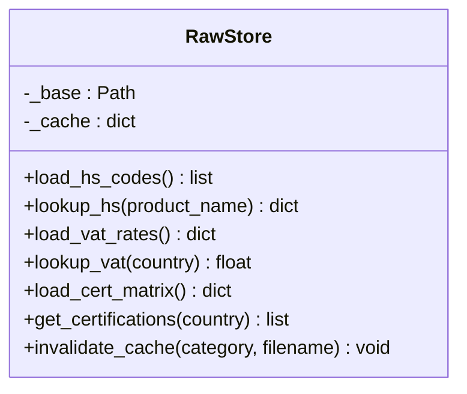

图表来源
- [backend/app/storage/raw_store.py:19-134](file://backend/app/storage/raw_store.py#L19-L134)

章节来源
- [backend/app/storage/raw_store.py:19-134](file://backend/app/storage/raw_store.py#L19-L134)

### 项目记忆（ProjectMemory）
- 数据模型：按 product_id 创建目录，文件 compliance.json 记录产品合规历史。
- 访问模式：保存合规记录（追加到历史）、读取历史、获取最新检查、列出产品摘要。
- 隔离与一致性：按产品隔离；写入时原子化覆盖文件；读取失败返回空历史。
- 时序：合规检查完成后写入 L2，再写入 L4（会话记忆）与 L5（事件链）。

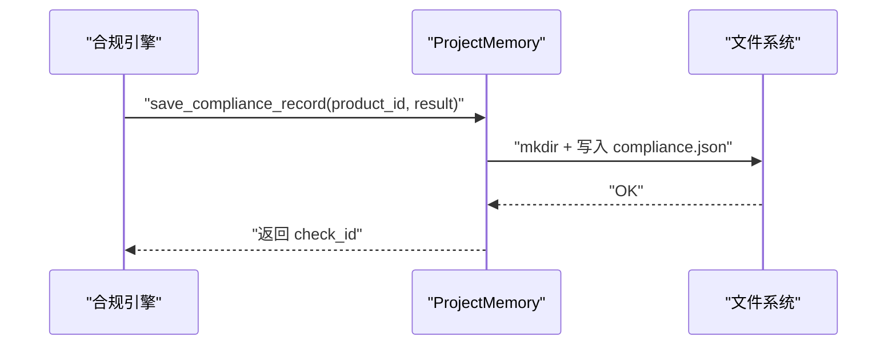

图表来源
- [backend/app/storage/project_memory.py:36-87](file://backend/app/storage/project_memory.py#L36-L87)

章节来源
- [backend/app/storage/project_memory.py:20-141](file://backend/app/storage/project_memory.py#L20-L141)

### 用户记忆（UserMemory）
- 数据模型：按 user_id 创建目录，文件 profile.json 记录用户画像与偏好。
- 访问模式：保存/更新画像（合并现有数据）、更新常用目标市场、记录近期搜索（去重并限制长度）。
- 隔离与一致性：按用户隔离；合并更新避免覆盖已有字段。

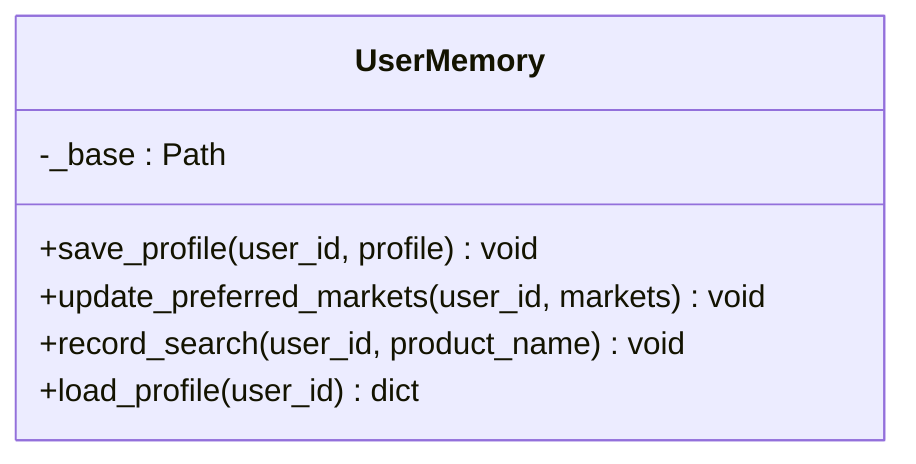

图表来源
- [backend/app/storage/user_memory.py:18-84](file://backend/app/storage/user_memory.py#L18-L84)

章节来源
- [backend/app/storage/user_memory.py:18-84](file://backend/app/storage/user_memory.py#L18-L84)

### 事件链（EventStore）
- 数据模型：系统事件链（data/event_chain/system_events/*.json）与用户操作链（data/event_chain/action_chains/*.json），统一 EventRecord 结构。
- 访问模式：添加系统事件/用户事件、读取链、按条件筛选、列出链 ID、向后兼容旧目录迁移。
- 隔离与一致性：全局事件与用户链分离；链内事件追加写入；链元数据包含总数与更新时间。
- 运维：提供迁移脚本，将旧目录 data/chains/actions 与 data/chains/events 迁移至新结构。

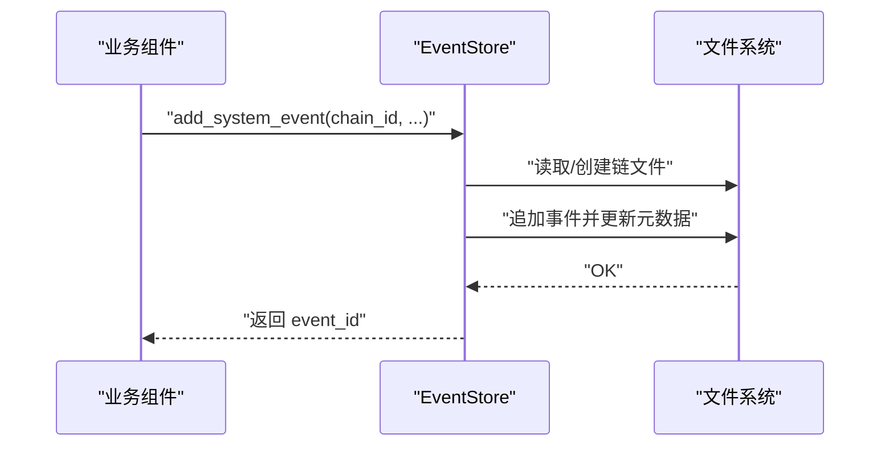

图表来源
- [backend/app/storage/event_store.py:76-115](file://backend/app/storage/event_store.py#L76-L115)

章节来源
- [backend/app/storage/event_store.py:59-269](file://backend/app/storage/event_store.py#L59-L269)
- [backend/scripts/migrate_storage.py:61-68](file://backend/scripts/migrate_storage.py#L61-L68)

### Agent 配置存储（AgentConfigStore）
- 数据模型：agent_configs 表，包含 id、name、type、description、system_prompt、enabled、sort_order、created_at、updated_at。
- 访问模式：列出（可仅启用）、按 id/类型查询、增删改、启用状态切换、获取通用 system prompt。
- 默认预设：内置多个 Agent 类型与默认 system prompt；不可删除内置固定 id 的记录。
- 与会话存储共享数据库（sessions.db），通过公共连接获取函数复用。

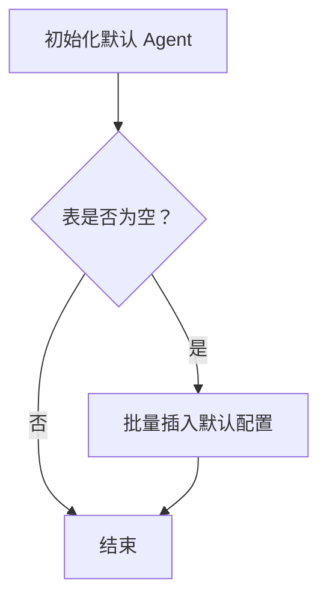

图表来源
- [backend/app/storage/agent_config_store.py:183-198](file://backend/app/storage/agent_config_store.py#L183-L198)

章节来源
- [backend/app/storage/agent_config_store.py:163-310](file://backend/app/storage/agent_config_store.py#L163-L310)

### 模型配置存储（ModelConfigStore）
- 数据模型：model_configs 表，包含 id、name、api_key（部分接口遮蔽显示）、base_url、model、temperature、top_p、max_tokens、embed_model、is_active、created_at、updated_at。
- 访问模式：列出（可选择是否包含密钥）、获取激活配置、新建/更新、设置激活（同时将其余置为非激活）、删除、热重载 settings。
- 热重载：激活后同步更新全局 settings，使后续客户端重建生效。

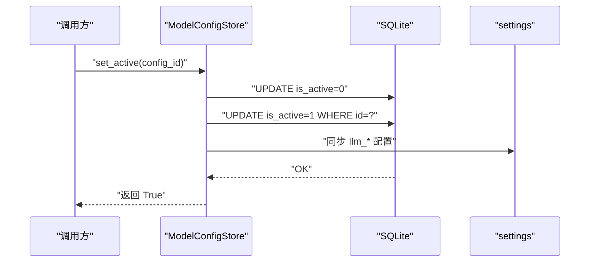

图表来源
- [backend/app/storage/model_config_store.py:118-132](file://backend/app/storage/model_config_store.py#L118-L132)

章节来源
- [backend/app/storage/model_config_store.py:20-174](file://backend/app/storage/model_config_store.py#L20-L174)

### 向量数据库集成（ChromaDB）
- 集成方式：ChromaDB 持久化客户端，按市场创建 collection（eu_knowledge、us_knowledge 等），使用 SentenceTransformer 嵌入函数（本地模型，避免网络下载）。
- 写入：upsert_documents 支持幂等写入，ID 由 regulation_id 与索引组合；自动嵌入生成。
- 查询：search 支持指定市场或自动推断；若推断无结果则全库聚合返回；异常降级为空结果。
- 元数据：写入时附带 regulation_id、regulation_name、source_url、effective_date、tags 等，便于溯源与展示。
- 降级策略：ChromaDB 查询异常时记录警告并返回空结果，不阻塞主流程。

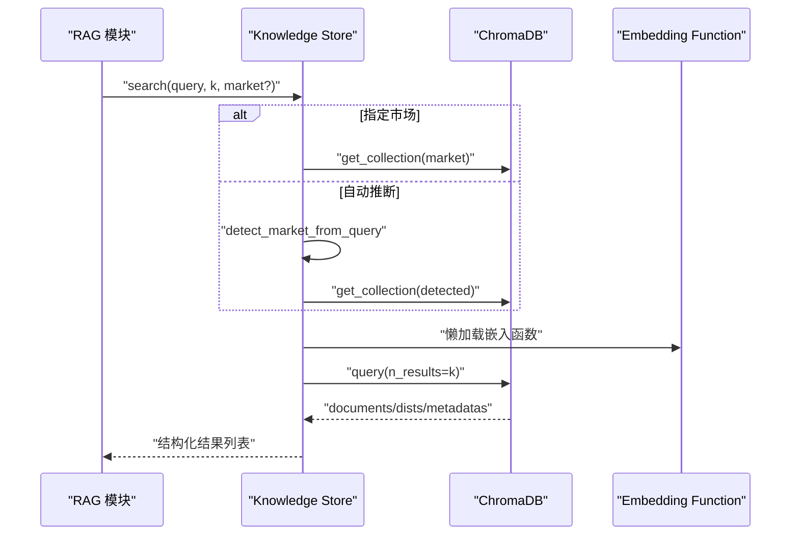

图表来源
- [backend/app/knowledge/store.py:127-192](file://backend/app/knowledge/store.py#L127-L192)

章节来源
- [backend/app/knowledge/store.py:43-227](file://backend/app/knowledge/store.py#L43-L227)
- [backend/app/knowledge/loader.py:57-142](file://backend/app/knowledge/loader.py#L57-L142)
- [backend/app/knowledge/embeddings.py:19-35](file://backend/app/knowledge/embeddings.py#L19-L35)

## 依赖分析
- 存储层内部耦合：EventStore 与 SessionStore 在业务上紧密协作（事件驱动会话生命周期），UserStore 与 SessionStore 通过 user_id 关联。
- 外部依赖：ChromaDB（向量检索）、SQLite（本地持久化）、SentenceTransformer（本地嵌入）、OpenAI/OpenRouter（可选嵌入 API）。
- 配置中心：settings 统一管理 data_dir、chroma_persist_dir、LLM/Embedding 参数，影响所有存储组件的行为。

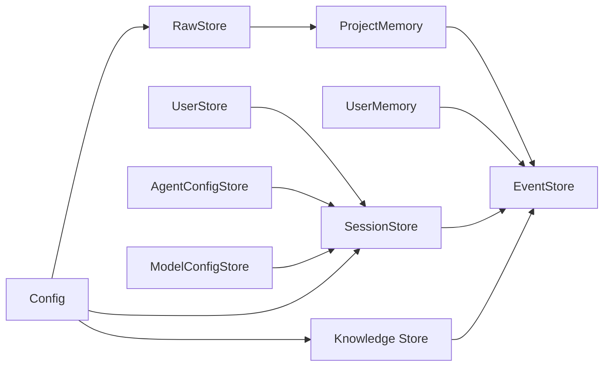

图表来源
- [backend/app/storage/user_store.py:15-15](file://backend/app/storage/user_store.py#L15-L15)
- [backend/app/storage/agent_config_store.py:20-20](file://backend/app/storage/agent_config_store.py#L20-L20)
- [backend/app/storage/model_config_store.py:15-15](file://backend/app/storage/model_config_store.py#L15-L15)
- [backend/app/storage/project_memory.py:17-17](file://backend/app/storage/project_memory.py#L17-L17)
- [backend/app/storage/user_memory.py:15-15](file://backend/app/storage/user_memory.py#L15-L15)
- [backend/app/knowledge/store.py:18-18](file://backend/app/knowledge/store.py#L18-L18)
- [backend/app/config.py:40-46](file://backend/app/config.py#L40-L46)

章节来源
- [backend/app/config.py:39-46](file://backend/app/config.py#L39-L46)
- [backend/app/models/database.py:3-9](file://backend/app/models/database.py#L3-L9)

## 性能考虑
- 索引与查询优化
  - SessionStore：messages(session_id) 与 sessions(updated_at DESC) 索引，提升会话列表与消息查询效率。
  - RawStore：内存缓存避免重复磁盘 IO；按需失效与热加载。
- 写入批量化与幂等
  - Knowledge Store：upsert_documents 使用 ID 前缀规则实现幂等写入，避免重复。
- 嵌入与检索
  - ChromaDB：使用 cosine 距离空间；懒加载嵌入函数减少启动开销；查询异常降级。
- 并发与事务
  - SQLite：全局连接，建议上层使用事务包裹批量写入；避免长时间持有连接。
- I/O 与容量
  - 事件链与记忆层：文件系统写入，注意磁盘空间与日志轮转；定期清理历史与归档。

## 故障排查指南
- 用户存储
  - 唯一约束冲突：用户名已存在时抛出异常，检查输入或清理重复项。
  - 密码校验失败：确认 bcrypt 哈希算法一致与存储正确。
- 会话存储
  - 外键约束：删除会话前确认消息已级联删除；检查 session_id 是否有效。
  - JSON 解析：消息字段为 JSON 文本，解析失败返回 None，检查写入端序列化。
- 原始数据存储
  - 文件缺失：缓存命中失败时返回空对象，检查 data/raw/ 目录结构与权限。
- 事件链
  - 旧目录迁移：使用迁移脚本将 data/chains/actions 与 data/chains/events 迁移至新结构。
  - 查询异常：ChromaDB 查询失败会记录警告并返回空结果，检查 ChromaDB 可用性与集合状态。
- 向量知识库
  - 模型加载：SentenceTransformer 嵌入函数懒加载，首次使用可能触发模型下载；确保本地可访问模型文件。
  - 查询降级：异常时返回空结果，不影响主流程；检查日志定位具体错误。

章节来源
- [backend/app/storage/user_store.py:61-64](file://backend/app/storage/user_store.py#L61-L64)
- [backend/app/storage/session_store.py:55-69](file://backend/app/storage/session_store.py#L55-L69)
- [backend/app/storage/event_store.py:224-268](file://backend/app/storage/event_store.py#L224-L268)
- [backend/app/knowledge/store.py:171-173](file://backend/app/knowledge/store.py#L171-L173)

## 结论
本项目采用清晰的分层存储架构：L0 原始数据、L2/L3 记忆层、L5 事件链与会话/配置层协同工作，向量知识库独立集成并提供语义检索能力。通过索引、缓存、幂等写入与异常降级等策略，兼顾性能与可靠性。建议在生产环境中强化事务管理、监控与容量规划，并持续优化向量检索与嵌入策略。

## 附录

### 数据迁移策略
- 迁移内容
  - 原始数据：hs_codes.json、vat_rates.json、regulations.md → data/raw/ 下对应目录。
  - 事件链：data/chains/actions/*.json 与 data/chains/events/*.json → data/event_chain/system_events/。
  - 认证矩阵：cert_matrix.json → data/raw/certifications/cert_matrix.json。
- 执行方式：运行迁移脚本，输出迁移统计；完成后可手动清理旧文件。

章节来源
- [backend/scripts/migrate_storage.py:27-94](file://backend/scripts/migrate_storage.py#L27-L94)

### 备份与恢复
- 备份对象
  - SQLite 数据库：sessions.db（包含用户、会话、Agent、模型配置等）。
  - 文件系统数据：data/raw、data/project_memory、data/user_memory、data/event_chain、data/chroma。
- 恢复步骤
  - 停止服务 → 备份上述目录 → 恢复目标目录 → 启动服务 → 校验数据完整性（事件链/会话/记忆层）。

### 存储容量规划
- 估算依据
  - 事件链：按每日事件数量与平均大小估算；建议按月/季度轮转与压缩。
  - 记忆层：按产品/用户数量与历史长度估算；定期清理长期未使用的历史。
  - 向量库：按文档块数量与嵌入维度估算；合理设置 k 与集合数量。
- 建议
  - 设置磁盘配额与告警阈值；定期清理与归档；监控 I/O 与 CPU 使用。

### 存储性能监控
- 指标建议
  - SQLite：连接数、慢查询、锁等待、表大小。
  - 文件系统：读写延迟、磁盘使用率、inode 使用率。
  - ChromaDB：集合数量、文档计数、查询耗时、嵌入函数加载时间。
- 工具与手段
  - 使用系统监控工具与应用日志；对关键路径埋点；定期生成报表。