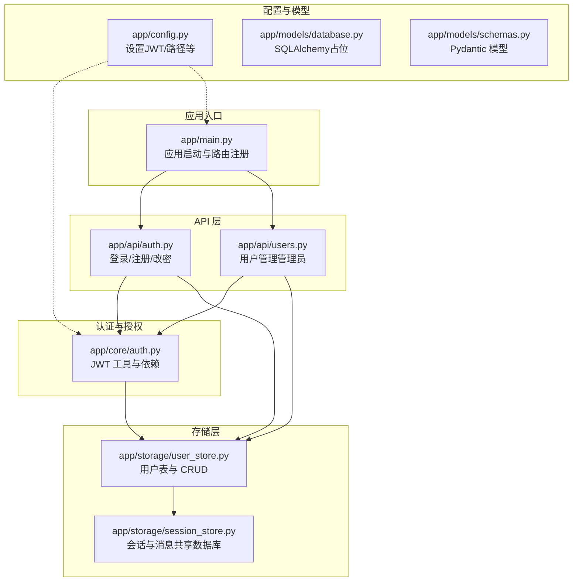
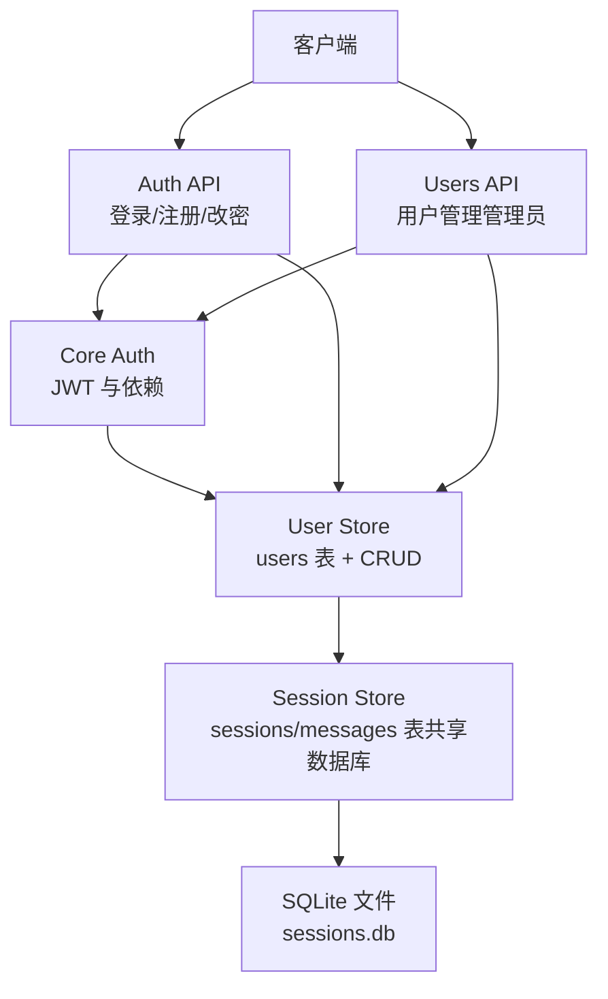
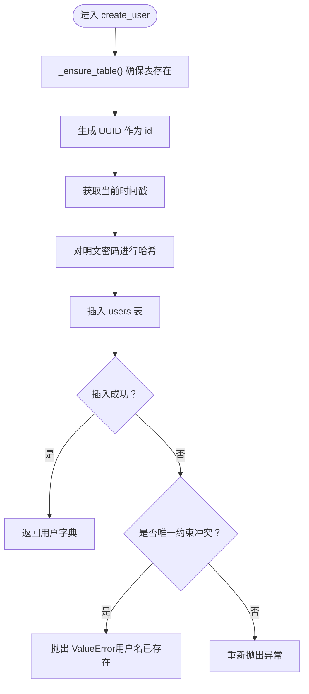
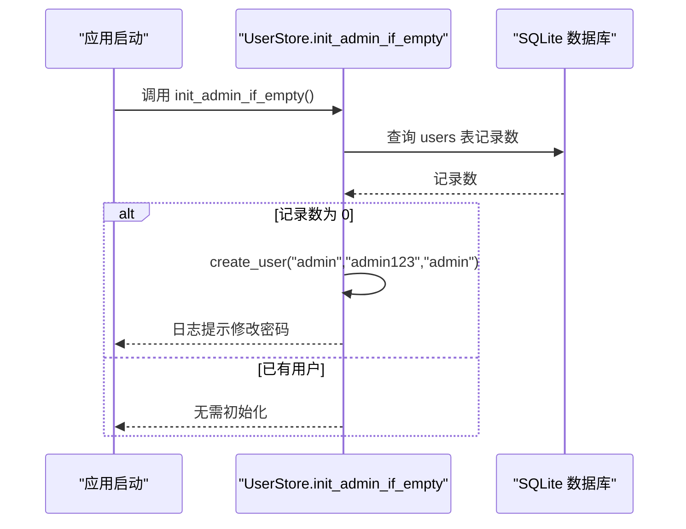
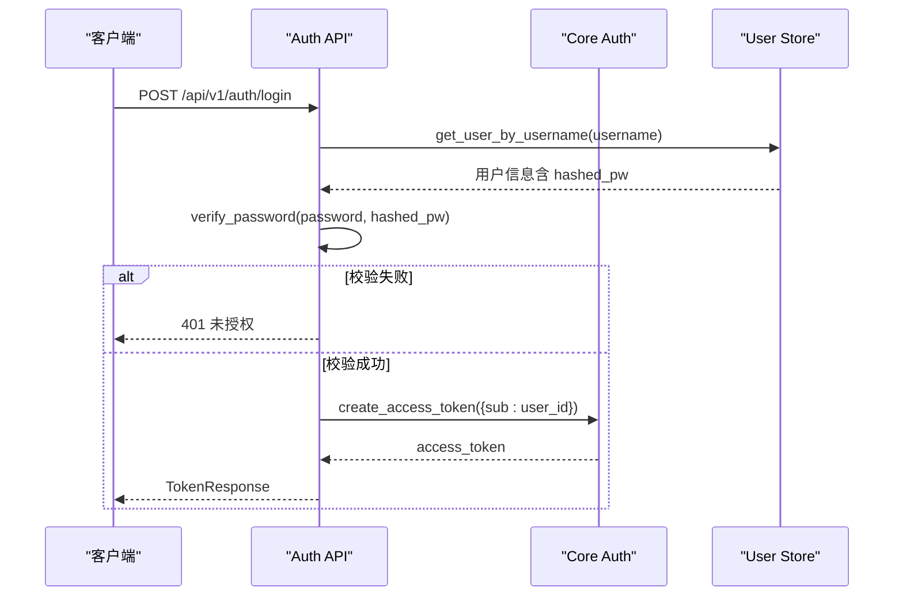
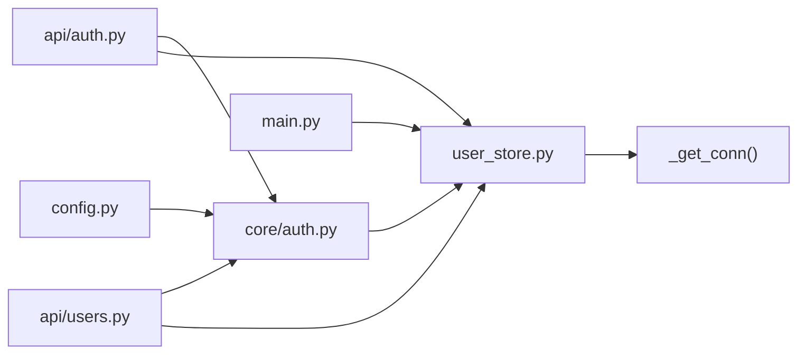

# 用户存储

<cite>
**本文引用的文件**
- [backend/app/storage/user_store.py](file://backend/app/storage/user_store.py)
- [backend/app/storage/session_store.py](file://backend/app/storage/session_store.py)
- [backend/app/api/users.py](file://backend/app/api/users.py)
- [backend/app/api/auth.py](file://backend/app/api/auth.py)
- [backend/app/core/auth.py](file://backend/app/core/auth.py)
- [backend/app/main.py](file://backend/app/main.py)
- [backend/app/config.py](file://backend/app/config.py)
- [backend/app/models/schemas.py](file://backend/app/models/schemas.py)
- [backend/app/models/database.py](file://backend/app/models/database.py)
</cite>

## 目录
1. [简介](#简介)
2. [项目结构](#项目结构)
3. [核心组件](#核心组件)
4. [架构总览](#架构总览)
5. [详细组件分析](#详细组件分析)
6. [依赖分析](#依赖分析)
7. [性能考量](#性能考量)
8. [故障排查指南](#故障排查指南)
9. [结论](#结论)
10. [附录](#附录)

## 简介
本文件系统性梳理“用户存储”模块，聚焦于基于 SQLite 的用户表设计（users: id, username, hashed_pw, role, created_at）、密码哈希机制（passlib 的 bcrypt 方案）、用户认证与授权流程、以及完整的 CRUD 实现（创建、查询、列表、删除、更新角色与密码）。同时涵盖管理员账户初始化、错误处理策略、并发访问控制与安全考虑，并提供实际使用示例与最佳实践建议。

## 项目结构
用户存储模块位于后端应用的存储层，采用 SQLite 单机数据库，复用会话存储的数据库文件（sessions.db），通过统一的连接工厂进行访问。认证与授权在核心层实现，API 层负责对外暴露端点并进行权限校验。

图表来源
- [backend/app/main.py:1-76](file://backend/app/main.py#L1-L76)
- [backend/app/api/auth.py:1-108](file://backend/app/api/auth.py#L1-L108)
- [backend/app/api/users.py:1-55](file://backend/app/api/users.py#L1-L55)
- [backend/app/core/auth.py:1-60](file://backend/app/core/auth.py#L1-L60)
- [backend/app/storage/user_store.py:1-133](file://backend/app/storage/user_store.py#L1-L133)
- [backend/app/storage/session_store.py:1-251](file://backend/app/storage/session_store.py#L1-L251)
- [backend/app/config.py:1-78](file://backend/app/config.py#L1-L78)
- [backend/app/models/database.py:1-15](file://backend/app/models/database.py#L1-L15)
- [backend/app/models/schemas.py:1-264](file://backend/app/models/schemas.py#L1-L264)

章节来源
- [backend/app/main.py:1-76](file://backend/app/main.py#L1-L76)
- [backend/app/storage/user_store.py:1-133](file://backend/app/storage/user_store.py#L1-L133)
- [backend/app/storage/session_store.py:1-251](file://backend/app/storage/session_store.py#L1-L251)
- [backend/app/api/auth.py:1-108](file://backend/app/api/auth.py#L1-L108)
- [backend/app/api/users.py:1-55](file://backend/app/api/users.py#L1-L55)
- [backend/app/core/auth.py:1-60](file://backend/app/core/auth.py#L1-L60)
- [backend/app/config.py:1-78](file://backend/app/config.py#L1-L78)
- [backend/app/models/database.py:1-15](file://backend/app/models/database.py#L1-L15)
- [backend/app/models/schemas.py:1-264](file://backend/app/models/schemas.py#L1-L264)

## 核心组件
- 用户存储（SQLite）：提供用户表结构、密码哈希与校验、用户 CRUD 操作、管理员初始化。
- 认证与授权：基于 JWT 的登录签发、当前用户解析、管理员权限校验。
- API 层：对外暴露登录/注册/改密、用户列表、删除用户、修改角色等端点。
- 启动流程：应用启动时自动初始化管理员账户。

章节来源
- [backend/app/storage/user_store.py:1-133](file://backend/app/storage/user_store.py#L1-L133)
- [backend/app/core/auth.py:1-60](file://backend/app/core/auth.py#L1-L60)
- [backend/app/api/auth.py:1-108](file://backend/app/api/auth.py#L1-L108)
- [backend/app/api/users.py:1-55](file://backend/app/api/users.py#L1-L55)
- [backend/app/main.py:60-70](file://backend/app/main.py#L60-L70)

## 架构总览
用户存储模块围绕 SQLite 单机数据库展开，采用“表驱动 + 连接池式访问”的模式。用户表与会话表共享同一数据库文件，确保资源最小化与一致性。认证流程通过 API 层与核心认证模块协作，结合存储层的用户数据完成鉴权与授权。

图表来源
- [backend/app/api/auth.py:1-108](file://backend/app/api/auth.py#L1-L108)
- [backend/app/api/users.py:1-55](file://backend/app/api/users.py#L1-L55)
- [backend/app/core/auth.py:1-60](file://backend/app/core/auth.py#L1-L60)
- [backend/app/storage/user_store.py:1-133](file://backend/app/storage/user_store.py#L1-L133)
- [backend/app/storage/session_store.py:1-251](file://backend/app/storage/session_store.py#L1-L251)

## 详细组件分析

### 用户表设计与约束
- 表名：users
- 字段与约束
  - id：TEXT，主键
  - username：TEXT，唯一且非空
  - hashed_pw：TEXT，非空（存储 bcrypt 哈希后的密码）
  - role：TEXT，非空，默认为 "user"
  - created_at：INTEGER，非空（Unix 秒时间戳）
- 索引
  - username 唯一索引（由 UNIQUE 约束提供）
  - 未显式定义额外索引，但查询通常按 id 或 username 进行，SQLite 可利用主键与唯一索引高效定位
- 设计要点
  - 使用 bcrypt 存储密码，避免明文存储
  - role 限定为 "admin" 或 "user"，便于权限控制
  - created_at 便于审计与排序

章节来源
- [backend/app/storage/user_store.py:22-34](file://backend/app/storage/user_store.py#L22-L34)

### 密码哈希机制（bcrypt）
- 使用 passlib 的 CryptContext，启用 bcrypt 方案
- 提供两个工具函数
  - hash_password：对明文密码生成哈希
  - verify_password：校验明文密码与哈希值
- 安全性
  - bcrypt 具备自适应成本因子，抗暴力破解
  - 哈希不可逆，满足安全存储要求

章节来源
- [backend/app/storage/user_store.py:13-17](file://backend/app/storage/user_store.py#L13-L17)
- [backend/app/storage/user_store.py:38-43](file://backend/app/storage/user_store.py#L38-L43)

### 用户 CRUD 实现
- create_user
  - 生成 UUID 作为用户 id
  - 记录当前 Unix 时间戳
  - 对明文密码进行哈希后再入库
  - 唯一约束冲突时抛出 ValueError（由上层 API 转换为 409 冲突）
- get_user_by_username / get_user_by_id
  - 返回字典形式的用户信息（不含敏感字段）
- list_users
  - 返回用户列表，按创建时间升序排列
- delete_user
  - 删除指定 id 的用户，返回是否删除成功
- update_role
  - 更新用户角色，仅支持 "admin" 或 "user"
- update_password
  - 更新用户密码，先对新密码进行哈希再写入

图表来源
- [backend/app/storage/user_store.py:48-65](file://backend/app/storage/user_store.py#L48-L65)

章节来源
- [backend/app/storage/user_store.py:48-119](file://backend/app/storage/user_store.py#L48-L119)

### 管理员账户初始化（init_admin_if_empty）
- 在应用启动时调用
- 若 users 表为空，则自动创建默认管理员账户（用户名：admin，密码：admin123），角色为 admin
- 初始化完成后记录日志提醒修改密码

图表来源
- [backend/app/main.py:64-69](file://backend/app/main.py#L64-L69)
- [backend/app/storage/user_store.py:122-133](file://backend/app/storage/user_store.py#L122-L133)

章节来源
- [backend/app/main.py:60-70](file://backend/app/main.py#L60-L70)
- [backend/app/storage/user_store.py:122-133](file://backend/app/storage/user_store.py#L122-L133)

### 认证与授权流程
- 登录
  - API 接收用户名与密码
  - 通过 get_user_by_username 获取用户
  - 使用 verify_password 校验密码
  - 成功后签发 JWT（包含用户 id）
- 当前用户
  - 通过 OAuth2 bearer 令牌解析用户信息
  - 从用户表加载当前用户
- 管理员权限
  - 依赖 require_admin 校验角色为 "admin"
  - 限制管理员自身不可删除或修改自身角色

图表来源
- [backend/app/api/auth.py:54-68](file://backend/app/api/auth.py#L54-L68)
- [backend/app/core/auth.py:19-25](file://backend/app/core/auth.py#L19-L25)
- [backend/app/storage/user_store.py:68-75](file://backend/app/storage/user_store.py#L68-L75)
- [backend/app/storage/user_store.py:42-43](file://backend/app/storage/user_store.py#L42-L43)

章节来源
- [backend/app/api/auth.py:1-108](file://backend/app/api/auth.py#L1-L108)
- [backend/app/core/auth.py:1-60](file://backend/app/core/auth.py#L1-L60)
- [backend/app/storage/user_store.py:42-75](file://backend/app/storage/user_store.py#L42-L75)

### 管理员用户管理 API
- 获取用户列表：仅管理员可访问
- 删除用户：禁止删除自身；不存在时返回 404
- 修改角色：仅允许 "admin"/"user"；禁止修改自身角色；不存在时返回 404

章节来源
- [backend/app/api/users.py:1-55](file://backend/app/api/users.py#L1-L55)

### 数据验证与错误处理
- API 层对输入进行严格校验（如角色枚举、密码长度）
- 存储层对唯一约束冲突抛出 ValueError，由 API 层转换为 409
- 认证层对无效 token、用户不存在等情况返回 401/403

章节来源
- [backend/app/api/users.py:47-50](file://backend/app/api/users.py#L47-L50)
- [backend/app/api/auth.py:83-89](file://backend/app/api/auth.py#L83-L89)
- [backend/app/api/auth.py:104-107](file://backend/app/api/auth.py#L104-L107)
- [backend/app/storage/user_store.py:61-64](file://backend/app/storage/user_store.py#L61-L64)

### 并发访问控制
- SQLite 以文件为基础，使用单文件锁保证一致性
- 通过全局连接对象与 check_same_thread=False 的设置，允许跨线程访问
- 建议在高并发场景下评估迁移至更健壮的数据库（如 PostgreSQL）

章节来源
- [backend/app/storage/session_store.py:27-34](file://backend/app/storage/session_store.py#L27-L34)

## 依赖分析
- user_store 依赖 session_store 的连接工厂（_get_conn），从而共享 sessions.db
- API 层依赖 core/auth 提供的依赖（get_current_user、require_admin）
- 认证流程依赖 config 中的 JWT 设置（密钥与过期时间）

图表来源
- [backend/app/storage/user_store.py:15-17](file://backend/app/storage/user_store.py#L15-L17)
- [backend/app/storage/session_store.py:27-34](file://backend/app/storage/session_store.py#L27-L34)
- [backend/app/api/auth.py:8-14](file://backend/app/api/auth.py#L8-L14)
- [backend/app/api/users.py:6-7](file://backend/app/api/users.py#L6-L7)
- [backend/app/core/auth.py:12-12](file://backend/app/core/auth.py#L12-L12)
- [backend/app/main.py:64-69](file://backend/app/main.py#L64-L69)
- [backend/app/config.py:68-70](file://backend/app/config.py#L68-L70)

章节来源
- [backend/app/storage/user_store.py:1-133](file://backend/app/storage/user_store.py#L1-L133)
- [backend/app/storage/session_store.py:1-251](file://backend/app/storage/session_store.py#L1-L251)
- [backend/app/api/auth.py:1-108](file://backend/app/api/auth.py#L1-L108)
- [backend/app/api/users.py:1-55](file://backend/app/api/users.py#L1-L55)
- [backend/app/core/auth.py:1-60](file://backend/app/core/auth.py#L1-L60)
- [backend/app/main.py:60-70](file://backend/app/main.py#L60-L70)
- [backend/app/config.py:1-78](file://backend/app/config.py#L1-L78)

## 性能考量
- SQLite 单文件模型简单可靠，适合小规模应用；在高并发写入场景下可能成为瓶颈
- 建议在生产环境评估迁移到 PostgreSQL 等数据库，以获得更好的并发与可靠性
- 对于频繁查询，可在 username 上建立索引（当前由 UNIQUE 约束提供），并根据业务需求评估是否增加复合索引

[本节为通用指导，不直接分析具体文件]

## 故障排查指南
- 登录失败
  - 检查用户名是否存在与密码是否正确
  - 确认 bcrypt 哈希一致
- 注册冲突
  - 若提示用户名已存在，更换用户名后重试
- 删除/改密失败
  - 确认用户是否存在
  - 管理员不可删除或修改自身
- 启动未创建默认管理员
  - 确认 init_admin_if_empty 是否被调用
  - 检查数据库文件路径与权限

章节来源
- [backend/app/api/auth.py:57-61](file://backend/app/api/auth.py#L57-L61)
- [backend/app/api/auth.py:87-89](file://backend/app/api/auth.py#L87-L89)
- [backend/app/api/users.py:33-34](file://backend/app/api/users.py#L33-L34)
- [backend/app/api/users.py:49-50](file://backend/app/api/users.py#L49-L50)
- [backend/app/main.py:64-69](file://backend/app/main.py#L64-L69)
- [backend/app/storage/user_store.py:61-64](file://backend/app/storage/user_store.py#L61-L64)

## 结论
用户存储模块以 SQLite 为核心，结合 bcrypt 密码哈希与 JWT 认证，提供了简洁而安全的用户管理能力。通过管理员初始化与严格的权限控制，保障了系统的初始可用性与安全性。建议在生产环境中进一步评估数据库选型与并发策略，以满足更高性能与可靠性需求。

[本节为总结性内容，不直接分析具体文件]

## 附录

### 实际使用示例（路径指引）
- 登录
  - 端点：POST /api/v1/auth/login
  - 输入：用户名与密码
  - 输出：access_token、角色、用户名、用户 id
  - 参考：[backend/app/api/auth.py:54-68](file://backend/app/api/auth.py#L54-L68)
- 注册（管理员）
  - 端点：POST /api/v1/auth/register
  - 输入：用户名、密码、角色（admin 或 user）
  - 输出：用户信息（不含哈希）
  - 参考：[backend/app/api/auth.py:81-89](file://backend/app/api/auth.py#L81-L89)
- 获取当前用户
  - 端点：GET /api/v1/auth/me
  - 输出：用户信息
  - 参考：[backend/app/api/auth.py:92-94](file://backend/app/api/auth.py#L92-L94)
- 修改密码（当前用户）
  - 端点：PUT /api/v1/auth/me/password
  - 输入：旧密码、新密码（至少 6 位）
  - 输出：修改结果
  - 参考：[backend/app/api/auth.py:97-107](file://backend/app/api/auth.py#L97-L107)
- 管理员获取用户列表
  - 端点：GET /api/v1/users
  - 输出：用户列表
  - 参考：[backend/app/api/users.py:23-25](file://backend/app/api/users.py#L23-L25)
- 管理员删除用户
  - 端点：DELETE /api/v1/users/{user_id}
  - 输出：ok
  - 参考：[backend/app/api/users.py:28-38](file://backend/app/api/users.py#L28-L38)
- 管理员修改用户角色
  - 端点：PUT /api/v1/users/{user_id}/role
  - 输入：role（admin 或 user）
  - 输出：ok
  - 参考：[backend/app/api/users.py:41-54](file://backend/app/api/users.py#L41-L54)

### 最佳实践建议
- 生产部署
  - 更换默认 JWT 密钥与过期时间
  - 将 SQLite 迁移至 PostgreSQL，提升并发与可靠性
- 安全加固
  - 强制密码复杂度策略（长度、字符集）
  - 引入登录失败次数限制与临时封禁
  - 定期轮换管理员密码
- 运维
  - 启动时自动初始化管理员账户，后续立即修改默认密码
  - 定期备份 sessions.db
  - 监控用户表增长与磁盘占用

章节来源
- [backend/app/config.py:68-70](file://backend/app/config.py#L68-L70)
- [backend/app/main.py:64-69](file://backend/app/main.py#L64-L69)
- [backend/app/api/auth.py:104-107](file://backend/app/api/auth.py#L104-L107)
- [backend/app/api/users.py:47-48](file://backend/app/api/users.py#L47-L48)