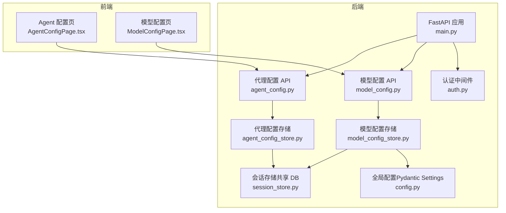
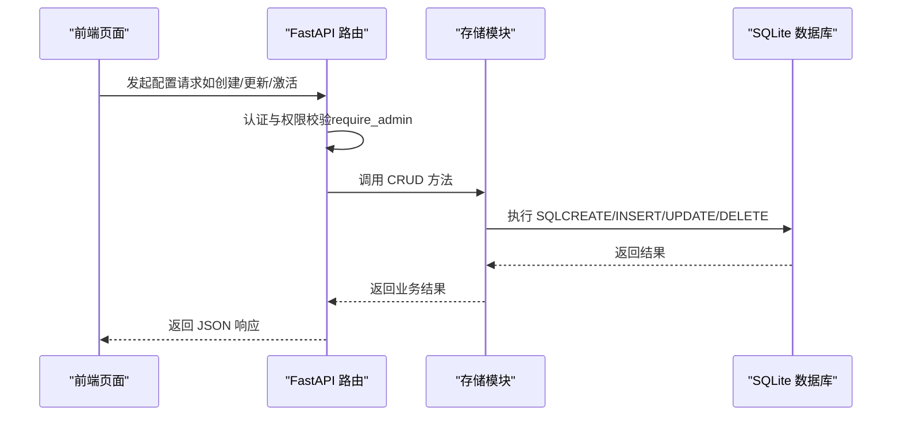
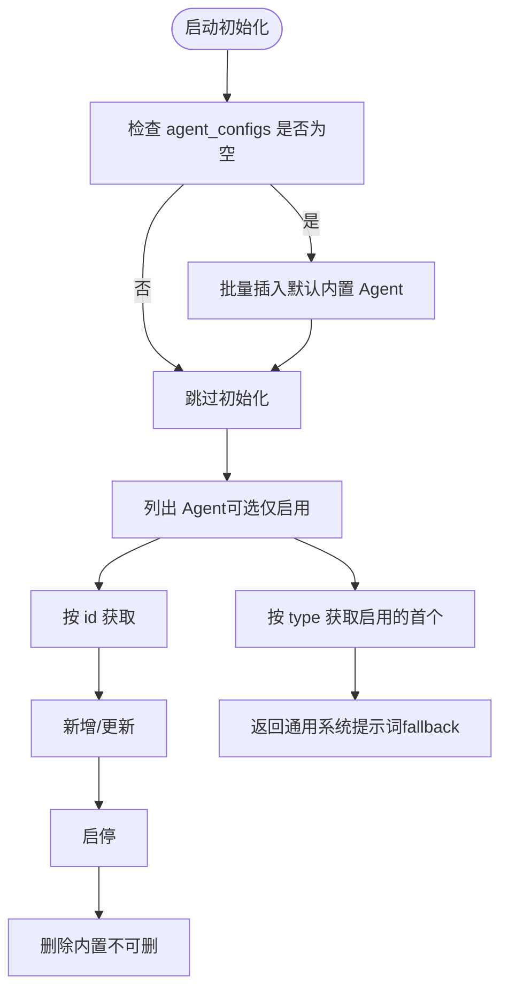
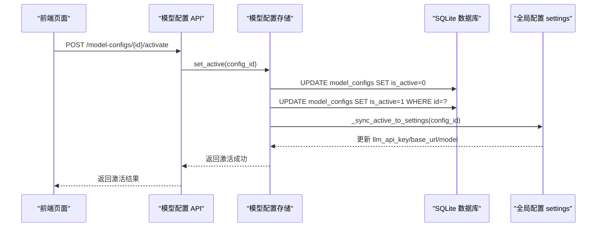
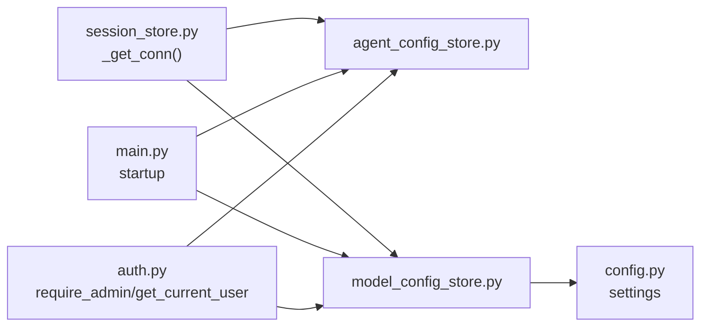
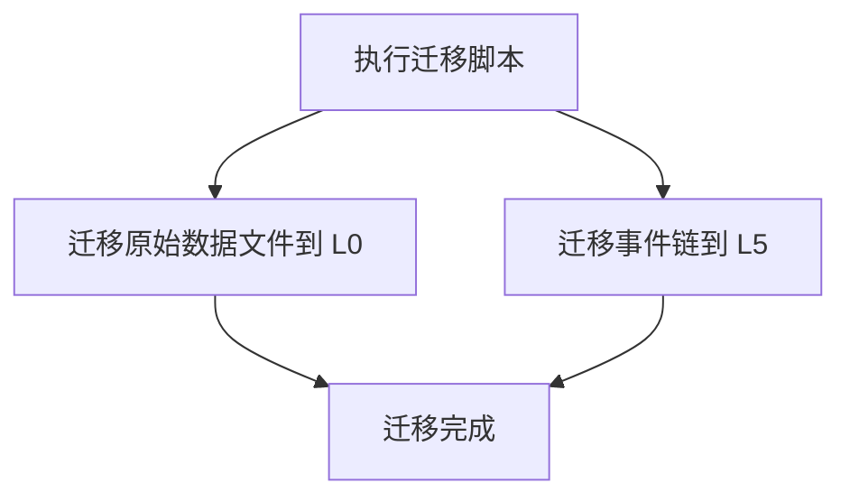

# 配置存储

<cite>
**本文引用的文件**   
- [agent_config_store.py](file://backend/app/storage/agent_config_store.py)
- [model_config_store.py](file://backend/app/storage/model_config_store.py)
- [session_store.py](file://backend/app/storage/session_store.py)
- [config.py](file://backend/app/config.py)
- [agent_config.py](file://backend/app/api/agent_config.py)
- [model_config.py](file://backend/app/api/model_config.py)
- [AgentConfigPage.tsx](file://frontend/src/pages/AgentConfigPage.tsx)
- [ModelConfigPage.tsx](file://frontend/src/pages/ModelConfigPage.tsx)
- [main.py](file://backend/app/main.py)
- [auth.py](file://backend/app/core/auth.py)
- [migrate_storage.py](file://backend/scripts/migrate_storage.py)
</cite>

## 目录
1. [简介](#简介)
2. [项目结构](#项目结构)
3. [核心组件](#核心组件)
4. [架构总览](#架构总览)
5. [详细组件分析](#详细组件分析)
6. [依赖分析](#依赖分析)
7. [性能考虑](#性能考虑)
8. [故障排查指南](#故障排查指南)
9. [结论](#结论)
10. [附录](#附录)

## 简介
本文件系统化梳理“配置存储模块”的设计与实现，聚焦两类配置：
- 代理配置（agent_config_store）：管理多 Agent 的系统提示词与启用状态，支持默认内置 Agent 初始化、增删改查与启停。
- 模型配置（model_config_store）：管理大模型接入参数与推理参数，支持多预设、唯一激活、热更新至全局配置。

文档涵盖：
- 配置数据结构与默认值管理
- 动态更新与热更新机制
- 版本控制与变更追踪（现状与扩展建议）
- 加载优先级与合并策略（现状与扩展建议）
- 配置验证与校验（现状与扩展建议）
- 配置迁移工具与最佳实践

## 项目结构
配置存储位于后端 storage 层，采用 SQLite 单库复用（sessions.db），通过统一连接工厂与表结构管理实现轻量持久化。前端通过 API 管理界面进行可视化配置。



**图表来源**
- [main.py:62-71](file://backend/app/main.py#L62-L71)
- [agent_config.py:16](file://backend/app/api/agent_config.py#L16)
- [model_config.py:16](file://backend/app/api/model_config.py#L16)
- [agent_config_store.py:163-310](file://backend/app/storage/agent_config_store.py#L163-L310)
- [model_config_store.py:20-174](file://backend/app/storage/model_config_store.py#L20-L174)
- [session_store.py:27-70](file://backend/app/storage/session_store.py#L27-L70)
- [config.py:6-183](file://backend/app/config.py#L6-L183)
- [AgentConfigPage.tsx:50-450](file://frontend/src/pages/AgentConfigPage.tsx#L50-L450)
- [ModelConfigPage.tsx:43-441](file://frontend/src/pages/ModelConfigPage.tsx#L43-L441)

**章节来源**
- [main.py:62-71](file://backend/app/main.py#L62-L71)
- [agent_config_store.py:163-310](file://backend/app/storage/agent_config_store.py#L163-L310)
- [model_config_store.py:20-174](file://backend/app/storage/model_config_store.py#L20-L174)
- [session_store.py:27-70](file://backend/app/storage/session_store.py#L27-L70)
- [config.py:6-183](file://backend/app/config.py#L6-L183)
- [AgentConfigPage.tsx:50-450](file://frontend/src/pages/AgentConfigPage.tsx#L50-L450)
- [ModelConfigPage.tsx:43-441](file://frontend/src/pages/ModelConfigPage.tsx#L43-L441)

## 核心组件
- 代理配置存储（agent_config_store）
  - 表结构：agent_configs（id、name、type、description、system_prompt、enabled、sort_order、created_at、updated_at）
  - 默认内置 Agent 预设：通用合规、出境法律、税务、民俗文化、认证标准
  - 能力：初始化默认 Agent、列出/查询/增删改、启停、获取通用系统提示词
- 模型配置存储（model_config_store）
  - 表结构：model_configs（id、name、api_key、base_url、model、temperature、top_p、max_tokens、embed_model、is_active、created_at、updated_at）
  - 能力：多预设管理、唯一激活、热更新全局配置、初始化默认预设
- 会话存储（session_store）
  - 共享 SQLite 数据库（sessions.db），为代理/模型配置提供持久化基础
- 全局配置（config.py）
  - Pydantic Settings，承载应用运行期配置（含 LLM 主备参数）

**章节来源**
- [agent_config_store.py:10-158](file://backend/app/storage/agent_config_store.py#L10-L158)
- [model_config_store.py:3-8](file://backend/app/storage/model_config_store.py#L3-L8)
- [session_store.py:1-10](file://backend/app/storage/session_store.py#L1-L10)
- [config.py:6-183](file://backend/app/config.py#L6-L183)

## 架构总览
配置存储采用“存储层 + API 层 + 前端页面”的三层协作：
- 存储层：SQLite 表结构与 CRUD 方法
- API 层：FastAPI 路由与请求/响应模型，配合认证中间件
- 前端页面：可视化配置与操作（Agent/模型预设）



**图表来源**
- [agent_config.py:106-157](file://backend/app/api/agent_config.py#L106-L157)
- [model_config.py:93-151](file://backend/app/api/model_config.py#L93-L151)
- [agent_config_store.py:203-294](file://backend/app/storage/agent_config_store.py#L203-L294)
- [model_config_store.py:52-140](file://backend/app/storage/model_config_store.py#L52-L140)
- [session_store.py:27-70](file://backend/app/storage/session_store.py#L27-L70)

## 详细组件分析

### 代理配置存储（agent_config_store）
- 设计要点
  - 默认内置 Agent 预设集中定义，首次启动时自动初始化
  - 表结构支持启用/排序/描述/系统提示词等字段
  - 提供按类型检索通用系统提示词，用于 NLU 意图解析
- 关键流程
  - 初始化默认 Agent：检测表是否为空，为空则批量插入默认项
  - CRUD：支持按 id 查询、按 type 获取启用的首个 Agent、upsert、删除（内置不可删）、启停
  - 通用系统提示词：优先取通用 Agent，回退到内置默认提示词



**图表来源**
- [agent_config_store.py:183-310](file://backend/app/storage/agent_config_store.py#L183-L310)

**章节来源**
- [agent_config_store.py:183-310](file://backend/app/storage/agent_config_store.py#L183-L310)

### 模型配置存储（model_config_store）
- 设计要点
  - 多预设管理：每个预设包含 API Key、Base URL、模型名、推理参数等
  - 唯一激活：is_active 保证同一时刻仅有一个预设处于激活状态
  - 热更新：激活后同步写入全局 settings，触发后续调用重建客户端
  - 默认初始化：当表为空时，从当前 settings 导入默认预设并激活
- 关键流程
  - 列表/详情：支持屏蔽敏感字段（API Key 遮蔽）
  - 激活：先清零其余，再将目标置为激活，并同步全局配置
  - upsert：支持新建或更新，返回完整记录（含敏感字段）
  - 删除：直接删除



**图表来源**
- [model_config.py:146-151](file://backend/app/api/model_config.py#L146-L151)
- [model_config_store.py:118-156](file://backend/app/storage/model_config_store.py#L118-L156)
- [config.py:125-143](file://backend/app/config.py#L125-L143)

**章节来源**
- [model_config_store.py:52-174](file://backend/app/storage/model_config_store.py#L52-L174)
- [model_config.py:62-151](file://backend/app/api/model_config.py#L62-L151)
- [config.py:125-143](file://backend/app/config.py#L125-L143)

### API 与前端集成
- 代理配置 API
  - 列表（含预览）、详情、创建/更新（管理员）、删除（管理员）、启停（管理员）
  - 响应模型包含必要字段，列表接口对 system_prompt 做长度截断
- 模型配置 API
  - 列表、当前激活详情（含完整 API Key）、创建/更新（管理员）、删除（管理员）、激活（管理员）
  - 响应模型对 API Key 做遮蔽处理
- 前端页面
  - AgentConfigPage：支持新建/编辑/启停/删除（内置不可删）、保存后刷新列表
  - ModelConfigPage：支持新建/编辑/激活/删除、测试后端连通性

```mermaid
classDiagram
class AgentAPI {
+GET /agents
+GET /agents/{agent_id}
+POST /agents
+PUT /agents/{agent_id}
+DELETE /agents/{agent_id}
+PUT /agents/{agent_id}/toggle
}
class ModelAPI {
+GET /model-configs
+GET /model-configs/active
+POST /model-configs
+PUT /model-configs/{id}
+DELETE /model-configs/{id}
+POST /model-configs/{id}/activate
}
class AgentStore {
+list_agents()
+get_agent()
+upsert_agent()
+delete_agent()
+toggle_agent()
}
class ModelStore {
+list_configs()
+get_active_config()
+upsert_config()
+set_active()
+delete_config()
}
AgentAPI --> AgentStore : "调用"
ModelAPI --> ModelStore : "调用"
```

**图表来源**
- [agent_config.py:61-157](file://backend/app/api/agent_config.py#L61-L157)
- [model_config.py:62-151](file://backend/app/api/model_config.py#L62-L151)
- [agent_config_store.py:203-294](file://backend/app/storage/agent_config_store.py#L203-L294)
- [model_config_store.py:52-140](file://backend/app/storage/model_config_store.py#L52-L140)

**章节来源**
- [agent_config.py:61-157](file://backend/app/api/agent_config.py#L61-L157)
- [model_config.py:62-151](file://backend/app/api/model_config.py#L62-L151)
- [AgentConfigPage.tsx:50-450](file://frontend/src/pages/AgentConfigPage.tsx#L50-L450)
- [ModelConfigPage.tsx:43-441](file://frontend/src/pages/ModelConfigPage.tsx#L43-L441)

## 依赖分析
- 存储层依赖
  - agent_config_store 与 model_config_store 均依赖 session_store 的连接工厂（_get_conn）以确保单库复用
  - 两者均通过显式建表逻辑保证表存在
- 运行期依赖
  - 模型配置激活后同步写入全局 settings，实现热更新
  - 启动阶段统一初始化默认配置（管理员、模型预设、Agent）
- 认证与权限
  - 代理与模型配置的写操作均依赖 require_admin，读操作依赖 get_current_user



**图表来源**
- [session_store.py:27-34](file://backend/app/storage/session_store.py#L27-L34)
- [agent_config_store.py:20-20](file://backend/app/storage/agent_config_store.py#L20-L20)
- [model_config_store.py:15-15](file://backend/app/storage/model_config_store.py#L15-L15)
- [model_config_store.py:143-156](file://backend/app/storage/model_config_store.py#L143-L156)
- [config.py:125-143](file://backend/app/config.py#L125-L143)
- [main.py:62-71](file://backend/app/main.py#L62-L71)
- [auth.py:55-60](file://backend/app/core/auth.py#L55-L60)

**章节来源**
- [session_store.py:27-34](file://backend/app/storage/session_store.py#L27-L34)
- [agent_config_store.py:20-20](file://backend/app/storage/agent_config_store.py#L20-L20)
- [model_config_store.py:15-15](file://backend/app/storage/model_config_store.py#L15-L15)
- [model_config_store.py:143-156](file://backend/app/storage/model_config_store.py#L143-L156)
- [config.py:125-143](file://backend/app/config.py#L125-L143)
- [main.py:62-71](file://backend/app/main.py#L62-L71)
- [auth.py:55-60](file://backend/app/core/auth.py#L55-L60)

## 性能考虑
- 数据库层面
  - 单库复用（sessions.db）降低连接成本，但需注意并发写入与事务一致性
  - 建议在高频写场景下使用事务包裹批量操作，减少提交次数
- API 层面
  - 列表接口对 system_prompt 截断，减少带宽占用
  - 模型配置接口对 API Key 做遮蔽，避免敏感信息泄露
- 热更新
  - 激活后同步 settings，建议在调用侧按“键不匹配”触发重建，避免重复初始化

[本节为通用指导，无需特定文件引用]

## 故障排查指南
- 启动未初始化默认配置
  - 现象：首次启动后无内置 Agent 或默认模型预设
  - 排查：确认 startup 钩子已调用初始化函数
  - 参考
    - [main.py:62-71](file://backend/app/main.py#L62-L71)
    - [agent_config_store.py:183-198](file://backend/app/storage/agent_config_store.py#L183-L198)
    - [model_config_store.py:159-174](file://backend/app/storage/model_config_store.py#L159-L174)
- 激活失败或热更新未生效
  - 现象：激活后后续调用仍使用旧配置
  - 排查：确认 set_active 成功、_sync_active_to_settings 调用、调用侧按“键不匹配”重建客户端
  - 参考
    - [model_config_store.py:118-156](file://backend/app/storage/model_config_store.py#L118-L156)
    - [config.py:125-143](file://backend/app/config.py#L125-L143)
- 删除失败或内置不可删
  - 现象：删除返回失败或提示内置不可删
  - 排查：确认传入 id 是否为内置固定 id
  - 参考
    - [agent_config_store.py:273-283](file://backend/app/storage/agent_config_store.py#L273-L283)
- 权限不足导致写操作失败
  - 现象：403 Forbidden
  - 排查：确认 JWT token 有效且用户角色为 admin
  - 参考
    - [auth.py:55-60](file://backend/app/core/auth.py#L55-L60)
    - [agent_config.py:111](file://backend/app/api/agent_config.py#L111)
    - [model_config.py:98-142](file://backend/app/api/model_config.py#L98-L142)

**章节来源**
- [main.py:62-71](file://backend/app/main.py#L62-L71)
- [agent_config_store.py:183-283](file://backend/app/storage/agent_config_store.py#L183-L283)
- [model_config_store.py:118-174](file://backend/app/storage/model_config_store.py#L118-L174)
- [auth.py:55-60](file://backend/app/core/auth.py#L55-L60)
- [agent_config.py:111](file://backend/app/api/agent_config.py#L111)
- [model_config.py:98-142](file://backend/app/api/model_config.py#L98-L142)

## 结论
配置存储模块以 SQLite 单库复用为核心，结合 FastAPI 与前端页面，实现了代理与模型配置的结构化管理与热更新能力。当前实现具备：
- 清晰的数据模型与默认初始化
- 基本的 CRUD 与权限控制
- 模型配置的唯一激活与热更新
建议后续增强：
- 版本控制与变更追踪（审计日志、回滚）
- 配置加载优先级与合并策略（全局/用户/环境）
- 配置验证与校验（类型、范围、依赖）
- 配置迁移工具与回滚策略

[本节为总结，无需特定文件引用]

## 附录

### 配置迁移工具
- 目标：将旧结构数据迁移至 L0-L5 分层存储
- 内容：原始数据文件（HS 编码、VAT 税率、法规文件）与事件链迁移
- 执行：python scripts/migrate_storage.py



**图表来源**
- [migrate_storage.py:71-99](file://backend/scripts/migrate_storage.py#L71-L99)

**章节来源**
- [migrate_storage.py:1-99](file://backend/scripts/migrate_storage.py#L1-L99)