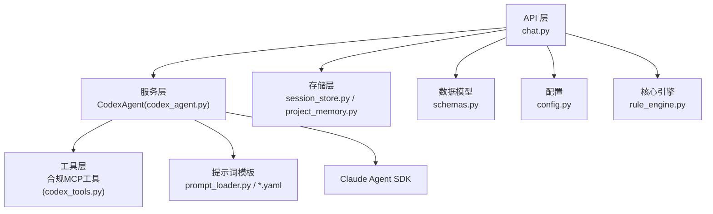
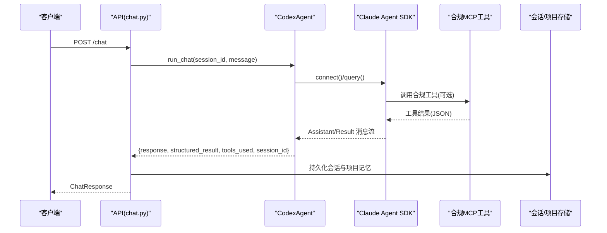
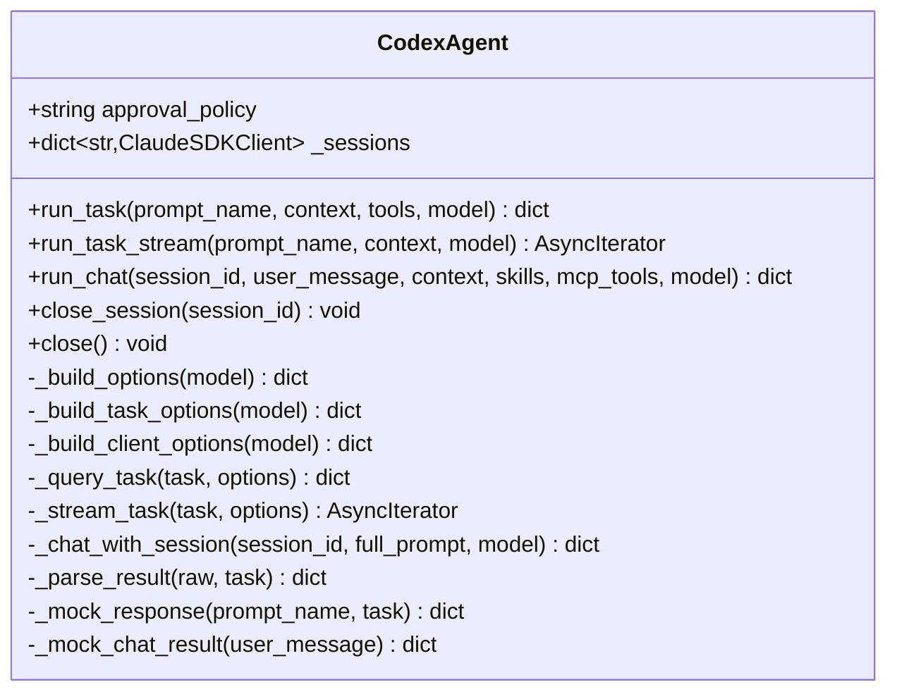
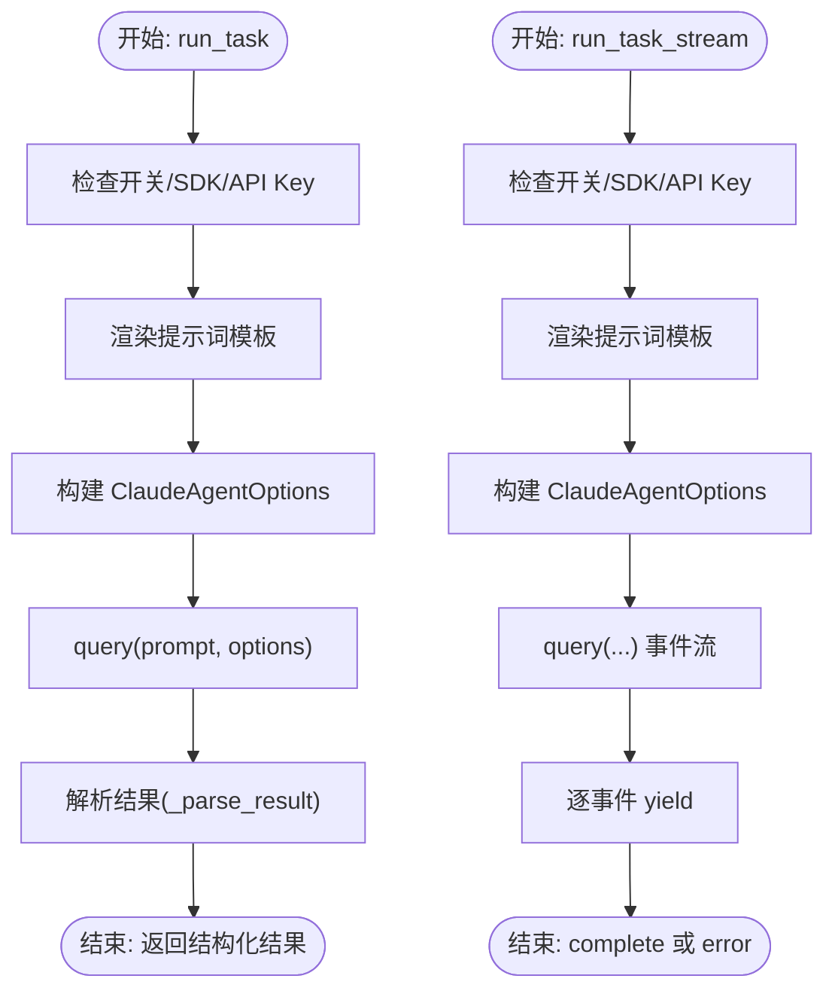
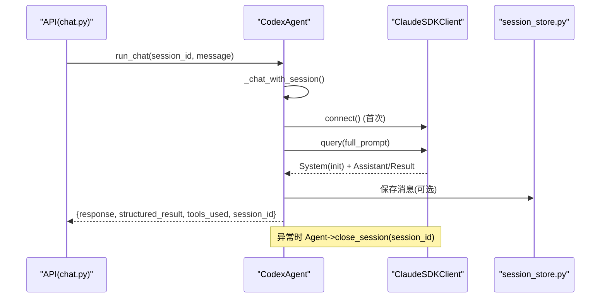
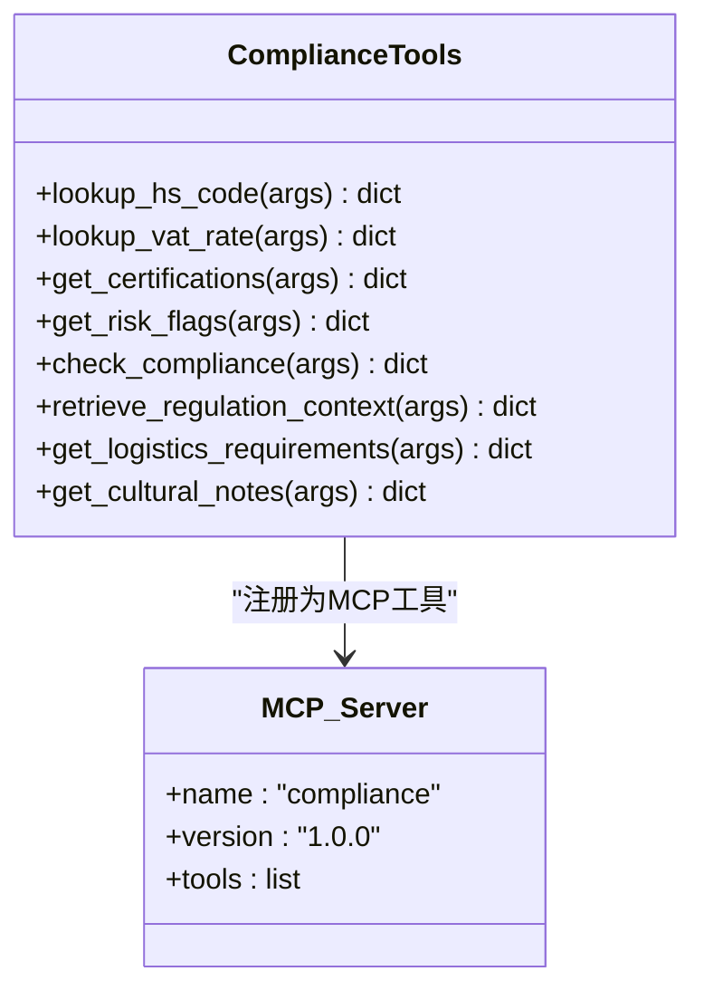
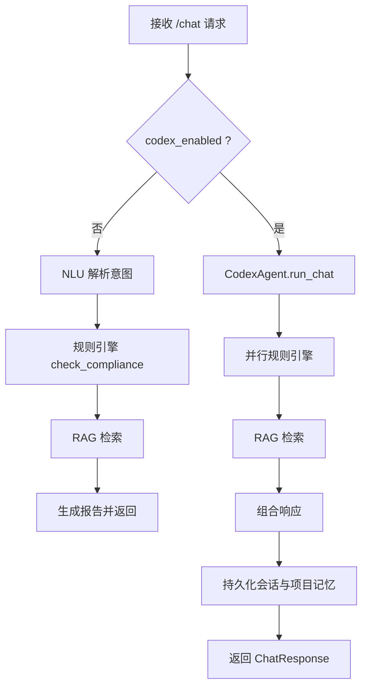
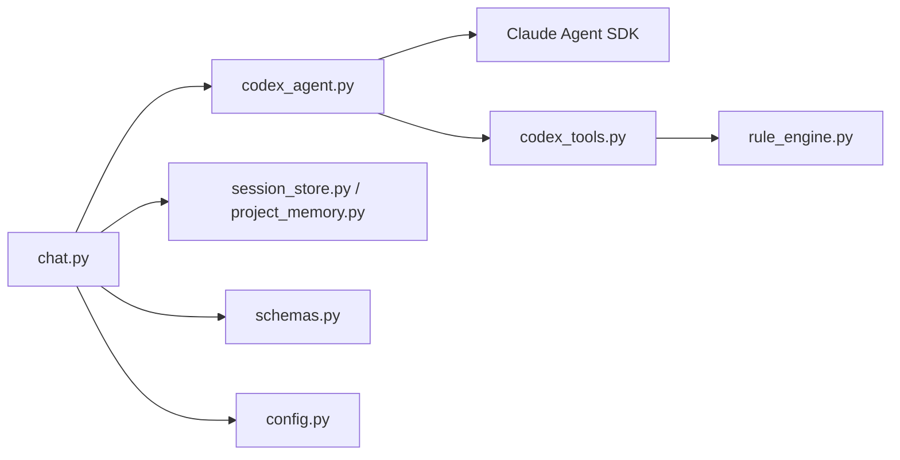

# Codex智能体服务

<cite>
**本文档引用的文件**
- [codex_agent.py](file://backend/app/services/codex_agent.py)
- [codex_tools.py](file://backend/app/services/codex_tools.py)
- [chat.py](file://backend/app/api/chat.py)
- [prompt_loader.py](file://backend/app/services/prompt_loader.py)
- [chat_compliance.yaml](file://backend/data/prompts/chat_compliance.yaml)
- [market_monitor.yaml](file://backend/data/prompts/market_monitor.yaml)
- [schemas.py](file://backend/app/models/schemas.py)
- [config.py](file://backend/app/config.py)
- [session_store.py](file://backend/app/storage/session_store.py)
- [project_memory.py](file://backend/app/storage/project_memory.py)
- [layer_registry.py](file://backend/app/storage/layer_registry.py)
- [rule_engine.py](file://backend/app/core/rule_engine.py)
</cite>

## 目录
1. [简介](#简介)
2. [项目结构](#项目结构)
3. [核心组件](#核心组件)
4. [架构总览](#架构总览)
5. [详细组件分析](#详细组件分析)
6. [依赖分析](#依赖分析)
7. [性能考虑](#性能考虑)
8. [故障排查指南](#故障排查指南)
9. [结论](#结论)
10. [附录](#附录)

## 简介
本文件系统性阐述“Codex智能体服务”的设计与实现，重点围绕 CodexAgent 类的两大工作模式：单次任务执行（run_task/run_task_stream）与多轮会话（run_chat），并深入解析其任务执行流程、提示词模板渲染、Codex客户端SDK调用、线程与工具集成、会话持久化机制、流式响应处理、错误处理与降级策略，以及在聊天API中的集成实践与复杂合规查询任务的处理范式。

## 项目结构
- 后端采用分层与模块化组织：
  - API 层：对外提供聊天接口，编排主流程与降级链路。
  - 服务层：CodexAgent 封装 Claude Agent SDK，提供统一的任务与会话接口。
  - 工具层：合规 MCP 工具注册与调用，桥接规则引擎与 RAG。
  - 存储层：会话与项目记忆（SQLite/文件系统）支撑上下文与历史。
  - 核心引擎：规则引擎与提示词模板加载器。
  - 配置：集中管理开关、模型、权限策略与工作目录等。

图表来源
- [chat.py:227-375](file://backend/app/api/chat.py#L227-L375)
- [codex_agent.py:107-454](file://backend/app/services/codex_agent.py#L107-L454)
- [codex_tools.py:143-157](file://backend/app/services/codex_tools.py#L143-L157)
- [prompt_loader.py:54-70](file://backend/app/services/prompt_loader.py#L54-L70)
- [session_store.py:74-217](file://backend/app/storage/session_store.py#L74-L217)
- [project_memory.py:36-87](file://backend/app/storage/project_memory.py#L36-L87)
- [schemas.py:95-104](file://backend/app/models/schemas.py#L95-L104)
- [config.py:10-16](file://backend/app/config.py#L10-L16)
- [rule_engine.py:197-247](file://backend/app/core/rule_engine.py#L197-L247)

章节来源
- [chat.py:41-44](file://backend/app/api/chat.py#L41-L44)
- [codex_agent.py:107-171](file://backend/app/services/codex_agent.py#L107-L171)
- [codex_tools.py:143-157](file://backend/app/services/codex_tools.py#L143-L157)
- [prompt_loader.py:18-70](file://backend/app/services/prompt_loader.py#L18-L70)
- [session_store.py:37-70](file://backend/app/storage/session_store.py#L37-L70)
- [project_memory.py:20-87](file://backend/app/storage/project_memory.py#L20-L87)
- [schemas.py:73-104](file://backend/app/models/schemas.py#L73-L104)
- [config.py:5-16](file://backend/app/config.py#L5-L16)
- [rule_engine.py:197-247](file://backend/app/core/rule_engine.py#L197-L247)

## 核心组件
- CodexAgent：统一的任务与会话接口，封装 Claude Agent SDK，支持合规 MCP 工具、权限模式、系统提示词注入与工作目录设置。
- 合规MCP工具：通过 @tool 装饰器注册，提供 HS 编码、VAT 税率、认证、风险、合规检查、法规检索、物流与文化注意事项等工具。
- 提示词模板加载器：从 YAML 加载与渲染 system_prompt，支持热加载与缓存。
- API 聊天接口：主入口，编排 Codex 与降级链路，维护 ActionChain 与会话持久化。
- 存储层：会话 SQLite 存储与项目记忆文件系统存储，支撑上下文与历史回溯。
- 规则引擎：确定性合规检查，提供 HS/VAT/认证/风险/物流/文化等基础能力。
- 配置中心：集中管理开关、模型、权限策略、API Key、工作目录等。

章节来源
- [codex_agent.py:107-454](file://backend/app/services/codex_agent.py#L107-L454)
- [codex_tools.py:64-157](file://backend/app/services/codex_tools.py#L64-L157)
- [prompt_loader.py:23-70](file://backend/app/services/prompt_loader.py#L23-L70)
- [chat.py:227-375](file://backend/app/api/chat.py#L227-L375)
- [session_store.py:74-217](file://backend/app/storage/session_store.py#L74-L217)
- [project_memory.py:36-87](file://backend/app/storage/project_memory.py#L36-L87)
- [rule_engine.py:197-247](file://backend/app/core/rule_engine.py#L197-L247)
- [config.py:10-16](file://backend/app/config.py#L10-L16)

## 架构总览
Codex 智能体服务以 API 为入口，通过 CodexAgent 调用 Claude Agent SDK，结合合规 MCP 工具与联网搜索，完成单次任务或维持多轮会话。同时，API 层在 Codex 不可用时自动降级至 NLU → 规则引擎 → RAG 的确定性链路，并通过会话与项目记忆持久化上下文与历史。

图表来源
- [chat.py:288-293](file://backend/app/api/chat.py#L288-L293)
- [codex_agent.py:340-392](file://backend/app/services/codex_agent.py#L340-L392)
- [codex_tools.py:143-157](file://backend/app/services/codex_tools.py#L143-L157)
- [session_store.py:186-217](file://backend/app/storage/session_store.py#L186-L217)
- [project_memory.py:36-87](file://backend/app/storage/project_memory.py#L36-L87)

## 详细组件分析

### CodexAgent 类设计与职责
- 设计定位：基于 Claude Agent SDK 的助手级智能体，封装 CLI 工具、联网搜索、文件操作、多步推理与持久会话，提供统一的 run_task/run_chat 接口，并扩展合规 MCP 工具。
- 关键属性与配置：
  - approval_policy：映射到 SDK 的 permission_mode。
  - _sessions：session_id → ClaudeSDKClient 的映射，管理多轮会话生命周期。
  - 系统提示词：COMPLIANCE_SYSTEM_PROMPT 注入到 options.system_prompt。
  - allowed_tools：预设 Claude Code 工具 + 合规 MCP 工具名称集合。
  - mcp_servers：合规 MCP 服务器配置。
  - model/cwd/env：模型选择、工作目录与环境变量传递。
- 异常类型：CodexAgentError，封装原始异常以便上层捕获与降级。

图表来源
- [codex_agent.py:107-454](file://backend/app/services/codex_agent.py#L107-L454)

章节来源
- [codex_agent.py:107-171](file://backend/app/services/codex_agent.py#L107-L171)
- [codex_agent.py:174-232](file://backend/app/services/codex_agent.py#L174-L232)
- [codex_agent.py:235-292](file://backend/app/services/codex_agent.py#L235-L292)
- [codex_agent.py:295-392](file://backend/app/services/codex_agent.py#L295-L392)
- [codex_agent.py:396-454](file://backend/app/services/codex_agent.py#L396-L454)

### 单次任务执行（run_task/run_task_stream）
- 流程概览：
  - 参数校验：codex_enabled、SDK 可用性、API Key。
  - 提示词渲染：render_prompt 加载并渲染 YAML 模板。
  - 构建选项：_build_task_options 返回 ClaudeAgentOptions。
  - 执行与解析：query() 获取 Assistant/Result 消息，_parse_result 尝试提取 JSON。
  - 流式版本：_stream_task 逐事件产出 delta、task_start/progress/notification、complete/error。
- 适用场景：一次性结构化输出任务，如合规检查、市场监控、风险汇总等。

图表来源
- [codex_agent.py:174-232](file://backend/app/services/codex_agent.py#L174-L232)
- [codex_agent.py:210-232](file://backend/app/services/codex_agent.py#L210-L232)
- [codex_agent.py:295-339](file://backend/app/services/codex_agent.py#L295-L339)
- [codex_agent.py:396-424](file://backend/app/services/codex_agent.py#L396-L424)

章节来源
- [codex_agent.py:174-232](file://backend/app/services/codex_agent.py#L174-L232)
- [codex_agent.py:210-232](file://backend/app/services/codex_agent.py#L210-L232)
- [codex_agent.py:295-339](file://backend/app/services/codex_agent.py#L295-L339)
- [codex_agent.py:396-424](file://backend/app/services/codex_agent.py#L396-L424)

### 多轮会话（run_chat）与会话持久化
- 流程概览：
  - 构建系统提示词（chat_compliance.yaml），拼接用户消息。
  - 获取/创建 ClaudeSDKClient，connect() 建立连接并缓存。
  - query(full_prompt) 发送消息，receive_response() 逐消息收集 Assistant/Result/System。
  - 解析 session_id（System/init），组装返回结构。
  - 异常时清理会话（close_session）。
- 会话持久化：
  - session_id → ClaudeSDKClient 映射，避免重复创建。
  - 会话消息与上下文持久化：session_store 提供 SQLite 存储，支持最近 N 条消息读取与会话 CRUD。
  - 项目记忆：project_memory 以产品维度写入合规历史，支持历史查询与回溯。
- 上下文保持策略：
  - 系统提示词注入（chat_compliance.yaml）与 allowed_tools/mcp_servers 控制工具可用性。
  - 通过 ClaudeSDKClient 的 receive_response() 保持多轮上下文。

图表来源
- [codex_agent.py:235-292](file://backend/app/services/codex_agent.py#L235-L292)
- [codex_agent.py:340-392](file://backend/app/services/codex_agent.py#L340-L392)
- [session_store.py:186-217](file://backend/app/storage/session_store.py#L186-L217)

章节来源
- [codex_agent.py:235-292](file://backend/app/services/codex_agent.py#L235-L292)
- [codex_agent.py:340-392](file://backend/app/services/codex_agent.py#L340-L392)
- [session_store.py:74-217](file://backend/app/storage/session_store.py#L74-L217)
- [project_memory.py:36-87](file://backend/app/storage/project_memory.py#L36-L87)

### 提示词模板与系统提示词
- 提示词加载：prompt_loader.load_prompt 从 YAML 读取，支持缓存与热加载。
- 渲染：render_prompt 支持简单变量替换，便于注入上下文。
- 系统提示词：COMPLIANCE_SYSTEM_PROMPT 注入到 ClaudeAgentOptions.system_prompt；chat_compliance.yaml 用于多轮会话的系统提示词模板。
- 任务模板：market_monitor.yaml 用于市场监控任务的指令与输出格式定义。

章节来源
- [prompt_loader.py:23-70](file://backend/app/services/prompt_loader.py#L23-L70)
- [codex_agent.py:39-85](file://backend/app/services/codex_agent.py#L39-L85)
- [chat_compliance.yaml:3-21](file://backend/data/prompts/chat_compliance.yaml#L3-L21)
- [market_monitor.yaml:3-36](file://backend/data/prompts/market_monitor.yaml#L3-L36)

### 合规MCP工具与工具集成
- 工具注册：_register_tools 在 SDK 可用时注册合规工具，返回工具函数列表。
- MCP 服务器：get_compliance_mcp_server 创建单例，名称为 compliance，版本 1.0.0。
- 工具清单：COMPLIANCE_TOOL_NAMES 与 ALL_MCP_TOOLS/ALL_MCP_TOOL_SCHEMAS 用于允许工具与向后兼容。
- 工具函数：lookup_hs_code、lookup_vat_rate、get_certifications、get_risk_flags、check_compliance、retrieve_regulation_context、get_logistics_requirements、get_cultural_notes。
- 规则引擎对接：工具内部调用 rule_engine 与 rag.retrieve_context，实现确定性与检索增强的组合。

图表来源
- [codex_tools.py:64-157](file://backend/app/services/codex_tools.py#L64-L157)
- [codex_tools.py:143-157](file://backend/app/services/codex_tools.py#L143-L157)

章节来源
- [codex_tools.py:64-157](file://backend/app/services/codex_tools.py#L64-L157)
- [codex_tools.py:163-211](file://backend/app/services/codex_tools.py#L163-L211)
- [rule_engine.py:17-247](file://backend/app/core/rule_engine.py#L17-L247)

### API 集成与降级链路
- 主流程：CodexAgent.run_chat → 并行规则引擎 → RAG 检索 → 组合 ChatResponse。
- 降级链路：当 Codex 不可用时，走 NLU → 规则引擎 → RAG，支持通用问题与合规问题两类分支。
- 会话管理：API 层负责 session_store 的创建、恢复与消息持久化。
- 行为链：ActionChain 记录每一步操作，支持回溯与展示。

图表来源
- [chat.py:227-375](file://backend/app/api/chat.py#L227-L375)
- [chat.py:414-539](file://backend/app/api/chat.py#L414-L539)
- [session_store.py:186-217](file://backend/app/storage/session_store.py#L186-L217)
- [project_memory.py:36-87](file://backend/app/storage/project_memory.py#L36-L87)

章节来源
- [chat.py:227-375](file://backend/app/api/chat.py#L227-L375)
- [chat.py:414-539](file://backend/app/api/chat.py#L414-L539)
- [schemas.py:95-104](file://backend/app/models/schemas.py#L95-L104)

### 流式响应处理
- 事件类型：TaskStartedMessage、TaskProgressMessage、TaskNotificationMessage、AssistantMessage、ResultMessage。
- 事件处理：_stream_task 将事件转换为统一的事件字典，逐事件 yield，前端可实时渲染增量内容与工具调用状态。
- 完整性保证：遇到 ResultMessage 时立即返回 complete，确保消费侧有序结束。

章节来源
- [codex_agent.py:314-339](file://backend/app/services/codex_agent.py#L314-L339)

### 错误处理与降级策略
- 异常类型：CodexAgentError，封装底层异常并携带 original。
- 降级策略：
  - 单次任务：_mock_response 返回 mock 结果，提示 codex_enabled 与 API Key 状态。
  - 多轮会话：_mock_chat_result 返回降级提示与能力说明。
  - API 层：当 Codex 调用失败时，自动切换到 NLU → 规则引擎 → RAG 降级链路。
- 资源清理：会话异常时 close_session，避免 SDK 资源泄漏。

章节来源
- [codex_agent.py:29-35](file://backend/app/services/codex_agent.py#L29-L35)
- [codex_agent.py:425-454](file://backend/app/services/codex_agent.py#L425-L454)
- [chat.py:253-263](file://backend/app/api/chat.py#L253-L263)

## 依赖分析
- 组件耦合：
  - API 依赖 CodexAgent 与存储层；CodexAgent 依赖 Claude Agent SDK 与合规工具；合规工具依赖规则引擎与 RAG。
  - 配置中心贯穿全局，影响 SDK 选项、模型与工作目录。
- 外部依赖：
  - Claude Agent SDK：提供 query/connect/receive_response 等能力。
  - OpenAI 客户端（降级链路）：用于通用问题回复。
- 潜在循环依赖：未发现直接循环；工具注册通过延迟导入避免启动期依赖。

图表来源
- [chat.py:22-24](file://backend/app/api/chat.py#L22-L24)
- [codex_agent.py:23-24](file://backend/app/services/codex_agent.py#L23-L24)
- [codex_tools.py:14-24](file://backend/app/services/codex_tools.py#L14-L24)
- [rule_engine.py:13-14](file://backend/app/core/rule_engine.py#L13-L14)
- [session_store.py:19-22](file://backend/app/storage/session_store.py#L19-L22)
- [project_memory.py:17-24](file://backend/app/storage/project_memory.py#L17-L24)
- [schemas.py:16-25](file://backend/app/models/schemas.py#L16-L25)
- [config.py:27](file://backend/app/config.py#L27)

章节来源
- [chat.py:22-24](file://backend/app/api/chat.py#L22-L24)
- [codex_agent.py:23-24](file://backend/app/services/codex_agent.py#L23-L24)
- [codex_tools.py:14-24](file://backend/app/services/codex_tools.py#L14-L24)
- [rule_engine.py:13-14](file://backend/app/core/rule_engine.py#L13-L14)
- [session_store.py:19-22](file://backend/app/storage/session_store.py#L19-L22)
- [project_memory.py:17-24](file://backend/app/storage/project_memory.py#L17-L24)
- [schemas.py:16-25](file://backend/app/models/schemas.py#L16-L25)
- [config.py:27](file://backend/app/config.py#L27)

## 性能考虑
- 会话复用：_sessions 缓存 ClaudeSDKClient，避免重复 connect/disconnect。
- 事件流：流式事件逐事件推送，减少前端等待时间。
- 模板缓存：prompt_loader 缓存 YAML 模板，支持热加载。
- 存储优化：SQLite 索引与最近消息读取，降低查询开销。
- 降级策略：在 SDK 不可用时快速返回降级结果，保障用户体验。

## 故障排查指南
- SDK 未安装或 API Key 未配置：
  - 现象：返回 mock 响应或降级提示。
  - 处理：安装 claude-agent-sdk，配置 ANTHROPIC_API_KEY；或启用 codex_enabled。
- 会话异常：
  - 现象：异常后自动 close_session，避免资源泄漏。
  - 处理：重试请求或更换 session_id。
- 提示词模板缺失：
  - 现象：load_prompt 抛出 FileNotFoundError。
  - 处理：确认 data_dir 与模板文件存在，必要时 reload_all。
- 存储异常：
  - 现象：持久化失败不影响响应返回。
  - 处理：检查 data/sessions.db 权限与磁盘空间。

章节来源
- [codex_agent.py:194-201](file://backend/app/services/codex_agent.py#L194-L201)
- [codex_agent.py:264-271](file://backend/app/services/codex_agent.py#L264-L271)
- [codex_agent.py:390-392](file://backend/app/services/codex_agent.py#L390-L392)
- [prompt_loader.py:35-46](file://backend/app/services/prompt_loader.py#L35-L46)
- [session_store.py:186-217](file://backend/app/storage/session_store.py#L186-L217)

## 结论
Codex智能体服务通过 CodexAgent 将 Claude Agent SDK 的强大能力与合规工具链整合，提供统一的任务与会话接口。API 层在可用时优先走 Codex 驱动链路，不可用时自动降级至确定性链路，兼顾性能与稳定性。会话与项目记忆的持久化设计，使得多轮对话与历史回溯成为可能。通过流式事件与结构化解析，系统在复杂合规查询任务中实现了高效、可观测且可扩展的解决方案。

## 附录

### 实际使用示例（集成与任务处理）

- 在聊天 API 中集成 Codex 智能体：
  - 路径参考：[chat.py:288-293](file://backend/app/api/chat.py#L288-L293)
  - 步骤：
    1) 从请求体提取 message 与 session_id。
    2) 调用 CodexAgent.run_chat(session_id, message)。
    3) 并行执行规则引擎与 RAG 检索。
    4) 组合 ChatResponse 返回，同时持久化会话与项目记忆。
  - 降级链路：当 Codex 不可用时，走 NLU → 规则引擎 → RAG。

- 处理复杂的合规查询任务：
  - 任务模板：market_monitor.yaml 定义了市场监控的指令与输出格式。
  - 工具链：合规 MCP 工具自动调用 HS/VAT/认证/风险/物流/文化等工具。
  - 结果解析：_parse_result 尝试提取 JSON，否则返回原始文本摘要。

章节来源
- [chat.py:268-375](file://backend/app/api/chat.py#L268-L375)
- [market_monitor.yaml:3-36](file://backend/data/prompts/market_monitor.yaml#L3-L36)
- [codex_agent.py:396-424](file://backend/app/services/codex_agent.py#L396-L424)