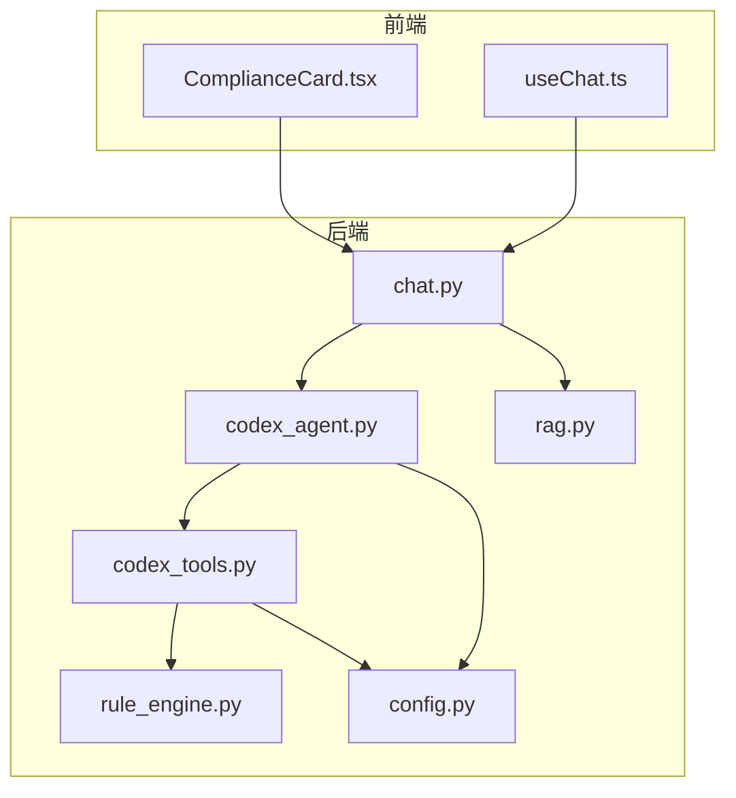
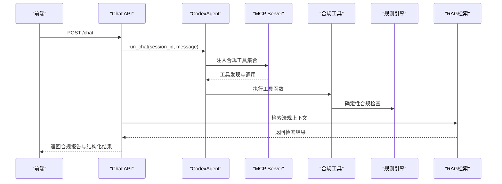
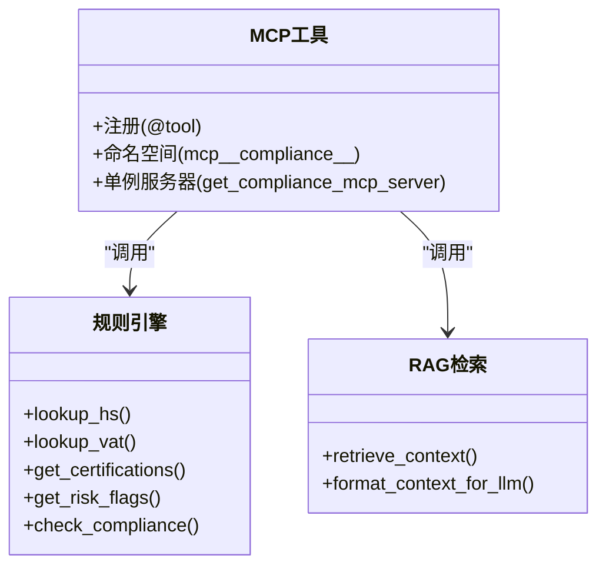
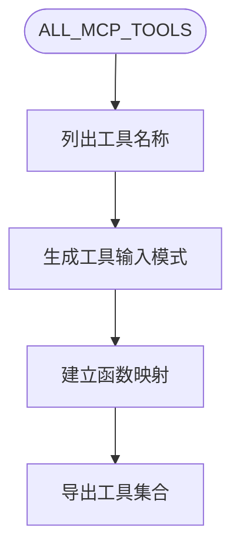
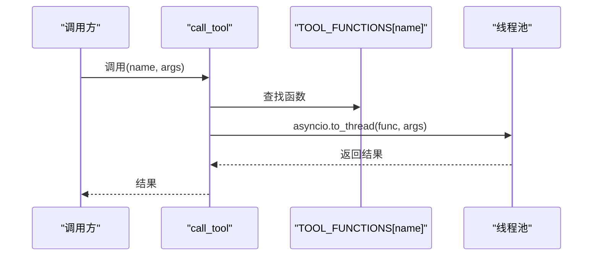
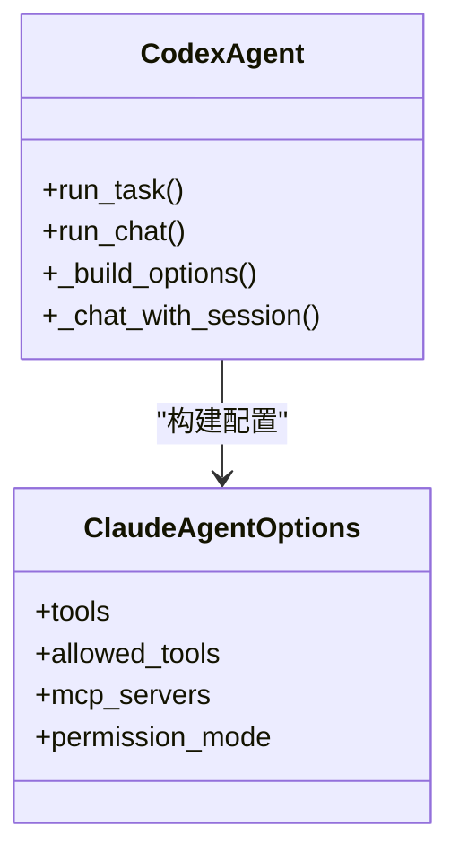
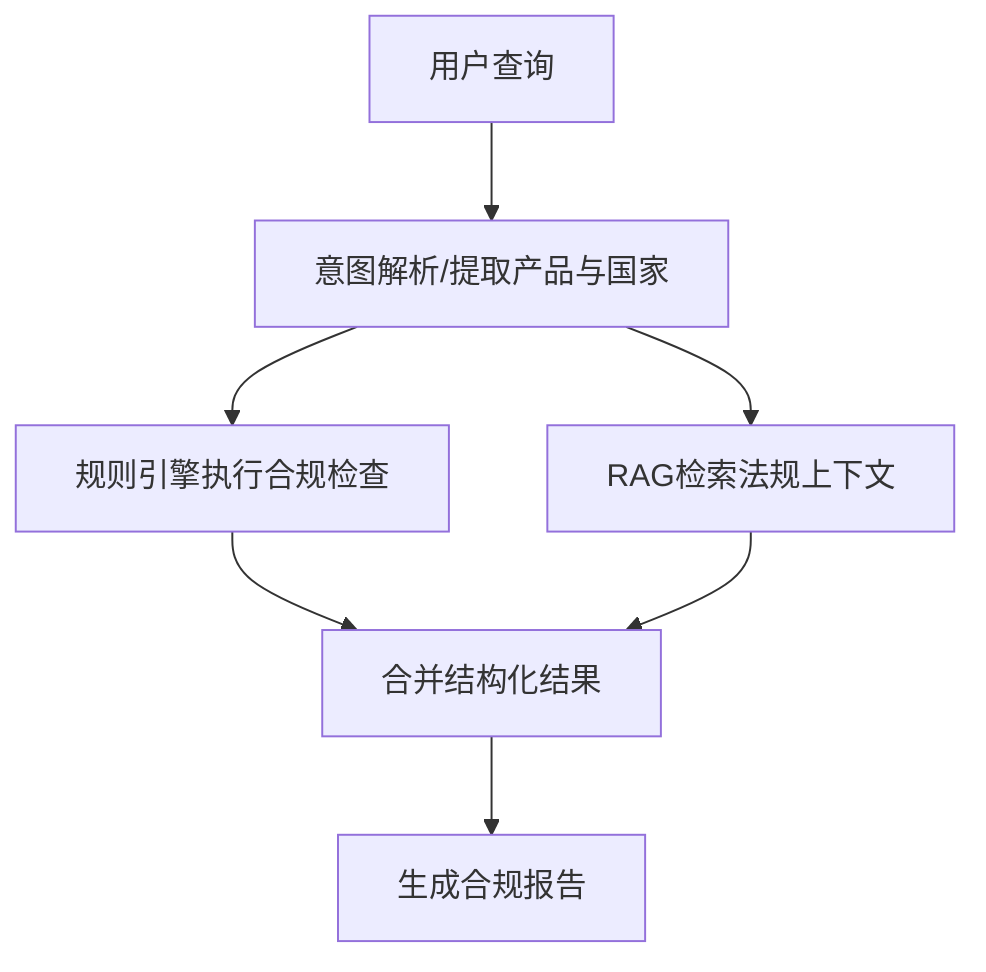
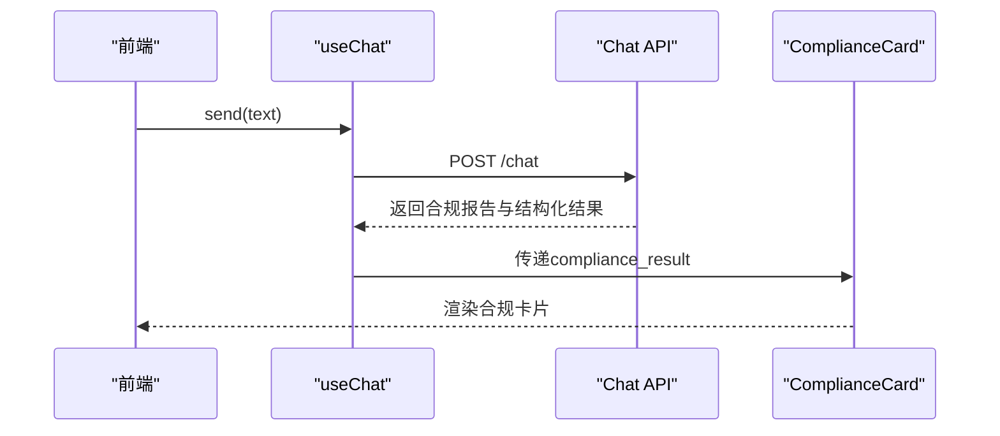
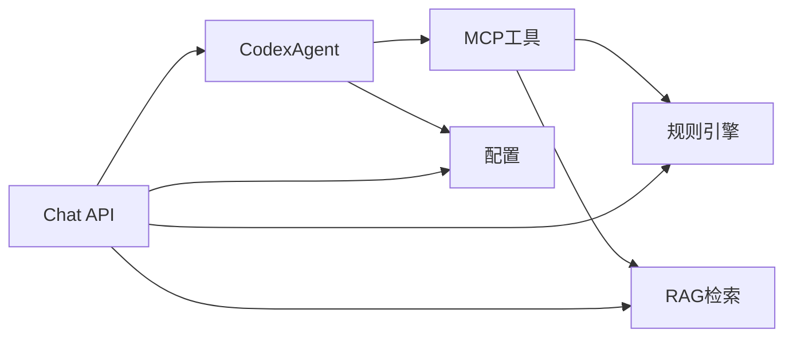

# MCP工具服务

<cite>
**本文档引用的文件**
- [codex_tools.py](file://backend/app/services/codex_tools.py)
- [codex_agent.py](file://backend/app/services/codex_agent.py)
- [rule_engine.py](file://backend/app/core/rule_engine.py)
- [rag.py](file://backend/app/core/rag.py)
- [chat.py](file://backend/app/api/chat.py)
- [config.py](file://backend/app/config.py)
- [ComplianceCard.tsx](file://frontend/src/components/ComplianceCard.tsx)
- [useChat.ts](file://frontend/src/hooks/useChat.ts)
</cite>

## 目录
1. [简介](#简介)
2. [项目结构](#项目结构)
3. [核心组件](#核心组件)
4. [架构总览](#架构总览)
5. [详细组件分析](#详细组件分析)
6. [依赖分析](#依赖分析)
7. [性能考虑](#性能考虑)
8. [故障排除指南](#故障排除指南)
9. [结论](#结论)
10. [附录](#附录)

## 简介
本文件系统性阐述MCP（Multi-Modal Context Protocol）工具服务在本项目中的实现与应用，重点围绕合规工具体系的架构设计、工具注册与参数传递、结果聚合与展示、以及在Codex智能体中的集成与调用机制。文档同时提供工具开发指南、异步处理与并发控制策略、以及实际使用示例，帮助开发者快速扩展新的MCP工具类型并将其无缝集成到前端与后端系统中。

## 项目结构
后端采用模块化分层设计：
- 服务层：MCP工具定义与Codex智能体封装
- 核心层：规则引擎与RAG检索
- API层：对外HTTP接口与会话管理
- 配置层：系统配置与SDK开关
- 前端层：合规卡片与聊天交互

图表来源
- [chat.py:204-375](file://backend/app/api/chat.py#L204-L375)
- [codex_agent.py:107-170](file://backend/app/services/codex_agent.py#L107-L170)
- [codex_tools.py:14-24](file://backend/app/services/codex_tools.py#L14-L24)
- [rule_engine.py:17-26](file://backend/app/core/rule_engine.py#L17-L26)
- [rag.py:10-18](file://backend/app/core/rag.py#L10-L18)
- [config.py:15-183](file://backend/app/config.py#L15-L183)

章节来源
- [chat.py:1-540](file://backend/app/api/chat.py#L1-L540)
- [codex_agent.py:1-454](file://backend/app/services/codex_agent.py#L1-L454)
- [codex_tools.py:1-247](file://backend/app/services/codex_tools.py#L1-L247)
- [rule_engine.py:1-247](file://backend/app/core/rule_engine.py#L1-L247)
- [rag.py:1-59](file://backend/app/core/rag.py#L1-L59)
- [config.py:1-183](file://backend/app/config.py#L1-L183)

## 核心组件
- MCP合规工具集合：基于Claude Agent SDK的@tool装饰器注册，提供HS编码查询、VAT税率查询、认证清单、风险评估、合规检查、法规检索、物流与清关要求、文化注意事项等工具。
- Codex智能体：封装Claude Agent SDK，提供run_task/run_chat接口，支持持久会话、工具权限、MCP服务器注入与流式输出。
- 规则引擎：基于L0数据的确定性合规检查流水线，负责HS/VAT/认证/风险/物流/清关/文化等规则计算。
- RAG检索：从知识库检索相关法规上下文，增强合规分析的深度与权威性。
- API层：对外提供聊天接口，协调Codex与规则引擎/RAG，生成结构化合规报告并持久化会话与记忆。

章节来源
- [codex_tools.py:44-164](file://backend/app/services/codex_tools.py#L44-L164)
- [codex_agent.py:107-170](file://backend/app/services/codex_agent.py#L107-L170)
- [rule_engine.py:197-246](file://backend/app/core/rule_engine.py#L197-L246)
- [rag.py:10-18](file://backend/app/core/rag.py#L10-L18)
- [chat.py:204-375](file://backend/app/api/chat.py#L204-L375)

## 架构总览
MCP工具服务通过“工具注册—参数传递—结果聚合—展示反馈”的闭环实现，贯穿后端服务、智能体与前端界面。

图表来源
- [chat.py:268-375](file://backend/app/api/chat.py#L268-L375)
- [codex_agent.py:141-170](file://backend/app/services/codex_agent.py#L141-L170)
- [codex_tools.py:172-186](file://backend/app/services/codex_tools.py#L172-L186)
- [rule_engine.py:197-246](file://backend/app/core/rule_engine.py#L197-L246)
- [rag.py:10-18](file://backend/app/core/rag.py#L10-L18)

## 详细组件分析

### MCP工具注册与命名空间
- 工具注册：通过@tool装饰器将合规工具注册为MCP工具，工具函数内部调用规则引擎与RAG检索。
- 命名空间：工具在SDK中以“mcp__compliance__{tool_name}”的形式暴露，便于与Claude Code内置工具区分。
- 单例MCP服务器：get_compliance_mcp_server()提供合规MCP服务器单例，延迟初始化并在SDK不可用时抛出异常。

图表来源
- [codex_tools.py:44-164](file://backend/app/services/codex_tools.py#L44-L164)
- [codex_tools.py:172-186](file://backend/app/services/codex_tools.py#L172-L186)
- [rule_engine.py:17-246](file://backend/app/core/rule_engine.py#L17-L246)
- [rag.py:10-58](file://backend/app/core/rag.py#L10-L58)

章节来源
- [codex_tools.py:44-164](file://backend/app/services/codex_tools.py#L44-L164)
- [codex_tools.py:172-186](file://backend/app/services/codex_tools.py#L172-L186)
- [codex_agent.py:85-96](file://backend/app/services/codex_agent.py#L85-L96)

### ALL_MCP_TOOLS工具集合组织
- 工具集合：ALL_MCP_TOOLS列出所有合规工具名称，用于工具发现与权限控制。
- 工具模式：ALL_MCP_TOOL_SCHEMAS提供工具输入模式定义，便于前端与SDK进行参数校验与UI渲染。
- 工具映射：TOOL_FUNCTIONS提供直接调用的函数映射，支持向后兼容的异步调用。

图表来源
- [codex_tools.py:218-246](file://backend/app/services/codex_tools.py#L218-L246)

章节来源
- [codex_tools.py:218-246](file://backend/app/services/codex_tools.py#L218-L246)

### call_tool调用机制
- 异步执行：call_tool通过asyncio.to_thread在独立线程中执行工具函数，避免阻塞事件循环。
- 参数验证：调用前检查工具名称是否存在，不存在则抛出异常。
- 结果聚合：工具函数返回文本内容响应，最终由API层组装为结构化合规报告。

图表来源
- [codex_tools.py:240-246](file://backend/app/services/codex_tools.py#L240-L246)

章节来源
- [codex_tools.py:240-246](file://backend/app/services/codex_tools.py#L240-L246)

### Codex智能体与MCP集成
- 配置构建：_build_options()构建ClaudeAgentOptions，注入合规工具集合与MCP服务器。
- 工具权限：allowed_tools包含Claude Code内置工具与合规MCP工具名称，permission_mode控制权限策略。
- 会话管理：run_chat维护持久化会话，支持多轮上下文与资源释放。

图表来源
- [codex_agent.py:128-170](file://backend/app/services/codex_agent.py#L128-L170)
- [codex_agent.py:235-292](file://backend/app/services/codex_agent.py#L235-L292)

章节来源
- [codex_agent.py:128-170](file://backend/app/services/codex_agent.py#L128-L170)
- [codex_agent.py:235-292](file://backend/app/services/codex_agent.py#L235-L292)

### 规则引擎与RAG检索
- 规则引擎：check_compliance串联HS/VAT/认证/风险/物流/清关/文化等规则，输出结构化合规结果。
- RAG检索：retrieve_context从知识库检索相关法规，format_context_for_llm格式化为LLM上下文。

图表来源
- [chat.py:306-375](file://backend/app/api/chat.py#L306-L375)
- [rule_engine.py:197-246](file://backend/app/core/rule_engine.py#L197-L246)
- [rag.py:10-58](file://backend/app/core/rag.py#L10-L58)

章节来源
- [chat.py:306-375](file://backend/app/api/chat.py#L306-L375)
- [rule_engine.py:197-246](file://backend/app/core/rule_engine.py#L197-L246)
- [rag.py:10-58](file://backend/app/core/rag.py#L10-L58)

### 前端集成与展示
- useChat：封装POST /chat，处理消息发送与响应接收，支持加载状态与错误提示。
- ComplianceCard：渲染合规报告卡片，展示HS编码、VAT、风险评分、认证要求、物流与清关建议、待办清单等。

图表来源
- [useChat.ts:11-57](file://frontend/src/hooks/useChat.ts#L11-L57)
- [chat.py:368-375](file://backend/app/api/chat.py#L368-L375)
- [ComplianceCard.tsx:19-131](file://frontend/src/components/ComplianceCard.tsx#L19-L131)

章节来源
- [useChat.ts:11-57](file://frontend/src/hooks/useChat.ts#L11-L57)
- [chat.py:368-375](file://backend/app/api/chat.py#L368-L375)
- [ComplianceCard.tsx:19-131](file://frontend/src/components/ComplianceCard.tsx#L19-L131)

## 依赖分析
- 工具依赖：MCP工具依赖规则引擎与RAG检索，形成“确定性规则+知识库增强”的双通道。
- 智能体依赖：CodexAgent依赖MCP服务器与Claude Agent SDK，通过配置注入工具与权限。
- API依赖：Chat API依赖CodexAgent、规则引擎与RAG，负责流程编排与结果聚合。
- 配置依赖：config.py提供SDK开关、API Key、模型与工作目录等关键配置。

图表来源
- [codex_tools.py:14-24](file://backend/app/services/codex_tools.py#L14-L24)
- [codex_agent.py:141-170](file://backend/app/services/codex_agent.py#L141-L170)
- [chat.py:204-375](file://backend/app/api/chat.py#L204-L375)
- [config.py:15-183](file://backend/app/config.py#L15-L183)

章节来源
- [codex_tools.py:14-24](file://backend/app/services/codex_tools.py#L14-L24)
- [codex_agent.py:141-170](file://backend/app/services/codex_agent.py#L141-L170)
- [chat.py:204-375](file://backend/app/api/chat.py#L204-L375)
- [config.py:15-183](file://backend/app/config.py#L15-L183)

## 性能考虑
- 异步执行：call_tool通过线程池执行工具函数，避免阻塞事件循环，提升并发吞吐。
- 单例MCP服务器：get_compliance_mcp_server()单例化MCP服务器，减少重复初始化开销。
- 权限与工具注入：allowed_tools与permission_mode在保证安全的前提下减少不必要的工具调用。
- 降级策略：当SDK不可用或API Key缺失时，自动降级为NLU+规则引擎+RAG管线，保障基本功能可用。
- 资源管理：CodexAgent在会话结束时主动释放SDK客户端资源，避免内存泄漏。

章节来源
- [codex_tools.py:240-246](file://backend/app/services/codex_tools.py#L240-L246)
- [codex_tools.py:172-186](file://backend/app/services/codex_tools.py#L172-L186)
- [codex_agent.py:278-292](file://backend/app/services/codex_agent.py#L278-L292)
- [chat.py:194-201](file://backend/app/api/chat.py#L194-L201)

## 故障排除指南
- SDK不可用：若claude-agent-sdk未安装，get_compliance_mcp_server()会抛出ImportError；CodexAgent在构建选项时也会检测SDK可用性并降级。
- API Key缺失：当ANTHROPIC_API_KEY为空时，API层返回mock响应或降级处理。
- 工具名称错误：call_tool在找不到工具名称时抛出ValueError，需检查ALL_MCP_TOOLS与工具注册是否一致。
- 会话异常：CodexAgent在异常时会关闭会话并清理资源，避免残留连接。

章节来源
- [codex_tools.py:47-50](file://backend/app/services/codex_tools.py#L47-L50)
- [codex_tools.py:177-179](file://backend/app/services/codex_tools.py#L177-L179)
- [codex_agent.py:194-201](file://backend/app/services/codex_agent.py#L194-L201)
- [codex_tools.py:244-245](file://backend/app/services/codex_tools.py#L244-L245)
- [codex_agent.py:389-392](file://backend/app/services/codex_agent.py#L389-L392)

## 结论
本MCP工具服务通过“确定性规则引擎+知识库增强”的双通道设计，结合Claude Agent SDK的MCP协议与工具注入机制，实现了高效、可扩展的合规工具链。ALL_MCP_TOOLS工具集合覆盖HS编码、VAT、认证、风险、物流、清关与文化等关键领域，配合Codex智能体的权限与会话管理，为前端提供了稳定可靠的合规分析能力。未来可在现有基础上扩展更多工具类型与外部数据源，持续提升合规分析的准确性与覆盖面。

## 附录

### 工具开发指南
- 创建自定义工具
  - 在MCP工具模块中使用@tool装饰器注册工具，定义工具名称、描述与输入模式。
  - 工具函数内部调用规则引擎或RAG检索，返回文本内容响应。
  - 更新ALL_MCP_TOOLS与ALL_MCP_TOOL_SCHEMAS，确保工具被发现与参数校验。
- 接口定义
  - 工具名称需唯一且遵循命名规范；输入模式需严格定义属性类型与描述。
  - 工具函数需支持异步执行，并在异常时返回可识别的错误信息。
- 测试方法
  - 单元测试：验证工具函数在不同输入下的输出一致性与边界条件。
  - 集成测试：通过call_tool或MCP服务器调用工具，验证参数传递与结果聚合。
  - 性能测试：模拟并发调用，评估线程池与MCP服务器的承载能力。

章节来源
- [codex_tools.py:44-164](file://backend/app/services/codex_tools.py#L44-L164)
- [codex_tools.py:218-246](file://backend/app/services/codex_tools.py#L218-L246)
- [codex_tools.py:240-246](file://backend/app/services/codex_tools.py#L240-L246)

### 实际使用示例
- 在Codex智能体中集成MCP工具
  - 通过CodexAgent的run_chat接口，传入session_id与用户消息，系统自动注入合规工具集合。
  - 工具调用结果与规则引擎/RAG检索结果合并，生成结构化合规报告。
- 扩展新的工具类型
  - 在MCP工具模块中新增@tool装饰的工具函数，更新ALL_MCP_TOOLS与ALL_MCP_TOOL_SCHEMAS。
  - 在前端通过ComplianceCard渲染新的合规指标，或在useChat中处理新的响应结构。

章节来源
- [codex_agent.py:235-292](file://backend/app/services/codex_agent.py#L235-L292)
- [chat.py:268-375](file://backend/app/api/chat.py#L268-L375)
- [ComplianceCard.tsx:19-131](file://frontend/src/components/ComplianceCard.tsx#L19-L131)
- [useChat.ts:11-57](file://frontend/src/hooks/useChat.ts#L11-L57)