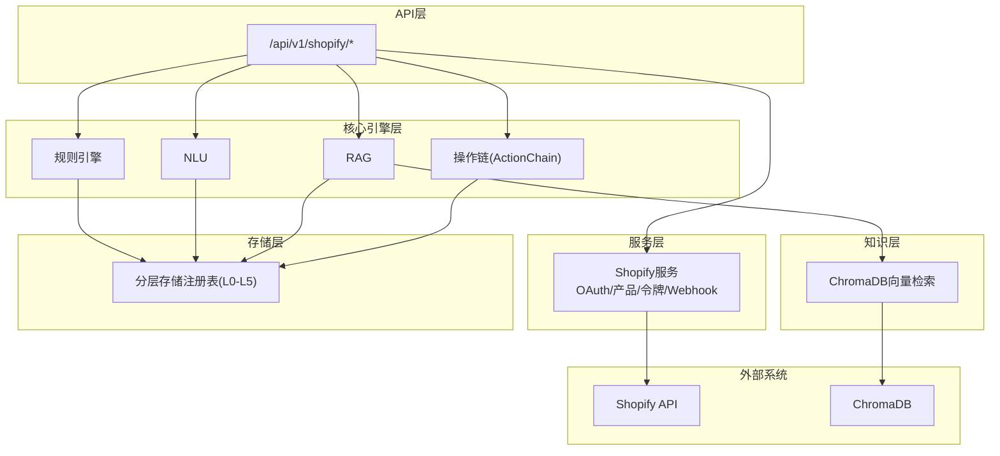
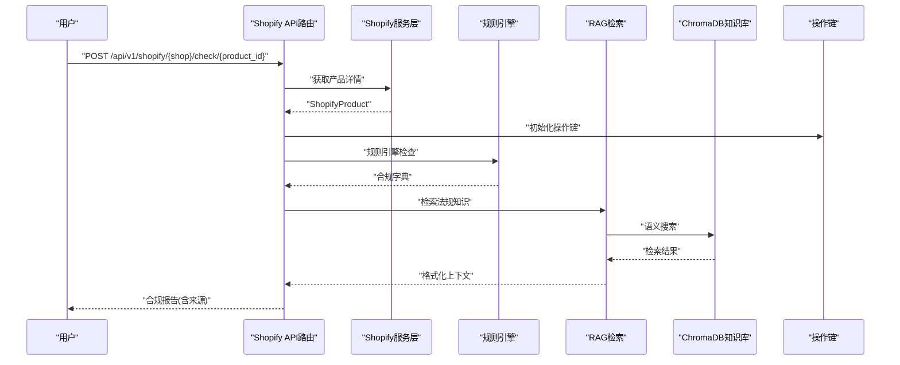
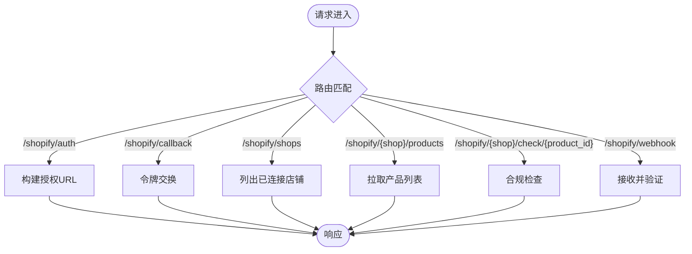
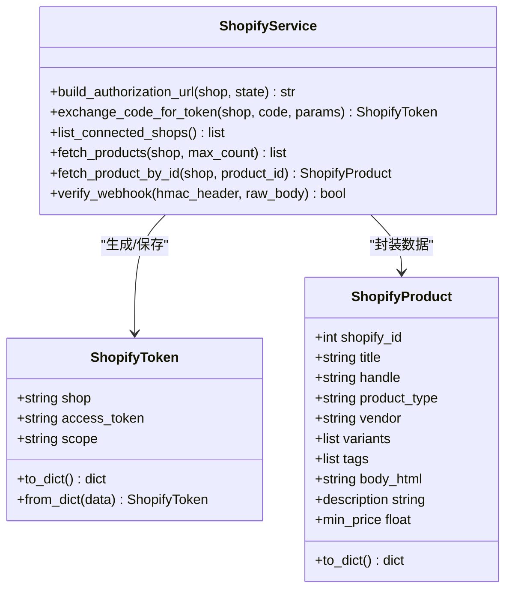
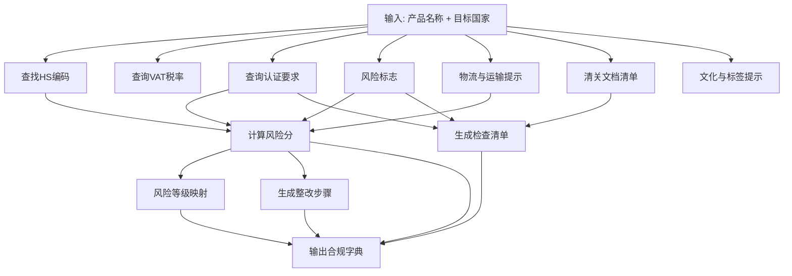
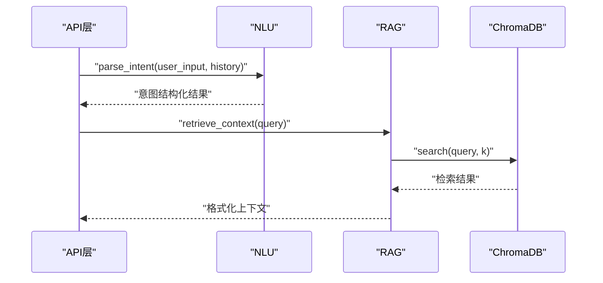
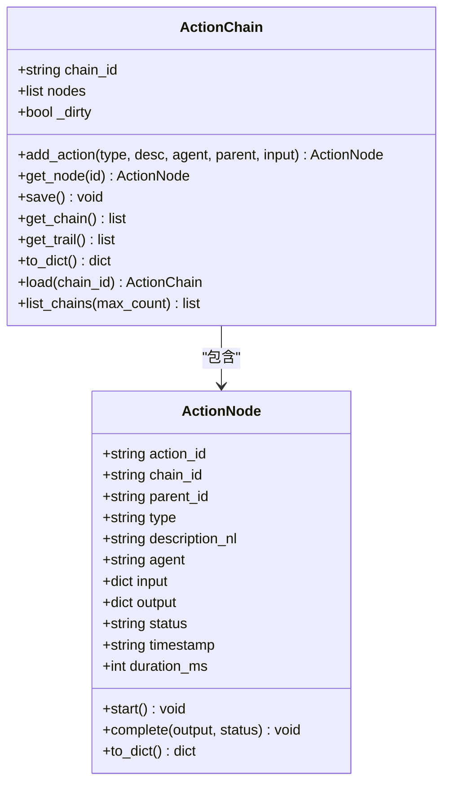
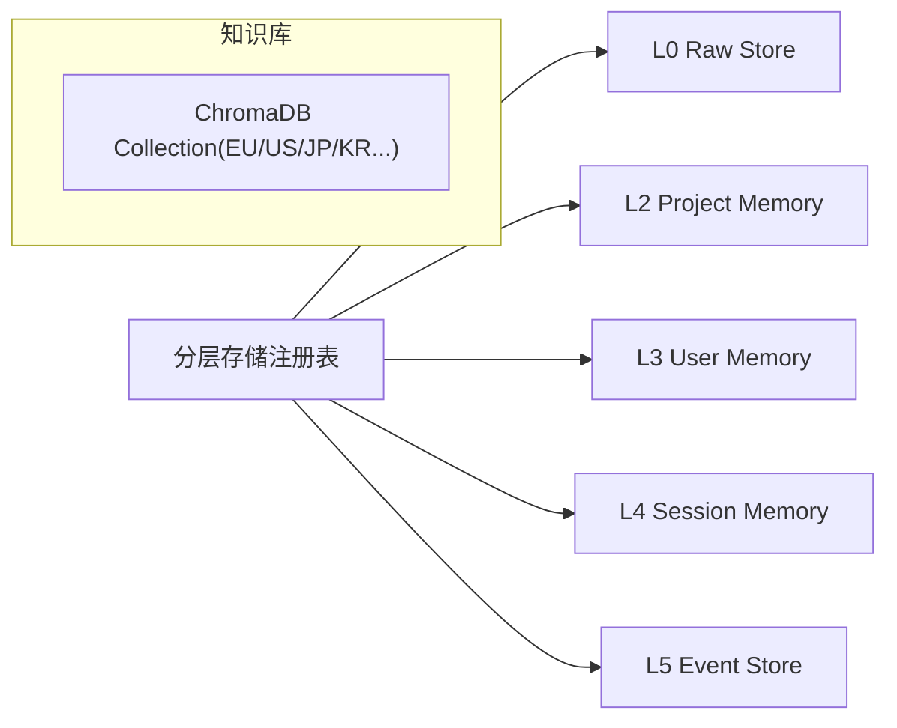
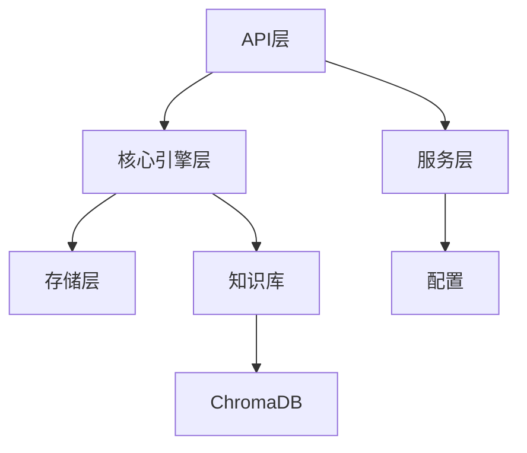

# Shopify集成服务

<cite>
**本文档引用的文件**
- [backend/app/api/shopify.py](file://backend/app/api/shopify.py)
- [backend/app/services/shopify.py](file://backend/app/services/shopify.py)
- [backend/app/models/schemas.py](file://backend/app/models/schemas.py)
- [backend/app/core/rule_engine.py](file://backend/app/core/rule_engine.py)
- [backend/app/core/nlu.py](file://backend/app/core/nlu.py)
- [backend/app/core/rag.py](file://backend/app/core/rag.py)
- [backend/app/core/action_chain.py](file://backend/app/core/action_chain.py)
- [backend/app/knowledge/store.py](file://backend/app/knowledge/store.py)
- [backend/app/storage/layer_registry.py](file://backend/app/storage/layer_registry.py)
- [backend/app/config.py](file://backend/app/config.py)
</cite>

## 目录
1. [简介](#简介)
2. [项目结构](#项目结构)
3. [核心组件](#核心组件)
4. [架构总览](#架构总览)
5. [详细组件分析](#详细组件分析)
6. [依赖关系分析](#依赖关系分析)
7. [性能考虑](#性能考虑)
8. [故障排除指南](#故障排除指南)
9. [结论](#结论)
10. [附录](#附录)

## 简介
本文件面向Shopify集成服务的技术与非技术读者，系统性阐述电商合规检查系统的架构设计与实现要点。重点涵盖：
- Shopify API集成：OAuth授权、产品数据同步、Webhook验证
- 产品合规检查流程：产品信息提取、市场规则匹配、合规状态评估、风险预警
- 数据同步机制：增量更新、冲突解决、数据一致性保障
- Shopify应用集成指南：OAuth配置、Webhook处理、权限管理
- 实际使用示例：如何调用Shopify服务进行产品合规检查
- API限制与性能优化：请求频率控制、缓存机制、批量处理

## 项目结构
后端采用FastAPI框架，按职责分层组织：
- API层：对外HTTP接口，负责路由与参数校验
- 服务层：封装Shopify SDK调用、令牌管理、产品数据同步
- 核心引擎层：规则引擎、NLU、RAG、操作链追踪
- 知识层：ChromaDB向量检索
- 存储层：分层存储注册表，统一访问L0-L5存储

图表来源
- [backend/app/api/shopify.py:38-257](file://backend/app/api/shopify.py#L38-L257)
- [backend/app/services/shopify.py:1-427](file://backend/app/services/shopify.py#L1-L427)
- [backend/app/core/rule_engine.py:1-247](file://backend/app/core/rule_engine.py#L1-L247)
- [backend/app/core/nlu.py:1-99](file://backend/app/core/nlu.py#L1-L99)
- [backend/app/core/rag.py:1-59](file://backend/app/core/rag.py#L1-L59)
- [backend/app/core/action_chain.py:1-236](file://backend/app/core/action_chain.py#L1-L236)
- [backend/app/knowledge/store.py:1-227](file://backend/app/knowledge/store.py#L1-L227)
- [backend/app/storage/layer_registry.py:1-45](file://backend/app/storage/layer_registry.py#L1-L45)

章节来源
- [backend/app/api/shopify.py:1-257](file://backend/app/api/shopify.py#L1-L257)
- [backend/app/services/shopify.py:1-427](file://backend/app/services/shopify.py#L1-L427)

## 核心组件
- Shopify API路由与控制器：提供OAuth授权、回调、店铺列表、产品列表、合规检查、Webhook接收等接口
- Shopify服务层：封装Shopify SDK调用，负责会话激活、令牌交换与持久化、产品数据拉取、Webhook HMAC验证
- 规则引擎：基于L0原始数据（HS编码、VAT、认证矩阵）执行确定性合规检查
- NLU：将用户输入解析为结构化意图，支撑多轮对话与个性化
- RAG：ChromaDB向量检索，提供法规知识引用与上下文增强
- 操作链：记录每次合规检查的完整操作轨迹，便于审计与回溯
- 知识库：多市场collection，支持离线嵌入与跨库检索
- 分层存储：统一访问L0-L5存储，承载合规档案、事件与会话

章节来源
- [backend/app/api/shopify.py:38-257](file://backend/app/api/shopify.py#L38-L257)
- [backend/app/services/shopify.py:1-427](file://backend/app/services/shopify.py#L1-L427)
- [backend/app/core/rule_engine.py:1-247](file://backend/app/core/rule_engine.py#L1-L247)
- [backend/app/core/nlu.py:1-99](file://backend/app/core/nlu.py#L1-L99)
- [backend/app/core/rag.py:1-59](file://backend/app/core/rag.py#L1-L59)
- [backend/app/core/action_chain.py:1-236](file://backend/app/core/action_chain.py#L1-L236)
- [backend/app/knowledge/store.py:1-227](file://backend/app/knowledge/store.py#L1-L227)
- [backend/app/storage/layer_registry.py:1-45](file://backend/app/storage/layer_registry.py#L1-L45)

## 架构总览
系统围绕“合规检查”主线，结合Shopify数据与内部知识库，形成“确定性规则 + 开放式检索”的双轨检查体系。

图表来源
- [backend/app/api/shopify.py:127-201](file://backend/app/api/shopify.py#L127-L201)
- [backend/app/services/shopify.py:311-359](file://backend/app/services/shopify.py#L311-L359)
- [backend/app/core/rule_engine.py:197-247](file://backend/app/core/rule_engine.py#L197-L247)
- [backend/app/core/rag.py:10-59](file://backend/app/core/rag.py#L10-L59)
- [backend/app/core/action_chain.py:77-184](file://backend/app/core/action_chain.py#L77-L184)

## 详细组件分析

### Shopify API路由与控制器
- OAuth授权与回调：发起授权URL、回调参数校验与令牌交换
- 店铺与产品：列出已连接店铺、拉取产品列表、按ID获取产品详情
- 合规检查：组合规则引擎与RAG检索，生成合规报告
- Webhook：接收Shopify推送事件，进行HMAC验证并落盘日志

图表来源
- [backend/app/api/shopify.py:41-257](file://backend/app/api/shopify.py#L41-L257)

章节来源
- [backend/app/api/shopify.py:41-257](file://backend/app/api/shopify.py#L41-L257)

### Shopify服务层（SDK封装）
- OAuth：构建授权URL、交换令牌、保存令牌文件
- 会话管理：激活/清理Shopify会话，异步执行SDK调用
- 产品数据：按页拉取产品列表、按ID获取产品详情
- Webhook验证：基于客户端密钥计算HMAC，支持十六进制与Base64两种格式
- 数据模型：ShopifyToken、ShopifyProduct及其属性（描述、最低价格）

图表来源
- [backend/app/services/shopify.py:40-427](file://backend/app/services/shopify.py#L40-L427)

章节来源
- [backend/app/services/shopify.py:144-393](file://backend/app/services/shopify.py#L144-L393)

### 规则引擎（确定性合规检查）
- 数据来源：L0原始数据（HS编码、VAT、认证矩阵）
- 检查流程：HS编码匹配、VAT查询、认证要求、风险标志、物流提示、清关文档、文化提示
- 风险评分与等级映射：综合多项指标计算0-100分并映射为低/中/高
- 整改建议：基于缺失项生成优先级整改步骤

图表来源
- [backend/app/core/rule_engine.py:197-247](file://backend/app/core/rule_engine.py#L197-L247)

章节来源
- [backend/app/core/rule_engine.py:17-247](file://backend/app/core/rule_engine.py#L17-L247)

### NLU与RAG（开放式知识增强）
- NLU：解析用户输入，抽取产品、目标国家、动作与置信度，支持多轮上下文注入
- RAG：ChromaDB向量检索，返回带来源引用的上下文，支持多市场collection

图表来源
- [backend/app/core/nlu.py:59-99](file://backend/app/core/nlu.py#L59-L99)
- [backend/app/core/rag.py:10-59](file://backend/app/core/rag.py#L10-L59)
- [backend/app/knowledge/store.py:127-193](file://backend/app/knowledge/store.py#L127-L193)

章节来源
- [backend/app/core/nlu.py:1-99](file://backend/app/core/nlu.py#L1-L99)
- [backend/app/core/rag.py:1-59](file://backend/app/core/rag.py#L1-L59)
- [backend/app/knowledge/store.py:1-227](file://backend/app/knowledge/store.py#L1-L227)

### 操作链（审计与回溯）
- 记录每次合规检查的完整步骤，支持开始/完成计时、状态计算、持久化与加载
- 输出自然语言链路，便于前端展示与问题定位

图表来源
- [backend/app/core/action_chain.py:23-236](file://backend/app/core/action_chain.py#L23-L236)

章节来源
- [backend/app/core/action_chain.py:1-236](file://backend/app/core/action_chain.py#L1-L236)

### 分层存储与知识库
- 分层存储注册表：统一访问L0-Raw、L2-Project、L3-User、L4-Session、L5-Event
- 知识库：多市场collection，离线SentenceTransformer嵌入，支持跨库检索与文档计数

图表来源
- [backend/app/storage/layer_registry.py:23-45](file://backend/app/storage/layer_registry.py#L23-L45)
- [backend/app/knowledge/store.py:54-79](file://backend/app/knowledge/store.py#L54-L79)

章节来源
- [backend/app/storage/layer_registry.py:1-45](file://backend/app/storage/layer_registry.py#L1-L45)
- [backend/app/knowledge/store.py:1-227](file://backend/app/knowledge/store.py#L1-L227)

## 依赖关系分析
- API层依赖服务层与核心引擎层，核心引擎层依赖存储层与知识库
- Shopify服务层依赖Shopify SDK与配置项
- RAG依赖ChromaDB与市场路由模块

图表来源
- [backend/app/api/shopify.py:25-36](file://backend/app/api/shopify.py#L25-L36)
- [backend/app/services/shopify.py:22-29](file://backend/app/services/shopify.py#L22-L29)
- [backend/app/config.py:163-169](file://backend/app/config.py#L163-L169)
- [backend/app/knowledge/store.py:48-51](file://backend/app/knowledge/store.py#L48-L51)

章节来源
- [backend/app/api/shopify.py:25-36](file://backend/app/api/shopify.py#L25-L36)
- [backend/app/services/shopify.py:22-29](file://backend/app/services/shopify.py#L22-L29)
- [backend/app/config.py:163-169](file://backend/app/config.py#L163-L169)

## 性能考虑
- 异步执行：SDK同步调用通过线程池异步执行，避免阻塞事件循环
- 令牌持久化：本地文件存储，减少重复授权开销
- 限制与分页：产品列表最大250/页，按需限制max_count
- 检索优化：RAG按需检索，ChromaDB懒加载嵌入函数，跨库检索降级处理
- 缓存与降级：知识库不可用时返回空结果，不阻塞主流程

章节来源
- [backend/app/services/shopify.py:131-137](file://backend/app/services/shopify.py#L131-L137)
- [backend/app/services/shopify.py:282-308](file://backend/app/services/shopify.py#L282-L308)
- [backend/app/core/rag.py:16-18](file://backend/app/core/rag.py#L16-L18)
- [backend/app/knowledge/store.py:163-173](file://backend/app/knowledge/store.py#L163-L173)

## 故障排除指南
- OAuth失败：检查客户端ID/密钥、回调URI、scopes配置与HMAC验证
- 未授权访问：确认令牌文件存在且未过期
- API调用异常：查看Shopify SDK抛出的异常信息，关注资源不存在与权限不足
- Webhook被拒：确认X-Shopify-Hmac-SHA256头与原始body签名一致
- 检索无结果：确认知识库文档已导入，collection存在且非空

章节来源
- [backend/app/services/shopify.py:167-198](file://backend/app/services/shopify.py#L167-L198)
- [backend/app/services/shopify.py:214-231](file://backend/app/services/shopify.py#L214-L231)
- [backend/app/services/shopify.py:367-393](file://backend/app/services/shopify.py#L367-L393)
- [backend/app/core/rag.py:16-18](file://backend/app/core/rag.py#L16-L18)
- [backend/app/knowledge/store.py:163-173](file://backend/app/knowledge/store.py#L163-L173)

## 结论
本系统通过Shopify官方SDK与内部规则引擎、NLU、RAG、操作链与知识库的协同，实现了从产品数据到合规报告的自动化闭环。其分层架构与分层存储设计，既保证了确定性检查的稳定性，又提供了开放式的知识增强能力，满足复杂电商合规场景的需求。

## 附录

### Shopify应用集成指南
- OAuth配置
  - 在Shopify Partners后台创建应用，填写客户端ID/密钥与回调URI
  - 在配置中设置scopes与API版本
- Webhook处理
  - 在Shopify后台为应用配置products/create/update/delete事件
  - 后端接收时进行HMAC验证并记录日志
- 权限管理
  - 根据业务需要调整scopes（如读写产品）
  - 令牌文件按店铺域名单独存储，定期轮换与清理

章节来源
- [backend/app/config.py:163-169](file://backend/app/config.py#L163-L169)
- [backend/app/services/shopify.py:144-165](file://backend/app/services/shopify.py#L144-L165)
- [backend/app/services/shopify.py:367-393](file://backend/app/services/shopify.py#L367-L393)

### 实际使用示例（步骤说明）
- 发起OAuth授权：调用授权接口，前端重定向至返回的授权URL
- 完成回调：Shopify回调后交换令牌，保存至本地文件
- 列出已连接店铺：查询已授权的店铺列表
- 拉取产品列表：按需限制数量，获取产品基础信息
- 产品合规检查：传入目标市场，系统自动组合规则引擎与RAG检索生成报告
- Webhook接收：Shopify推送事件，后端验证签名并记录

章节来源
- [backend/app/api/shopify.py:41-257](file://backend/app/api/shopify.py#L41-L257)
- [backend/app/services/shopify.py:257-359](file://backend/app/services/shopify.py#L257-L359)