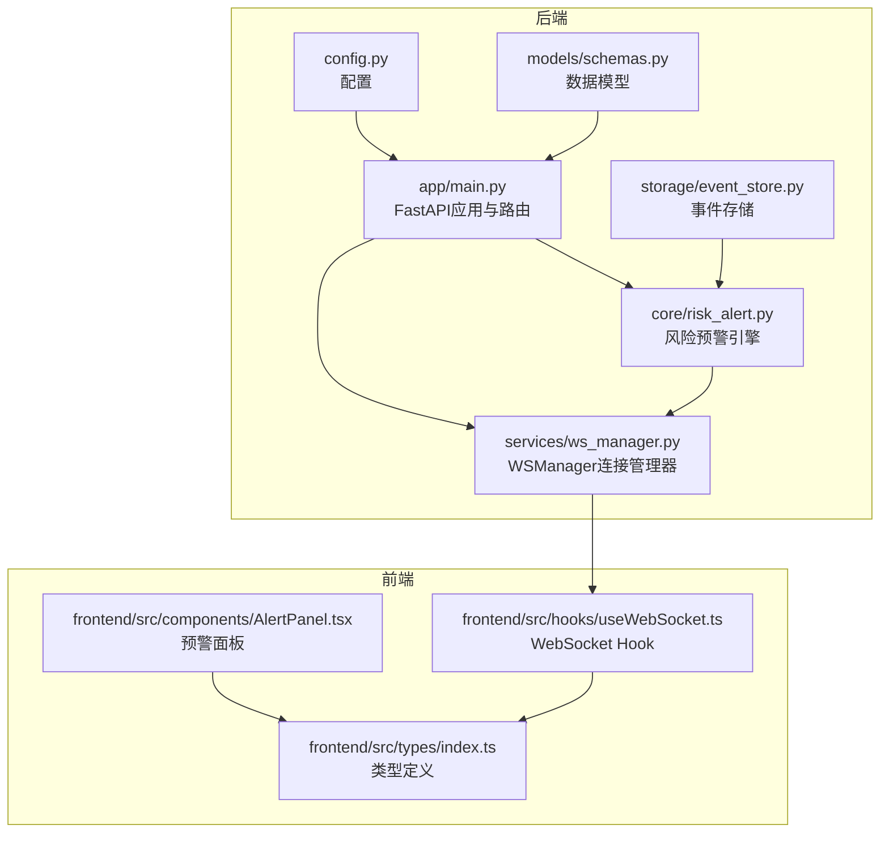
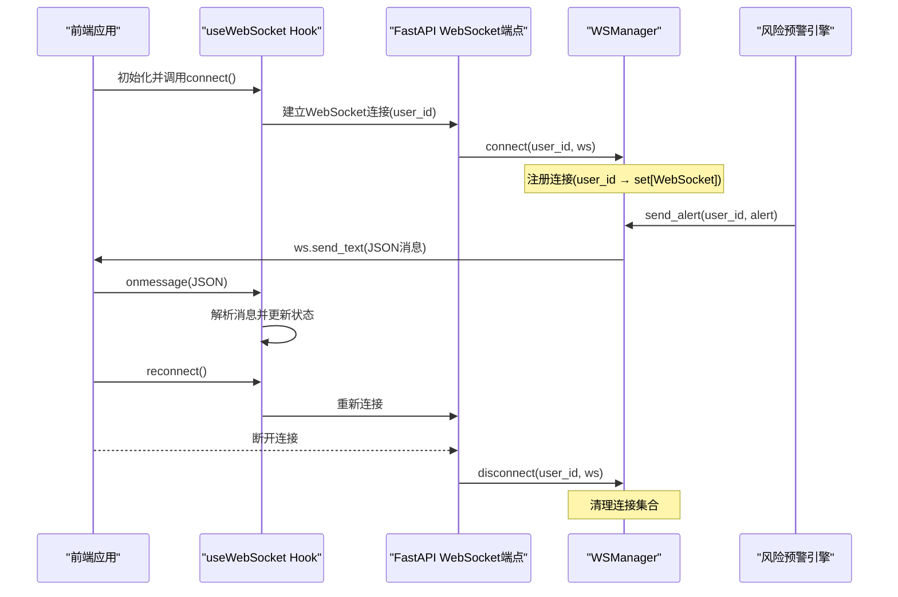
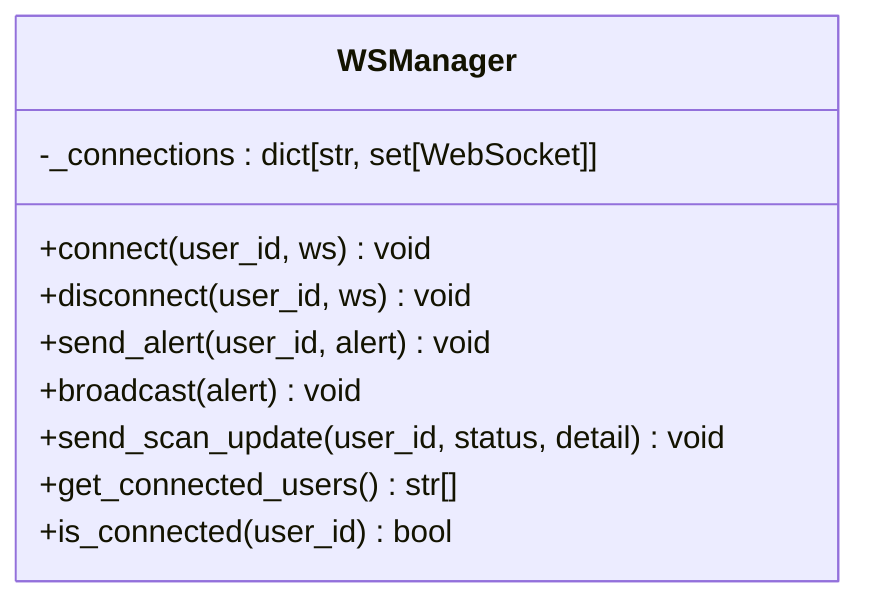
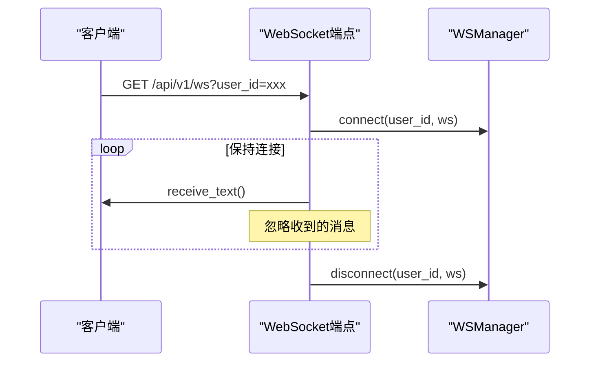
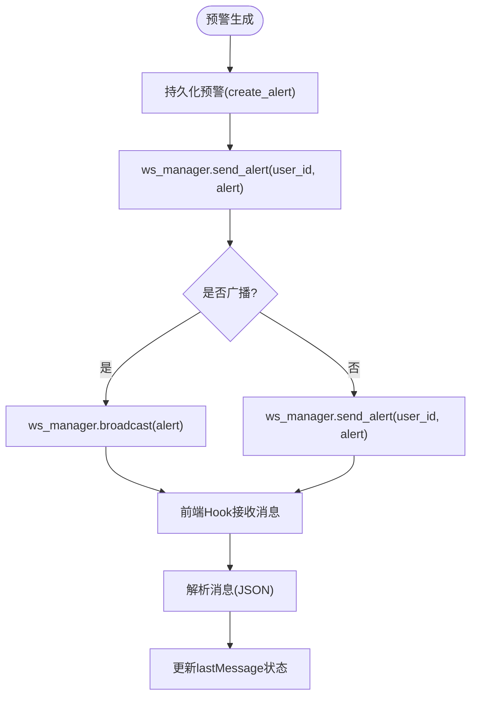
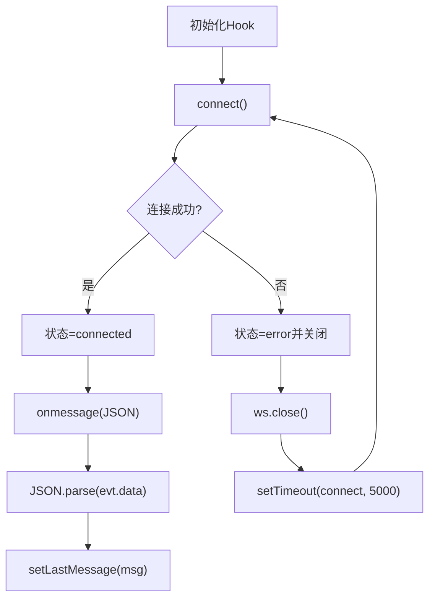
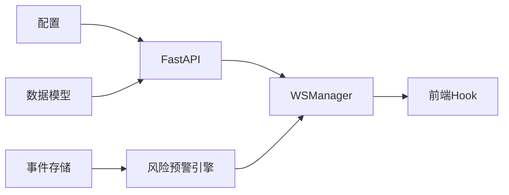

# WebSocket通信服务

<cite>
**本文档引用的文件**
- [backend/app/services/ws_manager.py](file://backend/app/services/ws_manager.py)
- [backend/app/main.py](file://backend/app/main.py)
- [backend/app/core/risk_alert.py](file://backend/app/core/risk_alert.py)
- [backend/app/storage/event_store.py](file://backend/app/storage/event_store.py)
- [backend/app/models/schemas.py](file://backend/app/models/schemas.py)
- [backend/app/config.py](file://backend/app/config.py)
- [frontend/src/hooks/useWebSocket.ts](file://frontend/src/hooks/useWebSocket.ts)
- [frontend/src/components/AlertPanel.tsx](file://frontend/src/components/AlertPanel.tsx)
- [frontend/src/types/index.ts](file://frontend/src/types/index.ts)
</cite>

## 目录
1. [简介](#简介)
2. [项目结构](#项目结构)
3. [核心组件](#核心组件)
4. [架构概览](#架构概览)
5. [详细组件分析](#详细组件分析)
6. [依赖关系分析](#依赖关系分析)
7. [性能考量](#性能考量)
8. [故障排除指南](#故障排除指南)
9. [结论](#结论)
10. [附录](#附录)

## 简介
本文件全面阐述了基于FastAPI的WebSocket通信服务设计与实现，涵盖连接管理、消息路由、状态同步、广播机制、实时通知系统等核心功能。系统采用用户ID到WebSocket连接集合的映射，支持单用户多标签页连接，提供风险预警与扫描状态更新两类实时消息类型，并在前端通过React Hook实现自动重连与消息处理。

## 项目结构
后端采用FastAPI框架，WebSocket端点位于主应用中，连接管理器独立于路由层，便于复用与测试。前端通过自定义Hook封装WebSocket连接、状态管理与自动重连逻辑。

**图表来源**
- [backend/app/main.py:40-58](file://backend/app/main.py#L40-L58)
- [backend/app/services/ws_manager.py:20-95](file://backend/app/services/ws_manager.py#L20-L95)
- [backend/app/core/risk_alert.py:32-82](file://backend/app/core/risk_alert.py#L32-L82)
- [backend/app/storage/event_store.py:59-158](file://backend/app/storage/event_store.py#L59-L158)
- [frontend/src/hooks/useWebSocket.ts:18-67](file://frontend/src/hooks/useWebSocket.ts#L18-L67)

**章节来源**
- [backend/app/main.py:1-78](file://backend/app/main.py#L1-L78)
- [backend/app/services/ws_manager.py:1-95](file://backend/app/services/ws_manager.py#L1-L95)
- [frontend/src/hooks/useWebSocket.ts:1-68](file://frontend/src/hooks/useWebSocket.ts#L1-L68)

## 核心组件
- WebSocket连接管理器：维护user_id到WebSocket集合的映射，支持连接接入、断开清理、单播与广播推送、扫描状态更新推送、在线用户查询与连接状态检查。
- WebSocket端点：接收前端连接，调用连接管理器注册，保持连接直至客户端断开，最终清理连接。
- 风险预警引擎：生成并持久化预警，触发连接管理器向指定用户推送实时预警消息。
- 前端Hook：封装WebSocket连接、状态机、自动重连与消息解析，暴露状态、最新消息与手动重连函数。

**章节来源**
- [backend/app/services/ws_manager.py:20-95](file://backend/app/services/ws_manager.py#L20-L95)
- [backend/app/main.py:42-57](file://backend/app/main.py#L42-L57)
- [backend/app/core/risk_alert.py:32-82](file://backend/app/core/risk_alert.py#L32-L82)
- [frontend/src/hooks/useWebSocket.ts:18-67](file://frontend/src/hooks/useWebSocket.ts#L18-L67)

## 架构概览
系统采用“事件驱动 + 连接池”的实时通信架构。风险预警引擎作为事件生产者，通过连接管理器向目标用户推送JSON消息；前端Hook负责连接生命周期管理与消息消费。

**图表来源**
- [backend/app/main.py:42-57](file://backend/app/main.py#L42-L57)
- [backend/app/services/ws_manager.py:30-44](file://backend/app/services/ws_manager.py#L30-L44)
- [backend/app/services/ws_manager.py:46-68](file://backend/app/services/ws_manager.py#L46-L68)
- [backend/app/core/risk_alert.py:32-82](file://backend/app/core/risk_alert.py#L32-L82)
- [frontend/src/hooks/useWebSocket.ts:24-50](file://frontend/src/hooks/useWebSocket.ts#L24-L50)

## 详细组件分析

### WebSocket连接管理器（WSManager）
- 设计要点
  - 使用字典存储user_id到WebSocket集合的映射，支持单用户多连接（多标签页）。
  - 提供连接接入accept、断开清理discard、单播推送send_alert、全量广播broadcast、扫描状态推送send_scan_update。
  - 在推送过程中捕获异常并清理死亡连接，保证连接池健康。
  - 提供在线用户查询与连接状态检查接口，便于上层业务判断。

**图表来源**
- [backend/app/services/ws_manager.py:20-95](file://backend/app/services/ws_manager.py#L20-L95)

**章节来源**
- [backend/app/services/ws_manager.py:20-95](file://backend/app/services/ws_manager.py#L20-L95)

### WebSocket端点（/api/v1/ws）
- 设计要点
  - 接收user_id查询参数，默认"default"，便于匿名或测试场景。
  - 调用连接管理器注册连接，进入无限循环等待客户端消息，捕获断开异常后清理连接。
  - 保持简单长连接，避免在端点内进行复杂业务处理，将业务逻辑下沉至管理器与事件引擎。

**图表来源**
- [backend/app/main.py:42-57](file://backend/app/main.py#L42-L57)
- [backend/app/services/ws_manager.py:30-44](file://backend/app/services/ws_manager.py#L30-L44)

**章节来源**
- [backend/app/main.py:42-57](file://backend/app/main.py#L42-L57)

### 风险预警引擎与实时推送
- 设计要点
  - create_alert生成并持久化预警，支持指定用户列表批量推送。
  - ws_manager.send_alert将预警转换为JSON消息推送至指定用户，消息格式包含type与payload。
  - 支持扫描状态更新推送send_scan_update，用于系统状态同步。
  - 前端Hook解析消息类型，更新lastMessage状态，驱动UI渲染。

**图表来源**
- [backend/app/core/risk_alert.py:32-82](file://backend/app/core/risk_alert.py#L32-L82)
- [backend/app/services/ws_manager.py:46-68](file://backend/app/services/ws_manager.py#L46-L68)
- [frontend/src/hooks/useWebSocket.ts:43-50](file://frontend/src/hooks/useWebSocket.ts#L43-L50)

**章节来源**
- [backend/app/core/risk_alert.py:32-82](file://backend/app/core/risk_alert.py#L32-L82)
- [backend/app/services/ws_manager.py:46-82](file://backend/app/services/ws_manager.py#L46-L82)
- [frontend/src/hooks/useWebSocket.ts:43-50](file://frontend/src/hooks/useWebSocket.ts#L43-L50)

### 前端WebSocket Hook（useWebSocket）
- 设计要点
  - 状态机：connecting、connected、disconnected、error，便于UI反馈。
  - 自动重连：断开后5秒延迟重连，避免频繁重建。
  - 消息解析：严格JSON解析，非JSON消息忽略，保证健壮性。
  - 生命周期：组件卸载时清理定时器与连接，防止内存泄漏。
  - 重连接口：提供reconnect函数，支持用户主动触发重连。

**图表来源**
- [frontend/src/hooks/useWebSocket.ts:18-67](file://frontend/src/hooks/useWebSocket.ts#L18-L67)

**章节来源**
- [frontend/src/hooks/useWebSocket.ts:18-67](file://frontend/src/hooks/useWebSocket.ts#L18-L67)

### 预警面板与类型定义
- 预警面板根据严重度映射颜色与标签，显示未读数量与告警列表，支持忽略与查看全部。
- 类型定义包含RiskAlert、MarketEvent、DashboardData等，确保前后端数据契约一致。

**章节来源**
- [frontend/src/components/AlertPanel.tsx:26-167](file://frontend/src/components/AlertPanel.tsx#L26-L167)
- [frontend/src/types/index.ts:225-238](file://frontend/src/types/index.ts#L225-L238)

## 依赖关系分析
- 后端依赖
  - FastAPI提供WebSocket端点与路由注册。
  - WSManager独立于路由，降低耦合，便于单元测试。
  - 风险预警引擎与事件存储模块提供数据来源。
  - 配置模块集中管理数据目录与行为开关。
- 前端依赖
  - React Hooks提供状态与副作用管理。
  - TypeScript类型定义确保消息契约一致性。

**图表来源**
- [backend/app/main.py:1-78](file://backend/app/main.py#L1-L78)
- [backend/app/services/ws_manager.py:1-95](file://backend/app/services/ws_manager.py#L1-L95)
- [backend/app/core/risk_alert.py:1-181](file://backend/app/core/risk_alert.py#L1-L181)
- [backend/app/storage/event_store.py:1-269](file://backend/app/storage/event_store.py#L1-L269)
- [backend/app/config.py:1-183](file://backend/app/config.py#L1-L183)
- [backend/app/models/schemas.py:1-264](file://backend/app/models/schemas.py#L1-L264)

**章节来源**
- [backend/app/main.py:1-78](file://backend/app/main.py#L1-L78)
- [backend/app/services/ws_manager.py:1-95](file://backend/app/services/ws_manager.py#L1-L95)
- [backend/app/core/risk_alert.py:1-181](file://backend/app/core/risk_alert.py#L1-L181)
- [backend/app/storage/event_store.py:1-269](file://backend/app/storage/event_store.py#L1-L269)
- [backend/app/config.py:1-183](file://backend/app/config.py#L1-L183)
- [backend/app/models/schemas.py:1-264](file://backend/app/models/schemas.py#L1-L264)

## 性能考量
- 连接池规模
  - 单用户多连接（多标签页）提升用户体验，但需关注内存占用与消息重复推送成本。
- 推送策略
  - 单播与广播分离，减少不必要的网络传输。
  - 异常推送时清理死亡连接，避免阻塞后续推送。
- 前端优化
  - 自动重连指数退避策略可进一步引入以缓解瞬时故障。
  - 消息去重与批量处理可降低UI渲染压力。
- 存储与并发
  - 风险预警持久化采用原子写入，避免竞态与数据损坏。
  - 事件存储支持系统事件与用户事件分离，便于审计与回溯。

## 故障排除指南
- 连接无法建立
  - 检查CORS配置与前端WebSocket地址。
  - 确认后端端点已注册且未被中间件拦截。
- 连接频繁断开
  - 前端Hook默认5秒重连，确认网络稳定性。
  - 后端日志中观察断开原因，排查客户端异常关闭。
- 消息未到达
  - 确认用户ID与连接注册一致。
  - 检查推送前连接池是否存在该用户连接。
- 预警未持久化
  - 检查数据目录权限与磁盘空间。
  - 确认异常处理未吞掉关键错误。

**章节来源**
- [backend/app/main.py:14-20](file://backend/app/main.py#L14-L20)
- [backend/app/services/ws_manager.py:30-44](file://backend/app/services/ws_manager.py#L30-L44)
- [backend/app/core/risk_alert.py:165-181](file://backend/app/core/risk_alert.py#L165-L181)
- [frontend/src/hooks/useWebSocket.ts:33-42](file://frontend/src/hooks/useWebSocket.ts#L33-L42)

## 结论
该WebSocket通信服务通过清晰的职责分离与稳健的连接管理，实现了风险预警与系统状态的实时推送。前端Hook提供了良好的用户体验与错误处理，后端通过事件驱动与连接池管理保障了可扩展性与可靠性。建议在生产环境中结合负载均衡与集群部署，配合心跳检测与资源清理策略，进一步提升系统的稳定性与性能。

## 附录

### WebSocket协议与消息格式
- 端点：GET /api/v1/ws?user_id={用户标识}
- 消息格式：JSON对象，包含type与payload字段
  - type取值："alert" | "scan_update"
  - payload：对应消息的具体内容
- 前端Hook解析：严格JSON解析，非JSON消息忽略

**章节来源**
- [backend/app/main.py:42-48](file://backend/app/main.py#L42-L48)
- [frontend/src/hooks/useWebSocket.ts:3-6](file://frontend/src/hooks/useWebSocket.ts#L3-L6)
- [frontend/src/hooks/useWebSocket.ts:43-50](file://frontend/src/hooks/useWebSocket.ts#L43-L50)

### 实际使用示例（前端）
- 建立连接
  - 调用useWebSocket(userId)，内部自动发起连接
  - 连接状态通过status字段反映
- 处理消息
  - lastMessage包含最新消息，类型为alert或scan_update
  - onmessage回调中解析JSON并更新UI
- 重连
  - reconnect函数可手动触发重连
  - 断开后自动5秒重连

**章节来源**
- [frontend/src/hooks/useWebSocket.ts:18-67](file://frontend/src/hooks/useWebSocket.ts#L18-L67)

### 负载均衡与集群部署
- 连接分布
  - 使用反向代理或负载均衡器分发WebSocket连接
  - 建议在上游层实现粘性会话或共享状态存储
- 心跳与超时
  - 建议在应用层增加ping/pong机制与空闲超时检测
- 状态同步
  - 使用共享存储或发布订阅机制同步跨节点的事件与状态
- 资源清理
  - 定期清理死亡连接与过期会话，避免资源泄露

[本节为概念性指导，不涉及具体文件分析]