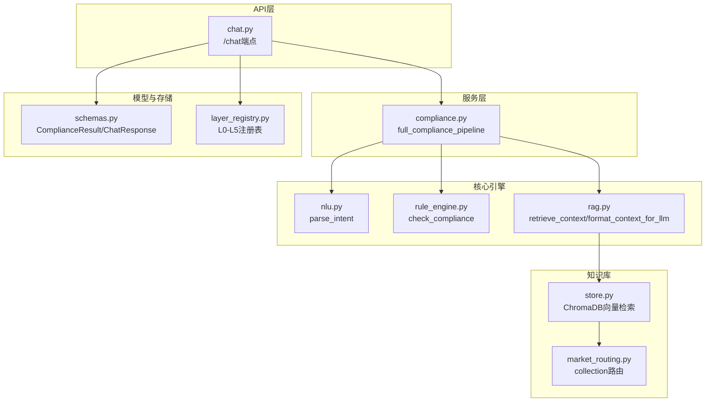
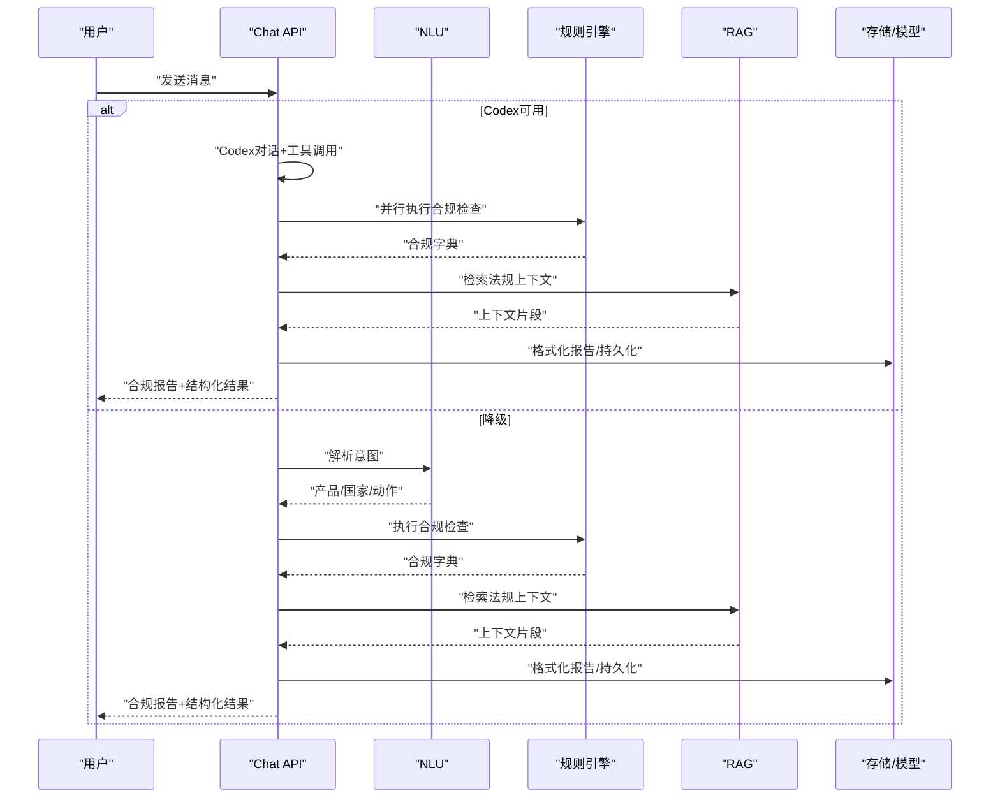
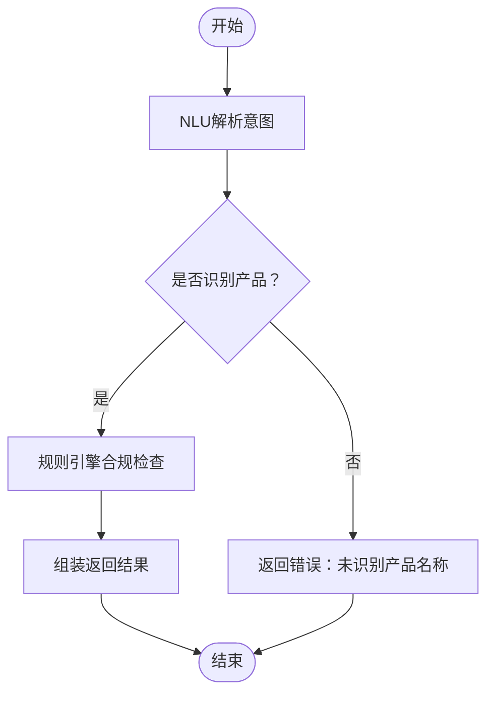
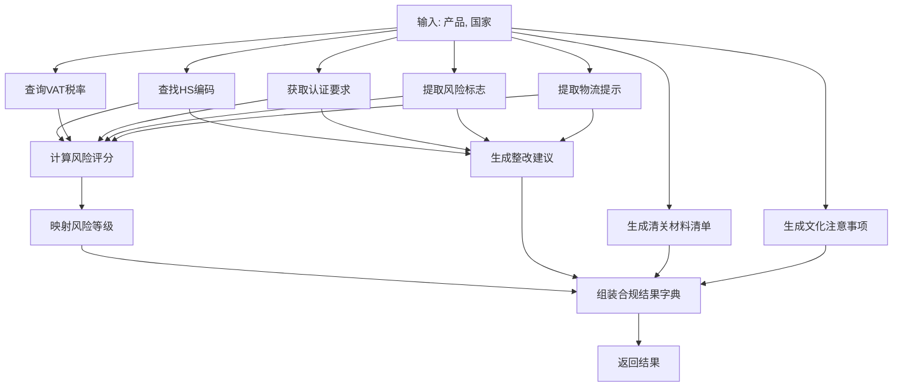
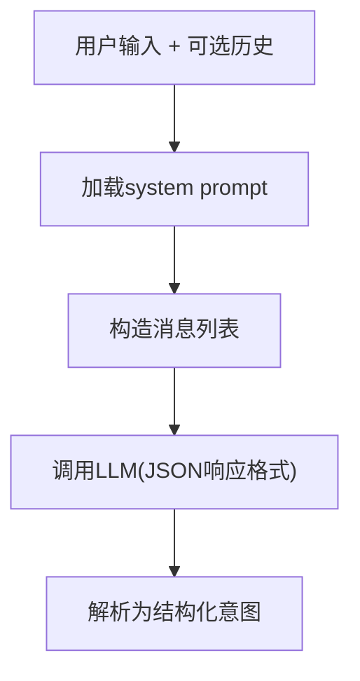
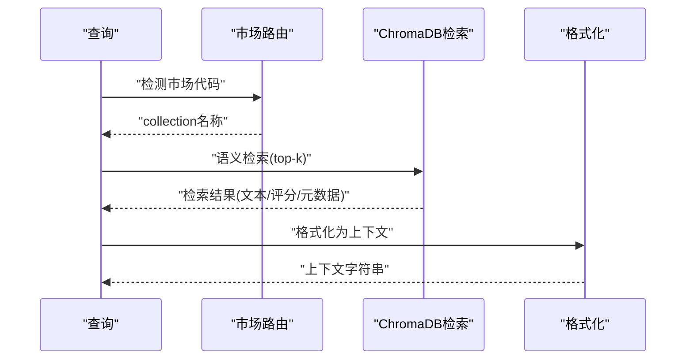
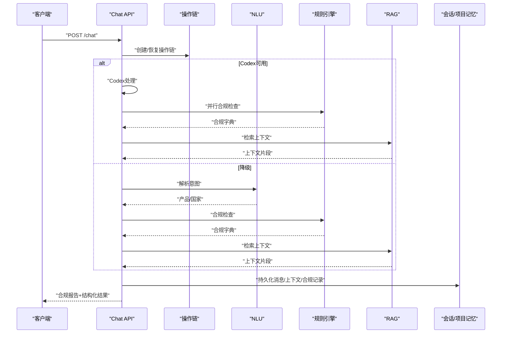
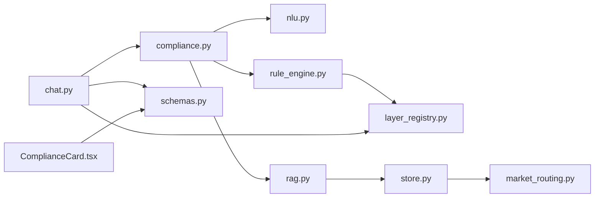

# 合规处理服务

<cite>
**本文档引用的文件**
- [backend/app/services/compliance.py](file://backend/app/services/compliance.py)
- [backend/app/core/rule_engine.py](file://backend/app/core/rule_engine.py)
- [backend/app/core/nlu.py](file://backend/app/core/nlu.py)
- [backend/app/core/rag.py](file://backend/app/core/rag.py)
- [backend/app/knowledge/market_routing.py](file://backend/app/knowledge/market_routing.py)
- [backend/app/knowledge/store.py](file://backend/app/knowledge/store.py)
- [backend/app/api/chat.py](file://backend/app/api/chat.py)
- [backend/app/models/schemas.py](file://backend/app/models/schemas.py)
- [backend/app/storage/layer_registry.py](file://backend/app/storage/layer_registry.py)
- [backend/data/raw/vat_rates/_all.json](file://backend/data/raw/vat_rates/_all.json)
- [backend/data/raw/certifications/cert_matrix.json](file://backend/data/raw/certifications/cert_matrix.json)
- [backend/data/prompts/nlu_fallback.yaml](file://backend/data/prompts/nlu_fallback.yaml)
- [backend/frontend/src/components/ComplianceCard.tsx](file://backend/frontend/src/components/ComplianceCard.tsx)
</cite>

## 目录
1. [简介](#简介)
2. [项目结构](#项目结构)
3. [核心组件](#核心组件)
4. [架构总览](#架构总览)
5. [详细组件分析](#详细组件分析)
6. [依赖分析](#依赖分析)
7. [性能考虑](#性能考虑)
8. [故障排查指南](#故障排查指南)
9. [结论](#结论)
10. [附录](#附录)

## 简介
本文件系统性阐述“合规处理服务”的业务与技术实现，聚焦以下能力：
- 合规检查流程的业务逻辑封装：产品合规性验证、目标市场法规查询、HS编码匹配、VAT税率计算、认证要求与风险提示等。
- 合规数据处理管道：输入数据预处理（NLU）、规则引擎调用（确定性）、RAG检索（未来增强）、结果整合与报告生成。
- 合规报告生成机制：结构化数据格式化、自然语言描述生成、多格式输出支持（Markdown/卡片组件）。
- 合规风险评估算法：风险等级计算、违规项识别、合规建议生成等智能分析。
- 合规数据模型定义：产品信息、市场规则、认证状态、历史记录等数据结构。
- 实际使用示例：如何调用合规处理服务进行产品合规检查，以及如何集成到聊天对话系统中。

## 项目结构
后端采用分层与职责分离的设计：
- 服务层：对外提供统一的合规处理入口，编排NLU、规则引擎与RAG。
- 核心引擎：规则引擎负责确定性合规检查（HS/VAT/认证/风险/物流/清关材料/文化提示）。
- 知识库：按市场分collection的向量检索（ChromaDB），支持多语言嵌入。
- API层：聊天接口统一接入Codex或降级路径（NLU→规则引擎→RAG），并持久化会话与操作链。
- 模型层：Pydantic定义合规结果、会话、操作链等数据结构。
- 存储层：L0-L5分层注册表，统一访问原始数据、项目/用户/会话记忆与事件链。

图表来源
- [backend/app/services/compliance.py:11-34](file://backend/app/services/compliance.py#L11-L34)
- [backend/app/core/nlu.py:59-99](file://backend/app/core/nlu.py#L59-L99)
- [backend/app/core/rule_engine.py:197-246](file://backend/app/core/rule_engine.py#L197-L246)
- [backend/app/core/rag.py:10-59](file://backend/app/core/rag.py#L10-L59)
- [backend/app/knowledge/market_routing.py:31-77](file://backend/app/knowledge/market_routing.py#L31-L77)
- [backend/app/knowledge/store.py:127-192](file://backend/app/knowledge/store.py#L127-L192)
- [backend/app/api/chat.py:228-540](file://backend/app/api/chat.py#L228-L540)
- [backend/app/models/schemas.py:79-104](file://backend/app/models/schemas.py#L79-L104)
- [backend/app/storage/layer_registry.py:23-44](file://backend/app/storage/layer_registry.py#L23-L44)

章节来源
- [backend/app/api/chat.py:1-541](file://backend/app/api/chat.py#L1-L541)
- [backend/app/services/compliance.py:1-35](file://backend/app/services/compliance.py#L1-L35)
- [backend/app/core/rule_engine.py:1-247](file://backend/app/core/rule_engine.py#L1-L247)
- [backend/app/core/nlu.py:1-99](file://backend/app/core/nlu.py#L1-L99)
- [backend/app/core/rag.py:1-59](file://backend/app/core/rag.py#L1-L59)
- [backend/app/knowledge/market_routing.py:1-77](file://backend/app/knowledge/market_routing.py#L1-L77)
- [backend/app/knowledge/store.py:1-227](file://backend/app/knowledge/store.py#L1-L227)
- [backend/app/models/schemas.py:1-264](file://backend/app/models/schemas.py#L1-L264)
- [backend/app/storage/layer_registry.py:1-45](file://backend/app/storage/layer_registry.py#L1-L45)

## 核心组件
- 合规服务编排器：接收用户消息，解析意图，调用规则引擎，组装合规报告。
- 规则引擎：基于L0原始数据（HS/VAT/认证矩阵）执行确定性检查，产出风险评分与整改建议。
- NLU：将自然语言转为结构化意图（产品、目标国家、动作、置信度）。
- RAG：按市场路由检索向量知识库，补充法规上下文。
- API端点：统一聊天接口，支持Codex主路径与NLU→规则引擎→RAG降级路径。
- 数据模型：定义合规结果、会话消息、操作链等结构化数据。
- 存储注册表：统一访问L0-L5各层存储。

章节来源
- [backend/app/services/compliance.py:11-34](file://backend/app/services/compliance.py#L11-L34)
- [backend/app/core/rule_engine.py:197-246](file://backend/app/core/rule_engine.py#L197-L246)
- [backend/app/core/nlu.py:59-99](file://backend/app/core/nlu.py#L59-L99)
- [backend/app/core/rag.py:10-59](file://backend/app/core/rag.py#L10-L59)
- [backend/app/api/chat.py:228-540](file://backend/app/api/chat.py#L228-L540)
- [backend/app/models/schemas.py:79-104](file://backend/app/models/schemas.py#L79-L104)
- [backend/app/storage/layer_registry.py:23-44](file://backend/app/storage/layer_registry.py#L23-L44)

## 架构总览
合规处理服务采用“确定性规则引擎 + 可选RAG增强”的双路径设计：
- 主路径（Codex）：Agent处理+工具调用+联网搜索，同时并行执行规则引擎，再组合RAG上下文生成报告。
- 降级路径（NLU→RE→RAG）：当Codex不可用时，自动切换，保证基本合规查询能力。

图表来源
- [backend/app/api/chat.py:228-376](file://backend/app/api/chat.py#L228-L376)
- [backend/app/api/chat.py:415-540](file://backend/app/api/chat.py#L415-L540)
- [backend/app/core/nlu.py:59-99](file://backend/app/core/nlu.py#L59-L99)
- [backend/app/core/rule_engine.py:197-246](file://backend/app/core/rule_engine.py#L197-L246)
- [backend/app/core/rag.py:10-59](file://backend/app/core/rag.py#L10-L59)

## 详细组件分析

### 合规服务编排器（compliance.py）
- 职责：端到端合规检查编排，当前以规则引擎为主，预留RAG增强与多代理协调。
- 关键流程：
  - NLU解析意图（产品、目标国家）。
  - 规则引擎执行合规检查，返回结构化结果。
  - 组装返回值（含意图、错误信息、合规结果）。

图表来源
- [backend/app/services/compliance.py:11-34](file://backend/app/services/compliance.py#L11-L34)

章节来源
- [backend/app/services/compliance.py:1-35](file://backend/app/services/compliance.py#L1-L35)

### 规则引擎（rule_engine.py）
- 职责：基于L0原始数据执行确定性合规检查，涵盖HS编码匹配、VAT查询、认证要求、风险标志、物流提示、清关材料建议、文化注意事项、风险评分与整改建议。
- 数据来源：
  - HS编码：模糊匹配产品名称到HS条目。
  - VAT：按国家查询标准税率。
  - 认证矩阵：按国家返回所需认证列表。
- 风险评估：
  - 风险评分函数综合HS匹配、认证数量、风险标志、物流限制与高风险品类权重。
  - 风险等级映射（低/中/高）。
- 整改建议：基于缺失项生成优先级整改步骤。
- 输出：合规结果字典，供上层组装为结构化模型。

图表来源
- [backend/app/core/rule_engine.py:17-246](file://backend/app/core/rule_engine.py#L17-L246)

章节来源
- [backend/app/core/rule_engine.py:1-247](file://backend/app/core/rule_engine.py#L1-L247)

### NLU意图解析（nlu.py）
- 职责：将中文自然语言转为结构化JSON（产品、目标国家、动作、置信度）。
- 机制：
  - 支持从Agent配置或YAML兜底prompt渲染。
  - 可注入历史上下文（最多6条），并截断助手消息避免污染。
  - 使用设置中的LLM参数与响应格式约束。

图表来源
- [backend/app/core/nlu.py:59-99](file://backend/app/core/nlu.py#L59-L99)
- [backend/data/prompts/nlu_fallback.yaml:1-20](file://backend/data/prompts/nlu_fallback.yaml#L1-L20)

章节来源
- [backend/app/core/nlu.py:1-99](file://backend/app/core/nlu.py#L1-L99)
- [backend/data/prompts/nlu_fallback.yaml:1-20](file://backend/data/prompts/nlu_fallback.yaml#L1-L20)

### RAG检索与上下文格式化（rag.py + knowledge/store.py + market_routing.py）
- 职责：按市场路由检索相关法规知识，格式化为LLM可读上下文。
- 市场路由：
  - 按查询关键词自动选择collection（如eu/de/us/jp/kr）。
  - 默认回退到eu集合。
- 向量检索：
  - 多语言嵌入模型（SentenceTransformer），本地加载。
  - 支持懒加载客户端与collection缓存。
  - 查询失败时降级返回空结果，不阻塞主流程。
- 上下文格式：
  - 带来源、生效日期、相关度评分与原文片段。

图表来源
- [backend/app/core/rag.py:10-59](file://backend/app/core/rag.py#L10-L59)
- [backend/app/knowledge/store.py:127-192](file://backend/app/knowledge/store.py#L127-L192)
- [backend/app/knowledge/market_routing.py:31-77](file://backend/app/knowledge/market_routing.py#L31-L77)

章节来源
- [backend/app/core/rag.py:1-59](file://backend/app/core/rag.py#L1-L59)
- [backend/app/knowledge/store.py:1-227](file://backend/app/knowledge/store.py#L1-L227)
- [backend/app/knowledge/market_routing.py:1-77](file://backend/app/knowledge/market_routing.py#L1-L77)

### 聊天API与报告生成（chat.py）
- 职责：统一聊天入口，支持Codex主路径与NLU→规则引擎→RAG降级路径。
- 主路径（Codex）：
  - Agent处理+工具调用+联网搜索。
  - 并行执行规则引擎获取结构化合规数据。
  - 组合RAG上下文生成最终报告。
- 降级路径（NLU→RE→RAG）：
  - 解析意图→规则引擎→RAG→报告生成。
- 报告格式化：
  - Markdown合规报告，包含HS、VAT、认证、风险、物流、清关材料、文化注意事项、整改建议与待办清单。
- 持久化：
  - 会话消息、当前产品/市场上下文、合规记录写入项目记忆。

图表来源
- [backend/app/api/chat.py:228-376](file://backend/app/api/chat.py#L228-L376)
- [backend/app/api/chat.py:415-540](file://backend/app/api/chat.py#L415-L540)

章节来源
- [backend/app/api/chat.py:1-541](file://backend/app/api/chat.py#L1-L541)

### 数据模型（schemas.py）
- 关键模型：
  - ComplianceResult：合规检查结果（HS/VAT/认证/风险等级/评分/风险标志/物流/清关材料/文化提示/整改建议/待办清单）。
  - ChatResponse：对话响应（消息、合规结果、来源摘要、会话ID、操作链ID、意图）。
  - 会话与操作链模型：ActionChainSchema/ActionNodeSchema等。
- 作用：规范前后端数据交换，保障UI渲染与后续分析。

章节来源
- [backend/app/models/schemas.py:79-104](file://backend/app/models/schemas.py#L79-L104)
- [backend/app/models/schemas.py:108-139](file://backend/app/models/schemas.py#L108-L139)
- [backend/app/models/schemas.py:236-264](file://backend/app/models/schemas.py#L236-L264)

### 存储注册表（layer_registry.py）
- 职责：统一访问L0-L5分层存储（原始数据、项目/用户/会话记忆、事件链）。
- 价值：屏蔽底层细节，便于扩展与维护。

章节来源
- [backend/app/storage/layer_registry.py:23-44](file://backend/app/storage/layer_registry.py#L23-L44)

### 前端合规卡片（ComplianceCard.tsx）
- 职责：渲染合规结果卡片，展示HS编码、VAT、风险评分、认证要求、物流/材料提示与待办清单。
- 设计：按风险等级着色，支持移动端友好布局。

章节来源
- [backend/frontend/src/components/ComplianceCard.tsx:1-141](file://backend/frontend/src/components/ComplianceCard.tsx#L1-L141)

## 依赖分析
- 服务层依赖核心引擎与NLU；核心引擎依赖存储注册表访问L0数据；RAG依赖知识库存储与市场路由；API层依赖模型与存储；前端依赖模型与组件。

图表来源
- [backend/app/services/compliance.py:7-8](file://backend/app/services/compliance.py#L7-L8)
- [backend/app/core/rule_engine.py](file://backend/app/core/rule_engine.py#L14)
- [backend/app/core/rag.py](file://backend/app/core/rag.py#L7)
- [backend/app/knowledge/store.py:18-19](file://backend/app/knowledge/store.py#L18-L19)
- [backend/app/knowledge/market_routing.py:19-25](file://backend/app/knowledge/market_routing.py#L19-L25)
- [backend/app/api/chat.py:16-24](file://backend/app/api/chat.py#L16-L24)
- [backend/app/models/schemas.py:79-104](file://backend/app/models/schemas.py#L79-L104)
- [backend/frontend/src/components/ComplianceCard.tsx:1-5](file://backend/frontend/src/components/ComplianceCard.tsx#L1-L5)

章节来源
- [backend/app/services/compliance.py:1-35](file://backend/app/services/compliance.py#L1-L35)
- [backend/app/core/rule_engine.py:1-247](file://backend/app/core/rule_engine.py#L1-L247)
- [backend/app/core/rag.py:1-59](file://backend/app/core/rag.py#L1-L59)
- [backend/app/knowledge/store.py:1-227](file://backend/app/knowledge/store.py#L1-L227)
- [backend/app/knowledge/market_routing.py:1-77](file://backend/app/knowledge/market_routing.py#L1-L77)
- [backend/app/api/chat.py:1-541](file://backend/app/api/chat.py#L1-L541)
- [backend/app/models/schemas.py:1-264](file://backend/app/models/schemas.py#L1-L264)
- [backend/frontend/src/components/ComplianceCard.tsx:1-141](file://backend/frontend/src/components/ComplianceCard.tsx#L1-L141)

## 性能考虑
- NLU与规则引擎均为确定性/快速路径，适合高频调用。
- RAG检索在无文档或检索失败时降级为空结果，避免阻塞主流程。
- 向量检索采用懒加载与本地嵌入模型，减少网络依赖。
- 建议：
  - 控制RAG检索top_k规模，平衡召回与延迟。
  - 对高频产品/国家组合建立缓存（可在上层实现）。
  - 将复杂规则迁移至规则引擎，保持LLM调用最小化。

## 故障排查指南
- 未配置LLM API Key：
  - 现象：通用问题无法回答，降级提示。
  - 处理：在管理后台配置模型配置页面。
- 产品名称未识别：
  - 现象：返回错误提示“未能识别产品名称，请描述更具体一些”。
  - 处理：提供更具体的中文产品名称与用途。
- 无检索结果：
  - 现象：RAG返回“知识库中暂未找到相关法规信息”。
  - 处理：检查知识库是否初始化、市场路由是否正确、关键词是否准确。
- 风险评分异常：
  - 现象：评分偏高或偏低。
  - 处理：检查HS匹配、认证数量、风险标志与高风险品类标记是否合理。

章节来源
- [backend/app/api/chat.py:381-413](file://backend/app/api/chat.py#L381-L413)
- [backend/app/services/compliance.py:22-27](file://backend/app/services/compliance.py#L22-L27)
- [backend/app/core/rag.py:31-33](file://backend/app/core/rag.py#L31-L33)

## 结论
合规处理服务通过“NLU+规则引擎+可选RAG”的组合，实现了确定性与灵活性的平衡。规则引擎覆盖高频合规场景，RAG提供法规深度补充，API层统一接入与持久化，模型与存储解耦清晰。该架构既满足MVP落地，又为后续多代理协同与知识库扩展预留空间。

## 附录

### 合规数据模型定义（节选）
- ComplianceResult：包含HS编码、VAT税率、认证要求、风险等级与评分、风险标志、物流提示、清关材料、文化注意事项、整改建议与待办清单。
- ChatResponse：包含消息、合规结果、来源摘要、会话ID、操作链ID与意图。
- 会话与操作链：ActionChainSchema/ActionNodeSchema等，用于审计与回溯。

章节来源
- [backend/app/models/schemas.py:79-104](file://backend/app/models/schemas.py#L79-L104)
- [backend/app/models/schemas.py:108-139](file://backend/app/models/schemas.py#L108-L139)
- [backend/app/models/schemas.py:236-264](file://backend/app/models/schemas.py#L236-L264)

### 实际使用示例

- 调用合规处理服务进行产品合规检查
  - 步骤：
    1) 通过聊天API发送合规查询消息（如“手机出口德国”）。
    2) API自动解析意图，调用规则引擎执行合规检查。
    3) 可选地检索RAG知识库补充法规上下文。
    4) 返回结构化合规报告与合规结果。
  - 示例路径：
    - [backend/app/api/chat.py:228-376](file://backend/app/api/chat.py#L228-L376)
    - [backend/app/api/chat.py:415-540](file://backend/app/api/chat.py#L415-L540)

- 集成到聊天对话系统
  - 步骤：
    1) 前端提交消息到后端。
    2) 后端创建/恢复会话，保存用户消息。
    3) 并行执行规则引擎与RAG检索。
    4) 格式化合规报告，返回给前端。
    5) 前端使用ComplianceCard渲染合规卡片。
  - 示例路径：
    - [backend/app/api/chat.py:228-376](file://backend/app/api/chat.py#L228-L376)
    - [backend/frontend/src/components/ComplianceCard.tsx:19-141](file://backend/frontend/src/components/ComplianceCard.tsx#L19-L141)