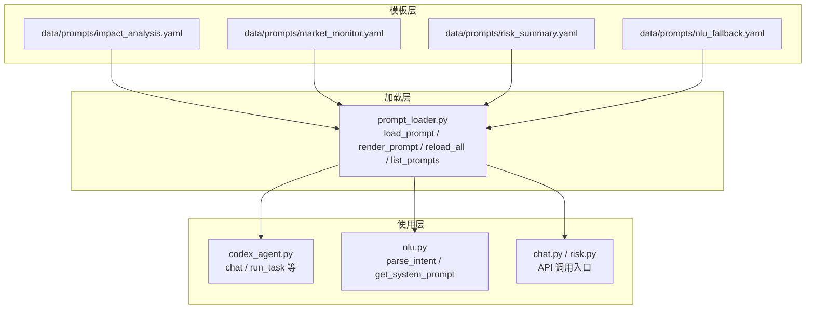
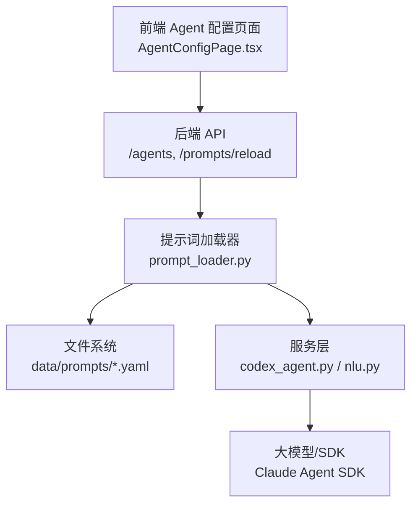
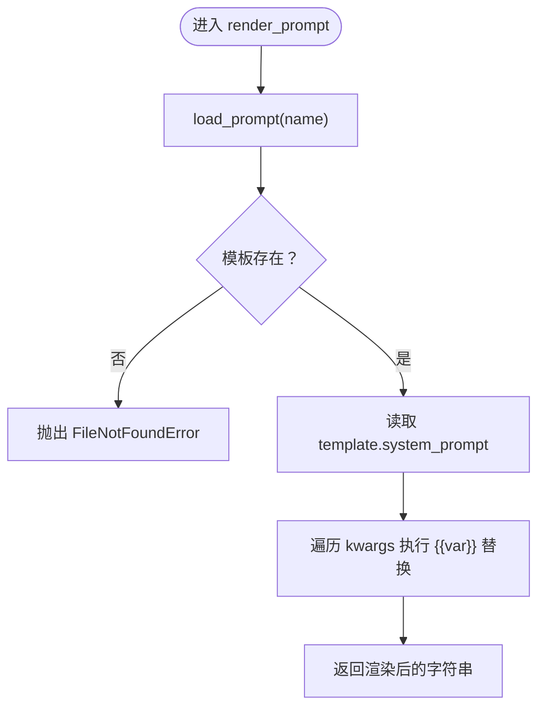
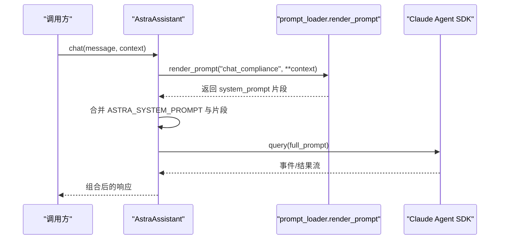
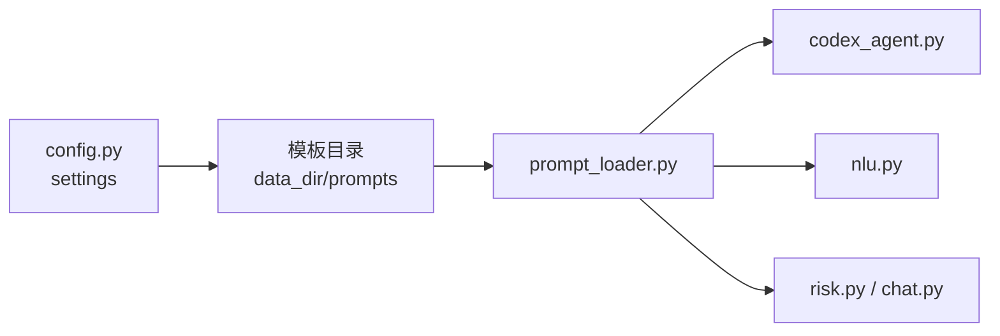

# 提示词管理服务

<cite>
**本文引用的文件**
- [prompt_loader.py](file://backend/app/services/prompt_loader.py)
- [__init__.py](file://backend/data/prompts/__init__.py)
- [impact_analysis.yaml](file://backend/data/prompts/impact_analysis.yaml)
- [market_monitor.yaml](file://backend/data/prompts/market_monitor.yaml)
- [risk_summary.yaml](file://backend/data/prompts/risk_summary.yaml)
- [nlu_fallback.yaml](file://backend/data/prompts/nlu_fallback.yaml)
- [config.py](file://backend/app/config.py)
- [codex_agent.py](file://backend/app/services/codex_agent.py)
- [nlu.py](file://backend/app/core/nlu.py)
- [chat.py](file://backend/app/api/chat.py)
- [risk.py](file://backend/app/api/risk.py)
- [agent_config_store.py](file://backend/app/storage/agent_config_store.py)
- [AgentConfigPage.tsx](file://frontend/src/pages/AgentConfigPage.tsx)
</cite>

## 目录
1. [简介](#简介)
2. [项目结构](#项目结构)
3. [核心组件](#核心组件)
4. [架构总览](#架构总览)
5. [详细组件分析](#详细组件分析)
6. [依赖分析](#依赖分析)
7. [性能考虑](#性能考虑)
8. [故障排查指南](#故障排查指南)
9. [结论](#结论)
10. [附录](#附录)

## 简介
本文件系统性阐述提示词管理服务的设计与实现，重点覆盖提示词模板系统（YAML 驱动）、模板加载与缓存、动态渲染与参数注入、模板组织与用途、热加载与微调、以及在 Codex 智能体中的使用方式。文档同时提供开发指南、最佳实践、调试方法与实际使用示例，帮助读者快速上手并扩展提示词体系。

## 项目结构
提示词管理服务围绕“YAML 模板 + 加载器 + 渲染器”的三层结构展开：
- 模板层：位于 data/prompts 下，以 .yaml 文件组织，定义 system_prompt、输入上下文、输出格式等。
- 加载层：prompt_loader.py 提供模板加载、缓存、热加载与渲染能力。
- 使用层：各业务模块（如 Codex 智能体、NLU、API 接口）通过渲染器注入上下文变量，拼装最终提示词。

图表来源
- [prompt_loader.py:1-79](file://backend/app/services/prompt_loader.py#L1-L79)
- [codex_agent.py:32-684](file://backend/app/services/codex_agent.py#L32-L684)
- [nlu.py:10-99](file://backend/app/core/nlu.py#L10-L99)
- [chat.py:205-305](file://backend/app/api/chat.py#L205-L305)
- [risk.py:141-154](file://backend/app/api/risk.py#L141-L154)

章节来源
- [prompt_loader.py:1-79](file://backend/app/services/prompt_loader.py#L1-L79)
- [__init__.py:1-3](file://backend/data/prompts/__init__.py#L1-L3)

## 核心组件
- 模板加载器（prompt_loader.py）
  - 负责从 data_dir/prompts 目录加载 YAML 模板，带全局内存缓存，支持热加载与枚举。
  - 提供 load_prompt(name)、render_prompt(name, **kwargs)、reload_all()、list_prompts()。
- 提示词模板（YAML）
  - 每个模板文件包含 system_prompt、input_context、output_format 等键位，便于标准化提示词结构。
- 使用方
  - Codex 智能体在多轮对话与一次性任务中调用渲染器注入上下文。
  - NLU 在意图解析时按需渲染兜底提示词。
  - API 层提供热加载接口，便于微调后即时生效。

章节来源
- [prompt_loader.py:23-79](file://backend/app/services/prompt_loader.py#L23-L79)
- [config.py:150-155](file://backend/app/config.py#L150-L155)
- [codex_agent.py:514-684](file://backend/app/services/codex_agent.py#L514-L684)
- [nlu.py:27-99](file://backend/app/core/nlu.py#L27-L99)
- [risk.py:141-154](file://backend/app/api/risk.py#L141-L154)

## 架构总览
提示词管理服务贯穿后端服务与前端配置页面，形成“模板驱动 + 热加载 + 可视化配置”的闭环。

图表来源
- [AgentConfigPage.tsx:38-394](file://frontend/src/pages/AgentConfigPage.tsx#L38-L394)
- [risk.py:141-154](file://backend/app/api/risk.py#L141-L154)
- [prompt_loader.py:1-79](file://backend/app/services/prompt_loader.py#L1-L79)
- [codex_agent.py:32-684](file://backend/app/services/codex_agent.py#L32-L684)
- [nlu.py:10-99](file://backend/app/core/nlu.py#L10-L99)

## 详细组件分析

### 组件一：提示词模板系统（YAML）
- 设计理念
  - 所有提示词以 YAML 文件形式存放，避免硬编码，支持热加载与微调。
  - 模板键位标准化：system_prompt、input_context、output_format。
- 模板示例与用途
  - 影响分析（impact_analysis.yaml）：面向市场变更对用户产品的潜在影响分析，定义输入输出结构。
  - 市场监控（market_monitor.yaml）：Codex 联网搜索任务指令，定义多市场关键词与输出格式。
  - 风险摘要（risk_summary.yaml）：面向用户的自然语言风险概览生成。
  - NLU 兜底（nlu_fallback.yaml）：意图解析的兜底提示词，定义 JSON 字段与规则。
- 组织结构
  - 模板目录由 settings.data_dir/prompts 组织，__init__.py 标识目录用途。

章节来源
- [impact_analysis.yaml:1-19](file://backend/data/prompts/impact_analysis.yaml#L1-L19)
- [market_monitor.yaml:1-36](file://backend/data/prompts/market_monitor.yaml#L1-L36)
- [risk_summary.yaml:1-16](file://backend/data/prompts/risk_summary.yaml#L1-L16)
- [nlu_fallback.yaml:1-20](file://backend/data/prompts/nlu_fallback.yaml#L1-L20)
- [__init__.py:1-3](file://backend/data/prompts/__init__.py#L1-L3)
- [config.py:150-155](file://backend/app/config.py#L150-L155)

### 组件二：模板加载器（prompt_loader.py）
- 核心职责
  - 获取模板目录（settings.data_dir/prompts），加载 YAML，缓存解析结果，提供渲染与热加载能力。
- 关键函数
  - load_prompt(name)：带缓存的模板加载，不存在时报错。
  - render_prompt(name, **kwargs)：将模板中的 {{var}} 替换为传入参数，返回字符串。
  - reload_all()：清空缓存，支持微调后热加载。
  - list_prompts()：枚举可用模板名。
- 错误处理
  - 模板不存在时抛出 FileNotFoundError，并包含 data_dir 信息，便于定位。

图表来源
- [prompt_loader.py:23-70](file://backend/app/services/prompt_loader.py#L23-L70)

章节来源
- [prompt_loader.py:18-79](file://backend/app/services/prompt_loader.py#L18-L79)

### 组件三：Codex 智能体中的提示词使用（codex_agent.py）
- 多轮对话（chat）
  - 将 ASTRA_SYSTEM_PROMPT 与 render_prompt("chat_compliance", **context) 合并，再拼接用户消息，形成完整提示词。
- 一次性任务（run_task）
  - 直接渲染指定模板名，结合 Claude Agent SDK 的 query 执行。
- 流式对话（chat_stream / run_task_stream）
  - 与多轮对话类似，但以事件流形式返回中间结果。

图表来源
- [codex_agent.py:514-611](file://backend/app/services/codex_agent.py#L514-L611)
- [prompt_loader.py:54-70](file://backend/app/services/prompt_loader.py#L54-L70)

章节来源
- [codex_agent.py:514-684](file://backend/app/services/codex_agent.py#L514-L684)

### 组件四：NLU 意图解析中的提示词使用（nlu.py）
- 系统提示词优先级
  - 优先从 Agent 配置表读取通用 Agent 的 system_prompt；
  - 否则回退到渲染 nlu_fallback.yaml；
  - 再否则使用硬编码兜底。
- 调用流程
  - get_system_prompt() 渲染模板或读取数据库；
  - parse_intent() 将 system_prompt 与历史消息、当前输入组合，调用 LLM 获取结构化意图。

章节来源
- [nlu.py:27-99](file://backend/app/core/nlu.py#L27-L99)
- [prompt_loader.py:54-70](file://backend/app/services/prompt_loader.py#L54-L70)

### 组件五：API 热加载与前端配置（risk.py、AgentConfigPage.tsx）
- 热加载接口
  - POST /api/v1/risk/prompts/reload：调用 reload_all() 清空缓存，返回已加载模板清单。
- 前端 Agent 配置
  - 支持编辑 system_prompt 字段，保存后可在运行时生效（取决于具体存储与读取逻辑）。

章节来源
- [risk.py:141-154](file://backend/app/api/risk.py#L141-L154)
- [AgentConfigPage.tsx:38-394](file://frontend/src/pages/AgentConfigPage.tsx#L38-L394)

## 依赖分析
- 组件耦合
  - prompt_loader 是核心依赖点，被 codex_agent、nlu 等模块广泛使用。
  - config.settings 提供 data_dir 与 prompt_dir，决定模板目录位置。
- 外部依赖
  - YAML 解析（PyYAML）。
  - Claude Agent SDK（在 codex_agent 中使用）。
  - OpenAI 客户端（在 nlu 中使用）。

图表来源
- [config.py:150-155](file://backend/app/config.py#L150-L155)
- [prompt_loader.py:18-21](file://backend/app/services/prompt_loader.py#L18-L21)
- [codex_agent.py:32-33](file://backend/app/services/codex_agent.py#L32-L33)
- [nlu.py:10-10](file://backend/app/core/nlu.py#L10-L10)
- [risk.py:141-154](file://backend/app/api/risk.py#L141-L154)

章节来源
- [config.py:150-155](file://backend/app/config.py#L150-L155)
- [prompt_loader.py:10-13](file://backend/app/services/prompt_loader.py#L10-L13)

## 性能考虑
- 缓存策略
  - 全局字典缓存已解析的模板，避免重复 I/O，提升渲染性能。
- 渲染复杂度
  - 当前为简单字符串替换（O(n) 次替换，n 为参数数量），建议在模板变量较多时关注替换次数。
- 热加载
  - reload_all() 清空缓存，配合 API 接口实现微调即生效，减少重启成本。
- I/O 优化
  - 建议将常用模板数量控制在合理范围，避免目录扫描过大；必要时可增加文件名索引。

## 故障排查指南
- 模板未找到
  - 现象：FileNotFoundError，包含 data_dir 信息。
  - 排查：确认 data_dir/prompts 下是否存在对应 .yaml 文件；检查 settings.data_dir 配置。
- 渲染结果为空
  - 现象：render_prompt 返回空字符串。
  - 排查：确认模板中存在 system_prompt 键；检查 kwargs 是否传入了模板中使用的变量名。
- 热加载无效
  - 现象：修改 YAML 后未生效。
  - 排查：调用 /api/v1/risk/prompts/reload；确认 reload_all() 已执行；检查浏览器缓存或前端状态。
- NLU 提示词异常
  - 现象：意图解析失败或输出非 JSON。
  - 排查：确认 nlu_fallback.yaml 存在且格式正确；检查 Agent 配置表中通用 Agent 的 system_prompt 是否可读取。

章节来源
- [prompt_loader.py:38-46](file://backend/app/services/prompt_loader.py#L38-L46)
- [risk.py:141-154](file://backend/app/api/risk.py#L141-L154)
- [nlu.py:35-49](file://backend/app/core/nlu.py#L35-L49)

## 结论
提示词管理服务通过“YAML 模板 + 加载器 + 渲染器”的清晰分层，实现了提示词的可配置、可热加载与可复用。Codex 智能体与 NLU 等模块通过统一的渲染接口注入上下文，既保证了灵活性，也降低了硬编码风险。建议在团队内建立模板命名规范与评审流程，持续完善模板库，提升跨场景复用效率。

## 附录

### 提示词模板组织与用途
- 影响分析（impact_analysis.yaml）
  - 输入：市场事件详情、用户产品列表
  - 输出：每个受影响产品的结构化 JSON（含影响等级、原因、建议操作）
- 市场监控（market_monitor.yaml）
  - 输入：多市场配置（代码、名称、来源、关键词）
  - 输出：每个市场的变更摘要、严重程度、受影响品类、来源链接与要点
- 风险摘要（risk_summary.yaml）
  - 输入：风险警报列表、用户偏好名称
  - 输出：面向用户的自然语言风险概况（总体风险、紧急事项、建议关注市场）
- NLU 兜底（nlu_fallback.yaml）
  - 输入：用户消息
  - 输出：严格 JSON（产品、目标国家、动作、置信度）

章节来源
- [impact_analysis.yaml:1-19](file://backend/data/prompts/impact_analysis.yaml#L1-L19)
- [market_monitor.yaml:1-36](file://backend/data/prompts/market_monitor.yaml#L1-L36)
- [risk_summary.yaml:1-16](file://backend/data/prompts/risk_summary.yaml#L1-L16)
- [nlu_fallback.yaml:1-20](file://backend/data/prompts/nlu_fallback.yaml#L1-L20)

### render_prompt 工作机制详解
- 模板文件解析
  - 通过 load_prompt(name) 读取 YAML，解析为字典。
- 变量替换
  - 从 kwargs 中取出键值，对模板中的 {{key}} 进行字符串替换。
- 上下文合并
  - 在 Codex 场景中，将基础 system_prompt 与 render_prompt 的片段合并，再拼接用户消息。
- 返回结果
  - 返回最终字符串，供 SDK 或 LLM 调用。

章节来源
- [prompt_loader.py:54-70](file://backend/app/services/prompt_loader.py#L54-L70)
- [codex_agent.py:552-557](file://backend/app/services/codex_agent.py#L552-L557)

### 模板继承与复用（当前实现与扩展建议）
- 当前实现
  - 采用“基础模板 + 特殊化模板”的组合方式：例如在 Codex 中先注入 chat_compliance 的上下文，再叠加通用 system_prompt。
- 扩展建议
  - 引入模板继承：在 YAML 中声明 parent 模板，运行时进行合并。
  - 引入条件渲染：在模板中表达条件分支，按上下文选择不同段落。
  - 引入 Jinja2：替换简单替换，支持过滤器、循环、宏等高级语法。

章节来源
- [codex_agent.py:552-557](file://backend/app/services/codex_agent.py#L552-L557)
- [prompt_loader.py:57-58](file://backend/app/services/prompt_loader.py#L57-L58)

### 开发指南与最佳实践
- 模板编写规范
  - 明确 system_prompt、input_context、output_format 三段式结构。
  - 使用占位符 {{var}} 表达动态上下文，避免硬编码。
  - 为每个模板编写简短注释，说明用途与输入输出。
- 参数注入规范
  - 保持 kwargs 键名与模板占位符一致，避免大小写差异。
  - 对敏感信息进行脱敏处理，不在模板中暴露。
- 热加载与微调
  - 修改 YAML 后调用 /api/v1/risk/prompts/reload 生效。
  - 建议在测试环境先行验证，再上线生产。
- 调试方法
  - 通过 list_prompts() 查看可用模板清单。
  - 在 render_prompt 处打印模板与替换后的字符串，定位变量缺失问题。
  - 使用最小化上下文复现问题，逐步缩小范围。

章节来源
- [prompt_loader.py:73-79](file://backend/app/services/prompt_loader.py#L73-L79)
- [risk.py:141-154](file://backend/app/api/risk.py#L141-L154)

### 实际使用示例
- 在 Codex 智能体中使用提示词模板
  - 多轮对话：调用 chat(message, context)，内部通过 render_prompt("chat_compliance", **context) 注入上下文。
  - 一次性任务：调用 run_task(prompt_name, context)，内部通过 render_prompt(prompt_name, **context) 渲染。
- 创建与管理自定义提示词模板
  - 在 data/prompts 下新增 .yaml 文件，定义 system_prompt 与 output_format。
  - 通过 /api/v1/risk/prompts/reload 热加载，或在前端 Agent 配置页面编辑 system_prompt。
- 版本管理与国际化支持（建议）
  - 版本管理：为模板文件增加版本号后缀或目录层级，按版本切换。
  - 国际化：为多语言场景准备多套模板，按语言选择对应模板名。

章节来源
- [codex_agent.py:552-684](file://backend/app/services/codex_agent.py#L552-L684)
- [risk.py:141-154](file://backend/app/api/risk.py#L141-L154)
- [AgentConfigPage.tsx:360-394](file://frontend/src/pages/AgentConfigPage.tsx#L360-L394)