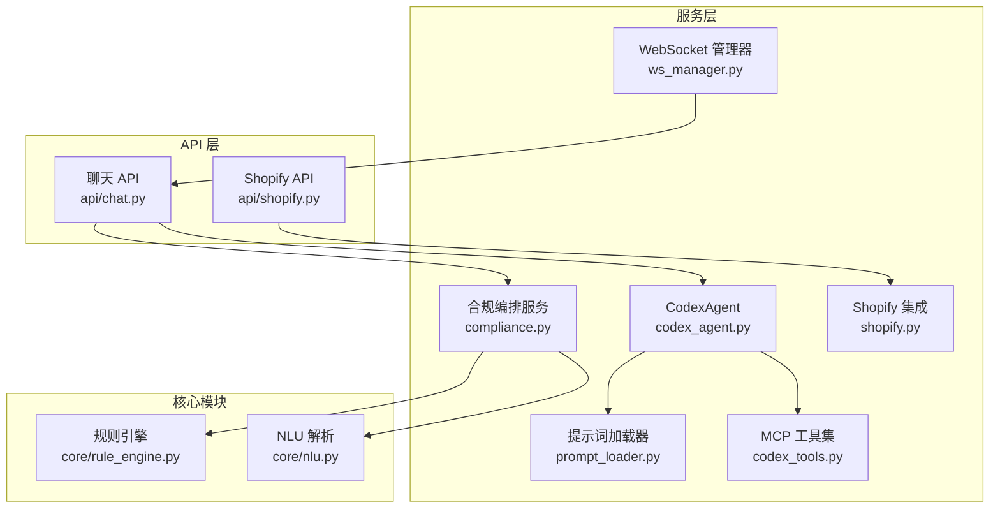
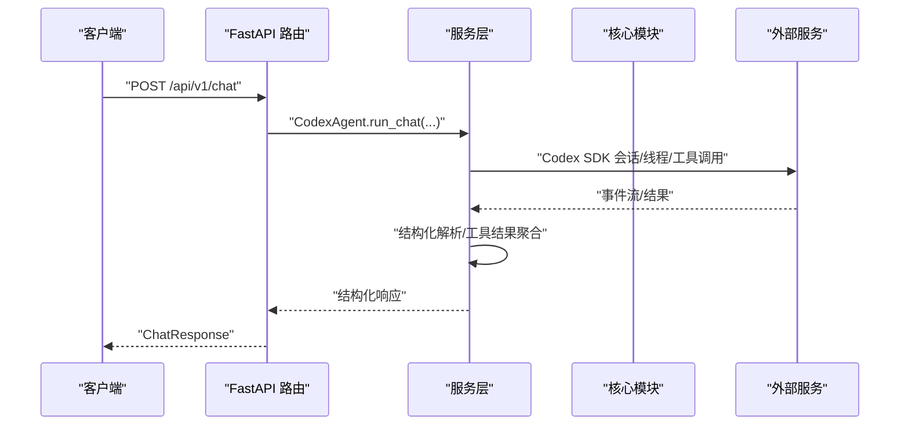
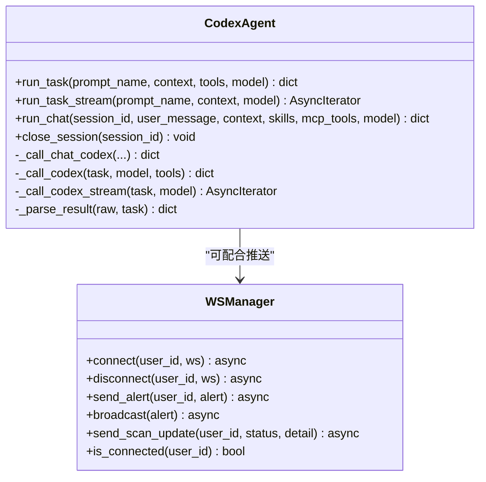
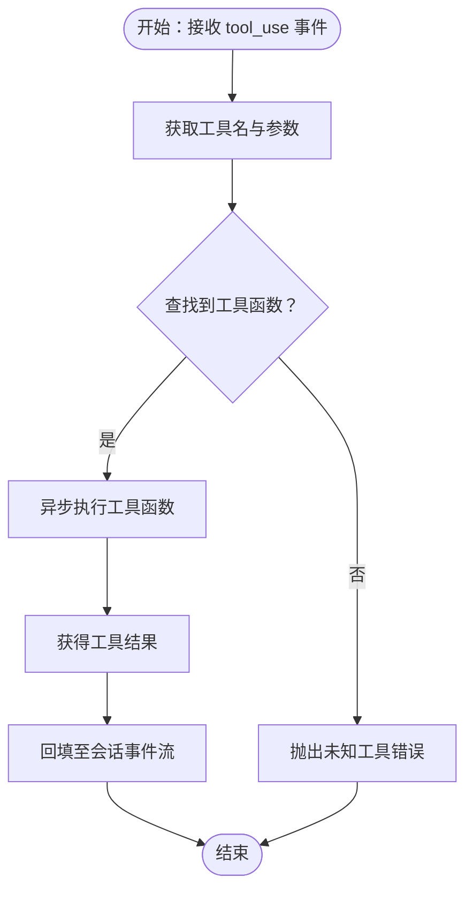
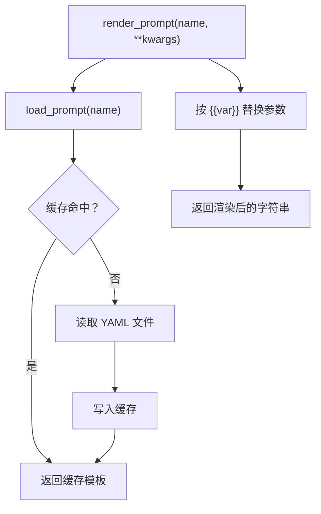
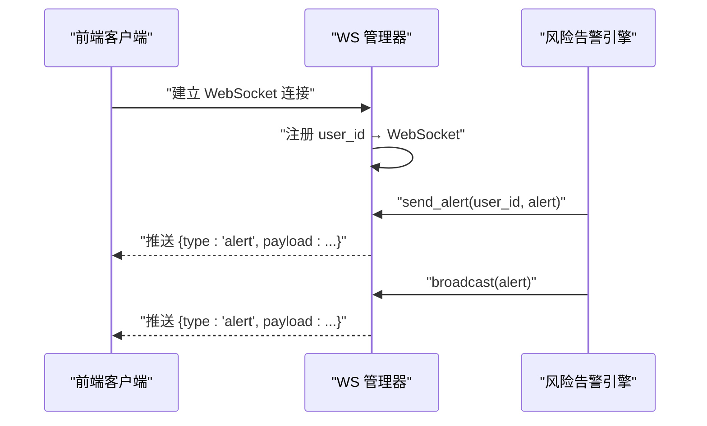
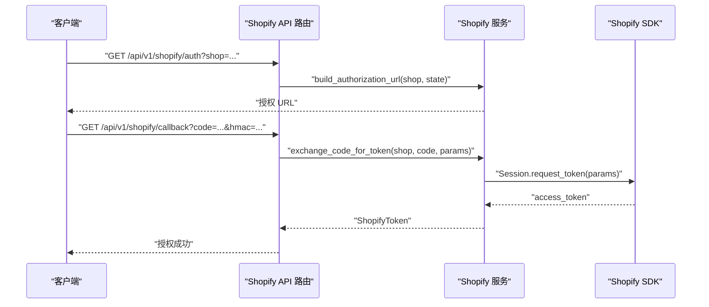
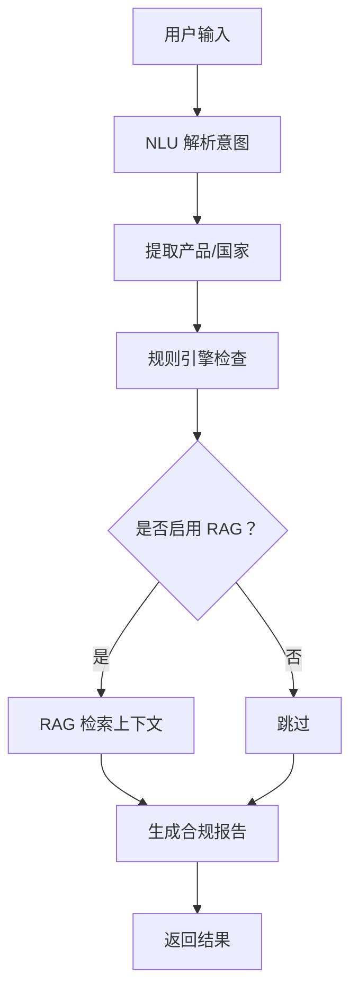
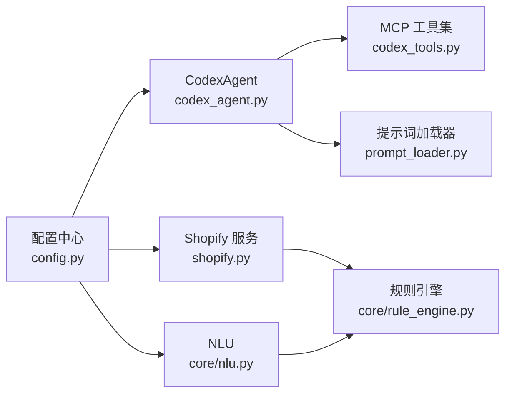

# 服务层架构

<cite>
**本文档引用的文件**
- [codex_agent.py](file://backend/app/services/codex_agent.py)
- [codex_tools.py](file://backend/app/services/codex_tools.py)
- [prompt_loader.py](file://backend/app/services/prompt_loader.py)
- [ws_manager.py](file://backend/app/services/ws_manager.py)
- [shopify.py](file://backend/app/services/shopify.py)
- [compliance.py](file://backend/app/services/compliance.py)
- [main.py](file://backend/app/main.py)
- [config.py](file://backend/app/config.py)
- [chat.py](file://backend/app/api/chat.py)
- [shopify.py](file://backend/app/api/shopify.py)
- [rule_engine.py](file://backend/app/core/rule_engine.py)
- [nlu.py](file://backend/app/core/nlu.py)
</cite>

## 目录
1. [简介](#简介)
2. [项目结构](#项目结构)
3. [核心组件](#核心组件)
4. [架构总览](#架构总览)
5. [详细组件分析](#详细组件分析)
6. [依赖分析](#依赖分析)
7. [性能考虑](#性能考虑)
8. [故障排查指南](#故障排查指南)
9. [结论](#结论)

## 简介
本文件系统性梳理后端服务层架构，重点阐述以下方面：
- 服务层设计模式与职责划分：业务逻辑封装、外部服务集成、工具类管理
- Codex Agent 的服务封装：大模型调用、工具集成、响应处理
- MCP 工具系统的扩展机制：工具注册、参数传递、结果聚合
- 提示词管理器的模板加载与动态替换机制
- WebSocket 管理器的实时通信实现：连接池管理、消息广播、状态同步
- Shopify API 集成的服务封装：API 调用、错误处理、数据转换

## 项目结构
服务层位于 backend/app/services 目录，围绕“单一职责”原则组织，每个服务模块负责特定领域的能力：
- codex_agent.py：Codex 代理封装，统一对外接口，屏蔽底层协议细节
- codex_tools.py：MCP 工具定义与调用桥接，将规则引擎函数暴露为可调用工具
- prompt_loader.py：提示词模板加载与渲染，支持热加载与缓存
- ws_manager.py：WebSocket 连接管理，提供用户级连接池与广播能力
- shopify.py：Shopify 第三方 API 集成，含 OAuth、产品数据同步、Webhook 验证
- compliance.py：合规流水线编排，协调 NLU、规则引擎与未来 RAG

图表来源
- [codex_agent.py:1-372](file://backend/app/services/codex_agent.py#L1-L372)
- [codex_tools.py:1-242](file://backend/app/services/codex_tools.py#L1-L242)
- [prompt_loader.py:1-79](file://backend/app/services/prompt_loader.py#L1-L79)
- [ws_manager.py:1-95](file://backend/app/services/ws_manager.py#L1-L95)
- [shopify.py:1-427](file://backend/app/services/shopify.py#L1-L427)
- [compliance.py:1-35](file://backend/app/services/compliance.py#L1-L35)
- [chat.py:1-200](file://backend/app/api/chat.py#L1-L200)
- [shopify.py:1-200](file://backend/app/api/shopify.py#L1-L200)
- [rule_engine.py:1-200](file://backend/app/core/rule_engine.py#L1-L200)
- [nlu.py:1-99](file://backend/app/core/nlu.py#L1-L99)

章节来源
- [main.py:1-76](file://backend/app/main.py#L1-L76)
- [config.py:1-75](file://backend/app/config.py#L1-L75)

## 核心组件
- CodexAgent：统一的任务执行与多轮对话入口，封装 ephemeral/persistent Thread、工具调用、事件流式处理与结构化解析
- MCP 工具集：将规则引擎函数包装为 Codex 可调用的工具，定义输入 Schema 并提供异步执行桥接
- 提示词加载器：YAML 模板加载、缓存与渲染，支持热加载
- WebSocket 管理器：用户级连接池、消息推送与广播、状态同步
- Shopify 集成：OAuth 授权、令牌存储、产品数据同步、Webhook 验证与合规请求转换
- 合规编排服务：NLU 意图解析 + 规则引擎 + RAG（未来）流水线

章节来源
- [codex_agent.py:40-372](file://backend/app/services/codex_agent.py#L40-L372)
- [codex_tools.py:183-242](file://backend/app/services/codex_tools.py#L183-L242)
- [prompt_loader.py:18-79](file://backend/app/services/prompt_loader.py#L18-L79)
- [ws_manager.py:20-95](file://backend/app/services/ws_manager.py#L20-L95)
- [shopify.py:40-427](file://backend/app/services/shopify.py#L40-L427)
- [compliance.py:11-35](file://backend/app/services/compliance.py#L11-L35)

## 架构总览
服务层通过 API 路由与核心模块协同工作：
- API 路由负责请求接入与参数校验，调用服务层执行业务
- 服务层封装外部依赖（Codex SDK、Shopify SDK、第三方 LLM）
- 核心模块提供确定性规则与 NLU 能力，保证性能与稳定性
- 配置中心集中管理密钥、模型与开关

图表来源
- [chat.py:1-200](file://backend/app/api/chat.py#L1-L200)
- [codex_agent.py:168-234](file://backend/app/services/codex_agent.py#L168-L234)

## 详细组件分析

### Codex Agent 服务封装
- 设计要点
  - 统一接口：run_task（一次性任务）、run_chat（多轮会话）
  - 会话持久化：基于 session_id 维护 persistent Thread，支持上下文延续
  - 工具集成：通过 MCP 工具集动态注入，支持工具执行与结果回填
  - 流式处理：事件驱动的增量响应，便于前端实时展示
  - 降级策略：当 Codex 不可用时返回 mock 响应，保证系统可用性
- 关键流程
  - 多轮对话：渲染系统提示 → 获取/创建 Thread → 启动 Turn → 事件流处理 → 工具调用 → 结构化解析
  - 单次任务：创建 ephemeral Thread → 执行 Turn → 等待 completed → 结构化解析
- 错误处理
  - Import/API 兼容性检测，自动降级
  - 事件 error 类型抛出统一异常，便于上层捕获
- 性能特性
  - 异步事件流，避免阻塞
  - 结构化解析具备容错，优先 JSON，其次正则提取

图表来源
- [codex_agent.py:40-372](file://backend/app/services/codex_agent.py#L40-L372)
- [ws_manager.py:20-95](file://backend/app/services/ws_manager.py#L20-L95)

章节来源
- [codex_agent.py:40-372](file://backend/app/services/codex_agent.py#L40-L372)

### MCP 工具系统扩展机制
- 工具注册
  - 以 Schema 定义工具元信息（名称、描述、输入 JSON Schema）
  - 维护 ALL_MCP_TOOLS 列表，集中导出
- 参数传递
  - Codex Agent 通过 tool_use 事件获取工具名与参数
  - call_tool 使用 asyncio.to_thread 将同步规则引擎函数包装为异步执行
- 结果聚合
  - 工具执行结果通过 turn.add_tool_result 回填至会话
  - Agent 侧收集工具名列表，用于审计与可视化

图表来源
- [codex_tools.py:235-242](file://backend/app/services/codex_tools.py#L235-L242)
- [codex_agent.py:205-213](file://backend/app/services/codex_agent.py#L205-L213)

章节来源
- [codex_tools.py:183-242](file://backend/app/services/codex_tools.py#L183-L242)
- [codex_agent.py:168-234](file://backend/app/services/codex_agent.py#L168-L234)

### 提示词管理器模板加载与动态替换
- 模板加载
  - 从 data_dir/prompts 目录加载 YAML 文件，带全局缓存避免重复 I/O
  - 支持 reload_all 热加载，便于微调后即时生效
- 动态替换
  - 简单占位符 {{var}} 替换，后续可升级为 Jinja2
  - 支持多参数注入，渲染为 system_prompt 字符串
- 使用场景
  - Codex 任务指令构建
  - NLU fallback 提示词加载

图表来源
- [prompt_loader.py:23-79](file://backend/app/services/prompt_loader.py#L23-L79)

章节来源
- [prompt_loader.py:18-79](file://backend/app/services/prompt_loader.py#L18-L79)

### WebSocket 管理器实时通信
- 连接池管理
  - user_id → set[WebSocket] 映射，支持同一用户多标签页连接
  - 自动清理断开连接，避免内存泄漏
- 消息广播
  - send_alert：向指定用户推送预警
  - broadcast：向所有已连接用户广播
  - send_scan_update：推送扫描状态更新
- 状态同步
  - 提供 is_connected 与 get_connected_users 辅助前端状态维护

图表来源
- [ws_manager.py:30-91](file://backend/app/services/ws_manager.py#L30-L91)
- [main.py:40-56](file://backend/app/main.py#L40-L56)

章节来源
- [ws_manager.py:20-95](file://backend/app/services/ws_manager.py#L20-L95)
- [main.py:40-56](file://backend/app/main.py#L40-L56)

### Shopify API 集成服务封装
- OAuth 授权流
  - build_authorization_url：生成授权 URL（含 state 防 CSRF）
  - exchange_code_for_token：授权码换取长期访问令牌，SDK 自动验证 HMAC
- 令牌管理
  - 本地文件存储 ShopifyToken，支持列出已连接店铺
- 产品数据同步
  - fetch_products/fetch_product_by_id：基于官方 SDK 拉取产品列表与详情
  - 数据转换：ShopifyProduct 轻量封装，提供常用属性（描述、最低价格等）
- Webhook 验证
  - verify_webhook：HMAC SHA256 验证，支持 base64 格式校验
- 合规请求转换
  - product_to_compliance_request：将产品信息转换为合规查询请求数据

图表来源
- [shopify.py:144-200](file://backend/app/services/shopify.py#L144-L200)
- [shopify.py:257-360](file://backend/app/services/shopify.py#L257-L360)
- [shopify.py:367-393](file://backend/app/services/shopify.py#L367-L393)

章节来源
- [shopify.py:40-427](file://backend/app/services/shopify.py#L40-L427)
- [shopify.py:1-200](file://backend/app/api/shopify.py#L1-L200)

### 合规编排服务与 NLU/RULE 引擎
- 合规编排
  - full_compliance_pipeline：NLU → 规则引擎 → RAG（未来）
  - 识别产品与目标国家，调用 check_compliance 生成合规结果
- NLU 解析
  - parse_intent：基于 LLM 的意图解析，支持历史上下文注入
  - 系统提示词优先来自 Agent 配置，其次 YAML fallback
- 规则引擎
  - lookup_hs/lookup_vat/get_certifications/get_risk_flags 等确定性检查
  - check_compliance：整合多维度结果，计算风险评分与整改建议

图表来源
- [compliance.py:11-35](file://backend/app/services/compliance.py#L11-L35)
- [nlu.py:59-99](file://backend/app/core/nlu.py#L59-L99)
- [rule_engine.py:197-247](file://backend/app/core/rule_engine.py#L197-L247)

章节来源
- [compliance.py:11-35](file://backend/app/services/compliance.py#L11-L35)
- [nlu.py:16-99](file://backend/app/core/nlu.py#L16-L99)
- [rule_engine.py:17-200](file://backend/app/core/rule_engine.py#L17-L200)

## 依赖分析
- 服务层内聚性
  - 各服务模块职责清晰，耦合度低，便于独立演进与测试
- 外部依赖
  - Codex SDK：用于会话、线程与工具调用
  - Shopify SDK：用于 OAuth、产品数据与 Webhook
  - OpenAI 客户端：用于 NLU 与 LLM 调用
- 配置依赖
  - settings：集中管理密钥、模型、开关与路径

图表来源
- [config.py:5-75](file://backend/app/config.py#L5-L75)
- [codex_agent.py:25-27](file://backend/app/services/codex_agent.py#L25-L27)
- [shopify.py:22-29](file://backend/app/services/shopify.py#L22-L29)
- [nlu.py:8-10](file://backend/app/core/nlu.py#L8-L10)

章节来源
- [config.py:1-75](file://backend/app/config.py#L1-L75)

## 性能考虑
- 异步与并发
  - Codex 事件流与 Shopify SDK 调用均采用异步模式，避免阻塞事件循环
  - 使用线程池执行同步 SDK 调用，隔离阻塞风险
- 缓存与热加载
  - 提示词模板缓存减少 I/O；reload_all 支持微调后快速生效
- 降级策略
  - Codex 不可用时返回 mock 响应，保障服务连续性
- 连接池管理
  - WS 管理器自动清理无效连接，避免资源泄露

## 故障排查指南
- Codex 相关
  - ImportError：检查 codex-client 版本与 API 兼容性，必要时启用 mock
  - 事件 error：捕获 CodexAgentError，查看原始异常信息
  - 结构化解析失败：检查返回文本是否包含 JSON，必要时调整提示词
- Shopify 相关
  - 未授权：确认已完成 OAuth 授权并正确保存令牌
  - Webhook 验证失败：检查 HMAC 签名算法与密钥配置
- WebSocket 相关
  - 连接断开：检查客户端网络与服务器日志，确认自动清理逻辑正常
  - 推送失败：关注日志中的警告，及时剔除失效连接
- 配置相关
  - LLM 密钥为空：NLU 解析将退化为关键字提取，影响准确性
  - 数据目录路径：确保 data_dir 正确指向提示词与知识库目录

章节来源
- [codex_agent.py:225-234](file://backend/app/services/codex_agent.py#L225-L234)
- [shopify.py:197-199](file://backend/app/services/shopify.py#L197-L199)
- [ws_manager.py:55-63](file://backend/app/services/ws_manager.py#L55-L63)
- [nlu.py:95-99](file://backend/app/core/nlu.py#L95-L99)

## 结论
服务层通过清晰的职责划分与稳健的扩展机制，实现了：
- 业务逻辑与外部依赖解耦，提升可维护性
- MCP 工具系统支持规则引擎能力的可插拔扩展
- 提示词模板的热加载与动态替换，满足持续优化需求
- WebSocket 管理器提供可靠的实时通信基础
- Shopify 集成覆盖 OAuth、数据同步与 Webhook 验证，形成闭环