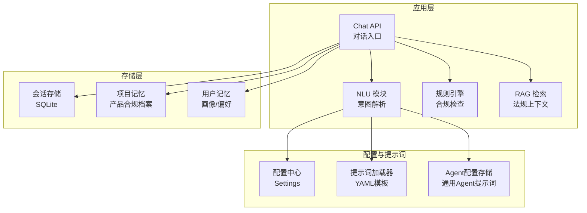
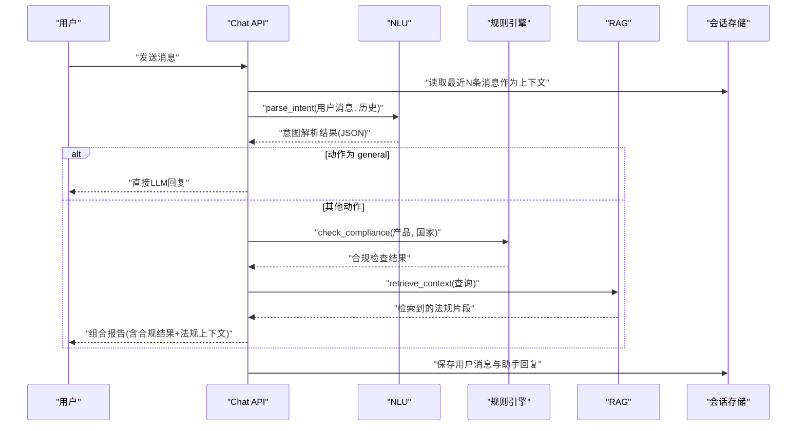
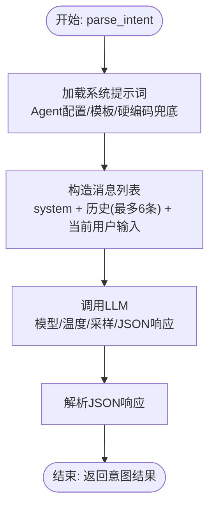
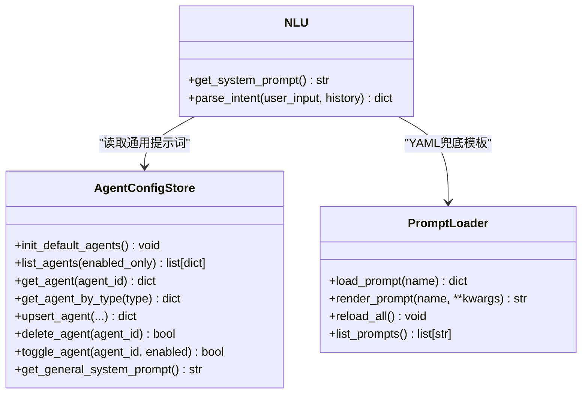
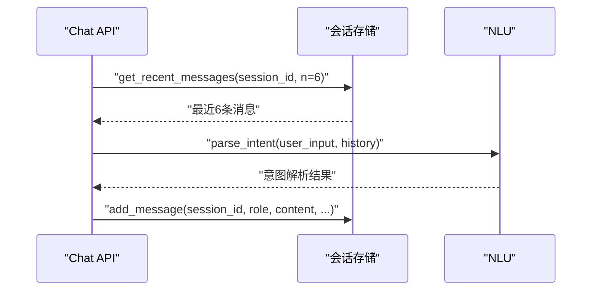
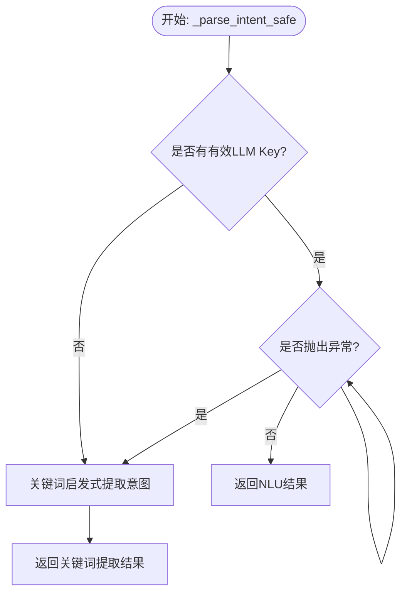
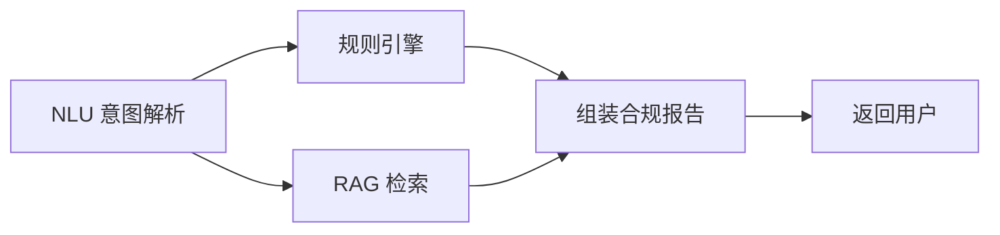
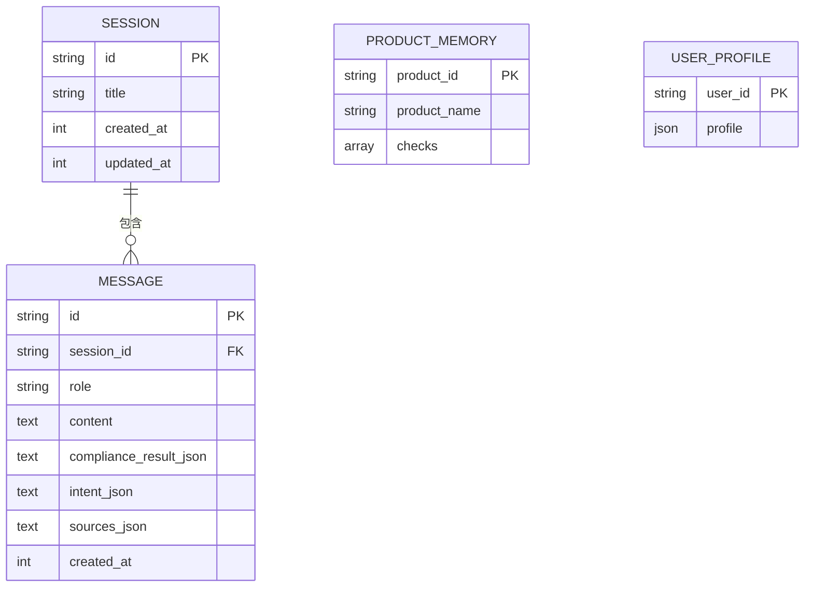
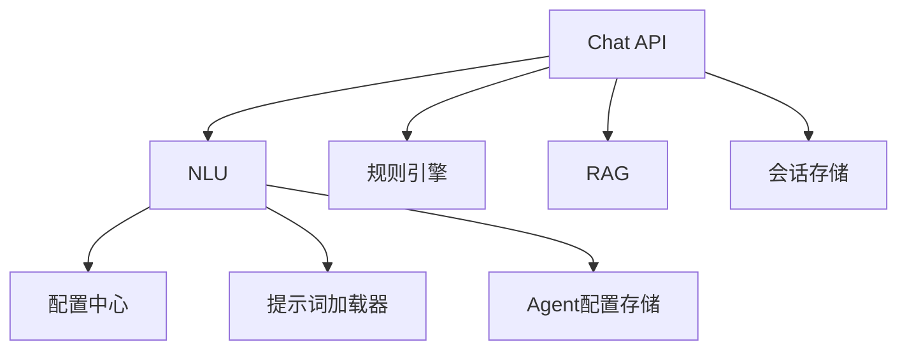

# NLU自然语言处理

<cite>
**本文档引用的文件**
- [nlu.py](file://backend/app/core/nlu.py)
- [nlu_fallback.yaml](file://backend/data/prompts/nlu_fallback.yaml)
- [prompt_loader.py](file://backend/app/services/prompt_loader.py)
- [agent_config_store.py](file://backend/app/storage/agent_config_store.py)
- [config.py](file://backend/app/config.py)
- [chat.py](file://backend/app/api/chat.py)
- [session_store.py](file://backend/app/storage/session_store.py)
- [project_memory.py](file://backend/app/storage/project_memory.py)
- [user_memory.py](file://backend/app/storage/user_memory.py)
- [rule_engine.py](file://backend/app/core/rule_engine.py)
- [rag.py](file://backend/app/core/rag.py)
- [schemas.py](file://backend/app/models/schemas.py)
- [_all.json](file://backend/data/nl_store/products/_all.json)
</cite>

## 目录
1. [简介](#简介)
2. [项目结构](#项目结构)
3. [核心组件](#核心组件)
4. [架构总览](#架构总览)
5. [详细组件分析](#详细组件分析)
6. [依赖分析](#依赖分析)
7. [性能考虑](#性能考虑)
8. [故障排查指南](#故障排查指南)
9. [结论](#结论)
10. [附录](#附录)

## 简介
本文件系统性阐述NLU（自然语言理解）模块的设计与实现，聚焦以下关键能力：
- 意图识别与实体抽取：通过LLM进行结构化解析，输出产品、目标国家、动作类型与置信度。
- 自定义解析规则：支持Agent系统提示词与YAML模板热加载，便于快速迭代意图解析策略。
- 用户输入预处理：构造多轮上下文消息列表，截断助手消息，避免超长内容污染上下文。
- 多轮对话状态管理：会话持久化、最近N条消息回放、会话标题与时间戳维护。
- 降级与鲁棒性：无LLM Key时采用关键词启发式规则，保证基础意图识别可用。
- 性能调优与问题解决：温度、采样参数、思考模式开关、上下文长度控制等。

## 项目结构
NLU相关代码与资源分布于以下模块：
- 核心NLU：app/core/nlu.py
- 提示词模板：data/prompts/nlu_fallback.yaml
- 提示词加载器：app/services/prompt_loader.py
- Agent配置存储：app/storage/agent_config_store.py
- 配置中心：app/config.py
- 对话入口与降级逻辑：app/api/chat.py
- 会话存储：app/storage/session_store.py
- 项目记忆（产品合规档案）：app/storage/project_memory.py
- 用户记忆：app/storage/user_memory.py
- 规则引擎：app/core/rule_engine.py
- RAG检索：app/core/rag.py
- 数据模型：app/models/schemas.py
- 示例自然语言存储：data/nl_store/products/_all.json

**图表来源**
- [chat.py:1-541](file://backend/app/api/chat.py#L1-L541)
- [nlu.py:1-99](file://backend/app/core/nlu.py#L1-L99)
- [prompt_loader.py:1-79](file://backend/app/services/prompt_loader.py#L1-L79)
- [agent_config_store.py:1-310](file://backend/app/storage/agent_config_store.py#L1-L310)
- [config.py:1-183](file://backend/app/config.py#L1-L183)
- [session_store.py:1-251](file://backend/app/storage/session_store.py#L1-L251)
- [project_memory.py:1-141](file://backend/app/storage/project_memory.py#L1-L141)
- [user_memory.py:1-84](file://backend/app/storage/user_memory.py#L1-L84)

**章节来源**
- [nlu.py:1-99](file://backend/app/core/nlu.py#L1-L99)
- [chat.py:1-541](file://backend/app/api/chat.py#L1-L541)
- [config.py:1-183](file://backend/app/config.py#L1-L183)

## 核心组件
- NLU意图解析器：负责将用户输入转为结构化JSON，包含产品、目标国家、动作类型与置信度。
- 提示词系统：优先从Agent配置读取通用提示词，其次从YAML模板热加载兜底提示词。
- 会话管理：提供会话创建、消息追加、最近消息读取、会话列表与删除等能力。
- 降级路径：当无有效LLM Key时，使用关键词启发式规则提取意图。
- 规则引擎与RAG：在NLU之后，规则引擎提供确定性合规检查，RAG补充法规上下文。

**章节来源**
- [nlu.py:59-99](file://backend/app/core/nlu.py#L59-L99)
- [chat.py:93-101](file://backend/app/api/chat.py#L93-L101)
- [session_store.py:74-184](file://backend/app/storage/session_store.py#L74-L184)
- [agent_config_store.py:297-310](file://backend/app/storage/agent_config_store.py#L297-L310)
- [prompt_loader.py:23-71](file://backend/app/services/prompt_loader.py#L23-L71)

## 架构总览
NLU在整体合规对话管线中承担“意图解析”职责，其上游为对话入口，下游为规则引擎与RAG检索。系统同时提供Agent配置与YAML模板两种定制方式，支持热加载与降级策略。

**图表来源**
- [chat.py:228-541](file://backend/app/api/chat.py#L228-L541)
- [nlu.py:59-99](file://backend/app/core/nlu.py#L59-L99)
- [rule_engine.py:197-247](file://backend/app/core/rule_engine.py#L197-L247)
- [rag.py:10-59](file://backend/app/core/rag.py#L10-L59)
- [session_store.py:170-217](file://backend/app/storage/session_store.py#L170-L217)

## 详细组件分析

### NLU意图解析器
- 输入：用户原始中文文本与最近N条会话消息（最多6条），助手消息截断至300字符。
- 输出：结构化JSON，包含产品、目标国家、动作类型与置信度。
- 提示词来源：优先Agent通用提示词，其次YAML兜底模板，再次硬编码兜底。
- LLM参数：模型、温度、top_p、响应格式为JSON对象、最大补全token数、思考模式控制。

**图表来源**
- [nlu.py:27-99](file://backend/app/core/nlu.py#L27-L99)
- [agent_config_store.py:297-310](file://backend/app/storage/agent_config_store.py#L297-L310)
- [prompt_loader.py:23-71](file://backend/app/services/prompt_loader.py#L23-L71)

**章节来源**
- [nlu.py:59-99](file://backend/app/core/nlu.py#L59-L99)
- [nlu_fallback.yaml:1-20](file://backend/data/prompts/nlu_fallback.yaml#L1-L20)
- [config.py:125-143](file://backend/app/config.py#L125-L143)

### 提示词系统与Agent配置
- 提示词加载器：从YAML目录加载模板，支持全局缓存与热加载。
- Agent配置存储：内置通用Agent提示词，支持增删改查与启用/禁用。
- NLU优先从Agent配置读取通用提示词，失败时回退到YAML模板，最终回退到硬编码兜底。

**图表来源**
- [prompt_loader.py:23-71](file://backend/app/services/prompt_loader.py#L23-L71)
- [agent_config_store.py:297-310](file://backend/app/storage/agent_config_store.py#L297-L310)
- [nlu.py:27-50](file://backend/app/core/nlu.py#L27-L50)

**章节来源**
- [prompt_loader.py:1-79](file://backend/app/services/prompt_loader.py#L1-L79)
- [agent_config_store.py:1-310](file://backend/app/storage/agent_config_store.py#L1-L310)
- [nlu.py:27-50](file://backend/app/core/nlu.py#L27-L50)

### 多轮对话状态管理
- 会话持久化：SQLite存储会话与消息，支持索引优化与迁移。
- 最近消息读取：按会话ID读取最近N条消息，逆序还原时间顺序。
- 会话CRUD：创建、列表、详情、删除、标题更新。
- NLU上下文注入：将最近N条消息注入到LLM消息列表，最多6条，助手消息截断。

**图表来源**
- [session_store.py:170-184](file://backend/app/storage/session_store.py#L170-L184)
- [session_store.py:186-217](file://backend/app/storage/session_store.py#L186-L217)
- [nlu.py:74-86](file://backend/app/core/nlu.py#L74-L86)

**章节来源**
- [session_store.py:1-251](file://backend/app/storage/session_store.py#L1-L251)
- [chat.py:415-465](file://backend/app/api/chat.py#L415-L465)

### 降级与关键词启发式
- 无LLM Key时：使用关键词启发式规则提取产品与国家，动作默认为出口检查，置信度较低。
- 有LLM Key但异常：捕获异常后回退到关键词提取，保证服务连续性。
- 关键词集合：包含国家列表与合规相关关键词，用于快速识别意图。

**图表来源**
- [chat.py:93-101](file://backend/app/api/chat.py#L93-L101)
- [chat.py:58-91](file://backend/app/api/chat.py#L58-L91)

**章节来源**
- [chat.py:93-101](file://backend/app/api/chat.py#L93-L101)
- [chat.py:58-91](file://backend/app/api/chat.py#L58-L91)

### 规则引擎与RAG
- 规则引擎：基于产品与国家执行确定性合规检查，返回HS编码、VAT税率、认证要求、风险标志、物流提示、清关文件清单、文化注意事项与整改建议。
- RAG：从知识库检索相关法规片段，格式化为LLM上下文，增强回答的权威性与可溯源性。

**图表来源**
- [rule_engine.py:197-247](file://backend/app/core/rule_engine.py#L197-L247)
- [rag.py:10-59](file://backend/app/core/rag.py#L10-L59)
- [chat.py:467-511](file://backend/app/api/chat.py#L467-L511)

**章节来源**
- [rule_engine.py:1-247](file://backend/app/core/rule_engine.py#L1-L247)
- [rag.py:1-59](file://backend/app/core/rag.py#L1-L59)
- [chat.py:467-511](file://backend/app/api/chat.py#L467-L511)

### 记忆层与数据模型
- 项目记忆（L2）：按产品维度保存合规检查历史，支持查询最新记录与历史列表。
- 用户记忆（L3）：保存用户画像、偏好与最近搜索，辅助意图解析与个性化回复。
- 数据模型：定义了合规查询、合规结果、对话响应、会话消息、操作链等核心数据结构。

**图表来源**
- [session_store.py:37-63](file://backend/app/storage/session_store.py#L37-L63)
- [project_memory.py:20-141](file://backend/app/storage/project_memory.py#L20-L141)
- [user_memory.py:18-84](file://backend/app/storage/user_memory.py#L18-L84)
- [schemas.py:79-104](file://backend/app/models/schemas.py#L79-L104)

**章节来源**
- [project_memory.py:1-141](file://backend/app/storage/project_memory.py#L1-L141)
- [user_memory.py:1-84](file://backend/app/storage/user_memory.py#L1-L84)
- [schemas.py:79-104](file://backend/app/models/schemas.py#L79-L104)

## 依赖分析
- NLU依赖配置中心提供的LLM参数与提示词加载器，提示词来源具备优先级与回退策略。
- 对话API在Codex不可用时自动降级到NLU→规则引擎→RAG路径，并在必要时回退到关键词提取。
- 会话存储为多轮上下文提供数据支撑，消息持久化包含合规结果、意图与来源信息。

**图表来源**
- [nlu.py:16-25](file://backend/app/core/nlu.py#L16-L25)
- [config.py:125-143](file://backend/app/config.py#L125-L143)
- [prompt_loader.py:23-71](file://backend/app/services/prompt_loader.py#L23-L71)
- [agent_config_store.py:297-310](file://backend/app/storage/agent_config_store.py#L297-L310)
- [chat.py:228-541](file://backend/app/api/chat.py#L228-L541)

**章节来源**
- [nlu.py:16-25](file://backend/app/core/nlu.py#L16-L25)
- [chat.py:228-541](file://backend/app/api/chat.py#L228-L541)

## 性能考虑
- 上下文长度控制：NLU最多注入6条历史消息，助手消息截断至300字符，降低Token消耗与延迟。
- LLM参数调优：温度与top_p影响生成多样性与稳定性；JSON响应格式减少后处理开销。
- 思考模式控制：通过配置开关禁用思考模式，减少不必要的推理开销。
- 提示词热加载：YAML模板支持热加载，便于快速迭代而无需重启服务。
- 降级策略：无LLM Key时使用关键词启发式，保障基础可用性与低延迟。

**章节来源**
- [nlu.py:74-96](file://backend/app/core/nlu.py#L74-L96)
- [config.py:125-143](file://backend/app/config.py#L125-L143)
- [prompt_loader.py:49-52](file://backend/app/services/prompt_loader.py#L49-L52)
- [chat.py:93-101](file://backend/app/api/chat.py#L93-L101)

## 故障排查指南
- 无LLM Key：NLU调用失败时自动回退到关键词提取；检查配置中心的活跃API Key与Base URL。
- 提示词加载失败：确认YAML模板路径与文件存在，使用提示词加载器的热加载功能刷新缓存。
- 会话读取异常：检查会话ID有效性与数据库连接；必要时重建会话并重新注入上下文。
- 合规检查异常：规则引擎依赖底层数据源，若无数据则返回空结果；检查数据目录与文件完整性。
- RAG无结果：确认知识库文档数量大于0，检索查询是否合理；查看检索结果计数与来源链接。

**章节来源**
- [chat.py:93-101](file://backend/app/api/chat.py#L93-L101)
- [prompt_loader.py:35-46](file://backend/app/services/prompt_loader.py#L35-L46)
- [session_store.py:134-167](file://backend/app/storage/session_store.py#L134-L167)
- [rule_engine.py:19-26](file://backend/app/core/rule_engine.py#L19-L26)
- [rag.py:16-18](file://backend/app/core/rag.py#L16-L18)

## 结论
该NLU系统通过“LLM意图解析 + 规则引擎 + RAG检索”的组合，实现了高效、可定制、可降级的自然语言理解能力。其核心优势在于：
- 可配置的提示词体系与Agent管理，便于业务侧快速迭代意图解析策略。
- 多轮上下文注入与会话持久化，保障对话连贯性与可追溯性。
- 降级与关键词启发式机制，确保在无LLM Key或异常情况下仍可提供基础服务。
- 明确的性能与错误处理策略，兼顾准确性与稳定性。

## 附录
- 示例自然语言存储：包含产品维度的合规要点与标签，可用于检索与增强。
- 数据模型：统一的请求与响应结构，便于前后端对接与扩展。

**章节来源**
- [_all.json:1-18](file://backend/data/nl_store/products/_all.json#L1-L18)
- [schemas.py:79-104](file://backend/app/models/schemas.py#L79-L104)