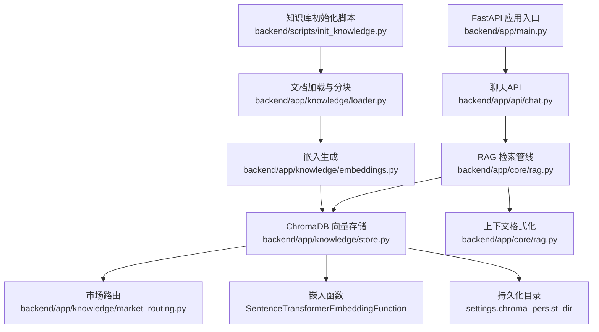
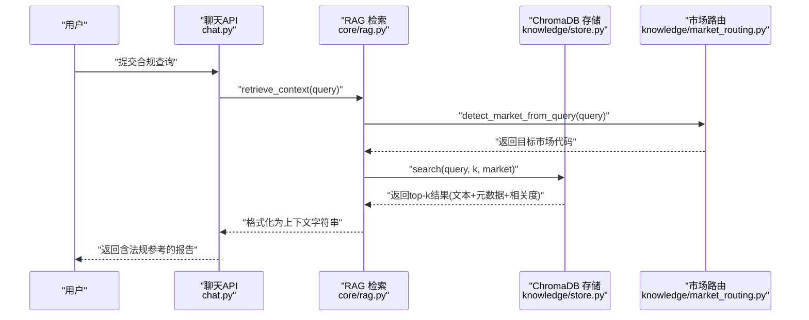
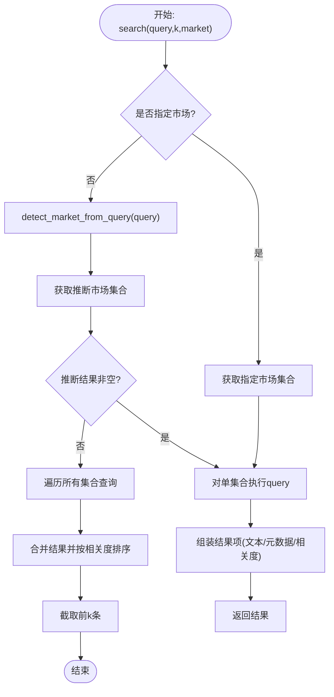
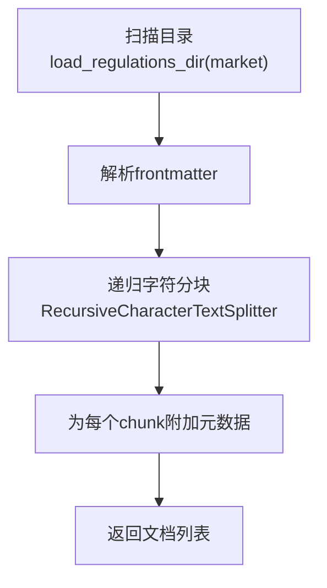
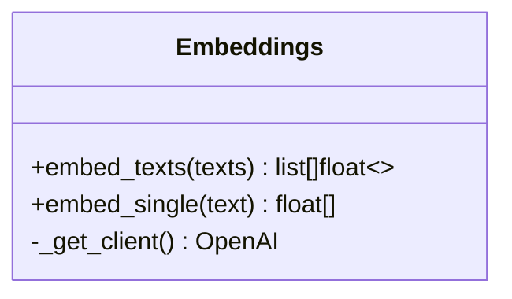
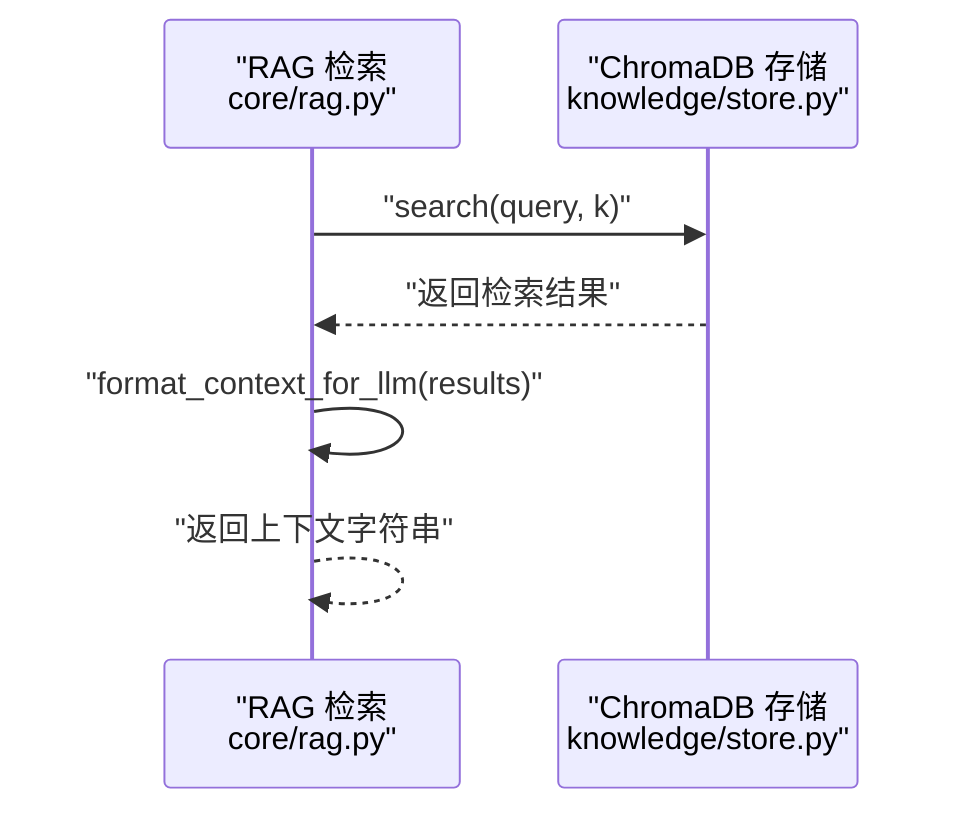
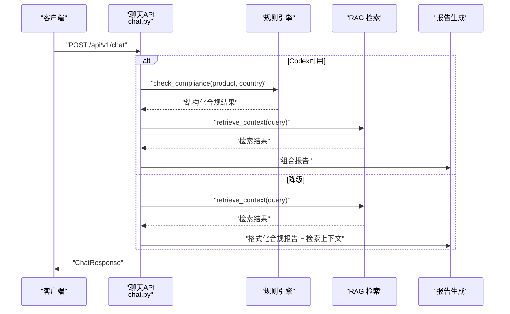
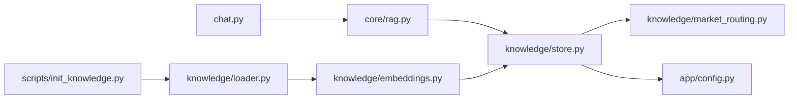

# RAG检索系统

<cite>
**本文引用的文件**
- [backend/app/core/rag.py](file://backend/app/core/rag.py)
- [backend/app/knowledge/store.py](file://backend/app/knowledge/store.py)
- [backend/app/knowledge/embeddings.py](file://backend/app/knowledge/embeddings.py)
- [backend/app/knowledge/loader.py](file://backend/app/knowledge/loader.py)
- [backend/app/knowledge/market_routing.py](file://backend/app/knowledge/market_routing.py)
- [backend/app/api/chat.py](file://backend/app/api/chat.py)
- [backend/app/main.py](file://backend/app/main.py)
- [backend/app/config.py](file://backend/app/config.py)
- [backend/scripts/init_knowledge.py](file://backend/scripts/init_knowledge.py)
- [README.md](file://README.md)
</cite>

## 目录
1. [简介](#简介)
2. [项目结构](#项目结构)
3. [核心组件](#核心组件)
4. [架构总览](#架构总览)
5. [详细组件分析](#详细组件分析)
6. [依赖分析](#依赖分析)
7. [性能考虑](#性能考虑)
8. [故障排除指南](#故障排除指南)
9. [结论](#结论)
10. [附录](#附录)

## 简介
本文件面向RAG（检索增强生成）系统，聚焦向量数据库操作机制与检索增强流程，涵盖以下主题：
- 向量数据库操作：嵌入向量生成、相似度检索、上下文构建
- ChromaDB向量存储：配置、文档加载、索引创建、查询优化
- 检索算法：语义相似度计算、相关性排序、上下文窗口管理
- 性能优化：内存管理、查询缓存、批量处理
- 故障排除：常见问题定位与修复建议

该系统采用“规则引擎 + RAG”的双通道架构：当Codex主链路可用时优先使用；不可用时自动降级为NLU → 规则引擎 → RAG的稳健路径。

**章节来源**
- [README.md: 1-316:1-316](file://README.md#L1-L316)

## 项目结构
后端采用FastAPI应用入口，RAG相关逻辑集中在core与knowledge两个子模块：
- core/rag.py：RAG检索与上下文格式化
- knowledge/：向量化与ChromaDB存储
  - embeddings.py：OpenRouter兼容的嵌入生成
  - loader.py：Markdown法规文档分块与元数据提取
  - store.py：ChromaDB多collection（按市场隔离）的写入、查询与统计
  - market_routing.py：市场到collection名称映射与查询路由
- scripts/init_knowledge.py：知识库初始化脚本（分块 → 向量化 → 写入ChromaDB）

**图表来源**
- [backend/app/main.py: 1-76:1-76](file://backend/app/main.py#L1-L76)
- [backend/app/api/chat.py: 1-540:1-540](file://backend/app/api/chat.py#L1-L540)
- [backend/app/core/rag.py: 1-59:1-59](file://backend/app/core/rag.py#L1-L59)
- [backend/app/knowledge/store.py: 1-227:1-227](file://backend/app/knowledge/store.py#L1-L227)
- [backend/app/knowledge/market_routing.py: 1-77:1-77](file://backend/app/knowledge/market_routing.py#L1-L77)
- [backend/app/knowledge/embeddings.py: 1-35:1-35](file://backend/app/knowledge/embeddings.py#L1-L35)
- [backend/app/knowledge/loader.py: 1-142:1-142](file://backend/app/knowledge/loader.py#L1-L142)
- [backend/scripts/init_knowledge.py: 1-129:1-129](file://backend/scripts/init_knowledge.py#L1-L129)

**章节来源**
- [backend/app/main.py: 1-76:1-76](file://backend/app/main.py#L1-L76)
- [README.md: 92-200:92-200](file://README.md#L92-L200)

## 核心组件
- RAG检索与上下文格式化
  - 检索：从向量存储按查询语义检索相关法规片段
  - 上下文格式化：将检索结果组织为LLM可读的引用式上下文
- ChromaDB向量存储
  - 多collection（eu/de/us/jp/kr）按市场隔离，提升检索精度与性能
  - 使用SentenceTransformer本地模型进行嵌入，避免网络依赖
- 文档加载与分块
  - 从Markdown文件读取，解析frontmatter元数据，递归字符分块
- 嵌入生成
  - 通过OpenRouter兼容接口调用嵌入模型，支持批量嵌入
- 市场路由
  - 根据查询关键词自动选择目标collection，必要时全库聚合

**章节来源**
- [backend/app/core/rag.py: 1-59:1-59](file://backend/app/core/rag.py#L1-L59)
- [backend/app/knowledge/store.py: 1-227:1-227](file://backend/app/knowledge/store.py#L1-L227)
- [backend/app/knowledge/loader.py: 1-142:1-142](file://backend/app/knowledge/loader.py#L1-L142)
- [backend/app/knowledge/embeddings.py: 1-35:1-35](file://backend/app/knowledge/embeddings.py#L1-L35)
- [backend/app/knowledge/market_routing.py: 1-77:1-77](file://backend/app/knowledge/market_routing.py#L1-L77)

## 架构总览
RAG在聊天API中作为“规则引擎 → RAG → 报告生成”的补充环节，既可与Codex主链路并行，也可在降级路径中独立工作。检索流程的关键在于：
- 查询路由：根据查询内容推断目标市场，优先在该collection检索
- 语义相似度：ChromaDB基于余弦距离计算相似度，转换为相关度分数
- 上下文构建：将检索到的片段与元数据拼接为引用式提示

**图表来源**
- [backend/app/api/chat.py: 204-375:204-375](file://backend/app/api/chat.py#L204-L375)
- [backend/app/core/rag.py: 10-58:10-58](file://backend/app/core/rag.py#L10-L58)
- [backend/app/knowledge/store.py: 127-192:127-192](file://backend/app/knowledge/store.py#L127-L192)
- [backend/app/knowledge/market_routing.py: 48-76:48-76](file://backend/app/knowledge/market_routing.py#L48-L76)

## 详细组件分析

### 向量数据库与检索组件
- ChromaDB客户端与集合管理
  - 懒加载客户端与嵌入函数，首次使用时才下载本地模型
  - 按市场创建collection，设置余弦相似度空间
- 文档写入
  - upsert_documents：以法规ID+块索引构造唯一ID，幂等写入
  - 自动嵌入：由ChromaDB的SentenceTransformerEmbeddingFunction生成
- 查询与降级
  - 先按推断市场检索；若无结果，则遍历所有collection聚合
  - 异常降级：ChromaDB异常时不中断主流程，返回空结果
- 文档计数与清理
  - get_document_count：支持按市场或全库统计
  - clear_collection：支持按市场或全库清空

**图表来源**
- [backend/app/knowledge/store.py: 127-192:127-192](file://backend/app/knowledge/store.py#L127-L192)
- [backend/app/knowledge/market_routing.py: 48-76:48-76](file://backend/app/knowledge/market_routing.py#L48-L76)

**章节来源**
- [backend/app/knowledge/store.py: 43-227:43-227](file://backend/app/knowledge/store.py#L43-L227)
- [backend/app/knowledge/market_routing.py: 17-77:17-77](file://backend/app/knowledge/market_routing.py#L17-L77)

### 文档加载与分块
- Markdown加载：扫描data/regulations/{market}/*.md
- Frontmatter解析：提取regulation_id/name/source_url/tags/effective_date等
- 分块策略：递归字符分块，保留标题层级与段落分隔，Overlap降低跨块断裂
- 元数据注入：每个chunk附带完整元数据，便于检索后溯源

**图表来源**
- [backend/app/knowledge/loader.py: 57-118:57-118](file://backend/app/knowledge/loader.py#L57-L118)

**章节来源**
- [backend/app/knowledge/loader.py: 1-142:1-142](file://backend/app/knowledge/loader.py#L1-L142)

### 嵌入生成与批量处理
- OpenRouter兼容客户端：统一基地址与API Key，支持多模型
- 批量嵌入：embed_texts支持一次传入多个文本，返回向量列表
- 单条嵌入：embed_single封装批量接口，简化调用

**图表来源**
- [backend/app/knowledge/embeddings.py: 9-35:9-35](file://backend/app/knowledge/embeddings.py#L9-L35)

**章节来源**
- [backend/app/knowledge/embeddings.py: 1-35:1-35](file://backend/app/knowledge/embeddings.py#L1-L35)

### RAG检索与上下文格式化
- 检索：retrieve_context → search，返回包含文本、相关度、元数据的列表
- 上下文格式化：format_context_for_llm将检索结果转为引用式提示，包含来源、生效日期等
- 全流程：enrich_with_rag串联检索与格式化

**图表来源**
- [backend/app/core/rag.py: 10-58:10-58](file://backend/app/core/rag.py#L10-L58)
- [backend/app/knowledge/store.py: 127-192:127-192](file://backend/app/knowledge/store.py#L127-L192)

**章节来源**
- [backend/app/core/rag.py: 1-59:1-59](file://backend/app/core/rag.py#L1-L59)

### 聊天API中的RAG集成
- Codex主链路：并行执行规则引擎，随后RAG检索法规知识库，拼接报告
- 降级链路：NLU解析意图 → 规则引擎 → RAG检索 → 报告生成
- 会话与记忆：持久化用户消息、合规结果、当前产品/市场上下文

**图表来源**
- [backend/app/api/chat.py: 227-539:227-539](file://backend/app/api/chat.py#L227-L539)

**章节来源**
- [backend/app/api/chat.py: 1-540:1-540](file://backend/app/api/chat.py#L1-L540)

## 依赖分析
- 组件耦合
  - chat.py依赖core/rag.py与knowledge/store.py，形成“意图解析 → 规则引擎 → RAG → 报告”的闭环
  - store.py依赖market_routing.py进行collection路由，依赖config.py读取持久化路径
  - loader.py与embeddings.py在初始化脚本中协作，完成“分块 → 嵌入 → 写入”
- 外部依赖
  - ChromaDB：持久化客户端、集合管理、查询接口
  - SentenceTransformer：本地嵌入函数，避免网络下载
  - OpenRouter兼容嵌入模型：text-embedding-3-small

**图表来源**
- [backend/app/api/chat.py: 14-25:14-25](file://backend/app/api/chat.py#L14-L25)
- [backend/app/core/rag.py: 7](file://backend/app/core/rag.py#L7)
- [backend/app/knowledge/store.py: 18-19:18-19](file://backend/app/knowledge/store.py#L18-L19)
- [backend/app/knowledge/market_routing.py: 19-25:19-25](file://backend/app/knowledge/market_routing.py#L19-L25)
- [backend/scripts/init_knowledge.py: 23-25:23-25](file://backend/scripts/init_knowledge.py#L23-L25)
- [backend/app/knowledge/loader.py: 17](file://backend/app/knowledge/loader.py#L17)
- [backend/app/knowledge/embeddings.py: 3-4:3-4](file://backend/app/knowledge/embeddings.py#L3-L4)

**章节来源**
- [backend/app/api/chat.py: 14-25:14-25](file://backend/app/api/chat.py#L14-L25)
- [backend/app/core/rag.py: 7](file://backend/app/core/rag.py#L7)
- [backend/app/knowledge/store.py: 18-19:18-19](file://backend/app/knowledge/store.py#L18-L19)
- [backend/app/knowledge/market_routing.py: 19-25:19-25](file://backend/app/knowledge/market_routing.py#L19-L25)
- [backend/scripts/init_knowledge.py: 23-25:23-25](file://backend/scripts/init_knowledge.py#L23-L25)
- [backend/app/knowledge/loader.py: 17](file://backend/app/knowledge/loader.py#L17)
- [backend/app/knowledge/embeddings.py: 3-4:3-4](file://backend/app/knowledge/embeddings.py#L3-L4)

## 性能考虑
- 向量检索性能
  - 余弦相似度空间：适合高维稀疏向量的语义检索
  - k裁剪：按集合文档数量动态调整返回上限，避免超大结果集
  - 懒加载：客户端与嵌入函数延迟初始化，减少启动开销
- 内存与磁盘
  - 本地SentenceTransformer模型：首次运行下载，后续复用，避免网络依赖
  - 持久化目录：通过配置项设置，确保容器化部署时数据卷挂载
- 批量处理
  - 嵌入批量接口：减少API往返次数，提高吞吐
  - 初始化脚本：逐文档批量upsert，避免频繁I/O
- 查询优化
  - 市场路由：优先在目标市场集合检索，显著降低无关搜索
  - 降级策略：无结果时全库聚合，兼顾召回与性能
- 上下文窗口管理
  - 上下文格式化时仅输出必要字段，避免冗余信息影响LLM输入长度

[本节为通用性能指导，不直接分析特定文件，故无“章节来源”]

## 故障排除指南
- ChromaDB不可用或查询异常
  - 现象：检索返回空结果，不影响主流程
  - 排查：确认持久化目录可写、集合存在且非空
  - 参考：查询异常被捕获并记录警告，返回空结果
- 嵌入模型下载失败
  - 现象：首次启动卡顿或报错
  - 排查：确保local_files_only=True，模型本地可用
- 文档未分块或元数据缺失
  - 现象：检索命中但无来源信息
  - 排查：确认frontmatter格式正确，分块后为非空
- 市场路由误判
  - 现象：检索不到目标法规
  - 排查：检查查询关键词是否包含目标市场的特征词
- 初始化脚本未写入
  - 现象：get_document_count为0
  - 排查：确认已执行初始化脚本并传入正确市场参数

**章节来源**
- [backend/app/knowledge/store.py: 163-173:163-173](file://backend/app/knowledge/store.py#L163-L173)
- [backend/app/knowledge/store.py: 195-210:195-210](file://backend/app/knowledge/store.py#L195-L210)
- [backend/app/knowledge/loader.py: 29-52:29-52](file://backend/app/knowledge/loader.py#L29-L52)
- [backend/app/knowledge/market_routing.py: 48-76:48-76](file://backend/app/knowledge/market_routing.py#L48-L76)
- [backend/scripts/init_knowledge.py: 28-67:28-67](file://backend/scripts/init_knowledge.py#L28-L67)

## 结论
本RAG系统通过“规则引擎 + RAG”的双通道设计，在保证确定性合规检查的同时，利用ChromaDB实现多市场隔离的语义检索。其关键优势包括：
- 明确的检索流程：查询路由 → 语义相似度 → 上下文构建
- 可靠的降级策略：ChromaDB异常不阻断主流程
- 可扩展的市场隔离：按市场分collection，便于增量维护
- 友好的初始化与运维：脚本化分块、嵌入与写入，支持重置与预览

建议在生产环境中结合业务场景进一步优化：
- 增加检索结果缓存与去重
- 针对不同市场训练或微调嵌入模型
- 引入检索质量评估与反馈机制

[本节为总结性内容，不直接分析特定文件，故无“章节来源”]

## 附录

### ChromaDB配置与使用要点
- 持久化路径：通过配置项设置，确保容器化部署时数据卷挂载
- 集合命名：按市场映射到eu/de/us/jp/kr集合
- 嵌入函数：SentenceTransformer本地模型，首次使用时懒加载
- 查询行为：按余弦距离计算相似度，转换为相关度分数

**章节来源**
- [backend/app/config.py: 147-151:147-151](file://backend/app/config.py#L147-L151)
- [backend/app/knowledge/market_routing.py: 19-45:19-45](file://backend/app/knowledge/market_routing.py#L19-L45)
- [backend/app/knowledge/store.py: 31-40:31-40](file://backend/app/knowledge/store.py#L31-L40)
- [backend/app/knowledge/store.py: 166-170:166-170](file://backend/app/knowledge/store.py#L166-L170)

### 初始化知识库流程
- 加载：扫描Markdown文件，解析frontmatter，递归分块
- 嵌入：调用嵌入接口生成向量
- 写入：以法规ID+块索引为ID，upsert到对应市场集合
- 验证：统计文档总数，确认写入成功

**章节来源**
- [backend/scripts/init_knowledge.py: 28-67:28-67](file://backend/scripts/init_knowledge.py#L28-L67)
- [backend/app/knowledge/loader.py: 57-118:57-118](file://backend/app/knowledge/loader.py#L57-L118)
- [backend/app/knowledge/embeddings.py: 19-35:19-35](file://backend/app/knowledge/embeddings.py#L19-L35)
- [backend/app/knowledge/store.py: 81-104:81-104](file://backend/app/knowledge/store.py#L81-L104)