# 指标监控系统

<cite>
**本文档引用的文件**   
- [backend/app/core/metrics.py](file://backend/app/core/metrics.py)
- [backend/app/core/scheduler.py](file://backend/app/core/scheduler.py)
- [backend/app/core/risk_alert.py](file://backend/app/core/risk_alert.py)
- [backend/app/api/risk.py](file://backend/app/api/risk.py)
- [backend/app/storage/event_store.py](file://backend/app/storage/event_store.py)
- [backend/app/core/market_monitor.py](file://backend/app/core/market_monitor.py)
- [backend/app/services/ws_manager.py](file://backend/app/services/ws_manager.py)
- [backend/app/config.py](file://backend/app/config.py)
- [backend/app/models/schemas.py](file://backend/app/models/schemas.py)
- [backend/app/main.py](file://backend/app/main.py)
- [backend/data/prompts/market_monitor.yaml](file://backend/data/prompts/market_monitor.yaml)
- [backend/data/prompts/impact_analysis.yaml](file://backend/data/prompts/impact_analysis.yaml)
- [backend/app/storage/layer_registry.py](file://backend/app/storage/layer_registry.py)
- [backend/app/storage/project_memory.py](file://backend/app/storage/project_memory.py)
- [backend/app/storage/user_memory.py](file://backend/app/storage/user_memory.py)
- [frontend/src/components/RiskDashboard.tsx](file://frontend/src/components/RiskDashboard.tsx)
</cite>

## 目录
1. [简介](#简介)
2. [项目结构](#项目结构)
3. [核心组件](#核心组件)
4. [架构总览](#架构总览)
5. [详细组件分析](#详细组件分析)
6. [依赖分析](#依赖分析)
7. [性能考虑](#性能考虑)
8. [故障排查指南](#故障排查指南)
9. [结论](#结论)
10. [附录](#附录)

## 简介
本文件面向“指标监控系统”的设计与实现，围绕以下目标展开：
- 指标定义与计算：系统性能指标、业务指标、用户体验指标
- 数据采集机制：定时任务调度、指标聚合、存储策略
- 监控告警系统：配置与使用、阈值设置、通知机制、故障自动恢复
- 性能优化与排障：瓶颈识别、资源利用率分析、容量规划

系统采用“只读聚合、不创建新存储”的策略，通过调度器驱动市场监控与指标聚合，利用事件链与多层存储实现可观测性与审计能力。

## 项目结构
后端采用分层架构与模块化路由：
- 核心模块：指标聚合、调度器、风险预警、市场监控、事件链、WebSocket 管理
- API 路由：风险/指标/提示词管理等接口
- 存储层：原始数据、知识库、项目/产品记忆、用户记忆、会话记忆、事件链
- 前端组件：风险仪表盘与预警面板

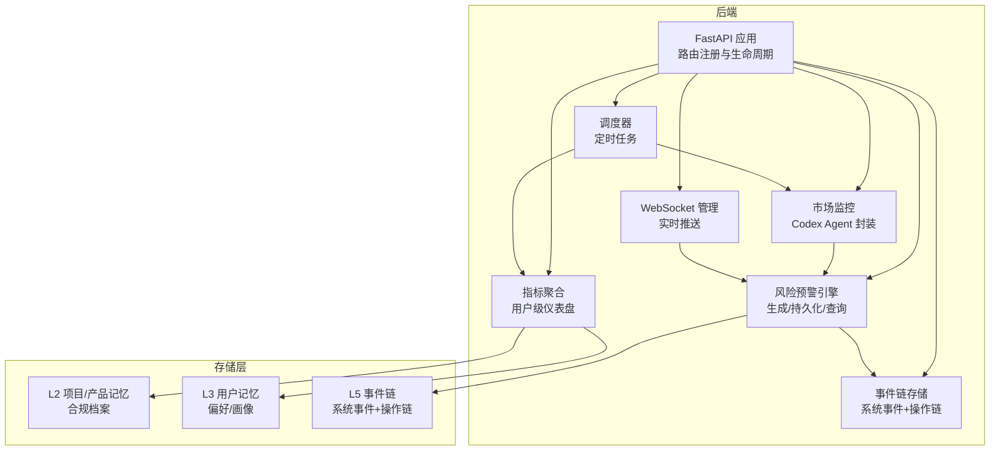

图表来源
- [backend/app/main.py:1-78](file://backend/app/main.py#L1-L78)
- [backend/app/core/scheduler.py:1-152](file://backend/app/core/scheduler.py#L1-L152)
- [backend/app/core/market_monitor.py:1-156](file://backend/app/core/market_monitor.py#L1-L156)
- [backend/app/core/risk_alert.py:1-181](file://backend/app/core/risk_alert.py#L1-L181)
- [backend/app/core/metrics.py:1-176](file://backend/app/core/metrics.py#L1-L176)
- [backend/app/storage/event_store.py:1-269](file://backend/app/storage/event_store.py#L1-L269)
- [backend/app/services/ws_manager.py:1-95](file://backend/app/services/ws_manager.py#L1-L95)

章节来源
- [backend/app/main.py:1-78](file://backend/app/main.py#L1-L78)
- [backend/app/core/scheduler.py:1-152](file://backend/app/core/scheduler.py#L1-L152)

## 核心组件
- 指标聚合模块：负责用户级仪表盘数据聚合，读取 L2/L3/L5 数据，计算风险分布、健康分、趋势等
- 调度器：基于 APScheduler 的异步调度器，定时执行市场轮询与指标聚合
- 风险预警引擎：生成、持久化、查询预警，并支持忽略与未读统计
- 市场监控：委托 Codex Agent 执行联网搜索与影响分析
- 事件链存储：统一记录系统事件与用户操作链，支撑审计与回溯
- WebSocket 管理：实时推送预警与扫描状态更新
- API 路由：提供风险/指标/提示词管理等 REST 接口
- 存储层：分层存储（L2/L3/L5）与注册表，统一访问入口

章节来源
- [backend/app/core/metrics.py:1-176](file://backend/app/core/metrics.py#L1-L176)
- [backend/app/core/scheduler.py:1-152](file://backend/app/core/scheduler.py#L1-L152)
- [backend/app/core/risk_alert.py:1-181](file://backend/app/core/risk_alert.py#L1-L181)
- [backend/app/core/market_monitor.py:1-156](file://backend/app/core/market_monitor.py#L1-L156)
- [backend/app/storage/event_store.py:1-269](file://backend/app/storage/event_store.py#L1-L269)
- [backend/app/services/ws_manager.py:1-95](file://backend/app/services/ws_manager.py#L1-L95)
- [backend/app/api/risk.py:1-154](file://backend/app/api/risk.py#L1-L154)
- [backend/app/storage/layer_registry.py:1-45](file://backend/app/storage/layer_registry.py#L1-L45)

## 架构总览
系统通过调度器周期性触发市场监控，Codex Agent 执行联网搜索与影响分析，生成风险预警并通过 WebSocket 推送给前端。指标聚合模块按需读取 L2/L3/L5 数据，计算用户级仪表盘指标。

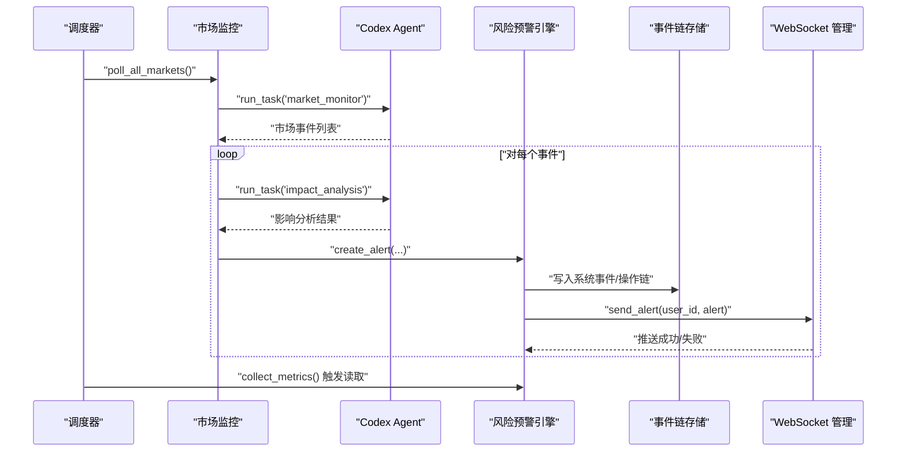

图表来源
- [backend/app/core/scheduler.py:68-151](file://backend/app/core/scheduler.py#L68-L151)
- [backend/app/core/market_monitor.py:35-104](file://backend/app/core/market_monitor.py#L35-L104)
- [backend/app/core/risk_alert.py:32-81](file://backend/app/core/risk_alert.py#L32-L81)
- [backend/app/storage/event_store.py:76-115](file://backend/app/storage/event_store.py#L76-L115)
- [backend/app/services/ws_manager.py:46-63](file://backend/app/services/ws_manager.py#L46-L63)

## 详细组件分析

### 指标聚合模块（用户级仪表盘）
- 数据来源：L2 项目/产品记忆（产品数、合规记录）、L5 风险预警（预警数）、L3 用户记忆（偏好市场）
- 计算指标：
  - 总产品数：遍历 L2 产品目录，统计产品数量
  - 风险分布：统计未忽略预警的严重度分布
  - 最近预警：按时间倒序取未忽略的前 N 条
  - 健康分（0-100）：基础 100，扣分项包括高风险产品、无 HS 编码产品、待处理 high/critical 预警；加分项为近 7 天合规检查次数（上限 20）
  - 趋势：统计近 30 天每日合规检查次数
- 复杂度：聚合过程为 O(N)（N 为产品/预警数量）

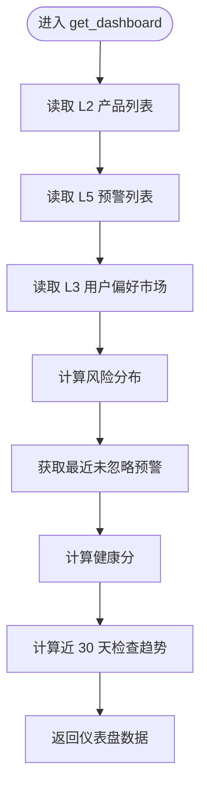

图表来源
- [backend/app/core/metrics.py:20-46](file://backend/app/core/metrics.py#L20-L46)
- [backend/app/core/metrics.py:94-176](file://backend/app/core/metrics.py#L94-L176)

章节来源
- [backend/app/core/metrics.py:1-176](file://backend/app/core/metrics.py#L1-L176)
- [backend/app/storage/project_memory.py:123-141](file://backend/app/storage/project_memory.py#L123-L141)
- [backend/app/storage/user_memory.py:70-84](file://backend/app/storage/user_memory.py#L70-L84)
- [backend/app/core/risk_alert.py:97-135](file://backend/app/core/risk_alert.py#L97-L135)

### 调度器（定时任务）
- 启停：应用启动时初始化调度器，关闭时停止
- 任务：
  - 市场轮询：按配置间隔轮询所有目标市场，生成影响分析与预警，推送 WebSocket
  - 指标聚合：按小时触发，读取用户仪表盘数据（仅触发记录，不写入）
- 配置：开关、轮询间隔分钟数

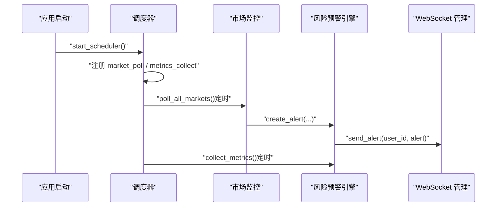

图表来源
- [backend/app/main.py:62-77](file://backend/app/main.py#L62-L77)
- [backend/app/core/scheduler.py:24-54](file://backend/app/core/scheduler.py#L24-L54)
- [backend/app/core/scheduler.py:68-151](file://backend/app/core/scheduler.py#L68-L151)

章节来源
- [backend/app/core/scheduler.py:1-152](file://backend/app/core/scheduler.py#L1-L152)
- [backend/app/config.py:159-162](file://backend/app/config.py#L159-L162)

### 风险预警引擎
- 功能：创建、忽略、查询、未读统计、按产品过滤、保存/读取扫描时间
- 存储：按用户目录写入 alerts.json，使用临时文件覆盖写入保证原子性
- 查询：支持类型/严重度筛选、分页、按时间倒序

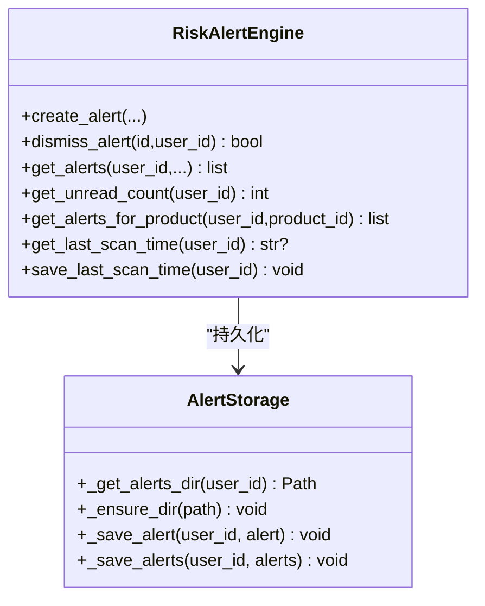

图表来源
- [backend/app/core/risk_alert.py:32-181](file://backend/app/core/risk_alert.py#L32-L181)

章节来源
- [backend/app/core/risk_alert.py:1-181](file://backend/app/core/risk_alert.py#L1-L181)

### 市场监控（Codex Agent 封装）
- 轮询：调用 Codex Agent 的 market_monitor 任务，解析返回的市场事件
- 影响分析：读取 L2 产品列表，调用 impact_analysis 任务，得到受影响产品列表
- 规范化：统一事件字段（event_id、market、has_change、summary、severity、source、source_url、key_points、timestamp）

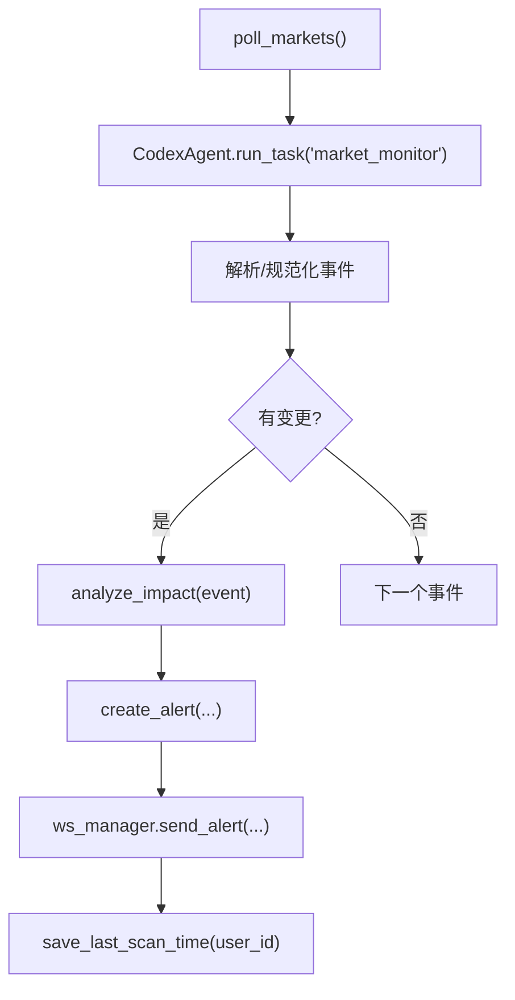

图表来源
- [backend/app/core/market_monitor.py:35-104](file://backend/app/core/market_monitor.py#L35-L104)
- [backend/app/core/risk_alert.py:32-81](file://backend/app/core/risk_alert.py#L32-L81)
- [backend/app/services/ws_manager.py:46-63](file://backend/app/services/ws_manager.py#L46-L63)

章节来源
- [backend/app/core/market_monitor.py:1-156](file://backend/app/core/market_monitor.py#L1-L156)
- [backend/data/prompts/market_monitor.yaml:1-36](file://backend/data/prompts/market_monitor.yaml#L1-L36)
- [backend/data/prompts/impact_analysis.yaml:1-19](file://backend/data/prompts/impact_analysis.yaml#L1-L19)

### 事件链存储（L5）
- 统一记录系统事件与用户操作链，支持按类型/来源/严重度筛选
- 提供系统事件与用户事件两类写入接口，维护链 ID、事件数、更新时间
- 提供迁移适配，兼容旧目录结构

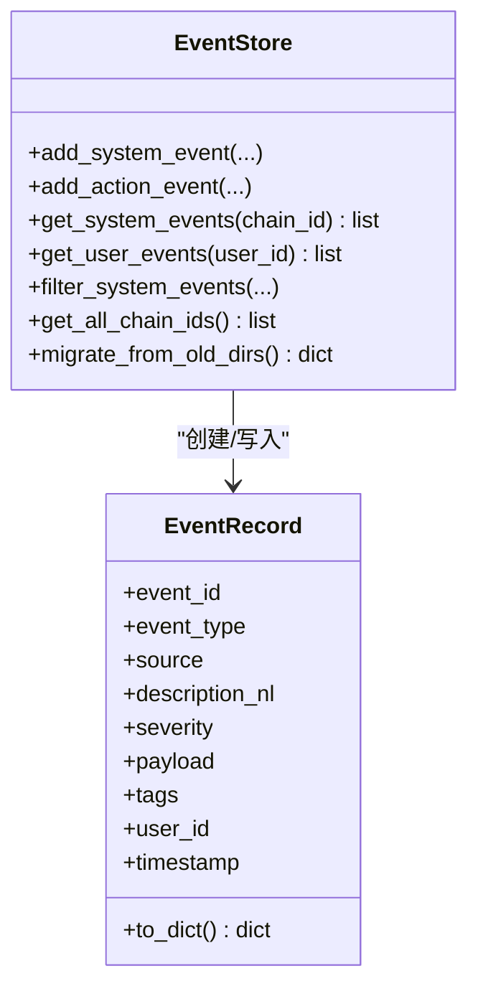

图表来源
- [backend/app/storage/event_store.py:22-221](file://backend/app/storage/event_store.py#L22-L221)

章节来源
- [backend/app/storage/event_store.py:1-269](file://backend/app/storage/event_store.py#L1-L269)

### WebSocket 管理（实时推送）
- 管理 user_id 到 WebSocket 连接集合的映射，支持多标签页连接
- 提供推送预警、扫描状态更新、广播、连接/断开管理

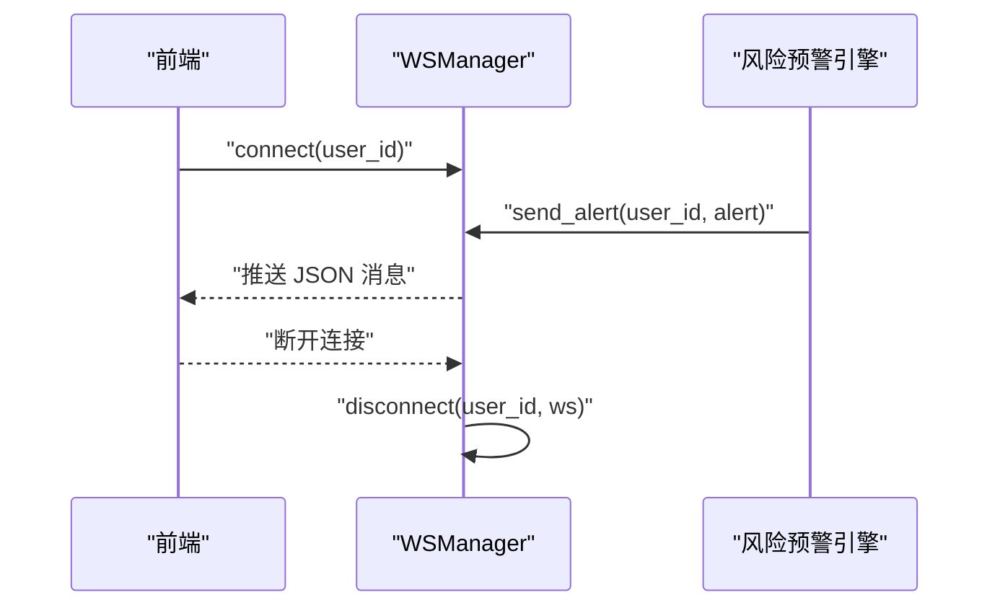

图表来源
- [backend/app/services/ws_manager.py:30-91](file://backend/app/services/ws_manager.py#L30-L91)

章节来源
- [backend/app/services/ws_manager.py:1-95](file://backend/app/services/ws_manager.py#L1-L95)

### API 路由（风险/指标/提示词）
- 风险预警：列表、未读数、忽略、手动触发扫描、市场状态
- 指标仪表盘：用户级仪表盘数据
- 提示词管理：热加载模板

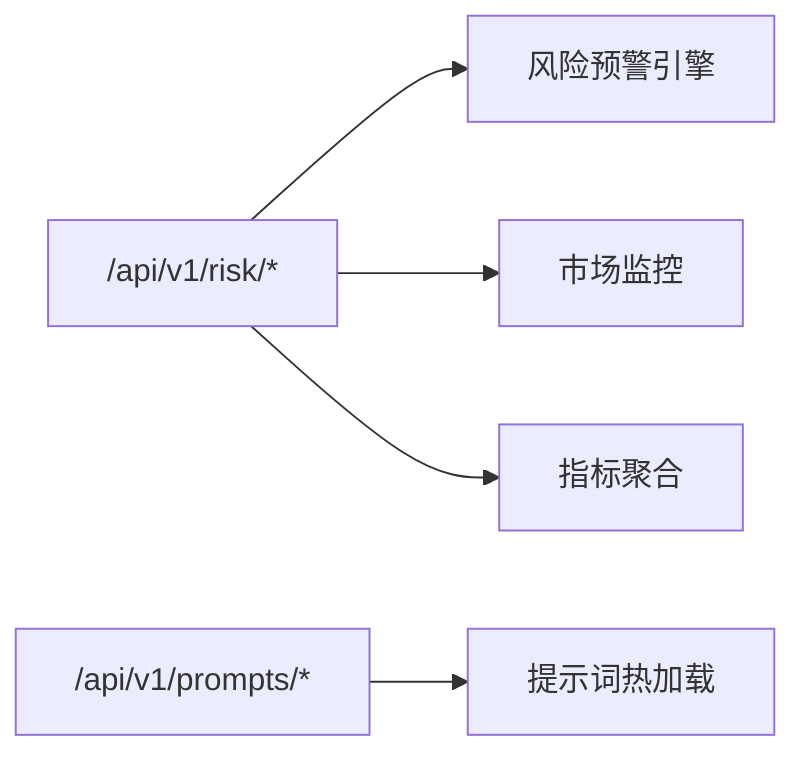

图表来源
- [backend/app/api/risk.py:25-153](file://backend/app/api/risk.py#L25-L153)

章节来源
- [backend/app/api/risk.py:1-154](file://backend/app/api/risk.py#L1-L154)

### 存储层与注册表
- 分层存储注册表：统一暴露 L0-L5 存储层，上层业务通过 registry 访问
- L2 项目/产品记忆：产品合规档案、历史记录、最新检查
- L3 用户记忆：用户画像、偏好市场、最近搜索

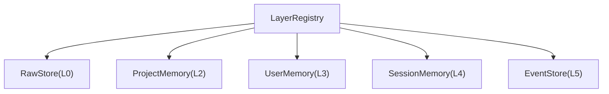

图表来源
- [backend/app/storage/layer_registry.py:23-44](file://backend/app/storage/layer_registry.py#L23-L44)
- [backend/app/storage/project_memory.py:20-141](file://backend/app/storage/project_memory.py#L20-L141)
- [backend/app/storage/user_memory.py:18-84](file://backend/app/storage/user_memory.py#L18-L84)

章节来源
- [backend/app/storage/layer_registry.py:1-45](file://backend/app/storage/layer_registry.py#L1-L45)
- [backend/app/storage/project_memory.py:1-141](file://backend/app/storage/project_memory.py#L1-L141)
- [backend/app/storage/user_memory.py:1-84](file://backend/app/storage/user_memory.py#L1-L84)

### 前端仪表盘
- 通过 REST API 获取用户仪表盘数据，渲染健康分、产品数、活跃市场、风险分布
- 颜色根据健康分区间动态变化

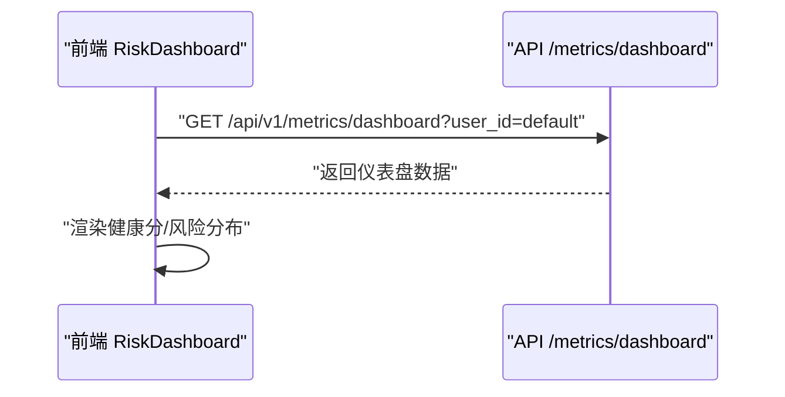

图表来源
- [frontend/src/components/RiskDashboard.tsx:10-22](file://frontend/src/components/RiskDashboard.tsx#L10-L22)

章节来源
- [frontend/src/components/RiskDashboard.tsx:1-98](file://frontend/src/components/RiskDashboard.tsx#L1-L98)

## 依赖分析
- 组件耦合：
  - 调度器依赖市场监控与风险预警引擎，形成“轮询—分析—预警—推送”的闭环
  - 指标聚合模块依赖 L2/L3/L5 存储，但不写入新存储，符合“只读聚合”原则
  - WebSocket 管理器与风险预警引擎解耦，通过消息协议对接
- 外部依赖：
  - APScheduler（异步调度）
  - Codex Agent（联网搜索与推理）
  - FastAPI（REST API 与 WebSocket）

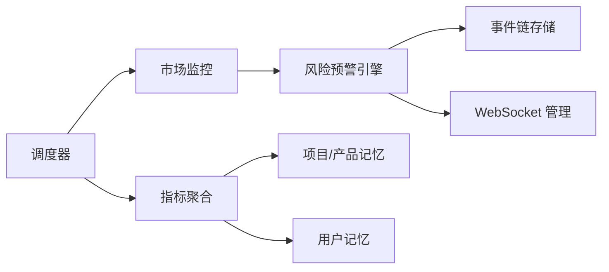

图表来源
- [backend/app/core/scheduler.py:68-151](file://backend/app/core/scheduler.py#L68-L151)
- [backend/app/core/market_monitor.py:35-104](file://backend/app/core/market_monitor.py#L35-L104)
- [backend/app/core/risk_alert.py:32-181](file://backend/app/core/risk_alert.py#L32-L181)
- [backend/app/core/metrics.py:49-176](file://backend/app/core/metrics.py#L49-L176)
- [backend/app/storage/event_store.py:76-221](file://backend/app/storage/event_store.py#L76-L221)
- [backend/app/services/ws_manager.py:46-91](file://backend/app/services/ws_manager.py#L46-L91)

章节来源
- [backend/app/core/scheduler.py:1-152](file://backend/app/core/scheduler.py#L1-L152)
- [backend/app/core/metrics.py:1-176](file://backend/app/core/metrics.py#L1-L176)
- [backend/app/core/risk_alert.py:1-181](file://backend/app/core/risk_alert.py#L1-L181)
- [backend/app/storage/event_store.py:1-269](file://backend/app/storage/event_store.py#L1-L269)

## 性能考虑
- 指标聚合复杂度：O(N)（N 为产品/预警数量），建议：
  - 控制产品规模与聚合频率，避免一次性处理大量数据
  - 对高频读取场景可引入缓存（如内存缓存或 Redis）
- 文件 I/O：风险预警写入采用临时文件覆盖写入，减少锁竞争；建议：
  - 在高并发场景下考虑异步写入队列
  - 合理设置磁盘与文件句柄上限
- WebSocket：推送失败自动清理死连接，建议：
  - 限制单用户连接数，避免资源耗尽
  - 对批量推送使用广播优化
- 调度器：APScheduler 异步运行，建议：
  - 合理设置任务间隔，避免重叠执行
  - 对外部依赖（Codex Agent）增加超时与重试策略

## 故障排查指南
- 健康检查端点：通过 /api/v1/health 快速确认服务可用性
- 调度器问题：检查配置开关与轮询间隔，查看日志中“Scheduler job ... failed”
- 预警无法推送：检查 WebSocket 是否连接、推送消息格式是否正确
- 指标为空：确认 L2/L3/L5 目录是否存在、JSON 文件是否损坏
- 事件链缺失：确认事件链写入路径与权限，必要时执行迁移适配

章节来源
- [backend/app/main.py:35-37](file://backend/app/main.py#L35-L37)
- [backend/app/core/scheduler.py:129-131](file://backend/app/core/scheduler.py#L129-L131)
- [backend/app/services/ws_manager.py:46-63](file://backend/app/services/ws_manager.py#L46-L63)
- [backend/app/core/metrics.py:49-92](file://backend/app/core/metrics.py#L49-L92)
- [backend/app/storage/event_store.py:224-269](file://backend/app/storage/event_store.py#L224-L269)

## 结论
该指标监控系统通过“只读聚合、事件链审计、异步调度与 WebSocket 实时推送”的组合，实现了对跨境合规场景下的系统性能、业务与用户体验指标的可观测性。建议在生产环境中结合缓存、异步写入与容量规划，持续优化性能与稳定性。

## 附录
- 配置项参考：调度器开关、轮询间隔、数据目录、提示词目录等
- 数据模型参考：合规结果、事件链、操作链等 Pydantic 模型

章节来源
- [backend/app/config.py:159-162](file://backend/app/config.py#L159-L162)
- [backend/app/models/schemas.py:79-104](file://backend/app/models/schemas.py#L79-L104)
- [backend/app/models/schemas.py:143-162](file://backend/app/models/schemas.py#L143-L162)