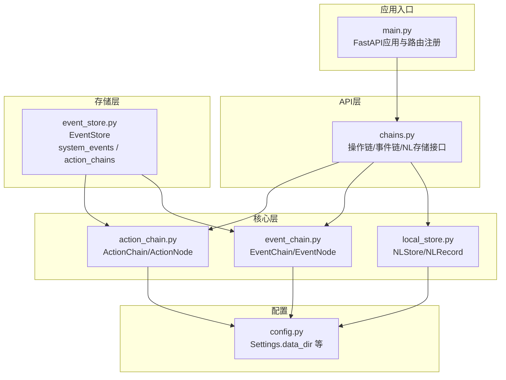
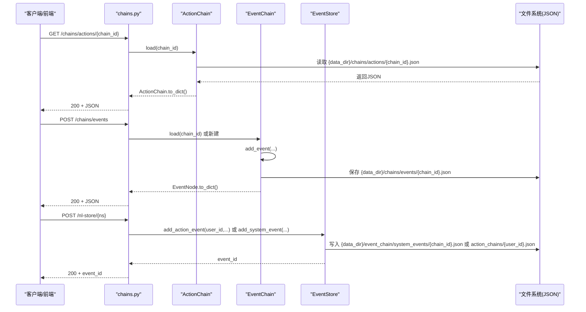
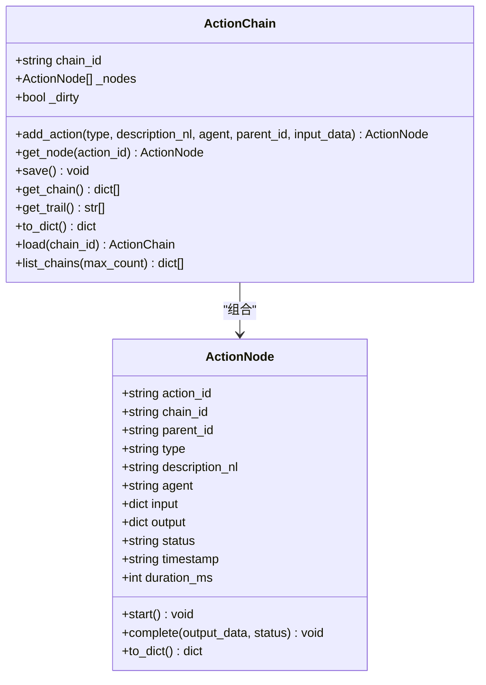
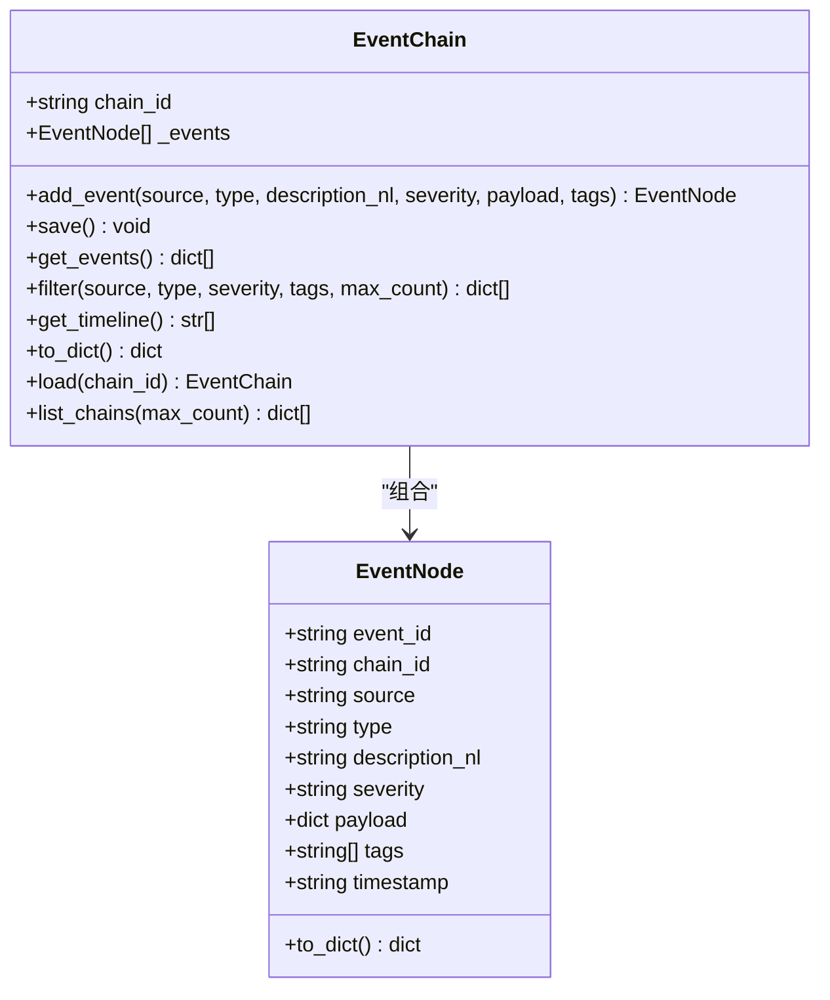
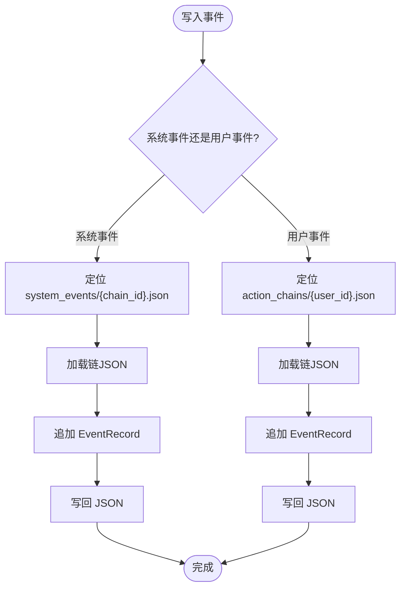
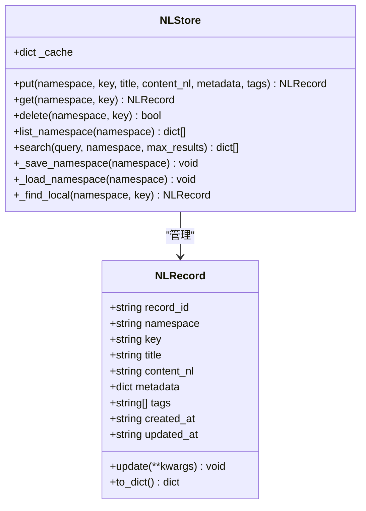
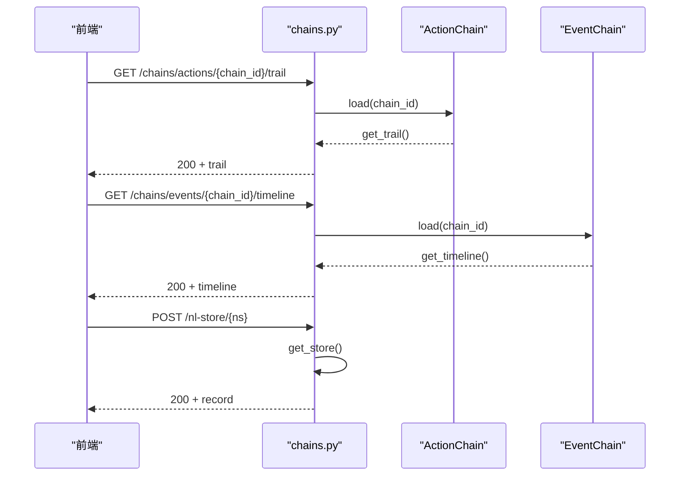
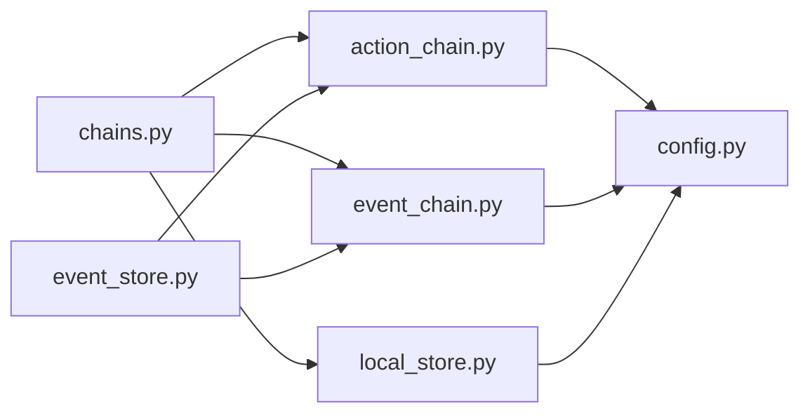

# 操作链追踪系统

<cite>
**本文引用的文件**
- [action_chain.py](file://backend/app/core/action_chain.py)
- [event_chain.py](file://backend/app/core/event_chain.py)
- [event_store.py](file://backend/app/storage/event_store.py)
- [local_store.py](file://backend/app/core/local_store.py)
- [chains.py](file://backend/app/api/chains.py)
- [schemas.py](file://backend/app/models/schemas.py)
- [config.py](file://backend/app/config.py)
- [main.py](file://backend/app/main.py)
- [chain_2b1e9289634c.json](file://backend/data/chains/actions/chain_2b1e9289634c.json)
- [eu_regulations_2026.json](file://backend/data/chains/events/eu_regulations_2026.json)
- [chain_2b1e9289634c.json](file://backend/data/event_chain/system_events/chain_2b1e9289634c.json)
- [test_chains.py](file://backend/tests/test_chains.py)
</cite>

## 目录
1. [简介](#简介)
2. [项目结构](#项目结构)
3. [核心组件](#核心组件)
4. [架构总览](#架构总览)
5. [组件详解](#组件详解)
6. [依赖关系分析](#依赖关系分析)
7. [性能考量](#性能考量)
8. [故障排查指南](#故障排查指南)
9. [结论](#结论)
10. [附录](#附录)

## 简介
本系统围绕“操作链”和“事件链”两条主线，提供可追溯、可观测、可回溯的审计与决策链路能力。操作链聚焦用户交互过程中的每一步操作，事件链记录系统内外部的重要事件。二者统一沉淀在事件存储层，既支持面向用户的用户操作链，也支持面向全局的系统事件链。配合自然语言本地存储与REST API，系统实现了从数据采集、持久化、查询筛选到前端可视化的完整闭环。

## 项目结构
- 后端采用FastAPI应用，路由集中在API层，核心业务逻辑位于core与storage层。
- 数据持久化采用JSON文件，按命名空间/链ID组织，兼顾可读性与易维护性。
- 配置集中于settings，数据根目录通过配置项统一管理。

图表来源
- [main.py:1-78](file://backend/app/main.py#L1-L78)
- [chains.py:1-282](file://backend/app/api/chains.py#L1-L282)
- [action_chain.py:1-236](file://backend/app/core/action_chain.py#L1-L236)
- [event_chain.py:1-215](file://backend/app/core/event_chain.py#L1-L215)
- [local_store.py:1-293](file://backend/app/core/local_store.py#L1-L293)
- [event_store.py:1-269](file://backend/app/storage/event_store.py#L1-L269)
- [config.py:1-183](file://backend/app/config.py#L1-L183)

章节来源
- [main.py:1-78](file://backend/app/main.py#L1-L78)
- [config.py:144-156](file://backend/app/config.py#L144-L156)

## 核心组件
- ActionChain/ActionNode：记录一次交互中的操作步骤，支持开始/完成计时、状态管理、序列化与回溯展示。
- EventChain/EventNode：记录系统/外部事件，支持按来源/类型/严重度/标签筛选与时间线展示。
- EventStore：统一的事件存储层，合并系统事件与用户操作事件，提供增删改查与迁移适配。
- NLStore/NLRecord：自然语言本地存储，支持命名空间组织、全文检索、CRUD与缓存。
- API路由：提供REST接口，暴露操作链、事件链与自然语言存储的查询、筛选、创建、更新、删除能力。

章节来源
- [action_chain.py:77-236](file://backend/app/core/action_chain.py#L77-L236)
- [event_chain.py:61-215](file://backend/app/core/event_chain.py#L61-L215)
- [event_store.py:59-269](file://backend/app/storage/event_store.py#L59-L269)
- [local_store.py:80-293](file://backend/app/core/local_store.py#L80-L293)
- [chains.py:27-282](file://backend/app/api/chains.py#L27-L282)

## 架构总览
系统采用“API层-核心层-存储层”的分层设计，API层负责对外接口，核心层封装业务模型与状态机，存储层负责数据持久化与迁移。配置中心统一管理数据根目录，确保各层一致的存储路径。

图表来源
- [chains.py:31-161](file://backend/app/api/chains.py#L31-L161)
- [action_chain.py:187-213](file://backend/app/core/action_chain.py#L187-L213)
- [event_chain.py:170-192](file://backend/app/core/event_chain.py#L170-L192)
- [event_store.py:76-158](file://backend/app/storage/event_store.py#L76-L158)

## 组件详解

### ActionChain 与 ActionNode：操作链设计与实现
- 数据结构
  - ActionNode：包含操作ID、链ID、父节点ID、类型、自然语言描述、执行Agent、输入输出、状态、时间戳、耗时等字段，并提供开始/完成计时与序列化。
  - ActionChain：维护节点列表，提供添加节点、按ID查找、保存、加载、列表、状态计算、自然语言链路生成等能力。
- 状态管理
  - 状态枚举：pending/running/success/failed；整体状态根据节点集合计算得出，支持partial/running/completed/failed/empty等聚合状态。
- 时间戳与计时
  - 使用UTC ISO格式时间戳；通过计时起点与完成时刻计算耗时（毫秒）。
- 持久化与迁移
  - 保存为JSON文件，按链ID命名；支持从旧目录迁移至新目录结构。
- 回溯分析
  - 提供自然语言链路展示，包含状态图标、步骤序号、Agent、描述与耗时，便于前端直接渲染。

图表来源
- [action_chain.py:23-75](file://backend/app/core/action_chain.py#L23-L75)
- [action_chain.py:77-184](file://backend/app/core/action_chain.py#L77-L184)

章节来源
- [action_chain.py:23-75](file://backend/app/core/action_chain.py#L23-L75)
- [action_chain.py:77-184](file://backend/app/core/action_chain.py#L77-L184)
- [action_chain.py:187-236](file://backend/app/core/action_chain.py#L187-L236)

### EventChain 与 EventNode：事件链设计与实现
- 数据结构
  - EventNode：包含事件ID、链ID、来源、类型、自然语言描述、严重度、负载、标签、时间戳。
  - EventChain：维护事件列表，提供添加事件、保存、加载、筛选、时间线生成等能力。
- 严重度与筛选
  - 严重度枚举：low/medium/high/critical；支持按来源、类型、严重度、标签进行筛选。
- 持久化与迁移
  - 保存为JSON文件，按链ID命名；支持从旧目录迁移至新目录结构。
- 可视化
  - 提供自然语言时间线，包含严重度图标、时间戳与描述，便于前端展示。

图表来源
- [event_chain.py:24-58](file://backend/app/core/event_chain.py#L24-L58)
- [event_chain.py:61-166](file://backend/app/core/event_chain.py#L61-L166)

章节来源
- [event_chain.py:24-58](file://backend/app/core/event_chain.py#L24-L58)
- [event_chain.py:61-166](file://backend/app/core/event_chain.py#L61-L166)
- [event_chain.py:170-215](file://backend/app/core/event_chain.py#L170-L215)

### EventStore：统一事件存储与迁移
- 分层设计
  - 系统事件：全局可见，按链ID组织，适合监管/审计/仪表盘展示。
  - 用户操作事件：按用户ID组织，支持用户侧决策链路回溯。
- 写入与读取
  - add_system_event / add_action_event：统一写入，内部加载链并追加事件，随后持久化。
  - get_system_events / get_user_events：按链ID或用户ID读取。
  - filter_system_events：按类型/来源/严重度筛选。
- 迁移适配
  - migrate_from_old_dirs：从旧目录结构迁移至新结构，避免破坏既有数据。

图表来源
- [event_store.py:76-158](file://backend/app/storage/event_store.py#L76-L158)
- [event_store.py:198-221](file://backend/app/storage/event_store.py#L198-L221)
- [event_store.py:224-269](file://backend/app/storage/event_store.py#L224-L269)

章节来源
- [event_store.py:59-269](file://backend/app/storage/event_store.py#L59-L269)

### NLStore：自然语言本地存储
- 命名空间组织：每个命名空间独立目录，同时维护一个合并文件与单条记录文件，便于整体查看与单条读取。
- 搜索机制：基于关键词命中计分，支持限定命名空间，结果按分数降序。
- 缓存策略：按命名空间缓存，首次访问时从文件加载，后续读取走内存。
- CRUD：支持创建/更新/删除/列出摘要，更新时刷新时间戳。

图表来源
- [local_store.py:29-78](file://backend/app/core/local_store.py#L29-L78)
- [local_store.py:80-293](file://backend/app/core/local_store.py#L80-L293)

章节来源
- [local_store.py:80-293](file://backend/app/core/local_store.py#L80-L293)

### API层：REST接口与数据契约
- 操作链API
  - 列表、获取、自然语言链路、创建事件（通过事件链API）。
- 事件链API
  - 列表、获取、时间线、筛选、创建事件。
- NLStore API
  - 搜索、列出命名空间、获取记录、创建/更新/删除记录。
- 数据契约
  - Pydantic模型定义请求/响应结构，保证前后端一致性。

图表来源
- [chains.py:31-161](file://backend/app/api/chains.py#L31-L161)
- [schemas.py:106-232](file://backend/app/models/schemas.py#L106-L232)

章节来源
- [chains.py:27-282](file://backend/app/api/chains.py#L27-L282)
- [schemas.py:106-232](file://backend/app/models/schemas.py#L106-L232)

## 依赖关系分析
- 组件耦合
  - API层依赖核心层与存储层；核心层彼此独立，仅通过配置共享数据根目录。
  - EventStore作为统一存储层，向上承接API层写入，向下对接文件系统。
- 外部依赖
  - FastAPI提供路由与HTTP协议；Pydantic提供数据校验；Python标准库负责文件与时间。
- 潜在循环依赖
  - 当前结构清晰，无循环导入迹象；若未来扩展，应避免API层直接依赖存储层实现细节。

图表来源
- [chains.py:1-282](file://backend/app/api/chains.py#L1-L282)
- [action_chain.py:1-236](file://backend/app/core/action_chain.py#L1-L236)
- [event_chain.py:1-215](file://backend/app/core/event_chain.py#L1-L215)
- [local_store.py:1-293](file://backend/app/core/local_store.py#L1-L293)
- [event_store.py:1-269](file://backend/app/storage/event_store.py#L1-L269)
- [config.py:144-156](file://backend/app/config.py#L144-L156)

章节来源
- [chains.py:1-282](file://backend/app/api/chains.py#L1-L282)
- [config.py:144-156](file://backend/app/config.py#L144-L156)

## 性能考量
- I/O特性
  - JSON文件顺序写入，读取时按需加载命名空间；适合中小规模数据与开发/演示场景。
- 搜索复杂度
  - NLStore全文搜索为线性扫描，时间复杂度O(N×M)，其中N为命名空间数量，M为记录数；建议控制命名空间规模或引入索引。
- 状态计算
  - ActionChain整体状态遍历节点集合，时间复杂度O(K)；K为节点数，开销较小。
- 建议
  - 生产环境可考虑引入轻量索引（如按时间戳/类型/严重度建立二级索引文件）与批量写入缓冲，减少频繁小文件写入带来的I/O放大。
  - 对高频查询接口增加缓存层（如Redis）以降低重复读取成本。

## 故障排查指南
- 常见问题
  - 链不存在：API返回404，检查链ID或命名空间是否正确。
  - 文件读取异常：确认data_dir配置正确且文件存在；检查权限与编码。
  - 迁移失败：检查旧目录是否存在，新目录是否可写。
- 调试步骤
  - 使用测试用例验证基本流程：添加节点/事件、保存、加载、筛选、回溯。
  - 通过API端点直接验证：列出链、获取详情、生成自然语言链路。
  - 检查事件存储：确认system_events与action_chains目录结构是否符合预期。
- 日志与监控
  - 在API层捕获异常并返回标准错误码；结合前端日志与后端日志定位问题。
  - 对关键写入接口（如add_action_event/add_system_event）增加埋点，记录耗时与成功率。

章节来源
- [test_chains.py:1-99](file://backend/tests/test_chains.py#L1-L99)
- [chains.py:48-67](file://backend/app/api/chains.py#L48-L67)
- [chains.py:91-110](file://backend/app/api/chains.py#L91-L110)
- [event_store.py:224-269](file://backend/app/storage/event_store.py#L224-L269)

## 结论
该系统以“操作链+事件链+统一存储”为核心，提供了完整的可追溯、可回溯与可展示能力。通过清晰的分层设计与简洁的JSON存储，系统在可读性与易维护性方面表现突出。对于生产环境，建议引入索引与缓存、优化批量写入与查询性能，并完善监控与告警体系，以满足更高吞吐与可靠性需求。

## 附录

### 数据结构与示例
- 操作链示例：包含多个操作节点与自然语言链路，便于前端展示。
- 事件链示例：包含系统事件与时间线，支持按严重度筛选。
- 统一事件存储示例：同一链ID在新结构下的用户操作链文件。

章节来源
- [chain_2b1e9289634c.json:1-123](file://backend/data/chains/actions/chain_2b1e9289634c.json#L1-L123)
- [eu_regulations_2026.json:1-39](file://backend/data/chains/events/eu_regulations_2026.json#L1-L39)
- [chain_2b1e9289634c.json:1-123](file://backend/data/event_chain/system_events/chain_2b1e9289634c.json#L1-L123)