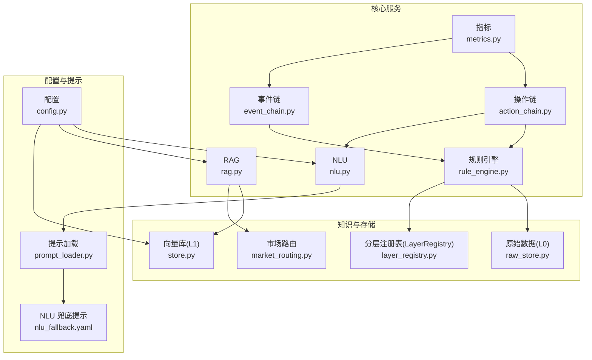
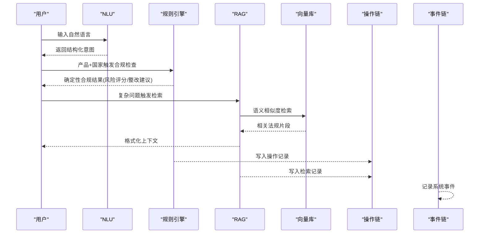
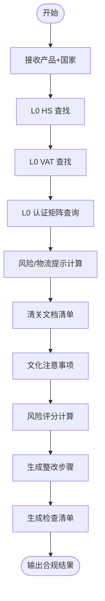
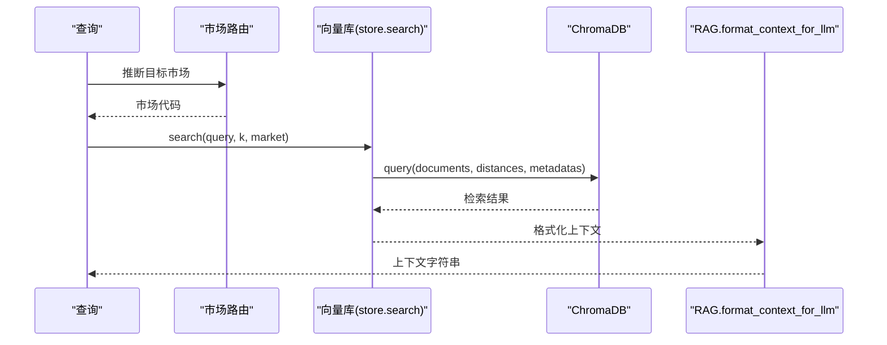
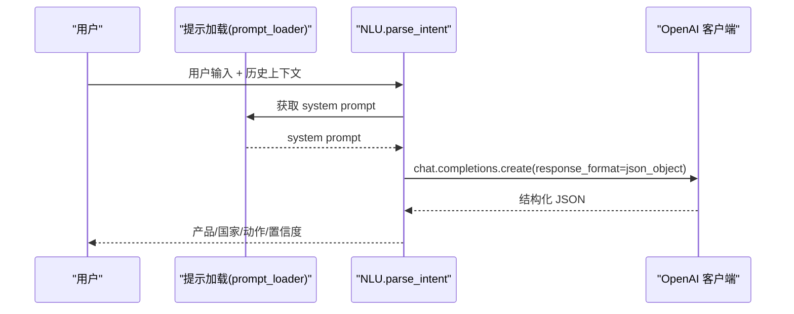
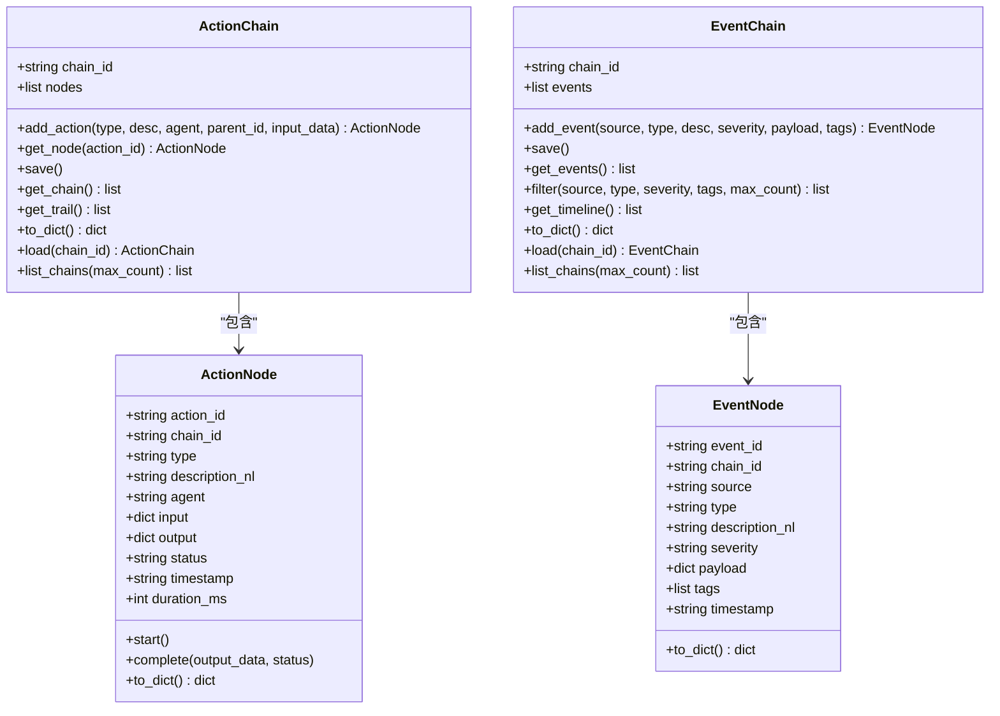
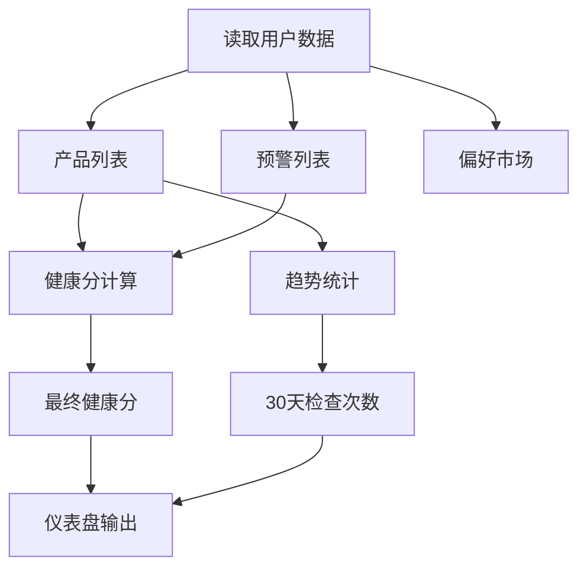
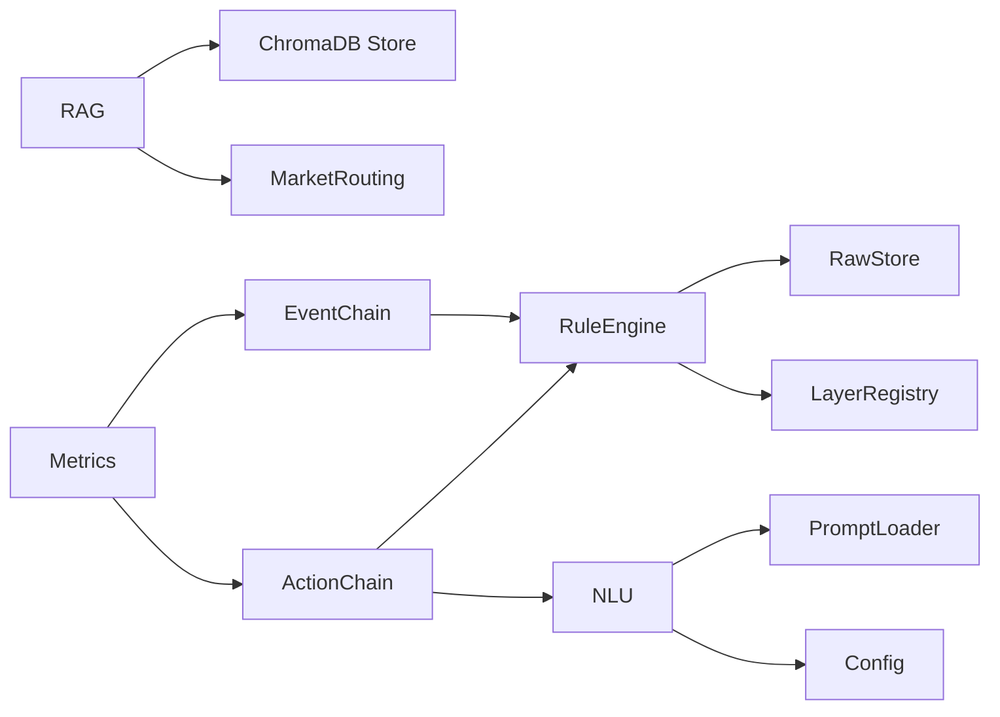

# 核心业务逻辑

<cite>
**本文档引用的文件**
- [rule_engine.py](file://backend/app/core/rule_engine.py)
- [nlu.py](file://backend/app/core/nlu.py)
- [rag.py](file://backend/app/core/rag.py)
- [action_chain.py](file://backend/app/core/action_chain.py)
- [event_chain.py](file://backend/app/core/event_chain.py)
- [metrics.py](file://backend/app/core/metrics.py)
- [store.py](file://backend/app/knowledge/store.py)
- [layer_registry.py](file://backend/app/storage/layer_registry.py)
- [raw_store.py](file://backend/app/storage/raw_store.py)
- [market_routing.py](file://backend/app/knowledge/market_routing.py)
- [config.py](file://backend/app/config.py)
- [prompt_loader.py](file://backend/app/services/prompt_loader.py)
- [nlu_fallback.yaml](file://backend/data/prompts/nlu_fallback.yaml)
- [test_chain_001.json](file://backend/data/chains/actions/test_chain_001.json)
- [eu_regulations_2026.json](file://backend/data/chains/events/eu_regulations_2026.json)
</cite>

## 目录
1. [简介](#简介)
2. [项目结构](#项目结构)
3. [核心组件](#核心组件)
4. [架构总览](#架构总览)
5. [详细组件分析](#详细组件分析)
6. [依赖分析](#依赖分析)
7. [性能考虑](#性能考虑)
8. [故障排查指南](#故障排查指南)
9. [结论](#结论)
10. [附录](#附录)

## 简介
本文件聚焦于跨境合规智能体的核心业务逻辑模块，系统性阐述以下能力：
- 规则引擎的确定性合规检查机制：规则定义、执行流程、风险评分与整改建议。
- RAG 检索系统的向量数据库操作：嵌入向量生成、相似度检索、上下文构建。
- NLU 自然语言处理的意图识别与实体抽取：预训练模型使用、自定义解析规则。
- ActionChain 与 EventChain 的操作链与事件链追踪系统：事件记录、状态管理、回溯分析。
- 指标采集与性能监控：关键指标定义、数据统计、可视化展示。

## 项目结构
核心业务逻辑分布在 backend/app/core 与 backend/app/knowledge、backend/app/storage 等子模块中，采用“确定性规则 + LLM 辅助”的双轨架构：
- L0 分层存储注册表统一接入各层数据源。
- RuleEngine 专注高频确定性合规检查。
- NLU 专注于意图解析与实体抽取。
- RAG 通过向量检索提供法规上下文。
- ActionChain/EventChain 提供可追溯的审计与回溯能力。
- Metrics 聚合用户级仪表盘数据。

图表来源
- [rule_engine.py:1-247](file://backend/app/core/rule_engine.py#L1-L247)
- [nlu.py:1-99](file://backend/app/core/nlu.py#L1-L99)
- [rag.py:1-59](file://backend/app/core/rag.py#L1-L59)
- [action_chain.py:1-236](file://backend/app/core/action_chain.py#L1-L236)
- [event_chain.py:1-215](file://backend/app/core/event_chain.py#L1-L215)
- [metrics.py:1-176](file://backend/app/core/metrics.py#L1-L176)
- [raw_store.py:1-134](file://backend/app/storage/raw_store.py#L1-L134)
- [layer_registry.py:1-45](file://backend/app/storage/layer_registry.py#L1-L45)
- [store.py:1-227](file://backend/app/knowledge/store.py#L1-L227)
- [market_routing.py:1-77](file://backend/app/knowledge/market_routing.py#L1-L77)
- [config.py:1-75](file://backend/app/config.py#L1-L75)
- [prompt_loader.py:1-79](file://backend/app/services/prompt_loader.py#L1-L79)
- [nlu_fallback.yaml:1-20](file://backend/data/prompts/nlu_fallback.yaml#L1-L20)

章节来源
- [layer_registry.py:1-45](file://backend/app/storage/layer_registry.py#L1-L45)
- [config.py:1-75](file://backend/app/config.py#L1-L75)

## 核心组件
- 规则引擎（RuleEngine）：基于 L0 原始数据（HS 编码、VAT、认证矩阵）执行确定性合规检查，输出风险评分、整改建议与清单。
- NLU：将用户自然语言解析为结构化意图与实体，支持热加载提示模板。
- RAG：从 ChromaDB 向量库检索相关法规片段，格式化为 LLM 上下文。
- ActionChain：记录交互全流程操作节点，支持状态管理与链路回溯。
- EventChain：记录系统内外部重要事件，支持筛选与时间线展示。
- 指标（Metrics）：聚合用户级仪表盘数据，计算健康分与趋势。

章节来源
- [rule_engine.py:197-247](file://backend/app/core/rule_engine.py#L197-L247)
- [nlu.py:59-99](file://backend/app/core/nlu.py#L59-L99)
- [rag.py:10-59](file://backend/app/core/rag.py#L10-L59)
- [action_chain.py:77-184](file://backend/app/core/action_chain.py#L77-L184)
- [event_chain.py:61-166](file://backend/app/core/event_chain.py#L61-L166)
- [metrics.py:20-46](file://backend/app/core/metrics.py#L20-L46)

## 架构总览
系统采用“确定性规则优先、LLM 辅助兜底”的混合架构：
- 确定性路径：RuleEngine 读取 L0 数据，快速给出合规结论与风险等级。
- LLM 路径：NLU 解析意图，RAG 提供法规上下文，辅助复杂问题与模糊场景。
- 可追溯路径：ActionChain/EventChain 记录操作与事件，支撑审计与回溯。
- 监控路径：Metrics 聚合用户级健康度与趋势，驱动可视化与运营优化。

图表来源
- [nlu.py:59-99](file://backend/app/core/nlu.py#L59-L99)
- [rule_engine.py:197-247](file://backend/app/core/rule_engine.py#L197-L247)
- [rag.py:10-59](file://backend/app/core/rag.py#L10-L59)
- [store.py:127-192](file://backend/app/knowledge/store.py#L127-L192)
- [action_chain.py:133-145](file://backend/app/core/action_chain.py#L133-L145)
- [event_chain.py:110-116](file://backend/app/core/event_chain.py#L110-L116)

## 详细组件分析

### 规则引擎：确定性合规检查
- 规则定义与数据源
  - HS 编码：来自 L0 原始数据（data/raw/hs_codes/_all.json），支持别名与模糊匹配。
  - VAT 税率：来自 L0 原始数据（data/raw/vat_rates/_all.json）。
  - 认证矩阵：来自 L0 原始数据（data/raw/certifications/cert_matrix.json）。
  - 风险标志与物流提示：内置关键字与国家特定规则。
- 执行流程
  - 输入：产品名称、目标国家。
  - 步骤：HS 查找 → VAT 查找 → 认证查询 → 风险与物流提示 → 文档清单与文化注意事项 → 风险评分与整改建议。
- 决策树结构
  - 以“是否命中 HS 编码”“认证数量”“风险/物流提示数量”“高风险关键词”为分支，形成可解释的风险评分与建议路径。
- 输出：合规结果字典，包含 HS、VAT、认证、风险等级、风险分数、风险提示、物流提示、清关文档、文化注意事项、整改步骤与检查清单。

图表来源
- [rule_engine.py:17-247](file://backend/app/core/rule_engine.py#L17-L247)
- [raw_store.py:61-130](file://backend/app/storage/raw_store.py#L61-L130)

章节来源
- [rule_engine.py:17-247](file://backend/app/core/rule_engine.py#L17-L247)
- [raw_store.py:19-134](file://backend/app/storage/raw_store.py#L19-L134)

### RAG 检索系统：向量数据库操作
- 向量嵌入
  - 使用 sentence-transformers 多语言模型（paraphrase-multilingual-MiniLM-L12-v2），本地离线加载，懒初始化。
  - ChromaDB 持久化客户端，按市场分 collection（eu/de/us/jp/kr）。
- 相似度检索
  - 支持按市场路由或自动检测市场，若推断失败则全库聚合返回。
  - 返回包含文本、相似度分数、来源链接、生效日期等元数据。
- 上下文构建
  - 将检索结果格式化为带来源标注的上下文字符串，便于注入 LLM。

图表来源
- [store.py:127-192](file://backend/app/knowledge/store.py#L127-L192)
- [market_routing.py:48-77](file://backend/app/knowledge/market_routing.py#L48-L77)
- [rag.py:21-59](file://backend/app/core/rag.py#L21-L59)

章节来源
- [store.py:1-227](file://backend/app/knowledge/store.py#L1-L227)
- [market_routing.py:1-77](file://backend/app/knowledge/market_routing.py#L1-L77)
- [rag.py:1-59](file://backend/app/core/rag.py#L1-L59)

### NLU 自然语言处理：意图识别与实体抽取
- 预训练模型使用
  - 通过配置选择 LLM（优先使用主 LLM 设置），支持禁用思考模式以降低延迟。
- 自定义解析规则
  - 从 Agent 配置或 YAML 提示模板加载 system prompt，支持热加载。
  - 提示模板定义 JSON 结构化输出字段（产品、目标国家、动作、置信度）。
- 多轮上下文
  - 支持最多 6 条历史消息注入，助手消息截断以避免污染上下文。

图表来源
- [nlu.py:59-99](file://backend/app/core/nlu.py#L59-L99)
- [prompt_loader.py:23-79](file://backend/app/services/prompt_loader.py#L23-L79)
- [nlu_fallback.yaml:1-20](file://backend/data/prompts/nlu_fallback.yaml#L1-L20)
- [config.py:20-37](file://backend/app/config.py#L20-L37)

章节来源
- [nlu.py:1-99](file://backend/app/core/nlu.py#L1-L99)
- [prompt_loader.py:1-79](file://backend/app/services/prompt_loader.py#L1-L79)
- [nlu_fallback.yaml:1-20](file://backend/data/prompts/nlu_fallback.yaml#L1-L20)
- [config.py:1-75](file://backend/app/config.py#L1-L75)

### ActionChain 与 EventChain：操作链与事件链追踪
- 操作链（ActionChain）
  - 记录一次交互中的每个操作节点，包含类型、描述、代理、输入输出、状态与耗时。
  - 支持追加、开始/完成、保存、加载、链路回溯与状态计算。
- 事件链（EventChain）
  - 记录系统内外部重要事件，支持按来源/类型/严重度/标签筛选与时间线展示。
- 数据持久化
  - 操作链与事件链分别以 JSON 文件形式存储，按会话/链 ID 组织，支持列表与摘要查看。

图表来源
- [action_chain.py:23-236](file://backend/app/core/action_chain.py#L23-L236)
- [event_chain.py:24-215](file://backend/app/core/event_chain.py#L24-L215)

章节来源
- [action_chain.py:1-236](file://backend/app/core/action_chain.py#L1-L236)
- [event_chain.py:1-215](file://backend/app/core/event_chain.py#L1-L215)
- [test_chain_001.json:1-46](file://backend/data/chains/actions/test_chain_001.json#L1-L46)
- [eu_regulations_2026.json:1-39](file://backend/data/chains/events/eu_regulations_2026.json#L1-L39)

### 指标收集与性能监控
- 用户级仪表盘聚合
  - 数据来源：L2 项目记忆（产品数、合规记录）、L5 事件存储（预警）、L3 用户记忆（偏好市场）。
  - 指标：总产品数、风险分布、最近预警、活跃市场、健康分、趋势。
- 健康分算法
  - 基础 100，扣分项：高风险产品、无 HS 编码产品、待处理高/危预警；加分项：近 7 天合规检查次数（上限 20）。
- 趋势计算
  - 近 30 天每日合规检查次数统计。

图表来源
- [metrics.py:20-176](file://backend/app/core/metrics.py#L20-L176)

章节来源
- [metrics.py:1-176](file://backend/app/core/metrics.py#L1-L176)

## 依赖分析
- 组件耦合与内聚
  - RuleEngine 通过 LayerRegistry 访问 L0 原始数据，耦合度低、内聚度高。
  - NLU 依赖提示加载器与配置，支持热加载与多模型切换。
  - RAG 依赖向量库与市场路由，具备市场隔离与降级能力。
  - ActionChain/EventChain 仅负责记录与回溯，不参与业务决策。
- 外部依赖
  - ChromaDB（向量检索）、SentenceTransformer（嵌入）、OpenAI（LLM）。
- 循环依赖
  - 未发现循环导入；模块间通过函数/类接口调用。

图表来源
- [rule_engine.py:13-14](file://backend/app/core/rule_engine.py#L13-L14)
- [nlu.py:8-10](file://backend/app/core/nlu.py#L8-L10)
- [rag.py:7-7](file://backend/app/core/rag.py#L7-L7)
- [store.py:14-16](file://backend/app/knowledge/store.py#L14-L16)
- [market_routing.py:18-25](file://backend/app/knowledge/market_routing.py#L18-L25)
- [action_chain.py:17-17](file://backend/app/core/action_chain.py#L17-L17)
- [event_chain.py:16-16](file://backend/app/core/event_chain.py#L16-L16)
- [metrics.py:15-15](file://backend/app/core/metrics.py#L15-L15)

章节来源
- [layer_registry.py:23-44](file://backend/app/storage/layer_registry.py#L23-L44)
- [config.py:1-75](file://backend/app/config.py#L1-L75)

## 性能考虑
- 确定性规则优先：RuleEngine 读取 L0 缓存数据，避免频繁磁盘 I/O，适合高频调用。
- 向量检索降级：ChromaDB 异常时返回空结果，不阻塞主流程，保障可用性。
- LLM 调用优化：禁用思考模式、限制补全长度、控制上下文长度，降低延迟。
- 懒加载与缓存：嵌入模型与提示模板均支持懒加载与全局缓存，减少启动与运行时开销。
- 存储隔离：按市场分 collection，缩小检索范围，提升检索效率。

## 故障排查指南
- RuleEngine 无结果
  - 检查 L0 数据文件是否存在与格式正确；必要时清理缓存后重试。
  - 关注 HS 模糊匹配是否命中，必要时扩展别名映射。
- RAG 无结果
  - 检查向量库是否初始化、collection 是否存在；确认 market 路由是否正确。
  - 若推断失败，确认全库检索逻辑是否被触发。
- NLU 解析异常
  - 检查 system prompt 是否可加载；确认 LLM 配置与 API Key。
  - 控制历史上下文长度，避免超长内容影响稳定性。
- ActionChain/EventChain 加载失败
  - 检查 JSON 文件完整性与编码；确认 data_dir 配置正确。
- 指标数据为空
  - 检查用户记忆、项目记忆与事件存储目录是否存在；确认文件权限。

章节来源
- [raw_store.py:28-53](file://backend/app/storage/raw_store.py#L28-L53)
- [store.py:43-52](file://backend/app/knowledge/store.py#L43-L52)
- [nlu.py:16-25](file://backend/app/core/nlu.py#L16-L25)
- [action_chain.py:187-212](file://backend/app/core/action_chain.py#L187-L212)
- [event_chain.py:170-192](file://backend/app/core/event_chain.py#L170-L192)
- [metrics.py:49-91](file://backend/app/core/metrics.py#L49-L91)

## 结论
该系统通过“确定性规则 + LLM 辅助 + 可追溯审计 + 指标监控”的组合，实现了高效、可解释、可运维的跨境合规智能体。RuleEngine 保证高频场景的确定性与一致性；NLU/RAG 提升复杂问题的处理能力；ActionChain/EventChain 提供完整的审计与回溯；Metrics 为运营与产品优化提供数据支撑。建议持续完善 L0 数据质量、优化提示模板、加强向量库增量更新与健康监控。

## 附录
- 关键配置项
  - LLM 主配置：主 API Key/Base URL/Model、禁用思考模式。
  - ChromaDB：持久化目录。
  - Prompt 目录：YAML 模板所在路径。
- 示例数据
  - 操作链样例：[test_chain_001.json:1-46](file://backend/data/chains/actions/test_chain_001.json#L1-L46)
  - 事件链样例：[eu_regulations_2026.json:1-39](file://backend/data/chains/events/eu_regulations_2026.json#L1-L39)