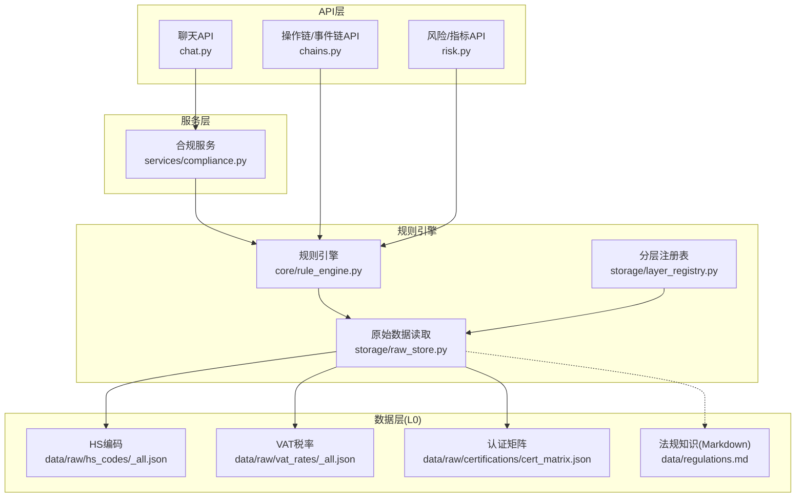
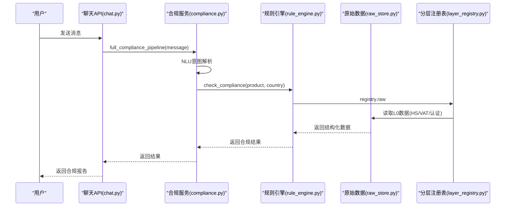
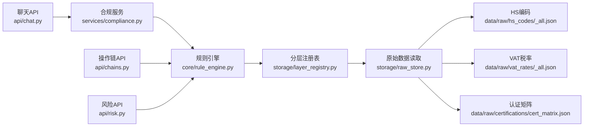

# 规则引擎系统

<cite>
**本文引用的文件**
- [backend/app/core/rule_engine.py](file://backend/app/core/rule_engine.py)
- [backend/app/services/compliance.py](file://backend/app/services/compliance.py)
- [backend/app/storage/layer_registry.py](file://backend/app/storage/layer_registry.py)
- [backend/app/storage/raw_store.py](file://backend/app/storage/raw_store.py)
- [backend/data/raw/hs_codes/_all.json](file://backend/data/raw/hs_codes/_all.json)
- [backend/data/raw/vat_rates/_all.json](file://backend/data/raw/vat_rates/_all.json)
- [backend/data/raw/certifications/cert_matrix.json](file://backend/data/raw/certifications/cert_matrix.json)
- [backend/data/regulations.md](file://backend/data/regulations.md)
- [backend/tests/test_rule_engine.py](file://backend/tests/test_rule_engine.py)
- [backend/app/models/schemas.py](file://backend/app/models/schemas.py)
- [backend/data/数据流转.md](file://backend/data/数据流转.md)
- [backend/app/api/chat.py](file://backend/app/api/chat.py)
- [backend/app/api/chains.py](file://backend/app/api/chains.py)
- [backend/app/api/risk.py](file://backend/app/api/risk.py)
</cite>

## 目录
1. [简介](#简介)
2. [项目结构](#项目结构)
3. [核心组件](#核心组件)
4. [架构总览](#架构总览)
5. [详细组件分析](#详细组件分析)
6. [依赖分析](#依赖分析)
7. [性能考虑](#性能考虑)
8. [故障排查指南](#故障排查指南)
9. [结论](#结论)
10. [附录](#附录)

## 简介
本文件系统化阐述规则引擎系统的“基于SOP的确定性合规检查机制”。该机制以L0原始数据为基础，围绕HS编码查找、VAT税率查询、认证要求获取等高频确定性场景，提供快速、稳定、可审计的合规检查能力。系统同时具备风险评分算法、补救步骤生成、合规检查清单构建等核心功能，并在L0数据不可用时提供优雅降级策略，确保主流程不中断。

## 项目结构
系统采用“分层存储 + 多模型协同”的架构设计：
- 分层存储（L0-L5）：规则引擎主要读取L0原始数据，其他层服务于知识检索、会话记忆、事件审计等。
- 规则引擎（RuleEngine）：封装确定性合规检查的全部逻辑，作为服务层的直接调用对象。
- 服务层（Compliance Service）：编排NLU意图解析与规则引擎，形成端到端合规管线。
- API层：对外提供聊天、操作链、事件链、风险监控等接口。
- 测试与文档：单元测试覆盖关键行为，数据流转文档定义了清晰的数据来源与流向。

图表来源
- [backend/app/api/chat.py:1-200](file://backend/app/api/chat.py#L1-L200)
- [backend/app/services/compliance.py:1-35](file://backend/app/services/compliance.py#L1-L35)
- [backend/app/core/rule_engine.py:1-247](file://backend/app/core/rule_engine.py#L1-L247)
- [backend/app/storage/raw_store.py:1-134](file://backend/app/storage/raw_store.py#L1-L134)
- [backend/app/storage/layer_registry.py:1-45](file://backend/app/storage/layer_registry.py#L1-L45)
- [backend/data/raw/hs_codes/_all.json:1-1](file://backend/data/raw/hs_codes/_all.json#L1-L1)
- [backend/data/raw/vat_rates/_all.json:1-13](file://backend/data/raw/vat_rates/_all.json#L1-L13)
- [backend/data/raw/certifications/cert_matrix.json:1-14](file://backend/data/raw/certifications/cert_matrix.json#L1-L14)
- [backend/data/regulations.md:1-111](file://backend/data/regulations.md#L1-L111)

章节来源
- [backend/data/数据流转.md:1-361](file://backend/data/数据流转.md#L1-L361)

## 核心组件
- 规则引擎（RuleEngine）：提供HS编码查找、VAT税率查询、认证要求获取、风险与物流提示、文化注意事项、风险评分、补救步骤与检查清单构建等确定性功能。
- 原始数据读取（RawStore）：负责L0数据的缓存与读取，支持热加载，屏蔽底层文件系统细节。
- 分层注册表（LayerRegistry）：统一暴露L0-L5各层存储入口，规则引擎通过registry.raw访问L0。
- 合规服务（Compliance Service）：编排NLU与规则引擎，形成端到端合规检查流程。
- API层：提供聊天、操作链、事件链、风险监控等REST接口，支撑前端与外部系统集成。

章节来源
- [backend/app/core/rule_engine.py:17-247](file://backend/app/core/rule_engine.py#L17-L247)
- [backend/app/storage/raw_store.py:19-134](file://backend/app/storage/raw_store.py#L19-L134)
- [backend/app/storage/layer_registry.py:23-45](file://backend/app/storage/layer_registry.py#L23-L45)
- [backend/app/services/compliance.py:11-35](file://backend/app/services/compliance.py#L11-L35)

## 架构总览
规则引擎遵循“确定性检查优先、知识库与LLM兜底”的分层原则：
- 确定性合规检查：当用户明确给出产品+国家时，直接走规则引擎（L0数据）。
- 知识库与LLM：当规则引擎无法覆盖或需要法规引用时，走RAG检索与LLM生成。
- 事件链与审计：每次操作均写入L5事件链，便于回溯与监控。

图表来源
- [backend/app/api/chat.py:11-200](file://backend/app/api/chat.py#L11-L200)
- [backend/app/services/compliance.py:11-35](file://backend/app/services/compliance.py#L11-L35)
- [backend/app/core/rule_engine.py:197-247](file://backend/app/core/rule_engine.py#L197-L247)
- [backend/app/storage/layer_registry.py:23-45](file://backend/app/storage/layer_registry.py#L23-L45)
- [backend/app/storage/raw_store.py:28-134](file://backend/app/storage/raw_store.py#L28-L134)

## 详细组件分析

### 规则引擎（RuleEngine）
- 功能职责
  - HS编码查找：基于L0 hs_codes数据，支持模糊匹配与别名映射，返回HS编码及描述。
  - VAT税率查询：基于L0 vat_rates数据，返回目标国家标准税率。
  - 认证要求获取：基于L0 cert_matrix数据，返回目标国家所需的认证列表。
  - 风险提示：根据产品关键词与国家，生成高风险提示。
  - 物流与运输提示：根据产品与国家，生成物流限制与运输注意事项。
  - 文化与标签提示：面向不同市场的标签与文化注意事项。
  - 风险评分：综合HS匹配、认证数量、风险与物流提示、产品高风险类别，计算0-100分。
  - 补救步骤：基于规则引擎结果，生成优先级整改建议。
  - 检查清单：生成出口待办清单，便于落地执行。
  - 完整合规检查：串联上述步骤，输出标准化合规结果。

- 数据来源与降级
  - 数据来源：L0原始数据（hs_codes、vat_rates、cert_matrix）。
  - 降级策略：当L0数据不可用时，返回空结果并标记，不抛出异常，保证流程稳定。

- 决策逻辑与复杂度
  - HS匹配：遍历L0 hs_codes，支持关键词与别名匹配，时间复杂度近似O(N)。
  - VAT查询：字典查找，时间复杂度O(1)。
  - 认证查询：字典查找，时间复杂度O(1)，未知国家回退至德国标准。
  - 风险评分：常数时间复杂度，包含多项加权累加。
  - 风险等级映射：常数时间复杂度。

- 错误处理与健壮性
  - 未识别产品名称时，返回错误提示与空合规结果。
  - L0数据缺失时，返回空值并提示人工复核。
  - 未知国家默认回退至保守标准。

章节来源
- [backend/app/core/rule_engine.py:17-247](file://backend/app/core/rule_engine.py#L17-L247)
- [backend/data/数据流转.md:270-299](file://backend/data/数据流转.md#L270-L299)

### 原始数据读取（RawStore）
- 职责
  - 加载并缓存L0数据（hs_codes、vat_rates、cert_matrix），避免重复IO。
  - 提供lookup与get方法，屏蔽文件系统细节。
  - 支持缓存失效与热加载，便于动态更新。

- HS编码匹配策略
  - 基于产品中文名进行模糊匹配，支持关键词拆分与别名映射（如“锂电池”→“锂离子蓄电池”）。

- VAT与认证查询
  - VAT按国家名直接查表，未知国家返回0.0。
  - 认证按国家名查表，未知国家回退至德国标准。

章节来源
- [backend/app/storage/raw_store.py:28-134](file://backend/app/storage/raw_store.py#L28-L134)
- [backend/data/raw/hs_codes/_all.json:1-1](file://backend/data/raw/hs_codes/_all.json#L1-L1)
- [backend/data/raw/vat_rates/_all.json:1-13](file://backend/data/raw/vat_rates/_all.json#L1-L13)
- [backend/data/raw/certifications/cert_matrix.json:1-14](file://backend/data/raw/certifications/cert_matrix.json#L1-L14)

### 分层注册表（LayerRegistry）
- 职责
  - 统一暴露L0-L5各层存储入口，规则引擎通过registry.raw访问L0。
  - 新增存储层时，只需在此注册即可。

章节来源
- [backend/app/storage/layer_registry.py:23-45](file://backend/app/storage/layer_registry.py#L23-L45)

### 合规服务（Compliance Service）
- 职责
  - 解析用户消息的意图，抽取产品与目标国家。
  - 调用规则引擎执行确定性合规检查。
  - 返回标准化结果，包含意图解析与错误信息。

章节来源
- [backend/app/services/compliance.py:11-35](file://backend/app/services/compliance.py#L11-L35)

### API层与数据流
- 聊天API（chat.py）
  - 提供端到端合规检查流程，支持Codex与NLU双路径。
  - 将每次交互写入操作链（L5），便于审计与回溯。
  - 在规则引擎异常时，返回空合规结果并记录降级路径。

- 操作链/事件链API（chains.py）
  - 提供操作链与事件链的查询、筛选与创建接口。
  - 支持按来源、类型、严重度、标签等条件筛选事件。

- 风险/指标API（risk.py）
  - 提供风险预警列表、未读数、手动触发市场扫描、仪表盘等接口。
  - 与规则引擎结果结合，形成闭环监控。

章节来源
- [backend/app/api/chat.py:11-200](file://backend/app/api/chat.py#L11-L200)
- [backend/app/api/chains.py:31-161](file://backend/app/api/chains.py#L31-L161)
- [backend/app/api/risk.py:25-154](file://backend/app/api/risk.py#L25-L154)

## 依赖分析
- 组件耦合
  - 规则引擎对分层注册表与原始数据读取存在直接依赖，耦合度低，便于替换与扩展。
  - 合规服务仅依赖规则引擎与NLU，职责清晰。
  - API层通过服务层间接依赖规则引擎，形成清晰的控制流。

- 外部依赖
  - L0数据文件为静态JSON/Markdown，部署时随应用分发。
  - 知识库层（L1）依赖ChromaDB，规则引擎不依赖，具备良好隔离。

图表来源
- [backend/app/services/compliance.py:7-35](file://backend/app/services/compliance.py#L7-L35)
- [backend/app/core/rule_engine.py:13-26](file://backend/app/core/rule_engine.py#L13-L26)
- [backend/app/storage/layer_registry.py:16-45](file://backend/app/storage/layer_registry.py#L16-L45)
- [backend/app/storage/raw_store.py:12-134](file://backend/app/storage/raw_store.py#L12-L134)
- [backend/app/api/chat.py:14-25](file://backend/app/api/chat.py#L14-L25)
- [backend/app/api/chains.py:19-25](file://backend/app/api/chains.py#L19-L25)
- [backend/app/api/risk.py:6-19](file://backend/app/api/risk.py#L6-L19)

## 性能考虑
- L0数据缓存：规则引擎通过RawStore一次性加载并缓存，后续查询均为内存访问，延迟极低。
- HS匹配优化：采用关键词拆分与别名映射，减少全量字符串匹配成本。
- 风险评分与清单构建：均为常数时间复杂度，适合高频调用。
- 降级与容错：L0数据不可用时返回空结果并标记，避免阻塞主流程，提升系统韧性。

## 故障排查指南
- 产品未识别
  - 现象：返回错误提示“未能识别产品名称，请描述更具体一些”，合规结果为空。
  - 处理：引导用户提供更具体的描述（品牌、型号、用途、材质）。

- HS编码未匹配
  - 现象：返回“需人工核实”的描述，风险评分偏低。
  - 处理：建议人工复核HS编码，或补充产品特性信息以提高匹配准确度。

- VAT数据缺失
  - 现象：返回0.0的VAT，且提示未知国家。
  - 处理：确认目标国家名称是否正确，或在L0数据中补充相应条目。

- 认证矩阵缺失
  - 现象：返回默认的德国认证列表。
  - 处理：在cert_matrix.json中添加目标国家的认证要求，或在规则引擎中调整回退策略。

- 规则引擎异常
  - 现象：聊天API捕获异常并返回空合规结果。
  - 处理：检查L0数据完整性与格式，必要时重启服务以重新加载缓存。

- 事件链与审计
  - 通过操作链API查询链路与节点，定位具体失败环节。
  - 通过风险API查看预警与扫描状态，辅助问题定位。

章节来源
- [backend/app/services/compliance.py:22-34](file://backend/app/services/compliance.py#L22-L34)
- [backend/app/core/rule_engine.py:211-247](file://backend/app/core/rule_engine.py#L211-L247)
- [backend/app/api/chat.py:159-175](file://backend/app/api/chat.py#L159-L175)
- [backend/app/api/chains.py:31-68](file://backend/app/api/chains.py#L31-L68)

## 结论
规则引擎系统以L0原始数据为核心，构建了确定性、可审计、可扩展的合规检查能力。通过清晰的分层设计与严格的降级策略，系统在保证高性能的同时，兼顾了稳定性与可维护性。未来可在知识库与LLM层面进一步增强，形成“确定性+知识+智能”的复合合规体系。

## 附录

### 使用示例
- 基本合规检查
  - 输入：用户消息包含产品与目标国家。
  - 流程：NLU解析 → 规则引擎确定性检查 → 生成合规报告与操作链。
  - 输出：合规结果（HS、VAT、认证、风险、物流、文化、评分、清单、补救步骤）。

- Shopify产品合规检查
  - 输入：Shopify产品ID与目标市场。
  - 流程：拉取产品信息 → 构建合规查询 → 规则引擎检查 → 生成报告与事件链。

- 风险监控与预警
  - 触发：定时扫描或手动触发。
  - 流程：Codex Agent联网搜索 → 市场事件分析 → 影响评估 → 风险预警 → 实时推送。

章节来源
- [backend/app/api/chat.py:307-484](file://backend/app/api/chat.py#L307-L484)
- [backend/app/api/shopify.py:134-173](file://backend/app/api/shopify.py#L134-L173)
- [backend/app/api/risk.py:63-108](file://backend/app/api/risk.py#L63-L108)

### 数据模型与Schema
- 合规结果（ComplianceResult）：包含HS编码、VAT、认证、风险等级与评分、风险与物流提示、清关材料、文化注意事项、补救步骤、检查清单等字段，用于前端展示与后续处理。

章节来源
- [backend/app/models/schemas.py:79-93](file://backend/app/models/schemas.py#L79-L93)

### 测试要点
- HS编码查找：覆盖精确匹配、部分匹配、无匹配等场景。
- VAT查询：覆盖已知国家、未知国家默认为0.0等场景。
- 认证查询：覆盖不同国家、未知国家回退至德国标准等场景。
- 风险提示：覆盖高风险类别与地区特定风险。
- 完整合规检查：覆盖典型产品（LED灯、智能手机）与典型市场（德国、美国）。

章节来源
- [backend/tests/test_rule_engine.py:13-112](file://backend/tests/test_rule_engine.py#L13-L112)