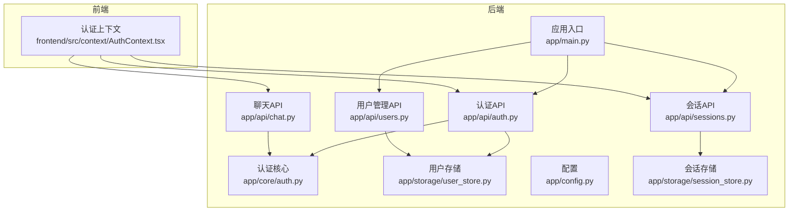
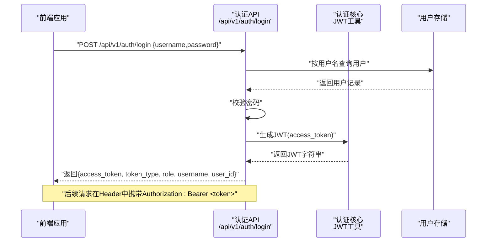
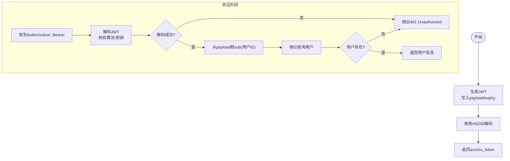
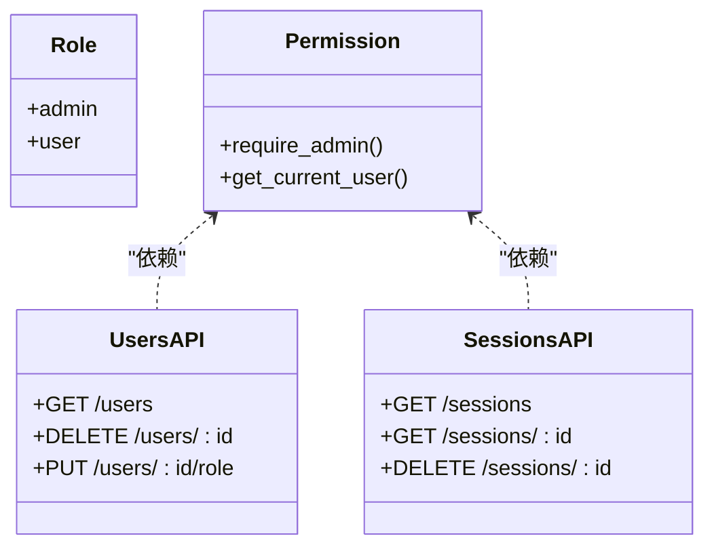
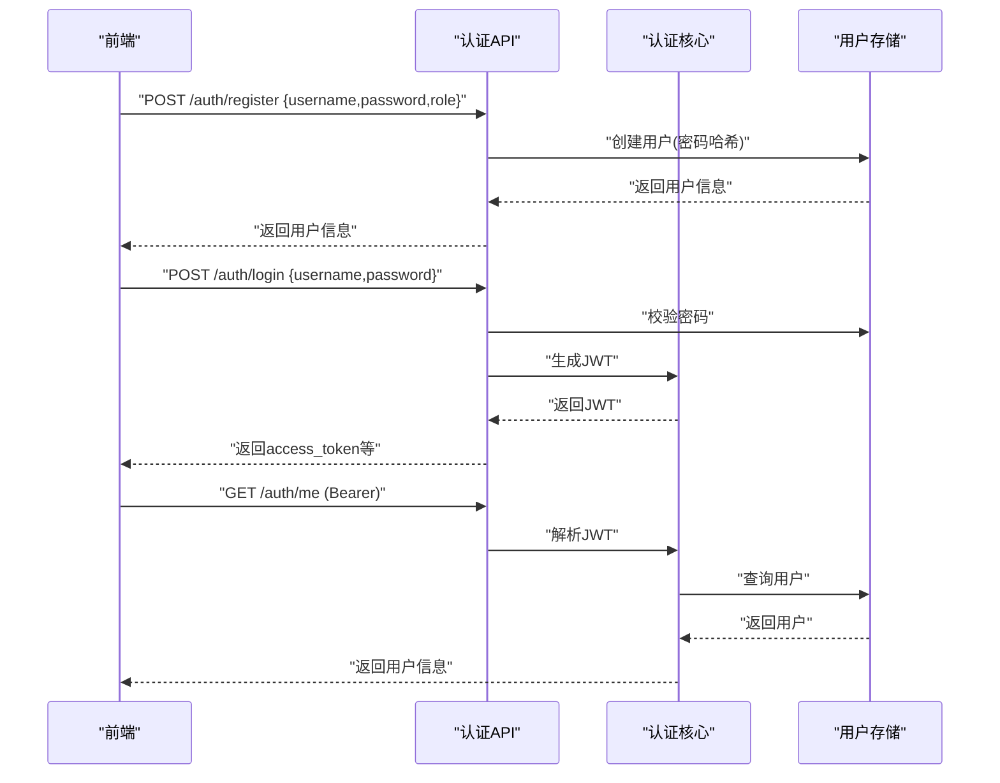
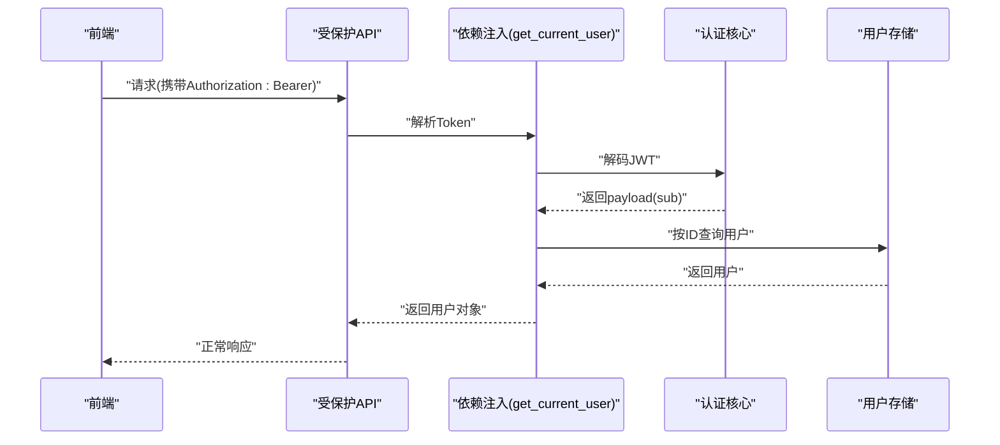
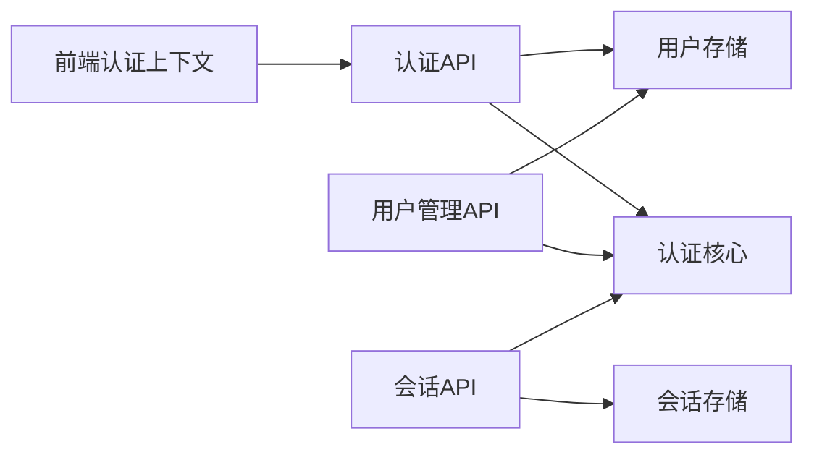

# 认证授权系统

<cite>
**本文档引用的文件**
- [backend/app/main.py](file://backend/app/main.py)
- [backend/app/api/auth.py](file://backend/app/api/auth.py)
- [backend/app/core/auth.py](file://backend/app/core/auth.py)
- [backend/app/storage/user_store.py](file://backend/app/storage/user_store.py)
- [backend/app/config.py](file://backend/app/config.py)
- [backend/app/api/users.py](file://backend/app/api/users.py)
- [backend/app/api/chat.py](file://backend/app/api/chat.py)
- [backend/app/api/sessions.py](file://backend/app/api/sessions.py)
- [backend/app/storage/session_store.py](file://backend/app/storage/session_store.py)
- [frontend/src/context/AuthContext.tsx](file://frontend/src/context/AuthContext.tsx)
</cite>

## 目录
1. [简介](#简介)
2. [项目结构](#项目结构)
3. [核心组件](#核心组件)
4. [架构总览](#架构总览)
5. [详细组件分析](#详细组件分析)
6. [依赖分析](#依赖分析)
7. [性能考虑](#性能考虑)
8. [故障排查指南](#故障排查指南)
9. [结论](#结论)
10. [附录](#附录)

## 简介
本文件面向“认证授权系统”的完整技术文档，聚焦以下目标：
- 详解基于 JWT 的认证流程：令牌生成、验证、刷新机制现状与扩展建议
- 权限控制模型：角色定义、权限分配、访问控制策略
- 用户认证生命周期：注册、登录、密码管理、会话管理
- 安全最佳实践：密码加密、令牌安全、CSRF/XSS 防护现状与改进建议
- API 认证方式：Bearer Token 使用、权限验证流程、错误处理机制
- 高级能力：用户角色管理、权限继承、动态权限控制的实现细节与扩展方向

## 项目结构
后端采用 FastAPI 架构，认证相关模块分布如下：
- 应用入口与路由挂载：[backend/app/main.py](file://backend/app/main.py)
- 认证 API：登录、注册、当前用户、修改密码
- 核心认证工具：JWT 生成与解码、FastAPI 依赖注入、管理员校验
- 用户存储：SQLite 用户表、密码哈希、用户 CRUD
- 配置：JWT 密钥、过期时长等
- 权限管理 API：用户列表、删除、角色变更（仅管理员）
- 会话 API：会话列表、详情、删除（受登录保护）
- 前端认证上下文：登录、登出、本地存储、Bearer 请求封装

图表来源
- [backend/app/main.py:1-76](file://backend/app/main.py#L1-L76)
- [backend/app/api/auth.py:1-108](file://backend/app/api/auth.py#L1-L108)
- [backend/app/core/auth.py:1-60](file://backend/app/core/auth.py#L1-L60)
- [backend/app/storage/user_store.py:1-133](file://backend/app/storage/user_store.py#L1-L133)
- [backend/app/config.py:1-75](file://backend/app/config.py#L1-L75)
- [backend/app/api/users.py:1-55](file://backend/app/api/users.py#L1-L55)
- [backend/app/api/chat.py:1-541](file://backend/app/api/chat.py#L1-L541)
- [backend/app/api/sessions.py:1-79](file://backend/app/api/sessions.py#L1-L79)
- [backend/app/storage/session_store.py:1-251](file://backend/app/storage/session_store.py#L1-L251)
- [frontend/src/context/AuthContext.tsx:1-106](file://frontend/src/context/AuthContext.tsx#L1-L106)

章节来源
- [backend/app/main.py:1-76](file://backend/app/main.py#L1-L76)

## 核心组件
- JWT 认证工具与依赖注入：提供令牌生成、解码、当前用户解析、管理员校验
- 用户存储与密码管理：SQLite 用户表、bcrypt 密码哈希、用户 CRUD
- 认证 API：登录、注册（仅管理员）、当前用户、修改密码
- 权限管理 API：用户列表、删除、角色变更（仅管理员）
- 会话 API：受登录保护的会话列表、详情、删除
- 前端认证上下文：登录、登出、本地存储、Bearer 请求封装

章节来源
- [backend/app/core/auth.py:1-60](file://backend/app/core/auth.py#L1-L60)
- [backend/app/storage/user_store.py:1-133](file://backend/app/storage/user_store.py#L1-L133)
- [backend/app/api/auth.py:1-108](file://backend/app/api/auth.py#L1-L108)
- [backend/app/api/users.py:1-55](file://backend/app/api/users.py#L1-L55)
- [backend/app/api/sessions.py:1-79](file://backend/app/api/sessions.py#L1-L79)
- [frontend/src/context/AuthContext.tsx:1-106](file://frontend/src/context/AuthContext.tsx#L1-L106)

## 架构总览
认证授权系统由“前端认证上下文 + 后端认证 API + 核心认证工具 + 用户存储 + 配置”构成。前端通过登录接口获取 JWT，后续请求在请求头中携带 Bearer Token；后端通过 FastAPI 依赖注入解析 Token，校验用户身份与角色。

图表来源
- [backend/app/api/auth.py:54-68](file://backend/app/api/auth.py#L54-L68)
- [backend/app/core/auth.py:19-25](file://backend/app/core/auth.py#L19-L25)
- [backend/app/storage/user_store.py:68-85](file://backend/app/storage/user_store.py#L68-L85)

## 详细组件分析

### JWT 认证流程与令牌管理
- 令牌生成
  - 使用 HS256 算法，密钥来自配置，过期时间可配置小时数
  - 生成时将用户标识写入 payload，设置过期时间
- 令牌验证
  - FastAPI 依赖注入使用 OAuth2PasswordBearer，从 Authorization 头解析 Bearer Token
  - 解码时校验算法与密钥，异常统一抛出 401
  - 解码成功后根据 sub 获取用户 ID，查询用户是否存在
- 令牌刷新机制
  - 当前实现未提供刷新令牌端点；建议引入短期 access_token + 长期 refresh_token 的双令牌模型，配合黑名单/白名单与过期策略

图表来源
- [backend/app/core/auth.py:19-36](file://backend/app/core/auth.py#L19-L36)
- [backend/app/core/auth.py:41-52](file://backend/app/core/auth.py#L41-L52)
- [backend/app/config.py:65-67](file://backend/app/config.py#L65-L67)

章节来源
- [backend/app/core/auth.py:1-60](file://backend/app/core/auth.py#L1-L60)
- [backend/app/config.py:65-67](file://backend/app/config.py#L65-L67)

### 权限控制模型与角色管理
- 角色定义
  - 支持两种角色：admin、user
- 权限分配
  - 管理员专用端点：注册用户、列出用户、删除用户、修改用户角色
  - 管理员校验依赖 require_admin，非管理员访问上述端点将被拒绝
- 访问控制策略
  - 会话 API：普通用户仅能查看自己的会话；管理员可查看全部
  - 修改密码：仅当前登录用户可操作
  - 注册：仅管理员可调用

图表来源
- [backend/app/api/users.py:23-54](file://backend/app/api/users.py#L23-L54)
- [backend/app/api/sessions.py:17-78](file://backend/app/api/sessions.py#L17-L78)
- [backend/app/core/auth.py:55-59](file://backend/app/core/auth.py#L55-L59)

章节来源
- [backend/app/api/users.py:1-55](file://backend/app/api/users.py#L1-L55)
- [backend/app/api/sessions.py:1-79](file://backend/app/api/sessions.py#L1-L79)
- [backend/app/core/auth.py:55-59](file://backend/app/core/auth.py#L55-L59)

### 用户认证生命周期
- 注册
  - 仅管理员可调用注册端点，角色限定为 admin 或 user
  - 密码经 bcrypt 哈希后存入数据库
- 登录
  - 提供 JSON 与表单两种登录方式
  - 成功后返回 access_token、用户角色、用户名与用户 ID
- 当前用户
  - 通过 Bearer Token 获取当前用户信息
- 修改密码
  - 需要提供旧密码校验，新密码长度至少 6 位
- 会话管理
  - 会话列表与详情受登录保护；非管理员仅能访问自己的会话

图表来源
- [backend/app/api/auth.py:81-94](file://backend/app/api/auth.py#L81-L94)
- [backend/app/api/auth.py:54-68](file://backend/app/api/auth.py#L54-L68)
- [backend/app/storage/user_store.py:48-65](file://backend/app/storage/user_store.py#L48-L65)
- [backend/app/core/auth.py:41-52](file://backend/app/core/auth.py#L41-L52)

章节来源
- [backend/app/api/auth.py:1-108](file://backend/app/api/auth.py#L1-L108)
- [backend/app/storage/user_store.py:1-133](file://backend/app/storage/user_store.py#L1-L133)

### API 认证方式与错误处理
- Bearer Token 使用
  - 前端通过 AuthContext 在每次请求中自动添加 Authorization: Bearer <token>
  - 后端使用 OAuth2PasswordBearer 与 HTTPBearer 依赖注入解析 Token
- 权限验证流程
  - get_current_user：解析 Token → 校验用户存在 → 返回用户对象
  - require_admin：在 get_current_user 基础上进一步校验角色
- 错误处理机制
  - Token 无效/过期：401 Unauthorized
  - 用户不存在：401 Unauthorized
  - 权限不足：403 Forbidden
  - 参数错误/业务异常：400 Bad Request 或 409 Conflict

图表来源
- [frontend/src/context/AuthContext.tsx:74-82](file://frontend/src/context/AuthContext.tsx#L74-L82)
- [backend/app/core/auth.py:41-52](file://backend/app/core/auth.py#L41-L52)
- [backend/app/api/chat.py:30-41](file://backend/app/api/chat.py#L30-L41)

章节来源
- [frontend/src/context/AuthContext.tsx:1-106](file://frontend/src/context/AuthContext.tsx#L1-L106)
- [backend/app/core/auth.py:12-12](file://backend/app/core/auth.py#L12-L12)
- [backend/app/api/chat.py:27-41](file://backend/app/api/chat.py#L27-L41)

### 高级功能与扩展建议
- 动态权限控制
  - 当前以角色为基础的静态权限控制；建议引入细粒度权限点与权限矩阵，结合用户组/资源域进行动态授权
- 权限继承
  - 可设计角色继承层次（如 admin > editor > user），在 require_admin 基础上扩展 require_editor 等中间层
- 会话与审计
  - 会话 API 已支持按用户过滤与权限校验；可扩展登录日志与操作审计
- 安全增强
  - CSRF/XSS 防护：后端未显式实现 CSRF 中间件；建议引入 CSRF Token 与 SameSite Cookie 策略；前端渲染应避免内联脚本与 DOM XSS
  - 令牌安全：建议启用 HTTPS、短令牌过期、刷新令牌、IP/UA 绑定与设备指纹

章节来源
- [backend/app/api/sessions.py:23-42](file://backend/app/api/sessions.py#L23-L42)
- [backend/app/api/users.py:23-54](file://backend/app/api/users.py#L23-L54)

## 依赖分析
- 组件耦合
  - 认证 API 依赖认证核心与用户存储
  - 权限管理 API 依赖认证核心与用户存储
  - 会话 API 依赖认证核心与会话存储
  - 前端认证上下文依赖认证 API
- 外部依赖
  - JWT 编解码、OAuth2 密码流、bcrypt 密码哈希
- 潜在循环依赖
  - 当前模块间为单向依赖，无明显循环

图表来源
- [backend/app/api/auth.py:8-14](file://backend/app/api/auth.py#L8-L14)
- [backend/app/api/users.py:6-7](file://backend/app/api/users.py#L6-L7)
- [backend/app/api/sessions.py:10-12](file://backend/app/api/sessions.py#L10-L12)
- [frontend/src/context/AuthContext.tsx:3-3](file://frontend/src/context/AuthContext.tsx#L3-L3)

章节来源
- [backend/app/api/auth.py:1-108](file://backend/app/api/auth.py#L1-L108)
- [backend/app/api/users.py:1-55](file://backend/app/api/users.py#L1-L55)
- [backend/app/api/sessions.py:1-79](file://backend/app/api/sessions.py#L1-L79)
- [frontend/src/context/AuthContext.tsx:1-106](file://frontend/src/context/AuthContext.tsx#L1-L106)

## 性能考虑
- JWT 解码与用户查询
  - 解码为 O(1)，用户查询为 SQLite 查询；建议在用户表建立索引（如 id、username）
- 密码哈希成本
  - bcrypt 默认成本较高，注意注册/登录延迟；可在生产环境调整成本因子
- 令牌过期策略
  - 短令牌 + 刷新令牌可减少频繁登录，但需权衡安全与体验

## 故障排查指南
- 登录失败
  - 检查用户名/密码是否正确；确认用户是否存在且密码哈希匹配
- 401 未授权
  - 确认请求头是否包含正确的 Authorization: Bearer <token>
  - 检查 JWT 密钥与算法配置是否一致
- 403 禁止访问
  - 管理员端点需管理员角色；确认当前用户角色
- 404 会话不存在
  - 确认会话 ID 正确；检查是否越权访问他人会话

章节来源
- [backend/app/api/auth.py:57-61](file://backend/app/api/auth.py#L57-L61)
- [backend/app/core/auth.py:32-36](file://backend/app/core/auth.py#L32-L36)
- [backend/app/api/sessions.py:36-42](file://backend/app/api/sessions.py#L36-L42)

## 结论
该认证授权系统以 JWT 为核心，结合 FastAPI 依赖注入实现了基础的登录、注册、当前用户与密码管理，并通过角色驱动的权限控制保障了管理员专属功能的安全访问。当前实现简洁可靠，适合中小型应用场景；对于更高安全与灵活性需求，建议引入刷新令牌、动态权限、CSRF/XSS 防护与更完善的审计体系。

## 附录
- 配置项参考
  - JWT 密钥与过期时长：见配置文件对应字段
- 前端使用要点
  - 登录成功后将 token 与用户信息写入本地存储；后续请求通过 authFetch 自动添加 Bearer 头

章节来源
- [backend/app/config.py:65-67](file://backend/app/config.py#L65-L67)
- [frontend/src/context/AuthContext.tsx:44-82](file://frontend/src/context/AuthContext.tsx#L44-L82)