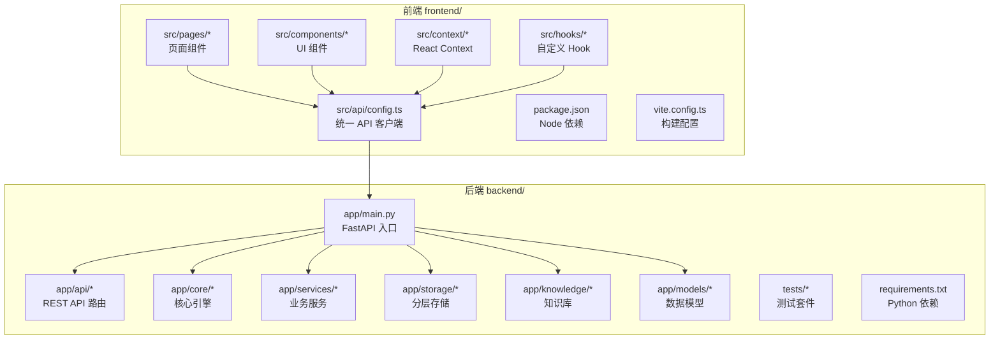
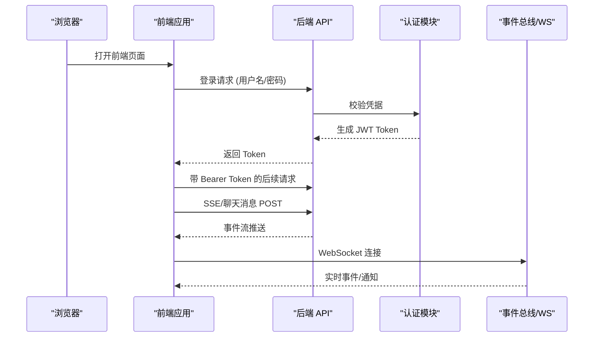
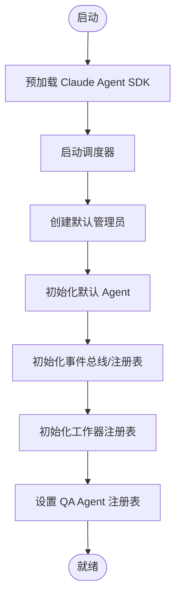

# 快速开始

<cite>
**本文引用的文件**
- [README.md](file://README.md)
- [后端api.md](file://后端api.md)
- [backend/app/main.py](file://backend/app/main.py)
- [frontend/src/pages/LoginPage.tsx](file://frontend/src/pages/LoginPage.tsx)
- [frontend/src/components/config/ModelEditModal.tsx](file://frontend/src/components/config/ModelEditModal.tsx)
- [backend/requirements.txt](file://backend/requirements.txt)
- [frontend/package.json](file://frontend/package.json)
- [frontend/vite.config.ts](file://frontend/vite.config.ts)
- [后端变更路线图.md](file://后端变更路线图.md)
- [前后端api交互.md](file://前后端api交互.md)
</cite>

## 目录
1. [简介](#简介)
2. [项目结构](#项目结构)
3. [核心组件](#核心组件)
4. [架构概览](#架构概览)
5. [详细组件分析](#详细组件分析)
6. [依赖分析](#依赖分析)
7. [性能考虑](#性能考虑)
8. [故障排除指南](#故障排除指南)
9. [结论](#结论)
10. [附录](#附录)

## 简介
本指南面向新开发者，帮助你在最短时间内成功运行避风港项目。你将获得完整的环境准备说明、后端与前端的安装步骤、环境变量配置方法、服务启动命令、默认账号信息以及常见问题排查建议。项目采用前后端分离架构：后端基于 Python 的 FastAPI，前端基于 Vite + React。

## 项目结构
- 后端位于 backend/，包含 FastAPI 应用入口、API 路由、核心引擎、服务层、存储层、知识库与测试等模块。
- 前端位于 frontend/，包含页面组件、UI 组件、上下文、自定义 Hook 与统一 API 客户端。
- 顶层 README 提供了目录结构与快速启动指引；.env.example 为环境变量模板。

图表来源
- [README.md:37-64](file://README.md#L37-L64)
- [backend/app/main.py:139-171](file://backend/app/main.py#L139-L171)
- [frontend/src/api/config.ts](file://frontend/src/api/config.ts)

章节来源
- [README.md:37-64](file://README.md#L37-L64)

## 核心组件
- 后端入口与生命周期：后端通过 FastAPI 入口在启动时进行 SDK 预加载、调度器启动、默认管理员与 Agent 初始化、事件总线与工作器注册表、QA Agent 与主动引擎等初始化。
- 前端登录页：内置默认账号 admin/admin123，便于首次登录验证。
- API 客户端：前端通过统一 API 客户端发起请求，支持页面加载、表单提交、删除、开关/状态变更、聊天消息（SSE）、实时事件推送（WebSocket）与定时任务等交互流程。

章节来源
- [后端api.md:26-59](file://后端api.md#L26-L59)
- [backend/app/main.py:139-171](file://backend/app/main.py#L139-L171)
- [frontend/src/pages/LoginPage.tsx:70-89](file://frontend/src/pages/LoginPage.tsx#L70-L89)
- [前后端api交互.md:645-678](file://前后端api交互.md#L645-L678)

## 架构概览
下图展示了前端与后端的关键交互路径，包括登录认证、API 请求、SSE 流式响应与 WebSocket 实时推送。

图表来源
- [后端api.md:48-59](file://后端api.md#L48-L59)
- [前后端api交互.md:645-678](file://前后端api交互.md#L645-L678)

## 详细组件分析

### 后端启动与初始化流程
- 启动时序：后端在 startup 事件中完成 SDK 预加载、调度器启动、默认管理员与 Agent 初始化、事件总线与工作器注册表、QA Agent 设置与主动引擎等。
- 默认管理员：若数据库中无管理员，则自动创建默认管理员账户。
- 默认 Agent：初始化多个默认 Agent 配置，便于系统即开即用。

图表来源
- [backend/app/main.py:139-171](file://backend/app/main.py#L139-L171)

章节来源
- [后端api.md:26-59](file://后端api.md#L26-L59)
- [backend/app/main.py:139-171](file://backend/app/main.py#L139-L171)

### 前端登录与默认账号
- 默认账号：admin/admin123，可在登录页看到提示。
- 登录流程：前端通过统一 API 客户端调用后端认证接口，获取 JWT Token 并在后续请求中携带 Authorization: Bearer <token>。

章节来源
- [frontend/src/pages/LoginPage.tsx:70-89](file://frontend/src/pages/LoginPage.tsx#L70-L89)
- [后端api.md:48-59](file://后端api.md#L48-L59)

### API 客户端与交互模式
- 统一 API 客户端：前端通过 src/api/config.ts 统一发起请求，覆盖页面加载、表单提交、删除、开关/状态变更、聊天消息（SSE）、实时事件推送（WebSocket）与定时任务等场景。
- 交互数据流：页面加载 → API 请求 → 状态更新；新建/编辑 → API 提交 → 成功后刷新；删除 → API 删除 → 刷新列表；开关/状态变更 → API 更新 → 刷新列表；聊天消息 → SSE → 逐事件渲染；实时事件 → WebSocket → 通知/Toast；定时任务 → API 加载/暂停/恢复 → 调度器控制。

章节来源
- [前后端api交互.md:645-678](file://前后端api交互.md#L645-L678)

### 环境变量与模型配置
- 环境变量模板：顶层 .env.example 提供示例，后端通过 requirements.txt 安装依赖，前端通过 package.json 管理 Node 依赖。
- 模型配置：前端模型编辑弹窗支持选择供应商、输入模型名称、API Key 环境变量与 Base URL 等字段，便于对接不同大模型服务。

章节来源
- [README.md:68-90](file://README.md#L68-L90)
- [frontend/src/components/config/ModelEditModal.tsx:104-135](file://frontend/src/components/config/ModelEditModal.tsx#L104-L135)

## 依赖分析
- Python 依赖：后端通过 requirements.txt 管理，建议在虚拟环境中安装。
- Node 依赖：前端通过 package.json 管理，建议使用 Node.js 18+。
- 可选 ChromaDB：作为向量数据库实例可选启用，用于增强检索增强生成（RAG）能力。

章节来源
- [backend/requirements.txt](file://backend/requirements.txt)
- [frontend/package.json](file://frontend/package.json)
- [README.md:70-75](file://README.md#L70-L75)

## 性能考虑
- 启动优化：后端在 startup 中预加载 Claude Agent SDK，尽早暴露导入/配置问题，避免首次请求才报错。
- 调度器：启动时初始化 APScheduler，用于定时任务与周期性操作。
- SSE 与 WebSocket：聊天消息与实时事件推送采用流式与长连接，注意网络与资源占用。

章节来源
- [后端api.md:26-59](file://后端api.md#L26-L59)
- [前后端api交互.md:645-678](file://前后端api交互.md#L645-L678)

## 故障排除指南
- 端口冲突
  - 现象：启动后端或前端时报端口被占用。
  - 处理：修改后端默认端口 8001 或前端默认端口（Vite 默认端口通常为 5173），或释放占用端口。
  - 参考：后端启动命令与端口配置见“快速启动”部分。
- 依赖安装失败
  - 现象：pip 安装 Python 依赖失败或 Node 安装依赖失败。
  - 处理：确保 Python 3.13+ 与 Node.js 18+；在虚拟环境中安装；检查网络与代理；必要时升级 pip 与 npm。
- 环境变量缺失
  - 现象：后端启动时报缺少 API Key 或其他配置。
  - 处理：复制 .env.example 为 .env，并按需填写 OPENROUTER_API_KEY 等关键配置。
- 默认管理员未创建
  - 现象：首次登录无管理员账户。
  - 处理：后端启动时会自动创建默认管理员；若未出现，请检查数据库初始化与日志输出。
- 登录失败
  - 现象：使用 admin/admin123 登录失败。
  - 处理：确认后端已启动且默认管理员已创建；检查前端是否正确携带 Authorization: Bearer <token>；核对后端认证接口返回。
- API 文档不可用
  - 现象：访问 http://localhost:8001/docs 报 404。
  - 处理：确认后端已启动；Swagger UI 仅在开发模式可用；检查路由与中间件配置。
- 前端无法访问后端
  - 现象：前端 404 或跨域错误。
  - 处理：确认后端监听 0.0.0.0 并允许外网访问；检查 CORS 配置；确认前端 API 地址指向后端。

章节来源
- [README.md:68-90](file://README.md#L68-L90)
- [后端api.md:26-59](file://后端api.md#L26-L59)
- [backend/app/main.py:139-171](file://backend/app/main.py#L139-L171)
- [frontend/src/pages/LoginPage.tsx:70-89](file://frontend/src/pages/LoginPage.tsx#L70-L89)

## 结论
按照本指南完成环境准备、依赖安装、环境变量配置与服务启动后，你将可以访问前端页面与后端 API，并使用默认管理员账号登录系统。如遇问题，可参考故障排除指南逐步定位与解决。建议在开发过程中关注后端启动日志与前端控制台输出，以便快速发现并解决问题。

## 附录

### 快速启动步骤
- 环境准备
  - Python 3.13+
  - Node.js 18+
  - （可选）ChromaDB 实例
- 后端
  - 进入 backend 目录，安装依赖并启动服务（默认端口 8001）。
  - 复制 .env.example 为 .env，并按需填写环境变量。
- 前端
  - 进入 frontend 目录，安装依赖并启动开发服务器（默认端口 5173）。
- 访问地址
  - 前端页面：http://localhost:5173
  - 后端 API：http://localhost:8001/api/v1
  - API 文档：http://localhost:8001/docs
- 默认账号
  - 用户名：admin
  - 密码：admin123

章节来源
- [README.md:68-90](file://README.md#L68-L90)