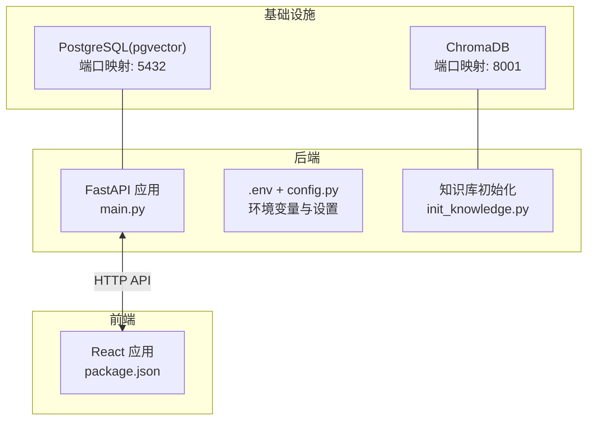
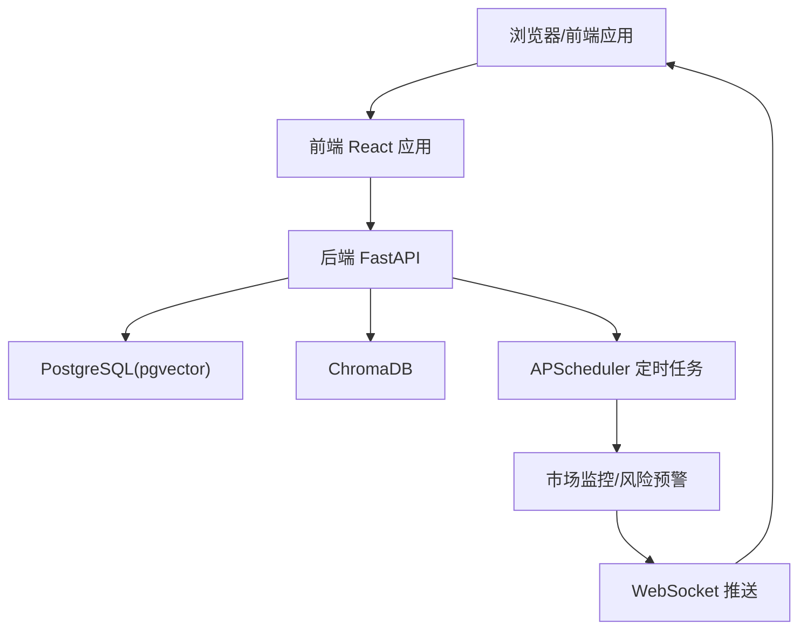
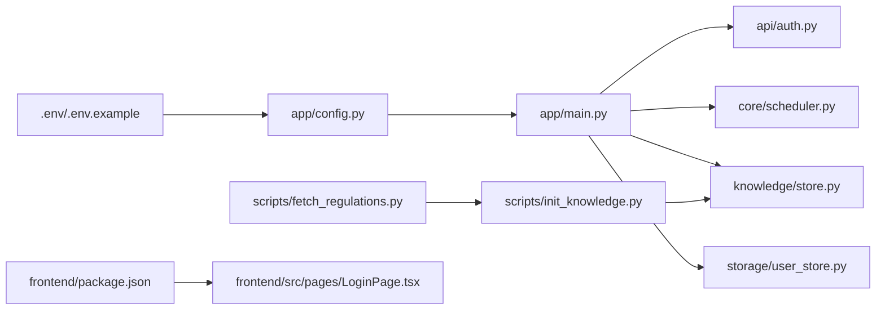

# 快速开始

<cite>
**本文引用的文件**
- [README.md](file://README.md)
- [docker-compose.yml](file://docker-compose.yml)
- [.env.example](file://.env.example)
- [backend/requirements.txt](file://backend/requirements.txt)
- [backend/app/config.py](file://backend/app/config.py)
- [backend/app/main.py](file://backend/app/main.py)
- [backend/scripts/init_knowledge.py](file://backend/scripts/init_knowledge.py)
- [backend/scripts/fetch_regulations.py](file://backend/scripts/fetch_regulations.py)
- [backend/app/api/auth.py](file://backend/app/api/auth.py)
- [backend/app/storage/user_store.py](file://backend/app/storage/user_store.py)
- [backend/app/knowledge/store.py](file://backend/app/knowledge/store.py)
- [backend/app/core/scheduler.py](file://backend/app/core/scheduler.py)
- [frontend/package.json](file://frontend/package.json)
- [frontend/src/pages/LoginPage.tsx](file://frontend/src/pages/LoginPage.tsx)
- [DEVELOPMENT_PLAN.md](file://DEVELOPMENT_PLAN.md)
</cite>

## 目录
1. [简介](#简介)
2. [项目结构](#项目结构)
3. [核心组件](#核心组件)
4. [架构总览](#架构总览)
5. [详细组件分析](#详细组件分析)
6. [依赖关系分析](#依赖关系分析)
7. [性能考虑](#性能考虑)
8. [故障排除指南](#故障排除指南)
9. [结论](#结论)
10. [附录](#附录)

## 简介
本指南面向首次接触“避风港”项目的用户，帮助你在约 30 分钟内完成从基础设施到前后端启动的全流程部署，并进行健康检查与基本功能验证。你将学到：
- 如何使用 Docker Compose 启动数据库与向量库
- 如何配置后端环境变量（尤其是 OPENROUTER_API_KEY、CODEX_API_KEY 等）
- 如何安装后端依赖并初始化知识库
- 如何启动后端 FastAPI 与前端 React 应用
- 如何进行健康检查与基本功能验证
- 首次登录默认凭证与安全建议
- 常见问题与故障排除方法

## 项目结构
项目采用前后端分离架构，后端基于 FastAPI，前端基于 React + TypeScript + Vite，基础设施通过 Docker Compose 编排。

图表来源
- [docker-compose.yml:1-31](file://docker-compose.yml#L1-L31)
- [backend/app/main.py:1-76](file://backend/app/main.py#L1-L76)
- [backend/app/config.py:1-75](file://backend/app/config.py#L1-L75)
- [backend/scripts/init_knowledge.py:1-129](file://backend/scripts/init_knowledge.py#L1-129)
- [frontend/package.json:1-22](file://frontend/package.json#L1-22)

章节来源
- [README.md:92-200](file://README.md#L92-L200)
- [docker-compose.yml:1-31](file://docker-compose.yml#L1-L31)
- [backend/app/main.py:1-76](file://backend/app/main.py#L1-L76)
- [backend/app/config.py:1-75](file://backend/app/config.py#L1-L75)
- [frontend/package.json:1-22](file://frontend/package.json#L1-22)

## 核心组件
- 基础设施
  - PostgreSQL(pgvector)：持久化存储用户、会话、模型配置等数据
  - ChromaDB：本地向量数据库，存放合规知识库
- 后端
  - FastAPI 应用入口与路由注册、健康检查、WebSocket 实时推送
  - 配置管理：支持从 .env 读取环境变量，覆盖默认值
  - 知识库初始化：加载法规文档、分块、向量化并写入 ChromaDB
- 前端
  - React + TypeScript + Vite，提供登录页、聊天面板、合规报告卡片等页面
  - 默认登录凭据：admin / admin123（首次登录后请立即修改密码）

章节来源
- [backend/app/main.py:1-76](file://backend/app/main.py#L1-L76)
- [backend/app/config.py:1-75](file://backend/app/config.py#L1-L75)
- [backend/scripts/init_knowledge.py:1-129](file://backend/scripts/init_knowledge.py#L1-129)
- [frontend/src/pages/LoginPage.tsx:147-150](file://frontend/src/pages/LoginPage.tsx#L147-L150)

## 架构总览
下图展示了从浏览器到后端 API、数据库与向量库的整体交互路径。

图表来源
- [backend/app/main.py:1-76](file://backend/app/main.py#L1-L76)
- [backend/app/core/scheduler.py:1-152](file://backend/app/core/scheduler.py#L1-152)
- [backend/app/knowledge/store.py:1-227](file://backend/app/knowledge/store.py#L1-227)

## 详细组件分析

### 基础设施启动（Docker Compose）
- 目标：启动 PostgreSQL 与 ChromaDB，并暴露必要端口
- 步骤
  - 在仓库根目录执行：docker compose up -d
  - 验证：docker compose ps 显示 db 与 chroma 服务处于 running 状态
- 端口映射
  - PostgreSQL: 5432 → 5432
  - ChromaDB: 8001 → 8000
- 健康检查
  - PostgreSQL 提供健康检查命令，便于 CI/CD 或运维监控

章节来源
- [README.md:35-40](file://README.md#L35-L40)
- [docker-compose.yml:1-31](file://docker-compose.yml#L1-L31)

### 环境变量配置
- 目标：为后端提供必要的 API Key 与运行参数
- 步骤
  - 进入 backend 目录，复制示例环境文件：cp ../.env.example .env
  - 编辑 .env，填写以下关键项：
    - DATABASE_URL：数据库连接串（默认已提供）
    - OPENROUTER_API_KEY：用于嵌入与推理的第三方 API Key
    - OPENROUTER_BASE_URL：第三方推理平台地址（默认已提供）
    - LLM_MODEL：主模型名称（如 qwen/qwen-2.5-72b-instruct）
    - DEBUG：调试模式开关
- 重要说明
  - 若你使用自有 LLM，可设置 llm_api_key 与 llm_base_url 以覆盖 OPENROUTER 配置
  - 项目默认提供 codex_enabled、codex_model、codex_search_model 等 Agent 相关配置，可在 .env 中按需调整

章节来源
- [README.md:41-47](file://README.md#L41-L47)
- [.env.example:1-6](file://.env.example#L1-L6)
- [backend/app/config.py:1-75](file://backend/app/config.py#L1-L75)

### 后端依赖安装
- 目标：安装 Python 依赖，确保后端可正常运行
- 步骤
  - 进入 backend 目录，执行：pip install -r requirements.txt
- 依赖要点
  - FastAPI、Uvicorn、Pydantic、SQLAlchemy、asyncpg、chromadb、langchain、openai、pytest、apscheduler、pyyaml、codex-client 等

章节来源
- [README.md:49-54](file://README.md#L49-L54)
- [backend/requirements.txt:1-27](file://backend/requirements.txt#L1-27)

### 知识库初始化
- 目标：将合规法规文档加载到 ChromaDB，以便 RAG 检索
- 步骤
  - 进入 backend 目录，执行：python scripts/init_knowledge.py
  - 可选参数
    - --all-markets：初始化所有市场（eu/de/us/jp/kr）
    - --market CODE：指定市场（如 eu de）
    - --reset：清空后重建
    - --dry-run：预览分块，不写入
    - --fetch：先下载官方法规文档再初始化
- 数据流
  - data/regulations/{market}/*.md → 分块 → 向量化 → 写入 ChromaDB（按市场分 collection）

章节来源
- [README.md:56-61](file://README.md#L56-L61)
- [backend/scripts/init_knowledge.py:1-129](file://backend/scripts/init_knowledge.py#L1-129)
- [backend/scripts/fetch_regulations.py:1-200](file://backend/scripts/fetch_regulations.py#L1-200)
- [backend/app/knowledge/store.py:1-227](file://backend/app/knowledge/store.py#L1-227)

### 后端启动
- 目标：启动 FastAPI 应用，提供 API 与健康检查
- 步骤
  - 进入 backend 目录，执行：uvicorn app.main:app --reload --port 8000
- 关键特性
  - CORS 配置允许前端访问
  - /api/v1/health 健康检查端点
  - /api/v1/ws WebSocket 实时推送
  - 应用启动时自动初始化调度器、默认管理员、默认模型配置与 Agent

章节来源
- [README.md:63-68](file://README.md#L63-L68)
- [backend/app/main.py:1-76](file://backend/app/main.py#L1-L76)
- [backend/app/config.py:1-75](file://backend/app/config.py#L1-L75)

### 前端启动
- 目标：启动前端开发服务器，访问 http://localhost:5173
- 步骤
  - 进入 frontend 目录，执行：npm install && npm run dev
- 依赖要点
  - React 19、TypeScript、Vite、@vitejs/plugin-react

章节来源
- [README.md:70-76](file://README.md#L70-L76)
- [frontend/package.json:1-22](file://frontend/package.json#L1-22)

### 首次登录与安全建议
- 默认凭证
  - 用户名：admin
  - 密码：admin123
- 安全建议
  - 首次登录后立即修改密码
  - 生产环境务必更换 jwt_secret 并设置更严格的密钥管理策略
  - 限制开放域与端口，仅在受信网络内暴露服务

章节来源
- [README.md](file://README.md#L78)
- [frontend/src/pages/LoginPage.tsx:147-150](file://frontend/src/pages/LoginPage.tsx#L147-L150)
- [backend/app/storage/user_store.py:122-133](file://backend/app/storage/user_store.py#L122-L133)

### 健康检查与基本功能验证
- 健康检查
  - 访问：http://localhost:8000/api/v1/health
  - 返回：{"status":"ok","service":"astra","version":"0.2.0"}
- 功能验证
  - 登录后进入聊天界面，输入示例问题（如“LED灯出口德国需要注意什么”），查看合规报告是否返回
  - 检查 WebSocket 是否能接收风险预警推送（需要先触发一次扫描）

章节来源
- [backend/app/main.py:33-35](file://backend/app/main.py#L33-L35)
- [backend/app/api/auth.py:54-68](file://backend/app/api/auth.py#L54-L68)

## 依赖关系分析

图表来源
- [backend/app/config.py:1-75](file://backend/app/config.py#L1-L75)
- [backend/app/main.py:1-76](file://backend/app/main.py#L1-L76)
- [backend/app/api/auth.py:1-108](file://backend/app/api/auth.py#L1-108)
- [backend/app/core/scheduler.py:1-152](file://backend/app/core/scheduler.py#L1-152)
- [backend/app/knowledge/store.py:1-227](file://backend/app/knowledge/store.py#L1-227)
- [backend/scripts/init_knowledge.py:1-129](file://backend/scripts/init_knowledge.py#L1-129)
- [backend/scripts/fetch_regulations.py:1-200](file://backend/scripts/fetch_regulations.py#L1-200)
- [backend/app/storage/user_store.py:1-133](file://backend/app/storage/user_store.py#L1-133)
- [frontend/package.json:1-22](file://frontend/package.json#L1-22)
- [frontend/src/pages/LoginPage.tsx:1-154](file://frontend/src/pages/LoginPage.tsx#L1-154)

章节来源
- [backend/app/config.py:1-75](file://backend/app/config.py#L1-L75)
- [backend/app/main.py:1-76](file://backend/app/main.py#L1-L76)
- [backend/app/api/auth.py:1-108](file://backend/app/api/auth.py#L1-108)
- [backend/app/core/scheduler.py:1-152](file://backend/app/core/scheduler.py#L1-152)
- [backend/app/knowledge/store.py:1-227](file://backend/app/knowledge/store.py#L1-227)
- [backend/scripts/init_knowledge.py:1-129](file://backend/scripts/init_knowledge.py#L1-129)
- [backend/scripts/fetch_regulations.py:1-200](file://backend/scripts/fetch_regulations.py#L1-200)
- [backend/app/storage/user_store.py:1-133](file://backend/app/storage/user_store.py#L1-133)
- [frontend/package.json:1-22](file://frontend/package.json#L1-22)
- [frontend/src/pages/LoginPage.tsx:1-154](file://frontend/src/pages/LoginPage.tsx#L1-154)

## 性能考虑
- 向量模型懒加载：ChromaDB 的嵌入模型在首次使用时才加载，避免启动时下载，提升冷启动速度
- 懒初始化客户端：ChromaDB PersistentClient 仅在需要时创建，减少资源占用
- 调度器间隔：默认每 60 分钟轮询市场，可根据实际需求调整轮询间隔
- 前端开发模式：使用 Vite 的热更新与按需编译，提升开发体验

章节来源
- [backend/app/knowledge/store.py:31-40](file://backend/app/knowledge/store.py#L31-L40)
- [backend/app/knowledge/store.py:43-51](file://backend/app/knowledge/store.py#L43-L51)
- [backend/app/core/scheduler.py:35-48](file://backend/app/core/scheduler.py#L35-L48)

## 故障排除指南
- Docker Compose 启动失败
  - 检查端口占用（5432、8001），释放冲突端口
  - 确认 docker 服务正常运行
- 数据库连接失败
  - 检查 DATABASE_URL 是否正确（默认已提供）
  - 确认 PostgreSQL 已就绪并通过健康检查
- 知识库初始化报错
  - 确保 data/regulations/{market} 下存在文档
  - 使用 --fetch 先下载官方法规文档
  - 使用 --reset 清空后重建
- LLM API Key 无效
  - 检查 OPENROUTER_API_KEY 是否正确
  - 如使用自有 LLM，设置 llm_api_key 与 llm_base_url
- 前端无法访问后端 API
  - 确认 CORS 配置允许 http://localhost:5173
  - 检查后端是否监听 8000 端口
- 首次登录失败
  - 确认默认管理员 admin/admin123 是否创建成功
  - 修改密码后再次尝试登录

章节来源
- [docker-compose.yml:14-18](file://docker-compose.yml#L14-L18)
- [backend/app/config.py](file://backend/app/config.py#L18)
- [backend/scripts/init_knowledge.py:34-38](file://backend/scripts/init_knowledge.py#L34-L38)
- [backend/app/main.py:13-19](file://backend/app/main.py#L13-L19)
- [backend/app/storage/user_store.py:122-133](file://backend/app/storage/user_store.py#L122-L133)

## 结论
按照本指南，你可以在约 30 分钟内完成“避风港”项目的环境搭建与启动。建议在生产环境中进一步完善密钥管理、网络访问控制与日志审计，以保障系统的安全性与稳定性。

## 附录

### 快速命令清单
- 启动基础设施：docker compose up -d
- 配置环境变量：cp ../.env.example .env；编辑 .env
- 安装后端依赖：pip install -r requirements.txt
- 初始化知识库：python scripts/init_knowledge.py
- 启动后端：uvicorn app.main:app --reload --port 8000
- 启动前端：npm install && npm run dev
- 健康检查：访问 http://localhost:8000/api/v1/health
- 首次登录：admin / admin123（登录后立即修改密码）

章节来源
- [README.md:33-86](file://README.md#L33-L86)