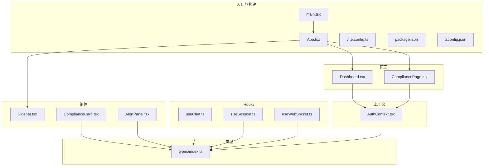
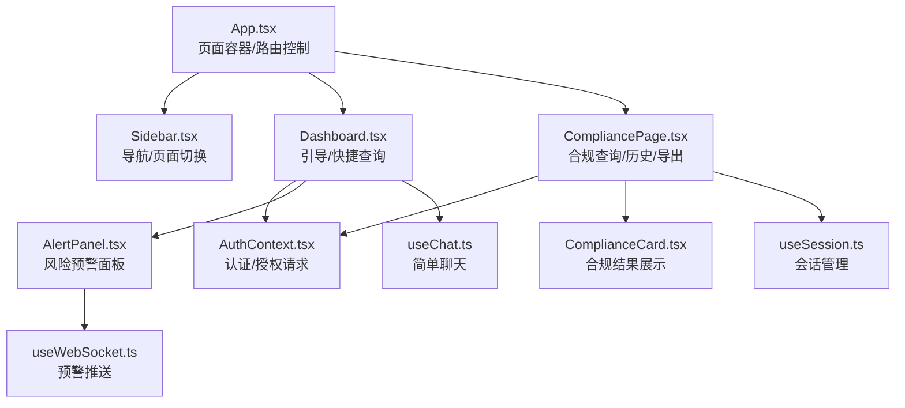
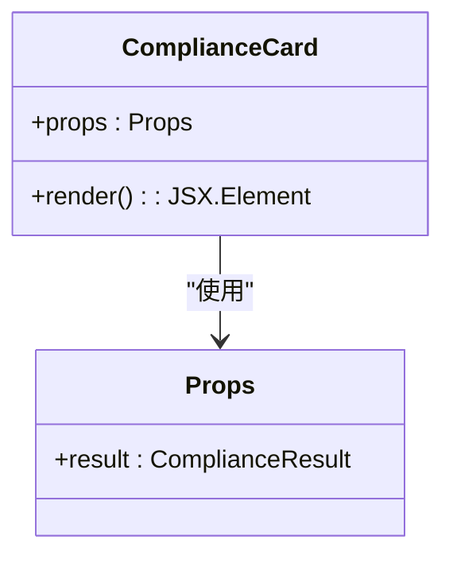
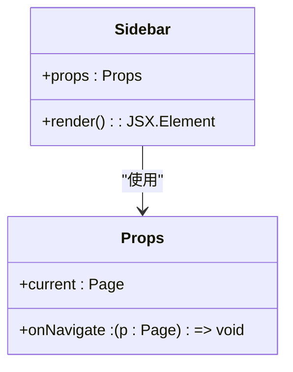
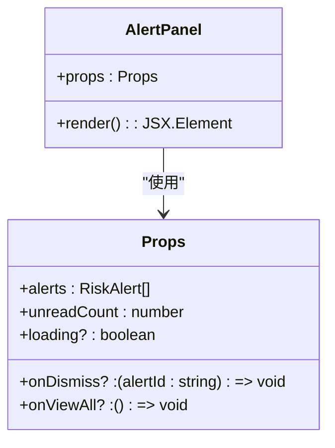
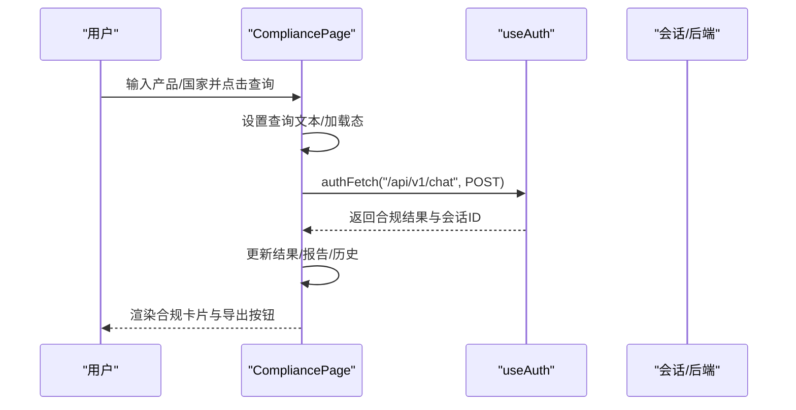
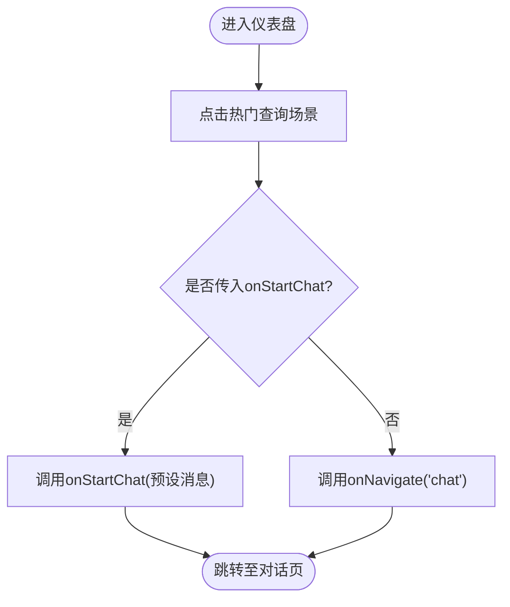
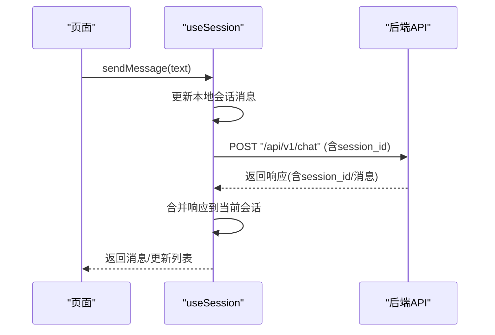
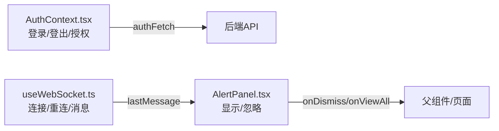
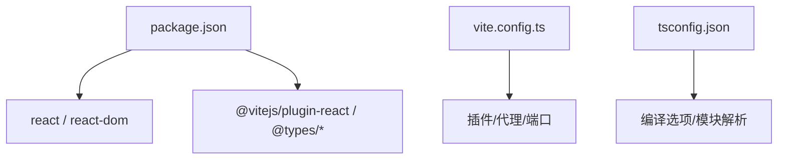

# UI组件扩展

<cite>
**本文引用的文件**
- [frontend/src/App.tsx](file://frontend/src/App.tsx)
- [frontend/src/main.tsx](file://frontend/src/main.tsx)
- [frontend/package.json](file://frontend/package.json)
- [frontend/vite.config.ts](file://frontend/vite.config.ts)
- [frontend/tsconfig.json](file://frontend/tsconfig.json)
- [frontend/src/components/ComplianceCard.tsx](file://frontend/src/components/ComplianceCard.tsx)
- [frontend/src/components/Sidebar.tsx](file://frontend/src/components/Sidebar.tsx)
- [frontend/src/context/AuthContext.tsx](file://frontend/src/context/AuthContext.tsx)
- [frontend/src/hooks/useChat.ts](file://frontend/src/hooks/useChat.ts)
- [frontend/src/hooks/useSession.ts](file://frontend/src/hooks/useSession.ts)
- [frontend/src/hooks/useWebSocket.ts](file://frontend/src/hooks/useWebSocket.ts)
- [frontend/src/pages/CompliancePage.tsx](file://frontend/src/pages/CompliancePage.tsx)
- [frontend/src/pages/Dashboard.tsx](file://frontend/src/pages/Dashboard.tsx)
- [frontend/src/components/AlertPanel.tsx](file://frontend/src/components/AlertPanel.tsx)
- [frontend/src/types/index.ts](file://frontend/src/types/index.ts)
</cite>

## 目录
1. [简介](#简介)
2. [项目结构](#项目结构)
3. [核心组件](#核心组件)
4. [架构总览](#架构总览)
5. [详细组件分析](#详细组件分析)
6. [依赖关系分析](#依赖关系分析)
7. [性能考量](#性能考量)
8. [故障排查指南](#故障排查指南)
9. [结论](#结论)
10. [附录](#附录)

## 简介
本指南面向希望在现有前端代码库基础上进行UI组件扩展与定制的开发者。内容涵盖：
- React组件设计原则、属性定义与事件处理
- 页面组件开发流程（路由配置、状态管理、数据绑定）
- 现有组件的定制化方法（样式覆盖、功能增强、交互改进）
- Hook扩展开发（自定义Hook设计模式与复用策略）
- 组件间数据传递与通信机制（Context、事件系统、状态共享）
- 响应式设计与移动端适配最佳实践
- UI组件测试方法（单元测试、集成测试、用户交互测试）
- 实际扩展示例（合规卡片、图表组件、表单控件等）
- 组件打包、发布与版本管理策略

## 项目结构
前端采用Vite + React 19 + TypeScript构建，目录组织以“按功能域”为主：
- src/components：可复用UI组件（如合规卡片、侧边栏、告警面板）
- src/pages：页面级组件（仪表盘、合规查询、聊天、风险中心等）
- src/hooks：自定义Hook（会话、聊天、WebSocket）
- src/context：全局状态（认证上下文）
- src/types：TypeScript类型定义
- 其他：入口、构建配置、包管理与类型配置

**图示来源**
- [frontend/src/main.tsx:1-9](file://frontend/src/main.tsx#L1-L9)
- [frontend/src/App.tsx:1-75](file://frontend/src/App.tsx#L1-L75)
- [frontend/src/components/Sidebar.tsx:1-182](file://frontend/src/components/Sidebar.tsx#L1-L182)
- [frontend/src/pages/Dashboard.tsx:1-429](file://frontend/src/pages/Dashboard.tsx#L1-L429)
- [frontend/src/pages/CompliancePage.tsx:1-655](file://frontend/src/pages/CompliancePage.tsx#L1-L655)
- [frontend/src/components/ComplianceCard.tsx:1-141](file://frontend/src/components/ComplianceCard.tsx#L1-L141)
- [frontend/src/components/AlertPanel.tsx:1-167](file://frontend/src/components/AlertPanel.tsx#L1-L167)
- [frontend/src/hooks/useChat.ts:1-61](file://frontend/src/hooks/useChat.ts#L1-L61)
- [frontend/src/hooks/useSession.ts:1-162](file://frontend/src/hooks/useSession.ts#L1-L162)
- [frontend/src/hooks/useWebSocket.ts:1-68](file://frontend/src/hooks/useWebSocket.ts#L1-L68)
- [frontend/src/context/AuthContext.tsx:1-106](file://frontend/src/context/AuthContext.tsx#L1-L106)
- [frontend/src/types/index.ts:1-305](file://frontend/src/types/index.ts#L1-L305)

**章节来源**
- [frontend/src/main.tsx:1-9](file://frontend/src/main.tsx#L1-L9)
- [frontend/src/App.tsx:1-75](file://frontend/src/App.tsx#L1-L75)
- [frontend/vite.config.ts:1-15](file://frontend/vite.config.ts#L1-L15)
- [frontend/package.json:1-22](file://frontend/package.json#L1-L22)
- [frontend/tsconfig.json:1-20](file://frontend/tsconfig.json#L1-L20)

## 核心组件
- 应用入口与路由容器：通过App.tsx集中管理当前页面与导航；页面切换通过Sidebar触发回调实现。
- 认证上下文：统一处理登录、登出、token持久化与带授权头的网络请求封装。
- 页面组件：Dashboard与CompliancePage分别承担引导、快速查询与合规分析主流程。
- 可复用组件：ComplianceCard用于展示合规结果；AlertPanel用于风险预警展示与交互。
- 自定义Hook：useChat负责简单聊天流程；useSession负责会话列表与消息发送；useWebSocket负责风险预警推送。

**章节来源**
- [frontend/src/App.tsx:14-75](file://frontend/src/App.tsx#L14-L75)
- [frontend/src/context/AuthContext.tsx:1-106](file://frontend/src/context/AuthContext.tsx#L1-L106)
- [frontend/src/pages/Dashboard.tsx:1-429](file://frontend/src/pages/Dashboard.tsx#L1-L429)
- [frontend/src/pages/CompliancePage.tsx:1-655](file://frontend/src/pages/CompliancePage.tsx#L1-L655)
- [frontend/src/components/ComplianceCard.tsx:1-141](file://frontend/src/components/ComplianceCard.tsx#L1-L141)
- [frontend/src/components/AlertPanel.tsx:1-167](file://frontend/src/components/AlertPanel.tsx#L1-L167)
- [frontend/src/hooks/useChat.ts:1-61](file://frontend/src/hooks/useChat.ts#L1-L61)
- [frontend/src/hooks/useSession.ts:1-162](file://frontend/src/hooks/useSession.ts#L1-L162)
- [frontend/src/hooks/useWebSocket.ts:1-68](file://frontend/src/hooks/useWebSocket.ts#L1-L68)

## 架构总览
应用采用“页面容器 + 组件 + Hook + 上下文”的分层架构：
- 页面容器负责路由与页面切换
- 组件负责UI与交互
- Hook负责数据获取与状态逻辑
- 上下文提供全局认证与网络请求封装

**图示来源**
- [frontend/src/App.tsx:16-66](file://frontend/src/App.tsx#L16-L66)
- [frontend/src/components/Sidebar.tsx:23-148](file://frontend/src/components/Sidebar.tsx#L23-L148)
- [frontend/src/pages/Dashboard.tsx:62-428](file://frontend/src/pages/Dashboard.tsx#L62-L428)
- [frontend/src/pages/CompliancePage.tsx:29-565](file://frontend/src/pages/CompliancePage.tsx#L29-L565)
- [frontend/src/components/ComplianceCard.tsx:19-131](file://frontend/src/components/ComplianceCard.tsx#L19-L131)
- [frontend/src/components/AlertPanel.tsx:26-166](file://frontend/src/components/AlertPanel.tsx#L26-L166)
- [frontend/src/hooks/useChat.ts:6-60](file://frontend/src/hooks/useChat.ts#L6-L60)
- [frontend/src/hooks/useSession.ts:7-161](file://frontend/src/hooks/useSession.ts#L7-L161)
- [frontend/src/hooks/useWebSocket.ts:18-67](file://frontend/src/hooks/useWebSocket.ts#L18-L67)
- [frontend/src/context/AuthContext.tsx:23-98](file://frontend/src/context/AuthContext.tsx#L23-L98)

## 详细组件分析

### 组件A：合规卡片 ComplianceCard
- 设计原则：信息密度高、层级清晰、颜色语义化（低/中/高风险）
- 属性定义：接收合规结果对象，内部拆分为标题、指标、认证标签、物流/清关、待办清单等子区域
- 事件处理：作为纯展示组件，不直接处理用户交互；父组件传入点击事件或导航回调
- 定制化建议：支持主题色配置、折叠/展开、复制/导出等扩展

**图示来源**
- [frontend/src/components/ComplianceCard.tsx:3-141](file://frontend/src/components/ComplianceCard.tsx#L3-L141)
- [frontend/src/types/index.ts:18-32](file://frontend/src/types/index.ts#L18-L32)

**章节来源**
- [frontend/src/components/ComplianceCard.tsx:19-141](file://frontend/src/components/ComplianceCard.tsx#L19-L141)
- [frontend/src/types/index.ts:18-32](file://frontend/src/types/index.ts#L18-L32)

### 组件B：侧边栏 Sidebar
- 设计原则：简洁导航、角色区分（普通用户/管理员）、状态反馈
- 属性定义：current（当前页面）、onNavigate（页面切换回调）
- 事件处理：点击导航项触发回调；退出登录调用上下文logout
- 定制化建议：支持图标/文案扩展、权限控制、分组导航

**图示来源**
- [frontend/src/components/Sidebar.tsx:4-182](file://frontend/src/components/Sidebar.tsx#L4-L182)
- [frontend/src/App.tsx:14](file://frontend/src/App.tsx#L14)

**章节来源**
- [frontend/src/components/Sidebar.tsx:23-182](file://frontend/src/components/Sidebar.tsx#L23-L182)
- [frontend/src/App.tsx:16-28](file://frontend/src/App.tsx#L16-L28)

### 组件C：告警面板 AlertPanel
- 设计原则：轻量弹层、未读计数、可展开/收起
- 属性定义：alerts（告警列表）、unreadCount（未读数）、loading（加载态）、onDismiss、onViewAll
- 事件处理：点击铃铛展开/收起；点击外部文档关闭；支持“查看全部”与“忽略”操作
- 定制化建议：支持分页、筛选、批量操作、深色主题

**图示来源**
- [frontend/src/components/AlertPanel.tsx:4-167](file://frontend/src/components/AlertPanel.tsx#L4-L167)
- [frontend/src/types/index.ts:225-238](file://frontend/src/types/index.ts#L225-L238)

**章节来源**
- [frontend/src/components/AlertPanel.tsx:26-167](file://frontend/src/components/AlertPanel.tsx#L26-L167)
- [frontend/src/types/index.ts:225-238](file://frontend/src/types/index.ts#L225-L238)

### 页面D：合规查询页面 CompliancePage
- 路由配置：通过App.tsx的页面枚举与Sidebar导航联动
- 状态管理：本地useState管理产品、国家、查询结果、历史会话、错误信息等
- 数据绑定：使用useAuth提供的authFetch访问后端API；支持Markdown/PDF导出
- 流程要点：历史加载、打开会话、删除会话、发起查询、导出报告

**图示来源**
- [frontend/src/pages/CompliancePage.tsx:93-114](file://frontend/src/pages/CompliancePage.tsx#L93-L114)
- [frontend/src/context/AuthContext.tsx:74-82](file://frontend/src/context/AuthContext.tsx#L74-L82)

**章节来源**
- [frontend/src/pages/CompliancePage.tsx:29-565](file://frontend/src/pages/CompliancePage.tsx#L29-L565)
- [frontend/src/App.tsx:14-66](file://frontend/src/App.tsx#L14-L66)

### 页面E：仪表盘 Dashboard
- 快速查询：提供热门场景一键进入合规查询或智能对话
- 功能特性：展示平台核心能力与覆盖市场
- 交互优化：悬停动画、渐变背景、卡片阴影与过渡效果

**图示来源**
- [frontend/src/pages/Dashboard.tsx:62-70](file://frontend/src/pages/Dashboard.tsx#L62-L70)

**章节来源**
- [frontend/src/pages/Dashboard.tsx:62-428](file://frontend/src/pages/Dashboard.tsx#L62-L428)

### Hook扩展：useChat 与 useSession
- useChat：维护消息数组与加载态，封装简单聊天请求与错误兜底
- useSession：管理会话列表、当前会话、发送消息、删除会话；与后端API对接
- 设计模式：将副作用与状态收敛到Hook内，页面仅负责渲染与调度

**图示来源**
- [frontend/src/hooks/useSession.ts:66-148](file://frontend/src/hooks/useSession.ts#L66-L148)

**章节来源**
- [frontend/src/hooks/useChat.ts:6-60](file://frontend/src/hooks/useChat.ts#L6-L60)
- [frontend/src/hooks/useSession.ts:7-161](file://frontend/src/hooks/useSession.ts#L7-L161)

### 通信机制：Context、事件系统与状态共享
- 认证上下文：提供登录、登出、token持久化与authFetch封装
- WebSocket：连接后端预警通道，自动重连，接收JSON消息
- 事件系统：AlertPanel通过onDismiss/onViewAll回调与父组件解耦

**图示来源**
- [frontend/src/context/AuthContext.tsx:23-98](file://frontend/src/context/AuthContext.tsx#L23-L98)
- [frontend/src/hooks/useWebSocket.ts:18-67](file://frontend/src/hooks/useWebSocket.ts#L18-L67)
- [frontend/src/components/AlertPanel.tsx:26-166](file://frontend/src/components/AlertPanel.tsx#L26-L166)

**章节来源**
- [frontend/src/context/AuthContext.tsx:1-106](file://frontend/src/context/AuthContext.tsx#L1-L106)
- [frontend/src/hooks/useWebSocket.ts:18-67](file://frontend/src/hooks/useWebSocket.ts#L18-L67)
- [frontend/src/components/AlertPanel.tsx:26-166](file://frontend/src/components/AlertPanel.tsx#L26-L166)

## 依赖关系分析
- 组件依赖：页面依赖上下文与Hook；组件依赖类型定义
- 外部依赖：React 19、Vite、TypeScript
- 开发依赖：@vitejs/plugin-react、@types/react等

**图示来源**
- [frontend/package.json:11-21](file://frontend/package.json#L11-L21)
- [frontend/vite.config.ts:4-15](file://frontend/vite.config.ts#L4-L15)
- [frontend/tsconfig.json:2-18](file://frontend/tsconfig.json#L2-L18)

**章节来源**
- [frontend/package.json:1-22](file://frontend/package.json#L1-L22)
- [frontend/vite.config.ts:1-15](file://frontend/vite.config.ts#L1-L15)
- [frontend/tsconfig.json:1-20](file://frontend/tsconfig.json#L1-L20)

## 性能考量
- 渲染优化：合理拆分子组件，避免不必要的重渲染；对长列表使用稳定key
- 网络优化：统一使用带Authorization头的authFetch；对频繁请求做节流/防抖
- 资源优化：按需加载页面与组件；减少内联样式与重复计算
- 交互优化：过渡动画与加载态提升感知速度；合理使用Suspense/缓存

## 故障排查指南
- 登录/鉴权问题：检查localStorage中的token与用户信息；确认后端接口返回格式
- 网络请求失败：useChat/useSession中对异常进行兜底消息；确认代理配置与后端端口
- WebSocket断线：自动重连（5秒间隔），关注状态变化；确保后端ws地址正确
- 导出失败：PDF导出依赖浏览器打印能力；Markdown导出需确认blob与下载链接

**章节来源**
- [frontend/src/context/AuthContext.tsx:28-82](file://frontend/src/context/AuthContext.tsx#L28-L82)
- [frontend/src/hooks/useChat.ts:11-57](file://frontend/src/hooks/useChat.ts#L11-L57)
- [frontend/src/hooks/useSession.ts:66-148](file://frontend/src/hooks/useSession.ts#L66-L148)
- [frontend/src/hooks/useWebSocket.ts:24-67](file://frontend/src/hooks/useWebSocket.ts#L24-L67)
- [frontend/src/pages/CompliancePage.tsx:117-166](file://frontend/src/pages/CompliancePage.tsx#L117-L166)

## 结论
本指南提供了从组件设计、页面开发、Hook扩展到通信机制与测试实践的完整路径。建议在扩展时遵循：
- 单一职责与可组合性
- 明确的属性与事件契约
- 统一的状态与网络抽象
- 渐进增强与向后兼容
- 充分的测试与可观测性

## 附录

### UI组件扩展最佳实践
- 设计原则
  - 一致性：统一的间距、字体、颜色与交互反馈
  - 可访问性：语义化标签、键盘导航、对比度与无障碍属性
  - 响应式：断点规划、弹性布局、触摸目标尺寸
- 属性定义
  - 使用TypeScript接口约束props；为可选属性提供默认值
  - 区分只读与可变属性；对回调函数进行防抖/去抖
- 事件处理
  - 在组件内部处理UI事件；通过回调向上抛出业务事件
  - 对异步事件做好加载态与错误态管理
- 定制化方法
  - 样式覆盖：CSS-in-JS/主题变量/className扩展
  - 功能增强：高阶组件/Hook组合/插槽模式
  - 交互改进：手势识别、拖拽排序、快捷键

### 页面组件开发指南
- 路由配置
  - 在App.tsx中定义页面枚举与导航映射
  - 通过Sidebar的onNavigate回调实现页面切换
- 状态管理
  - 页面内局部状态使用useState/useReducer
  - 全局状态使用Context或集中式状态库
- 数据绑定
  - 使用useAuth的authFetch统一发起请求
  - 对后端响应进行类型校验与错误处理

### Hook扩展开发
- 设计模式
  - 将副作用与状态收敛到Hook内，页面仅负责渲染
  - 提供明确的返回值与副作用清理
- 复用策略
  - 抽象通用逻辑（加载、分页、搜索）
  - 支持配置化参数与回调钩子
  - 注意依赖数组与闭包陷阱

### 组件间通信机制
- Context使用
  - 将跨层级共享的状态放入Context Provider
  - 使用useContext在子树中消费状态
- 事件系统
  - 通过回调实现父子通信；通过事件总线实现跨组件通信
- 状态共享
  - 小范围共享：Props传递
  - 中等范围：Context
  - 大范围：集中式状态库（如Zustand/Redux）

### 响应式设计与移动端适配
- 断点与布局
  - 使用CSS Grid/Flexbox实现自适应布局
  - 移动端优先：触摸目标≥44px，间距≥16px
- 性能与体验
  - 图片懒加载与压缩；减少主线程阻塞
  - 使用transform/opacity等硬件加速属性

### UI组件测试方法
- 单元测试
  - 组件渲染与属性匹配；事件回调触发
- 集成测试
  - 页面级流程（查询/导出/会话管理）
- 用户交互测试
  - E2E测试（Playwright/Cypress）验证真实用户路径

### 实际扩展示例
- 合规卡片增强
  - 支持复制/导出、折叠详情、风险等级徽章
- 图表组件
  - 基于可访问的SVG或Canvas绘制；支持主题与交互
- 表单控件
  - 输入框/选择器/校验器；支持多语言与无障碍
- 风险仪表盘
  - 多维度统计卡片、趋势图、告警列表

### 组件打包、发布与版本管理
- 构建与打包
  - 使用Vite进行开发与生产构建；输出静态资源
- 版本管理
  - 语义化版本（SemVer）；变更日志（CHANGELOG）
- 发布策略
  - CI/CD自动化构建与部署；预发布版本与灰度发布
- 文档与规范
  - 组件API文档、变更记录、迁移指南