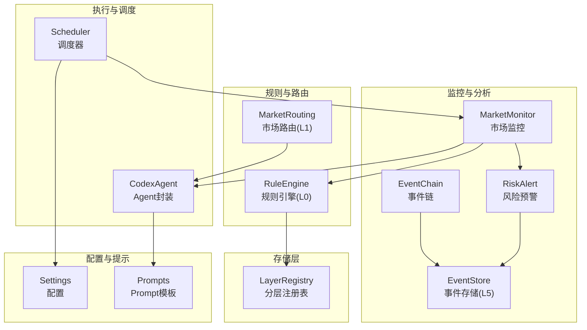
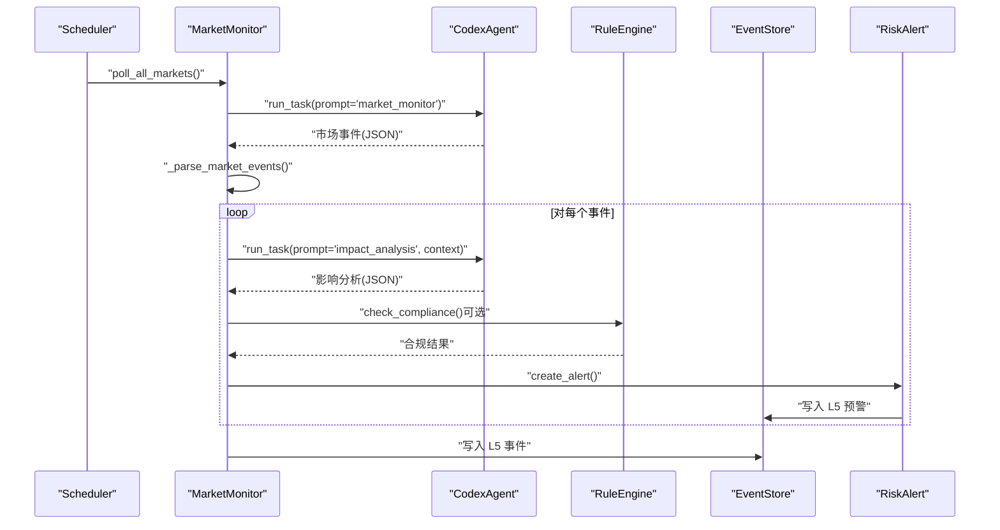
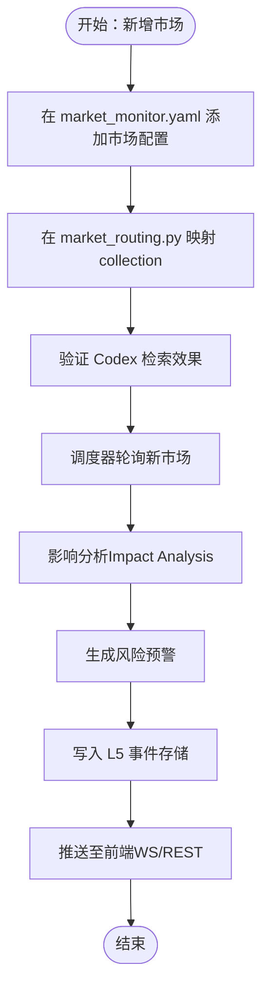
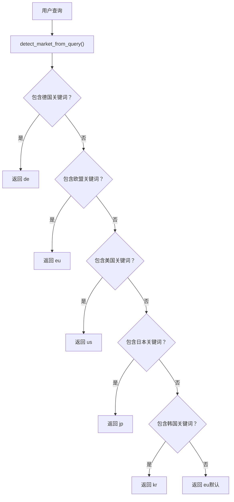
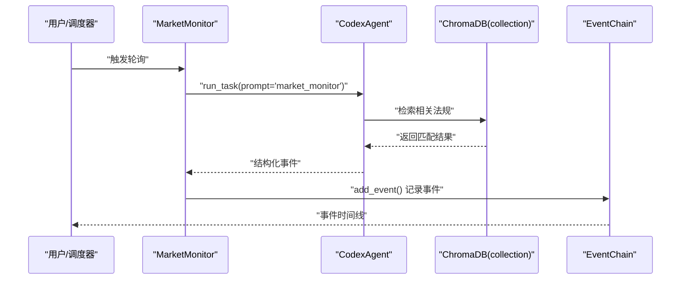
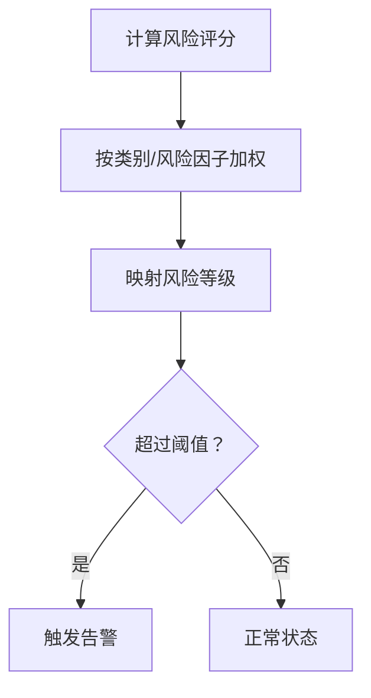
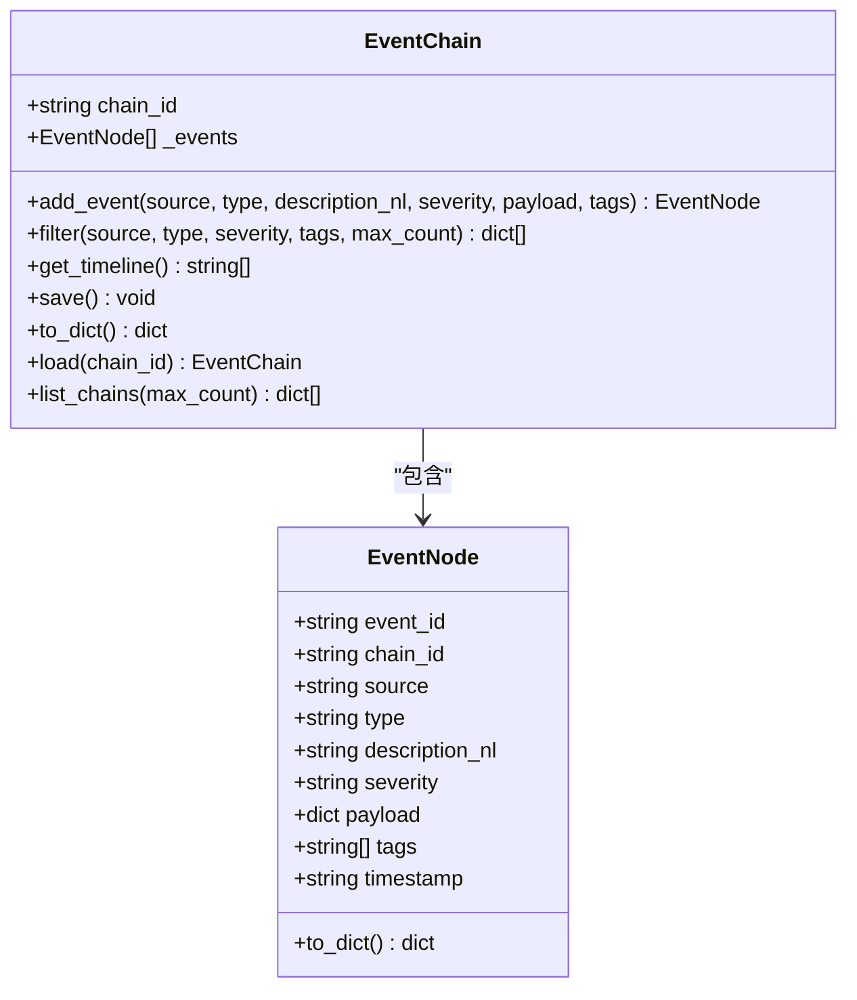
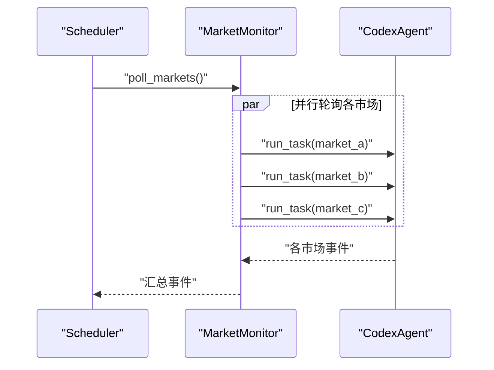
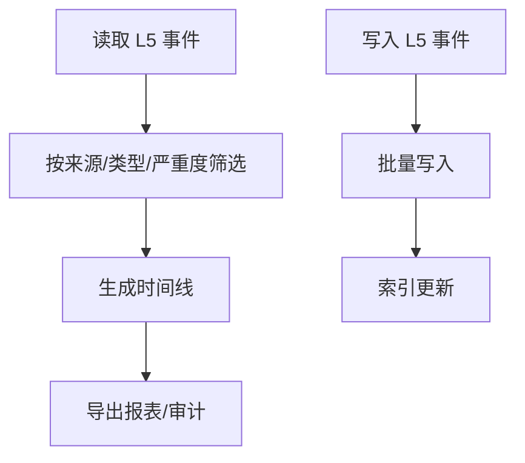
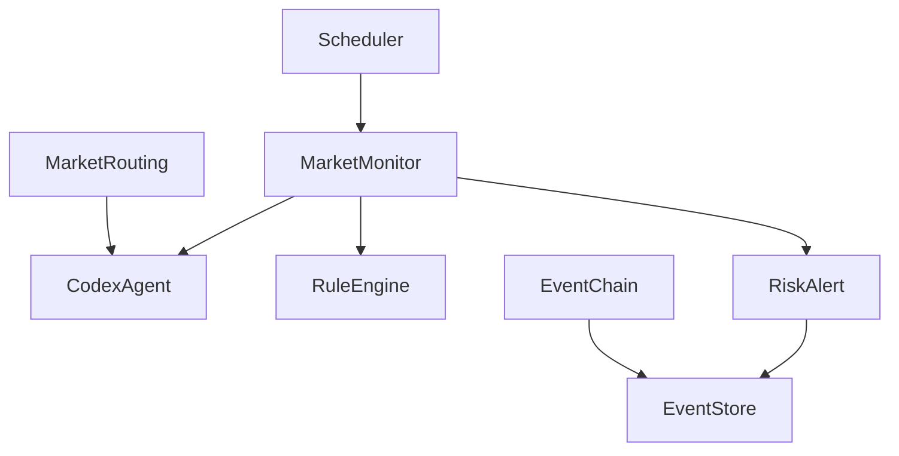

# 市场监控扩展

<cite>
**本文档引用的文件**
- [backend/app/core/market_monitor.py](file://backend/app/core/market_monitor.py)
- [backend/app/core/rule_engine.py](file://backend/app/core/rule_engine.py)
- [backend/app/core/event_chain.py](file://backend/app/core/event_chain.py)
- [backend/app/core/risk_alert.py](file://backend/app/core/risk_alert.py)
- [backend/app/core/scheduler.py](file://backend/app/core/scheduler.py)
- [backend/app/services/codex_agent.py](file://backend/app/services/codex_agent.py)
- [backend/app/knowledge/market_routing.py](file://backend/app/knowledge/market_routing.py)
- [backend/app/storage/layer_registry.py](file://backend/app/storage/layer_registry.py)
- [backend/app/storage/event_store.py](file://backend/app/storage/event_store.py)
- [backend/data/prompts/market_monitor.yaml](file://backend/data/prompts/market_monitor.yaml)
- [backend/data/prompts/impact_analysis.yaml](file://backend/data/prompts/impact_analysis.yaml)
- [backend/app/config.py](file://backend/app/config.py)
- [backend/data/regulations.md](file://backend/data/regulations.md)
- [backend/data/chains/events/eu_regulations_2026.json](file://backend/data/chains/events/eu_regulations_2026.json)
</cite>

## 目录
1. [简介](#简介)
2. [项目结构](#项目结构)
3. [核心组件](#核心组件)
4. [架构总览](#架构总览)
5. [详细组件分析](#详细组件分析)
6. [依赖分析](#依赖分析)
7. [性能考虑](#性能考虑)
8. [故障排查指南](#故障排查指南)
9. [结论](#结论)
10. [附录](#附录)

## 简介
本指南面向需要扩展“市场监控系统”的工程师与产品人员，围绕以下目标提供系统化、可落地的扩展方法：
- 新市场的监控规则与数据源接入
- 告警机制与推送通道
- 市场路由系统的定制化（路由策略、优先级、负载均衡）
- 新法规的集成（解析、影响评估、自动更新）
- 监控指标扩展（自定义KPI、阈值与可视化）
- 事件链扩展（新事件类型、处理流程、状态管理）
- 多市场并发监控（资源管理、性能优化、故障隔离）
- 监控数据的存储与查询优化（索引、缓存、批量处理）
- 实际扩展示例（新国家/地区法规监控、新产品类别合规检查）
- 可维护性与可扩展性设计原则

## 项目结构
系统采用“薄封装 + 统一Prompt模板 + 多层存储”的架构，核心模块职责清晰、边界明确：
- 市场监控：委托 Codex Agent 执行联网搜索与分析
- 规则引擎：基于 L0 原始数据的确定性合规检查
- 事件链：系统与用户事件的可追溯记录
- 风险预警：统一的告警生成、持久化与推送
- 调度器：定时任务驱动全链路扫描与指标采集
- 知识路由：按市场分 collection 的 RAG 路由
- 存储层：分层注册表统一访问 L0-L5

图表来源
- [backend/app/core/market_monitor.py:24-156](file://backend/app/core/market_monitor.py#L24-L156)
- [backend/app/core/risk_alert.py:32-181](file://backend/app/core/risk_alert.py#L32-L181)
- [backend/app/core/event_chain.py:61-215](file://backend/app/core/event_chain.py#L61-L215)
- [backend/app/storage/event_store.py:59-269](file://backend/app/storage/event_store.py#L59-L269)
- [backend/app/core/rule_engine.py:17-247](file://backend/app/core/rule_engine.py#L17-L247)
- [backend/app/knowledge/market_routing.py:31-77](file://backend/app/knowledge/market_routing.py#L31-L77)
- [backend/app/services/codex_agent.py:40-372](file://backend/app/services/codex_agent.py#L40-L372)
- [backend/app/core/scheduler.py:24-152](file://backend/app/core/scheduler.py#L24-L152)
- [backend/app/storage/layer_registry.py:23-45](file://backend/app/storage/layer_registry.py#L23-L45)
- [backend/app/config.py:5-75](file://backend/app/config.py#L5-L75)
- [backend/data/prompts/market_monitor.yaml:1-36](file://backend/data/prompts/market_monitor.yaml#L1-L36)
- [backend/data/prompts/impact_analysis.yaml:1-19](file://backend/data/prompts/impact_analysis.yaml#L1-L19)

章节来源
- [backend/app/core/market_monitor.py:1-156](file://backend/app/core/market_monitor.py#L1-L156)
- [backend/app/core/risk_alert.py:1-181](file://backend/app/core/risk_alert.py#L1-L181)
- [backend/app/core/event_chain.py:1-215](file://backend/app/core/event_chain.py#L1-L215)
- [backend/app/storage/event_store.py:1-269](file://backend/app/storage/event_store.py#L1-L269)
- [backend/app/core/rule_engine.py:1-247](file://backend/app/core/rule_engine.py#L1-L247)
- [backend/app/knowledge/market_routing.py:1-77](file://backend/app/knowledge/market_routing.py#L1-L77)
- [backend/app/services/codex_agent.py:1-372](file://backend/app/services/codex_agent.py#L1-L372)
- [backend/app/core/scheduler.py:1-152](file://backend/app/core/scheduler.py#L1-L152)
- [backend/app/storage/layer_registry.py:1-45](file://backend/app/storage/layer_registry.py#L1-L45)
- [backend/app/config.py:1-75](file://backend/app/config.py#L1-L75)
- [backend/data/prompts/market_monitor.yaml:1-36](file://backend/data/prompts/market_monitor.yaml#L1-L36)
- [backend/data/prompts/impact_analysis.yaml:1-19](file://backend/data/prompts/impact_analysis.yaml#L1-L19)

## 核心组件
- 市场监控（MarketMonitor）
  - 通过 Codex Agent 执行联网搜索与分析，规范化事件并写入 L5 事件存储
  - 支持全市场轮询与单市场轮询，以及影响分析
- 规则引擎（RuleEngine）
  - 基于 L0 原始数据（HS编码、VAT、认证矩阵）进行确定性合规检查
  - 输出风险评分、整改步骤与清单
- 事件链（EventChain）与事件存储（EventStore）
  - 记录系统与用户事件，支持筛选、回溯与时间线展示
  - L5 存储合并了原有事件链与动作链
- 风险预警（RiskAlert）
  - 生成、持久化、查询与推送预警，支持用户维度的忽略与分页
- 市场路由（MarketRouting）
  - 按市场分 collection 的 ChromaDB 路由，支持关键词检测与默认回退
- 调度器（Scheduler）
  - 定时触发市场轮询、影响分析与指标采集，驱动全链路扫描
- Agent 封装（CodexAgent）
  - 统一 run_task/run_chat 接口，支持流式输出、工具调用与会话上下文
- 分层存储（LayerRegistry）
  - 统一暴露 L0-L5 存储层，便于业务代码按层读写

章节来源
- [backend/app/core/market_monitor.py:24-156](file://backend/app/core/market_monitor.py#L24-L156)
- [backend/app/core/rule_engine.py:17-247](file://backend/app/core/rule_engine.py#L17-L247)
- [backend/app/core/event_chain.py:61-215](file://backend/app/core/event_chain.py#L61-L215)
- [backend/app/storage/event_store.py:59-269](file://backend/app/storage/event_store.py#L59-L269)
- [backend/app/core/risk_alert.py:32-181](file://backend/app/core/risk_alert.py#L32-L181)
- [backend/app/knowledge/market_routing.py:31-77](file://backend/app/knowledge/market_routing.py#L31-L77)
- [backend/app/core/scheduler.py:24-152](file://backend/app/core/scheduler.py#L24-L152)
- [backend/app/services/codex_agent.py:40-372](file://backend/app/services/codex_agent.py#L40-L372)
- [backend/app/storage/layer_registry.py:23-45](file://backend/app/storage/layer_registry.py#L23-L45)

## 架构总览
系统通过“调度器驱动 + Agent 执行 + 规则引擎判定 + 事件链记录 + 风险预警推送”的闭环实现市场监控与合规管理。

图表来源
- [backend/app/core/scheduler.py:68-131](file://backend/app/core/scheduler.py#L68-L131)
- [backend/app/core/market_monitor.py:35-104](file://backend/app/core/market_monitor.py#L35-L104)
- [backend/app/services/codex_agent.py:55-88](file://backend/app/services/codex_agent.py#L55-L88)
- [backend/app/core/rule_engine.py:197-247](file://backend/app/core/rule_engine.py#L197-L247)
- [backend/app/core/risk_alert.py:32-82](file://backend/app/core/risk_alert.py#L32-L82)
- [backend/app/storage/event_store.py:117-158](file://backend/app/storage/event_store.py#L117-L158)

## 详细组件分析

### 市场监控扩展（新市场、数据源、告警）
- 新市场接入
  - 在 Prompt 模板中新增市场配置，定义名称、来源站点与关键词
  - 在市场路由中为新市场映射 collection 名称
  - 在调度器中确保对新市场的轮询与影响分析流程可用
- 数据源接入
  - Codex Agent 通过 Prompt 模板注入上下文，无需修改代码即可切换数据源
  - 支持多来源关键词组合，提升检索准确性
- 告警机制
  - 根据事件严重度自动分类为“法规变更”或“市场热点”
  - 支持按产品与市场维度筛选受影响对象
  - 通过 WebSocket 与 REST 双通道推送

图表来源
- [backend/data/prompts/market_monitor.yaml:7-23](file://backend/data/prompts/market_monitor.yaml#L7-L23)
- [backend/app/knowledge/market_routing.py:19-40](file://backend/app/knowledge/market_routing.py#L19-L40)
- [backend/app/services/codex_agent.py:55-88](file://backend/app/services/codex_agent.py#L55-L88)
- [backend/app/core/market_monitor.py:35-104](file://backend/app/core/market_monitor.py#L35-L104)
- [backend/app/core/risk_alert.py:32-82](file://backend/app/core/risk_alert.py#L32-L82)
- [backend/app/storage/event_store.py:117-158](file://backend/app/storage/event_store.py#L117-L158)

章节来源
- [backend/data/prompts/market_monitor.yaml:1-36](file://backend/data/prompts/market_monitor.yaml#L1-L36)
- [backend/app/knowledge/market_routing.py:1-77](file://backend/app/knowledge/market_routing.py#L1-L77)
- [backend/app/services/codex_agent.py:1-372](file://backend/app/services/codex_agent.py#L1-L372)
- [backend/app/core/market_monitor.py:1-156](file://backend/app/core/market_monitor.py#L1-L156)
- [backend/app/core/risk_alert.py:1-181](file://backend/app/core/risk_alert.py#L1-L181)
- [backend/app/storage/event_store.py:1-269](file://backend/app/storage/event_store.py#L1-L269)

### 市场路由系统定制化（策略、优先级、负载均衡）
- 路由策略
  - 基于市场代码映射到不同 collection
  - 通过关键词检测自动推断目标市场，支持优先级（如德国本地法优先于泛 EU）
- 优先级设置
  - 关键词匹配顺序决定 collection 选择
  - 默认回退到 EU collection，保证兜底
- 负载均衡
  - 多 collection 并行检索，按市场隔离，避免跨市场干扰

图表来源
- [backend/app/knowledge/market_routing.py:48-77](file://backend/app/knowledge/market_routing.py#L48-L77)

章节来源
- [backend/app/knowledge/market_routing.py:1-77](file://backend/app/knowledge/market_routing.py#L1-L77)

### 新法规集成（解析、影响评估、自动更新）
- 法规解析
  - 将法规文本结构化为知识库条目，支持按市场分 collection 检索
  - 在 Prompt 模板中为新法规设定关键词与来源
- 影响评估
  - 使用 Impact Analysis Prompt 将市场事件与用户产品进行匹配
  - 通过 Codex Agent 输出受影响产品、影响等级与建议操作
- 自动更新机制
  - 调度器定期轮询，自动发现新变更并生成事件链
  - 事件链可用于后续审计与回溯

图表来源
- [backend/app/core/market_monitor.py:35-104](file://backend/app/core/market_monitor.py#L35-L104)
- [backend/app/knowledge/market_routing.py:31-40](file://backend/app/knowledge/market_routing.py#L31-L40)
- [backend/app/core/event_chain.py:86-106](file://backend/app/core/event_chain.py#L86-L106)
- [backend/data/regulations.md:1-111](file://backend/data/regulations.md#L1-L111)

章节来源
- [backend/app/core/market_monitor.py:1-156](file://backend/app/core/market_monitor.py#L1-L156)
- [backend/app/knowledge/market_routing.py:1-77](file://backend/app/knowledge/market_routing.py#L1-L77)
- [backend/app/core/event_chain.py:1-215](file://backend/app/core/event_chain.py#L1-L215)
- [backend/data/regulations.md:1-111](file://backend/data/regulations.md#L1-L111)

### 监控指标扩展（KPI、阈值、可视化）
- 自定义 KPI
  - 在规则引擎中扩展评分与风险等级映射，支持按产品类别、风险因子加权
  - 通过事件链与事件存储统计事件数量、严重度分布、响应时长等
- 阈值设置
  - 风险评分阈值与严重度阈值可配置，驱动告警级别与推送策略
- 可视化展示
  - 事件时间线与仪表盘可基于 L5 事件数据实时生成

图表来源
- [backend/app/core/rule_engine.py:148-174](file://backend/app/core/rule_engine.py#L148-L174)
- [backend/app/core/risk_alert.py:32-82](file://backend/app/core/risk_alert.py#L32-L82)

章节来源
- [backend/app/core/rule_engine.py:148-174](file://backend/app/core/rule_engine.py#L148-L174)
- [backend/app/core/risk_alert.py:1-181](file://backend/app/core/risk_alert.py#L1-L181)

### 事件链扩展（新事件类型、处理流程、状态管理）
- 新事件类型
  - 在事件链中新增事件类型与标签，支持按来源/类型/严重度筛选
  - 在事件存储中区分系统事件与用户操作事件
- 处理流程
  - 事件记录包含时间戳、来源、描述、负载与标签，便于审计与回溯
- 状态管理
  - 事件链支持加载、保存、筛选与时间线生成，便于前端展示

图表来源
- [backend/app/core/event_chain.py:24-192](file://backend/app/core/event_chain.py#L24-L192)

章节来源
- [backend/app/core/event_chain.py:1-215](file://backend/app/core/event_chain.py#L1-L215)
- [backend/app/storage/event_store.py:59-269](file://backend/app/storage/event_store.py#L59-L269)
- [backend/data/chains/events/eu_regulations_2026.json:1-39](file://backend/data/chains/events/eu_regulations_2026.json#L1-L39)

### 多市场并发监控（资源管理、性能优化、故障隔离）
- 资源管理
  - 调度器按分钟级间隔轮询，避免过度请求
  - Codex Agent 使用持久化 Thread 管理会话，减少重复初始化开销
- 性能优化
  - Prompt 模板集中管理，便于统一优化检索策略
  - 事件链与事件存储采用 JSON 文件，便于快速读写与批量处理
- 故障隔离
  - 单市场轮询失败不影响其他市场
  - 风险预警与事件存储分离，降低耦合

图表来源
- [backend/app/core/scheduler.py:68-131](file://backend/app/core/scheduler.py#L68-L131)
- [backend/app/core/market_monitor.py:35-67](file://backend/app/core/market_monitor.py#L35-L67)
- [backend/app/services/codex_agent.py:55-88](file://backend/app/services/codex_agent.py#L55-L88)

章节来源
- [backend/app/core/scheduler.py:1-152](file://backend/app/core/scheduler.py#L1-L152)
- [backend/app/core/market_monitor.py:1-156](file://backend/app/core/market_monitor.py#L1-L156)
- [backend/app/services/codex_agent.py:1-372](file://backend/app/services/codex_agent.py#L1-L372)

### 监控数据存储与查询优化（索引、缓存、批量处理）
- 索引设计
  - 事件链按来源/类型/严重度/标签筛选，适合高频查询
  - 事件存储区分系统链与用户链，便于权限与隔离控制
- 缓存策略
  - Prompt 模板与规则引擎结果可缓存，减少重复计算
  - Codex Agent 的会话 Thread 可复用，降低初始化成本
- 批量处理
  - 事件链与事件存储支持批量读取与写入，适合报表与审计场景

图表来源
- [backend/app/core/event_chain.py:119-141](file://backend/app/core/event_chain.py#L119-L141)
- [backend/app/storage/event_store.py:162-189](file://backend/app/storage/event_store.py#L162-L189)

章节来源
- [backend/app/core/event_chain.py:1-215](file://backend/app/core/event_chain.py#L1-L215)
- [backend/app/storage/event_store.py:1-269](file://backend/app/storage/event_store.py#L1-L269)

### 实际扩展示例
- 新国家/地区法规监控
  - 在 Prompt 模板中添加该国家/地区的来源与关键词
  - 在市场路由中映射 collection，确保检索正确
  - 在调度器中纳入轮询，观察事件链与预警生成
- 新产品类别合规检查
  - 在规则引擎中扩展风险因子与评分权重
  - 在影响分析中增加该类别的匹配规则
  - 通过事件链记录合规检查与整改过程

章节来源
- [backend/data/prompts/market_monitor.yaml:1-36](file://backend/data/prompts/market_monitor.yaml#L1-L36)
- [backend/app/knowledge/market_routing.py:1-77](file://backend/app/knowledge/market_routing.py#L1-L77)
- [backend/app/core/rule_engine.py:148-247](file://backend/app/core/rule_engine.py#L148-L247)
- [backend/app/core/market_monitor.py:69-104](file://backend/app/core/market_monitor.py#L69-L104)
- [backend/app/core/event_chain.py:1-215](file://backend/app/core/event_chain.py#L1-L215)

### 可维护性与可扩展性设计原则
- 配置优先：Prompt 模板与路由策略集中配置，避免硬编码
- 分层解耦：规则引擎、事件链、风险预警与调度器职责清晰
- 统一入口：分层注册表与事件存储提供统一访问接口
- 可观测性：事件链与事件存储支持审计与回溯
- 可扩展：新增市场、法规与事件类型无需大规模重构

章节来源
- [backend/app/config.py:1-75](file://backend/app/config.py#L1-L75)
- [backend/app/storage/layer_registry.py:1-45](file://backend/app/storage/layer_registry.py#L1-L45)
- [backend/app/storage/event_store.py:1-269](file://backend/app/storage/event_store.py#L1-L269)
- [backend/app/core/event_chain.py:1-215](file://backend/app/core/event_chain.py#L1-L215)

## 依赖分析
- 组件耦合
  - MarketMonitor 依赖 CodexAgent 与 RuleEngine
  - Scheduler 驱动 MarketMonitor 与 RiskAlert
  - EventChain 与 EventStore 提供统一事件记录
  - MarketRouting 与 CodexAgent 协作实现知识检索
- 外部依赖
  - APScheduler 用于异步调度
  - Codex Client SDK 用于 Agent 能力调用
  - JSON 文件系统用于事件与预警持久化

图表来源
- [backend/app/core/scheduler.py:24-152](file://backend/app/core/scheduler.py#L24-L152)
- [backend/app/core/market_monitor.py:24-156](file://backend/app/core/market_monitor.py#L24-L156)
- [backend/app/services/codex_agent.py:40-372](file://backend/app/services/codex_agent.py#L40-L372)
- [backend/app/core/rule_engine.py:17-247](file://backend/app/core/rule_engine.py#L17-L247)
- [backend/app/core/risk_alert.py:32-181](file://backend/app/core/risk_alert.py#L32-L181)
- [backend/app/storage/event_store.py:59-269](file://backend/app/storage/event_store.py#L59-L269)
- [backend/app/core/event_chain.py:61-215](file://backend/app/core/event_chain.py#L61-L215)
- [backend/app/knowledge/market_routing.py:31-77](file://backend/app/knowledge/market_routing.py#L31-L77)

章节来源
- [backend/app/core/scheduler.py:1-152](file://backend/app/core/scheduler.py#L1-L152)
- [backend/app/core/market_monitor.py:1-156](file://backend/app/core/market_monitor.py#L1-L156)
- [backend/app/services/codex_agent.py:1-372](file://backend/app/services/codex_agent.py#L1-L372)
- [backend/app/core/rule_engine.py:1-247](file://backend/app/core/rule_engine.py#L1-L247)
- [backend/app/core/risk_alert.py:1-181](file://backend/app/core/risk_alert.py#L1-L181)
- [backend/app/storage/event_store.py:1-269](file://backend/app/storage/event_store.py#L1-L269)
- [backend/app/core/event_chain.py:1-215](file://backend/app/core/event_chain.py#L1-L215)
- [backend/app/knowledge/market_routing.py:1-77](file://backend/app/knowledge/market_routing.py#L1-L77)

## 性能考虑
- 轮询频率与并发
  - 通过配置项控制轮询间隔，避免对目标网站与 Codex 造成压力
- 事件存储与查询
  - 事件链与事件存储采用 JSON 文件，读写简单；对于海量事件建议引入数据库或索引优化
- Agent 能力
  - 使用持久化 Thread 与工具调用减少重复初始化与网络往返
- 缓存与批处理
  - Prompt 模板与规则引擎结果可缓存；事件批量写入提升吞吐

## 故障排查指南
- Codex 调用失败
  - 检查配置项与 SDK 版本兼容性，必要时启用降级 mock 响应
- 事件链加载失败
  - 确认事件链文件是否存在与 JSON 格式正确
- 风险预警为空
  - 检查用户目录是否存在、扫描时间是否更新、严重度阈值设置
- 调度器未运行
  - 检查调度器开关与轮询间隔配置

章节来源
- [backend/app/services/codex_agent.py:256-302](file://backend/app/services/codex_agent.py#L256-L302)
- [backend/app/core/event_chain.py:170-192](file://backend/app/core/event_chain.py#L170-L192)
- [backend/app/core/risk_alert.py:97-130](file://backend/app/core/risk_alert.py#L97-L130)
- [backend/app/core/scheduler.py:24-55](file://backend/app/core/scheduler.py#L24-L55)
- [backend/app/config.py:51-54](file://backend/app/config.py#L51-L54)

## 结论
通过 Prompt 模板、规则引擎、事件链与风险预警的协同，系统实现了可扩展、可观测且可维护的市场监控体系。新增市场、法规与事件类型的扩展成本低、路径清晰，适合持续演进与规模化部署。

## 附录
- 配置项参考
  - 调度器开关与轮询间隔
  - Codex 模型与搜索模型
  - 数据目录与 Chroma 持久化目录
- Prompt 模板参考
  - 市场监控与影响分析的系统提示与输出格式
- 事件链样例
  - 欧盟法规事件链示例，展示事件类型、严重度与标签

章节来源
- [backend/app/config.py:51-63](file://backend/app/config.py#L51-L63)
- [backend/data/prompts/market_monitor.yaml:1-36](file://backend/data/prompts/market_monitor.yaml#L1-L36)
- [backend/data/prompts/impact_analysis.yaml:1-19](file://backend/data/prompts/impact_analysis.yaml#L1-L19)
- [backend/data/chains/events/eu_regulations_2026.json:1-39](file://backend/data/chains/events/eu_regulations_2026.json#L1-L39)