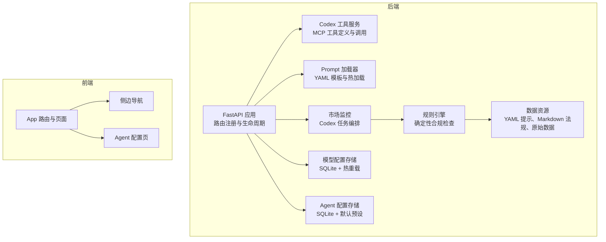
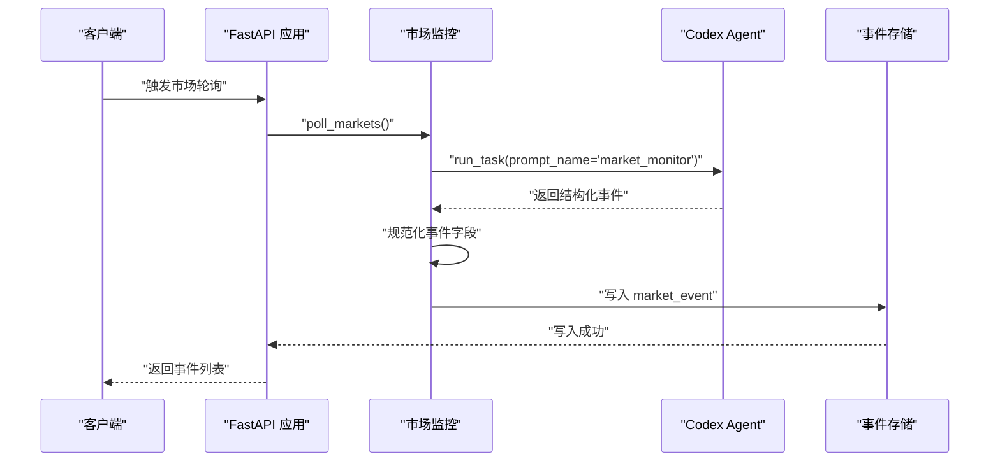
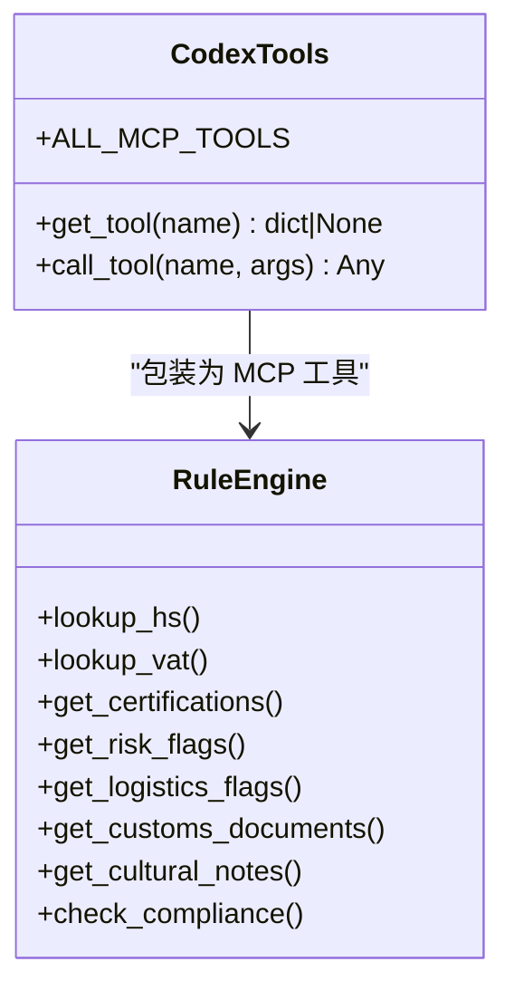
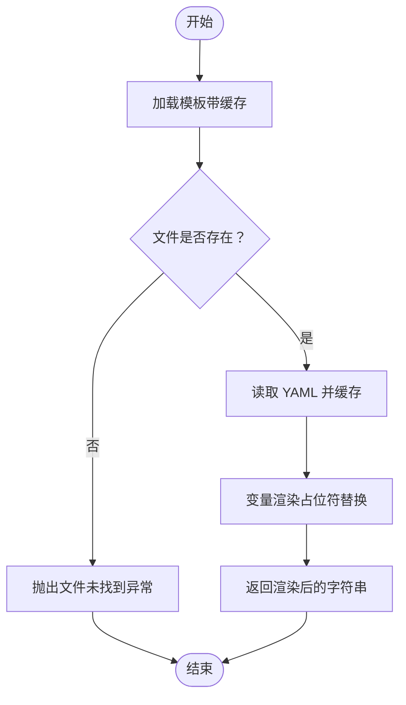
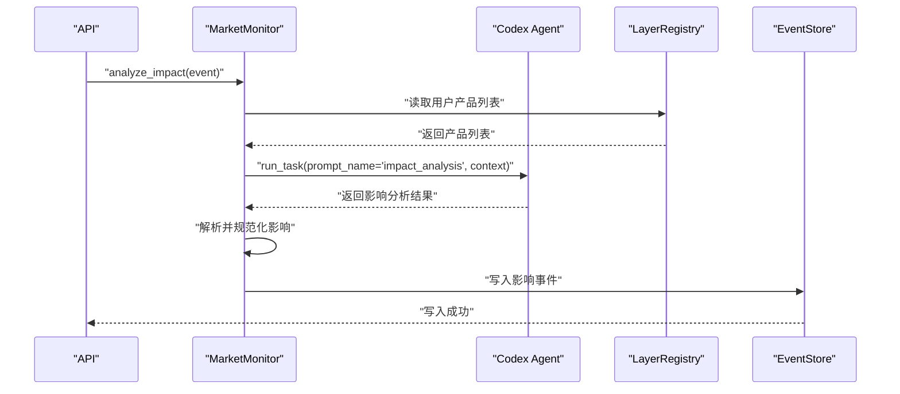
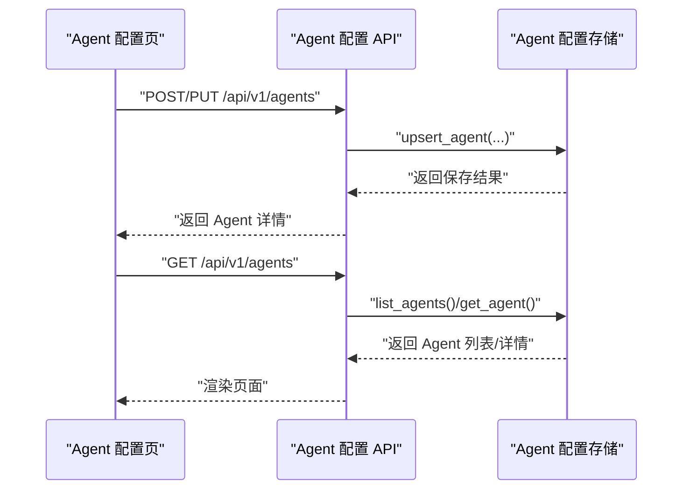
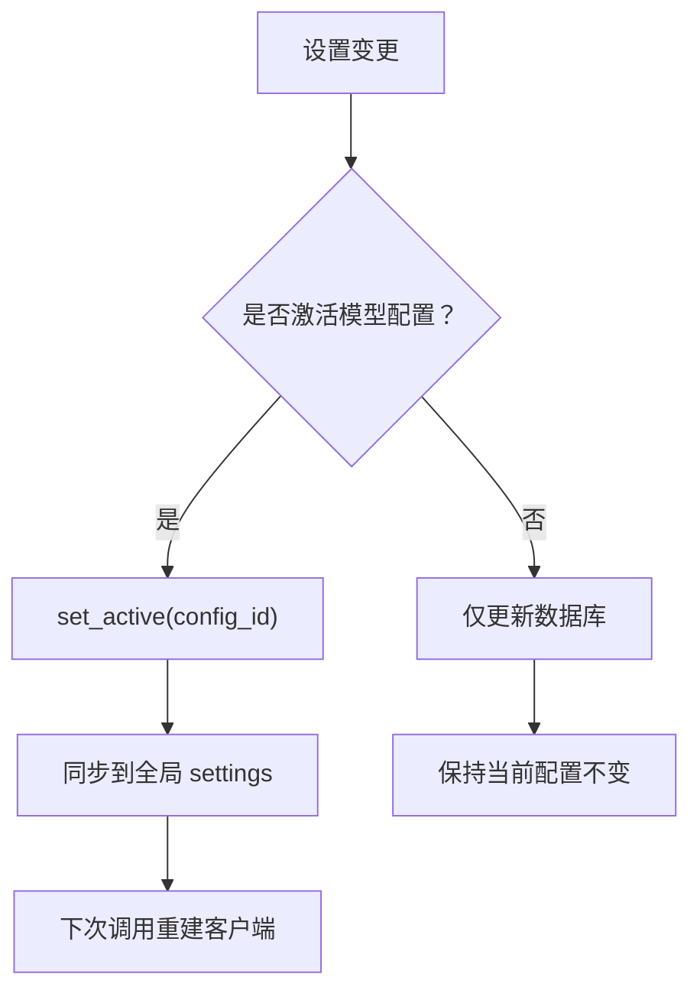
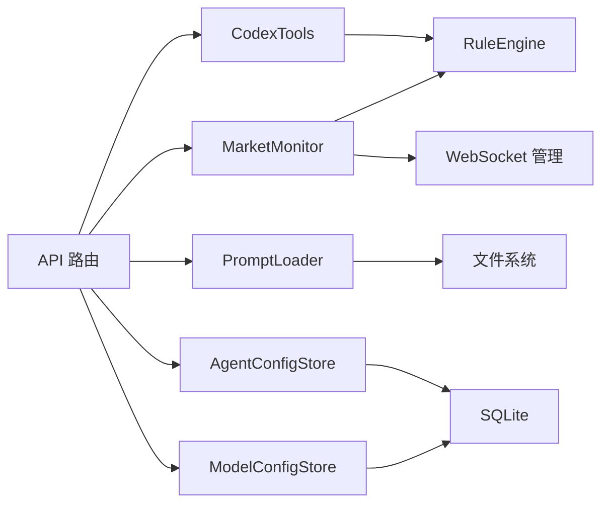

# 扩展定制

<cite>
**本文引用的文件**
- [backend/app/main.py](file://backend/app/main.py)
- [backend/app/config.py](file://backend/app/config.py)
- [backend/app/services/codex_tools.py](file://backend/app/services/codex_tools.py)
- [backend/app/services/prompt_loader.py](file://backend/app/services/prompt_loader.py)
- [backend/app/core/market_monitor.py](file://backend/app/core/market_monitor.py)
- [backend/app/services/compliance.py](file://backend/app/services/compliance.py)
- [backend/app/core/rule_engine.py](file://backend/app/core/rule_engine.py)
- [backend/app/storage/model_config_store.py](file://backend/app/storage/model_config_store.py)
- [backend/app/storage/agent_config_store.py](file://backend/app/storage/agent_config_store.py)
- [backend/data/prompts/market_monitor.yaml](file://backend/data/prompts/market_monitor.yaml)
- [backend/data/regulations.md](file://backend/data/regulations.md)
- [frontend/src/App.tsx](file://frontend/src/App.tsx)
- [frontend/src/components/Sidebar.tsx](file://frontend/src/components/Sidebar.tsx)
- [frontend/src/pages/AgentConfigPage.tsx](file://frontend/src/pages/AgentConfigPage.tsx)
</cite>

## 目录
1. [简介](#简介)
2. [项目结构](#项目结构)
3. [核心组件](#核心组件)
4. [架构总览](#架构总览)
5. [详细组件分析](#详细组件分析)
6. [依赖分析](#依赖分析)
7. [性能考虑](#性能考虑)
8. [故障排查指南](#故障排查指南)
9. [结论](#结论)
10. [附录](#附录)

## 简介
本指南面向希望对“避风港”跨境合规智能体进行扩展与定制的开发者，围绕以下主题提供系统化的方法论与实操步骤：
- 插件开发机制：MCP 工具扩展、Prompt Loader 的提示模板管理、Market Monitor 的市场监控扩展
- 合规检查扩展：新增合规检查功能、支持新的目标市场与法规体系
- 自定义 Agent 开发：指导原则与实现示例
- 配置管理扩展：模型配置、Agent 配置的自定义选项
- 第三方服务与 API 集成：认证机构、监管机构、电商平台
- UI 组件扩展：新增页面与组件的开发模式
- 性能优化与扩展性：并发、缓存、热加载与可观测性
- 实际扩展示例与最佳实践：基于现有代码的可落地步骤
- 向后兼容性与版本管理策略：配置迁移、接口演进与破坏性变更控制

## 项目结构
后端采用 FastAPI 架构，按功能域划分模块；前端使用 React + TypeScript，采用路由驱动的页面组织。核心扩展点分布在：
- 后端
  - API 层：统一注册路由，暴露扩展接口
  - 服务层：Codex 工具、Prompt 模板、合规编排、市场监控
  - 核心层：规则引擎、NLU、RAG、调度器
  - 存储层：模型配置、Agent 配置、会话与事件存储
  - 数据层：YAML 提示模板、Markdown 法规知识库、原始数据
- 前端
  - 页面与组件：Agent 配置、模型配置、侧边导航、聊天与合规查询等
  - 上下文与钩子：认证上下文、WebSocket 钩子、会话与聊天钩子

**图表来源**
- [backend/app/main.py:1-76](file://backend/app/main.py#L1-L76)
- [backend/app/services/codex_tools.py:1-242](file://backend/app/services/codex_tools.py#L1-L242)
- [backend/app/services/prompt_loader.py:1-79](file://backend/app/services/prompt_loader.py#L1-L79)
- [backend/app/core/market_monitor.py:1-156](file://backend/app/core/market_monitor.py#L1-L156)
- [backend/app/core/rule_engine.py:1-247](file://backend/app/core/rule_engine.py#L1-L247)
- [backend/app/storage/model_config_store.py:1-174](file://backend/app/storage/model_config_store.py#L1-L174)
- [backend/app/storage/agent_config_store.py:1-310](file://backend/app/storage/agent_config_store.py#L1-L310)
- [frontend/src/App.tsx:1-75](file://frontend/src/App.tsx#L1-L75)
- [frontend/src/components/Sidebar.tsx:1-182](file://frontend/src/components/Sidebar.tsx#L1-L182)
- [frontend/src/pages/AgentConfigPage.tsx:1-450](file://frontend/src/pages/AgentConfigPage.tsx#L1-L450)

**章节来源**
- [backend/app/main.py:1-76](file://backend/app/main.py#L1-L76)
- [frontend/src/App.tsx:1-75](file://frontend/src/App.tsx#L1-L75)

## 核心组件
- Codex 工具服务：将规则引擎函数包装为 MCP 工具，提供 HS 编码、VAT、认证、风险、物流、文化等工具，支持异步调用与热加载
- Prompt 加载器：从 YAML 模板读取提示词，支持全局缓存与热加载，便于微调与快速迭代
- 市场监控：委托 Codex Agent 执行联网搜索与分析，标准化事件结构并写入事件存储
- 规则引擎：基于 L0 数据（HS、VAT、认证矩阵）的确定性合规检查流水线
- 配置存储：模型配置与 Agent 配置的持久化、热重载与默认预设
- 前端页面与组件：Agent 配置管理、模型配置、侧边导航与路由

**章节来源**
- [backend/app/services/codex_tools.py:1-242](file://backend/app/services/codex_tools.py#L1-L242)
- [backend/app/services/prompt_loader.py:1-79](file://backend/app/services/prompt_loader.py#L1-L79)
- [backend/app/core/market_monitor.py:1-156](file://backend/app/core/market_monitor.py#L1-L156)
- [backend/app/core/rule_engine.py:1-247](file://backend/app/core/rule_engine.py#L1-L247)
- [backend/app/storage/model_config_store.py:1-174](file://backend/app/storage/model_config_store.py#L1-L174)
- [backend/app/storage/agent_config_store.py:1-310](file://backend/app/storage/agent_config_store.py#L1-L310)
- [frontend/src/pages/AgentConfigPage.tsx:1-450](file://frontend/src/pages/AgentConfigPage.tsx#L1-L450)

## 架构总览
系统采用“API 路由层 → 服务层 → 核心层 → 存储层”的分层设计，结合“提示模板 + 规则引擎 + RAG + 调度器”的能力组合，形成可扩展的合规自动化平台。

**图表来源**
- [backend/app/main.py:1-76](file://backend/app/main.py#L1-L76)
- [backend/app/core/market_monitor.py:35-55](file://backend/app/core/market_monitor.py#L35-L55)

**章节来源**
- [backend/app/main.py:1-76](file://backend/app/main.py#L1-L76)
- [backend/app/core/market_monitor.py:1-156](file://backend/app/core/market_monitor.py#L1-L156)

## 详细组件分析

### Codex 工具扩展（MCP 工具）
- 设计目标：将规则引擎函数包装为 MCP 工具，统一输入 Schema，支持异步执行与工具函数映射
- 扩展步骤
  - 定义工具 Schema：name/description/input_schema
  - 实现工具函数：接收参数并返回结构化结果
  - 注册工具函数映射：将工具名映射到函数
  - 导出工具列表：ALL_MCP_TOOLS 用于工具发现
  - 提供 get_tool 与 call_tool：按名称查找与异步调用
- 注意事项
  - 工具函数内部读取 L0 数据（registry.raw）
  - 所有工具同步执行，由调用方用 run_in_executor 包装
  - 输入 Schema 必须与调用方一致，避免运行时错误

**图表来源**
- [backend/app/services/codex_tools.py:34-242](file://backend/app/services/codex_tools.py#L34-L242)
- [backend/app/core/rule_engine.py:17-247](file://backend/app/core/rule_engine.py#L17-L247)

**章节来源**
- [backend/app/services/codex_tools.py:1-242](file://backend/app/services/codex_tools.py#L1-L242)
- [backend/app/core/rule_engine.py:1-247](file://backend/app/core/rule_engine.py#L1-L247)

### Prompt Loader（提示模板管理）
- 设计目标：所有 Codex 任务指令与大模型调用 prompt 均来自 YAML 文件，支持热加载与简单变量渲染
- 扩展步骤
  - 在 data/prompts 目录新增 YAML 模板文件
  - 使用 load_prompt/name 获取模板，render_prompt 渲染变量
  - reload_all 清空缓存后自动热加载
  - market_monitor.yaml 定义了市场监控任务的 markets 与输出格式
- 注意事项
  - 模板文件命名规范：不含 .yaml 后缀的 name 对应文件名
  - 渲染采用简单占位符替换，后续可升级为 Jinja2

**图表来源**
- [backend/app/services/prompt_loader.py:23-79](file://backend/app/services/prompt_loader.py#L23-L79)
- [backend/data/prompts/market_monitor.yaml:1-36](file://backend/data/prompts/market_monitor.yaml#L1-L36)

**章节来源**
- [backend/app/services/prompt_loader.py:1-79](file://backend/app/services/prompt_loader.py#L1-L79)
- [backend/data/prompts/market_monitor.yaml:1-36](file://backend/data/prompts/market_monitor.yaml#L1-L36)

### Market Monitor（市场监控扩展）
- 设计目标：薄封装层，委托 Codex Agent 执行联网搜索与分析，支持定时与手动触发
- 扩展步骤
  - 在 market_monitor.yaml 中新增 markets 条目，定义 code/name/sources/keywords
  - 在 MarketMonitor 中新增 poll_market 或扩展 poll_markets 的上下文
  - 影响分析：从 L2 project_memory 读取用户产品，委托 Codex 分析影响
  - 事件规范化：统一 event_id、market、summary、affected_categories、severity、source、source_url、key_points、timestamp
- 注意事项
  - Codex 返回结构多样化，需在解析器中做多态处理
  - 错误处理：CodexAgentError 与通用异常均记录日志并兜底返回空列表

**图表来源**
- [backend/app/core/market_monitor.py:69-105](file://backend/app/core/market_monitor.py#L69-L105)

**章节来源**
- [backend/app/core/market_monitor.py:1-156](file://backend/app/core/market_monitor.py#L1-L156)
- [backend/data/prompts/market_monitor.yaml:1-36](file://backend/data/prompts/market_monitor.yaml#L1-L36)

### 合规检查扩展（新增市场与法规）
- 扩展路径
  - 规则引擎：在规则引擎中增加对新市场的风险标志、物流要求、清关文档与文化注意事项
  - 原始数据：在 data/raw 下新增对应 JSON/Markdown 文件，供 L0 registry 读取
  - 提示模板：在 data/prompts 中新增或扩展 YAML 模板，定义 Codex 的检索与分析策略
  - 市场监控：在 market_monitor.yaml 中为新市场配置 sources 与 keywords
- 示例步骤
  - 在 data/raw/vat_rates/_all.json 中新增目标国家 VAT
  - 在 data/raw/certifications/cert_matrix.json 中新增认证要求
  - 在 data/prompts/market_monitor.yaml 中为新市场添加关键词与来源
  - 在规则引擎中扩展 get_risk_flags/get_logistics_flags/get_customs_documents/get_cultural_notes

**章节来源**
- [backend/app/core/rule_engine.py:1-247](file://backend/app/core/rule_engine.py#L1-L247)
- [backend/data/regulations.md:1-111](file://backend/data/regulations.md#L1-L111)
- [backend/data/prompts/market_monitor.yaml:1-36](file://backend/data/prompts/market_monitor.yaml#L1-L36)

### 自定义 Agent 开发（指导原则与示例）
- 指导原则
  - 明确 Agent 类型与职责边界，避免越权回答
  - 在 System Prompt 中明确回答风格、输出格式与语言
  - 通用合规 Agent 需在末尾约束 JSON 输出格式
  - 专项 Agent 专注特定领域，减少歧义
- 实现示例
  - 在前端 AgentConfigPage 中新建自定义 Agent，填写 name/type/description/system_prompt
  - 后端 AgentConfigStore 提供 CRUD 与默认预设，内置 Agent 不可删除
  - 通过 API 获取/切换 Agent，或在 NLU 中引用通用合规 Agent 的 system_prompt

**图表来源**
- [frontend/src/pages/AgentConfigPage.tsx:60-150](file://frontend/src/pages/AgentConfigPage.tsx#L60-L150)
- [backend/app/storage/agent_config_store.py:203-310](file://backend/app/storage/agent_config_store.py#L203-L310)

**章节来源**
- [frontend/src/pages/AgentConfigPage.tsx:1-450](file://frontend/src/pages/AgentConfigPage.tsx#L1-L450)
- [backend/app/storage/agent_config_store.py:1-310](file://backend/app/storage/agent_config_store.py#L1-L310)

### 配置管理扩展（模型与 Agent）
- 模型配置
  - 模型配置存储在 SQLite 表 model_configs，支持温度、top_p、max_tokens、嵌入模型等
  - set_active 同步更新全局 settings，实现热重载
  - init_default_config_if_empty 从 .env 导入默认配置
- Agent 配置
  - Agent 配置存储在 SQLite 表 agent_configs，支持 enabled/sort_order/type
  - init_default_agents 写入内置默认 Agent 预设
  - CRUD 接口支持增删改查与启用/禁用切换

**图表来源**
- [backend/app/storage/model_config_store.py:118-157](file://backend/app/storage/model_config_store.py#L118-L157)

**章节来源**
- [backend/app/storage/model_config_store.py:1-174](file://backend/app/storage/model_config_store.py#L1-L174)
- [backend/app/storage/agent_config_store.py:1-310](file://backend/app/storage/agent_config_store.py#L1-L310)

### 第三方服务与 API 集成
- 认证与会话
  - FastAPI 中间件允许前端 localhost:5173/3000 访问，WebSocket 端点提供实时推送
- 电商与外部系统
  - Shopify 配置项（client_id、client_secret、redirect_uri、scopes、api_version）可用于接入电商业务
  - 可在 API 层新增路由与服务层对接新的认证机构、监管机构或电商平台
- 扩展建议
  - 在 app/api 下新增路由模块（如 auth、users、shopify）
  - 在 app/services 下新增服务类，封装第三方 API 调用
  - 在 app/storage 下新增存储表，持久化令牌、状态与事件
  - 在 app/config.py 中新增配置项，支持 .env 环境变量注入

**章节来源**
- [backend/app/main.py:1-76](file://backend/app/main.py#L1-L76)
- [backend/app/config.py:55-61](file://backend/app/config.py#L55-L61)

### UI 组件扩展（新页面与新组件）
- 新增页面
  - 在 frontend/src/App.tsx 的 Page 类型与路由映射中新增页面标识与组件
  - 在 Sidebar.tsx 中为管理员或普通用户添加导航项
- 新增组件
  - 在 frontend/src/components 下创建新组件，遵循现有样式与交互模式
  - 在页面中引入并按需传参，使用 AuthContext 控制权限
- 最佳实践
  - 使用统一的样式变量与主题色
  - 为关键操作提供 Loading 与错误提示
  - 保持响应式布局与无障碍访问

**章节来源**
- [frontend/src/App.tsx:14-75](file://frontend/src/App.tsx#L14-L75)
- [frontend/src/components/Sidebar.tsx:1-182](file://frontend/src/components/Sidebar.tsx#L1-L182)

## 依赖分析
- 组件耦合
  - MarketMonitor 依赖 CodexAgent 与 LayerRegistry，耦合度较低，便于替换与扩展
  - CodexTools 依赖 RuleEngine 与 RAG 检索，通过函数映射解耦
  - PromptLoader 与 YAML 模板解耦，支持热加载
  - 配置存储通过热重载与默认预设保证一致性
- 外部依赖
  - FastAPI、Pydantic Settings、SQLite（复用 sessions.db）
  - 前端 React、TypeScript、Vite

**图表来源**
- [backend/app/main.py:1-76](file://backend/app/main.py#L1-L76)
- [backend/app/core/market_monitor.py:24-34](file://backend/app/core/market_monitor.py#L24-L34)
- [backend/app/services/codex_tools.py:20-31](file://backend/app/services/codex_tools.py#L20-L31)
- [backend/app/services/prompt_loader.py:10-13](file://backend/app/services/prompt_loader.py#L10-L13)
- [backend/app/storage/model_config_store.py:15-16](file://backend/app/storage/model_config_store.py#L15-L16)
- [backend/app/storage/agent_config_store.py:20-21](file://backend/app/storage/agent_config_store.py#L20-L21)

**章节来源**
- [backend/app/main.py:1-76](file://backend/app/main.py#L1-L76)
- [backend/app/core/market_monitor.py:1-156](file://backend/app/core/market_monitor.py#L1-L156)
- [backend/app/services/codex_tools.py:1-242](file://backend/app/services/codex_tools.py#L1-L242)
- [backend/app/services/prompt_loader.py:1-79](file://backend/app/services/prompt_loader.py#L1-L79)
- [backend/app/storage/model_config_store.py:1-174](file://backend/app/storage/model_config_store.py#L1-L174)
- [backend/app/storage/agent_config_store.py:1-310](file://backend/app/storage/agent_config_store.py#L1-L310)

## 性能考虑
- 并发与异步
  - CodexTools 使用 asyncio.to_thread 包装同步工具函数，避免阻塞事件循环
  - MarketMonitor 的轮询与影响分析通过异步协程执行，减少等待时间
- 缓存与热加载
  - PromptLoader 全局缓存避免重复 I/O；reload_all 支持微调后刷新
  - 规则引擎与 RAG 检索结果可结合缓存策略（视业务场景）
- I/O 与存储
  - SQLite 存储在本地，适合中小规模；大规模场景建议迁移到 PostgreSQL
  - 事件存储与会话存储分离，降低锁竞争
- 观测性
  - 日志记录关键错误（CodexAgentError、通用异常），便于定位问题
  - WebSocket 端点提供实时推送，提升用户体验

[本节为通用性能讨论，无需特定文件引用]

## 故障排查指南
- 常见问题
  - Prompt 模板未找到：检查 data_dir 与模板文件是否存在，确认缓存是否需要 reload_all
  - Codex 工具调用失败：检查工具 Schema 与输入参数，确认 TOOL_FUNCTIONS 是否包含对应函数
  - 市场监控无结果：检查 market_monitor.yaml 的 markets 配置与 Codex 返回结构
  - Agent 配置无法保存：确认权限与必填字段（name/system_prompt），查看后端错误响应
- 排查步骤
  - 启动日志：观察 startup/shutdown 生命周期与调度器状态
  - WebSocket：确认连接参数与消息格式（type/payload）
  - 数据一致性：核对 L0 原始数据与 L5 事件存储的一致性

**章节来源**
- [backend/app/services/prompt_loader.py:38-46](file://backend/app/services/prompt_loader.py#L38-L46)
- [backend/app/services/codex_tools.py:235-242](file://backend/app/services/codex_tools.py#L235-L242)
- [backend/app/core/market_monitor.py:49-54](file://backend/app/core/market_monitor.py#L49-L54)
- [frontend/src/pages/AgentConfigPage.tsx:94-125](file://frontend/src/pages/AgentConfigPage.tsx#L94-L125)

## 结论
通过以上扩展机制与最佳实践，可以在不破坏现有架构的前提下，持续增强系统的合规检查能力、市场监控广度与用户体验。建议在每次扩展前制定变更计划，确保配置迁移、接口演进与向后兼容策略到位，并通过热加载与可观测性保障稳定性。

[本节为总结性内容，无需特定文件引用]

## 附录
- 实际扩展示例
  - 新增市场：在 data/raw 与 data/prompts 中添加新市场数据与模板，在 market_monitor.yaml 中配置 sources/keywords
  - 新增合规工具：在 CodexTools 中定义工具 Schema 与函数映射，注册到 ALL_MCP_TOOLS
  - 新增 Agent：在前端 AgentConfigPage 创建，后端 AgentConfigStore 写入数据库并热更新
- 版本管理与兼容性
  - 配置项变更：通过 .env 与 settings.active_* 字段统一管理，避免硬编码
  - 接口演进：保持 API 前缀与路由稳定，新增端点时提供清晰的版本标识
  - 破坏性变更：通过迁移脚本与默认预设保障平滑过渡

[本节为补充说明，无需特定文件引用]