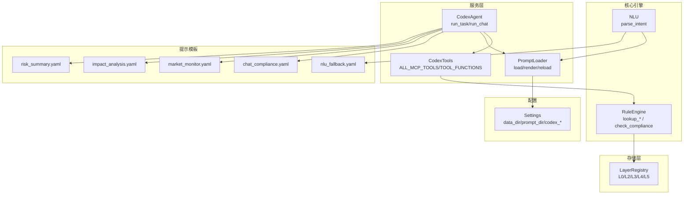
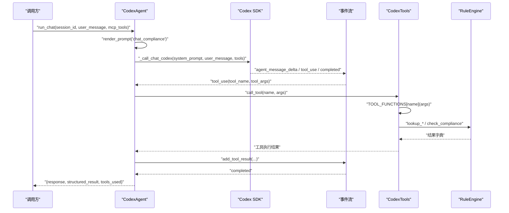
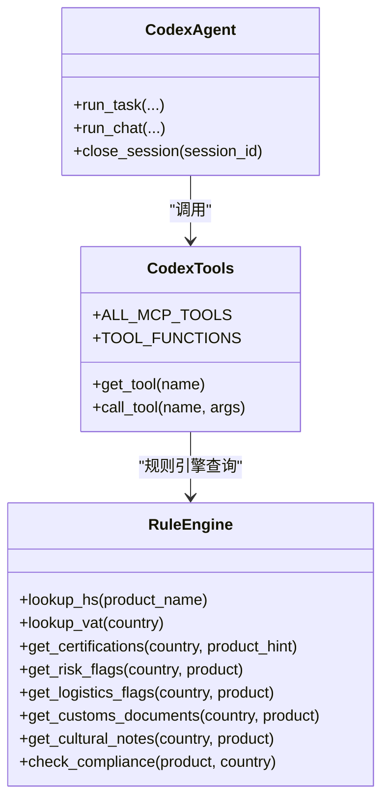
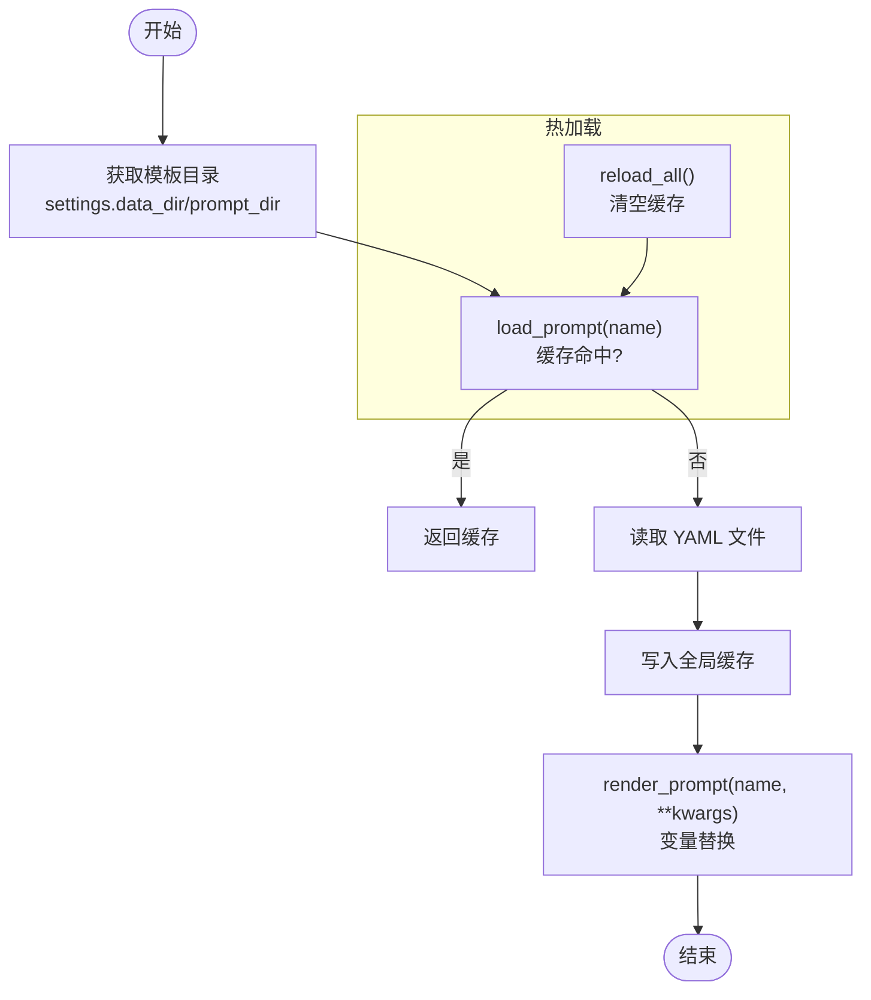
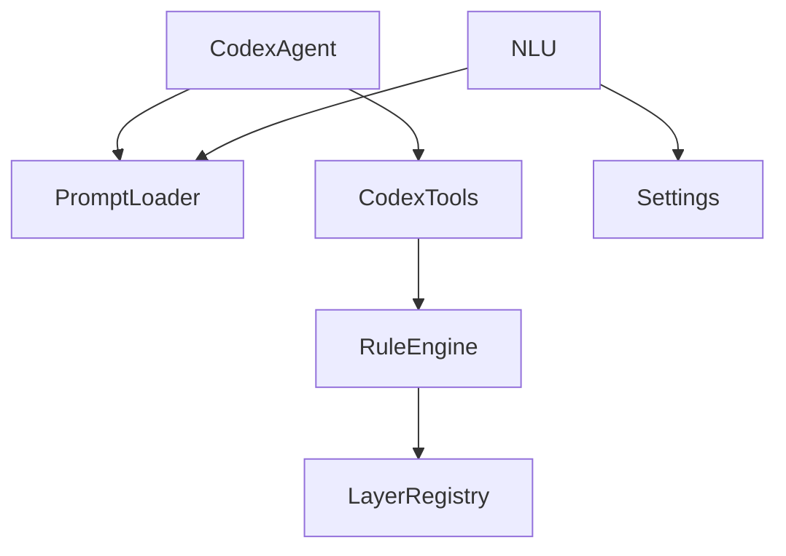

# 插件开发

<cite>
**本文档引用的文件**
- [codex_tools.py](file://backend/app/services/codex_tools.py)
- [codex_agent.py](file://backend/app/services/codex_agent.py)
- [prompt_loader.py](file://backend/app/services/prompt_loader.py)
- [rule_engine.py](file://backend/app/core/rule_engine.py)
- [nlu.py](file://backend/app/core/nlu.py)
- [schemas.py](file://backend/app/models/schemas.py)
- [layer_registry.py](file://backend/app/storage/layer_registry.py)
- [config.py](file://backend/app/config.py)
- [chat_compliance.yaml](file://backend/data/prompts/chat_compliance.yaml)
- [nlu_fallback.yaml](file://backend/data/prompts/nlu_fallback.yaml)
- [market_monitor.yaml](file://backend/data/prompts/market_monitor.yaml)
- [impact_analysis.yaml](file://backend/data/prompts/impact_analysis.yaml)
- [risk_summary.yaml](file://backend/data/prompts/risk_summary.yaml)
</cite>

## 目录
1. [简介](#简介)
2. [项目结构](#项目结构)
3. [核心组件](#核心组件)
4. [架构总览](#架构总览)
5. [详细组件分析](#详细组件分析)
6. [依赖分析](#依赖分析)
7. [性能考虑](#性能考虑)
8. [故障排查指南](#故障排查指南)
9. [结论](#结论)
10. [附录](#附录)

## 简介
本指南面向希望基于 Codex Tools 扩展 MCP 工具与 Prompt 模板系统的开发者，系统讲解以下内容：
- 如何定义新的 MCP 工具（工具 Schema、输入输出、函数映射与注册）
- 工具接口规范与调用方式（同步/异步、线程池封装、错误处理）
- Prompt Loader 的模板管理（模板格式、变量注入、热加载与渲染）
- 完整插件开发流程（从工具定义到注册使用）
- 工具调用的安全机制与错误处理策略
- 实际插件案例（合规检查工具、数据查询工具等）
- 插件生命周期管理与资源清理
- 调试与测试插件的方法与最佳实践

## 项目结构
后端采用“服务层 + 核心引擎 + 存储层 + 配置”的分层架构：
- 服务层：Codex Agent、Prompt Loader、合规服务等
- 核心引擎：规则引擎、NLU、RAG（未来）
- 存储层：分层注册表（L0-L5）
- 配置：统一配置对象与环境变量

图表来源
- [codex_agent.py:1-370](file://backend/app/services/codex_agent.py#L1-L370)
- [codex_tools.py:1-242](file://backend/app/services/codex_tools.py#L1-L242)
- [prompt_loader.py:1-79](file://backend/app/services/prompt_loader.py#L1-L79)
- [rule_engine.py:1-247](file://backend/app/core/rule_engine.py#L1-L247)
- [layer_registry.py:1-45](file://backend/app/storage/layer_registry.py#L1-L45)
- [config.py:1-75](file://backend/app/config.py#L1-L75)
- [chat_compliance.yaml:1-21](file://backend/data/prompts/chat_compliance.yaml#L1-L21)
- [nlu_fallback.yaml:1-20](file://backend/data/prompts/nlu_fallback.yaml#L1-L20)
- [market_monitor.yaml:1-36](file://backend/data/prompts/market_monitor.yaml#L1-L36)
- [impact_analysis.yaml:1-19](file://backend/data/prompts/impact_analysis.yaml#L1-L19)
- [risk_summary.yaml:1-16](file://backend/data/prompts/risk_summary.yaml#L1-L16)

章节来源
- [codex_agent.py:1-370](file://backend/app/services/codex_agent.py#L1-L370)
- [codex_tools.py:1-242](file://backend/app/services/codex_tools.py#L1-L242)
- [prompt_loader.py:1-79](file://backend/app/services/prompt_loader.py#L1-L79)
- [config.py:1-75](file://backend/app/config.py#L1-L75)

## 核心组件
- Codex Agent：封装 Codex CLI 能力，提供 run_task/run_chat 接口，支持流式事件推送、工具调用、结构化解析与错误处理。
- Codex Tools：定义 MCP 工具 Schema 与函数映射，提供异步工具调用入口。
- Prompt Loader：从 YAML 模板加载、缓存、热加载与变量渲染，支持 Codex 任务指令与系统提示。
- Rule Engine：确定性合规检查的核心逻辑，提供 HS 编码、VAT 税率、认证要求、风险提示、物流与文化注意事项等查询。
- Layer Registry：统一访问 L0-L5 存储层，规则引擎通过它读取 L0 原始数据。
- NLU：基于 LLM 的意图解析，支持热加载系统提示与多轮上下文注入。
- 配置：集中管理数据目录、提示模板目录、Codex 模型与开关。

章节来源
- [codex_agent.py:1-370](file://backend/app/services/codex_agent.py#L1-L370)
- [codex_tools.py:1-242](file://backend/app/services/codex_tools.py#L1-L242)
- [prompt_loader.py:1-79](file://backend/app/services/prompt_loader.py#L1-L79)
- [rule_engine.py:1-247](file://backend/app/core/rule_engine.py#L1-L247)
- [layer_registry.py:1-45](file://backend/app/storage/layer_registry.py#L1-L45)
- [nlu.py:1-99](file://backend/app/core/nlu.py#L1-L99)
- [config.py:1-75](file://backend/app/config.py#L1-L75)

## 架构总览
Codex Agent 通过 Prompt Loader 渲染任务指令，调用 Codex SDK 执行任务或开启持久化会话；在会话中，Agent 监听工具调用事件，委托 Codex Tools 异步执行对应工具函数，再将结果回填至会话流中。工具函数最终依赖规则引擎与分层存储完成数据读取与计算。

图表来源
- [codex_agent.py:168-234](file://backend/app/services/codex_agent.py#L168-L234)
- [codex_tools.py:235-242](file://backend/app/services/codex_tools.py#L235-L242)
- [rule_engine.py:197-247](file://backend/app/core/rule_engine.py#L197-L247)

## 详细组件分析

### MCP 工具扩展机制
- 工具 Schema 规范
  - 必填字段：name、description、input_schema（JSON Schema）
  - input_schema.properties 与 required 明确参数与必填项
- 工具函数映射
  - TOOL_FUNCTIONS 将工具名映射到 lambda 或函数，接收参数字典并返回结构化结果
  - 所有工具同步执行，通过异步线程池封装，避免阻塞事件循环
- 工具注册与发现
  - ALL_MCP_TOOLS 汇总所有工具定义
  - get_tool(name) 支持按名查找
- 调用流程
  - Codex Agent 在会话事件中捕获 tool_use，调用 call_tool(name, args)，并回填结果
  - 未知工具名抛出异常，便于快速定位

图表来源
- [codex_tools.py:1-242](file://backend/app/services/codex_tools.py#L1-L242)
- [codex_agent.py:1-370](file://backend/app/services/codex_agent.py#L1-L370)
- [rule_engine.py:1-247](file://backend/app/core/rule_engine.py#L1-L247)

章节来源
- [codex_tools.py:36-242](file://backend/app/services/codex_tools.py#L36-L242)
- [codex_agent.py:168-234](file://backend/app/services/codex_agent.py#L168-L234)

### Prompt Loader 模板管理系统
- 模板目录与加载
  - 通过 settings.data_dir/prompt_dir 定位模板目录
  - load_prompt(name) 读取 YAML 并缓存，list_prompts() 列出可用模板
- 变量注入与渲染
  - render_prompt(name, **kwargs) 支持简单占位符替换（后续可升级为 Jinja2）
- 热加载
  - reload_all() 清空缓存，便于微调后无需重启
- 模板示例
  - chat_compliance.yaml：Codex 多轮会话系统提示
  - nlu_fallback.yaml：NLU 意图解析兜底提示
  - market_monitor.yaml / impact_analysis.yaml / risk_summary.yaml：不同任务场景的系统提示

图表来源
- [prompt_loader.py:18-79](file://backend/app/services/prompt_loader.py#L18-L79)
- [config.py:42-46](file://backend/app/config.py#L42-L46)

章节来源
- [prompt_loader.py:1-79](file://backend/app/services/prompt_loader.py#L1-L79)
- [chat_compliance.yaml:1-21](file://backend/data/prompts/chat_compliance.yaml#L1-L21)
- [nlu_fallback.yaml:1-20](file://backend/data/prompts/nlu_fallback.yaml#L1-L20)
- [market_monitor.yaml:1-36](file://backend/data/prompts/market_monitor.yaml#L1-L36)
- [impact_analysis.yaml:1-19](file://backend/data/prompts/impact_analysis.yaml#L1-L19)
- [risk_summary.yaml:1-16](file://backend/data/prompts/risk_summary.yaml#L1-L16)

### 完整插件开发流程（示例：合规检查工具）
- 步骤 1：定义工具 Schema
  - 在工具定义区添加新工具 Schema，明确 name、description、input_schema.properties 与 required
  - 参考现有工具（如 HS_LOOKUP_TOOL、VAT_LOOKUP_TOOL、CERT_LOOKUP_TOOL、RISK_FLAGS_TOOL、COMPLIANCE_CHECK_TOOL、RAG_RETRIEVE_TOOL、LOGISTICS_CHECK_TOOL、CULTURAL_CHECK_TOOL）
- 步骤 2：实现工具函数映射
  - 在 TOOL_FUNCTIONS 中添加 name 到 lambda 或函数的映射
  - 函数接收参数字典 args，返回结构化结果
- 步骤 3：注册工具
  - 将新工具加入 ALL_MCP_TOOLS 列表
- 步骤 4：在 Codex Agent 中使用
  - run_chat 时传入 mcp_tools 参数，或使用默认 ALL_MCP_TOOLS
  - Agent 会在事件流中捕获 tool_use，调用 call_tool 执行工具
- 步骤 5：模板与提示
  - 在 chat_compliance.yaml 中声明工具能力，使 Agent 在多轮会话中正确引导用户使用工具
- 步骤 6：测试与验证
  - 使用 run_task/run_chat 验证工具调用链路与返回结构
  - 通过 reload_all() 热加载模板微调

章节来源
- [codex_tools.py:36-224](file://backend/app/services/codex_tools.py#L36-L224)
- [codex_agent.py:108-160](file://backend/app/services/codex_agent.py#L108-L160)
- [chat_compliance.yaml:1-21](file://backend/data/prompts/chat_compliance.yaml#L1-L21)

### 工具调用的安全机制与错误处理策略
- 安全机制
  - 工具白名单：仅允许注册在 ALL_MCP_TOOLS 中的工具被调用
  - 事件驱动：Codex Agent 在 tool_use 事件中才执行工具，避免任意调用
  - 会话持久化：通过 session_id 维持 Thread，减少跨会话误用
- 错误处理
  - 未知工具名：抛出异常，便于快速定位
  - 工具执行失败：记录警告日志，不影响主流程继续
  - Codex SDK 未安装：使用降级响应（mock），保证系统可用
  - 结构化解析：尝试解析 JSON，失败时返回原始文本兜底

章节来源
- [codex_agent.py:205-233](file://backend/app/services/codex_agent.py#L205-L233)
- [codex_tools.py:235-242](file://backend/app/services/codex_tools.py#L235-L242)

### 实际插件案例
- 合规检查工具
  - 示例：check_compliance 工具聚合 HS、VAT、认证、风险、物流、文化与清关建议
  - 适合在 run_chat 中作为技能或工具被调用
- 数据查询工具
  - 示例：lookup_hs、lookup_vat、get_certifications、get_risk_flags、get_logistics_flags、get_customs_documents、get_cultural_notes
  - 通过 TOOL_FUNCTIONS 映射到规则引擎查询，返回结构化结果
- RAG 检索工具
  - 示例：retrieve_regulation_context，从法规知识库检索相关条文
  - 适合在复杂合规查询中增强上下文

章节来源
- [codex_tools.py:104-140](file://backend/app/services/codex_tools.py#L104-L140)
- [rule_engine.py:197-247](file://backend/app/core/rule_engine.py#L197-L247)

### 插件生命周期管理与资源清理
- 生命周期
  - 定义期：编写 Schema 与函数映射，注册到 ALL_MCP_TOOLS
  - 运行期：Codex Agent 在会话中监听事件并调用工具
  - 关闭期：close_session(session_id) 释放 Thread 资源
- 资源清理
  - Prompt Loader 缓存：reload_all() 清空缓存，避免陈旧模板
  - 日志与异常：统一记录，便于审计与排障

章节来源
- [codex_agent.py:162-167](file://backend/app/services/codex_agent.py#L162-L167)
- [prompt_loader.py:49-51](file://backend/app/services/prompt_loader.py#L49-L51)

### 调试与测试插件的方法与最佳实践
- 调试方法
  - 使用 run_task/run_chat 快速验证工具链路
  - 启用流式接口 run_task_stream，观察事件流（delta、plan、tool、complete）
  - 通过 reload_all() 热加载模板，快速迭代提示
- 最佳实践
  - 工具 Schema 保持最小必要参数，使用 required 明确必填
  - 工具函数返回结构化结果，便于上层解析与展示
  - 在 chat_compliance.yaml 中清晰声明工具能力，提升用户体验
  - 使用 Pydantic 模型（如 schemas.py 中的合规结果模型）约束输出结构

章节来源
- [codex_agent.py:90-107](file://backend/app/services/codex_agent.py#L90-L107)
- [prompt_loader.py:49-79](file://backend/app/services/prompt_loader.py#L49-L79)
- [schemas.py:79-104](file://backend/app/models/schemas.py#L79-L104)

## 依赖分析
- 组件耦合
  - CodexAgent 依赖 PromptLoader（模板渲染）与 CodexTools（工具调用）
  - CodexTools 依赖 RuleEngine 与分层存储（通过 registry.raw）
  - NLU 依赖 PromptLoader 与配置（settings）
- 外部依赖
  - codex-client SDK：提供会话、线程与事件流
  - OpenAI 客户端：用于 NLU 与结构化 JSON 输出

图表来源
- [codex_agent.py:1-370](file://backend/app/services/codex_agent.py#L1-L370)
- [codex_tools.py:1-242](file://backend/app/services/codex_tools.py#L1-L242)
- [prompt_loader.py:1-79](file://backend/app/services/prompt_loader.py#L1-L79)
- [rule_engine.py:1-247](file://backend/app/core/rule_engine.py#L1-L247)
- [layer_registry.py:1-45](file://backend/app/storage/layer_registry.py#L1-L45)
- [nlu.py:1-99](file://backend/app/core/nlu.py#L1-L99)
- [config.py:1-75](file://backend/app/config.py#L1-L75)

章节来源
- [codex_agent.py:1-370](file://backend/app/services/codex_agent.py#L1-L370)
- [codex_tools.py:1-242](file://backend/app/services/codex_tools.py#L1-L242)
- [prompt_loader.py:1-79](file://backend/app/services/prompt_loader.py#L1-L79)
- [rule_engine.py:1-247](file://backend/app/core/rule_engine.py#L1-L247)
- [layer_registry.py:1-45](file://backend/app/storage/layer_registry.py#L1-L45)
- [nlu.py:1-99](file://backend/app/core/nlu.py#L1-L99)
- [config.py:1-75](file://backend/app/config.py#L1-L75)

## 性能考虑
- 工具执行
  - 使用异步线程池封装同步工具函数，避免阻塞事件循环
  - 控制并发与队列长度，防止过载
- 模板渲染
  - 全局缓存减少 I/O，热加载仅在需要时触发
- LLM 调用
  - 限制历史消息长度，避免上下文过长
  - 使用合适的温度与采样参数，平衡稳定性与多样性

## 故障排查指南
- 工具未生效
  - 检查是否注册到 ALL_MCP_TOOLS
  - 确认 TOOL_FUNCTIONS 中存在对应映射
- 会话无响应
  - 查看事件流是否出现 tool_use，确认工具执行是否抛错
  - 检查 Codex SDK 是否可用，必要时使用降级响应
- 模板未更新
  - 调用 reload_all() 清空缓存并重新加载
- NLU 解析异常
  - 检查 nlu_fallback.yaml 是否存在，或 Agent 配置中是否有通用系统提示

章节来源
- [codex_agent.py:205-233](file://backend/app/services/codex_agent.py#L205-L233)
- [prompt_loader.py:49-79](file://backend/app/services/prompt_loader.py#L49-L79)
- [nlu.py:27-50](file://backend/app/core/nlu.py#L27-L50)

## 结论
通过 MCP 工具与 Prompt Loader 的组合，系统实现了可扩展、可热加载、可调试的插件体系。开发者可按本文档的规范与流程快速扩展合规检查与数据查询工具，并在 Codex Agent 的多轮会话中无缝集成。配合统一的配置与模型约束，可确保插件在生产环境中的稳定性与一致性。

## 附录
- 模板文件清单
  - chat_compliance.yaml：合规对话系统提示
  - nlu_fallback.yaml：NLU 意图解析兜底提示
  - market_monitor.yaml：市场监控系统提示
  - impact_analysis.yaml：影响分析系统提示
  - risk_summary.yaml：风险摘要系统提示
- 数据模型参考
  - ComplianceResult：合规检查结果结构
  - ChatResponse：对话回复结构

章节来源
- [chat_compliance.yaml:1-21](file://backend/data/prompts/chat_compliance.yaml#L1-L21)
- [nlu_fallback.yaml:1-20](file://backend/data/prompts/nlu_fallback.yaml#L1-L20)
- [market_monitor.yaml:1-36](file://backend/data/prompts/market_monitor.yaml#L1-L36)
- [impact_analysis.yaml:1-19](file://backend/data/prompts/impact_analysis.yaml#L1-L19)
- [risk_summary.yaml:1-16](file://backend/data/prompts/risk_summary.yaml#L1-L16)
- [schemas.py:79-104](file://backend/app/models/schemas.py#L79-L104)