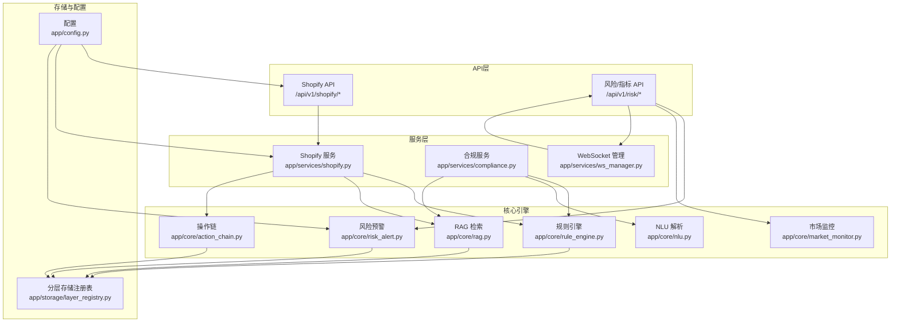
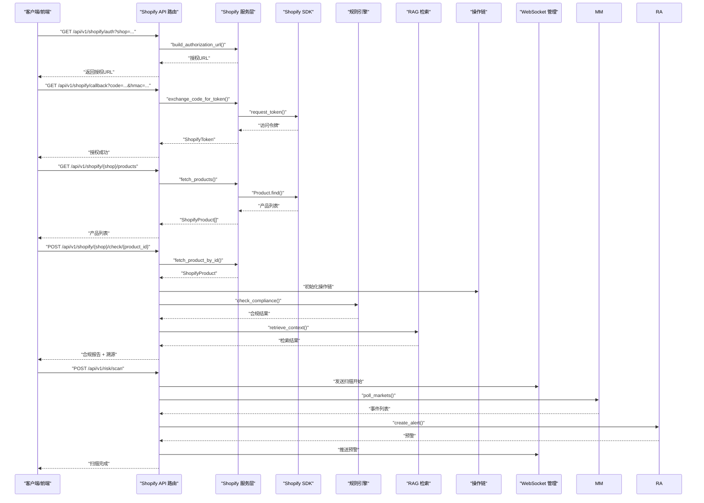
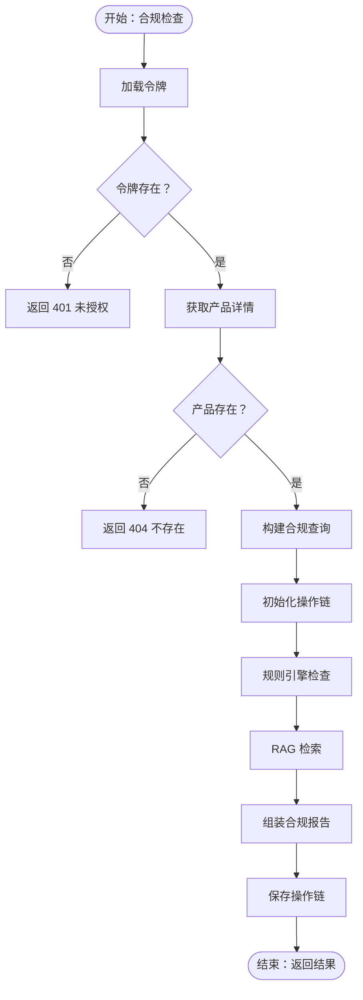
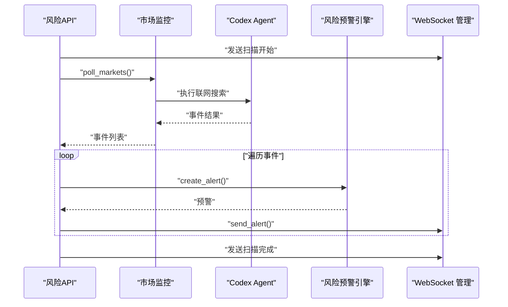
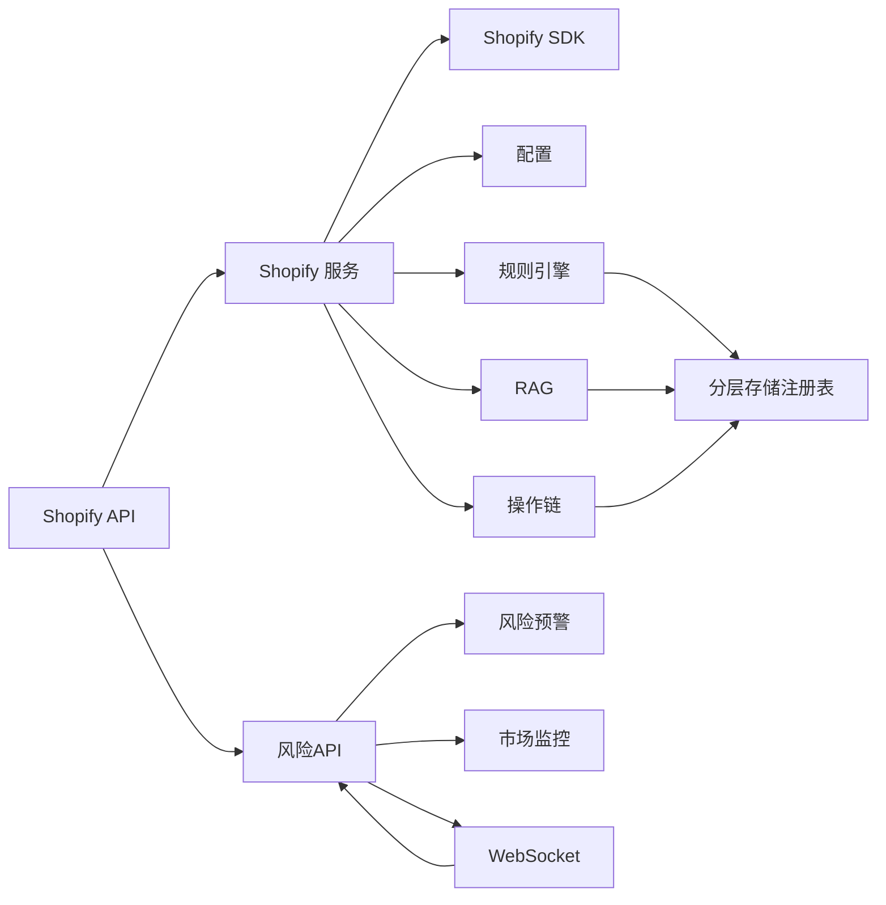

# 第三方集成

<cite>
**本文引用的文件**
- [backend/app/api/shopify.py](file://backend/app/api/shopify.py)
- [backend/app/services/shopify.py](file://backend/app/services/shopify.py)
- [backend/app/models/schemas.py](file://backend/app/models/schemas.py)
- [backend/app/config.py](file://backend/app/config.py)
- [backend/app/core/risk_alert.py](file://backend/app/core/risk_alert.py)
- [backend/app/api/risk.py](file://backend/app/api/risk.py)
- [backend/app/core/rule_engine.py](file://backend/app/core/rule_engine.py)
- [backend/app/core/action_chain.py](file://backend/app/core/action_chain.py)
- [backend/app/core/market_monitor.py](file://backend/app/core/market_monitor.py)
- [backend/app/core/nlu.py](file://backend/app/core/nlu.py)
- [backend/app/core/rag.py](file://backend/app/core/rag.py)
- [backend/app/services/compliance.py](file://backend/app/services/compliance.py)
- [backend/app/services/ws_manager.py](file://backend/app/services/ws_manager.py)
- [backend/app/storage/layer_registry.py](file://backend/app/storage/layer_registry.py)
</cite>

## 目录
1. [简介](#简介)
2. [项目结构](#项目结构)
3. [核心组件](#核心组件)
4. [架构总览](#架构总览)
5. [详细组件分析](#详细组件分析)
6. [依赖分析](#依赖分析)
7. [性能考量](#性能考量)
8. [故障排查指南](#故障排查指南)
9. [结论](#结论)
10. [附录](#附录)

## 简介
本指南面向需要对接第三方服务与API的开发者，提供从需求分析到部署上线的完整集成方法论。重点涵盖：
- 认证机制与API封装：以Shopify集成为范例，说明OAuth授权、令牌管理、SDK封装与Webhook校验。
- 合规检查流水线：产品数据同步、订单状态跟踪与合规检查的实现模式。
- 新认证/监管机构接入：数据格式转换、实时同步与状态更新的扩展方法。
- 风险监控系统扩展：新增风险指标、预警规则与通知机制的最佳实践。
- 设计模式应用：适配器模式、工厂模式、策略模式在API集成中的落地。
- 安全考虑：API密钥管理、请求签名与数据加密的实施要点。
- 完整集成示例：从需求分析到部署上线的全流程。

## 项目结构
后端采用FastAPI + Python，按“API路由 → 服务层 → 核心引擎/存储”的分层组织。Shopify集成位于API与服务层之间，提供OAuth授权、产品同步与Webhook校验；合规检查贯穿规则引擎、RAG检索与操作链追踪；风险监控通过市场扫描与预警引擎实现。

图表来源
- [backend/app/api/shopify.py:1-257](file://backend/app/api/shopify.py#L1-L257)
- [backend/app/api/risk.py:1-154](file://backend/app/api/risk.py#L1-L154)
- [backend/app/services/shopify.py:1-427](file://backend/app/services/shopify.py#L1-L427)
- [backend/app/services/compliance.py:1-35](file://backend/app/services/compliance.py#L1-L35)
- [backend/app/services/ws_manager.py:1-95](file://backend/app/services/ws_manager.py#L1-L95)
- [backend/app/core/rule_engine.py:1-247](file://backend/app/core/rule_engine.py#L1-L247)
- [backend/app/core/nlu.py:1-99](file://backend/app/core/nlu.py#L1-L99)
- [backend/app/core/rag.py:1-59](file://backend/app/core/rag.py#L1-L59)
- [backend/app/core/action_chain.py:1-236](file://backend/app/core/action_chain.py#L1-L236)
- [backend/app/core/market_monitor.py:1-156](file://backend/app/core/market_monitor.py#L1-L156)
- [backend/app/core/risk_alert.py:1-181](file://backend/app/core/risk_alert.py#L1-L181)
- [backend/app/storage/layer_registry.py:1-45](file://backend/app/storage/layer_registry.py#L1-L45)
- [backend/app/config.py:1-75](file://backend/app/config.py#L1-L75)

章节来源
- [backend/app/api/shopify.py:1-257](file://backend/app/api/shopify.py#L1-L257)
- [backend/app/services/shopify.py:1-427](file://backend/app/services/shopify.py#L1-L427)
- [backend/app/config.py:1-75](file://backend/app/config.py#L1-L75)

## 核心组件
- Shopify API路由：提供OAuth授权、回调、店铺列表、产品查询、合规检查与Webhook接收。
- Shopify服务层：封装OAuth授权URL构建、令牌交换、产品数据拉取、Webhook HMAC校验与数据模型转换。
- 风险/指标API：提供预警列表、未读数、忽略、手动触发扫描、市场状态与仪表盘等接口。
- 风险预警引擎：生成、持久化、查询预警，支持用户维度存储与最后扫描时间记录。
- 规则引擎：基于L0原始数据（HS编码、VAT、认证矩阵）进行确定性合规检查。
- NLU与RAG：NLU抽取用户意图，RAG检索法规知识增强合规报告。
- 操作链：记录每次合规检查的完整步骤，便于审计与回溯。
- 市场监控：委托Codex Agent执行联网搜索与影响分析，驱动风险预警。
- WebSocket管理：向前端实时推送扫描状态与预警消息。
- 分层存储注册表：统一访问L0-L5存储层，支撑规则引擎与RAG检索。

章节来源
- [backend/app/api/shopify.py:1-257](file://backend/app/api/shopify.py#L1-L257)
- [backend/app/services/shopify.py:1-427](file://backend/app/services/shopify.py#L1-L427)
- [backend/app/api/risk.py:1-154](file://backend/app/api/risk.py#L1-L154)
- [backend/app/core/risk_alert.py:1-181](file://backend/app/core/risk_alert.py#L1-L181)
- [backend/app/core/rule_engine.py:1-247](file://backend/app/core/rule_engine.py#L1-L247)
- [backend/app/core/nlu.py:1-99](file://backend/app/core/nlu.py#L1-L99)
- [backend/app/core/rag.py:1-59](file://backend/app/core/rag.py#L1-L59)
- [backend/app/core/action_chain.py:1-236](file://backend/app/core/action_chain.py#L1-L236)
- [backend/app/core/market_monitor.py:1-156](file://backend/app/core/market_monitor.py#L1-L156)
- [backend/app/services/ws_manager.py:1-95](file://backend/app/services/ws_manager.py#L1-L95)
- [backend/app/storage/layer_registry.py:1-45](file://backend/app/storage/layer_registry.py#L1-L45)

## 架构总览
下图展示了Shopify集成与合规检查的端到端流程，以及风险监控与实时通知的联动：

图表来源
- [backend/app/api/shopify.py:41-257](file://backend/app/api/shopify.py#L41-L257)
- [backend/app/services/shopify.py:144-427](file://backend/app/services/shopify.py#L144-L427)
- [backend/app/core/rule_engine.py:197-247](file://backend/app/core/rule_engine.py#L197-L247)
- [backend/app/core/rag.py:10-59](file://backend/app/core/rag.py#L10-L59)
- [backend/app/core/action_chain.py:77-184](file://backend/app/core/action_chain.py#L77-L184)
- [backend/app/api/risk.py:63-108](file://backend/app/api/risk.py#L63-L108)
- [backend/app/core/market_monitor.py:35-105](file://backend/app/core/market_monitor.py#L35-L105)
- [backend/app/core/risk_alert.py:32-82](file://backend/app/core/risk_alert.py#L32-L82)
- [backend/app/services/ws_manager.py:46-82](file://backend/app/services/ws_manager.py#L46-L82)

## 详细组件分析

### Shopify集成（认证、同步与合规）
- OAuth授权与回调
  - 授权URL构建：基于SDK生成官方授权链接，携带scope与redirect_uri。
  - 回调处理：SDK自动验证HMAC签名，交换授权码为长期访问令牌并持久化。
- 令牌管理
  - 令牌文件化存储，按shop命名；加载失败或缺失时抛出未授权错误。
- 产品数据同步
  - 通过SDK读取产品列表与详情，限制单次最大数量；封装为内部数据模型。
- Webhook验证
  - 基于客户端密钥计算HMAC，支持十六进制与Base64两种编码对比。
- 合规检查流程
  - 产品详情 → 构建查询 → 规则引擎 → RAG检索 → 操作链记录 → 返回报告。

图表来源
- [backend/app/api/shopify.py:127-201](file://backend/app/api/shopify.py#L127-L201)
- [backend/app/services/shopify.py:257-427](file://backend/app/services/shopify.py#L257-L427)
- [backend/app/core/rule_engine.py:197-247](file://backend/app/core/rule_engine.py#L197-L247)
- [backend/app/core/rag.py:10-59](file://backend/app/core/rag.py#L10-L59)
- [backend/app/core/action_chain.py:77-184](file://backend/app/core/action_chain.py#L77-L184)

章节来源
- [backend/app/api/shopify.py:41-257](file://backend/app/api/shopify.py#L41-L257)
- [backend/app/services/shopify.py:144-427](file://backend/app/services/shopify.py#L144-L427)
- [backend/app/models/schemas.py:10-104](file://backend/app/models/schemas.py#L10-L104)

### 风险监控系统扩展
- 预警生成与持久化
  - create_alert：生成并写入用户维度的预警文件；dismiss_alert：忽略预警；get_alerts：分页与筛选；统计未读数。
- 市场扫描
  - MarketMonitor委托Codex Agent执行联网搜索与影响分析；API触发扫描并实时推送状态与预警。
- 实时通知
  - ws_manager：维护用户到WebSocket集合，推送预警与扫描状态；异常连接自动清理。

图表来源
- [backend/app/api/risk.py:63-108](file://backend/app/api/risk.py#L63-L108)
- [backend/app/core/market_monitor.py:35-105](file://backend/app/core/market_monitor.py#L35-L105)
- [backend/app/core/risk_alert.py:32-82](file://backend/app/core/risk_alert.py#L32-L82)
- [backend/app/services/ws_manager.py:46-82](file://backend/app/services/ws_manager.py#L46-L82)

章节来源
- [backend/app/api/risk.py:1-154](file://backend/app/api/risk.py#L1-L154)
- [backend/app/core/risk_alert.py:1-181](file://backend/app/core/risk_alert.py#L1-L181)
- [backend/app/core/market_monitor.py:1-156](file://backend/app/core/market_monitor.py#L1-L156)
- [backend/app/services/ws_manager.py:1-95](file://backend/app/services/ws_manager.py#L1-L95)

### 设计模式应用
- 适配器模式
  - Shopify服务层对第三方SDK进行封装，屏蔽底层HTTP调用与数据转换细节，向上提供统一接口。
- 工厂模式
  - 配置类Settings集中管理各类API密钥与参数，作为“工厂”为各模块提供运行时配置。
- 策略模式
  - 规则引擎根据目标国家与产品特征选择不同策略（HS查找、VAT查询、认证矩阵、风险标志），组合为确定性检查流程。

章节来源
- [backend/app/services/shopify.py:24-30](file://backend/app/services/shopify.py#L24-L30)
- [backend/app/config.py:5-75](file://backend/app/config.py#L5-L75)
- [backend/app/core/rule_engine.py:197-247](file://backend/app/core/rule_engine.py#L197-L247)

### 数据模型与序列化
- Shopify模型：认证请求、回调参数、店铺信息、产品信息、变体信息、合规检查请求与导入请求。
- 合规结果：包含HS编码、VAT税率、认证列表、风险等级与评分、风险提示、物流提示、清关文件清单、文化注意事项、整改建议与待办清单。
- 操作链模型：节点包含类型、代理、输入输出、状态与耗时；链包含节点列表与自然语言轨迹。
- 事件链模型：事件节点与事件链，支持按来源/主题组织。

章节来源
- [backend/app/models/schemas.py:10-264](file://backend/app/models/schemas.py#L10-L264)
- [backend/app/core/action_chain.py:23-184](file://backend/app/core/action_chain.py#L23-L184)

## 依赖分析
- 组件耦合
  - API层依赖服务层；服务层依赖SDK与配置；合规检查串联规则引擎、RAG与操作链；风险监控依赖Codex Agent与WebSocket。
- 外部依赖
  - Shopify SDK：OAuth授权、产品API调用。
  - LLM/OpenAI客户端：NLU与RAG检索。
  - 文件系统：令牌与操作链JSON存储。
- 循环依赖
  - 未见直接循环；通过分层与注册表解耦。

图表来源
- [backend/app/api/shopify.py:1-257](file://backend/app/api/shopify.py#L1-L257)
- [backend/app/services/shopify.py:1-427](file://backend/app/services/shopify.py#L1-L427)
- [backend/app/api/risk.py:1-154](file://backend/app/api/risk.py#L1-L154)
- [backend/app/core/risk_alert.py:1-181](file://backend/app/core/risk_alert.py#L1-L181)
- [backend/app/core/market_monitor.py:1-156](file://backend/app/core/market_monitor.py#L1-L156)
- [backend/app/services/ws_manager.py:1-95](file://backend/app/services/ws_manager.py#L1-L95)
- [backend/app/storage/layer_registry.py:1-45](file://backend/app/storage/layer_registry.py#L1-L45)

## 性能考量
- 异步执行与线程池
  - SDK调用在事件循环外执行，避免阻塞；通过线程池调度同步SDK方法。
- 限流与批量
  - 产品查询限制单次最大数量；RAG检索设置top_k，避免过多上下文。
- 存储与I/O
  - 令牌与操作链采用JSON文件存储，注意磁盘I/O与并发写入；建议在高并发场景引入锁或队列。
- 缓存与降级
  - 规则引擎在L0数据缺失时返回空结果并降级，保证稳定性。

章节来源
- [backend/app/services/shopify.py:131-137](file://backend/app/services/shopify.py#L131-L137)
- [backend/app/services/shopify.py:279-308](file://backend/app/services/shopify.py#L279-L308)
- [backend/app/core/rule_engine.py:1-11](file://backend/app/core/rule_engine.py#L1-L11)

## 故障排查指南
- OAuth授权失败
  - 检查回调参数完整性与HMAC签名；确认客户端ID/密钥与scope配置正确。
- 未授权访问
  - 确认令牌文件存在且未过期；检查shop域名格式。
- Webhook被拒绝
  - 核对客户端密钥；确认请求头X-Shopify-Hmac-SHA256与Body一致。
- 预警未推送
  - 检查WebSocket连接状态；确认用户ID与连接映射；查看异常连接清理日志。
- 扫描无结果
  - 检查Codex Agent可用性与网络；确认市场监控返回事件列表非空。

章节来源
- [backend/app/services/shopify.py:367-393](file://backend/app/services/shopify.py#L367-L393)
- [backend/app/api/shopify.py:223-226](file://backend/app/api/shopify.py#L223-L226)
- [backend/app/services/ws_manager.py:46-82](file://backend/app/services/ws_manager.py#L46-L82)
- [backend/app/api/risk.py:105-107](file://backend/app/api/risk.py#L105-L107)

## 结论
本项目提供了清晰的分层架构与成熟的第三方集成范式：以Shopify为例，结合OAuth、SDK封装、Webhook校验与合规检查流水线；通过规则引擎与RAG实现确定性与增强性合规；借助操作链与事件链保障可追溯性；通过风险监控与WebSocket实现实时预警。上述设计模式与安全实践可直接迁移至其他第三方服务与监管机构接入。

## 附录

### 第三方服务集成通用流程
- 需求分析
  - 明确认证方式（OAuth/JWT/签名）、数据范围与同步频率、事件回调类型。
- 配置与密钥管理
  - 在配置中新增客户端ID/密钥、回调地址、scope与API版本；密钥通过环境变量注入。
- 认证与授权
  - 实现授权URL构建与回调处理；在回调中校验签名并交换令牌；持久化令牌。
- API封装
  - 基于SDK或HTTP客户端封装常用接口；统一错误处理与重试策略。
- 数据同步
  - 定时任务或事件驱动拉取增量数据；转换为内部数据模型；记录操作链。
- 合规检查
  - 规则引擎先行，必要时RAG检索增强；输出合规报告与整改建议。
- 实时通知
  - WebSocket推送扫描状态与预警；支持忽略与未读统计。
- 安全与监控
  - 请求签名/HMAC校验、密钥轮换、日志审计与告警阈值。

章节来源
- [backend/app/config.py:55-61](file://backend/app/config.py#L55-L61)
- [backend/app/services/shopify.py:144-200](file://backend/app/services/shopify.py#L144-L200)
- [backend/app/api/shopify.py:203-257](file://backend/app/api/shopify.py#L203-L257)
- [backend/app/core/risk_alert.py:32-82](file://backend/app/core/risk_alert.py#L32-L82)
- [backend/app/services/ws_manager.py:46-82](file://backend/app/services/ws_manager.py#L46-L82)