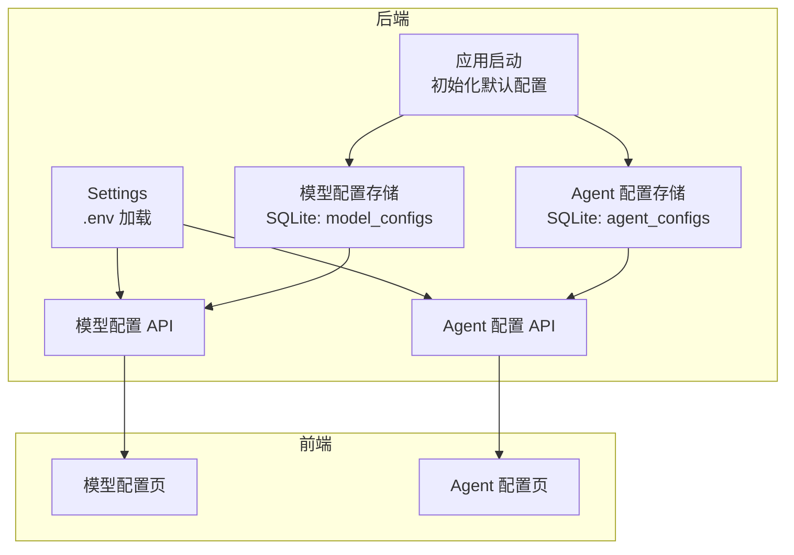
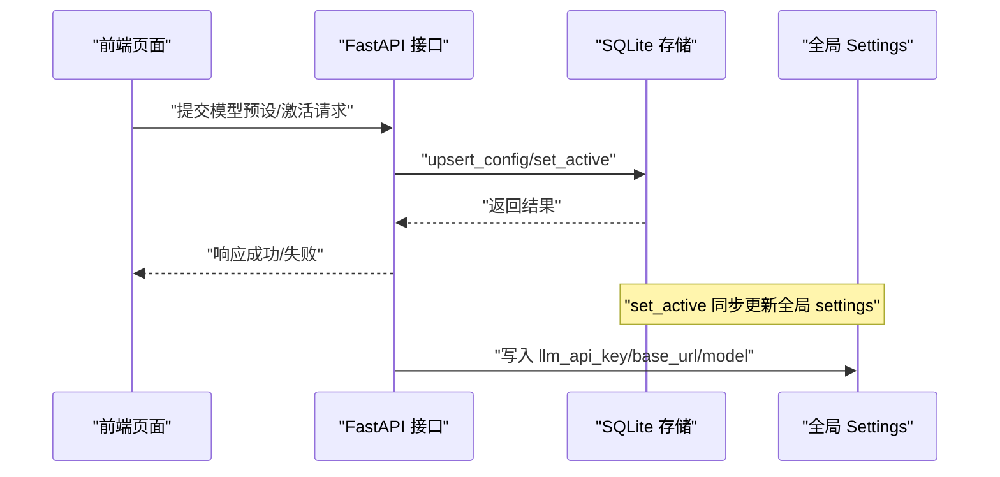
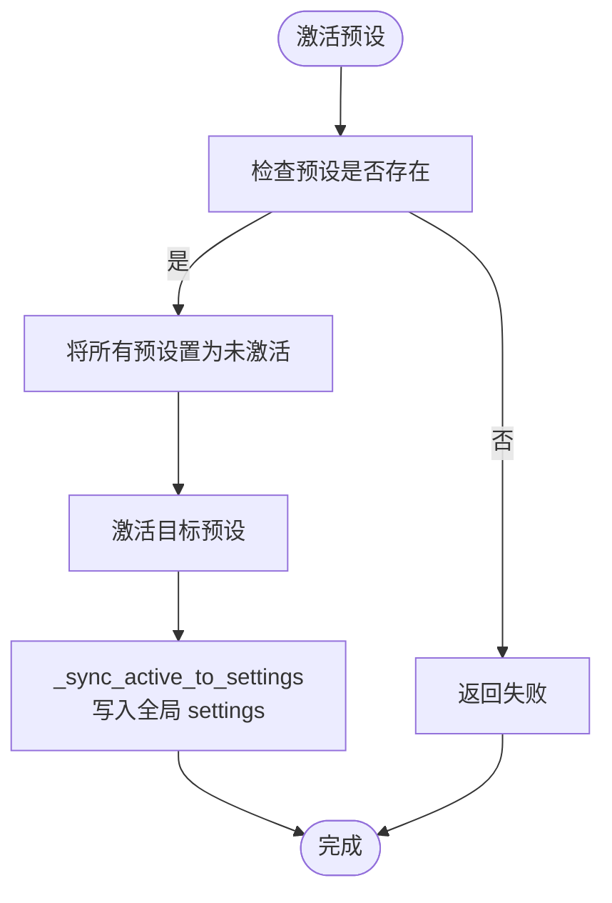
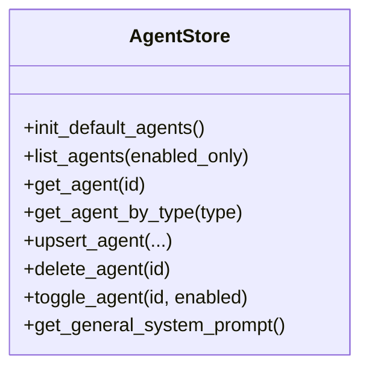
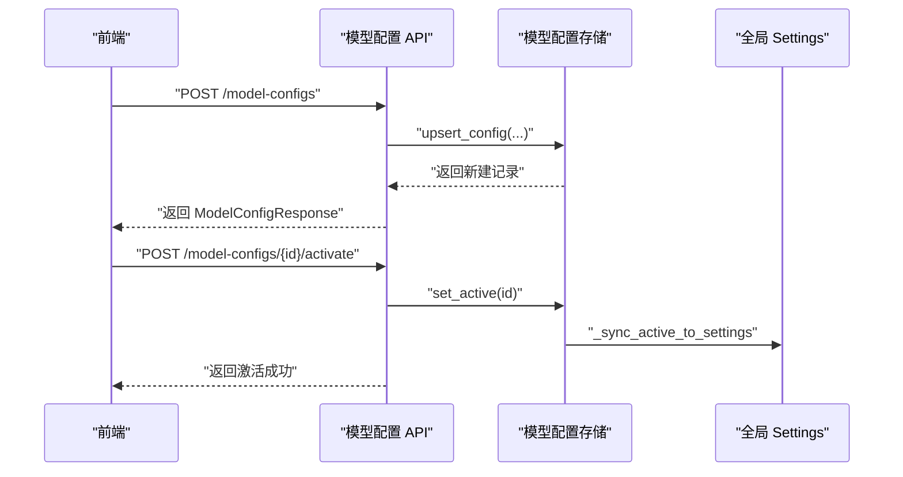
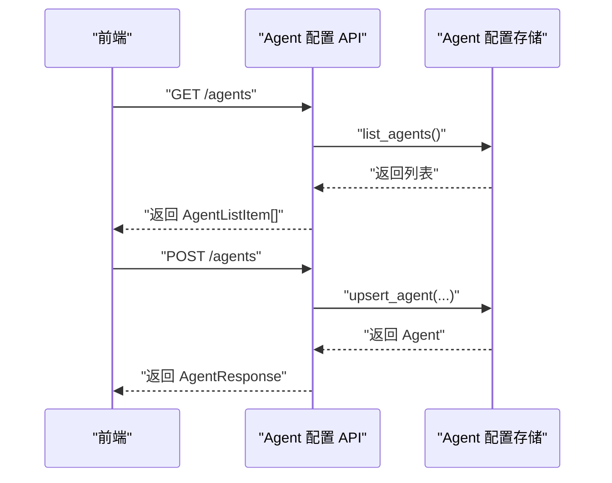
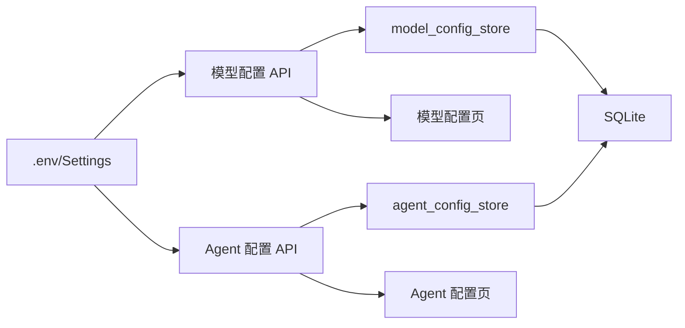

# 配置管理

<cite>
**本文引用的文件**
- [backend/app/config.py](file://backend/app/config.py)
- [backend/app/storage/model_config_store.py](file://backend/app/storage/model_config_store.py)
- [backend/app/storage/agent_config_store.py](file://backend/app/storage/agent_config_store.py)
- [backend/app/api/model_config.py](file://backend/app/api/model_config.py)
- [backend/app/api/agent_config.py](file://backend/app/api/agent_config.py)
- [backend/app/main.py](file://backend/app/main.py)
- [backend/scripts/migrate_storage.py](file://backend/scripts/migrate_storage.py)
- [frontend/src/pages/AgentConfigPage.tsx](file://frontend/src/pages/AgentConfigPage.tsx)
- [frontend/src/pages/ModelConfigPage.tsx](file://frontend/src/pages/ModelConfigPage.tsx)
- [backend/data/prompts/impact_analysis.yaml](file://backend/data/prompts/impact_analysis.yaml)
</cite>

## 目录
1. [简介](#简介)
2. [项目结构](#项目结构)
3. [核心组件](#核心组件)
4. [架构总览](#架构总览)
5. [详细组件分析](#详细组件分析)
6. [依赖关系分析](#依赖关系分析)
7. [性能考量](#性能考量)
8. [故障排除指南](#故障排除指南)
9. [结论](#结论)
10. [附录](#附录)

## 简介
本指南系统阐述本项目的配置管理体系，涵盖全局配置、Agent 配置与模型配置的层次结构与扩展方式，说明配置存储机制（SQLite + 全局 settings 热更新）、配置验证与默认值策略、配置热更新流程、最佳实践（分类、命名、版本控制）、Agent 自定义选项（行为参数、阈值、优先级）、模型配置扩展（新模型接入、参数调整、性能优化）、配置迁移与回滚策略，并提供可直接参考的扩展示例与故障排除建议。

## 项目结构
配置相关的关键位置与职责如下：
- 全局配置：通过 pydantic-settings 从 .env 文件加载，集中于 Settings 类，提供应用、数据库、LLM、调度、Shopify、JWT 等全局参数。
- 模型配置：以“预设”形式存储于 SQLite（复用 sessions.db），支持多预设、激活切换与热更新至全局 settings。
- Agent 配置：以“系统提示词”为核心的多 Agent 存储，支持内置默认 Agent 与用户自定义 Agent，提供启用/禁用、排序、CRUD。
- API 层：提供模型配置与 Agent 配置的 REST 接口，区分 admin 写与 user 只读。
- 前端页面：提供可视化界面，支持模型预设与 Agent 的增删改查、激活、测试连接等。
- 启动流程：应用启动时自动初始化默认模型配置与默认 Agent。
- 迁移脚本：提供数据迁移能力，便于配置与知识数据的演进。

图表来源
- [backend/app/config.py:1-75](file://backend/app/config.py#L1-L75)
- [backend/app/storage/model_config_store.py:1-174](file://backend/app/storage/model_config_store.py#L1-L174)
- [backend/app/storage/agent_config_store.py:1-310](file://backend/app/storage/agent_config_store.py#L1-L310)
- [backend/app/api/model_config.py:1-173](file://backend/app/api/model_config.py#L1-L173)
- [backend/app/api/agent_config.py:1-174](file://backend/app/api/agent_config.py#L1-L174)
- [backend/app/main.py:60-70](file://backend/app/main.py#L60-L70)

章节来源
- [backend/app/config.py:1-75](file://backend/app/config.py#L1-L75)
- [backend/app/main.py:60-70](file://backend/app/main.py#L60-L70)

## 核心组件
- 全局配置（Settings）
  - 来源：.env 文件，使用 pydantic-settings 解析，支持额外字段忽略。
  - 关键域：应用名、调试模式、Codex 开关与参数、数据库连接、主 LLM 与备用 LLM、Chroma、知识目录、Prompts 目录、技能目录、调度器开关与轮询间隔、Shopify 参数、风险告警目录、JWT 密钥与过期时间。
  - 作用：为整个系统提供统一的运行参数，部分字段支持“主 LLM 覆盖备用 LLM”的逻辑。

- 模型配置存储（model_config_store）
  - 结构：model_configs 表，包含 id、name、api_key、base_url、model、temperature、top_p、max_tokens、embed_model、is_active、created_at、updated_at。
  - 能力：列表、查询、新建/更新、删除、激活（is_active 唯一生效），以及“热更新”到全局 settings。
  - 热更新：set_active 时同步更新 settings 的 llm_api_key、llm_base_url、llm_model，使后续 NLU 客户端重建以应用新参数。

- Agent 配置存储（agent_config_store）
  - 结构：agent_configs 表，包含 id、name、type、description、system_prompt、enabled、sort_order、created_at、updated_at。
  - 能力：默认内置 Agent 预设、初始化填充、CRUD、启用/禁用、按类型检索、通用 system prompt 获取。
  - 保护：内置 Agent ID 不可删除，防止误删核心配置。

- API 层
  - 模型配置 API：admin 可写，用户只读激活配置；提供新建、更新、删除、激活接口。
  - Agent 配置 API：admin 可写，用户只读；提供列表、详情、新建、更新、删除、启用/禁用接口。

- 前端页面
  - 模型配置页：支持新建/编辑/删除/激活预设，测试后端连接。
  - Agent 配置页：支持新建/编辑/删除/启用/禁用，内置 Agent 不可删除，支持按类型标签展示。

- 启动流程
  - startup 事件中初始化默认管理员、默认模型配置、默认 Agent，确保首次运行具备可用配置。

章节来源
- [backend/app/config.py:5-75](file://backend/app/config.py#L5-L75)
- [backend/app/storage/model_config_store.py:18-174](file://backend/app/storage/model_config_store.py#L18-L174)
- [backend/app/storage/agent_config_store.py:14-310](file://backend/app/storage/agent_config_store.py#L14-L310)
- [backend/app/api/model_config.py:1-173](file://backend/app/api/model_config.py#L1-L173)
- [backend/app/api/agent_config.py:1-174](file://backend/app/api/agent_config.py#L1-L174)
- [frontend/src/pages/ModelConfigPage.tsx:1-441](file://frontend/src/pages/ModelConfigPage.tsx#L1-L441)
- [frontend/src/pages/AgentConfigPage.tsx:1-450](file://frontend/src/pages/AgentConfigPage.tsx#L1-L450)
- [backend/app/main.py:60-70](file://backend/app/main.py#L60-L70)

## 架构总览
下图展示了配置体系的分层与交互：前端通过 API 与后端交互，后端以 SQLite 存储配置，同时将“激活的模型配置”同步到全局 settings，实现热更新。

图表来源
- [backend/app/api/model_config.py:146-151](file://backend/app/api/model_config.py#L146-L151)
- [backend/app/storage/model_config_store.py:118-132](file://backend/app/storage/model_config_store.py#L118-L132)
- [backend/app/storage/model_config_store.py:143-156](file://backend/app/storage/model_config_store.py#L143-L156)

章节来源
- [backend/app/api/model_config.py:146-151](file://backend/app/api/model_config.py#L146-L151)
- [backend/app/storage/model_config_store.py:118-156](file://backend/app/storage/model_config_store.py#L118-L156)

## 详细组件分析

### 全局配置（Settings）与 .env
- 配置来源：.env 文件，使用 pydantic-settings 解析，extra 设置为忽略未知字段，便于向后兼容。
- 关键要点：
  - 主 LLM 与备用 LLM 的覆盖逻辑：active_llm_api_key 与 active_llm_base_url 支持主 LLM 优先。
  - 数据库、知识、Prompts、Chroma、调度器、Shopify、JWT 等参数集中管理。
- 扩展建议：
  - 新增配置项时，先在 Settings 中添加字段与默认值，再在 .env 中补充对应键值。
  - 若涉及敏感信息，优先通过 .env 注入，避免硬编码。

章节来源
- [backend/app/config.py:5-75](file://backend/app/config.py#L5-L75)

### 模型配置存储与热更新
- 表结构与字段：id、name、api_key、base_url、model、temperature、top_p、max_tokens、embed_model、is_active、created_at、updated_at。
- 热更新机制：
  - set_active 将其余记录置 0，仅激活一条；
  - 调用 _sync_active_to_settings 将激活记录的 api_key/base_url/model 写入全局 settings；
  - 下次 NLU 客户端重建时应用新参数。
- 安全与可见性：
  - 列表接口默认不返回完整 api_key，仅返回遮蔽后的 api_key_masked；
  - 详情/激活接口返回完整 api_key，需通过 JWT 保护。

图表来源
- [backend/app/storage/model_config_store.py:118-132](file://backend/app/storage/model_config_store.py#L118-L132)
- [backend/app/storage/model_config_store.py:143-156](file://backend/app/storage/model_config_store.py#L143-L156)

章节来源
- [backend/app/storage/model_config_store.py:18-174](file://backend/app/storage/model_config_store.py#L18-L174)
- [backend/app/api/model_config.py:62-90](file://backend/app/api/model_config.py#L62-L90)

### Agent 配置存储与内置默认 Agent
- 表结构：agent_configs，包含 id、name、type、description、system_prompt、enabled、sort_order、created_at、updated_at。
- 内置默认 Agent：通用合规、出境法律、税务、民俗文化、认证标准等，初始化时自动写入。
- 能力：按类型检索、启用/禁用、CRUD、通用 system prompt 获取。
- 安全：内置 Agent ID 不可删除，防止破坏核心系统。

图表来源
- [backend/app/storage/agent_config_store.py:183-310](file://backend/app/storage/agent_config_store.py#L183-L310)

章节来源
- [backend/app/storage/agent_config_store.py:14-310](file://backend/app/storage/agent_config_store.py#L14-L310)
- [backend/app/api/agent_config.py:61-157](file://backend/app/api/agent_config.py#L61-L157)

### API 工作流（模型配置）

图表来源
- [backend/app/api/model_config.py:93-151](file://backend/app/api/model_config.py#L93-L151)
- [backend/app/storage/model_config_store.py:75-132](file://backend/app/storage/model_config_store.py#L75-L132)

章节来源
- [backend/app/api/model_config.py:1-173](file://backend/app/api/model_config.py#L1-L173)
- [backend/app/storage/model_config_store.py:18-174](file://backend/app/storage/model_config_store.py#L18-L174)

### API 工作流（Agent 配置）

图表来源
- [backend/app/api/agent_config.py:61-157](file://backend/app/api/agent_config.py#L61-L157)
- [backend/app/storage/agent_config_store.py:203-270](file://backend/app/storage/agent_config_store.py#L203-L270)

章节来源
- [backend/app/api/agent_config.py:1-174](file://backend/app/api/agent_config.py#L1-L174)
- [backend/app/storage/agent_config_store.py:14-310](file://backend/app/storage/agent_config_store.py#L14-L310)

### 前端页面与配置交互
- 模型配置页：支持新建/编辑/删除/激活预设，测试后端连接；激活后提示后续对话将使用新配置。
- Agent 配置页：支持新建/编辑/删除/启用/禁用，内置 Agent 不可删除；支持按类型标签展示与排序。

章节来源
- [frontend/src/pages/ModelConfigPage.tsx:1-441](file://frontend/src/pages/ModelConfigPage.tsx#L1-L441)
- [frontend/src/pages/AgentConfigPage.tsx:1-450](file://frontend/src/pages/AgentConfigPage.tsx#L1-L450)

### 启动时初始化与默认配置
- startup 事件中依次初始化默认管理员、默认模型配置、默认 Agent，确保首次运行具备可用配置。
- 默认模型配置：若 model_configs 表为空，则从当前 settings 导入为默认预设并激活。
- 默认 Agent：若 agent_configs 表为空，则写入内置默认 Agent 预设。

章节来源
- [backend/app/main.py:60-70](file://backend/app/main.py#L60-L70)
- [backend/app/storage/model_config_store.py:159-174](file://backend/app/storage/model_config_store.py#L159-L174)
- [backend/app/storage/agent_config_store.py:183-198](file://backend/app/storage/agent_config_store.py#L183-L198)

## 依赖关系分析
- 组件耦合：
  - API 层依赖存储层（agent_config_store、model_config_store）。
  - 存储层依赖 SQLite（复用 sessions.db）。
  - 模型配置存储依赖全局 settings 进行热更新。
  - 前端页面依赖 API 接口。
- 外部依赖：
  - pydantic-settings 用于 .env 解析。
  - FastAPI 提供路由与依赖注入。
  - SQLite 作为轻量持久化存储。

图表来源
- [backend/app/config.py:5-75](file://backend/app/config.py#L5-L75)
- [backend/app/api/model_config.py:1-173](file://backend/app/api/model_config.py#L1-L173)
- [backend/app/api/agent_config.py:1-174](file://backend/app/api/agent_config.py#L1-L174)
- [backend/app/storage/model_config_store.py:18-174](file://backend/app/storage/model_config_store.py#L18-L174)
- [backend/app/storage/agent_config_store.py:14-310](file://backend/app/storage/agent_config_store.py#L14-L310)

章节来源
- [backend/app/config.py:5-75](file://backend/app/config.py#L5-L75)
- [backend/app/api/model_config.py:1-173](file://backend/app/api/model_config.py#L1-L173)
- [backend/app/api/agent_config.py:1-174](file://backend/app/api/agent_config.py#L1-L174)
- [backend/app/storage/model_config_store.py:18-174](file://backend/app/storage/model_config_store.py#L18-L174)
- [backend/app/storage/agent_config_store.py:14-310](file://backend/app/storage/agent_config_store.py#L14-L310)

## 性能考量
- 存储层：
  - 使用 SQLite 单机存储，适合中小规模配置管理；若并发较高，可考虑引入连接池或迁移至更健壮的数据库。
- 热更新：
  - set_active 仅更新 settings 的少数字段，开销较小；NLU 客户端重建成本取决于实现，建议在业务低峰期进行切换。
- 前端：
  - 列表接口返回预览字段（如 system_prompt_preview），减少传输体积；激活接口返回完整密钥时需谨慎保护。

## 故障排除指南
- 激活模型预设后无效
  - 检查是否成功 set_active，确认 is_active 标志正确；
  - 检查 _sync_active_to_settings 是否执行，确认 settings 的 llm_api_key/base_url/model 已更新；
  - 确认 NLU 客户端是否因 _client_key 不匹配而重建。
- Agent 无法删除
  - 内置 Agent ID 不可删除，确认所选 id 是否在内置集合中。
- 前端报错“保存失败”
  - 检查必填字段（如名称、System Prompt）是否填写；
  - 查看后端返回的 detail 错误信息，定位具体问题。
- 启动后无默认配置
  - 确认 startup 是否执行了 init_default_config_if_empty 与 init_default_agents；
  - 检查数据库表是否已创建与初始化。

章节来源
- [backend/app/storage/model_config_store.py:118-156](file://backend/app/storage/model_config_store.py#L118-L156)
- [backend/app/storage/agent_config_store.py:273-283](file://backend/app/storage/agent_config_store.py#L273-L283)
- [backend/app/api/model_config.py:138-151](file://backend/app/api/model_config.py#L138-L151)
- [backend/app/api/agent_config.py:144-149](file://backend/app/api/agent_config.py#L144-L149)
- [backend/app/main.py:60-70](file://backend/app/main.py#L60-L70)

## 结论
本项目的配置管理采用“全局 Settings + SQLite 存储 + API 管理 + 前端可视化”的分层设计，既保证了灵活性与可扩展性，又提供了热更新与默认初始化能力。通过合理的字段划分、权限控制与安全策略，能够满足生产环境下的配置治理需求。建议在扩展新配置项时遵循本文的最佳实践，并结合迁移脚本与版本控制策略，确保配置演进的稳定性与可追溯性。

## 附录

### 配置扩展指南（新增配置项、验证规则与默认值）
- 新增全局配置项
  - 在 Settings 中添加字段与默认值；
  - 在 .env 中补充对应键值；
  - 如需覆盖逻辑（如主 LLM 覆盖备用 LLM），可在 Settings 中增加 property 方法。
- 新增模型配置项
  - 在 model_configs 表结构中增加列（需迁移脚本支持）；
  - 在 upsert_config 与响应模型中同步新增字段；
  - 在 _sync_active_to_settings 中同步写入 settings。
- 新增 Agent 配置项
  - 在 agent_configs 表结构中增加列；
  - 在 upsert_agent 与响应模型中同步新增字段；
  - 在前端 Agent 配置页中增加表单项与校验。
- 验证规则与默认值
  - 使用 Pydantic BaseModel 作为 API 请求模型，利用字段默认值与类型约束；
  - 前端表单进行基础校验（如必填、长度、数值范围）。
- 默认值设置
  - Settings 提供全局默认值；
  - 启动时初始化默认模型配置与默认 Agent。

章节来源
- [backend/app/config.py:5-75](file://backend/app/config.py#L5-L75)
- [backend/app/storage/model_config_store.py:75-115](file://backend/app/storage/model_config_store.py#L75-L115)
- [backend/app/storage/agent_config_store.py:236-270](file://backend/app/storage/agent_config_store.py#L236-L270)
- [backend/app/api/model_config.py:36-45](file://backend/app/api/model_config.py#L36-L45)
- [backend/app/api/agent_config.py:46-57](file://backend/app/api/agent_config.py#L46-L57)

### 配置存储机制与热更新
- 存储机制
  - 模型配置与 Agent 配置均存储于 SQLite；
  - 通过 CRUD 接口进行管理。
- 缓存策略
  - 当前未见显式缓存层；可通过应用内缓存或外部缓存（如 Redis）增强读性能（建议）。
- 热更新
  - set_active 同步更新全局 settings，下次 NLU 客户端重建时生效。

章节来源
- [backend/app/storage/model_config_store.py:118-156](file://backend/app/storage/model_config_store.py#L118-L156)

### 最佳实践（分类、命名规范、版本控制）
- 配置分类
  - 全局配置：应用、数据库、LLM、调度、Shopify、JWT 等；
  - 模型配置：预设（含温度、Top-P、最大 Token 等推理参数）；
  - Agent 配置：系统提示词、类型、启用状态、排序。
- 命名规范
  - 全局配置：使用下划线命名，语义清晰；
  - 模型配置：预设名称具有辨识度（如“MiMo v2.5 Pro”）；
  - Agent 类型：内置类型使用小写字母与下划线，自定义使用 custom_ 前缀。
- 版本控制
  - 将 .env 与配置相关 YAML/JSON 放入版本控制；
  - 迁移脚本记录变更，便于回滚与审计。

章节来源
- [backend/app/config.py:5-75](file://backend/app/config.py#L5-L75)
- [frontend/src/pages/AgentConfigPage.tsx:22-36](file://frontend/src/pages/AgentConfigPage.tsx#L22-L36)
- [backend/data/prompts/impact_analysis.yaml:1-19](file://backend/data/prompts/impact_analysis.yaml#L1-L19)

### Agent 配置自定义选项
- 行为参数：enabled、sort_order 控制显示与优先级；
- 阈值设置：可通过 system_prompt 中的规则与输出格式约束；
- 优先级配置：sort_order 控制列表排序；
- 类型与标签：type 与前端 TYPE_LABELS 映射，便于分类管理。

章节来源
- [backend/app/storage/agent_config_store.py:203-233](file://backend/app/storage/agent_config_store.py#L203-L233)
- [frontend/src/pages/AgentConfigPage.tsx:22-36](file://frontend/src/pages/AgentConfigPage.tsx#L22-L36)

### 模型配置扩展方法
- 新模型接入：在模型配置页新建预设，填写 api_key、base_url、model 等；
- 参数调整：temperature、top_p、max_tokens、embed_model 等；
- 性能优化：根据场景选择合适的 temperature 与 max_tokens，减少不必要的上下文长度。

章节来源
- [frontend/src/pages/ModelConfigPage.tsx:32-41](file://frontend/src/pages/ModelConfigPage.tsx#L32-L41)
- [backend/app/api/model_config.py:36-45](file://backend/app/api/model_config.py#L36-L45)

### 配置迁移与回滚策略
- 迁移脚本
  - 将旧数据文件迁移到 L0-L5 分层存储；
  - 迁移事件链与操作链到 L5；
  - 生成认证矩阵文件。
- 回滚策略
  - 迁移脚本不覆盖已有文件，可在确认无误后再清理旧文件；
  - 建议在迁移前备份数据库与 .env。

章节来源
- [backend/scripts/migrate_storage.py:1-99](file://backend/scripts/migrate_storage.py#L1-L99)

### 实际扩展示例（路径指引）
- 新增全局配置项
  - 在 [Settings:5-75](file://backend/app/config.py#L5-L75) 中添加字段与默认值；
  - 在 [.env:69-72](file://backend/app/config.py#L69-L72) 中补充键值。
- 新增模型配置项
  - 在 [model_config_store:18-39](file://backend/app/storage/model_config_store.py#L18-L39) 中扩展表结构；
  - 在 [upsert_config:75-115](file://backend/app/storage/model_config_store.py#L75-L115) 与响应模型中同步；
  - 在 [_sync_active_to_settings:143-156](file://backend/app/storage/model_config_store.py#L143-L156) 中同步写入 settings。
- 新增 Agent 配置项
  - 在 [agent_config_store:163-178](file://backend/app/storage/agent_config_store.py#L163-L178) 中扩展表结构；
  - 在 [upsert_agent:236-270](file://backend/app/storage/agent_config_store.py#L236-L270) 与响应模型中同步；
  - 在 [AgentConfigPage:41-48](file://frontend/src/pages/AgentConfigPage.tsx#L41-48) 中增加表单项。
- 配置热更新
  - 通过 [set_active:118-132](file://backend/app/storage/model_config_store.py#L118-L132) 与 [_sync_active_to_settings:143-156](file://backend/app/storage/model_config_store.py#L143-L156) 触发。

章节来源
- [backend/app/config.py:5-75](file://backend/app/config.py#L5-L75)
- [backend/app/storage/model_config_store.py:18-174](file://backend/app/storage/model_config_store.py#L18-L174)
- [backend/app/storage/agent_config_store.py:14-310](file://backend/app/storage/agent_config_store.py#L14-L310)
- [frontend/src/pages/AgentConfigPage.tsx:1-450](file://frontend/src/pages/AgentConfigPage.tsx#L1-L450)