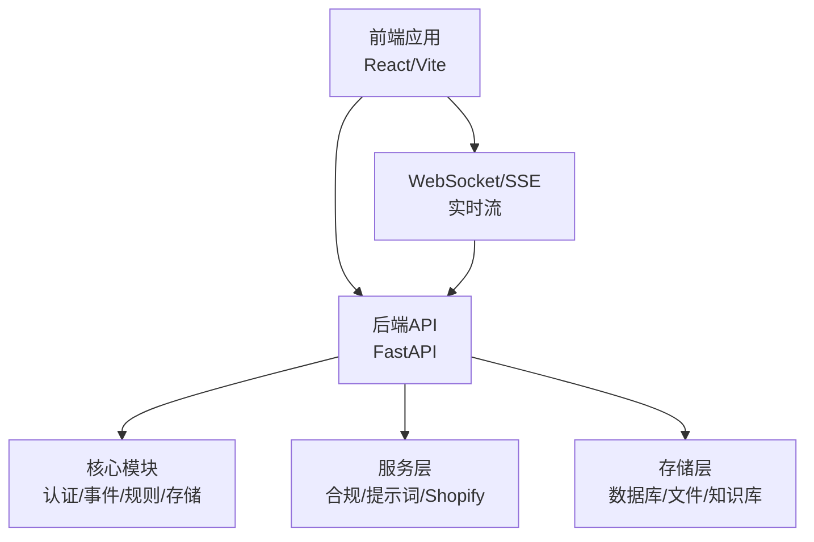
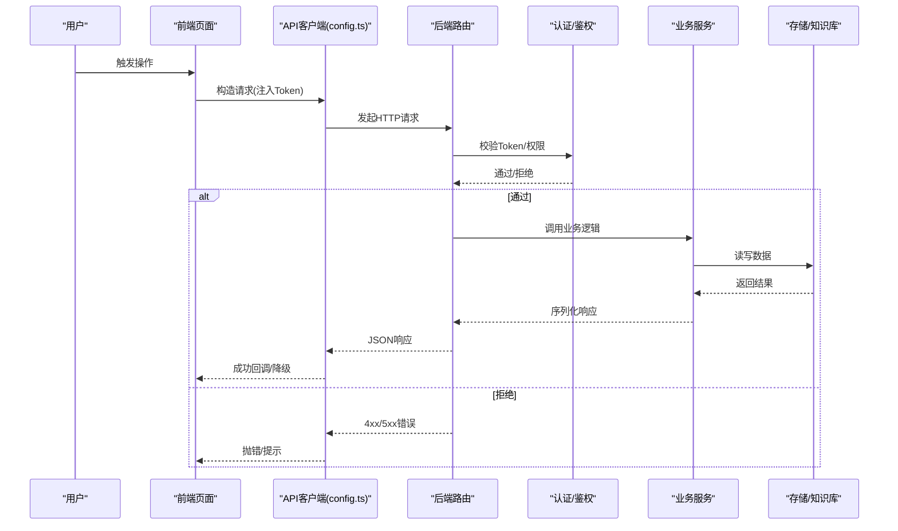
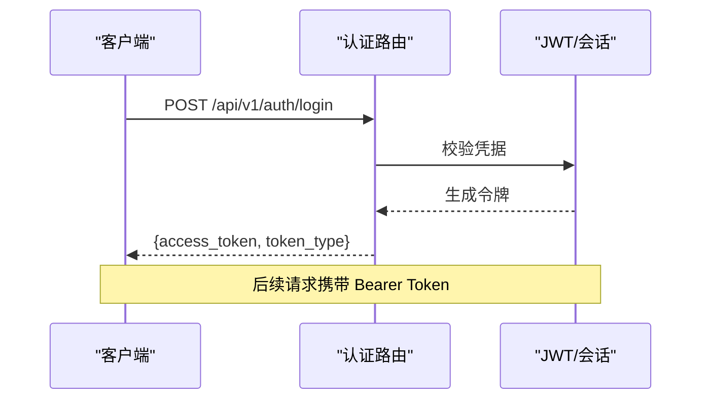
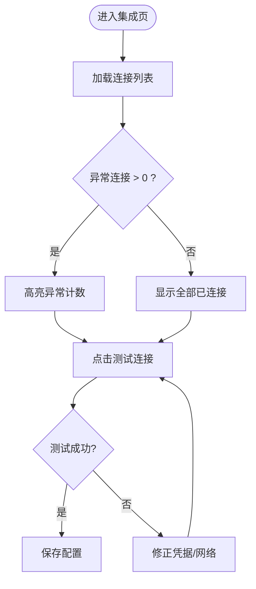
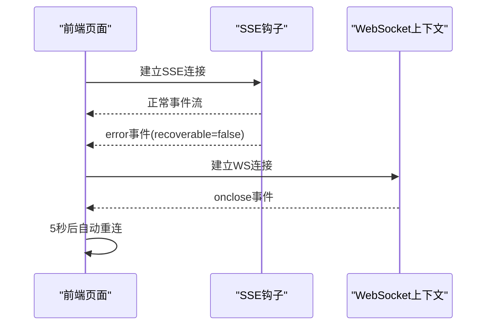
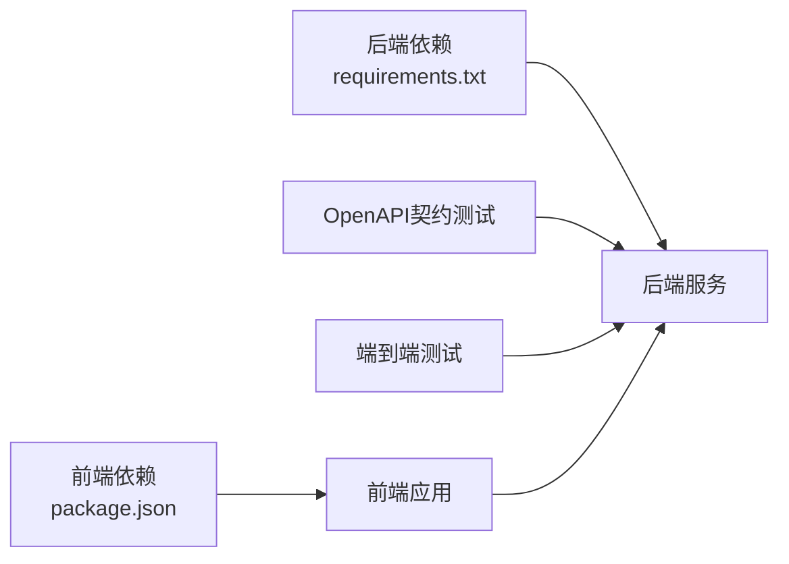

# 故障排除与FAQ

<cite>
**本文引用的文件**
- [前后端api交互.md](file://前后端api交互.md)
- [后端api.md](file://后端api.md)
- [前端api.md](file://前端api.md)
- [admin.py](file://backend/app/api/admin.py)
- [auth.py](file://backend/app/api/auth.py)
- [agent_config.py](file://backend/app/api/agent_config.py)
- [integrations.py](file://backend/app/api/integrations.py)
- [metrics.py](file://backend/app/api/metrics.py)
- [rag.py](file://backend/app/api/rag.py)
- [risk.py](file://backend/app/api/risk.py)
- [shopify.py](file://backend/app/api/shopify.py)
- [oauth_manager.py](file://backend/app/core/oauth_manager.py)
- [proactive_engine.py](file://backend/app/core/proactive_engine.py)
- [test_openapi_contract.py](file://backend/tests/test_openapi_contract.py)
- [test_all_phases.py](file://backend/tests/test_all_phases.py)
- [IntegrationPage.tsx](file://frontend/src/pages/IntegrationPage.tsx)
- [OAuthEditModal.tsx](file://frontend/src/components/config/OAuthEditModal.tsx)
- [config.ts](file://frontend/src/api/config.ts)
- [useSSEChat.ts](file://frontend/src/hooks/useSSEChat.ts)
- [AuthContext.tsx](file://frontend/src/context/AuthContext.tsx)
- [requirements.txt](file://backend/requirements.txt)
- [package.json](file://frontend/package.json)
- [后端变更路线图.md](file://后端变更路线图.md)
</cite>

## 目录
1. [简介](#简介)
2. [项目结构](#项目结构)
3. [核心组件](#核心组件)
4. [架构总览](#架构总览)
5. [详细组件分析](#详细组件分析)
6. [依赖关系分析](#依赖关系分析)
7. [性能考虑](#性能考虑)
8. [故障排除指南](#故障排除指南)
9. [结论](#结论)
10. [附录](#附录)

## 简介
本文件面向避风港平台的开发者与运维人员，提供系统化的故障排除与常见问题解答。内容覆盖环境配置、依赖安装、数据库连接、API调用错误、性能问题、内存泄漏检测、UI问题与浏览器兼容性、第三方集成与网络问题等。文档以“问题-现象-根因-修复步骤-预防建议”的结构组织，并辅以流程图与序列图帮助快速定位。

## 项目结构
- 后端采用 FastAPI，按功能域划分 API 与核心模块；测试包含 OpenAPI 契约测试与端到端流程测试。
- 前端基于 React/Vite，采用分层错误处理与 SSE/WS 通信。
- 文档与数据目录包含大量示例与配置样例，便于对照排查。

[本图为概念性结构示意，无需图表来源]

## 核心组件
- 前后端交互与错误分层：统一的 API 客户端、页面层降级策略、SSE/WS 的错误处理与恢复。
- 后端健康检查与组件状态：健康端点、组件状态上报、错误事件。
- 第三方集成与 OAuth：Provider 列表、连接测试、异常统计。
- 性能与指标：全局与产品级指标、洞察生成、告警。
- RAG 与检索：嵌入模型状态、降级策略。

**章节来源**
- [前后端api交互.md:150-575](file://前后端api交互.md#L150-L575)
- [admin.py:185-251](file://backend/app/api/admin.py#L185-L251)
- [oauth_manager.py:539-558](file://backend/app/core/oauth_manager.py#L539-L558)
- [metrics.py:132-258](file://backend/app/api/metrics.py#L132-L258)
- [rag.py](file://backend/app/api/rag.py#L37)

## 架构总览
下图展示从前端到后端的关键交互路径与错误处理位置。

**图表来源**
- [config.ts](file://frontend/src/api/config.ts)
- [auth.py:53-72](file://backend/app/api/auth.py#L53-L72)
- [前后端api交互.md:150-178](file://前后端api交互.md#L150-L178)

**章节来源**
- [前后端api交互.md:150-178](file://前后端api交互.md#L150-L178)
- [auth.py:53-72](file://backend/app/api/auth.py#L53-L72)

## 详细组件分析

### 组件A：认证与会话（后端）
- 关键点
  - 登录端点负责签发令牌；前端通过上下文检测 401 并重定向登录。
  - 后端使用 HTTPException 统一序列化错误，前端解析 detail 字段。
- 常见问题
  - Token 过期：前端捕获 401，跳转登录页。
  - 权限不足：403，提示需要管理员权限。
- 诊断步骤
  - 检查登录端点是否可达与响应结构。
  - 查看后端日志中 HTTPException 输出。
  - 前端确认 AuthContext 是否拦截 401 并清理本地状态。

**图表来源**
- [auth.py:53-72](file://backend/app/api/auth.py#L53-L72)

**章节来源**
- [auth.py:53-72](file://backend/app/api/auth.py#L53-L72)
- [前后端api交互.md:562-572](file://前后端api交互.md#L562-L572)

### 组件B：第三方集成与OAuth（后端+前端）
- 关键点
  - 后端维护 Provider 模板与连接计数，支持动态配置与测试。
  - 前端集成页展示连接状态，异常计数高亮。
  - OAuth 管理器提供单例访问与活动连接集合。
- 常见问题
  - Provider 未配置或凭据错误：连接测试失败。
  - 连接异常过多：集成页显示异常计数。
- 诊断步骤
  - 后端查看 Provider 模板与连接数统计。
  - 前端打开集成页，查看连接卡片状态与异常计数。
  - 使用测试按钮触发连接测试，观察返回结果。

**图表来源**
- [IntegrationPage.tsx:217-242](file://frontend/src/pages/IntegrationPage.tsx#L217-L242)
- [OAuthEditModal.tsx:226-279](file://frontend/src/components/config/OAuthEditModal.tsx#L226-L279)
- [oauth_manager.py:539-558](file://backend/app/core/oauth_manager.py#L539-L558)

**章节来源**
- [IntegrationPage.tsx:217-242](file://frontend/src/pages/IntegrationPage.tsx#L217-L242)
- [OAuthEditModal.tsx:226-279](file://frontend/src/components/config/OAuthEditModal.tsx#L226-L279)
- [oauth_manager.py:539-558](file://backend/app/core/oauth_manager.py#L539-L558)

### 组件C：SSE/WS 实时流（前端）
- 关键点
  - SSE 层区分 AbortError、网络错误与后端 error 事件，recoverable 决定是否终止。
  - WebSocket 断开后 5 秒自动重连。
- 常见问题
  - SSE 连接中断：状态变为 error。
  - WS 断开：短暂状态变化后自动重连。
- 诊断步骤
  - 检查 useSSEChat 中的错误分支与 recoverable 策略。
  - 观察 WebSocketContext 的 onclose 与重连逻辑。
  - 前端 UI 状态指示是否变红。

**图表来源**
- [useSSEChat.ts](file://frontend/src/hooks/useSSEChat.ts)
- [前后端api交互.md:514-561](file://前后端api交互.md#L514-L561)

**章节来源**
- [useSSEChat.ts](file://frontend/src/hooks/useSSEChat.ts)
- [前后端api交互.md:514-561](file://前后端api交互.md#L514-L561)

### 组件D：健康检查与组件状态（后端）
- 关键点
  - 健康端点返回服务状态与版本；组件状态通过字典汇总，异常时记录错误片段。
- 常见问题
  - 组件状态异常：在 health 响应中看到 error 片段。
- 诊断步骤
  - 访问健康端点，核对 status/service/version。
  - 检查 components 下各组件状态，定位具体异常来源。

**章节来源**
- [admin.py:185-251](file://backend/app/api/admin.py#L185-L251)

### 组件E：指标与洞察（后端）
- 关键点
  - 指标查询异常时返回空列表与错误信息；主动引擎生成洞察并写入事件总线。
- 常见问题
  - 指标接口报错：检查异常返回结构与日志。
  - 洞察缺失：检查产品数量与市场分组逻辑。
- 诊断步骤
  - 调用指标端点，确认 total 与 alerts/insights 结构。
  - 主动引擎日志中查找 sync:failed 事件。

**章节来源**
- [metrics.py:132-258](file://backend/app/api/metrics.py#L132-L258)
- [proactive_engine.py:639-668](file://backend/app/core/proactive_engine.py#L639-L668)

### 组件F：RAG 与检索（后端）
- 关键点
  - RAG 端点在嵌入模型异常时返回 error 状态与模型名。
- 常见问题
  - RAG 搜索返回 error：检查外部 embedding 服务可用性与密钥配置。
- 诊断步骤
  - 访问 RAG 搜索端点，确认 status 与 embedding_model。
  - 查看相关日志中的异常堆栈。

**章节来源**
- [rag.py](file://backend/app/api/rag.py#L37)

### 组件G：Shopify Webhook 日志（后端）
- 关键点
  - webhook 接收后写入本地 JSONL 文件，便于离线分析。
- 常见问题
  - webhook 未落盘：检查 data_dir 与目录权限。
- 诊断步骤
  - 确认 webhook 目录存在且可写。
  - 检查 JSONL 文件是否存在与内容格式。

**章节来源**
- [shopify.py:234-243](file://backend/app/api/shopify.py#L234-L243)

## 依赖关系分析
- 后端依赖清单：通过 requirements.txt 管理，建议使用虚拟环境隔离。
- 前端依赖清单：通过 package.json 管理，注意浏览器兼容性与 polyfill。
- OpenAPI 契约测试：验证端点覆盖率与响应模型一致性，防止路由遗漏。
- 端到端流程测试：暴露缺失端点与降级问题（如 RAG browse/query）。

**图表来源**
- [requirements.txt](file://backend/requirements.txt)
- [package.json](file://frontend/package.json)
- [test_openapi_contract.py:15-202](file://backend/tests/test_openapi_contract.py#L15-L202)
- [test_all_phases.py:1233-1264](file://backend/tests/test_all_phases.py#L1233-L1264)

**章节来源**
- [test_openapi_contract.py:15-202](file://backend/tests/test_openapi_contract.py#L15-L202)
- [test_all_phases.py:1233-1264](file://backend/tests/test_all_phases.py#L1233-L1264)

## 性能考虑
- SSE/WS 降级：当前降级模式返回硬编码回复，配置外部模型后可激活完整对话。
- 主动引擎：按市场分组与产品数量进行洞察生成，注意大数据量下的内存占用。
- RAG 降级：建议引入本地 embedding 缓存或关键词搜索作为降级方案。

**章节来源**
- [test_all_phases.py:1255-1264](file://backend/tests/test_all_phases.py#L1255-L1264)
- [proactive_engine.py:639-668](file://backend/app/core/proactive_engine.py#L639-L668)

## 故障排除指南

### 环境配置问题
- 症状
  - 后端无法启动或端口被占用。
  - 前端无法热更新或构建失败。
- 诊断
  - 检查 Python 虚拟环境与依赖安装。
  - 检查 Node.js 版本与包管理器缓存。
- 修复
  - 清理缓存并重新安装依赖。
  - 更换端口或释放占用进程。

**章节来源**
- [requirements.txt](file://backend/requirements.txt)
- [package.json](file://frontend/package.json)

### 依赖安装问题
- 症状
  - 安装时报错或版本冲突。
- 诊断
  - 使用锁定文件与镜像源加速安装。
  - 核对 Node 与 Python 版本要求。
- 修复
  - 使用官方推荐的 Node/NPM/Python 版本。
  - 在 CI 中固定依赖版本。

**章节来源**
- [package.json](file://frontend/package.json)
- [requirements.txt](file://backend/requirements.txt)

### 数据库连接问题
- 症状
  - 访问指标/产品等接口出现 5xx。
- 诊断
  - 查看后端日志中的数据库连接异常。
  - 确认连接字符串与凭据。
- 修复
  - 修正连接参数，确保网络可达。
  - 在测试环境使用本地数据库镜像。

[本节为通用指导，无需特定文件来源]

### API 调用错误
- 症状
  - 401/403/404/500 等状态码。
- 诊断
  - 前端统一捕获并降级；后端使用 HTTPException 提供 detail。
  - 使用 OpenAPI 文档核对端点与参数。
- 修复
  - 补齐缺失端点与参数校验。
  - 前端针对不同状态码做差异化提示。

**章节来源**
- [前后端api交互.md:514-575](file://前后端api交互.md#L514-L575)
- [后端api.md](file://后端api.md)
- [前端api.md](file://前端api.md)
- [test_openapi_contract.py:236-284](file://backend/tests/test_openapi_contract.py#L236-L284)

### 性能问题
- 症状
  - SSE/WS 响应慢或频繁断开。
- 诊断
  - 检查服务端资源占用与日志。
  - 分析前端重连与降级策略。
- 修复
  - 优化后端处理链路，启用外部模型。
  - 前端增加指数退避与心跳保活。

**章节来源**
- [test_all_phases.py:1255-1264](file://backend/tests/test_all_phases.py#L1255-L1264)
- [useSSEChat.ts](file://frontend/src/hooks/useSSEChat.ts)

### 内存泄漏检测与修复
- 症状
  - 长时间运行后内存持续增长。
- 诊断
  - 使用浏览器 DevTools 的 Memory 面板快照对比。
  - 检查事件监听器与定时器是否正确清理。
- 修复
  - 在组件卸载时移除监听器与清理定时器。
  - 对长列表与大对象使用懒加载与分页。

[本节为通用指导，无需特定文件来源]

### 用户界面问题
- 症状
  - 页面空白、样式错乱、交互无响应。
- 诊断
  - 打开浏览器控制台查看网络与 JS 错误。
  - 检查静态资源加载与跨域设置。
- 修复
  - 修复 404 资源与 CORS 配置。
  - 使用浏览器兼容性工具链（如 Babel/Polyfill）。

**章节来源**
- [package.json](file://frontend/package.json)

### 浏览器兼容性问题
- 症状
  - 某些特性在旧版浏览器不可用。
- 诊断
  - 使用 browserslist 与 caniuse 检查特性支持。
- 修复
  - 添加必要的 polyfill 与编译目标。
  - 为不支持的特性提供降级方案。

**章节来源**
- [package.json](file://frontend/package.json)

### 第三方集成问题
- 症状
  - Provider 连接失败或异常过多。
- 诊断
  - 前端集成页查看异常计数；后端 Provider 模板与连接数统计。
  - 使用测试按钮验证凭据。
- 修复
  - 修正配置项与网络策略。
  - 增加重试与熔断机制。

**章节来源**
- [IntegrationPage.tsx:217-242](file://frontend/src/pages/IntegrationPage.tsx#L217-L242)
- [OAuthEditModal.tsx:226-279](file://frontend/src/components/config/OAuthEditModal.tsx#L226-L279)
- [oauth_manager.py:539-558](file://backend/app/core/oauth_manager.py#L539-L558)

### 网络连接问题
- 症状
  - 请求超时、DNS 解析失败、TLS 握手异常。
- 诊断
  - 使用 curl/wget 测试直连；检查代理与防火墙。
- 修复
  - 配置企业代理；更新证书；启用重试与超时策略。

[本节为通用指导，无需特定文件来源]

### 日志分析技巧与调试工具
- 后端
  - 使用标准库 logging 输出结构化日志；在健康端点查看组件状态。
  - 关注 error 事件与异常堆栈。
- 前端
  - 控制台查看网络面板与 Console 错误。
  - 使用 React DevTools 检查组件状态与 props。
- 工具
  - Postman/Insomnia 验证 API。
  - 浏览器 Network 面板抓包分析。

**章节来源**
- [admin.py:185-251](file://backend/app/api/admin.py#L185-L251)
- [useSSEChat.ts](file://frontend/src/hooks/useSSEChat.ts)

## 结论
本指南提供了从环境配置到第三方集成、从 API 错误到性能优化的系统化排障路径。建议在开发与运维流程中固化以下实践：
- 使用 OpenAPI 契约测试保证端点完整性。
- 前后端统一错误分层与降级策略。
- 建立健康检查与异常事件上报机制。
- 对关键路径（SSE/WS、RAG、Shopify）制定降级与重试策略。

[本节为总结性内容，无需特定文件来源]

## 附录

### 常见错误场景与处理对照
- 后端未启动：前端捕获网络错误，降级为空状态。
- Token 过期：401，AuthContext 重定向登录。
- 权限不足：403，提示需要管理员权限。
- 数据不存在：404，fallback 到默认值/空状态。
- 服务端异常：500，error state 提示加载失败。
- SSE 连接中断：标记 status='error'。
- WebSocket 断开：5s 后自动重连。
- CLI 命令不可用：本地回退执行 help/clear/status。

**章节来源**
- [前后端api交互.md:549-561](file://前后端api交互.md#L549-L561)

### 后端认证错误处理要点
- 后端使用 HTTPException 自动序列化，detail 字段为前端解析依据。
- 前端统一捕获 401 并跳转登录页。

**章节来源**
- [auth.py:53-72](file://backend/app/api/auth.py#L53-L72)
- [前后端api交互.md:562-572](file://前后端api交互.md#L562-L572)

### 自动拉取引擎与事件总线
- 每 20 分钟遍历活跃连接，增量拉取并写入记忆树。
- 失败时发布 sync:failed 事件，便于观测与告警。

**章节来源**
- [后端变更路线图.md:1434-1478](file://后端变更路线图.md#L1434-L1478)