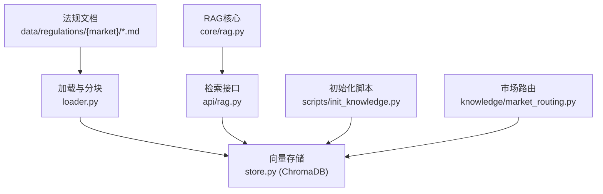
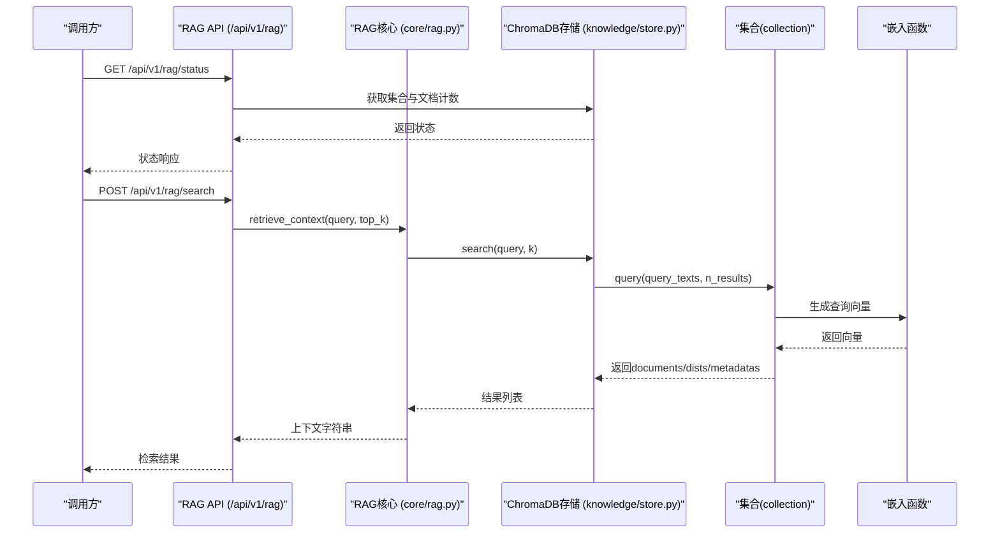
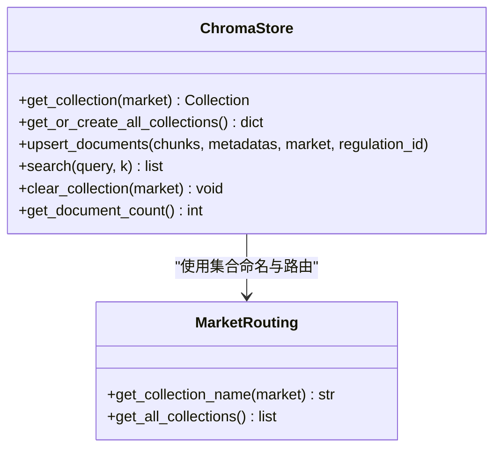
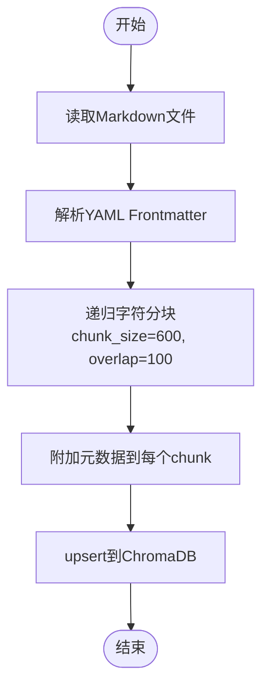
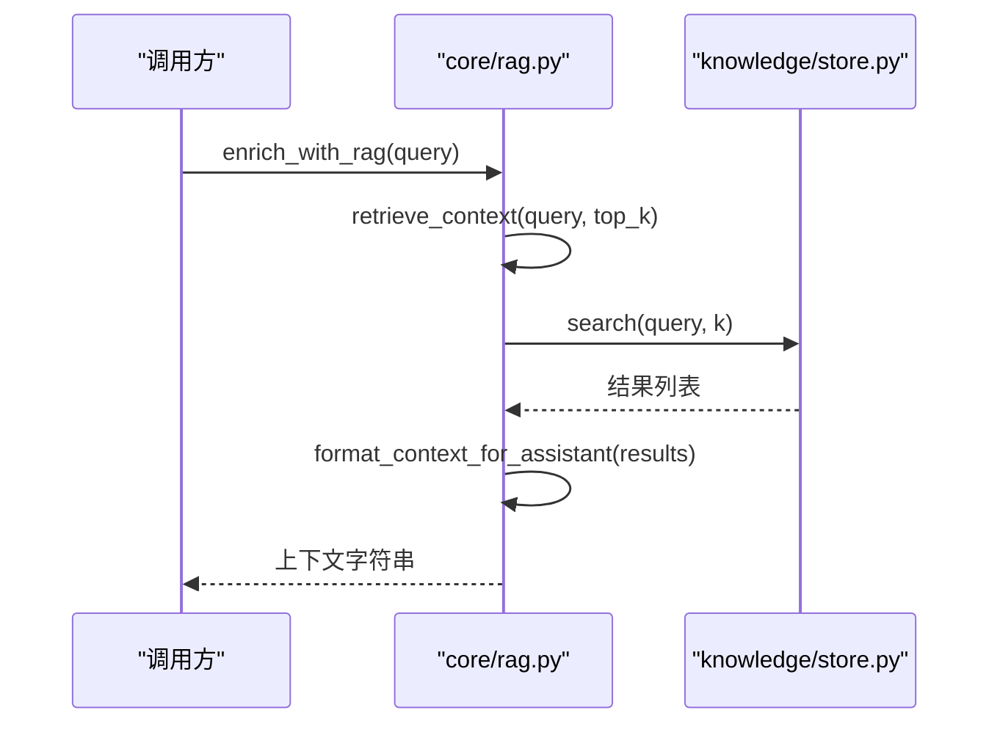
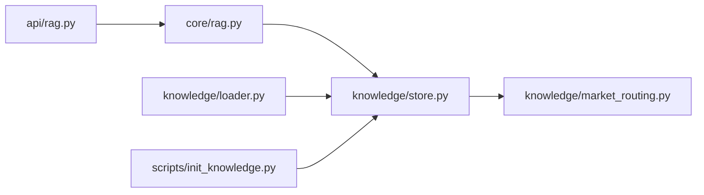

# 向量数据库集成

<cite>
**本文引用的文件**
- [backend/app/knowledge/store.py](file://backend/app/knowledge/store.py)
- [backend/app/knowledge/loader.py](file://backend/app/knowledge/loader.py)
- [backend/app/api/rag.py](file://backend/app/api/rag.py)
- [backend/app/core/rag.py](file://backend/app/core/rag.py)
- [backend/app/knowledge/market_routing.py](file://backend/app/knowledge/market_routing.py)
- [backend/scripts/init_knowledge.py](file://backend/scripts/init_knowledge.py)
- [backend/app/models/schemas.py](file://backend/app/models/schemas.py)
- [backend/tests/test_comprehensive_flow.py](file://backend/tests/test_comprehensive_flow.py)
- [backend/后端变更路线图.md](file://backend/后端变更路线图.md)
</cite>

## 目录
1. [简介](#简介)
2. [项目结构](#项目结构)
3. [核心组件](#核心组件)
4. [架构总览](#架构总览)
5. [详细组件分析](#详细组件分析)
6. [依赖关系分析](#依赖关系分析)
7. [性能考虑](#性能考虑)
8. [故障排查指南](#故障排查指南)
9. [结论](#结论)
10. [附录](#附录)

## 简介
本文件面向避风港平台的向量数据库集成，聚焦于ChromaDB在合规知识库中的应用，涵盖向量嵌入生成、文档分块与元数据管理、相似度检索与结果排序、配置参数与性能调优、容量规划、与RAG系统的集成模式、查询优化与缓存策略，以及备份、恢复与迁移方案。文档基于仓库中实际实现进行梳理，帮助技术与非技术读者理解从“法规文档”到“语义检索”的完整链路。

## 项目结构
围绕向量数据库的实现，主要涉及以下层次与文件：
- 数据加载与分块：从本地法规文档目录读取，按YAML frontmatter解析元数据，并使用递归字符分块策略生成文本块。
- 向量存储与检索：ChromaDB持久化存储，按市场分区(collection)，使用SentenceTransformer本地嵌入函数，提供upsert与query检索。
- RAG流水线：检索上下文、格式化引用、注入提示词。
- API与状态：提供RAG状态查询接口，暴露集合数量、文档总数、嵌入模型与持久化路径等信息。
- 初始化脚本：批量导入法规文档至ChromaDB。

图表来源
- [backend/app/knowledge/loader.py:1-38](file://backend/app/knowledge/loader.py#L1-L38)
- [backend/app/knowledge/store.py:1-192](file://backend/app/knowledge/store.py#L1-L192)
- [backend/app/core/rag.py:1-58](file://backend/app/core/rag.py#L1-L58)
- [backend/app/api/rag.py:1-39](file://backend/app/api/rag.py#L1-L39)
- [backend/scripts/init_knowledge.py](file://backend/scripts/init_knowledge.py)

章节来源
- [backend/app/knowledge/loader.py:1-38](file://backend/app/knowledge/loader.py#L1-L38)
- [backend/app/knowledge/store.py:1-192](file://backend/app/knowledge/store.py#L1-L192)
- [backend/app/core/rag.py:1-58](file://backend/app/core/rag.py#L1-L58)
- [backend/app/api/rag.py:1-39](file://backend/app/api/rag.py#L1-L39)
- [backend/scripts/init_knowledge.py](file://backend/scripts/init_knowledge.py)

## 核心组件
- ChromaDB向量存储与集合管理
  - 支持多市场分区集合（eu_knowledge、us_knowledge、jp_knowledge、kr_knowledge），按需惰性创建与复用。
  - 使用SentenceTransformerEmbeddingFunction进行本地嵌入，避免网络依赖。
  - 提供upsert写入与query检索，返回文档、距离与元数据，内部转换为相似度分数。
- 文档加载与分块
  - 从data/regulations/{market}目录读取Markdown，解析frontmatter元数据（如regulation_id、name、source_url、tags等）。
  - 使用递归字符分块器，设置chunk_size与chunk_overlap，保留标题层级与段落分隔符，便于检索与引用。
- RAG检索与上下文格式化
  - 检索：根据查询语句在ChromaDB中执行语义相似度检索，返回包含文本、相似度、法规元数据的条目。
  - 格式化：将检索结果组织为带来源引用的上下文字符串，便于注入到提示词。
- API与状态
  - 提供RAG状态查询接口，返回集合列表、文档总数、嵌入模型名称与ChromaDB持久化路径，并标注健康状态。
- 初始化与批量导入
  - 通过脚本批量读取文档、分块、写入ChromaDB，ID采用regulation_id与索引组合，保证幂等。

章节来源
- [backend/app/knowledge/store.py:1-192](file://backend/app/knowledge/store.py#L1-L192)
- [backend/app/knowledge/loader.py:1-38](file://backend/app/knowledge/loader.py#L1-L38)
- [backend/app/core/rag.py:1-58](file://backend/app/core/rag.py#L1-L58)
- [backend/app/api/rag.py:1-39](file://backend/app/api/rag.py#L1-L39)
- [backend/scripts/init_knowledge.py](file://backend/scripts/init_knowledge.py)

## 架构总览
下图展示从“法规文档”到“RAG检索”的整体流程，包括数据加载、向量化、持久化、检索与上下文格式化。

图表来源
- [backend/app/api/rag.py:1-39](file://backend/app/api/rag.py#L1-L39)
- [backend/app/core/rag.py:1-58](file://backend/app/core/rag.py#L1-L58)
- [backend/app/knowledge/store.py:161-192](file://backend/app/knowledge/store.py#L161-L192)

## 详细组件分析

### ChromaDB向量存储与检索
- 多集合与市场分区
  - 按市场代码生成集合名，集合元数据包含hnsw空间与市场标识，便于后续路由与过滤。
  - 集合惰性创建与缓存，避免重复初始化开销。
- 嵌入函数与本地化
  - 使用SentenceTransformerEmbeddingFunction，local_files_only=True，确保离线可用。
  - 模型名称在模块常量中定义，便于统一管理与替换。
- 写入与幂等
  - upsert_documents支持传入chunks与metadatas，ID采用regulation_id与索引组合，重复执行不产生重复文档。
  - 兼容旧接口add_documents，但内部仍走自动嵌入路径。
- 查询与降级
  - _query_col对单集合执行query，包含documents、distances、metadatas；异常时记录警告并返回空结果，保障主流程不被阻断。
  - 返回结果转换为统一字段，包含相似度（由距离换算）、市场、法规元数据等。

图表来源
- [backend/app/knowledge/store.py:54-192](file://backend/app/knowledge/store.py#L54-L192)
- [backend/app/knowledge/market_routing.py](file://backend/app/knowledge/market_routing.py)

章节来源
- [backend/app/knowledge/store.py:1-192](file://backend/app/knowledge/store.py#L1-L192)

### 文档加载与分块策略
- 加载来源
  - data/regulations/{market}/*.md，每份文档包含YAML frontmatter，定义regulation_id、name、source_url、tags等元数据。
- 分块器配置
  - chunk_size=600，chunk_overlap=100，分隔符优先保留标题层级与分节标记，提升检索粒度与可读性。
- 元数据传播
  - 分块时将frontmatter元数据附加到每个chunk，确保检索结果可溯源引用。

图表来源
- [backend/app/knowledge/loader.py:1-38](file://backend/app/knowledge/loader.py#L1-L38)
- [backend/scripts/init_knowledge.py](file://backend/scripts/init_knowledge.py)

章节来源
- [backend/app/knowledge/loader.py:1-38](file://backend/app/knowledge/loader.py#L1-L38)

### RAG检索与上下文格式化
- 检索流程
  - retrieve_context先检查文档总数，再调用search执行语义检索，返回包含文本、相似度与元数据的结果列表。
- 上下文格式化
  - format_context_for_assistant将检索结果格式化为带编号、法规名称、来源链接、生效日期与正文的上下文块，便于注入提示词。
- 完整增强
  - enrich_with_rag串联retrieve与format，直接输出可用于提示词的上下文字符串。

图表来源
- [backend/app/core/rag.py:1-58](file://backend/app/core/rag.py#L1-L58)
- [backend/app/knowledge/store.py:161-192](file://backend/app/knowledge/store.py#L161-L192)

章节来源
- [backend/app/core/rag.py:1-58](file://backend/app/core/rag.py#L1-L58)

### API与状态管理
- /api/v1/rag/status
  - 返回集合列表、文档总数（带超时保护）、嵌入模型名称、ChromaDB持久化路径与健康状态。
- /api/v1/rag/collections
  - 可用于列举当前可用的市场集合。
- /api/v1/rag/search
  - 接收query、market、top_k等参数，调用RAG检索并返回格式化后的上下文或结果列表。

章节来源
- [backend/app/api/rag.py:1-39](file://backend/app/api/rag.py#L1-L39)
- [backend/app/models/schemas.py](file://backend/app/models/schemas.py)

### 初始化与批量导入
- 脚本职责
  - 扫描法规文档目录，调用分块与upsert逻辑，将文档批量导入ChromaDB。
- 幂等性
  - 通过ID前缀与索引组合，确保重复运行不产生重复条目。

章节来源
- [backend/scripts/init_knowledge.py](file://backend/scripts/init_knowledge.py)

## 依赖关系分析
- 组件耦合
  - core/rag.py依赖knowledge/store.py的search接口，形成清晰的检索层抽象。
  - api/rag.py依赖core/rag.py与store.py，提供HTTP接口。
  - knowledge/store.py依赖market_routing.py进行集合命名与路由。
- 外部依赖
  - chromadb与chromadb.utils.embedding_functions.SentenceTransformerEmbeddingFunction。
  - langchain.text_splitter.RecursiveCharacterTextSplitter用于分块。
- 可能的循环依赖
  - 当前模块间为单向依赖，未见循环导入迹象。

图表来源
- [backend/app/api/rag.py:1-39](file://backend/app/api/rag.py#L1-L39)
- [backend/app/core/rag.py:1-58](file://backend/app/core/rag.py#L1-L58)
- [backend/app/knowledge/store.py:1-192](file://backend/app/knowledge/store.py#L1-L192)
- [backend/app/knowledge/market_routing.py](file://backend/app/knowledge/market_routing.py)
- [backend/app/knowledge/loader.py:1-38](file://backend/app/knowledge/loader.py#L1-L38)
- [backend/scripts/init_knowledge.py](file://backend/scripts/init_knowledge.py)

章节来源
- [backend/app/api/rag.py:1-39](file://backend/app/api/rag.py#L1-L39)
- [backend/app/core/rag.py:1-58](file://backend/app/core/rag.py#L1-L58)
- [backend/app/knowledge/store.py:1-192](file://backend/app/knowledge/store.py#L1-L192)

## 性能考虑
- 向量嵌入
  - 使用本地SentenceTransformer模型，避免网络请求延迟；模型名称集中管理，便于替换与版本控制。
- 分块策略
  - chunk_size与chunk_overlap平衡召回与上下文长度；保留标题层级分隔符有助于提升检索质量。
- 检索参数
  - query时n_results=min(k, collection.count())，避免请求超过集合大小的结果数。
- 异常降级
  - 查询异常时返回空结果并记录警告，保障服务稳定性。
- 状态查询超时
  - 文档计数查询设置超时，防止embedding模型加载阻塞影响健康检查。
- 可扩展性建议
  - 当知识规模增长时，可评估迁移到高性能向量引擎（如Qdrant），以支撑更大体量的检索需求。

章节来源
- [backend/app/knowledge/store.py:161-192](file://backend/app/knowledge/store.py#L161-L192)
- [backend/app/api/rag.py:20-28](file://backend/app/api/rag.py#L20-L28)
- [backend/后端变更路线图.md:262-272](file://backend/后端变更路线图.md#L262-L272)

## 故障排查指南
- ChromaDB不可用或查询失败
  - 现象：检索返回空结果且日志出现警告。
  - 排查：确认ChromaDB持久化目录可写、集合存在、嵌入函数加载成功。
  - 参考：查询异常处理与降级逻辑。
- 文档总数无法获取
  - 现象：/api/v1/rag/status中total_documents显示为-1。
  - 排查：检查embedding模型加载耗时是否超过超时阈值，或集合为空。
- 检索结果为空
  - 现象：query后返回空列表。
  - 排查：确认集合中已有文档、查询文本长度合理、分块导入已完成。
- 集合数量与市场分区
  - 现象：期望集合缺失。
  - 排查：确认market_routing.py返回的集合名与预期一致，必要时调用get_or_create_all_collections确保创建。

章节来源
- [backend/app/knowledge/store.py:161-192](file://backend/app/knowledge/store.py#L161-L192)
- [backend/app/api/rag.py:20-38](file://backend/app/api/rag.py#L20-L38)

## 结论
本集成以ChromaDB为核心，结合本地SentenceTransformer嵌入与递归字符分块策略，实现了合规知识库的向量化与语义检索。通过多市场分区集合、幂等写入与异常降级机制，系统在功能完整性与运行稳定性之间取得平衡。随着知识规模增长，可按路线图建议评估迁移至更高性能的向量引擎，并持续优化分块策略与检索参数以提升效果与效率。

## 附录

### 向量检索算法与相似度计算
- 算法要点
  - 使用HNSW近似最近邻索引，空间度量为余弦距离。
  - 相似度由距离换算得到，返回值经四舍五入保留固定小数位。
- 结果排序
  - 默认按相似度降序排列，可通过top_k限制返回数量。

章节来源
- [backend/app/knowledge/store.py:58-64](file://backend/app/knowledge/store.py#L58-L64)
- [backend/app/knowledge/store.py:182-184](file://backend/app/knowledge/store.py#L182-L184)

### 配置参数与环境变量
- ChromaDB持久化路径
  - 通过settings.chroma_persist_dir配置，用于PersistentClient初始化。
- 嵌入模型名称
  - 在模块常量中定义，便于统一管理与替换。
- 分块参数
  - chunk_size、chunk_overlap与分隔符在分块器中定义。

章节来源
- [backend/app/knowledge/store.py:48-51](file://backend/app/knowledge/store.py#L48-L51)
- [backend/app/knowledge/store.py](file://backend/app/knowledge/store.py#L24)
- [backend/app/knowledge/loader.py:20-24](file://backend/app/knowledge/loader.py#L20-L24)

### 容量规划与扩展
- 规模评估
  - 依据测试用例中的集合数量与文档总数，评估当前知识体量与市场覆盖范围。
- 扩展方向
  - 当文档数量与并发查询上升时，可考虑迁移至Qdrant等高性能向量引擎，或调整分块策略与索引参数。

章节来源
- [backend/tests/test_comprehensive_flow.py:602-635](file://backend/tests/test_comprehensive_flow.py#L602-L635)
- [backend/后端变更路线图.md:262-272](file://backend/后端变更路线图.md#L262-L272)

### 与RAG系统的集成模式
- 检索增强生成
  - RAG核心负责检索与上下文格式化，API提供状态与查询接口，前端可直接消费。
- 模型路由
  - 路线图中提出多模型路由能力，未来可按任务类型选择不同模型，提升推理与生成效率。

章节来源
- [backend/app/core/rag.py:1-58](file://backend/app/core/rag.py#L1-L58)
- [backend/app/api/rag.py:1-39](file://backend/app/api/rag.py#L1-L39)
- [backend/后端变更路线图.md:1962-1971](file://backend/后端变更路线图.md#L1962-L1971)

### 查询优化与缓存策略
- 查询优化
  - 控制top_k与分块大小，减少无效召回；在业务层对query进行清洗与标准化。
- 缓存策略
  - 可在API层对热门query结果进行短期缓存，降低重复检索压力；注意缓存键应包含market与top_k等维度。

（本节为通用实践建议，不直接对应具体代码文件）

### 备份、恢复与迁移方案
- 备份
  - 备份ChromaDB持久化目录，确保集合与文档的完整一致性。
- 恢复
  - 停止服务后恢复持久化目录，重启服务验证集合与文档计数。
- 迁移
  - 当从ChromaDB迁移到Qdrant等引擎时，需重新执行分块与导入流程，保持元数据与ID策略一致。

（本节为通用实践建议，不直接对应具体代码文件）