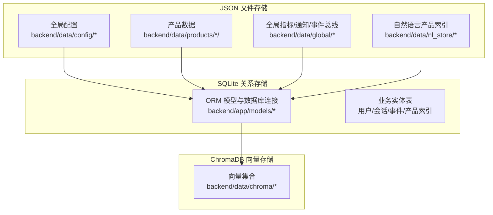
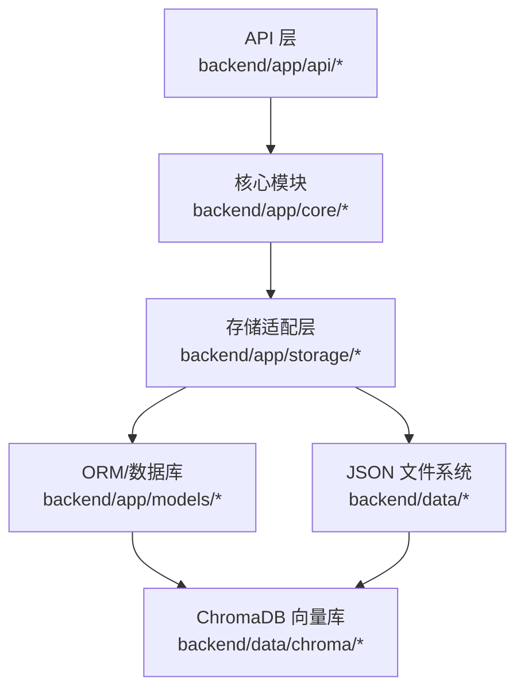
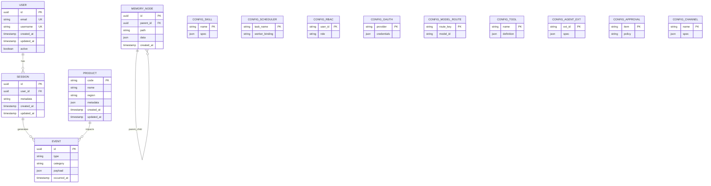
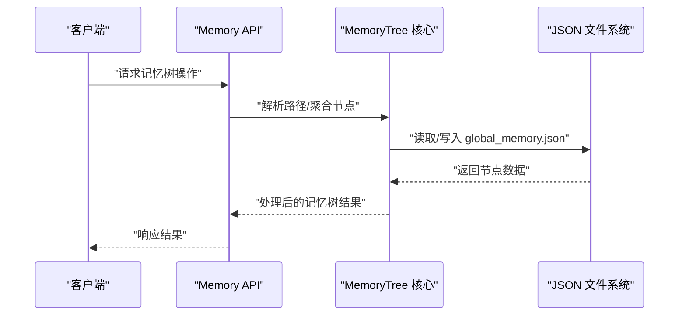
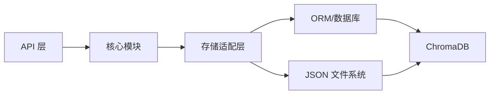

# 数据存储架构

<cite>
**本文引用的文件**
- [backend/app/models/schemas.py](file://backend/app/models/schemas.py)
- [backend/app/models/database.py](file://backend/app/models/database.py)
- [backend/app/core/memory_tree.py](file://backend/app/core/memory_tree.py)
- [backend/app/api/memory.py](file://backend/app/api/memory.py)
- [backend/app/storage/session_store.py](file://backend/app/storage/session_store.py)
- [backend/app/storage/session_memory.py](file://backend/app/storage/session_memory.py)
- [backend/app/storage/user_store.py](file://backend/app/storage/user_store.py)
- [backend/app/storage/user_memory.py](file://backend/app/storage/user_memory.py)
- [backend/app/storage/project_memory.py](file://backend/app/storage/project_memory.py)
- [backend/app/storage/event_store.py](file://backend/app/storage/event_store.py)
- [backend/app/storage/raw_store.py](file://backend/app/storage/raw_store.py)
- [backend/app/storage/agent_config_store.py](file://backend/app/storage/agent_config_store.py)
- [backend/scripts/migrate_storage.py](file://backend/scripts/migrate_storage.py)
- [backend/data/global/memory/global_memory.json](file://backend/data/global/memory/global_memory.json)
- [backend/data/products/p_E2E测_1d642ce3/product.json](file://backend/data/products/p_E2E测_1d642ce3/product.json)
- [backend/data/chroma](file://backend/data/chroma)
- [backend/data/config/skills/registry.json](file://backend/data/config/skills/registry.json)
- [backend/data/config/scheduler/task_worker_bindings.json](file://backend/data/config/scheduler/task_worker_bindings.json)
- [backend/data/config/rbac_users.json](file://backend/data/config/rbac_users.json)
- [backend/data/config/oauth_connections.json](file://backend/data/config/oauth_connections.json)
- [backend/data/config/model_routes.json](file://backend/data/config/model_routes.json)
- [backend/data/config/tools.json](file://backend/data/config/tools.json)
- [backend/data/config/agent_extensions.json](file://backend/data/config/agent_extensions.json)
- [backend/data/config/approvals.json](file://backend/data/config/approvals.json)
- [backend/data/config/channels.json](file://backend/data/config/channels.json)
- [backend/data/nl_store/products/_all.json](file://backend/data/nl_store/products/_all.json)
- [backend/data/nl_store/products/玩具_欧盟.json](file://backend/data/nl_store/products/玩具_欧盟.json)
- [backend/data/nl_store/products/电子产品_德国.json](file://backend/data/nl_store/products/电子产品_德国.json)
- [backend/data/products/p_E2E测_1d642ce3/knowledge](file://backend/data/products/p_E2E测_1d642ce3/knowledge)
- [backend/data/products/p_E2E测_1d642ce3/metrics](file://backend/data/products/p_E2E测_1d642ce3/metrics)
- [backend/data/products/p_E2E测_1d642ce3/events](file://backend/data/products/p_E2E测_1d642ce3/events)
- [backend/data/products/p_E2E测_1d642ce3/memory](file://backend/data/products/p_E2E测_1d642ce3/memory)
- [backend/data/global/products_index.json](file://backend/data/global/products_index.json)
- [backend/data/global/metrics/custom_metrics.json](file://backend/data/global/metrics/custom_metrics.json)
- [backend/data/global/notifications/history.json](file://backend/data/global/notifications/history.json)
- [backend/data/global/events/bus.json](file://backend/data/global/events/bus.json)
- [backend/data/config/events/lifecycle_events.md](file://backend/data/config/events/lifecycle_events.md)
- [backend/data/config/events/system_events.md](file://backend/data/config/events/system_events.md)
- [backend/data/config/events/user_action_events.md](file://backend/data/config/events/user_action_events.md)
- [backend/data/config/events/order_events.md](file://backend/data/config/events/order_events.md)
- [backend/data/config/events/risk_alert_events.md](file://backend/data/config/events/risk_alert_events.md)
- [backend/data/config/events/certification_events.md](file://backend/data/config/events/certification_events.md)
- [backend/data/config/events/custom_events.md](file://backend/data/config/events/custom_events.md)
- [backend/data/config/workers/custom_workers.md](file://backend/data/config/workers/custom_workers.md)
- [backend/data/config/workers/README.md](file://backend/data/config/workers/README.md)
- [backend/data/config/workers/_archive](file://backend/data/config/workers/_archive)
- [backend/data/config/events/_archive](file://backend/data/config/events/_archive)
- [backend/data/config/skills/_archive](file://backend/data/config/skills/_archive)
- [backend/data/config/worker_bindings.json](file://backend/data/config/worker_bindings.json)
- [backend/data/config/worker_bindings_archive](file://backend/data/config/worker_bindings_archive)
</cite>

## 目录
1. [引言](#引言)
2. [项目结构](#项目结构)
3. [核心组件](#核心组件)
4. [架构总览](#架构总览)
5. [详细组件分析](#详细组件分析)
6. [依赖分析](#依赖分析)
7. [性能考虑](#性能考虑)
8. [故障排查指南](#故障排查指南)
9. [结论](#结论)
10. [附录](#附录)

## 引言
本文件面向避风港平台的数据存储架构，系统性梳理实体关系、字段与数据类型，阐明产品存储设计、会话存储管理、记忆树系统与全局配置管理；解释数据验证与业务规则；给出数据库模式图与示例数据位置；阐述数据访问模式、缓存策略与性能考量；明确数据生命周期、保留与归档策略；提供数据迁移路径与版本管理建议；并覆盖数据安全、隐私与访问控制要点。平台采用多存储层协同：JSON文件存储（本地持久化）、SQLite关系存储（ORM模型）与ChromaDB向量存储（知识检索），以满足不同场景下的数据需求。

## 项目结构
平台数据存储由三层构成：
- JSON文件存储：用于配置、事件、指标、通知、产品元数据与知识片段等非结构化或半结构化数据。
- SQLite关系存储：通过ORM模型定义表结构，承载用户、会话、事件、产品索引等强关系数据。
- ChromaDB向量存储：用于产品知识的向量化检索，支撑RAG与相似度匹配。

**图表来源**
- [backend/app/models/schemas.py](file://backend/app/models/schemas.py)
- [backend/app/models/database.py](file://backend/app/models/database.py)
- [backend/data/config](file://backend/data/config)
- [backend/data/global](file://backend/data/global)
- [backend/data/products](file://backend/data/products)
- [backend/data/nl_store](file://backend/data/nl_store)
- [backend/data/chroma](file://backend/data/chroma)

**章节来源**
- [backend/app/models/schemas.py](file://backend/app/models/schemas.py)
- [backend/app/models/database.py](file://backend/app/models/database.py)
- [backend/data/config](file://backend/data/config)
- [backend/data/global](file://backend/data/global)
- [backend/data/products](file://backend/data/products)
- [backend/data/nl_store](file://backend/data/nl_store)
- [backend/data/chroma](file://backend/data/chroma)

## 核心组件
- ORM模型与数据库连接：定义关系表结构与连接配置，作为SQLite存储的核心。
- 记忆树系统：基于API与核心模块实现的记忆树管理，支持层级化知识组织与检索。
- 存储适配层：会话、用户、项目、事件、原始数据与代理配置等存储实现，统一抽象接口。
- 全局配置与事件：集中式配置与事件定义，支撑系统行为与工作流编排。
- JSON产品与知识：产品元数据、知识片段、指标与通知等以JSON形式落地，便于快速迭代与版本化管理。
- 向量存储：ChromaDB集合用于产品知识向量化，配合检索与相似度匹配。

**章节来源**
- [backend/app/models/schemas.py](file://backend/app/models/schemas.py)
- [backend/app/models/database.py](file://backend/app/models/database.py)
- [backend/app/core/memory_tree.py](file://backend/app/core/memory_tree.py)
- [backend/app/api/memory.py](file://backend/app/api/memory.py)
- [backend/app/storage/session_store.py](file://backend/app/storage/session_store.py)
- [backend/app/storage/user_store.py](file://backend/app/storage/user_store.py)
- [backend/app/storage/event_store.py](file://backend/app/storage/event_store.py)
- [backend/app/storage/raw_store.py](file://backend/app/storage/raw_store.py)
- [backend/app/storage/agent_config_store.py](file://backend/app/storage/agent_config_store.py)
- [backend/data/global/memory/global_memory.json](file://backend/data/global/memory/global_memory.json)
- [backend/data/global/products_index.json](file://backend/data/global/products_index.json)
- [backend/data/global/metrics/custom_metrics.json](file://backend/data/global/metrics/custom_metrics.json)
- [backend/data/global/notifications/history.json](file://backend/data/global/notifications/history.json)
- [backend/data/global/events/bus.json](file://backend/data/global/events/bus.json)
- [backend/data/config/skills/registry.json](file://backend/data/config/skills/registry.json)
- [backend/data/config/scheduler/task_worker_bindings.json](file://backend/data/config/scheduler/task_worker_bindings.json)
- [backend/data/config/rbac_users.json](file://backend/data/config/rbac_users.json)
- [backend/data/config/oauth_connections.json](file://backend/data/config/oauth_connections.json)
- [backend/data/config/model_routes.json](file://backend/data/config/model_routes.json)
- [backend/data/config/tools.json](file://backend/data/config/tools.json)
- [backend/data/config/agent_extensions.json](file://backend/data/config/agent_extensions.json)
- [backend/data/config/approvals.json](file://backend/data/config/approvals.json)
- [backend/data/config/channels.json](file://backend/data/config/channels.json)

## 架构总览
平台数据存储采用“多层协同”架构：上层通过API与核心模块驱动，中层以SQLite提供强一致的关系数据，下层以JSON与ChromaDB补充灵活与向量检索能力。数据在各层之间按职责流转，遵循统一的命名与目录约定，确保可维护性与可扩展性。

**图表来源**
- [backend/app/api/memory.py](file://backend/app/api/memory.py)
- [backend/app/core/memory_tree.py](file://backend/app/core/memory_tree.py)
- [backend/app/storage/session_store.py](file://backend/app/storage/session_store.py)
- [backend/app/storage/user_store.py](file://backend/app/storage/user_store.py)
- [backend/app/storage/event_store.py](file://backend/app/storage/event_store.py)
- [backend/app/storage/raw_store.py](file://backend/app/storage/raw_store.py)
- [backend/app/models/schemas.py](file://backend/app/models/schemas.py)
- [backend/app/models/database.py](file://backend/app/models/database.py)
- [backend/data/chroma](file://backend/data/chroma)

## 详细组件分析

### 实体关系与数据库模式
- 用户(User)：标识用户身份，关联会话与权限。
- 会话(Session)：记录对话上下文与状态，关联用户与产品。
- 事件(Event)：记录系统与业务事件，支持生命周期、合规、风险等分类。
- 产品(Product)：产品元数据与索引，关联知识、指标与事件。
- 记忆树(Memory Tree)：以层级结构组织记忆节点，支持检索与聚合。
- 配置(Config)：技能、调度、RBAC、OAuth、模型路由、工具、代理扩展、审批、通道等集中配置。

**图表来源**
- [backend/app/models/schemas.py](file://backend/app/models/schemas.py)
- [backend/app/models/database.py](file://backend/app/models/database.py)

**章节来源**
- [backend/app/models/schemas.py](file://backend/app/models/schemas.py)
- [backend/app/models/database.py](file://backend/app/models/database.py)

### 产品存储设计
- 产品元数据：每个产品在products目录下拥有独立子目录，包含product.json、knowledge、metrics、events、memory等子目录，形成“产品域”的完整数据空间。
- 产品索引：全局products_index.json维护产品清单与索引信息，便于快速定位与检索。
- 示例数据位置：
  - [backend/data/products/p_E2E测_1d642ce3/product.json](file://backend/data/products/p_E2E测_1d642ce3/product.json)
  - [backend/data/global/products_index.json](file://backend/data/global/products_index.json)

**章节来源**
- [backend/data/products/p_E2E测_1d642ce3/product.json](file://backend/data/products/p_E2E测_1d642ce3/product.json)
- [backend/data/global/products_index.json](file://backend/data/global/products_index.json)

### 会话存储管理
- 会话存储：会话数据以JSON形式落盘，支持会话元数据与上下文持久化。
- 会话内存：会话级记忆树与临时数据管理，支持短期上下文与动态更新。
- 示例数据位置：
  - [backend/app/storage/session_store.py](file://backend/app/storage/session_store.py)
  - [backend/app/storage/session_memory.py](file://backend/app/storage/session_memory.py)

**章节来源**
- [backend/app/storage/session_store.py](file://backend/app/storage/session_store.py)
- [backend/app/storage/session_memory.py](file://backend/app/storage/session_memory.py)

### 记忆树系统
- 记忆树API：通过API暴露记忆树的增删改查与聚合能力。
- 记忆树核心：实现层级化节点组织、路径解析与检索优化。
- 全局记忆：global_memory.json作为全局共享记忆的根节点，支持跨会话与产品复用。
- 示例数据位置：
  - [backend/app/api/memory.py](file://backend/app/api/memory.py)
  - [backend/app/core/memory_tree.py](file://backend/app/core/memory_tree.py)
  - [backend/data/global/memory/global_memory.json](file://backend/data/global/memory/global_memory.json)

**图表来源**
- [backend/app/api/memory.py](file://backend/app/api/memory.py)
- [backend/app/core/memory_tree.py](file://backend/app/core/memory_tree.py)
- [backend/data/global/memory/global_memory.json](file://backend/data/global/memory/global_memory.json)

**章节来源**
- [backend/app/api/memory.py](file://backend/app/api/memory.py)
- [backend/app/core/memory_tree.py](file://backend/app/core/memory_tree.py)
- [backend/data/global/memory/global_memory.json](file://backend/data/global/memory/global_memory.json)

### 全局配置管理
- 技能注册：skills/registry.json集中管理可用技能与规格。
- 调度绑定：scheduler/task_worker_bindings.json定义任务与工作器绑定关系。
- RBAC用户：rbac_users.json定义用户角色与权限映射。
- OAuth连接：oauth_connections.json管理第三方认证凭据。
- 模型路由：model_routes.json定义模型选择策略。
- 工具与代理扩展：tools.json与agent_extensions.json管理工具与代理扩展。
- 审批与通道：approvals.json与channels.json管理审批流程与通信通道。
- 示例数据位置：
  - [backend/data/config/skills/registry.json](file://backend/data/config/skills/registry.json)
  - [backend/data/config/scheduler/task_worker_bindings.json](file://backend/data/config/scheduler/task_worker_bindings.json)
  - [backend/data/config/rbac_users.json](file://backend/data/config/rbac_users.json)
  - [backend/data/config/oauth_connections.json](file://backend/data/config/oauth_connections.json)
  - [backend/data/config/model_routes.json](file://backend/data/config/model_routes.json)
  - [backend/data/config/tools.json](file://backend/data/config/tools.json)
  - [backend/data/config/agent_extensions.json](file://backend/data/config/agent_extensions.json)
  - [backend/data/config/approvals.json](file://backend/data/config/approvals.json)
  - [backend/data/config/channels.json](file://backend/data/config/channels.json)

**章节来源**
- [backend/data/config/skills/registry.json](file://backend/data/config/skills/registry.json)
- [backend/data/config/scheduler/task_worker_bindings.json](file://backend/data/config/scheduler/task_worker_bindings.json)
- [backend/data/config/rbac_users.json](file://backend/data/config/rbac_users.json)
- [backend/data/config/oauth_connections.json](file://backend/data/config/oauth_connections.json)
- [backend/data/config/model_routes.json](file://backend/data/config/model_routes.json)
- [backend/data/config/tools.json](file://backend/data/config/tools.json)
- [backend/data/config/agent_extensions.json](file://backend/data/config/agent_extensions.json)
- [backend/data/config/approvals.json](file://backend/data/config/approvals.json)
- [backend/data/config/channels.json](file://backend/data/config/channels.json)

### 事件与通知
- 事件存储：event_store.py负责事件的持久化与查询。
- 事件分类：生命周期、系统、用户动作、订单、风险预警、认证与自定义事件等。
- 事件总线：global/events/bus.json作为事件总线的集中入口。
- 示例数据位置：
  - [backend/app/storage/event_store.py](file://backend/app/storage/event_store.py)
  - [backend/data/global/events/bus.json](file://backend/data/global/events/bus.json)
  - [backend/data/config/events/lifecycle_events.md](file://backend/data/config/events/lifecycle_events.md)
  - [backend/data/config/events/system_events.md](file://backend/data/config/events/system_events.md)
  - [backend/data/config/events/user_action_events.md](file://backend/data/config/events/user_action_events.md)
  - [backend/data/config/events/order_events.md](file://backend/data/config/events/order_events.md)
  - [backend/data/config/events/risk_alert_events.md](file://backend/data/config/events/risk_alert_events.md)
  - [backend/data/config/events/certification_events.md](file://backend/data/config/events/certification_events.md)
  - [backend/data/config/events/custom_events.md](file://backend/data/config/events/custom_events.md)

**章节来源**
- [backend/app/storage/event_store.py](file://backend/app/storage/event_store.py)
- [backend/data/global/events/bus.json](file://backend/data/global/events/bus.json)
- [backend/data/config/events/lifecycle_events.md](file://backend/data/config/events/lifecycle_events.md)
- [backend/data/config/events/system_events.md](file://backend/data/config/events/system_events.md)
- [backend/data/config/events/user_action_events.md](file://backend/data/config/events/user_action_events.md)
- [backend/data/config/events/order_events.md](file://backend/data/config/events/order_events.md)
- [backend/data/config/events/risk_alert_events.md](file://backend/data/config/events/risk_alert_events.md)
- [backend/data/config/events/certification_events.md](file://backend/data/config/events/certification_events.md)
- [backend/data/config/events/custom_events.md](file://backend/data/config/events/custom_events.md)

### 用户与项目记忆
- 用户存储：user_store.py与user_memory.py分别负责用户级数据与记忆树。
- 项目记忆：project_memory.py管理项目域内的记忆与上下文。
- 示例数据位置：
  - [backend/app/storage/user_store.py](file://backend/app/storage/user_store.py)
  - [backend/app/storage/user_memory.py](file://backend/app/storage/user_memory.py)
  - [backend/app/storage/project_memory.py](file://backend/app/storage/project_memory.py)

**章节来源**
- [backend/app/storage/user_store.py](file://backend/app/storage/user_store.py)
- [backend/app/storage/user_memory.py](file://backend/app/storage/user_memory.py)
- [backend/app/storage/project_memory.py](file://backend/app/storage/project_memory.py)

### 原始数据与代理配置
- 原始数据：raw_store.py用于原始数据的采集、清洗与落盘。
- 代理配置：agent_config_store.py管理代理的配置与运行参数。
- 示例数据位置：
  - [backend/app/storage/raw_store.py](file://backend/app/storage/raw_store.py)
  - [backend/app/storage/agent_config_store.py](file://backend/app/storage/agent_config_store.py)

**章节来源**
- [backend/app/storage/raw_store.py](file://backend/app/storage/raw_store.py)
- [backend/app/storage/agent_config_store.py](file://backend/app/storage/agent_config_store.py)

### 自然语言产品索引
- 索引文件：nl_store/products目录下按区域与品类维护索引文件，如_all.json、玩具_欧盟.json、电子产品_德国.json。
- 用途：辅助检索与推荐，提升产品发现效率。
- 示例数据位置：
  - [backend/data/nl_store/products/_all.json](file://backend/data/nl_store/products/_all.json)
  - [backend/data/nl_store/products/玩具_欧盟.json](file://backend/data/nl_store/products/玩具_欧盟.json)
  - [backend/data/nl_store/products/电子产品_德国.json](file://backend/data/nl_store/products/电子产品_德国.json)

**章节来源**
- [backend/data/nl_store/products/_all.json](file://backend/data/nl_store/products/_all.json)
- [backend/data/nl_store/products/玩具_欧盟.json](file://backend/data/nl_store/products/玩具_欧盟.json)
- [backend/data/nl_store/products/电子产品_德国.json](file://backend/data/nl_store/products/电子产品_德国.json)

### 向量存储（ChromaDB）
- 存储位置：backend/data/chroma目录存放向量集合与嵌入数据。
- 用途：产品知识向量化，支持RAG与相似度检索。
- 使用建议：结合产品知识与NL索引，构建统一的知识检索层。

**章节来源**
- [backend/data/chroma](file://backend/data/chroma)

## 依赖分析
- 组件耦合：API层依赖核心模块与存储适配层；存储适配层依赖ORM与JSON文件系统；ORM与向量存储相互独立但可协作。
- 外部依赖：SQLite ORM、ChromaDB客户端、JSON序列化库。
- 可能的循环依赖：当前结构以API→核心→存储→ORM/JSON/Chroma单向依赖为主，未见明显循环。

**图表来源**
- [backend/app/api/memory.py](file://backend/app/api/memory.py)
- [backend/app/core/memory_tree.py](file://backend/app/core/memory_tree.py)
- [backend/app/storage/session_store.py](file://backend/app/storage/session_store.py)
- [backend/app/storage/user_store.py](file://backend/app/storage/user_store.py)
- [backend/app/storage/event_store.py](file://backend/app/storage/event_store.py)
- [backend/app/models/schemas.py](file://backend/app/models/schemas.py)
- [backend/app/models/database.py](file://backend/app/models/database.py)
- [backend/data/chroma](file://backend/data/chroma)

**章节来源**
- [backend/app/api/memory.py](file://backend/app/api/memory.py)
- [backend/app/core/memory_tree.py](file://backend/app/core/memory_tree.py)
- [backend/app/storage/session_store.py](file://backend/app/storage/session_store.py)
- [backend/app/storage/user_store.py](file://backend/app/storage/user_store.py)
- [backend/app/storage/event_store.py](file://backend/app/storage/event_store.py)
- [backend/app/models/schemas.py](file://backend/app/models/schemas.py)
- [backend/app/models/database.py](file://backend/app/models/database.py)
- [backend/data/chroma](file://backend/data/chroma)

## 性能考虑
- 查询优化：对高频查询字段建立索引（如用户ID、会话ID、产品代码、事件类型与时间戳）。
- 缓存策略：短期上下文与热点数据可驻留内存，定期刷写至JSON文件系统；长尾数据走ORM或向量检索。
- I/O分层：热数据（会话、记忆树）优先JSON；冷数据（历史事件、产品元数据）走SQLite；超大规模知识走Chroma。
- 并发控制：文件锁与事务隔离，避免竞态；批量写入时合并I/O。
- 向量检索：合理设置维度与距离阈值，定期压缩与重索引。

## 故障排查指南
- 记忆树异常：检查global_memory.json完整性与节点路径合法性；核对API调用参数与核心模块日志。
- 会话丢失：确认session_store与session_memory的落盘路径与权限；核对会话过期策略。
- 事件积压：检查event_store写入队列与消费速率；必要时拆分事件类别与分区。
- 配置失效：核对config目录下各JSON文件语法与字段一致性；使用校验脚本进行批量验证。
- 向量检索异常：确认Chroma集合存在且嵌入维度匹配；清理损坏向量并重建索引。

**章节来源**
- [backend/data/global/memory/global_memory.json](file://backend/data/global/memory/global_memory.json)
- [backend/app/api/memory.py](file://backend/app/api/memory.py)
- [backend/app/core/memory_tree.py](file://backend/app/core/memory_tree.py)
- [backend/app/storage/session_store.py](file://backend/app/storage/session_store.py)
- [backend/app/storage/session_memory.py](file://backend/app/storage/session_memory.py)
- [backend/app/storage/event_store.py](file://backend/app/storage/event_store.py)
- [backend/data/config](file://backend/data/config)

## 结论
避风港平台采用“JSON+SQLite+Chroma”三层存储架构，既保证了灵活性与易维护性，又兼顾了关系数据与向量检索的需求。通过清晰的目录约定、统一的API与核心模块、完善的配置与事件体系，平台实现了可扩展、可观测与可治理的数据存储方案。

## 附录

### 数据验证与业务规则
- 字段约束：主键、唯一键与外键在ORM层定义；JSON文件通过schema校验与示例数据对照。
- 业务规则：事件分类与生命周期管理、产品索引与NL索引一致性、记忆树路径唯一性与层级限制。
- 示例数据：参考产品、全局指标、通知、事件总线与配置文件，确保字段与取值范围一致。

**章节来源**
- [backend/app/models/schemas.py](file://backend/app/models/schemas.py)
- [backend/data/products/p_E2E测_1d642ce3/product.json](file://backend/data/products/p_E2E测_1d642ce3/product.json)
- [backend/data/global/metrics/custom_metrics.json](file://backend/data/global/metrics/custom_metrics.json)
- [backend/data/global/notifications/history.json](file://backend/data/global/notifications/history.json)
- [backend/data/global/events/bus.json](file://backend/data/global/events/bus.json)
- [backend/data/config/skills/registry.json](file://backend/data/config/skills/registry.json)

### 数据生命周期、保留与归档
- 生命周期：会话短期（数天至数周）；事件按业务周期归档；产品元数据长期保留；配置按版本归档。
- 保留策略：根据合规要求设定保留期限；到期自动归档或删除。
- 归档规则：历史事件与会话迁移至冷存储；配置与产品元数据保留多个版本快照。

**章节来源**
- [backend/data/config/events/_archive](file://backend/data/config/events/_archive)
- [backend/data/config/workers/_archive](file://backend/data/config/workers/_archive)
- [backend/data/config/skills/_archive](file://backend/data/config/skills/_archive)

### 数据迁移路径与版本管理
- 迁移脚本：migrate_storage.py提供迁移模板与升级路径，建议在灰度环境先行验证。
- 版本管理：配置文件采用版本号与时间戳命名；产品数据以目录命名区分版本；事件与指标保留历史快照。

**章节来源**
- [backend/scripts/migrate_storage.py](file://backend/scripts/migrate_storage.py)
- [backend/data/config/workers/README.md](file://backend/data/config/workers/README.md)

### 数据安全、隐私与访问控制
- 访问控制：RBAC用户配置与OAuth连接管理，确保最小权限原则。
- 隐私保护：敏感字段脱敏与加密存储；事件与通知中避免泄露个人数据。
- 合规审计：事件总线与生命周期事件记录完整的操作轨迹，支持审计与追溯。

**章节来源**
- [backend/data/config/rbac_users.json](file://backend/data/config/rbac_users.json)
- [backend/data/config/oauth_connections.json](file://backend/data/config/oauth_connections.json)
- [backend/data/global/events/bus.json](file://backend/data/global/events/bus.json)