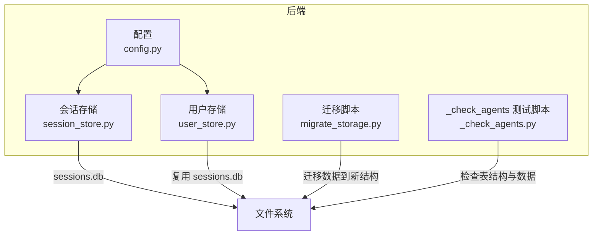
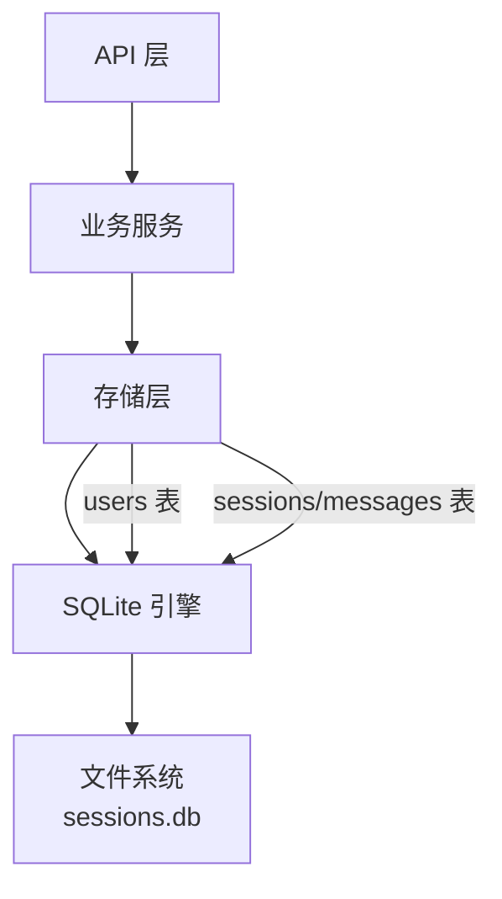
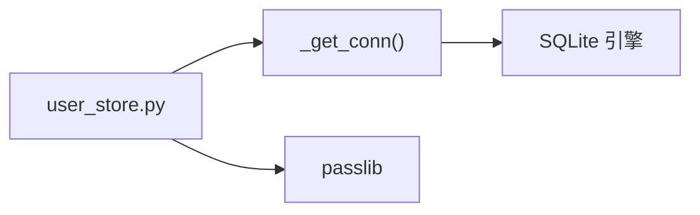
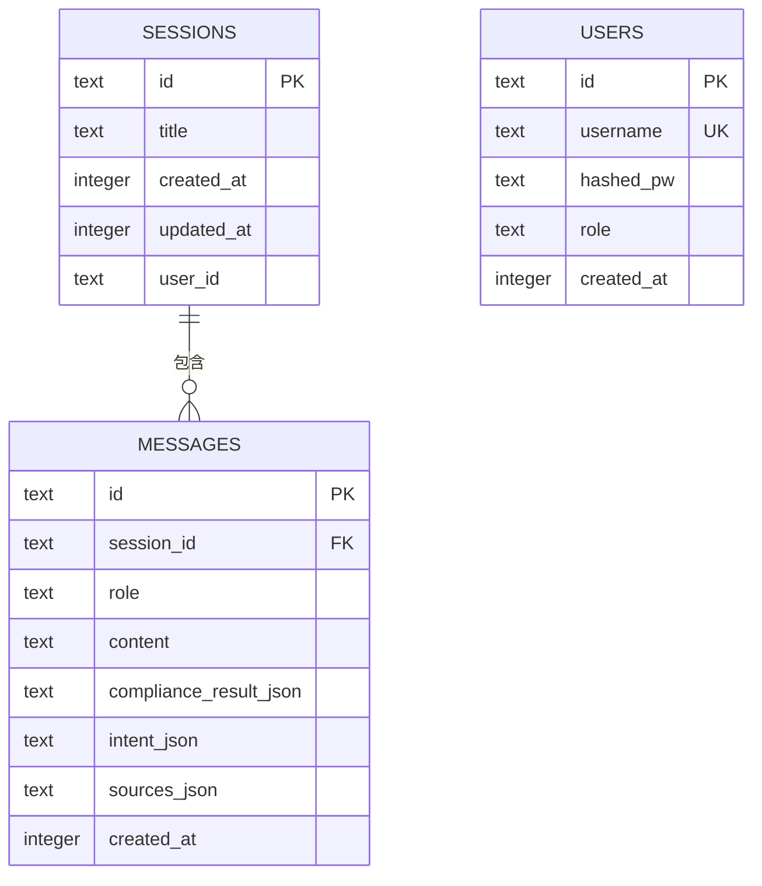
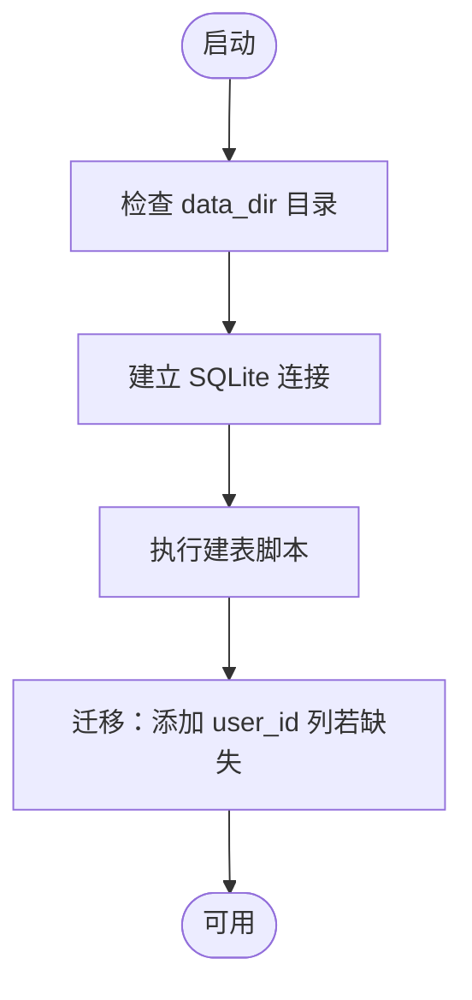
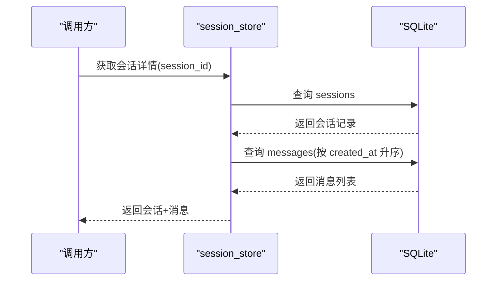

# 数据库模式设计

<cite>
**本文引用的文件**
- [session_store.py](file://backend/app/storage/session_store.py)
- [user_store.py](file://backend/app/storage/user_store.py)
- [config.py](file://backend/app/config.py)
- [migrate_storage.py](file://backend/scripts/migrate_storage.py)
- [_check_agents.py](file://backend/tests/archived/_check_agents.py)
</cite>

## 目录
1. [简介](#简介)
2. [项目结构](#项目结构)
3. [核心组件](#核心组件)
4. [架构总览](#架构总览)
5. [详细组件分析](#详细组件分析)
6. [依赖分析](#依赖分析)
7. [性能考虑](#性能考虑)
8. [故障排查指南](#故障排查指南)
9. [结论](#结论)
10. [附录](#附录)

## 简介
本文件面向避风港平台的数据库模式设计，聚焦关系型数据库（以SQLite为主）的表结构与运行机制。重点覆盖以下内容：
- sessions 表与 messages 表的字段定义、数据类型、约束与索引
- 外键关系与参照完整性保障
- SQLite 初始化流程、建表脚本与迁移机制
- 数据验证规则与业务规则约束
- 数据访问模式、查询优化策略与性能考量
- 数据生命周期管理与备份恢复建议

## 项目结构
数据库相关代码主要集中在后端模块中：
- 存储层：会话与消息的持久化实现位于 session_store.py；用户信息复用同一数据库文件，位于 user_store.py
- 配置层：通过配置项确定数据目录，决定数据库文件位置
- 脚本层：提供数据迁移脚本，将旧结构迁移到新的分层存储

图表来源
- [config.py:134](file://backend/app/config.py#L134)
- [session_store.py:21](file://backend/app/storage/session_store.py#L21)
- [user_store.py:15](file://backend/app/storage/user_store.py#L15)
- [migrate_storage.py:71](file://backend/scripts/migrate_storage.py#L71)
- [_check_agents.py:4](file://backend/tests/archived/_check_agents.py#L4)

章节来源
- [config.py:134](file://backend/app/config.py#L134)
- [session_store.py:1](file://backend/app/storage/session_store.py#L1)
- [user_store.py:1](file://backend/app/storage/user_store.py#L1)
- [migrate_storage.py:71](file://backend/scripts/migrate_storage.py#L71)
- [_check_agents.py:1](file://backend/tests/archived/_check_agents.py#L1)

## 核心组件
- 会话存储（session_store.py）
  - 提供 sessions 与 messages 两张表的建表、索引与增删改查接口
  - 支持按用户维度筛选会话、统计消息数、生成最近消息预览等
  - 自动迁移：为旧表增加 user_id 字段
- 用户存储（user_store.py）
  - 在同一数据库文件中创建 users 表，复用 session_store 的连接
  - 提供密码哈希与校验工具
- 配置（config.py）
  - 定义 data_dir，默认为 ./data，决定数据库文件路径
- 迁移脚本（migrate_storage.py）
  - 将旧版原始数据与事件链迁移到新的分层存储结构
- 测试脚本（_check_agents.py）
  - 演示如何连接数据库并检查表结构

章节来源
- [session_store.py:37](file://backend/app/storage/session_store.py#L37)
- [session_store.py:74](file://backend/app/storage/session_store.py#L74)
- [user_store.py:22](file://backend/app/storage/user_store.py#L22)
- [config.py:134](file://backend/app/config.py#L134)
- [migrate_storage.py:71](file://backend/scripts/migrate_storage.py#L71)
- [_check_agents.py:4](file://backend/tests/archived/_check_agents.py#L4)

## 架构总览
下图展示数据库模式在系统中的位置与交互：

图表来源
- [session_store.py:27](file://backend/app/storage/session_store.py#L27)
- [user_store.py:22](file://backend/app/storage/user_store.py#L22)

## 详细组件分析

### sessions 表设计
- 字段与类型
  - id: 文本主键，唯一标识会话
  - title: 文本，非空，会话标题
  - created_at: 整数，非空，Unix 时间戳（创建时间）
  - updated_at: 整数，非空，Unix 时间戳（最后更新时间）
  - user_id: 文本，可空，新增列，支持按用户维度筛选
- 约束
  - 主键约束：id 唯一且非空
  - 非空约束：title、created_at、updated_at
  - 可空约束：user_id（兼容旧版本）
- 索引
  - 无显式索引，但迁移逻辑会在初始化时尝试添加 user_id 列
- 业务规则
  - 标题长度限制（插入时截断至 80 字符）
  - 更新时间随消息写入同步刷新

章节来源
- [session_store.py:39](file://backend/app/storage/session_store.py#L39)
- [session_store.py:74](file://backend/app/storage/session_store.py#L74)
- [session_store.py:228](file://backend/app/storage/session_store.py#L228)

### messages 表设计
- 字段与类型
  - id: 文本主键，唯一标识消息
  - session_id: 文本，外键关联 sessions.id
  - role: 文本，非空，消息角色（如 user/assistant/system）
  - content: 文本，非空，消息内容
  - compliance_result_json: 文本，可空，合规结果（JSON 文本）
  - intent_json: 文本，可空，意图识别结果（JSON 文本）
  - sources_json: 文本，可空，来源列表（JSON 文本）
  - created_at: 整数，非空，Unix 时间戳
- 约束
  - 主键约束：id 唯一且非空
  - 非空约束：session_id、role、content、created_at
  - 外键约束：session_id 引用 sessions.id，并启用级联删除
- 索引
  - idx_messages_session(session_id)：加速按会话检索
- 业务规则
  - JSON 字段统一以文本形式存储，插入时序列化，读取时反序列化
  - 最近消息查询按 created_at 降序取前 N 条，并反转恢复时间顺序

章节来源
- [session_store.py:46](file://backend/app/storage/session_store.py#L46)
- [session_store.py:55](file://backend/app/storage/session_store.py#L55)
- [session_store.py:170](file://backend/app/storage/session_store.py#L170)
- [session_store.py:186](file://backend/app/storage/session_store.py#L186)

### 外键关系与参照完整性
- 关系
  - messages.session_id → sessions.id（一对多：一个会话包含多条消息）
- 行为
  - 删除会话时，启用 ON DELETE CASCADE，自动删除其全部消息
- 一致性
  - 插入消息时必须提供有效的 session_id，否则违反外键约束

章节来源
- [session_store.py:55](file://backend/app/storage/session_store.py#L55)
- [session_store.py:220](file://backend/app/storage/session_store.py#L220)

### SQLite 初始化与建表脚本
- 初始化流程
  - 首次访问数据库时，确保 data_dir 目录存在
  - 建立连接并设置 row_factory 为 sqlite3.Row
  - 执行建表脚本：创建 sessions、messages 表及必要索引
  - 执行迁移：为 sessions 表增加 user_id 列（若不存在则忽略异常）
- 建表脚本要点
  - sessions：主键 id，非空字段 title/created_at/updated_at
  - messages：主键 id，外键 session_id 引用 sessions(id)，ON DELETE CASCADE
  - 索引：messages(session_id)、sessions(updated_at DESC)

章节来源
- [session_store.py:27](file://backend/app/storage/session_store.py#L27)
- [session_store.py:37](file://backend/app/storage/session_store.py#L37)
- [session_store.py:64](file://backend/app/storage/session_store.py#L64)

### users 表设计（复用 sessions.db）
- 字段与类型
  - id: 文本主键
  - username: 文本唯一且非空
  - hashed_pw: 文本非空，存储 bcrypt 哈希
  - role: 文本非空，默认为 'user'
  - created_at: 整数非空
- 约束
  - 主键：id
  - 唯一性：username
  - 默认值：role 默认 'user'
- 业务规则
  - 使用 passlib 的 bcrypt 上下文进行密码哈希与校验

章节来源
- [user_store.py:25](file://backend/app/storage/user_store.py#L25)
- [user_store.py:38](file://backend/app/storage/user_store.py#L38)
- [user_store.py:42](file://backend/app/storage/user_store.py#L42)

### 数据访问模式与查询优化
- 访问模式
  - 会话列表：按 updated_at 降序分页，同时统计消息数与最近用户消息预览
  - 会话详情：先查 sessions，再按 created_at 升序查 messages
  - 最近消息：按 created_at 降序取前 N 条并反转
- 查询优化
  - idx_messages_session(session_id)：加速按会话检索消息
  - idx_sessions_updated(updated_at DESC)：加速按时间排序的会话列表
- 性能建议
  - 对高频查询使用索引
  - 控制单次查询返回的数据量（分页/限制）
  - JSON 字段仅在需要时解析，避免不必要的反序列化

章节来源
- [session_store.py:87](file://backend/app/storage/session_store.py#L87)
- [session_store.py:134](file://backend/app/storage/session_store.py#L134)
- [session_store.py:170](file://backend/app/storage/session_store.py#L170)
- [session_store.py:58](file://backend/app/storage/session_store.py#L58)
- [session_store.py:60](file://backend/app/storage/session_store.py#L60)

### 数据验证规则与业务规则
- 输入验证
  - sessions.title 插入时截断至 80 字符
  - sessions.user_id 可空，用于按用户过滤
  - messages.content 非空，role 非空
- 业务规则
  - 新增消息后同步更新所属会话的 updated_at
  - 删除会话触发级联删除其全部消息
  - JSON 字段统一以文本存储，读取时容错处理（异常返回 None）

章节来源
- [session_store.py:74](file://backend/app/storage/session_store.py#L74)
- [session_store.py:194](file://backend/app/storage/session_store.py#L194)
- [session_store.py:213](file://backend/app/storage/session_store.py#L213)
- [session_store.py:240](file://backend/app/storage/session_store.py#L240)
- [session_store.py:244](file://backend/app/storage/session_store.py#L244)

### 迁移机制
- 目标
  - 将旧版原始数据与事件链迁移到新的分层存储结构
- 步骤
  - 迁移原始数据：复制 hs_codes/vat_rates 等文件到新目录
  - 迁移 regulations.md 到新位置
  - 迁移事件链与动作链到 L5 结构
- 注意事项
  - 迁移脚本会打印状态，确认无误后再清理旧文件

章节来源
- [migrate_storage.py:32](file://backend/scripts/migrate_storage.py#L32)
- [migrate_storage.py:61](file://backend/scripts/migrate_storage.py#L61)
- [migrate_storage.py:71](file://backend/scripts/migrate_storage.py#L71)

## 依赖分析
- 组件耦合
  - session_store 与 user_store 共享同一 SQLite 连接（复用 sessions.db）
  - user_store 通过 session_store 的连接函数获取连接
- 外部依赖
  - SQLite 引擎
  - Python 标准库 sqlite3、json、uuid、time、pathlib
  - passlib（密码哈希）
- 潜在风险
  - 多线程/多进程并发写入需谨慎（check_same_thread=False）
  - JSON 字段解析失败时的容错处理

图表来源
- [user_store.py:15](file://backend/app/storage/user_store.py#L15)
- [session_store.py:27](file://backend/app/storage/session_store.py#L27)

章节来源
- [user_store.py:15](file://backend/app/storage/user_store.py#L15)
- [session_store.py:27](file://backend/app/storage/session_store.py#L27)

## 性能考虑
- 索引策略
  - messages(session_id)：按会话检索消息
  - sessions(updated_at DESC)：按时间排序的会话列表
- 查询优化
  - 使用 LIMIT 控制返回数量
  - 避免 SELECT *，仅选择必要字段
- 存储与序列化
  - JSON 字段采用文本存储，减少复杂类型开销
  - 解析失败时快速返回 None，避免异常传播
- 并发与事务
  - 单连接写入，批量提交（commit）降低锁竞争
  - 对于高并发场景，建议引入连接池或拆分读写

[本节为通用指导，不直接分析具体文件]

## 故障排查指南
- 数据库文件不存在
  - 现象：首次启动时报错或无法创建表
  - 排查：确认 data_dir 是否正确，目录是否存在；启动后端应自动生成 sessions.db
- 表结构不一致
  - 现象：缺少 user_id 或其他列
  - 排查：查看初始化迁移逻辑是否执行；可参考测试脚本连接数据库检查表结构
- JSON 字段解析异常
  - 现象：读取消息时出现 None
  - 排查：确认 JSON 序列化/反序列化逻辑；检查字段是否为空
- 外键约束错误
  - 现象：插入消息时报外键约束失败
  - 排查：确认 session_id 是否存在于 sessions 表

章节来源
- [_check_agents.py:4](file://backend/tests/archived/_check_agents.py#L4)
- [session_store.py:244](file://backend/app/storage/session_store.py#L244)

## 结论
该数据库模式围绕 sessions 与 messages 两张表构建，采用 SQLite 本地存储，具备清晰的外键关系与索引策略。通过初始化脚本与迁移机制，既能满足当前业务需求，又为后续扩展提供了基础。配合合理的查询优化与容错处理，可在中小规模场景下稳定运行。

[本节为总结性内容，不直接分析具体文件]

## 附录

### 表关系图

图表来源
- [session_store.py:39](file://backend/app/storage/session_store.py#L39)
- [session_store.py:46](file://backend/app/storage/session_store.py#L46)
- [user_store.py:25](file://backend/app/storage/user_store.py#L25)

### 初始化与迁移流程图

图表来源
- [session_store.py:27](file://backend/app/storage/session_store.py#L27)
- [session_store.py:37](file://backend/app/storage/session_store.py#L37)
- [session_store.py:64](file://backend/app/storage/session_store.py#L64)

### 数据访问序列图（获取会话详情）

图表来源
- [session_store.py:134](file://backend/app/storage/session_store.py#L134)
- [session_store.py:143](file://backend/app/storage/session_store.py#L143)