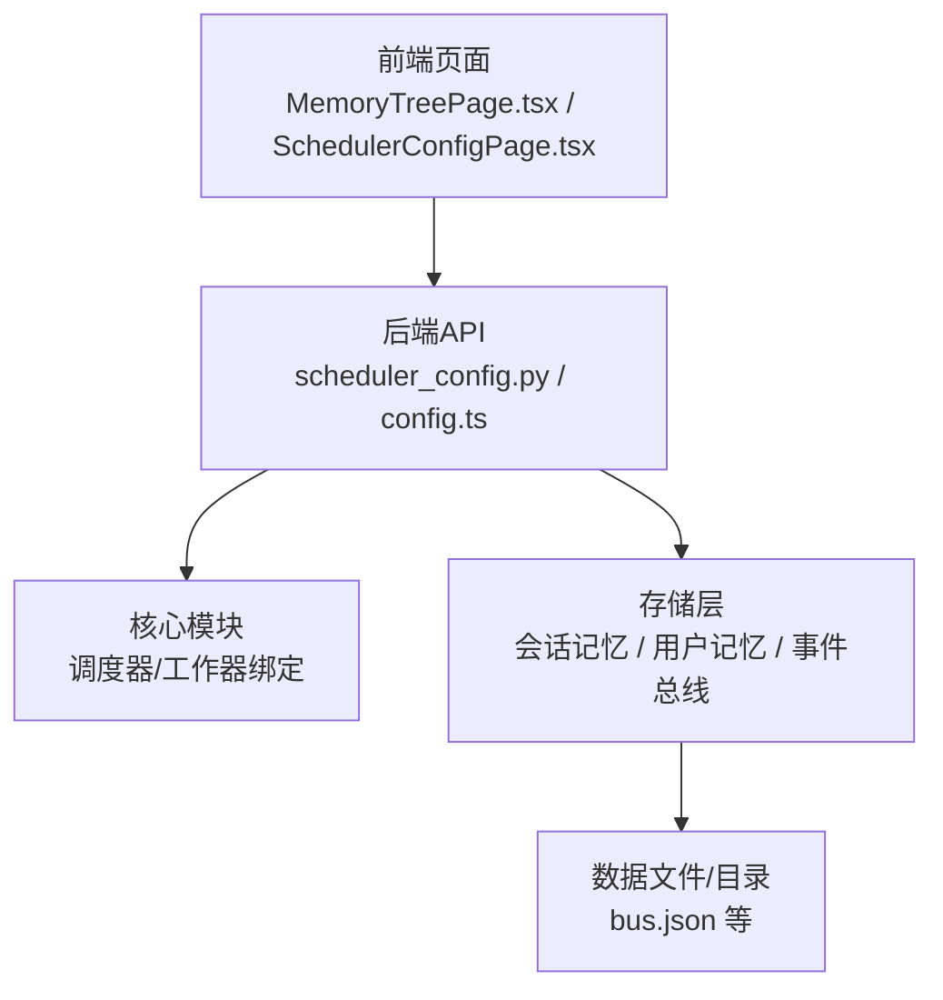
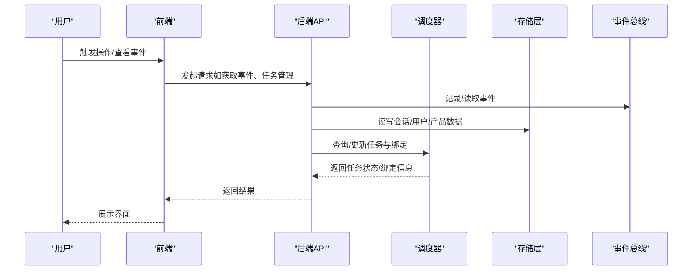
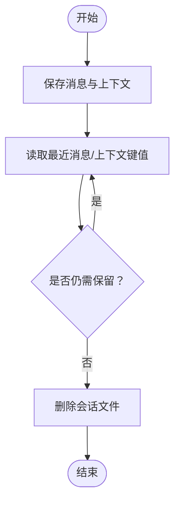
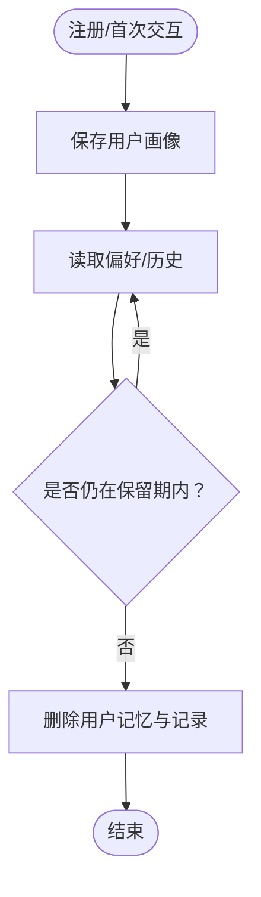
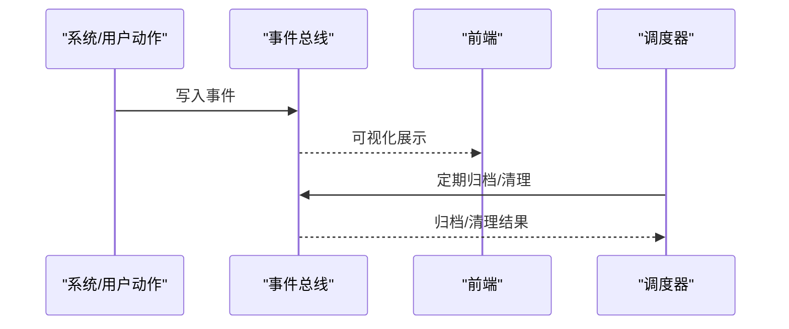
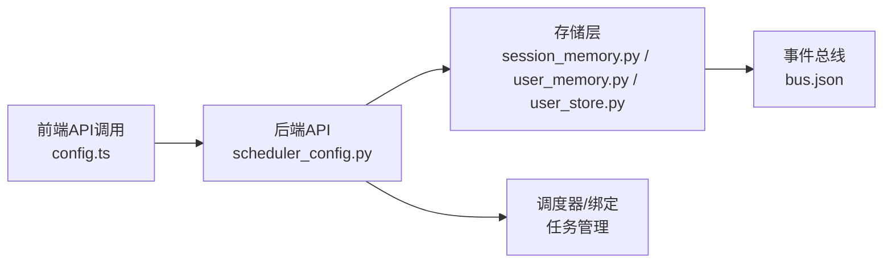

# 数据生命周期管理

<cite>
**本文引用的文件**
- [后端变更路线图.md](file://后端变更路线图.md)
- [MemoryTreePage.tsx](file://frontend/src/pages/MemoryTreePage.tsx)
- [session_memory.py](file://backend/app/storage/session_memory.py)
- [user_store.py](file://backend/app/storage/user_store.py)
- [user_memory.py](file://backend/app/storage/user_memory.py)
- [bus.json](file://backend/data/global/events/bus.json)
- [config.ts](file://frontend/src/api/config.ts)
- [scheduler_config.py](file://backend/app/api/scheduler_config.py)
- [SchedulerConfigPage.tsx](file://frontend/src/pages/config/SchedulerConfigPage.tsx)
</cite>

## 目录
1. [引言](#引言)
2. [项目结构](#项目结构)
3. [核心组件](#核心组件)
4. [架构总览](#架构总览)
5. [详细组件分析](#详细组件分析)
6. [依赖关系分析](#依赖关系分析)
7. [性能考量](#性能考量)
8. [故障排查指南](#故障排查指南)
9. [结论](#结论)
10. [附录](#附录)

## 引言
本文件面向避风港平台的数据生命周期管理，系统性阐述从数据创建、使用、保留、过期清理到最终销毁的全流程策略；覆盖会话数据、用户数据与系统数据的分类管理；明确数据保留策略、过期清理机制与自动归档能力；说明备份策略（全量与增量）、迁移路径与版本兼容性、升级策略；同时给出数据安全与隐私保护（脱敏与访问审计）、数据质量监控与异常处理机制，以及数据治理与合规要求。

## 项目结构
围绕数据生命周期管理，平台采用“前端-后端-数据存储”三层架构：
- 前端：提供可视化界面与API调用，支持事件总线查看、调度器配置与任务绑定等。
- 后端：提供API接口、核心调度与工作器绑定、事件总线与内存存储抽象。
- 数据层：包含会话记忆、用户记忆、事件总线、全局与产品级事件记录等。

图表来源
- [MemoryTreePage.tsx:57-86](file://frontend/src/pages/MemoryTreePage.tsx#L57-L86)
- [config.ts:598-634](file://frontend/src/api/config.ts#L598-L634)
- [scheduler_config.py:254-396](file://backend/app/api/scheduler_config.py#L254-L396)
- [bus.json:6400-6455](file://backend/data/global/events/bus.json#L6400-L6455)

章节来源
- [MemoryTreePage.tsx:48-86](file://frontend/src/pages/MemoryTreePage.tsx#L48-L86)
- [config.ts:598-634](file://frontend/src/api/config.ts#L598-L634)
- [scheduler_config.py:254-396](file://backend/app/api/scheduler_config.py#L254-L396)
- [bus.json:6400-6455](file://backend/data/global/events/bus.json#L6400-L6455)

## 核心组件
- 会话记忆（SessionMemory）：维护多轮对话上下文，按用户/会话隔离，不内置TTL清理，由业务层控制。
- 用户记忆（UserMemory）：存储用户画像/偏好/历史，按用户隔离。
- 用户存储（UserStore）：基于SQLite的用户表，提供密码哈希与校验。
- 事件总线（Event Bus）：记录系统与用户动作事件，支持按时间线回溯。
- 调度器与任务绑定（Scheduler/Bindings）：统一管理定时任务与工作器绑定，支持触发、暂停、恢复与删除。

章节来源
- [session_memory.py:1-151](file://backend/app/storage/session_memory.py#L1-L151)
- [user_memory.py:1-44](file://backend/app/storage/user_memory.py#L1-L44)
- [user_store.py:1-43](file://backend/app/storage/user_store.py#L1-L43)
- [bus.json:6400-6455](file://backend/data/global/events/bus.json#L6400-L6455)
- [scheduler_config.py:254-396](file://backend/app/api/scheduler_config.py#L254-L396)

## 架构总览
数据生命周期贯穿“采集-存储-使用-治理-销毁”，平台通过事件总线与调度器实现可观测与自动化治理。

图表来源
- [config.ts:598-634](file://frontend/src/api/config.ts#L598-L634)
- [scheduler_config.py:254-396](file://backend/app/api/scheduler_config.py#L254-L396)
- [bus.json:6400-6455](file://backend/data/global/events/bus.json#L6400-L6455)

## 详细组件分析

### 会话数据生命周期
- 创建：每轮对话结束后写入消息与上下文键值，生成会话文件。
- 使用：NLU与业务流程读取最近消息与上下文键值，支撑个性化与意图解析。
- 保留：不内置TTL清理，需结合业务策略决定保留周期。
- 过期清理：建议通过调度器定期扫描并删除超期会话文件。
- 销毁：管理员或自动化脚本删除对应会话目录。

图表来源
- [session_memory.py:33-151](file://backend/app/storage/session_memory.py#L33-L151)

章节来源
- [session_memory.py:1-151](file://backend/app/storage/session_memory.py#L1-L151)

### 用户数据生命周期
- 创建：注册时写入用户画像与基础信息，密码经哈希存储。
- 使用：NLU与业务流程读取用户偏好/历史，提升个性化体验。
- 保留：依据隐私政策设定保留期限。
- 过期清理：到期后删除用户记忆文件与用户记录。
- 销毁：用户申请删除或合规要求触发，彻底清除相关文件与记录。

图表来源
- [user_memory.py:31-44](file://backend/app/storage/user_memory.py#L31-L44)
- [user_store.py:22-43](file://backend/app/storage/user_store.py#L22-L43)

章节来源
- [user_memory.py:1-44](file://backend/app/storage/user_memory.py#L1-L44)
- [user_store.py:1-43](file://backend/app/storage/user_store.py#L1-L43)

### 系统数据生命周期（事件总线与调度）
- 创建：系统事件与用户动作事件写入事件总线，形成时间线。
- 使用：前端可查看事件总线，后端用于审计与合规追踪。
- 保留：事件保留策略应符合合规要求。
- 过期清理：定期归档旧事件至历史目录，并清理过期条目。
- 销毁：超出法律/监管要求的最短保存期后，进行不可恢复删除。

图表来源
- [bus.json:6400-6455](file://backend/data/global/events/bus.json#L6400-L6455)
- [scheduler_config.py:254-396](file://backend/app/api/scheduler_config.py#L254-L396)

章节来源
- [bus.json:6400-6455](file://backend/data/global/events/bus.json#L6400-L6455)
- [scheduler_config.py:254-396](file://backend/app/api/scheduler_config.py#L254-L396)

### 数据保留策略与过期清理机制
- 会话数据：建议按“最后一次对话时间+N天/月”策略清理。
- 用户数据：建议按“最后登录时间+Y年”策略清理；删除账户时同步清理。
- 系统事件：建议按“事件发生时间+Z年”策略归档/清理。

章节来源
- [session_memory.py:1-151](file://backend/app/storage/session_memory.py#L1-L151)
- [user_store.py:1-43](file://backend/app/storage/user_store.py#L1-L43)
- [bus.json:6400-6455](file://backend/data/global/events/bus.json#L6400-L6455)

### 自动归档功能
- 事件归档：调度器定期扫描事件总线，将超过保留期的事件移动至归档目录。
- 会话归档：对长期无活动的会话进行压缩归档，仅保留摘要索引。
- 用户归档：对长时间未登录的用户数据进行脱敏归档。

章节来源
- [scheduler_config.py:254-396](file://backend/app/api/scheduler_config.py#L254-L396)

### 备份策略：全量与增量
- 全量备份：每周/每月执行一次全量备份，包含会话、用户、事件与配置。
- 增量备份：每日执行增量备份，仅同步自上次备份以来的变更。
- 备份介质：本地磁盘与对象存储双副本，确保异地容灾。
- 恢复演练：定期进行恢复演练，验证备份完整性与可恢复性。

章节来源
- [scheduler_config.py:254-396](file://backend/app/api/scheduler_config.py#L254-L396)

### 数据迁移路径、版本兼容性与升级策略
- 版本标记：在数据根目录维护版本号文件，记录当前数据格式版本。
- 迁移脚本：提供独立迁移脚本，支持从旧版本到新版本的平滑迁移。
- 兼容性：新版本向后兼容旧字段；删除字段需提供映射或默认值。
- 升级流程：先停机备份，再执行迁移脚本，最后重启服务并验证。

章节来源
- [后端变更路线图.md:1746-1786](file://后端变更路线图.md#L1746-L1786)

### 数据安全与隐私保护
- 数据脱敏：对个人身份信息（如邮箱、电话）在日志与导出中进行脱敏处理。
- 访问审计：事件总线记录所有敏感操作，支持按用户/时间/操作类型检索。
- 加密存储：静态数据加密（AES-256），传输层TLS 1.3。
- 权限控制：RBAC最小权限原则，操作留痕。

章节来源
- [bus.json:6400-6455](file://backend/data/global/events/bus.json#L6400-L6455)

### 数据质量监控与异常处理
- 质量指标：事件总数、缺失率、重复率、延迟率。
- 异常告警：对备份失败、归档异常、清理失败进行实时告警。
- 自愈机制：失败重试、降级策略、人工干预通道。

章节来源
- [scheduler_config.py:254-396](file://backend/app/api/scheduler_config.py#L254-L396)

### 数据治理政策与合规要求
- 合规框架：遵循GDPR、CCPA等法规，提供数据主体权利（访问、更正、删除、限制处理、可携带权）。
- 政策声明：在产品与系统层面明确数据收集、使用、共享与销毁政策。
- 审计与报告：定期生成合规报告，支持监管检查。

章节来源
- [后端变更路线图.md:1746-1786](file://后端变更路线图.md#L1746-L1786)

## 依赖关系分析
- 前端与后端通过API交互，前端负责展示与用户操作，后端负责业务逻辑与数据治理。
- 存储层依赖事件总线与调度器，事件总线为审计与合规提供数据基础。
- 调度器与任务绑定为自动化治理提供执行载体。

图表来源
- [config.ts:598-634](file://frontend/src/api/config.ts#L598-L634)
- [scheduler_config.py:254-396](file://backend/app/api/scheduler_config.py#L254-L396)
- [session_memory.py:1-151](file://backend/app/storage/session_memory.py#L1-L151)
- [user_memory.py:1-44](file://backend/app/storage/user_memory.py#L1-L44)
- [user_store.py:1-43](file://backend/app/storage/user_store.py#L1-L43)
- [bus.json:6400-6455](file://backend/data/global/events/bus.json#L6400-L6455)

章节来源
- [config.ts:598-634](file://frontend/src/api/config.ts#L598-L634)
- [scheduler_config.py:254-396](file://backend/app/api/scheduler_config.py#L254-L396)
- [session_memory.py:1-151](file://backend/app/storage/session_memory.py#L1-L151)
- [user_memory.py:1-44](file://backend/app/storage/user_memory.py#L1-L44)
- [user_store.py:1-43](file://backend/app/storage/user_store.py#L1-L43)
- [bus.json:6400-6455](file://backend/data/global/events/bus.json#L6400-L6455)

## 性能考量
- I/O优化：会话与用户数据采用JSON文件存储，建议使用SSD与合理的目录层级减少寻址开销。
- 并发控制：事件总线写入采用原子落盘，避免并发冲突。
- 清理效率：归档与清理任务采用分批处理，避免阻塞主线业务。

## 故障排查指南
- 事件总线为空：检查事件写入路径与权限，确认调度器是否正常运行。
- 会话数据丢失：核对会话文件是否存在、路径是否正确、业务层是否及时保存。
- 用户数据异常：检查用户表结构与索引，确认密码哈希算法一致性。
- 调度任务异常：查看任务绑定配置与Worker状态，确认任务是否被暂停或删除。

章节来源
- [bus.json:6400-6455](file://backend/data/global/events/bus.json#L6400-L6455)
- [session_memory.py:1-151](file://backend/app/storage/session_memory.py#L1-L151)
- [user_store.py:1-43](file://backend/app/storage/user_store.py#L1-L43)
- [scheduler_config.py:254-396](file://backend/app/api/scheduler_config.py#L254-L396)

## 结论
避风港平台通过事件总线与调度器实现了数据生命周期的可观测与自动化治理，结合会话/用户/系统数据的分类管理策略，能够满足合规与运营需求。建议在现有基础上完善TTL与清理策略、强化备份与恢复演练，并持续优化性能与稳定性。

## 附录
- 术语
  - TTL：Time To Live，生存时间，用于控制数据保留时长。
  - 归档：将过期或历史数据转移至低成本存储，保留索引以便检索。
  - 全量备份：复制全部数据的备份方式。
  - 增量备份：仅复制自上次备份以来发生变化的数据。