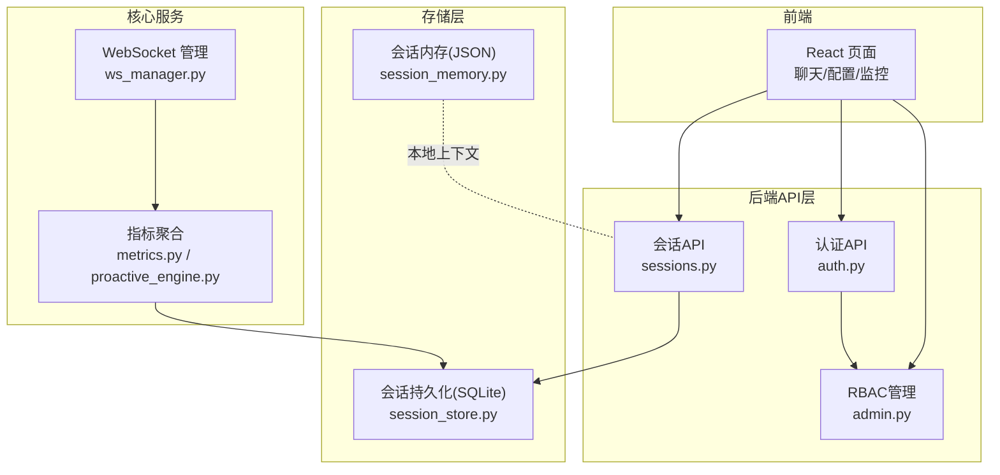
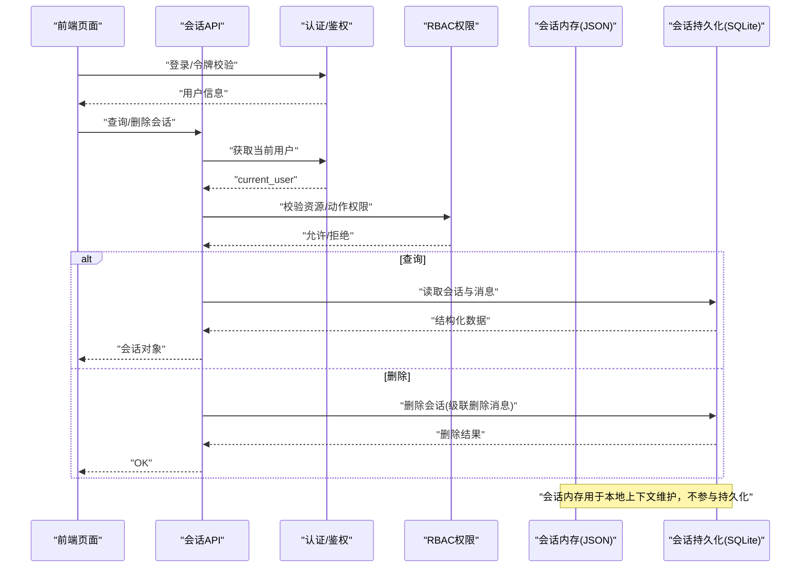
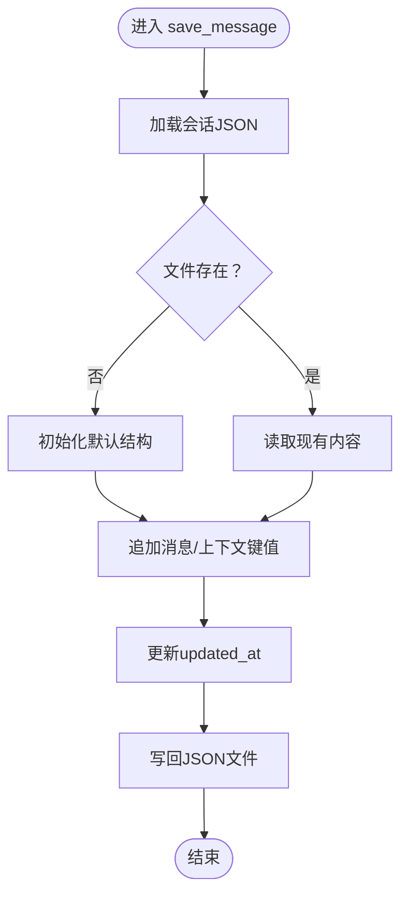
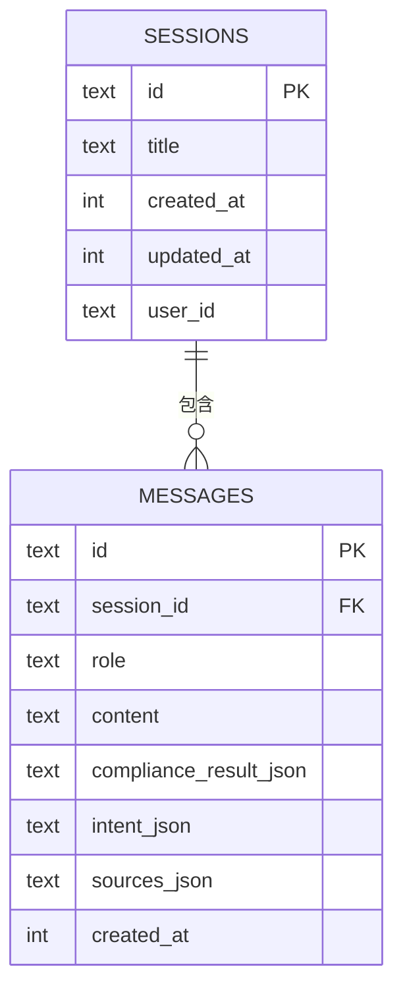
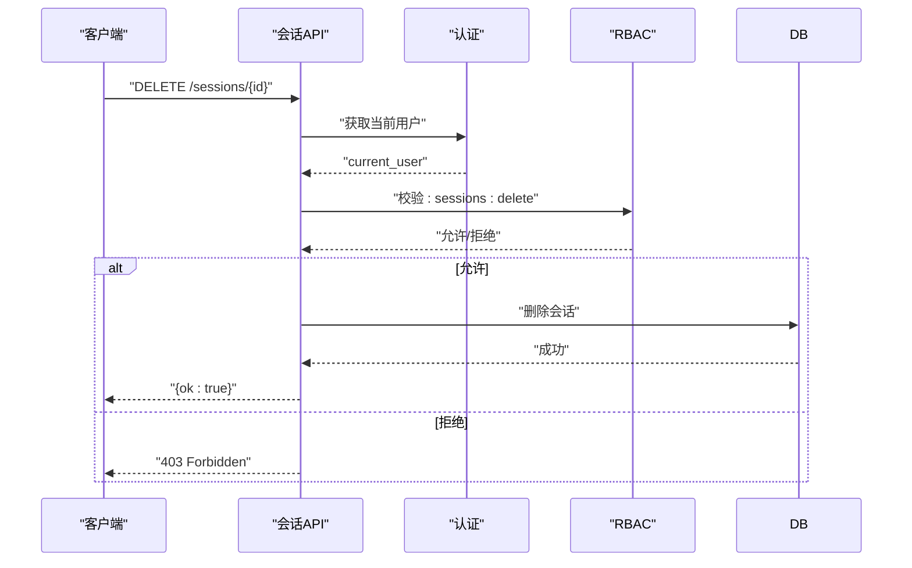
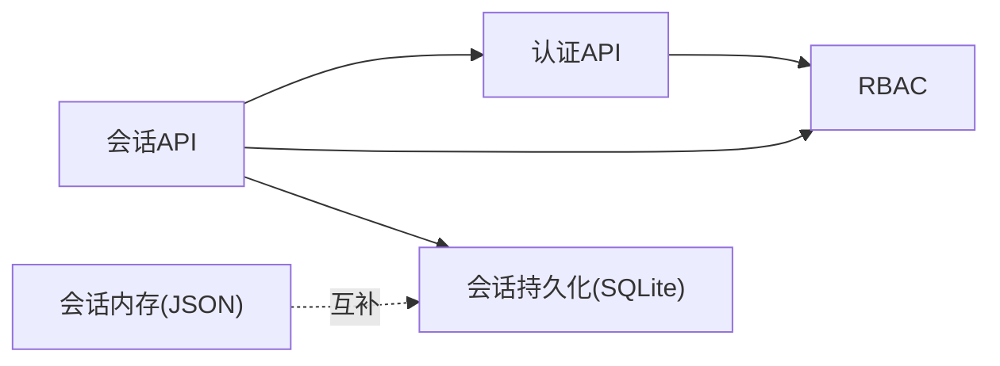

# 会话内存存储

<cite>
**本文引用的文件**
- [session_memory.py](file://backend/app/storage/session_memory.py)
- [session_store.py](file://backend/app/storage/session_store.py)
- [sessions.py](file://backend/app/api/sessions.py)
- [auth.py](file://backend/app/api/auth.py)
- [auth_core.py](file://backend/app/core/auth.py)
- [rbac.py](file://backend/app/core/rbac.py)
- [admin.py](file://backend/app/api/admin.py)
- [ws_manager.py](file://backend/app/services/ws_manager.py)
- [metrics.py](file://backend/app/core/metrics.py)
- [proactive_engine.py](file://backend/app/core/proactive_engine.py)
- [前后端api交互.md](file://前后端api交互.md)
</cite>

## 目录
1. [简介](#简介)
2. [项目结构](#项目结构)
3. [核心组件](#核心组件)
4. [架构总览](#架构总览)
5. [详细组件分析](#详细组件分析)
6. [依赖关系分析](#依赖关系分析)
7. [性能考量](#性能考量)
8. [故障排查指南](#故障排查指南)
9. [结论](#结论)
10. [附录](#附录)

## 简介
本文件围绕避风港平台的“会话内存存储”体系进行系统化技术文档编制，覆盖会话生命周期管理、状态维护、数据同步机制；阐明会话存储的数据结构、缓存策略与失效机制；解释会话与用户认证、权限验证的集成方式；阐述并发控制、锁机制与一致性保障；并提供监控指标、性能分析与故障排查方法，以及扩容与分布式部署建议。

## 项目结构
会话内存存储涉及三层持久化与接口层：
- 会话内存层（SessionMemory）：以JSON文件形式按用户/会话隔离存储，适合本地快速读写与上下文维护。
- 会话持久化层（SessionStore）：基于SQLite的结构化存储，支持消息与会话的CRUD、索引与级联删除。
- API与鉴权层：提供会话查询/删除等接口，并结合认证与RBAC进行权限校验。

图表来源
- [sessions.py:40-78](file://backend/app/api/sessions.py#L40-L78)
- [session_store.py:1-235](file://backend/app/storage/session_store.py#L1-L235)
- [session_memory.py:1-112](file://backend/app/storage/session_memory.py#L1-L112)
- [auth.py](file://backend/app/api/auth.py)
- [rbac.py](file://backend/app/core/rbac.py)
- [ws_manager.py](file://backend/app/services/ws_manager.py)
- [metrics.py](file://backend/app/core/metrics.py)
- [proactive_engine.py:765-804](file://backend/app/core/proactive_engine.py#L765-L804)

章节来源
- [sessions.py:40-78](file://backend/app/api/sessions.py#L40-L78)
- [session_store.py:1-235](file://backend/app/storage/session_store.py#L1-L235)
- [session_memory.py:1-112](file://backend/app/storage/session_memory.py#L1-L112)
- [auth.py](file://backend/app/api/auth.py)
- [rbac.py](file://backend/app/core/rbac.py)
- [ws_manager.py](file://backend/app/services/ws_manager.py)
- [metrics.py](file://backend/app/core/metrics.py)
- [proactive_engine.py:765-804](file://backend/app/core/proactive_engine.py#L765-L804)

## 核心组件
- 会话内存（SessionMemory）
  - 作用：维护多轮对话上下文，按用户/会话隔离，文件系统存储，适合轻量级上下文读写。
  - 关键点：路径组织、消息追加、上下文键值设置、文件落盘。
- 会话持久化（SessionStore）
  - 作用：结构化存储会话与消息，支持CRUD、索引、外键约束与级联删除。
  - 关键点：数据库初始化、消息插入、会话更新时间戳、删除会话。
- 会话API（sessions.py）
  - 作用：对外提供会话查询、删除等接口，结合鉴权与RBAC进行访问控制。
  - 关键点：权限校验、消息结构转换、错误处理。
- 认证与RBAC
  - 作用：用户身份验证与权限控制，确保非管理员仅能访问自身资源。
  - 关键点：鉴权中间件、角色分配、权限检查。

章节来源
- [session_memory.py:20-112](file://backend/app/storage/session_memory.py#L20-L112)
- [session_store.py:25-235](file://backend/app/storage/session_store.py#L25-L235)
- [sessions.py:40-78](file://backend/app/api/sessions.py#L40-L78)
- [auth_core.py](file://backend/app/core/auth.py)
- [rbac.py:181-223](file://backend/app/core/rbac.py#L181-L223)

## 架构总览
会话内存存储在系统中的位置与交互如下：

图表来源
- [sessions.py:40-78](file://backend/app/api/sessions.py#L40-L78)
- [auth.py](file://backend/app/api/auth.py)
- [rbac.py:181-223](file://backend/app/core/rbac.py#L181-L223)
- [session_store.py:74-235](file://backend/app/storage/session_store.py#L74-L235)
- [session_memory.py:20-112](file://backend/app/storage/session_memory.py#L20-L112)

## 详细组件分析

### 会话内存（SessionMemory）
- 数据结构
  - 文件命名：按用户/会话隔离，文件名为会话ID.json。
  - 默认字段：会话ID、用户ID、创建时间、消息数组、更新时间。
  - 上下文键值：通过键值对扩展上下文（如产品、市场），每次更新携带更新时间。
- 生命周期管理
  - 创建：首次读取不存在时自动初始化默认结构。
  - 更新：追加消息、设置上下文键值、更新时间戳。
  - 存储：落盘写入，确保UTF-8编码与缩进格式。
- 并发与一致性
  - 单文件写入，无显式锁；高并发下建议外部加锁或使用原子写入策略。
  - 读写分离：读取先判断文件是否存在，避免重复创建。
- 缓存与失效
  - 无TTL清理逻辑，由业务层控制生命周期；适合短期上下文。
- 与会话持久化的协作
  - 内存层负责运行期上下文，持久层负责长期结构化存储与审计。

图表来源
- [session_memory.py:33-112](file://backend/app/storage/session_memory.py#L33-L112)

章节来源
- [session_memory.py:20-112](file://backend/app/storage/session_memory.py#L20-L112)

### 会话持久化（SessionStore）
- 数据模型
  - 会话表：主键ID、标题、创建时间、更新时间、用户ID。
  - 消息表：主键ID、会话ID（外键）、角色、内容、合规结果、意图、来源、创建时间。
  - 索引：按会话ID的消息索引、按更新时间的会话索引。
- 生命周期管理
  - 创建：生成UUID作为会话ID，记录创建/更新时间。
  - 追加：插入消息，同时更新会话updated_at。
  - 删除：删除会话触发消息级联删除。
- 并发与一致性
  - 使用SQLite连接池与事务语义，保证插入与更新原子性。
  - 线程安全：启用check_same_thread=False，但需在调用侧避免跨线程共享连接。
- 缓存与失效
  - 无内置缓存；可通过应用层引入LRU或TTL缓存提升热点查询性能。
- 与会话内存的协作
  - 持久层承担长期存储与审计，内存层承担运行期上下文加速。

图表来源
- [session_store.py:37-70](file://backend/app/storage/session_store.py#L37-L70)

章节来源
- [session_store.py:25-235](file://backend/app/storage/session_store.py#L25-L235)

### 会话API与权限控制
- 权限规则
  - 非管理员只能查看/删除自己的会话；管理员可全量访问。
  - 接口对消息结构进行转换，兼容合规结果、意图、来源等字段。
- 错误处理
  - 会话不存在返回404；权限不足返回403。
- 与认证/鉴权的集成
  - 通过依赖注入获取当前用户，结合RBAC进行资源与动作校验。

图表来源
- [sessions.py:40-78](file://backend/app/api/sessions.py#L40-L78)
- [auth.py](file://backend/app/api/auth.py)
- [rbac.py:181-223](file://backend/app/core/rbac.py#L181-L223)

章节来源
- [sessions.py:40-78](file://backend/app/api/sessions.py#L40-L78)
- [auth.py](file://backend/app/api/auth.py)
- [rbac.py:181-223](file://backend/app/core/rbac.py#L181-L223)

### 会话与用户认证、权限验证的关系
- 认证链路
  - 前端通过认证API获取令牌，后端通过鉴权中间件解析用户身份。
  - 会话API在处理请求前获取current_user，用于权限判定。
- RBAC集成
  - 管理员拥有所有资源的完全权限；普通用户仅能访问自身资源。
  - 可扩展为更细粒度的资源权限（如按user_id限定）。

章节来源
- [auth.py](file://backend/app/api/auth.py)
- [rbac.py:181-223](file://backend/app/core/rbac.py#L181-L223)
- [admin.py:39-76](file://backend/app/api/admin.py#L39-L76)

## 依赖关系分析
- 组件耦合
  - 会话API依赖认证与RBAC模块；会话持久化依赖SQLite连接；会话内存独立于持久化。
- 外部依赖
  - SQLite：提供结构化存储与索引能力。
  - 文件系统：会话内存依赖JSON文件读写。
- 潜在循环依赖
  - 当前模块间无明显循环导入；注意避免在API层直接引入核心服务导致反向依赖。

图表来源
- [sessions.py:40-78](file://backend/app/api/sessions.py#L40-L78)
- [session_store.py:25-235](file://backend/app/storage/session_store.py#L25-L235)
- [session_memory.py:20-112](file://backend/app/storage/session_memory.py#L20-L112)
- [auth.py](file://backend/app/api/auth.py)
- [rbac.py:181-223](file://backend/app/core/rbac.py#L181-L223)

章节来源
- [sessions.py:40-78](file://backend/app/api/sessions.py#L40-L78)
- [session_store.py:25-235](file://backend/app/storage/session_store.py#L25-L235)
- [session_memory.py:20-112](file://backend/app/storage/session_memory.py#L20-L112)
- [auth.py](file://backend/app/api/auth.py)
- [rbac.py:181-223](file://backend/app/core/rbac.py#L181-L223)

## 性能考量
- 会话内存
  - 优点：低延迟、简单可靠；适合短期上下文。
  - 限制：无TTL、单文件写入、无并发锁；高并发场景建议引入文件锁或原子写。
- 会话持久化
  - 优点：结构化查询、索引优化、级联删除、事务保证。
  - 优化：为高频查询建立复合索引；对热点会话引入应用层缓存（LRU/TTL）。
- 指标与监控
  - 可利用指标聚合模块与主动引擎生成系统健康度、产品合规度等指标，辅助容量规划与性能评估。

章节来源
- [session_memory.py:20-112](file://backend/app/storage/session_memory.py#L20-L112)
- [session_store.py:25-235](file://backend/app/storage/session_store.py#L25-L235)
- [metrics.py](file://backend/app/core/metrics.py)
- [proactive_engine.py:765-804](file://backend/app/core/proactive_engine.py#L765-L804)

## 故障排查指南
- 常见问题
  - 会话不存在：检查会话ID是否正确，确认用户权限。
  - 权限不足：确认当前用户角色与目标资源归属。
  - 文件写入失败：检查data目录权限、磁盘空间、文件锁占用。
  - SQLite异常：检查连接池状态、事务未提交、索引缺失导致的慢查询。
- 排查步骤
  - 日志定位：结合API层错误码与RBAC返回信息。
  - 数据核对：对比会话内存JSON与SQLite表数据一致性。
  - 性能验证：对高频查询添加索引，观察响应时间变化。
- 监控建议
  - 会话数量、消息条数、删除频率、查询耗时、文件系统IO、SQLite连接数。

章节来源
- [sessions.py:40-78](file://backend/app/api/sessions.py#L40-L78)
- [session_store.py:25-235](file://backend/app/storage/session_store.py#L25-L235)
- [session_memory.py:20-112](file://backend/app/storage/session_memory.py#L20-L112)

## 结论
会话内存存储通过“内存上下文+持久化结构”的双轨设计，在易用性与可靠性之间取得平衡。配合完善的认证与RBAC体系，既能满足日常对话上下文需求，又能确保数据安全与审计能力。未来可在并发控制、缓存策略与分布式部署方面进一步增强。

## 附录

### 扩容与分布式部署建议
- 会话内存
  - 引入文件锁或原子写策略，降低并发冲突。
  - 将热会话迁移至Redis等内存缓存，保留冷数据在JSON文件。
- 会话持久化
  - 使用连接池与只读副本分担查询压力。
  - 对超大表进行分片或归档策略，定期清理历史会话。
- 集群与一致性
  - 通过消息总线或事件驱动实现跨节点同步，确保会话内存与持久化最终一致。
  - 在网关层引入幂等写入与重试机制，避免重复消息。

章节来源
- [session_memory.py:20-112](file://backend/app/storage/session_memory.py#L20-L112)
- [session_store.py:25-235](file://backend/app/storage/session_store.py#L25-L235)
- [前后端api交互.md:443-513](file://前后端api交互.md#L443-L513)