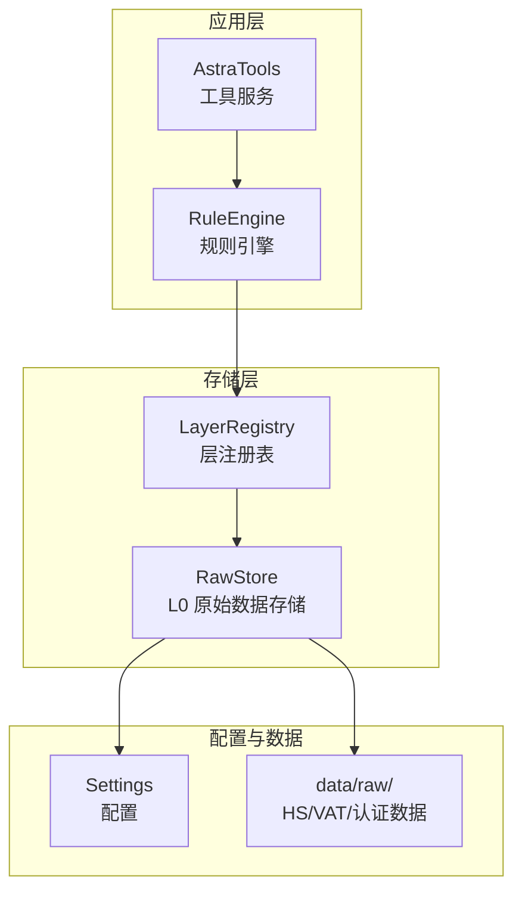
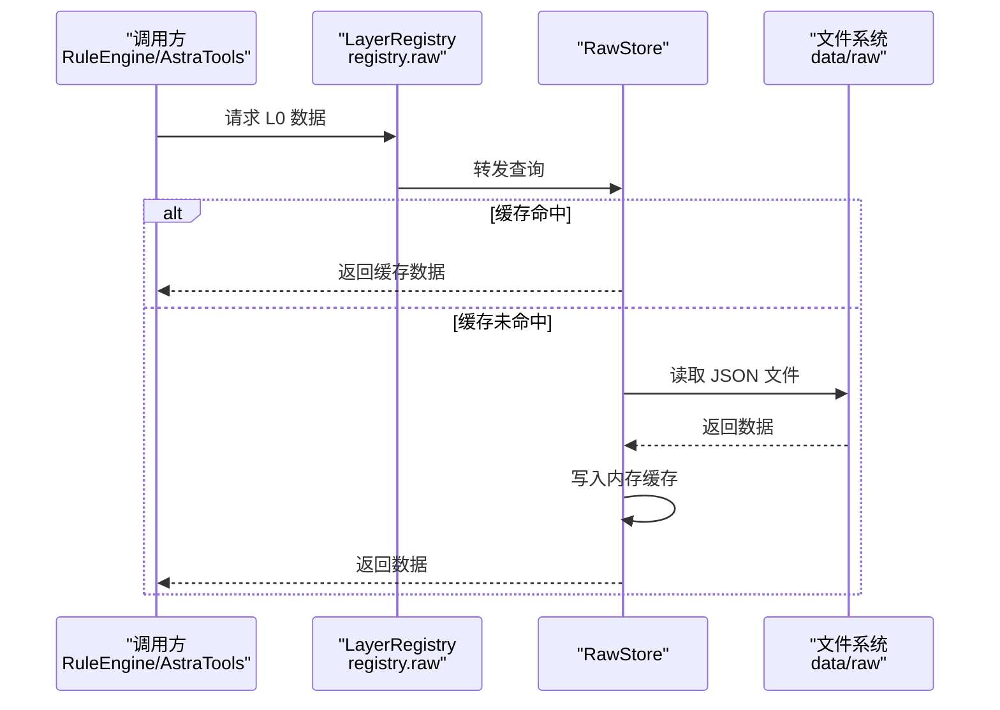
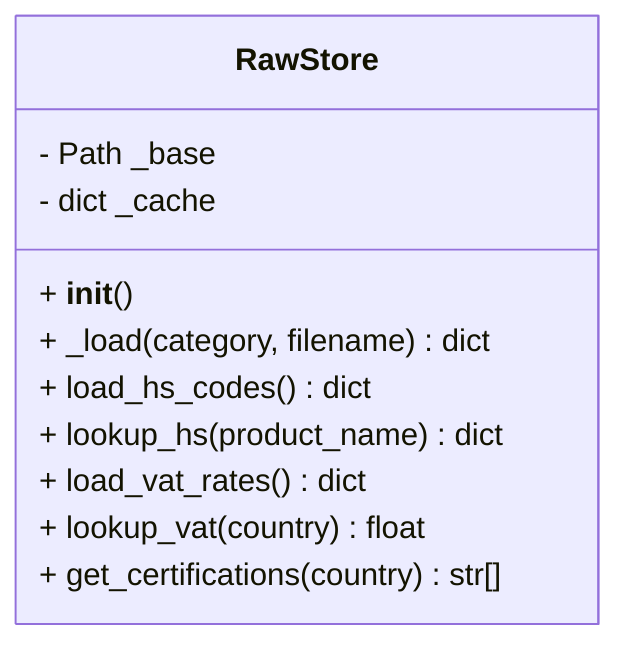
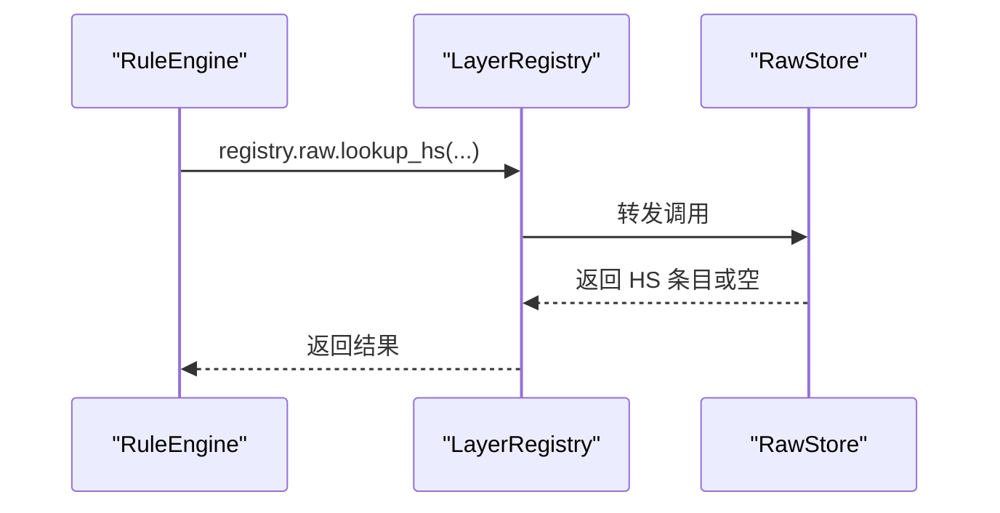
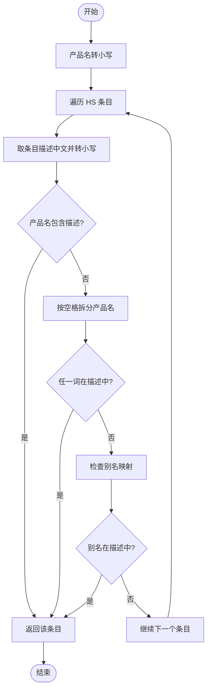
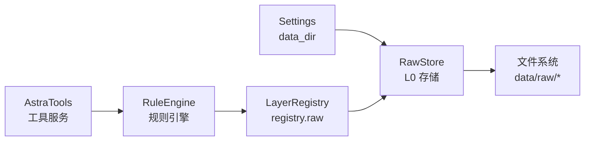

# 原始数据存储层

<cite>
**本文引用的文件**
- [raw_store.py](file://backend/app/storage/raw_store.py)
- [rule_engine.py](file://backend/app/core/rule_engine.py)
- [layer_registry.py](file://backend/app/storage/layer_registry.py)
- [astra_tools.py](file://backend/app/services/astra_tools.py)
- [settings.py](file://backend/app/config/settings.py)
</cite>

## 目录
1. [简介](#简介)
2. [项目结构](#项目结构)
3. [核心组件](#核心组件)
4. [架构总览](#架构总览)
5. [详细组件分析](#详细组件分析)
6. [依赖关系分析](#依赖关系分析)
7. [性能考虑](#性能考虑)
8. [故障排查指南](#故障排查指南)
9. [结论](#结论)
10. [附录](#附录)

## 简介
本文件面向避风港平台的 L0 原始数据存储层，系统化阐述其在合规确定性检查中的作用与实现细节。重点覆盖以下方面：
- L0 层数据来源与组织：HS 编码、VAT 税率、认证矩阵等静态数据的文件结构与加载策略
- 数据缓存机制：按需加载与内存缓存，避免重复磁盘 IO
- 文件读取策略与内存优化：基于路径拼接与 UTF-8 解码的稳健读取
- 数据加载流程：从注册表到规则引擎的调用链路
- 模糊匹配算法与别名处理：产品名称到 HS 编码的近似匹配逻辑
- 数据验证、错误处理与默认值：缺失文件与未知键的容错策略
- 数据更新与热加载：缓存失效与重载机制
- 与其他存储层的协作关系：L0 与 L1（知识库向量化）、事件写入等

## 项目结构
围绕 L0 原始数据存储层的关键文件与职责如下：
- 存储层入口：RawStore 提供统一的 L0 数据访问接口
- 规则引擎：RuleEngine 作为上层调用方，通过注册表访问 L0 数据
- 注册表：LayerRegistry 将各层存储抽象为统一访问对象
- 工具服务：AstraTools 以工具形式封装对 L0 的查询能力
- 配置：Settings 提供 data_dir 路径，决定 L0 数据根目录

图表来源
- [rule_engine.py:1-42](file://backend/app/core/rule_engine.py#L1-L42)
- [astra_tools.py:80-88](file://backend/app/services/astra_tools.py#L80-L88)
- [layer_registry.py:22](file://backend/app/storage/layer_registry.py#L22)
- [raw_store.py:19-130](file://backend/app/storage/raw_store.py#L19-L130)
- [settings.py](file://backend/app/config/settings.py)

章节来源
- [raw_store.py:1-104](file://backend/app/storage/raw_store.py#L1-L104)
- [rule_engine.py:1-42](file://backend/app/core/rule_engine.py#L1-L42)
- [layer_registry.py:22](file://backend/app/storage/layer_registry.py#L22)
- [astra_tools.py:80-88](file://backend/app/services/astra_tools.py#L80-L88)
- [settings.py](file://backend/app/config/settings.py)

## 核心组件
- RawStore：负责按分类读取 data/raw 下的 JSON 文件，构建内存缓存，提供 HS 编码、VAT 税率与认证矩阵的查询接口
- RuleEngine：面向高频确定性合规检查的引擎，直接依赖 L0 数据进行 HS 匹配、VAT 查询与认证矩阵检索
- LayerRegistry：提供统一的 registry.raw 接口，屏蔽具体存储实现
- AstraTools：将规则引擎能力包装为可被工作流或外部调用使用的工具函数
- Settings：提供 data_dir，决定 L0 数据根目录

章节来源
- [raw_store.py:19-130](file://backend/app/storage/raw_store.py#L19-L130)
- [rule_engine.py:17-42](file://backend/app/core/rule_engine.py#L17-L42)
- [layer_registry.py:22](file://backend/app/storage/layer_registry.py#L22)
- [astra_tools.py:80-88](file://backend/app/services/astra_tools.py#L80-L88)
- [settings.py](file://backend/app/config/settings.py)

## 架构总览
L0 原始数据存储层位于应用层与数据文件之间，承担“静态数据即服务”的角色。其核心流程：
- 初始化：RawStore 在构造时解析 data_dir，并准备缓存字典
- 加载：首次访问某分类/文件时，按 category/filename 拼接路径并读取 JSON；成功后写入内存缓存
- 查询：RuleEngine 通过 registry.raw 直接调用 RawStore 的查询方法
- 容错：当文件不存在或键缺失时，返回空结果或默认值，不抛出异常
- 更新：当前实现为一次性加载并常驻内存；如需热更新，可通过重建实例或显式清空缓存后重新加载

图表来源
- [rule_engine.py:17-42](file://backend/app/core/rule_engine.py#L17-L42)
- [raw_store.py:28-41](file://backend/app/storage/raw_store.py#L28-L41)

## 详细组件分析

### RawStore 组件分析
- 职责边界
  - 仅负责 L0 层静态数据的读取与缓存
  - 不参与业务规则计算，不写入数据
- 数据结构
  - HS 编码：按产品描述中文进行模糊匹配
  - VAT 税率：按国家名查询标准税率
  - 认证矩阵：按国家返回所需认证列表
- 缓存策略
  - 键格式：category/filename
  - 命中：直接返回内存字典
  - 未命中：读取 JSON 并写入缓存
- 文件读取
  - 路径：data_dir/raw/category/filename
  - 编码：UTF-8
  - 容错：文件不存在时返回空字典
- 查询接口
  - HS 编码：lookup_hs(product_name)
  - VAT 税率：lookup_vat(country)
  - 认证矩阵：get_certifications(country)

图表来源
- [raw_store.py:19-130](file://backend/app/storage/raw_store.py#L19-L130)

章节来源
- [raw_store.py:19-130](file://backend/app/storage/raw_store.py#L19-L130)

### 规则引擎与注册表协作
- RuleEngine 通过 registry.raw 直接调用 RawStore 的查询方法
- 当 L0 数据不可用时，返回空结果并标记，不中断流程
- 该设计确保高频确定性检查的低延迟与高可靠性

图表来源
- [rule_engine.py:17-26](file://backend/app/core/rule_engine.py#L17-L26)
- [layer_registry.py:22](file://backend/app/storage/layer_registry.py#L22)
- [raw_store.py:60-92](file://backend/app/storage/raw_store.py#L60-L92)

章节来源
- [rule_engine.py:17-42](file://backend/app/core/rule_engine.py#L17-L42)
- [layer_registry.py:22](file://backend/app/storage/layer_registry.py#L22)

### 工具服务对接
- AstraTools 将规则引擎函数包装为工具，便于在工作流或外部调用中使用
- 通过 registry.raw 获取 L0 数据，保持与规则引擎一致的查询路径

章节来源
- [astra_tools.py:80-88](file://backend/app/services/astra_tools.py#L80-L88)

### HS 编码模糊匹配与别名处理
- 匹配策略
  - 产品名称转小写，与描述中文进行包含匹配
  - 对名称进行分词，逐词匹配描述
  - 支持预定义别名映射，提升召回
- 别名映射示例（节选）
  - “锂电池” → “锂离子蓄电池”、“电池”
  - “笔记本” → “便携式数据处理设备”
  - “灯” → “LED灯具”、“照明装置”
- 返回规则
  - 优先返回首个匹配项
  - 无匹配返回 None

图表来源
- [raw_store.py:60-92](file://backend/app/storage/raw_store.py#L60-L92)

章节来源
- [raw_store.py:60-92](file://backend/app/storage/raw_store.py#L60-L92)

### 数据验证、错误处理与默认值
- 文件存在性
  - 不存在时返回空字典，避免异常传播
- 键缺失
  - 通过默认值或空集合返回，保证上层健壮性
- 国家/产品名无效
  - VAT 查询返回 0.0 表示未知
  - HS 匹配返回 None 表示未找到
- 规则引擎降级
  - L0 数据不可用时返回空结果并标记，不阻断主流程

章节来源
- [raw_store.py:34-41](file://backend/app/storage/raw_store.py#L34-L41)
- [raw_store.py:96-104](file://backend/app/storage/raw_store.py#L96-L104)
- [rule_engine.py:10](file://backend/app/core/rule_engine.py#L10)

### 数据更新与热加载
- 当前实现
  - 一次性加载并常驻内存，无自动热重载
- 可行方案
  - 显式清空缓存：删除 _cache 中对应键，触发下次访问时重新加载
  - 重建实例：在维护窗口内替换 registry.raw 实例
  - 文件监控：监听 data/raw 下文件变化，触发缓存失效与增量更新
- 注意事项
  - 更新期间可能短暂影响查询性能
  - 建议在低峰期执行批量更新

章节来源
- [raw_store.py:22-25](file://backend/app/storage/raw_store.py#L22-L25)
- [raw_store.py:30-41](file://backend/app/storage/raw_store.py#L30-L41)

### 与其他存储层的协作关系
- L0 → L1：L0 的法规文本（Markdown）由知识加载器读取并向量化至 L1，供语义检索使用
- L0 → 事件写入：规则引擎在合规检查后将动作写入 L5 事件存储，形成闭环
- L0 → 工具服务：AstraTools 以工具形式复用 L0 查询能力

章节来源
- [raw_store.py:9](file://backend/app/storage/raw_store.py#L9)
- [rule_engine.py:10](file://backend/app/core/rule_engine.py#L10)
- [astra_tools.py:80-88](file://backend/app/services/astra_tools.py#L80-L88)

## 依赖关系分析
- RawStore 依赖 Settings 提供 data_dir，决定 L0 数据根目录
- RuleEngine 依赖 LayerRegistry 的 registry.raw 接口
- AstraTools 依赖 RuleEngine 的查询函数
- L0 数据文件位于 data/raw 下，按分类组织（hs_codes、vat_rates、certifications）

图表来源
- [settings.py](file://backend/app/config/settings.py)
- [raw_store.py:22-24](file://backend/app/storage/raw_store.py#L22-L24)
- [layer_registry.py:22](file://backend/app/storage/layer_registry.py#L22)
- [rule_engine.py:14](file://backend/app/core/rule_engine.py#L14)
- [astra_tools.py:80-88](file://backend/app/services/astra_tools.py#L80-L88)

章节来源
- [settings.py](file://backend/app/config/settings.py)
- [raw_store.py:22-24](file://backend/app/storage/raw_store.py#L22-L24)
- [layer_registry.py:22](file://backend/app/storage/layer_registry.py#L22)
- [rule_engine.py:14](file://backend/app/core/rule_engine.py#L14)
- [astra_tools.py:80-88](file://backend/app/services/astra_tools.py#L80-L88)

## 性能考虑
- 缓存命中率
  - 首次访问触发磁盘 IO，后续访问走内存，显著降低延迟
- 文件大小与加载时间
  - 大型 JSON 文件建议拆分或按需分片，减少冷启动时间
- 查询复杂度
  - HS 模糊匹配为线性扫描，条目数较多时可引入索引或倒排表
- 并发安全
  - 当前实现未加锁，若多线程并发访问，建议增加读写锁或只读快照
- 内存占用
  - 全量加载适合中小规模数据；大规模数据应考虑懒加载与分页

## 故障排查指南
- 症状：查询返回空或 0.0
  - 检查 data/raw 下对应文件是否存在
  - 确认文件编码为 UTF-8
  - 核对国家/产品名称是否在数据集中
- 症状：HS 匹配不到
  - 检查产品名称是否包含在描述中文中
  - 确认别名映射是否覆盖目标产品
- 症状：规则引擎报错
  - 确认 registry.raw 是否正确初始化
  - 检查 L0 数据加载是否成功
- 症状：更新后未生效
  - 当前实现不支持热重载，需重建实例或清空缓存后重启

章节来源
- [raw_store.py:34-41](file://backend/app/storage/raw_store.py#L34-L41)
- [raw_store.py:96-104](file://backend/app/storage/raw_store.py#L96-L104)
- [rule_engine.py:10](file://backend/app/core/rule_engine.py#L10)

## 结论
L0 原始数据存储层通过简洁的文件组织与内存缓存，为规则引擎提供了稳定、低延迟的确定性数据支撑。其设计强调易用性与容错性，适合在高频合规检查场景中快速落地。未来可在缓存失效策略、索引与并发控制等方面进一步优化，以适配更大规模与更复杂的业务需求。

## 附录
- 数据目录约定
  - HS 编码：data/raw/hs_codes/_all.json
  - VAT 税率：data/raw/vat_rates/_all.json
  - 认证矩阵：data/raw/certifications/_all.json
- 关键接口路径
  - HS 查询：[lookup_hs:60-92](file://backend/app/storage/raw_store.py#L60-L92)
  - VAT 查询：[lookup_vat:99-104](file://backend/app/storage/raw_store.py#L99-L104)
  - 认证查询：[get_certifications:118-130](file://backend/app/storage/raw_store.py#L118-L130)
- 调用链参考
  - 规则引擎入口：[lookup_hs/lookup_vat/get_certifications:17-42](file://backend/app/core/rule_engine.py#L17-L42)
  - 工具服务封装：[lookup_hs_code/lookup_vat_rate:80-88](file://backend/app/services/astra_tools.py#L80-L88)