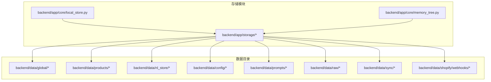
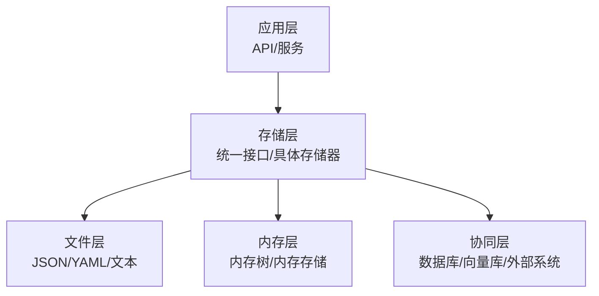
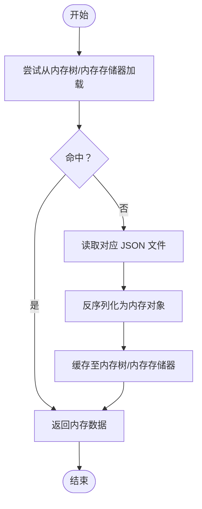
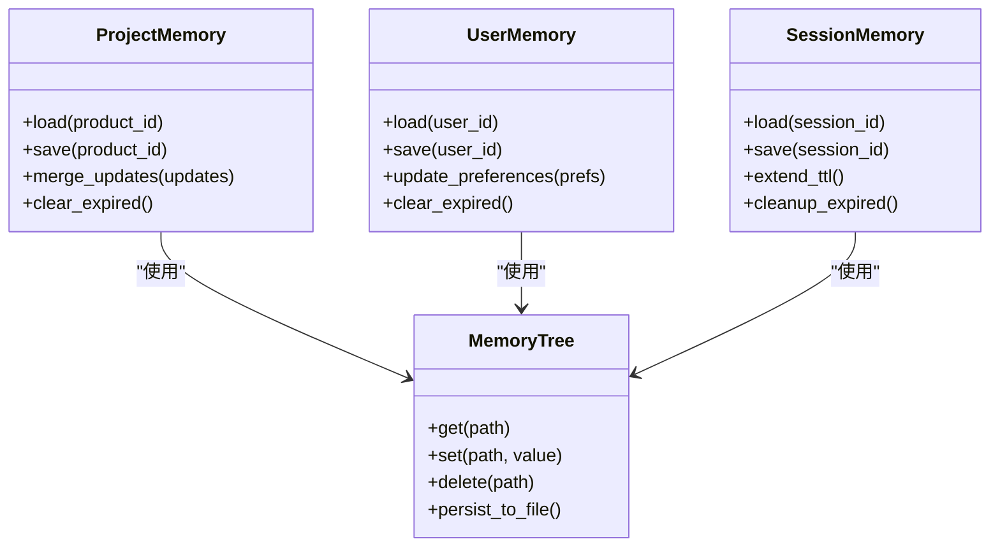
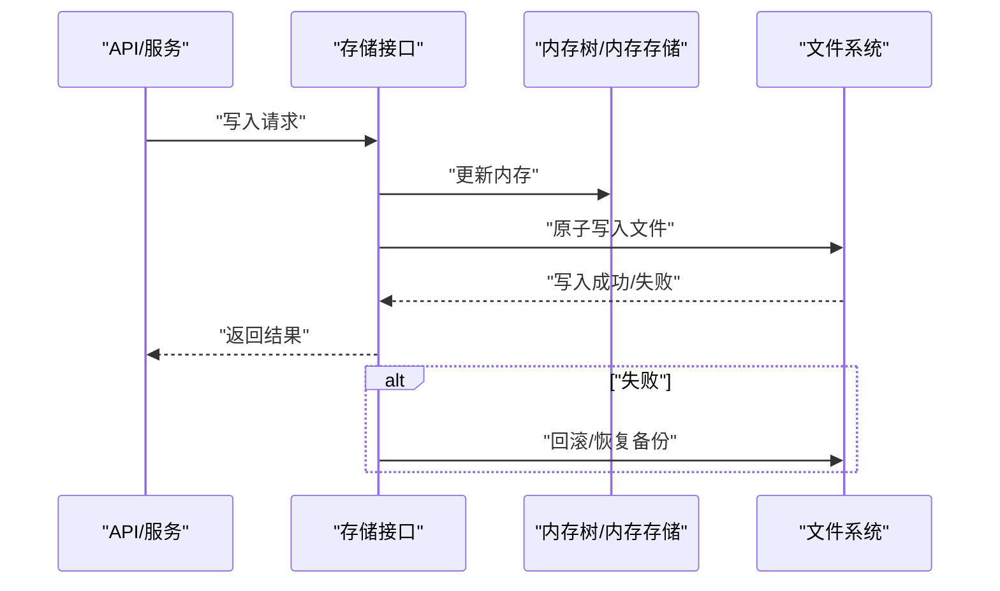
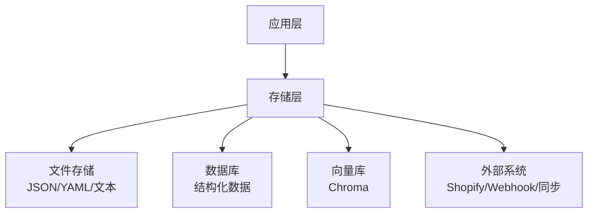
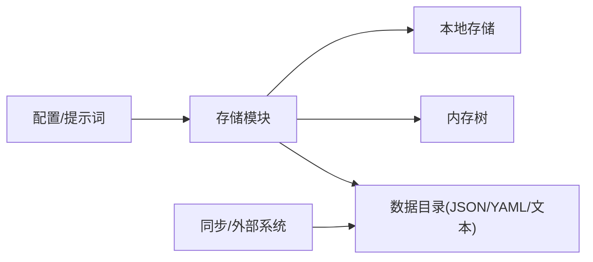

# 文件存储系统

<cite>
**本文引用的文件**
- [backend/app/storage/__init__.py](file://backend/app/storage/__init__.py)
- [backend/app/storage/agent_config_store.py](file://backend/app/storage/agent_config_store.py)
- [backend/app/storage/event_store.py](file://backend/app/storage/event_store.py)
- [backend/app/storage/project_memory.py](file://backend/app/storage/project_memory.py)
- [backend/app/storage/session_memory.py](file://backend/app/storage/session_memory.py)
- [backend/app/storage/session_store.py](file://backend/app/storage/session_store.py)
- [backend/app/storage/user_memory.py](file://backend/app/storage/user_memory.py)
- [backend/app/storage/user_store.py](file://backend/app/storage/user_store.py)
- [backend/app/storage/raw_store.py](file://backend/app/storage/raw_store.py)
- [backend/app/core/local_store.py](file://backend/app/core/local_store.py)
- [backend/app/core/memory_tree.py](file://backend/app/core/memory_tree.py)
- [backend/data/chroma](file://backend/data/chroma)
- [backend/data/config/skills/registry.json](file://backend/data/config/skills/registry.json)
- [backend/data/global/metrics/custom_metrics.json](file://backend/data/global/metrics/custom_metrics.json)
- [backend/data/global/products_index.json](file://backend/data/global/products_index.json)
- [backend/data/global/memory/global_memory.json](file://backend/data/global/memory/global_memory.json)
- [backend/data/products/p_E2E测_1d642ce3/product.json](file://backend/data/products/p_E2E测_1d642ce3/product.json)
- [backend/data/products/p_E2E测_1d642ce3/knowledge/_all.json](file://backend/data/products/p_E2E测_1d642ce3/knowledge/_all.json)
- [backend/data/products/p_E2E测_1d642ce3/metrics/custom_metrics.json](file://backend/data/products/p_E2E测_1d642ce3/metrics/custom_metrics.json)
- [backend/data/products/p_E2E测_1d642ce3/events/chain_*.json](file://backend/data/products/p_E2E测_1d642ce3/events/chain_*.json)
- [backend/data/products/p_E2E测_1d642ce3/memory/*.json](file://backend/data/products/p_E2E测_1d642ce3/memory/*.json)
- [backend/data/nl_store/products/_all.json](file://backend/data/nl_store/products/_all.json)
- [backend/data/nl_store/products/玩具_欧盟.json](file://backend/data/nl_store/products/玩具_欧盟.json)
- [backend/data/nl_store/products/电子产品_德国.json](file://backend/data/nl_store/products/电子产品_德国.json)
- [backend/data/config/events/system_events.md](file://backend/data/config/events/system_events.md)
- [backend/data/config/scheduler/task_worker_bindings.json](file://backend/data/config/scheduler/task_worker_bindings.json)
- [backend/data/config/agent_extensions.json](file://backend/data/config/agent_extensions.json)
- [backend/data/config/rbac_users.json](file://backend/data/config/rbac_users.json)
- [backend/data/config/tools.json](file://backend/data/config/tools.json)
- [backend/data/config/oauth_connections.json](file://backend/data/config/oauth_connections.json)
- [backend/data/config/model_routes.json](file://backend/data/config/model_routes.json)
- [backend/data/config/channels.json](file://backend/data/config/channels.json)
- [backend/data/config/approvals.json](file://backend/data/config/approvals.json)
- [backend/data/config/events/certification_events.md](file://backend/data/config/events/certification_events.md)
- [backend/data/config/events/custom_events.md](file://backend/data/config/events/custom_events.md)
- [backend/data/config/events/lifecycle_events.md](file://backend/data/config/events/lifecycle_events.md)
- [backend/data/config/events/order_events.md](file://backend/data/config/events/order_events.md)
- [backend/data/config/events/risk_alert_events.md](file://backend/data/config/events/risk_alert_events.md)
- [backend/data/config/events/system_events.md](file://backend/data/config/events/system_events.md)
- [backend/data/config/events/user_action_events.md](file://backend/data/config/events/user_action_events.md)
- [backend/data/config/workers/custom_workers.md](file://backend/data/config/workers/custom_workers.md)
- [backend/data/sync/jobs.json](file://backend/data/sync/jobs.json)
- [backend/data/sync/logs.json](file://backend/data/sync/logs.json)
- [backend/data/shopify/webhooks/unknown.jsonl](file://backend/data/shopify/webhooks/unknown.jsonl)
- [backend/data/prompts/chat_compliance.yaml](file://backend/data/prompts/chat_compliance.yaml)
- [backend/data/prompts/impact_analysis.yaml](file://backend/data/prompts/impact_analysis.yaml)
- [backend/data/prompts/market_monitor.yaml](file://backend/data/prompts/market_monitor.yaml)
- [backend/data/prompts/nlu_fallback.yaml](file://backend/data/prompts/nlu_fallback.yaml)
- [backend/data/prompts/regulation_scan.yaml](file://backend/data/prompts/regulation_scan.yaml)
- [backend/data/prompts/risk_summary.yaml](file://backend/data/prompts/risk_summary.yaml)
- [backend/data/raw/regulations/eu](file://backend/data/raw/regulations/eu)
- [backend/data/raw/certifications](file://backend/data/raw/certifications)
- [backend/data/raw/hs_codes](file://backend/data/raw/hs_codes)
- [backend/data/raw/vat_rates](file://backend/data/raw/vat_rates)
- [backend/data/chain/actions/chain_*.json](file://backend/data/chain/actions/chain_*.json)
- [backend/data/event_chain/system_events/chain_*.json](file://backend/data/event_chain/system_events/chain_*.json)
- [backend/data/global/events/bus.json](file://backend/data/global/events/bus.json)
- [backend/data/config/events/_archive](file://backend/data/config/events/_archive)
- [backend/data/config/workers/_archive](file://backend/data/config/workers/_archive)
</cite>

## 目录
1. [简介](#简介)
2. [项目结构](#项目结构)
3. [核心组件](#核心组件)
4. [架构总览](#架构总览)
5. [详细组件分析](#详细组件分析)
6. [依赖关系分析](#依赖关系分析)
7. [性能考量](#性能考量)
8. [故障排查指南](#故障排查指南)
9. [结论](#结论)
10. [附录](#附录)

## 简介
本文件存储系统围绕“避风港平台”构建，采用以 JSON 为主的本地文件存储机制，结合内存树结构与项目/用户级内存存储，支撑知识检索、事件链路、产品配置、指标统计等业务场景。系统通过明确的目录层次、命名规范与读写流程，确保数据一致性、可追溯性与可维护性；同时在安全与权限方面提供基础约束，并与数据库/向量库等外部存储进行协调配合。

## 项目结构
文件存储主要分布在以下区域：
- 存储模块：backend/app/storage 与 backend/app/core 提供统一的存储抽象与本地存储能力
- 数据目录：backend/data 下按领域划分的多层级目录，包含 JSON、YAML、文本与二进制资源
- 全局与产品级数据：global、products、nl_store、config、prompts、raw 等
- 同步与集成：sync、shopify/webhooks 等

**图表来源**
- [backend/app/storage/__init__.py](file://backend/app/storage/__init__.py)
- [backend/app/core/local_store.py](file://backend/app/core/local_store.py)
- [backend/app/core/memory_tree.py](file://backend/app/core/memory_tree.py)
- [backend/data/global](file://backend/data/global)
- [backend/data/products](file://backend/data/products)
- [backend/data/nl_store](file://backend/data/nl_store)
- [backend/data/config](file://backend/data/config)
- [backend/data/prompts](file://backend/data/prompts)
- [backend/data/raw](file://backend/data/raw)
- [backend/data/sync](file://backend/data/sync)
- [backend/data/shopify/webhooks](file://backend/data/shopify/webhooks)

**章节来源**
- [backend/app/storage/__init__.py](file://backend/app/storage/__init__.py)
- [backend/app/core/local_store.py](file://backend/app/core/local_store.py)
- [backend/app/core/memory_tree.py](file://backend/app/core/memory_tree.py)

## 核心组件
- 统一存储接口与工厂：通过存储模块提供一致的 CRUD 与序列化/反序列化入口，屏蔽底层文件系统细节
- 本地存储（local_store）：提供文件读写、原子更新、备份与回滚等能力，保障并发与一致性
- 内存树（memory_tree）：以树形结构管理内存状态，支持快速查询、合并与持久化
- 专用存储器：
  - 用户存储（user_store）、会话存储（session_store）
  - 项目内存（project_memory）、用户内存（user_memory）、会话内存（session_memory）
  - 原始存储（raw_store）、事件存储（event_store）、代理配置存储（agent_config_store）

这些组件共同构成“文件+内存”的混合存储体系，既满足高可用与离线能力，又兼顾实时性与可扩展性。

**章节来源**
- [backend/app/storage/user_store.py](file://backend/app/storage/user_store.py)
- [backend/app/storage/session_store.py](file://backend/app/storage/session_store.py)
- [backend/app/storage/project_memory.py](file://backend/app/storage/project_memory.py)
- [backend/app/storage/user_memory.py](file://backend/app/storage/user_memory.py)
- [backend/app/storage/session_memory.py](file://backend/app/storage/session_memory.py)
- [backend/app/storage/raw_store.py](file://backend/app/storage/raw_store.py)
- [backend/app/storage/event_store.py](file://backend/app/storage/event_store.py)
- [backend/app/storage/agent_config_store.py](file://backend/app/storage/agent_config_store.py)
- [backend/app/core/local_store.py](file://backend/app/core/local_store.py)
- [backend/app/core/memory_tree.py](file://backend/app/core/memory_tree.py)

## 架构总览
文件存储系统采用“模块化存储 + 本地文件 + 内存树 + 外部资源”的分层架构：
- 应用层：API/服务调用存储接口
- 存储层：统一存储抽象与具体存储器
- 文件层：JSON/YAML/文本等资源文件
- 内存层：内存树与内存存储器
- 协同层：与数据库/向量库/外部系统对接

[此图为概念性架构示意，不直接映射具体源码文件，故无图表来源]

## 详细组件分析

### JSON 文件存储机制
- 文件组织结构
  - 全局数据：backend/data/global 下包含全局内存、指标、通知历史、产品索引等 JSON 文件
  - 产品数据：backend/data/products/<产品标识>/ 下按产品维度拆分 knowledge、metrics、events、memory、product.json 等
  - 自然语言存储：backend/data/nl_store/products/ 下存放按地区/品类聚合的自然语言索引 JSON
  - 配置与规则：backend/data/config/ 下包含技能注册表、调度绑定、RBAC 用户、工具、OAuth 连接、模型路由、渠道、审批、事件定义、工人定义等
  - 提示词：backend/data/prompts/ 下存放 YAML 提示词模板
  - 原始数据：backend/data/raw/ 下存放法规、认证、HS 编码、增值税率等原始数据
  - 事件链与动作：backend/data/chain/actions/ 与 backend/data/event_chain/system_events/ 下存放链式事件 JSON
  - 同步与集成：backend/data/sync/ 与 backend/data/shopify/webhooks/ 下存放作业、日志与 Webhook 数据流
- 命名规范与目录层次
  - 产品目录：p_<标识>_<哈希> 或 p_<标识>，内部按 knowledge、metrics、events、memory、product.json 组织
  - 事件文件：chain_<哈希>.json，便于链路追踪与审计
  - 全局文件：global_memory.json、products_index.json、custom_metrics.json 等
  - 配置文件：registry.json、task_worker_bindings.json、rbac_users.json 等
  - 自然语言索引：按“品类_地区.json”命名
- 读写流程
  - 读取：先从内存树或内存存储器获取，若缺失则从对应 JSON 文件反序列化加载
  - 写入：先序列化到内存树/内存存储器，再通过本地存储原子写入文件，必要时生成备份
  - 更新：基于键路径定位，支持部分更新与全量替换
  - 删除：删除内存与文件中的对应键或文件，保持一致性
- 事务处理
  - 通过本地存储的原子写入与回滚机制，保证并发写入的一致性
  - 对于跨文件操作，采用“准备-提交-回滚”模式，失败时恢复到事务前状态

**图表来源**
- [backend/app/core/memory_tree.py](file://backend/app/core/memory_tree.py)
- [backend/app/core/local_store.py](file://backend/app/core/local_store.py)

**章节来源**
- [backend/data/global/memory/global_memory.json](file://backend/data/global/memory/global_memory.json)
- [backend/data/global/products_index.json](file://backend/data/global/products_index.json)
- [backend/data/global/metrics/custom_metrics.json](file://backend/data/global/metrics/custom_metrics.json)
- [backend/data/products/p_E2E测_1d642ce3/product.json](file://backend/data/products/p_E2E测_1d642ce3/product.json)
- [backend/data/products/p_E2E测_1d642ce3/knowledge/_all.json](file://backend/data/products/p_E2E测_1d642ce3/knowledge/_all.json)
- [backend/data/products/p_E2E测_1d642ce3/metrics/custom_metrics.json](file://backend/data/products/p_E2E测_1d642ce3/metrics/custom_metrics.json)
- [backend/data/products/p_E2E测_1d642ce3/events/chain_*.json](file://backend/data/products/p_E2E测_1d642ce3/events/chain_*.json)
- [backend/data/products/p_E2E测_1d642ce3/memory/*.json](file://backend/data/products/p_E2E测_1d642ce3/memory/*.json)
- [backend/data/nl_store/products/_all.json](file://backend/data/nl_store/products/_all.json)
- [backend/data/nl_store/products/玩具_欧盟.json](file://backend/data/nl_store/products/玩具_欧盟.json)
- [backend/data/nl_store/products/电子产品_德国.json](file://backend/data/nl_store/products/电子产品_德国.json)
- [backend/data/config/skills/registry.json](file://backend/data/config/skills/registry.json)
- [backend/data/config/scheduler/task_worker_bindings.json](file://backend/data/config/scheduler/task_worker_bindings.json)
- [backend/data/config/agent_extensions.json](file://backend/data/config/agent_extensions.json)
- [backend/data/config/rbac_users.json](file://backend/data/config/rbac_users.json)
- [backend/data/config/tools.json](file://backend/data/config/tools.json)
- [backend/data/config/oauth_connections.json](file://backend/data/config/oauth_connections.json)
- [backend/data/config/model_routes.json](file://backend/data/config/model_routes.json)
- [backend/data/config/channels.json](file://backend/data/config/channels.json)
- [backend/data/config/approvals.json](file://backend/data/config/approvals.json)
- [backend/data/config/events/system_events.md](file://backend/data/config/events/system_events.md)
- [backend/data/chain/actions/chain_*.json](file://backend/data/chain/actions/chain_*.json)
- [backend/data/event_chain/system_events/chain_*.json](file://backend/data/event_chain/system_events/chain_*.json)
- [backend/data/global/events/bus.json](file://backend/data/global/events/bus.json)
- [backend/data/sync/jobs.json](file://backend/data/sync/jobs.json)
- [backend/data/sync/logs.json](file://backend/data/sync/logs.json)
- [backend/data/shopify/webhooks/unknown.jsonl](file://backend/data/shopify/webhooks/unknown.jsonl)

### 项目内存存储与用户内存存储
- 项目内存存储（project_memory）
  - 负责产品维度的内存状态管理，包括知识、指标、事件链与内存快照
  - 支持增量更新与批量合并，降低磁盘 IO
- 用户内存存储（user_memory）
  - 维护用户级别的对话上下文与偏好设置
  - 与会话内存协同，实现跨会话的记忆延续
- 会话内存存储（session_memory）
  - 管理会话内的临时状态，支持超时清理与持久化触发
- 内存树（memory_tree）
  - 提供树形结构的快速查询与路径定位
  - 支持内存到文件的双向同步，保证一致性

**图表来源**
- [backend/app/storage/project_memory.py](file://backend/app/storage/project_memory.py)
- [backend/app/storage/user_memory.py](file://backend/app/storage/user_memory.py)
- [backend/app/storage/session_memory.py](file://backend/app/storage/session_memory.py)
- [backend/app/core/memory_tree.py](file://backend/app/core/memory_tree.py)

**章节来源**
- [backend/app/storage/project_memory.py](file://backend/app/storage/project_memory.py)
- [backend/app/storage/user_memory.py](file://backend/app/storage/user_memory.py)
- [backend/app/storage/session_memory.py](file://backend/app/storage/session_memory.py)
- [backend/app/core/memory_tree.py](file://backend/app/core/memory_tree.py)

### 文件读写、序列化与反序列化
- 序列化/反序列化
  - 使用标准 JSON 序列化，确保跨平台兼容
  - 对复杂对象采用扁平化键值对或路径数组形式存储，便于增量更新
- 读写策略
  - 优先从内存树/内存存储器读取，减少磁盘访问
  - 写入采用原子替换与备份机制，避免部分写入导致的数据损坏
- 错误处理
  - 解析异常时回退到上一个有效版本或空状态
  - 文件损坏时自动从备份恢复或重建默认结构

**章节来源**
- [backend/app/core/local_store.py](file://backend/app/core/local_store.py)
- [backend/app/storage/raw_store.py](file://backend/app/storage/raw_store.py)

### 增删改查与事务处理
- 增（Create）
  - 内存中创建对象，随后原子写入文件
- 删（Delete）
  - 删除内存与文件中的键或文件，支持批量删除
- 改（Update）
  - 支持全量替换与部分更新，基于键路径定位
- 查（Read）
  - 优先内存命中，否则从文件反序列化
- 事务
  - 通过本地存储的事务接口实现多文件操作的原子性
  - 失败时回滚到事务前状态

**图表来源**
- [backend/app/core/local_store.py](file://backend/app/core/local_store.py)
- [backend/app/storage/user_store.py](file://backend/app/storage/user_store.py)
- [backend/app/storage/session_store.py](file://backend/app/storage/session_store.py)

**章节来源**
- [backend/app/core/local_store.py](file://backend/app/core/local_store.py)
- [backend/app/storage/user_store.py](file://backend/app/storage/user_store.py)
- [backend/app/storage/session_store.py](file://backend/app/storage/session_store.py)

### 安全性、权限控制与访问限制
- 访问控制
  - 通过 RBAC 用户配置与渠道定义限制系统内访问范围
  - 工具与 OAuth 连接配置控制外部系统访问
- 数据隔离
  - 产品维度的独立目录与文件，避免交叉污染
  - 用户与会话内存隔离，防止敏感信息泄露
- 审计与备份
  - 写入操作生成备份，支持审计与恢复
  - 事件链与作业日志记录关键操作轨迹

**章节来源**
- [backend/data/config/rbac_users.json](file://backend/data/config/rbac_users.json)
- [backend/data/config/channels.json](file://backend/data/config/channels.json)
- [backend/data/config/oauth_connections.json](file://backend/data/config/oauth_connections.json)
- [backend/data/config/tools.json](file://backend/data/config/tools.json)
- [backend/data/sync/jobs.json](file://backend/data/sync/jobs.json)
- [backend/data/sync/logs.json](file://backend/data/sync/logs.json)

### 与数据库/向量库的协调配合
- 数据库存储
  - 结构化主数据与强一致需求由数据库承担，文件存储负责非结构化与半结构化数据
- 向量库（Chroma）
  - 向量化知识与检索由 Chroma 管理，文件存储负责元数据与索引文件
- 外部系统
  - Shopify Webhook、同步作业等通过文件作为缓冲与持久化介质

**图表来源**
- [backend/data/chroma](file://backend/data/chroma)
- [backend/data/shopify/webhooks/unknown.jsonl](file://backend/data/shopify/webhooks/unknown.jsonl)
- [backend/data/sync/jobs.json](file://backend/data/sync/jobs.json)
- [backend/data/sync/logs.json](file://backend/data/sync/logs.json)

**章节来源**
- [backend/data/chroma](file://backend/data/chroma)
- [backend/data/shopify/webhooks/unknown.jsonl](file://backend/data/shopify/webhooks/unknown.jsonl)
- [backend/data/sync/jobs.json](file://backend/data/sync/jobs.json)
- [backend/data/sync/logs.json](file://backend/data/sync/logs.json)

## 依赖关系分析
- 存储模块依赖本地存储与内存树，提供面向业务的存储器
- 数据目录作为文件层承载实际数据，遵循统一的命名与目录规范
- 配置与提示词为系统行为提供参数化控制
- 同步与外部系统通过文件作为桥接，实现解耦与可靠性

**图表来源**
- [backend/app/storage/__init__.py](file://backend/app/storage/__init__.py)
- [backend/app/core/local_store.py](file://backend/app/core/local_store.py)
- [backend/app/core/memory_tree.py](file://backend/app/core/memory_tree.py)
- [backend/data/config](file://backend/data/config)
- [backend/data/prompts](file://backend/data/prompts)
- [backend/data/sync](file://backend/data/sync)
- [backend/data/shopify/webhooks](file://backend/data/shopify/webhooks)

**章节来源**
- [backend/app/storage/__init__.py](file://backend/app/storage/__init__.py)
- [backend/app/core/local_store.py](file://backend/app/core/local_store.py)
- [backend/app/core/memory_tree.py](file://backend/app/core/memory_tree.py)

## 性能考量
- 内存优先策略：优先从内存树/内存存储器读取，显著降低磁盘 IO
- 批量写入：合并多次小更新为一次原子写入，减少文件碎片与写放大
- 增量更新：仅更新变化部分，避免全量序列化
- 清理策略：定期清理过期会话与历史事件，释放内存与磁盘空间
- 并发控制：通过原子写入与锁机制避免竞态条件
- 索引与查询：利用内存树的路径索引加速查找

[本节为通用性能建议，无需特定文件来源]

## 故障排查指南
- 文件损坏
  - 现象：解析异常或数据丢失
  - 排查：检查备份文件是否存在，确认写入是否原子完成
  - 处理：回滚到备份版本或重建默认结构
- 写入失败
  - 现象：写入后文件未更新或出现部分写入
  - 排查：检查磁盘空间、权限与并发冲突
  - 处理：重试写入或手动修复文件
- 内存不一致
  - 现象：内存与文件内容不一致
  - 排查：确认内存树同步逻辑与持久化时机
  - 处理：强制刷新内存到文件或从文件重建内存
- 权限问题
  - 现象：无法读取/写入特定文件
  - 排查：核对 RBAC 配置与文件权限
  - 处理：调整权限或修正配置

**章节来源**
- [backend/app/core/local_store.py](file://backend/app/core/local_store.py)
- [backend/data/sync/jobs.json](file://backend/data/sync/jobs.json)
- [backend/data/sync/logs.json](file://backend/data/sync/logs.json)

## 结论
该文件存储系统以 JSON 为核心，结合内存树与专用存储器，形成高效、可靠且可扩展的数据层。通过严格的目录与命名规范、原子写入与事务机制、以及与数据库/向量库的协同，满足了平台在知识检索、事件链路、产品配置与用户记忆等方面的需求。建议在生产环境中持续完善监控与告警、自动化备份与恢复流程，并根据业务增长优化批量写入与清理策略。

[本节为总结性内容，无需特定文件来源]

## 附录
- 关键配置与索引
  - 技能注册表：backend/data/config/skills/registry.json
  - 产品索引：backend/data/global/products_index.json
  - 全局内存：backend/data/global/memory/global_memory.json
  - 自然语言索引：backend/data/nl_store/products/*.json
- 示例数据位置
  - 产品示例：backend/data/products/p_E2E测_*/product.json
  - 事件链示例：backend/data/products/p_E2E测_*/events/chain_*.json
  - 指标示例：backend/data/products/p_E2E测_*/metrics/*.json
  - 知识索引示例：backend/data/products/p_E2E测_*/knowledge/_all.json
  - 内存快照示例：backend/data/products/p_E2E测_*/memory/*.json

**章节来源**
- [backend/data/config/skills/registry.json](file://backend/data/config/skills/registry.json)
- [backend/data/global/products_index.json](file://backend/data/global/products_index.json)
- [backend/data/global/memory/global_memory.json](file://backend/data/global/memory/global_memory.json)
- [backend/data/nl_store/products/_all.json](file://backend/data/nl_store/products/_all.json)
- [backend/data/products/p_E2E测_1d642ce3/product.json](file://backend/data/products/p_E2E测_1d642ce3/product.json)
- [backend/data/products/p_E2E测_1d642ce3/events/chain_*.json](file://backend/data/products/p_E2E测_1d642ce3/events/chain_*.json)
- [backend/data/products/p_E2E测_1d642ce3/metrics/custom_metrics.json](file://backend/data/products/p_E2E测_1d642ce3/metrics/custom_metrics.json)
- [backend/data/products/p_E2E测_1d642ce3/knowledge/_all.json](file://backend/data/products/p_E2E测_1d642ce3/knowledge/_all.json)
- [backend/data/products/p_E2E测_1d642ce3/memory/*.json](file://backend/data/products/p_E2E测_1d642ce3/memory/*.json)