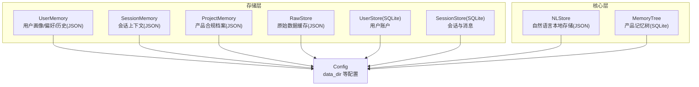
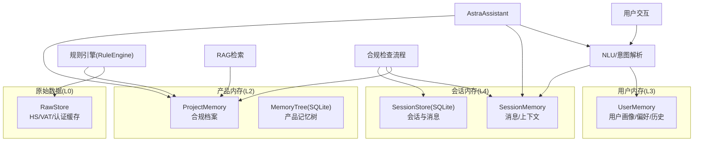
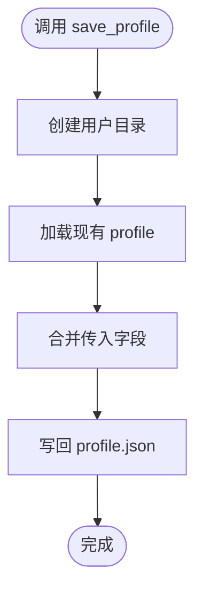
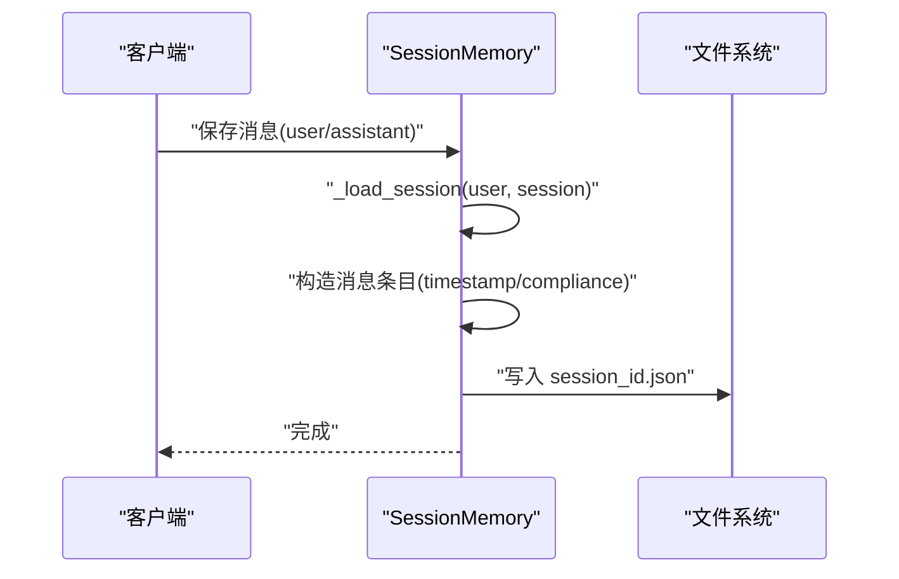
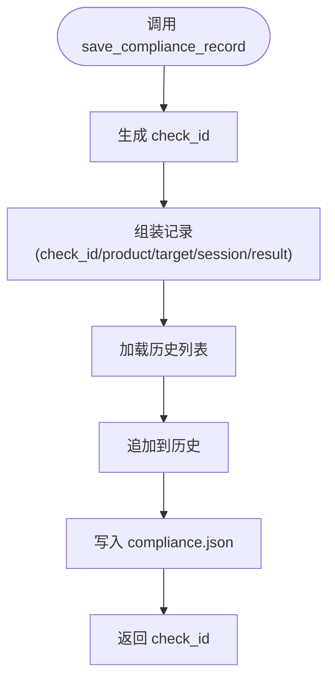
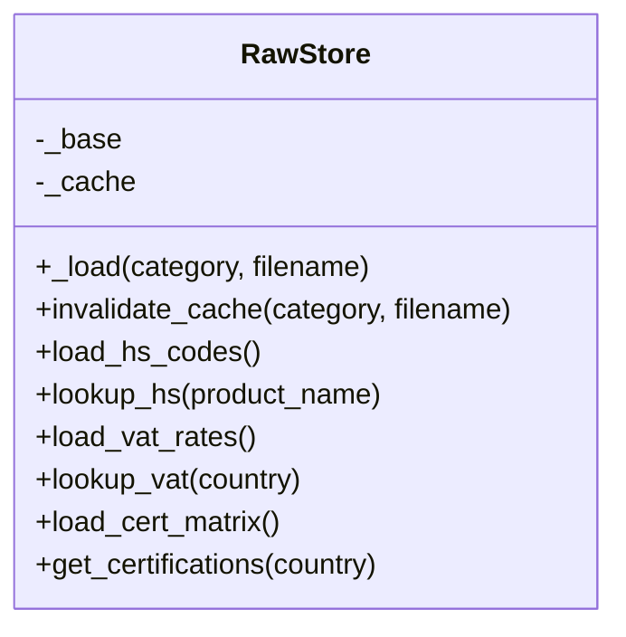
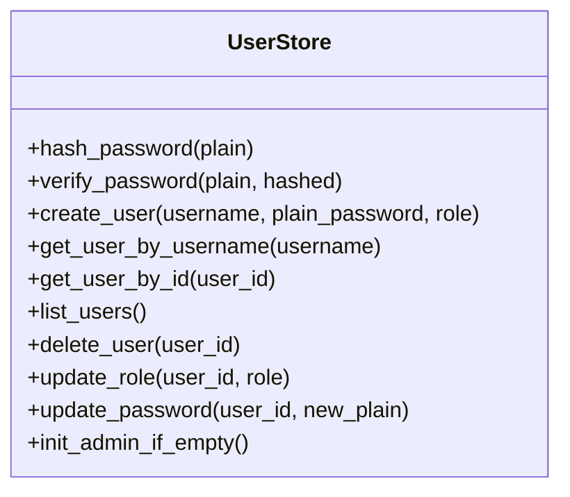
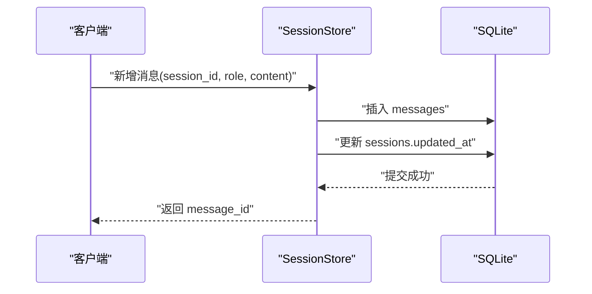
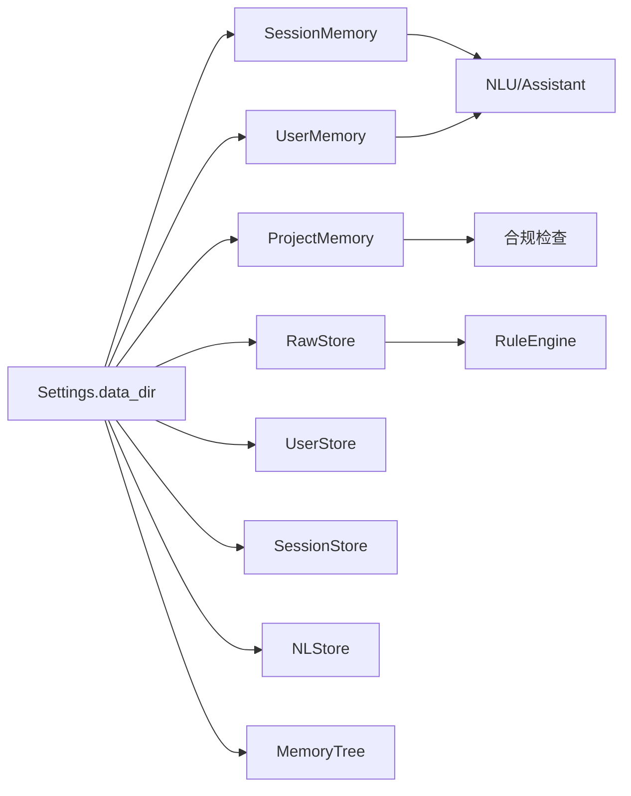

# 用户内存存储

<cite>
**本文引用的文件**   
- [user_memory.py](file://backend/app/storage/user_memory.py)
- [session_memory.py](file://backend/app/storage/session_memory.py)
- [project_memory.py](file://backend/app/storage/project_memory.py)
- [raw_store.py](file://backend/app/storage/raw_store.py)
- [user_store.py](file://backend/app/storage/user_store.py)
- [session_store.py](file://backend/app/storage/session_store.py)
- [config.py](file://backend/app/config.py)
- [local_store.py](file://backend/app/core/local_store.py)
- [memory_tree.py](file://backend/app/core/memory_tree.py)
</cite>

## 目录
1. [简介](#简介)
2. [项目结构](#项目结构)
3. [核心组件](#核心组件)
4. [架构总览](#架构总览)
5. [组件详解](#组件详解)
6. [依赖关系分析](#依赖关系分析)
7. [性能考量](#性能考量)
8. [故障排查指南](#故障排查指南)
9. [结论](#结论)
10. [附录](#附录)

## 简介
本文件面向避风港平台的“用户内存存储”体系，系统化阐述用户级内存的设计理念、数据模型、存储策略与访问模式；对比用户内存与全局内存（L2/L3/L4）的边界与协作机制；覆盖用户偏好设置、会话状态与个性化配置的存储管理；并给出隐私保护、权限控制与安全机制建议，以及清理策略、过期管理与性能优化方案。

## 项目结构
用户内存相关代码主要分布在后端 storage 与 core 两大模块：
- storage：面向用户与会话的轻量级本地存储（JSON 文件）与持久化（SQLite）
- core：面向产品级知识与记忆的本地化自然语言存储与层级记忆树

图表来源
- [user_memory.py:1-84](file://backend/app/storage/user_memory.py#L1-L84)
- [session_memory.py:1-152](file://backend/app/storage/session_memory.py#L1-L152)
- [project_memory.py:1-141](file://backend/app/storage/project_memory.py#L1-L141)
- [raw_store.py:1-134](file://backend/app/storage/raw_store.py#L1-L134)
- [user_store.py:1-133](file://backend/app/storage/user_store.py#L1-L133)
- [session_store.py:1-251](file://backend/app/storage/session_store.py#L1-L251)
- [local_store.py:1-293](file://backend/app/core/local_store.py#L1-L293)
- [memory_tree.py:1-394](file://backend/app/core/memory_tree.py#L1-L394)
- [config.py:134-136](file://backend/app/config.py#L134-L136)

章节来源
- [config.py:134-136](file://backend/app/config.py#L134-L136)
- [user_memory.py:18-84](file://backend/app/storage/user_memory.py#L18-L84)
- [session_memory.py:20-152](file://backend/app/storage/session_memory.py#L20-L152)
- [project_memory.py:20-141](file://backend/app/storage/project_memory.py#L20-L141)
- [raw_store.py:19-134](file://backend/app/storage/raw_store.py#L19-L134)
- [user_store.py:20-133](file://backend/app/storage/user_store.py#L20-L133)
- [session_store.py:25-251](file://backend/app/storage/session_store.py#L25-L251)
- [local_store.py:80-293](file://backend/app/core/local_store.py#L80-L293)
- [memory_tree.py:63-394](file://backend/app/core/memory_tree.py#L63-L394)

## 核心组件
- 用户画像与偏好（UserMemory）
  - 以用户维度隔离，采用 JSON 文件持久化，支持合并写入、去重与最近搜索记录截断
- 会话上下文（SessionMemory）
  - 以用户/会话维度隔离，JSON 文件存储消息与上下文键值，支持最近消息读取与上下文查询
- 产品合规档案（ProjectMemory）
  - 以产品维度隔离，JSON 文件存储合规检查历史，支持历史查询与最新记录查询
- 原始数据缓存（RawStore）
  - 以分类+文件名缓存到内存，提供 HS/VAT/认证矩阵等查询接口
- 用户账户（UserStore）
  - SQLite 表 users，提供用户创建、查询、角色与密码管理
- 会话与消息（SessionStore）
  - SQLite 表 sessions/messages，提供会话生命周期与消息 CRUD
- 自然语言本地存储（NLStore）
  - 以命名空间组织的 JSON 记录，支持全文检索与标签检索
- 产品记忆树（MemoryTree）
  - 产品级 SQLite 记忆树，支持 L0-L3 分层摘要与导出

章节来源
- [user_memory.py:18-84](file://backend/app/storage/user_memory.py#L18-L84)
- [session_memory.py:20-152](file://backend/app/storage/session_memory.py#L20-L152)
- [project_memory.py:20-141](file://backend/app/storage/project_memory.py#L20-L141)
- [raw_store.py:19-134](file://backend/app/storage/raw_store.py#L19-L134)
- [user_store.py:20-133](file://backend/app/storage/user_store.py#L20-L133)
- [session_store.py:25-251](file://backend/app/storage/session_store.py#L25-L251)
- [local_store.py:80-293](file://backend/app/core/local_store.py#L80-L293)
- [memory_tree.py:63-394](file://backend/app/core/memory_tree.py#L63-L394)

## 架构总览
用户内存与全局内存的协作关系如下：
- 用户内存（L3）：用户画像/偏好/历史，服务于个性化与意图消歧
- 会话内存（L4）：多轮对话上下文，服务于实时交互
- 产品内存（L2）：产品合规档案，服务于合规检查与历史追溯
- 原始数据（L0）：规则引擎与合规检查所需的确定性数据，缓存在内存中
- 记忆树（L1/L2/L3）：产品级知识与记忆的层级化摘要，支撑全局索引与领域概览

图表来源
- [user_memory.py:1-84](file://backend/app/storage/user_memory.py#L1-L84)
- [session_memory.py:1-152](file://backend/app/storage/session_memory.py#L1-L152)
- [project_memory.py:1-141](file://backend/app/storage/project_memory.py#L1-L141)
- [raw_store.py:1-134](file://backend/app/storage/raw_store.py#L1-L134)
- [session_store.py:1-251](file://backend/app/storage/session_store.py#L1-L251)
- [memory_tree.py:1-394](file://backend/app/core/memory_tree.py#L1-L394)

## 组件详解

### 用户画像与偏好（UserMemory）
- 设计理念
  - 以用户为隔离单元，持久化用户画像、偏好与行为痕迹（最近搜索）
  - 通过合并写入保证字段增量更新，避免覆盖
- 数据模型
  - profile.json：包含用户偏好字段（如常用目标市场）、最近搜索列表等
- 存储策略
  - 文件系统：按 user_id 维度组织目录，profile.json 为单一文件
  - 写入：合并现有数据后再写回，保证完整性
  - 读取：按需加载，不存在返回空
- 访问模式
  - 保存画像：save_profile
  - 更新偏好市场：update_preferred_markets
  - 记录搜索：record_search（去重并限制长度）
- 与全局内存协作
  - L3 用户内存为 L4 会话上下文与 L1/L2/L3 知识检索提供个性化前置信息

图表来源
- [user_memory.py:31-51](file://backend/app/storage/user_memory.py#L31-L51)

章节来源
- [user_memory.py:18-84](file://backend/app/storage/user_memory.py#L18-L84)

### 会话上下文（SessionMemory）
- 设计理念
  - 以用户/会话为隔离单元，维护多轮对话上下文与消息历史
  - 支持上下文键值（如当前产品/市场）与合规结果附加
- 数据模型
  - 每个会话一个 JSON 文件，包含消息数组与上下文键值
- 存储策略
  - 文件系统：按 user_id/sessions/session_id.json
  - 写入：追加消息并更新时间戳；上下文键值直接写入
  - 读取：按需加载；不存在则初始化基础结构
- 访问模式
  - 保存消息：save_message（含合规结果）
  - 保存上下文：save_context
  - 获取上下文：get_context/get_recent_messages/current_product/market

图表来源
- [session_memory.py:33-68](file://backend/app/storage/session_memory.py#L33-L68)
- [session_memory.py:99-109](file://backend/app/storage/session_memory.py#L99-L109)

章节来源
- [session_memory.py:20-152](file://backend/app/storage/session_memory.py#L20-L152)

### 产品合规档案（ProjectMemory）
- 设计理念
  - 以产品为隔离单元，记录合规检查历史，支持回溯与统计
- 数据模型
  - compliance.json：包含产品标识、名称与检查历史数组
- 存储策略
  - 文件系统：按 product_id 组织目录，compliance.json 为单一文件
  - 写入：追加历史记录并写回
  - 读取：加载历史列表或获取最新记录
- 访问模式
  - 保存合规记录：save_compliance_record（生成唯一 check_id）
  - 查询历史：get_compliance_history
  - 查询最新：get_latest_check
  - 列出产品：list_products

图表来源
- [project_memory.py:36-87](file://backend/app/storage/project_memory.py#L36-L87)

章节来源
- [project_memory.py:20-141](file://backend/app/storage/project_memory.py#L20-L141)

### 原始数据缓存（RawStore）
- 设计理念
  - 将 data/raw 下的静态数据（HS/VAT/认证）按需加载到内存，减少磁盘 IO
- 数据模型
  - 缓存键：category/filename
- 存储策略
  - 内存缓存：首次读取后缓存，支持按需失效
  - 读取：模糊匹配产品到 HS 编码；按国家查询 VAT；按国家查询认证矩阵
- 访问模式
  - 加载缓存：_load(category, filename)
  - 失效缓存：invalidate_cache
  - 查询接口：load_hs_codes/lookup_hs、load_vat_rates/lookup_vat、load_cert_matrix/get_certifications

图表来源
- [raw_store.py:19-134](file://backend/app/storage/raw_store.py#L19-L134)

章节来源
- [raw_store.py:19-134](file://backend/app/storage/raw_store.py#L19-L134)

### 用户账户（UserStore）
- 设计理念
  - 以 SQLite 表 users 存储用户身份与权限，提供密码哈希与角色管理
- 数据模型
  - users(id, username, hashed_pw, role, created_at)
- 访问模式
  - 创建用户：create_user（唯一约束用户名）
  - 查询用户：get_user_by_username/id
  - 列表：list_users
  - 删除：delete_user
  - 角色与密码更新：update_role/update_password
  - 初始化默认管理员：init_admin_if_empty

图表来源
- [user_store.py:20-133](file://backend/app/storage/user_store.py#L20-L133)

章节来源
- [user_store.py:1-133](file://backend/app/storage/user_store.py#L1-L133)

### 会话与消息（SessionStore）
- 设计理念
  - 以 SQLite 表 sessions/messages 存储会话与消息，支持按用户过滤与索引
- 数据模型
  - sessions(id, title, created_at, updated_at, user_id)
  - messages(id, session_id, role, content, compliance_result_json, intent_json, sources_json, created_at)
- 访问模式
  - 创建会话：create_session
  - 列表：list_sessions（支持按 user_id 过滤）
  - 读取：get_session（含消息列表）
  - 最近消息：get_recent_messages
  - 新增消息：add_message（同步更新会话 updated_at）
  - 删除：delete_session
  - 更新标题：update_session_title

图表来源
- [session_store.py:186-217](file://backend/app/storage/session_store.py#L186-L217)
- [session_store.py:134-167](file://backend/app/storage/session_store.py#L134-L167)

章节来源
- [session_store.py:1-251](file://backend/app/storage/session_store.py#L1-L251)

### 自然语言本地存储（NLStore）
- 设计理念
  - 以命名空间组织 JSON 记录，支持自然语言正文与结构化元数据混合存储，提供全文检索
- 数据模型
  - NLRecord：record_id、namespace、key、title、content_nl、metadata、tags、时间戳
  - NLStore：按 namespace 维度缓存与持久化
- 访问模式
  - 写入/更新：put
  - 读取：get
  - 删除：delete
  - 列表：list_namespace
  - 搜索：search（关键词/短语匹配）

章节来源
- [local_store.py:29-293](file://backend/app/core/local_store.py#L29-L293)

### 产品记忆树（MemoryTree）
- 设计理念
  - 产品级 SQLite 记忆树，支持 L0 原始片段与 L1/L2/L3 摘要分层，便于生成全局索引与领域概览
- 数据模型
  - fragments(id, source, content, created_at, metadata, embedding_id, parent_id)
  - summaries(id, level, title, content, parent_id, created_at, updated_at, child_count)
- 访问模式
  - 追加片段：append_fragment
  - 查询片段：get_fragments/count_fragments
  - 创建/更新摘要：upsert_summary
  - 获取摘要：get_summaries/get_summary_by_id
  - 导出：export_to_obsidian
  - 统计：get_stats

章节来源
- [memory_tree.py:63-394](file://backend/app/core/memory_tree.py#L63-L394)

## 依赖关系分析
- 配置驱动
  - 所有存储均通过 settings.data_dir 组织文件路径，确保可配置与可迁移
- 存储耦合
  - UserMemory/SessionMemory/ProjectMemory 均为文件系统存储，耦合度低，便于替换
  - UserStore/SessionStore 依赖 SQLite，提供强一致的用户与会话数据
- 读写路径
  - L0 原始数据通过 RawStore 缓存，降低磁盘 IO
  - L3/L4/L2 读写路径清晰，便于审计与回溯
- 单例与工厂
  - MemoryTree 提供按 product_id 的单例工厂，避免重复打开数据库

图表来源
- [config.py:134-136](file://backend/app/config.py#L134-L136)
- [user_memory.py:21-27](file://backend/app/storage/user_memory.py#L21-L27)
- [session_memory.py:23-29](file://backend/app/storage/session_memory.py#L23-L29)
- [project_memory.py:23-32](file://backend/app/storage/project_memory.py#L23-L32)
- [raw_store.py:22-41](file://backend/app/storage/raw_store.py#L22-L41)
- [session_store.py:21-34](file://backend/app/storage/session_store.py#L21-L34)
- [memory_tree.py:85-92](file://backend/app/core/memory_tree.py#L85-L92)

章节来源
- [config.py:134-136](file://backend/app/config.py#L134-L136)
- [user_memory.py:21-27](file://backend/app/storage/user_memory.py#L21-L27)
- [session_memory.py:23-29](file://backend/app/storage/session_memory.py#L23-L29)
- [project_memory.py:23-32](file://backend/app/storage/project_memory.py#L23-L32)
- [raw_store.py:22-41](file://backend/app/storage/raw_store.py#L22-L41)
- [session_store.py:21-34](file://backend/app/storage/session_store.py#L21-L34)
- [memory_tree.py:85-92](file://backend/app/core/memory_tree.py#L85-L92)

## 性能考量
- 文件系统存储
  - UserMemory/SessionMemory/ProjectMemory 采用 JSON 文件，写入合并与目录层级简单，适合中小规模用户与会话
  - 建议：批量写入时合并字段，避免频繁小写入；定期归档旧会话文件
- 内存缓存
  - RawStore 将原始数据缓存在内存，显著降低磁盘 IO；提供缓存失效接口，支持热加载
  - 建议：根据内存占用监控，合理设置缓存键范围与失效策略
- SQLite 存储
  - UserStore/SessionStore 使用索引与事务，适合高并发读写；注意连接池与线程安全
  - 建议：为高频查询列建立索引；定期 VACUUM/ANALYZE；限制单连接跨线程使用
- 检索与导出
  - NLStore 采用关键词匹配，适合小到中等规模；MemoryTree 导出为 Obsidian Wiki 便于人工审阅
  - 建议：NLStore 后期可引入向量索引；MemoryTree 导出按需触发

[本节为通用性能建议，不直接分析具体文件]

## 故障排查指南
- 用户画像缺失或覆盖
  - 现象：保存后读取不到或字段丢失
  - 排查：确认 save_profile 是否合并写入；检查目录权限与磁盘空间
  - 参考
    - [user_memory.py:31-51](file://backend/app/storage/user_memory.py#L31-L51)
- 会话上下文为空
  - 现象：get_context 返回空结构或消息为空
  - 排查：确认 session_id 是否正确；检查文件是否存在；确认写入是否成功
  - 参考
    - [session_memory.py:99-109](file://backend/app/storage/session_memory.py#L99-L109)
- 合规记录未写入
  - 现象：查询历史为空
  - 排查：确认 save_compliance_record 是否调用；检查 product_id 与目录权限
  - 参考
    - [project_memory.py:36-87](file://backend/app/storage/project_memory.py#L36-L87)
- 原始数据查询异常
  - 现象：lookup_hs/lookup_vat 返回空
  - 排查：确认缓存是否命中；检查 data/raw 文件是否存在；必要时调用 invalidate_cache
  - 参考
    - [raw_store.py:28-41](file://backend/app/storage/raw_store.py#L28-L41)
- 用户账户问题
  - 现象：创建失败或查询不到
  - 排查：检查用户名唯一性；确认表结构初始化；核对密码哈希
  - 参考
    - [user_store.py:48-65](file://backend/app/storage/user_store.py#L48-L65)
- 会话消息未落库
  - 现象：get_session 中无消息
  - 排查：确认 add_message 是否提交；检查外键约束与索引
  - 参考
    - [session_store.py:186-217](file://backend/app/storage/session_store.py#L186-L217)

章节来源
- [user_memory.py:31-51](file://backend/app/storage/user_memory.py#L31-L51)
- [session_memory.py:99-109](file://backend/app/storage/session_memory.py#L99-L109)
- [project_memory.py:36-87](file://backend/app/storage/project_memory.py#L36-L87)
- [raw_store.py:28-41](file://backend/app/storage/raw_store.py#L28-L41)
- [user_store.py:48-65](file://backend/app/storage/user_store.py#L48-L65)
- [session_store.py:186-217](file://backend/app/storage/session_store.py#L186-L217)

## 结论
用户内存存储体系以用户为中心，结合文件系统与 SQLite，实现了用户画像、会话上下文与产品合规档案的清晰分层与协作。配合 L0 原始数据缓存与 L1/L2/L3 知识记忆，形成从确定性规则到个性化上下文再到产品级知识的完整闭环。建议在生产环境中强化权限控制、审计与备份，并根据规模演进引入缓存与索引优化。

[本节为总结性内容，不直接分析具体文件]

## 附录

### 用户内存与全局内存的协作清单
- 用户内存（L3）
  - 用途：个性化上下文、意图消歧
  - 读写：UserMemory
  - 参考
    - [user_memory.py:18-84](file://backend/app/storage/user_memory.py#L18-L84)
- 会话内存（L4）
  - 用途：多轮对话上下文
  - 读写：SessionMemory + SessionStore
  - 参考
    - [session_memory.py:20-152](file://backend/app/storage/session_memory.py#L20-L152)
    - [session_store.py:25-251](file://backend/app/storage/session_store.py#L25-L251)
- 产品内存（L2）
  - 用途：合规档案与历史回溯
  - 读写：ProjectMemory + MemoryTree
  - 参考
    - [project_memory.py:20-141](file://backend/app/storage/project_memory.py#L20-L141)
    - [memory_tree.py:63-394](file://backend/app/core/memory_tree.py#L63-L394)
- 原始数据（L0）
  - 用途：规则引擎与合规检查
  - 读写：RawStore
  - 参考
    - [raw_store.py:19-134](file://backend/app/storage/raw_store.py#L19-L134)

章节来源
- [user_memory.py:18-84](file://backend/app/storage/user_memory.py#L18-L84)
- [session_memory.py:20-152](file://backend/app/storage/session_memory.py#L20-L152)
- [project_memory.py:20-141](file://backend/app/storage/project_memory.py#L20-L141)
- [raw_store.py:19-134](file://backend/app/storage/raw_store.py#L19-L134)
- [session_store.py:25-251](file://backend/app/storage/session_store.py#L25-L251)
- [memory_tree.py:63-394](file://backend/app/core/memory_tree.py#L63-L394)