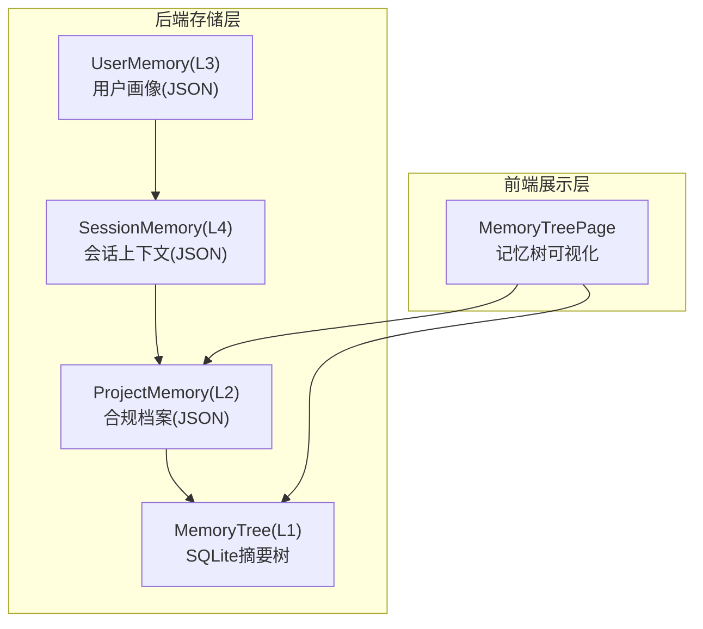
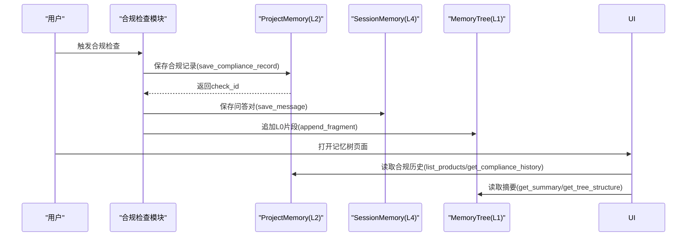
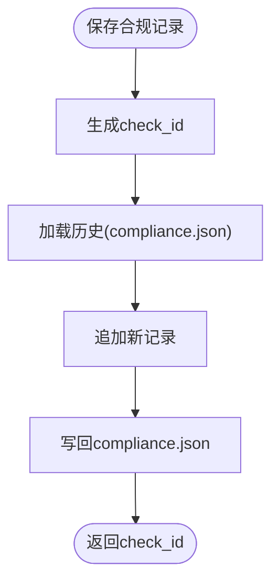
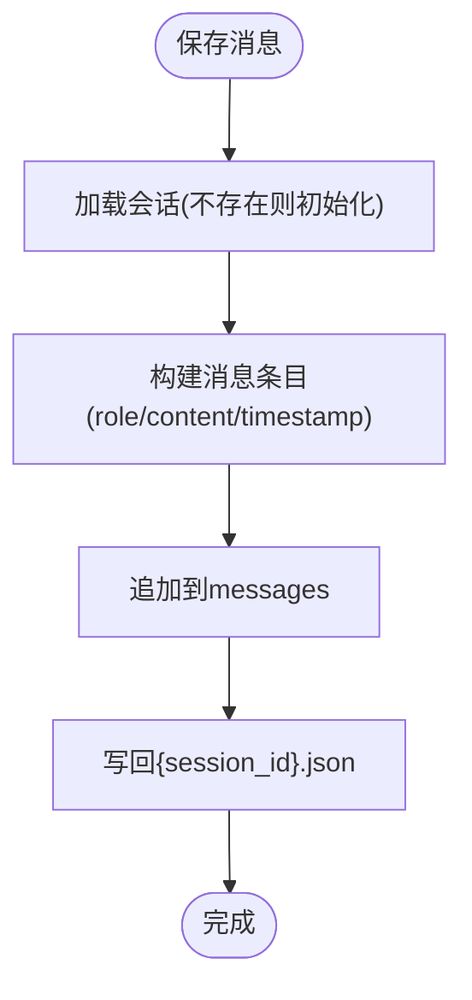
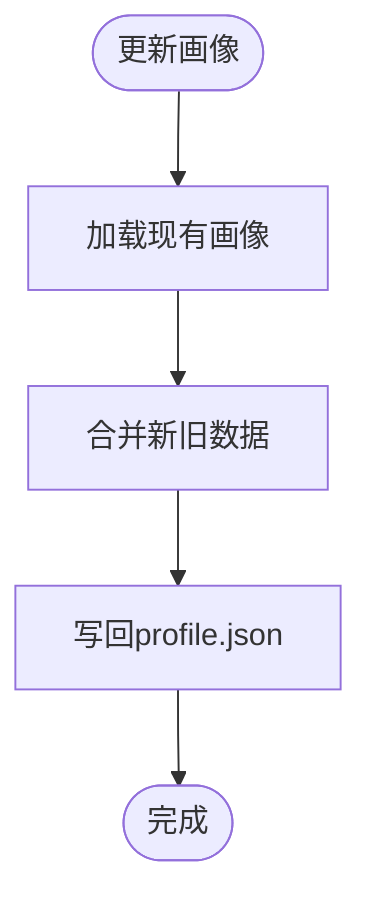
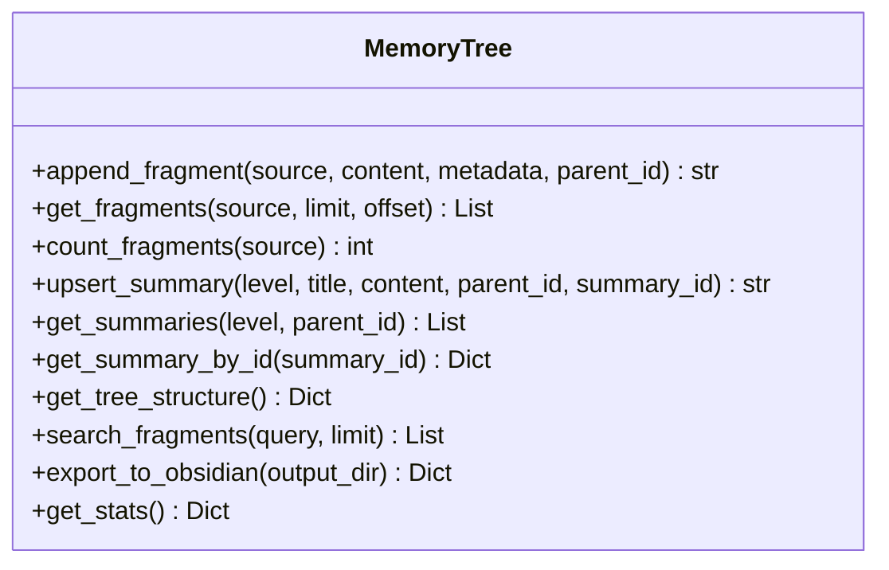
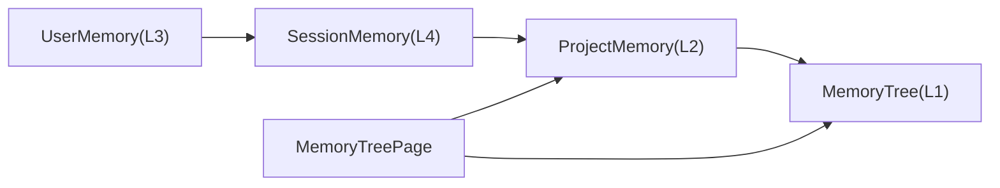

# 项目内存存储

<cite>
**本文引用的文件**
- [project_memory.py](file://backend/app/storage/project_memory.py)
- [session_memory.py](file://backend/app/storage/session_memory.py)
- [user_memory.py](file://backend/app/storage/user_memory.py)
- [memory_tree.py](file://backend/app/core/memory_tree.py)
- [product_storage.py](file://backend/app/core/product_storage.py)
- [MemoryTreePage.tsx](file://frontend/src/pages/MemoryTreePage.tsx)
- [config.ts](file://frontend/src/api/config.ts)
- [后端变更路线图.md](file://后端变更路线图.md)
</cite>

## 目录
1. [简介](#简介)
2. [项目结构](#项目结构)
3. [核心组件](#核心组件)
4. [架构总览](#架构总览)
5. [组件详解](#组件详解)
6. [依赖关系分析](#依赖关系分析)
7. [性能与内存管理](#性能与内存管理)
8. [故障排查指南](#故障排查指南)
9. [结论](#结论)
10. [附录](#附录)

## 简介
本文件面向避风港平台的“项目内存存储”体系，聚焦于产品级合规档案（L2 项目/产品记忆层）、会话上下文（L4 会话记忆层）、用户画像（L3 用户记忆层）以及产品级记忆树（L1 话题摘要/L0 原始片段）的实现原理、数据结构、文件组织与目录层次、读写流程、序列化与持久化机制，并结合产品生命周期状态机讨论其关系与状态管理；同时给出备份恢复、版本控制与冲突解决策略建议，以及性能优化与内存管理的最佳实践。

## 项目结构
项目内存存储采用分层架构：
- L2 项目/产品记忆层：以产品为单位的合规档案，JSON 文件持久化。
- L4 会话记忆层：多轮对话上下文，JSON 文件持久化。
- L3 用户记忆层：用户画像/偏好/历史，JSON 文件持久化。
- L1 产品级记忆树：基于 SQLite 的四层摘要树（L0 原始片段、L1 话题摘要、L2 领域概览、L3 全局索引），支持导出为 Obsidian Wiki。

图表来源
- [project_memory.py:1-141](file://backend/app/storage/project_memory.py#L1-L141)
- [session_memory.py:1-152](file://backend/app/storage/session_memory.py#L1-L152)
- [user_memory.py:1-84](file://backend/app/storage/user_memory.py#L1-L84)
- [memory_tree.py:1-394](file://backend/app/core/memory_tree.py#L1-L394)
- [MemoryTreePage.tsx:1-125](file://frontend/src/pages/MemoryTreePage.tsx#L1-L125)

章节来源
- [project_memory.py:1-141](file://backend/app/storage/project_memory.py#L1-L141)
- [session_memory.py:1-152](file://backend/app/storage/session_memory.py#L1-L152)
- [user_memory.py:1-84](file://backend/app/storage/user_memory.py#L1-L84)
- [memory_tree.py:1-394](file://backend/app/core/memory_tree.py#L1-L394)
- [MemoryTreePage.tsx:1-125](file://frontend/src/pages/MemoryTreePage.tsx#L1-L125)

## 核心组件
- 项目/产品记忆（L2）：以产品维度持久化合规检查历史，支持新增、读取、列出产品摘要。
- 会话记忆（L4）：以用户/会话维度持久化对话消息与上下文，支持消息追加、上下文键值保存、最近消息读取。
- 用户记忆（L3）：以用户维度持久化画像与偏好，支持画像合并更新、常用市场更新、最近搜索记录维护。
- 产品级记忆树（L1）：以产品维度的 SQLite 摘要树，支持 L0 原始片段追加、L1/L2/L3 摘要创建/更新、层级浏览、全文检索、导出为 Obsidian Wiki。

章节来源
- [project_memory.py:20-141](file://backend/app/storage/project_memory.py#L20-L141)
- [session_memory.py:20-152](file://backend/app/storage/session_memory.py#L20-L152)
- [user_memory.py:18-84](file://backend/app/storage/user_memory.py#L18-L84)
- [memory_tree.py:63-394](file://backend/app/core/memory_tree.py#L63-L394)

## 架构总览
项目内存存储围绕“产品”这一核心实体进行数据隔离与流转：
- 写入路径：合规检查完成后，先写入 L2（合规档案），再写入 L4（会话上下文），最后写入 L5（事件链/动作链）。
- 读取路径：前端通过记忆树页面访问 L2/L1 数据，结合 L3/L4 提供个性化与上下文增强。

图表来源
- [project_memory.py:36-87](file://backend/app/storage/project_memory.py#L36-L87)
- [session_memory.py:33-68](file://backend/app/storage/session_memory.py#L33-L68)
- [memory_tree.py:102-132](file://backend/app/core/memory_tree.py#L102-L132)
- [MemoryTreePage.tsx:57-85](file://frontend/src/pages/MemoryTreePage.tsx#L57-L85)

## 组件详解

### 项目/产品记忆（L2）：合规档案
- 存储位置：以产品 ID 为子目录，文件名为 compliance.json。
- 数据结构：包含产品标识、产品名称、合规检查记录数组。
- 主要接口：
  - 保存合规记录：生成唯一 check_id，追加到历史并写回文件。
  - 读取历史：加载并返回历史记录列表。
  - 获取最新检查：返回历史末项。
  - 列出产品摘要：遍历合规目录，读取每个产品的合规文件，汇总基本信息。
- 序列化：使用 JSON，UTF-8 编码，缩进格式化。
- 持久化：文件系统，按产品隔离。

图表来源
- [project_memory.py:36-87](file://backend/app/storage/project_memory.py#L36-L87)

章节来源
- [project_memory.py:20-141](file://backend/app/storage/project_memory.py#L20-L141)

### 会话记忆（L4）：多轮对话上下文
- 存储位置：以用户 ID 为子目录，会话文件位于 sessions 目录，文件名为 {session_id}.json。
- 数据结构：包含会话标识、用户标识、创建时间、更新时间、消息列表、上下文键值。
- 主要接口：
  - 保存消息：追加一条消息，可携带合规结果字段。
  - 保存上下文：保存当前产品、当前市场等键值。
  - 读取上下文：返回完整会话数据。
  - 读取最近消息：返回最近 N 条消息。
  - 读取当前产品/市场：从会话上下文中读取。
- 序列化：JSON，UTF-8 编码。
- 持久化：文件系统，按用户/会话隔离。

图表来源
- [session_memory.py:33-68](file://backend/app/storage/session_memory.py#L33-L68)

章节来源
- [session_memory.py:20-152](file://backend/app/storage/session_memory.py#L20-L152)

### 用户记忆（L3）：用户画像与偏好
- 存储位置：以用户 ID 为子目录，文件名为 profile.json。
- 数据结构：用户画像字典，支持常用市场、最近搜索等字段。
- 主要接口：
  - 保存画像：合并现有数据与新数据，保留完整画像。
  - 更新常用市场：去重并更新常用目标市场列表。
  - 记录最近搜索：去重并限制数量（示例为 10）。
  - 加载画像：读取并返回用户画像。
- 序列化：JSON，UTF-8 编码。
- 持久化：文件系统，按用户隔离。

图表来源
- [user_memory.py:31-51](file://backend/app/storage/user_memory.py#L31-L51)

章节来源
- [user_memory.py:18-84](file://backend/app/storage/user_memory.py#L18-L84)

### 产品级记忆树（L1）：SQLite 四层摘要树
- 存储位置：data/products/{product_id}/memory/memory.db。
- 表结构：
  - fragments：L0 原始片段，含 source、content、metadata、parent_id 等。
  - summaries：L1/L2/L3 摘要，含 level、title、content、parent_id、child_count 等。
- 主要能力：
  - 追加 L0 片段：插入并异步触发 L1 摘要更新。
  - 查询 L0 片段：按来源、分页查询。
  - 创建/更新摘要：Upsert，自动维护父子关系与子节点计数。
  - 层级浏览：获取 L3/L2/L1 摘要列表与层级结构。
  - 搜索：基于 LIKE 的文本检索（未来可替换为向量检索）。
  - 导出：导出为 Obsidian Wiki 结构（L3 全局索引、L2 领域、L1 话题）。
- 性能：建立多索引，支持高效查询与统计。

图表来源
- [memory_tree.py:63-394](file://backend/app/core/memory_tree.py#L63-L394)

章节来源
- [memory_tree.py:1-394](file://backend/app/core/memory_tree.py#L1-L394)

### 产品生命周期与状态管理
- 生命周期阶段枚举与状态机定义见变更路线图文档。
- 产品存储模块负责产品生命周期阶段的更新与业务阶段推断，确保状态转换合法。
- 项目内存（L2）与生命周期的关系体现在合规检查的历史记录中，不同阶段可能触发不同的合规检查与记忆树更新。

章节来源
- [product_storage.py:45-180](file://backend/app/core/product_storage.py#L45-L180)
- [后端变更路线图.md:1746-1786](file://后端变更路线图.md#L1746-L1786)

## 依赖关系分析
- L2（合规档案）依赖 L4（会话上下文）与 L5（事件链）在写入时的协同，但 L2 本身不直接依赖 L5。
- L4（会话上下文）依赖 L3（用户记忆）以提供个性化与上下文增强。
- L1（记忆树）依赖 L0（合规片段）的持续注入，形成 L1/L2/L3 的摘要演进。
- 前端通过记忆树页面访问 L2 与 L1，实现可视化浏览与检索。

图表来源
- [user_memory.py:18-84](file://backend/app/storage/user_memory.py#L18-L84)
- [session_memory.py:20-152](file://backend/app/storage/session_memory.py#L20-L152)
- [project_memory.py:20-141](file://backend/app/storage/project_memory.py#L20-L141)
- [memory_tree.py:63-394](file://backend/app/core/memory_tree.py#L63-L394)
- [MemoryTreePage.tsx:1-125](file://frontend/src/pages/MemoryTreePage.tsx#L1-L125)

章节来源
- [MemoryTreePage.tsx:1-125](file://frontend/src/pages/MemoryTreePage.tsx#L1-L125)
- [config.ts:438-442](file://frontend/src/api/config.ts#L438-L442)

## 性能与内存管理
- 文件系统层（L2/L4/L3）：
  - 使用 UTF-8 JSON 文件，便于跨语言工具读取与审计。
  - 建议对频繁读写的文件进行缓存（如 L2 的产品摘要列表可短期缓存），减少磁盘 IO。
  - 控制单文件大小：合规记录与会话消息建议分片或滚动切分，避免单文件过大。
- SQLite 层（L1）：
  - 已建立必要索引，建议定期分析统计信息，保持查询计划最优。
  - 片段与摘要的 Upsert 操作已使用冲突处理，注意批量写入时的事务封装。
  - 导出为 Wiki 时建议异步执行，避免阻塞主线程。
- 前端层：
  - 记忆树页面按需加载命名空间与记录，避免一次性加载过多数据。
  - 支持搜索过滤，减少渲染压力。

[本节为通用性能建议，无需特定文件引用]

## 故障排查指南
- 文件读写错误
  - 症状：保存失败、读取为空。
  - 排查：确认数据目录存在且具备读写权限；检查 JSON 文件编码与格式；确认目录层级正确。
- 会话缺失
  - 症状：获取最近消息为空。
  - 排查：确认 session_id 是否正确；检查 sessions 目录是否存在；确认文件名格式为 {session_id}.json。
- 记忆树查询慢
  - 症状：层级浏览或搜索响应慢。
  - 排查：确认索引是否存在；检查查询语句与参数；考虑分页与限制返回条数。
- 前端无法显示记忆树
  - 症状：命名空间为空或记录加载失败。
  - 排查：确认 API 路径与返回结构；检查网络请求与错误处理；查看控制台报错。

章节来源
- [project_memory.py:91-98](file://backend/app/storage/project_memory.py#L91-L98)
- [session_memory.py:99-109](file://backend/app/storage/session_memory.py#L99-L109)
- [memory_tree.py:140-153](file://backend/app/core/memory_tree.py#L140-L153)
- [MemoryTreePage.tsx:57-85](file://frontend/src/pages/MemoryTreePage.tsx#L57-L85)

## 结论
项目内存存储通过 L2/L3/L4/L1 分层设计实现了产品级合规档案、用户画像、会话上下文与知识摘要的有序组织与高效检索。配合产品生命周期状态机，能够在不同阶段驱动合规检查与记忆树演进。建议在实际部署中完善备份恢复、版本控制与冲突解决策略，并结合缓存与索引优化提升整体性能与稳定性。

[本节为总结性内容，无需特定文件引用]

## 附录

### 目录与文件命名规范
- L2（合规档案）：data/project_memory/{product_id}/compliance.json
- L4（会话上下文）：data/session_memory/{user_id}/sessions/{session_id}.json
- L3（用户画像）：data/user_memory/{user_id}/profile.json
- L1（记忆树）：data/products/{product_id}/memory/memory.db

章节来源
- [project_memory.py:28-32](file://backend/app/storage/project_memory.py#L28-L32)
- [session_memory.py:28-29](file://backend/app/storage/session_memory.py#L28-L29)
- [user_memory.py:26-27](file://backend/app/storage/user_memory.py#L26-L27)
- [memory_tree.py:85-92](file://backend/app/core/memory_tree.py#L85-L92)

### 读写操作与序列化
- 读取：逐层加载 JSON 或查询 SQLite 表，返回结构化数据。
- 写入：逐层追加或更新，确保原子性与一致性。
- 序列化：统一使用 JSON，UTF-8 编码，缩进格式化以便人工审计。

章节来源
- [project_memory.py:91-109](file://backend/app/storage/project_memory.py#L91-L109)
- [session_memory.py:99-121](file://backend/app/storage/session_memory.py#L99-L121)
- [memory_tree.py:102-132](file://backend/app/core/memory_tree.py#L102-L132)

### 与产品生命周期的关系
- 生命周期状态机定义了合法的状态转换，产品存储模块在更新阶段时进行校验并推断业务阶段。
- 合规检查与记忆树更新应与生命周期阶段联动，确保数据与状态一致。

章节来源
- [product_storage.py:161-180](file://backend/app/core/product_storage.py#L161-L180)
- [后端变更路线图.md:1746-1786](file://后端变更路线图.md#L1746-L1786)

### 备份恢复、版本控制与冲突解决策略
- 备份恢复
  - L2/L3/L4：定期打包 data/project_memory、data/session_memory、data/user_memory。
  - L1：备份 SQLite 文件，必要时导出为 SQL dump。
- 版本控制
  - 将合规档案与会话文件纳入版本控制系统，保留变更历史；对敏感字段进行脱敏。
- 冲突解决
  - L2/L3/L4：采用追加/合并策略，避免覆盖；对并发写入使用文件锁或重试机制。
  - L1：Upsert 已内置冲突处理，建议在高并发场景下使用事务包裹批量操作。

[本节为通用策略建议，无需特定文件引用]