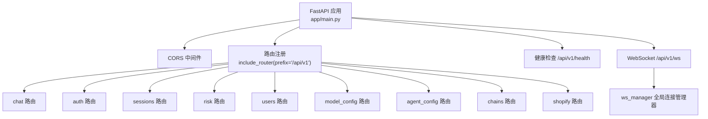
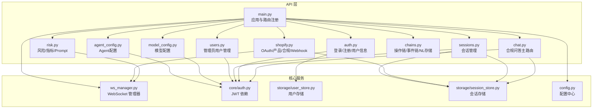
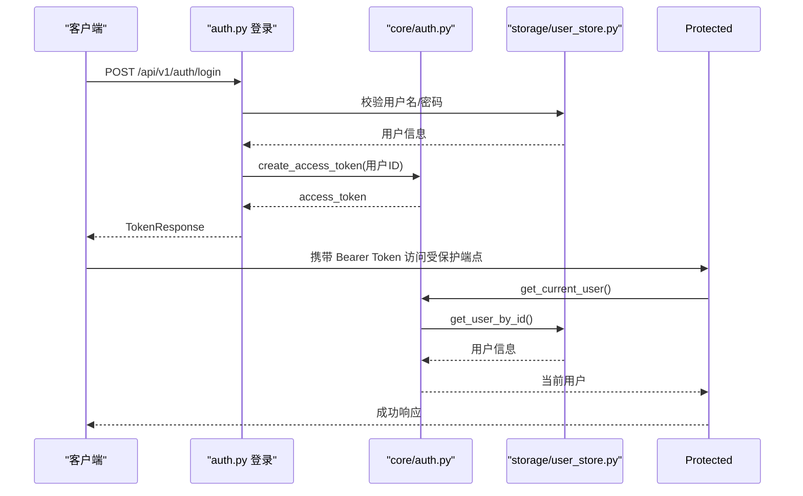
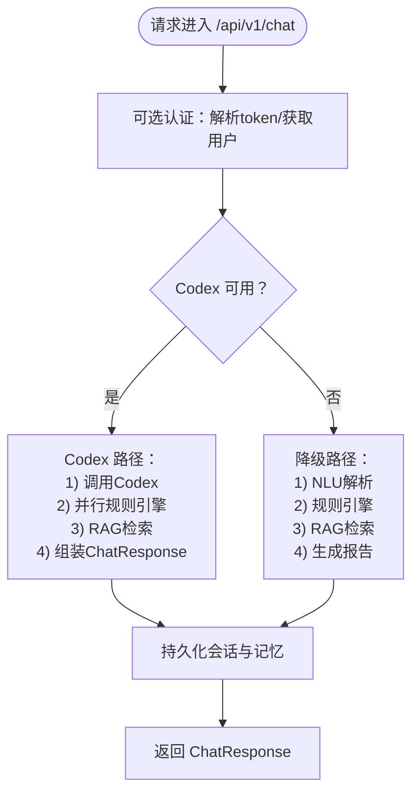
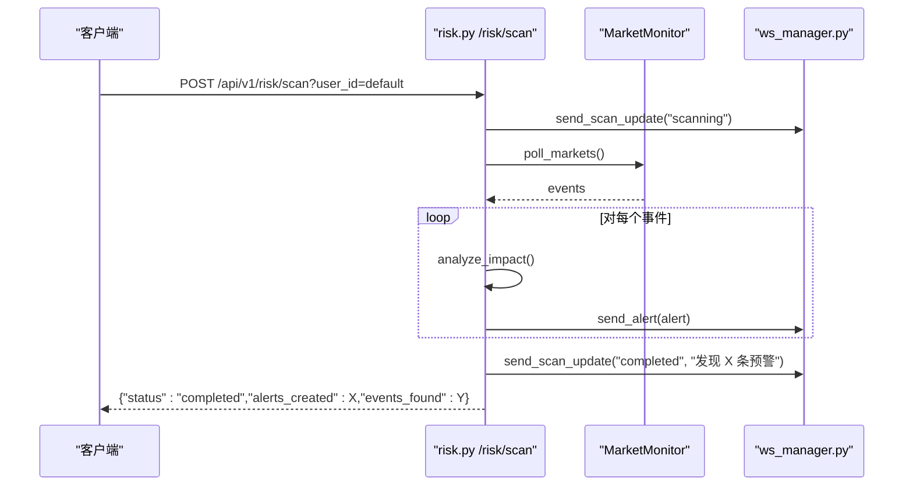
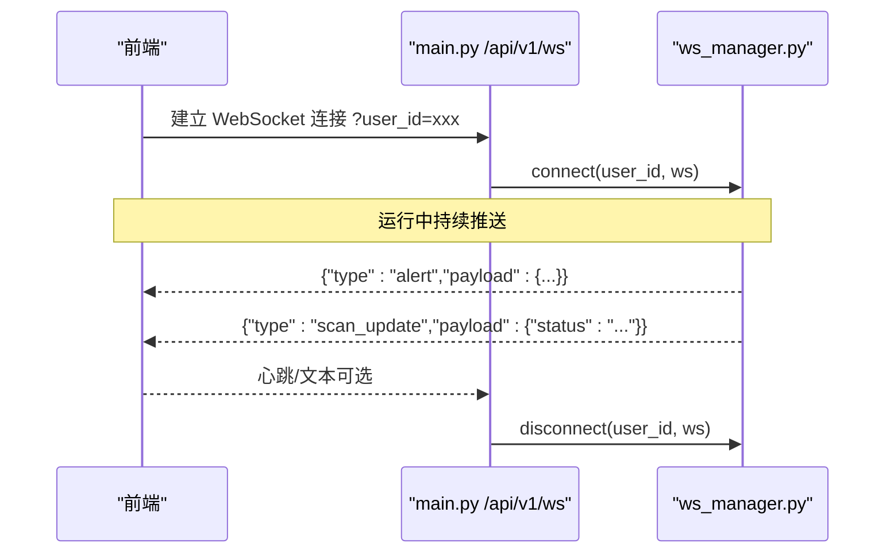
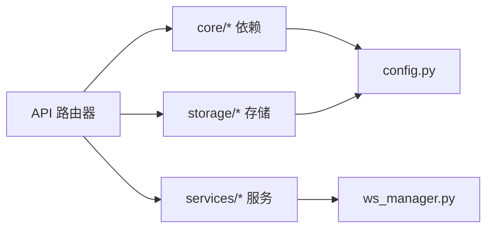

# API层设计

<cite>
**本文档引用的文件**
- [backend/app/main.py](file://backend/app/main.py)
- [backend/app/api/chat.py](file://backend/app/api/chat.py)
- [backend/app/api/auth.py](file://backend/app/api/auth.py)
- [backend/app/api/sessions.py](file://backend/app/api/sessions.py)
- [backend/app/api/risk.py](file://backend/app/api/risk.py)
- [backend/app/api/users.py](file://backend/app/api/users.py)
- [backend/app/api/model_config.py](file://backend/app/api/model_config.py)
- [backend/app/api/agent_config.py](file://backend/app/api/agent_config.py)
- [backend/app/api/chains.py](file://backend/app/api/chains.py)
- [backend/app/api/shopify.py](file://backend/app/api/shopify.py)
- [backend/app/services/ws_manager.py](file://backend/app/services/ws_manager.py)
- [backend/app/core/auth.py](file://backend/app/core/auth.py)
- [backend/app/models/schemas.py](file://backend/app/models/schemas.py)
- [backend/app/storage/user_store.py](file://backend/app/storage/user_store.py)
- [backend/app/storage/session_store.py](file://backend/app/storage/session_store.py)
- [backend/app/config.py](file://backend/app/config.py)
</cite>

## 目录
1. [简介](#简介)
2. [项目结构](#项目结构)
3. [核心组件](#核心组件)
4. [架构总览](#架构总览)
5. [详细组件分析](#详细组件分析)
6. [依赖分析](#依赖分析)
7. [性能考虑](#性能考虑)
8. [故障排查指南](#故障排查指南)
9. [结论](#结论)
10. [附录](#附录)

## 简介
本文件系统性梳理避风港项目的API层设计，重点覆盖：
- FastAPI应用初始化与中间件配置（CORS、认证依赖）
- 路由注册机制与版本前缀策略
- 各API路由器组织结构与职责边界
- WebSocket端点与实时通信机制
- 错误处理、请求验证与响应格式化策略
- 实际路由定义示例与最佳实践

## 项目结构
后端采用“按功能域划分”的API模块组织方式，主入口集中注册所有子路由，并统一挂载CORS与健康检查端点。WebSocket端点独立于REST路由，通过全局连接管理器实现推送。

图表来源
- [backend/app/main.py:1-76](file://backend/app/main.py#L1-L76)

章节来源
- [backend/app/main.py:1-76](file://backend/app/main.py#L1-L76)

## 核心组件
- 应用实例与中间件
  - 应用实例创建：设置标题、描述、版本号
  - CORS中间件：允许本地前端跨域访问
  - 路由注册：统一前缀“/api/v1”
  - 健康检查端点：返回服务状态与版本
  - WebSocket端点：基于用户ID的连接池推送
  - 生命周期钩子：启动/关闭时初始化调度器与默认配置

- 认证与授权
  - JWT依赖注入：OAuth2PasswordBearer绑定登录端点
  - 依赖函数：解析token、获取当前用户、管理员校验
  - 可选认证：聊天接口支持匿名访问（向后兼容）

- 数据模型与验证
  - Pydantic模型：统一请求/响应结构，确保前后端契约一致
  - 会话与合规结果：标准化消息、合规报告、事件链等

章节来源
- [backend/app/main.py:1-76](file://backend/app/main.py#L1-L76)
- [backend/app/core/auth.py:1-60](file://backend/app/core/auth.py#L1-L60)
- [backend/app/models/schemas.py:1-264](file://backend/app/models/schemas.py#L1-L264)

## 架构总览
下图展示API层与核心服务的交互关系，包括认证、会话存储、WebSocket推送与业务链路（Codex/RAG/规则引擎）。

图表来源
- [backend/app/main.py:1-76](file://backend/app/main.py#L1-L76)
- [backend/app/api/chat.py:1-541](file://backend/app/api/chat.py#L1-L541)
- [backend/app/api/auth.py:1-108](file://backend/app/api/auth.py#L1-L108)
- [backend/app/api/sessions.py:1-79](file://backend/app/api/sessions.py#L1-L79)
- [backend/app/api/risk.py:1-154](file://backend/app/api/risk.py#L1-L154)
- [backend/app/api/users.py:1-55](file://backend/app/api/users.py#L1-L55)
- [backend/app/api/model_config.py:1-173](file://backend/app/api/model_config.py#L1-L173)
- [backend/app/api/agent_config.py:1-174](file://backend/app/api/agent_config.py#L1-L174)
- [backend/app/api/chains.py:1-282](file://backend/app/api/chains.py#L1-L282)
- [backend/app/api/shopify.py:1-257](file://backend/app/api/shopify.py#L1-L257)
- [backend/app/services/ws_manager.py:1-95](file://backend/app/services/ws_manager.py#L1-L95)
- [backend/app/core/auth.py:1-60](file://backend/app/core/auth.py#L1-L60)
- [backend/app/storage/user_store.py:1-133](file://backend/app/storage/user_store.py#L1-L133)
- [backend/app/storage/session_store.py:1-251](file://backend/app/storage/session_store.py#L1-L251)
- [backend/app/config.py:1-75](file://backend/app/config.py#L1-L75)

## 详细组件分析

### 应用初始化与中间件配置
- 应用实例创建：设置标题、描述、版本号
- CORS中间件：允许本地前端访问（开发环境）
- 路由注册：include_router统一前缀“/api/v1”
- 健康检查：GET /api/v1/health
- WebSocket端点：/api/v1/ws，基于用户ID连接池推送
- 生命周期：启动时初始化调度器与默认配置；关闭时停止调度器

章节来源
- [backend/app/main.py:1-76](file://backend/app/main.py#L1-L76)

### 路由器组织与版本控制
- 版本控制策略：统一前缀“/api/v1”，便于未来升级至“/api/v2”
- 路由注册顺序：chat、chains、shopify、risk、sessions、auth、users、model_config、agent_config
- 各模块职责：
  - chat：合规问答主入口，支持Codex/RAG/规则引擎降级
  - auth：登录/注册/当前用户/改密
  - sessions：会话列表/详情/删除（鉴权与权限控制）
  - risk：预警管理、市场扫描、仪表盘、Prompt热加载
  - users：管理员用户管理
  - model_config：模型配置增删改查与激活
  - agent_config：Agent配置增删改查与启停
  - chains：操作链/事件链/NL存储
  - shopify：OAuth授权、产品同步、合规检查、Webhook

章节来源
- [backend/app/main.py:21-30](file://backend/app/main.py#L21-L30)
- [backend/app/api/chat.py:205-227](file://backend/app/api/chat.py#L205-L227)
- [backend/app/api/auth.py:54-94](file://backend/app/api/auth.py#L54-L94)
- [backend/app/api/sessions.py:17-78](file://backend/app/api/sessions.py#L17-L78)
- [backend/app/api/risk.py:25-153](file://backend/app/api/risk.py#L25-L153)
- [backend/app/api/users.py:23-54](file://backend/app/api/users.py#L23-L54)
- [backend/app/api/model_config.py:62-151](file://backend/app/api/model_config.py#L62-L151)
- [backend/app/api/agent_config.py:61-157](file://backend/app/api/agent_config.py#L61-L157)
- [backend/app/api/chains.py:31-281](file://backend/app/api/chains.py#L31-L281)
- [backend/app/api/shopify.py:41-256](file://backend/app/api/shopify.py#L41-L256)

### 认证与授权
- 依赖注入：
  - OAuth2PasswordBearer绑定登录端点
  - get_current_user：解析token并返回用户信息
  - require_admin：管理员权限校验
- 可选认证：聊天接口支持匿名访问（携带token则验证）
- 用户存储：SQLite表users，密码哈希使用bcrypt

图表来源
- [backend/app/api/auth.py:54-94](file://backend/app/api/auth.py#L54-L94)
- [backend/app/core/auth.py:19-59](file://backend/app/core/auth.py#L19-L59)
- [backend/app/storage/user_store.py:48-119](file://backend/app/storage/user_store.py#L48-L119)

章节来源
- [backend/app/core/auth.py:1-60](file://backend/app/core/auth.py#L1-L60)
- [backend/app/api/auth.py:1-108](file://backend/app/api/auth.py#L1-L108)
- [backend/app/storage/user_store.py:1-133](file://backend/app/storage/user_store.py#L1-L133)

### 聊天与合规问答（chat）
- 主端点：POST /api/v1/chat
- 处理流程：
  - 可选认证：携带token则解析用户身份
  - Codex驱动：skills + MCP工具 + 联网搜索
  - 降级路径：NLU → 规则引擎 → RAG
  - 会话与记忆：持久化消息与合规结果
- 响应模型：ChatResponse，包含合规结果、来源、会话ID与动作链ID

图表来源
- [backend/app/api/chat.py:228-264](file://backend/app/api/chat.py#L228-L264)
- [backend/app/api/chat.py:269-376](file://backend/app/api/chat.py#L269-L376)
- [backend/app/api/chat.py:415-540](file://backend/app/api/chat.py#L415-L540)

章节来源
- [backend/app/api/chat.py:1-541](file://backend/app/api/chat.py#L1-L541)
- [backend/app/models/schemas.py:73-104](file://backend/app/models/schemas.py#L73-L104)

### 会话管理（sessions）
- 端点：
  - GET /api/v1/sessions：列表（admin可见全部，普通用户仅限自身）
  - GET /api/v1/sessions/{id}：详情（含消息与合规结果）
  - DELETE /api/v1/sessions/{id}：删除
- 权限控制：非admin仅能查看/删除自己的会话
- 存储：SQLite，支持最近消息检索与全文上下文

章节来源
- [backend/app/api/sessions.py:1-79](file://backend/app/api/sessions.py#L1-L79)
- [backend/app/storage/session_store.py:1-251](file://backend/app/storage/session_store.py#L1-L251)

### 风险/指标/预警（risk）
- 预警：
  - GET /api/v1/risk/alerts：分页与筛选
  - GET /api/v1/risk/alerts/unread-count：未读数
  - POST /api/v1/risk/alerts/{alert_id}/dismiss：忽略
- 市场扫描：
  - POST /api/v1/risk/scan：触发Codex联网搜索→影响分析→生成预警→WebSocket推送
  - GET /api/v1/risk/market-status：聚合市场预警数与扫描状态
- 指标仪表盘：GET /api/v1/metrics/dashboard
- Prompt热加载：POST /api/v1/prompts/reload

图表来源
- [backend/app/api/risk.py:63-107](file://backend/app/api/risk.py#L63-L107)
- [backend/app/services/ws_manager.py:46-82](file://backend/app/services/ws_manager.py#L46-L82)

章节来源
- [backend/app/api/risk.py:1-154](file://backend/app/api/risk.py#L1-L154)
- [backend/app/services/ws_manager.py:1-95](file://backend/app/services/ws_manager.py#L1-L95)

### 用户管理（users）
- 端点：
  - GET /api/v1/users：管理员可见全部用户
  - DELETE /api/v1/users/{user_id}：删除用户（不可删除自己）
  - PUT /api/v1/users/{user_id}/role：修改角色（不可修改自己）
- 权限：require_admin

章节来源
- [backend/app/api/users.py:1-55](file://backend/app/api/users.py#L1-L55)

### 模型配置（model_config）
- 端点：
  - GET /api/v1/model-configs：获取所有预设（不含敏感Key）
  - GET /api/v1/model-configs/active：获取当前激活配置（含敏感Key）
  - POST /api/v1/model-configs：新建（admin）
  - PUT /api/v1/model-configs/{config_id}：更新（admin）
  - DELETE /api/v1/model-configs/{config_id}：删除（admin）
  - POST /api/v1/model-configs/{config_id}/activate：激活（admin）
- 权限：非激活读取require_user，写操作require_admin

章节来源
- [backend/app/api/model_config.py:1-173](file://backend/app/api/model_config.py#L1-L173)

### Agent配置（agent_config）
- 端点：
  - GET /api/v1/agents：列表（含预览）
  - GET /api/v1/agents/{agent_id}：详情（含完整system_prompt）
  - POST /api/v1/agents：新建（admin）
  - PUT /api/v1/agents/{agent_id}：更新（admin）
  - DELETE /api/v1/agents/{agent_id}：删除（admin）
  - PUT /api/v1/agents/{agent_id}/toggle：启用/禁用（admin）
- 权限：require_admin

章节来源
- [backend/app/api/agent_config.py:1-174](file://backend/app/api/agent_config.py#L1-L174)

### 操作链/事件链/NL存储（chains）
- 操作链：
  - GET /api/v1/chains/actions：列表
  - GET /api/v1/chains/actions/{chain_id}：详情
  - GET /api/v1/chains/actions/{chain_id}/trail：自然语言链路
- 事件链：
  - GET /api/v1/chains/events：列表
  - GET /api/v1/chains/events/{chain_id}：详情
  - GET /api/v1/chains/events/{chain_id}/timeline：时间线
  - GET /api/v1/chains/events/{chain_id}/filter：筛选
  - POST /api/v1/chains/events：创建事件
- NL存储：
  - GET /api/v1/nl-store/search：全文搜索
  - GET /api/v1/nl-store/{namespace}：列出命名空间
  - GET /api/v1/nl-store/{namespace}/{key}：获取记录
  - POST /api/v1/nl-store/{namespace}：创建/更新
  - PUT /api/v1/nl-store/{namespace}/{key}：部分更新
  - DELETE /api/v1/nl-store/{namespace}/{key}：删除

章节来源
- [backend/app/api/chains.py:1-282](file://backend/app/api/chains.py#L1-L282)

### Shopify集成（shopify）
- OAuth授权：
  - GET /api/v1/shopify/auth：发起授权，返回授权URL与state
  - GET /api/v1/shopify/callback：回调交换token
- 店铺与产品：
  - GET /api/v1/shopify/shops：已连接店铺列表
  - GET /api/v1/shopify/{shop}/products：产品列表
  - POST /api/v1/shopify/{shop}/check/{product_id}：产品合规检查
- Webhook：
  - POST /api/v1/shopify/webhook：接收Shopify事件，HMAC校验并落盘

章节来源
- [backend/app/api/shopify.py:1-257](file://backend/app/api/shopify.py#L1-L257)

### WebSocket端点与实时通信
- 端点：/api/v1/ws
- 连接管理：ws_manager维护user_id→WebSocket集合，支持推送与广播
- 消息协议：JSON对象，type为"alert"或"scan_update"，payload为对应数据
- 使用场景：风险预警推送、扫描状态更新

图表来源
- [backend/app/main.py:40-55](file://backend/app/main.py#L40-L55)
- [backend/app/services/ws_manager.py:30-82](file://backend/app/services/ws_manager.py#L30-L82)

章节来源
- [backend/app/main.py:38-56](file://backend/app/main.py#L38-L56)
- [backend/app/services/ws_manager.py:1-95](file://backend/app/services/ws_manager.py#L1-L95)

## 依赖分析
- 组件耦合
  - API层高度内聚于各自领域，跨模块调用通过依赖注入与服务层解耦
  - 认证依赖贯穿多个模块，形成统一的安全边界
  - WebSocket管理器作为全局单例，避免重复连接与广播开销
- 外部依赖
  - 数据库：SQLite（会话与用户）
  - 配置：pydantic-settings加载.env
  - 加密：passlib bcrypt
  - JWT：jose

图表来源
- [backend/app/api/chat.py:14-25](file://backend/app/api/chat.py#L14-L25)
- [backend/app/api/auth.py:3-14](file://backend/app/api/auth.py#L3-L14)
- [backend/app/storage/session_store.py:19-21](file://backend/app/storage/session_store.py#L19-L21)
- [backend/app/config.py:1-75](file://backend/app/config.py#L1-L75)
- [backend/app/services/ws_manager.py:12-15](file://backend/app/services/ws_manager.py#L12-L15)

章节来源
- [backend/app/api/chat.py:1-541](file://backend/app/api/chat.py#L1-L541)
- [backend/app/api/auth.py:1-108](file://backend/app/api/auth.py#L1-L108)
- [backend/app/storage/session_store.py:1-251](file://backend/app/storage/session_store.py#L1-L251)
- [backend/app/config.py:1-75](file://backend/app/config.py#L1-L75)
- [backend/app/services/ws_manager.py:1-95](file://backend/app/services/ws_manager.py#L1-L95)

## 性能考虑
- 路由前缀与模块化：统一前缀便于缓存与反向代理，模块化减少单文件复杂度
- 异步与并发：WebSocket连接池与事件链并行处理（如规则引擎与RAG检索）
- 数据库索引：会话与消息表建立必要索引，降低查询成本
- 缓存与降级：Codex不可用时自动降级至NLU+规则引擎+RAG，保障可用性
- 响应体积：NL存储与搜索返回摘要，避免传输冗余内容

## 故障排查指南
- 认证失败
  - 现象：401未授权
  - 排查：确认token格式、签名、过期时间；核对用户是否存在
- 权限不足
  - 现象：403禁止访问
  - 排查：确认用户角色为admin；避免自我修改/删除
- 会话不存在
  - 现象：404未找到
  - 排查：确认session_id有效；检查用户权限
- WebSocket推送失败
  - 现象：前端未收到消息
  - 排查：检查ws_manager连接池、异常断连清理、消息格式一致性
- 健康检查
  - 现象：/api/v1/health返回异常
  - 排查：确认应用启动完成、调度器初始化成功

章节来源
- [backend/app/core/auth.py:28-59](file://backend/app/core/auth.py#L28-L59)
- [backend/app/api/sessions.py:35-42](file://backend/app/api/sessions.py#L35-L42)
- [backend/app/api/users.py:29-37](file://backend/app/api/users.py#L29-L37)
- [backend/app/services/ws_manager.py:46-82](file://backend/app/services/ws_manager.py#L46-L82)
- [backend/app/main.py:33-35](file://backend/app/main.py#L33-L35)

## 结论
避风港项目的API层采用清晰的模块化设计与统一的版本前缀策略，结合JWT认证、会话存储与WebSocket实时推送，形成了稳定、可扩展且易于演进的后端架构。建议在生产环境中进一步完善：
- 增强CORS白名单与HTTPS部署
- 引入统一的异常处理器与OpenAPI契约校验
- 对热点端点增加速率限制与缓存策略
- 完善日志与可观测性（追踪ID、指标采集）

## 附录
- 最佳实践
  - 使用Pydantic模型严格约束请求/响应
  - 将认证依赖下沉至core模块，统一管理
  - 会话与合规结果持久化，提升用户体验
  - WebSocket消息协议标准化，便于前端消费
  - 路由前缀统一，便于未来版本迁移