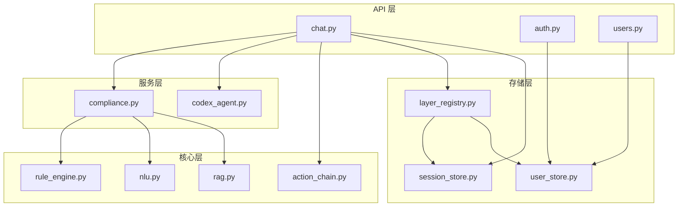
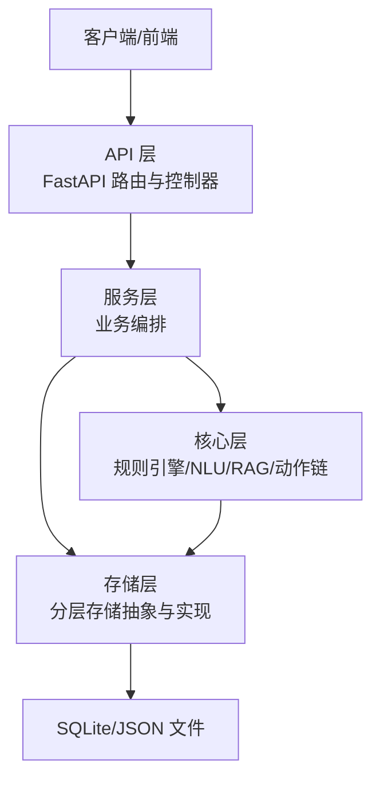
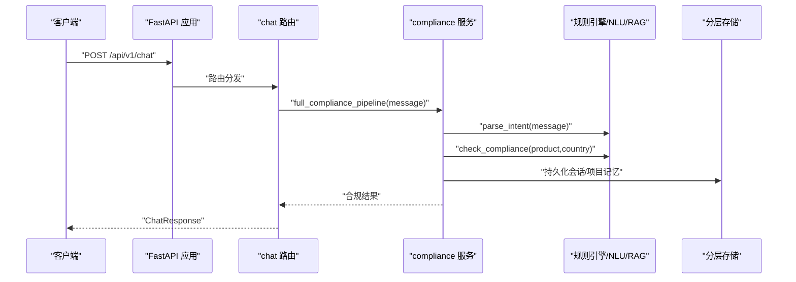
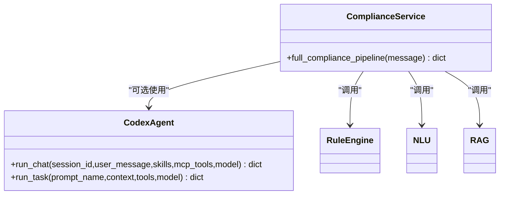
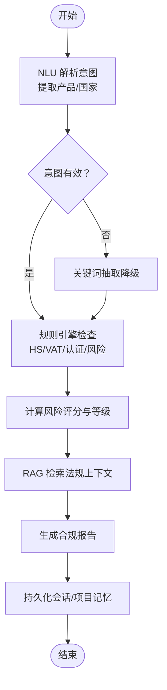
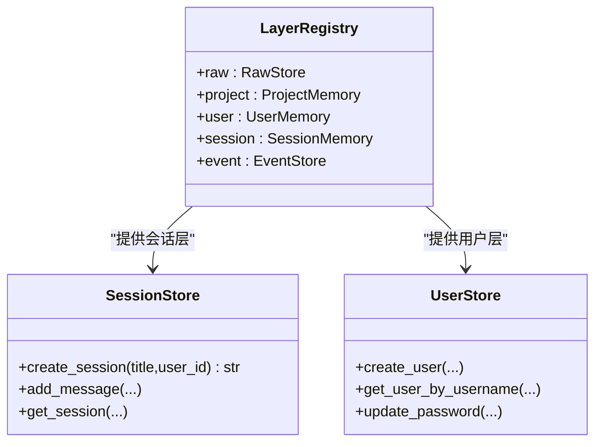
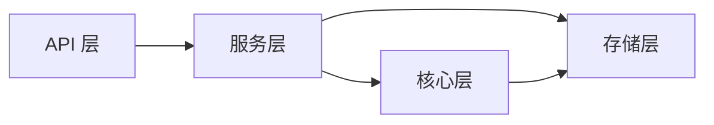

# 分层架构设计

<cite>
**本文档引用的文件**
- [backend/app/main.py](file://backend/app/main.py)
- [backend/app/config.py](file://backend/app/config.py)
- [backend/app/api/chat.py](file://backend/app/api/chat.py)
- [backend/app/api/auth.py](file://backend/app/api/auth.py)
- [backend/app/api/users.py](file://backend/app/api/users.py)
- [backend/app/services/compliance.py](file://backend/app/services/compliance.py)
- [backend/app/services/codex_agent.py](file://backend/app/services/codex_agent.py)
- [backend/app/core/rule_engine.py](file://backend/app/core/rule_engine.py)
- [backend/app/core/nlu.py](file://backend/app/core/nlu.py)
- [backend/app/core/rag.py](file://backend/app/core/rag.py)
- [backend/app/core/action_chain.py](file://backend/app/core/action_chain.py)
- [backend/app/storage/layer_registry.py](file://backend/app/storage/layer_registry.py)
- [backend/app/storage/session_store.py](file://backend/app/storage/session_store.py)
- [backend/app/storage/user_store.py](file://backend/app/storage/user_store.py)
- [backend/app/models/schemas.py](file://backend/app/models/schemas.py)
</cite>

## 目录
1. [引言](#引言)
2. [项目结构](#项目结构)
3. [核心组件](#核心组件)
4. [架构总览](#架构总览)
5. [详细组件分析](#详细组件分析)
6. [依赖分析](#依赖分析)
7. [性能考虑](#性能考虑)
8. [故障排查指南](#故障排查指南)
9. [结论](#结论)
10. [附录](#附录)

## 引言
本项目采用四层架构设计：API 层（FastAPI 路由与控制器）、服务层（业务逻辑封装）、核心层（核心算法与规则引擎）、存储层（数据持久化）。该设计将“接口”“业务编排”“规则与算法”“数据访问”清晰分离，使系统具备高内聚、低耦合、可扩展、易维护与可观测性的特点。本文档系统阐述每层的设计原则、职责边界、依赖关系、层间通信机制与数据传递方式，并给出中间件与拦截器（如 CORS、认证）的使用说明、调用示例与最佳实践，解释为何采用该分层设计及其带来的收益。

## 项目结构
后端采用“按层次+按功能”的混合组织方式：
- API 层：位于 app/api，负责对外 HTTP/WebSocket 接口、请求/响应模型与权限控制
- 服务层：位于 app/services，负责业务编排与跨组件协调
- 核心层：位于 app/core，包含规则引擎、NLU、RAG、动作链追踪等核心算法
- 存储层：位于 app/storage，提供分层存储抽象与具体实现（SQLite、JSON 文件）

图表来源
- [backend/app/api/chat.py:1-541](file://backend/app/api/chat.py#L1-L541)
- [backend/app/api/auth.py:1-108](file://backend/app/api/auth.py#L1-L108)
- [backend/app/api/users.py:1-55](file://backend/app/api/users.py#L1-L55)
- [backend/app/services/compliance.py:1-35](file://backend/app/services/compliance.py#L1-L35)
- [backend/app/services/codex_agent.py:1-370](file://backend/app/services/codex_agent.py#L1-L370)
- [backend/app/core/rule_engine.py:1-247](file://backend/app/core/rule_engine.py#L1-L247)
- [backend/app/core/nlu.py:1-99](file://backend/app/core/nlu.py#L1-L99)
- [backend/app/core/rag.py:1-59](file://backend/app/core/rag.py#L1-L59)
- [backend/app/core/action_chain.py:1-236](file://backend/app/core/action_chain.py#L1-L236)
- [backend/app/storage/layer_registry.py:1-45](file://backend/app/storage/layer_registry.py#L1-L45)
- [backend/app/storage/session_store.py:1-251](file://backend/app/storage/session_store.py#L1-L251)
- [backend/app/storage/user_store.py:1-133](file://backend/app/storage/user_store.py#L1-L133)

章节来源
- [backend/app/main.py:1-76](file://backend/app/main.py#L1-L76)
- [backend/app/config.py:1-75](file://backend/app/config.py#L1-L75)

## 核心组件
- API 层（FastAPI 路由与控制器）
  - 负责对外接口、中间件、权限校验与请求/响应模型
  - 示例：健康检查、WebSocket、认证、用户管理、聊天对话
- 服务层（业务逻辑封装）
  - 负责编排核心层与存储层，提供端到端业务流程
  - 示例：合规全链路编排、Codex Agent 封装
- 核心层（核心算法与规则引擎）
  - 负责确定性规则、意图解析、RAG 检索与动作链追踪
  - 示例：规则引擎、NLU、RAG、动作链
- 存储层（数据持久化）
  - 提供分层存储抽象与具体实现（SQLite、JSON 文件）
  - 示例：会话存储、用户存储、分层注册表

章节来源
- [backend/app/api/chat.py:1-541](file://backend/app/api/chat.py#L1-L541)
- [backend/app/api/auth.py:1-108](file://backend/app/api/auth.py#L1-L108)
- [backend/app/api/users.py:1-55](file://backend/app/api/users.py#L1-L55)
- [backend/app/services/compliance.py:1-35](file://backend/app/services/compliance.py#L1-L35)
- [backend/app/services/codex_agent.py:1-370](file://backend/app/services/codex_agent.py#L1-L370)
- [backend/app/core/rule_engine.py:1-247](file://backend/app/core/rule_engine.py#L1-L247)
- [backend/app/core/nlu.py:1-99](file://backend/app/core/nlu.py#L1-L99)
- [backend/app/core/rag.py:1-59](file://backend/app/core/rag.py#L1-L59)
- [backend/app/core/action_chain.py:1-236](file://backend/app/core/action_chain.py#L1-L236)
- [backend/app/storage/layer_registry.py:1-45](file://backend/app/storage/layer_registry.py#L1-L45)
- [backend/app/storage/session_store.py:1-251](file://backend/app/storage/session_store.py#L1-L251)
- [backend/app/storage/user_store.py:1-133](file://backend/app/storage/user_store.py#L1-L133)
- [backend/app/models/schemas.py:1-264](file://backend/app/models/schemas.py#L1-L264)

## 架构总览
四层架构遵循“高层只依赖低层”的依赖倒置原则，API 层仅依赖服务层；服务层依赖核心层与存储层；核心层与存储层彼此解耦，通过统一的注册表与模型进行协作。

图表来源
- [backend/app/main.py:1-76](file://backend/app/main.py#L1-L76)
- [backend/app/api/chat.py:1-541](file://backend/app/api/chat.py#L1-L541)
- [backend/app/services/compliance.py:1-35](file://backend/app/services/compliance.py#L1-L35)
- [backend/app/core/rule_engine.py:1-247](file://backend/app/core/rule_engine.py#L1-L247)
- [backend/app/core/nlu.py:1-99](file://backend/app/core/nlu.py#L1-L99)
- [backend/app/core/rag.py:1-59](file://backend/app/core/rag.py#L1-L59)
- [backend/app/core/action_chain.py:1-236](file://backend/app/core/action_chain.py#L1-L236)
- [backend/app/storage/layer_registry.py:1-45](file://backend/app/storage/layer_registry.py#L1-L45)
- [backend/app/storage/session_store.py:1-251](file://backend/app/storage/session_store.py#L1-L251)
- [backend/app/storage/user_store.py:1-133](file://backend/app/storage/user_store.py#L1-L133)

## 详细组件分析

### API 层（FastAPI 路由与控制器）
- 设计原则
  - 单一职责：每个路由模块聚焦一类资源或功能
  - 明确边界：请求/响应模型与权限装饰器分离
  - 可观测性：统一中间件与健康检查端点
- 职责边界
  - 路由注册与前缀管理
  - CORS 中间件配置
  - 认证中间件与权限装饰器
  - WebSocket 实时推送
  - 生命周期钩子（启动/停止）
- 关键实现要点
  - 中间件：CORS 允许特定前端源
  - 路由：include_router 注册多个模块
  - WebSocket：基于 ws_manager 管理连接
  - 启停：调度器与默认配置初始化/关闭

图表来源
- [backend/app/main.py:1-76](file://backend/app/main.py#L1-L76)
- [backend/app/api/chat.py:1-541](file://backend/app/api/chat.py#L1-L541)
- [backend/app/services/compliance.py:1-35](file://backend/app/services/compliance.py#L1-L35)
- [backend/app/core/rule_engine.py:1-247](file://backend/app/core/rule_engine.py#L1-L247)
- [backend/app/core/nlu.py:1-99](file://backend/app/core/nlu.py#L1-L99)
- [backend/app/core/rag.py:1-59](file://backend/app/core/rag.py#L1-L59)
- [backend/app/storage/layer_registry.py:1-45](file://backend/app/storage/layer_registry.py#L1-L45)

章节来源
- [backend/app/main.py:1-76](file://backend/app/main.py#L1-L76)
- [backend/app/api/chat.py:1-541](file://backend/app/api/chat.py#L1-L541)
- [backend/app/api/auth.py:1-108](file://backend/app/api/auth.py#L1-L108)
- [backend/app/api/users.py:1-55](file://backend/app/api/users.py#L1-L55)

### 服务层（业务逻辑封装）
- 设计原则
  - 业务编排：组合核心层与存储层，形成端到端流程
  - 容错降级：在关键能力不可用时提供降级路径
  - 可扩展：通过统一接口接入新工具与能力
- 职责边界
  - 合规全链路编排：NLU → 规则引擎 → RAG
  - Codex Agent 封装：多轮会话、工具调用、流式事件
- 关键实现要点
  - 全链路 pipeline：意图解析、规则检查、上下文检索、报告生成
  - 降级策略：无 LLM 时的关键词抽取与通用回复
  - 会话与记忆：持久化消息、项目合规记录、上下文缓存

图表来源
- [backend/app/services/compliance.py:1-35](file://backend/app/services/compliance.py#L1-L35)
- [backend/app/services/codex_agent.py:1-370](file://backend/app/services/codex_agent.py#L1-L370)
- [backend/app/core/rule_engine.py:1-247](file://backend/app/core/rule_engine.py#L1-L247)
- [backend/app/core/nlu.py:1-99](file://backend/app/core/nlu.py#L1-L99)
- [backend/app/core/rag.py:1-59](file://backend/app/core/rag.py#L1-L59)

章节来源
- [backend/app/services/compliance.py:1-35](file://backend/app/services/compliance.py#L1-L35)
- [backend/app/services/codex_agent.py:1-370](file://backend/app/services/codex_agent.py#L1-L370)

### 核心层（核心算法与规则引擎）
- 设计原则
  - 确定性优先：高频、可预测的合规检查走规则引擎
  - 低延迟：NLU/RAG 与规则引擎并行，减少端到端等待
  - 可回溯：动作链记录每一步操作，便于审计与调试
- 职责边界
  - 规则引擎：HS 编码、VAT、认证、风险与物流提示、评分与整改建议
  - NLU：意图解析，提取产品与目标市场
  - RAG：检索法规知识库，格式化引用
  - 动作链：记录与回溯操作链路
- 关键实现要点
  - 规则引擎：基于 L0 原始数据的确定性检查，写入 L5 事件链
  - NLU：系统提示可从 Agent 配置或 YAML 热加载
  - RAG：检索与引用格式化，支持空结果优雅降级
  - 动作链：JSON 文件持久化，支持状态计算与可视化

图表来源
- [backend/app/core/rule_engine.py:1-247](file://backend/app/core/rule_engine.py#L1-L247)
- [backend/app/core/nlu.py:1-99](file://backend/app/core/nlu.py#L1-L99)
- [backend/app/core/rag.py:1-59](file://backend/app/core/rag.py#L1-L59)
- [backend/app/core/action_chain.py:1-236](file://backend/app/core/action_chain.py#L1-L236)

章节来源
- [backend/app/core/rule_engine.py:1-247](file://backend/app/core/rule_engine.py#L1-L247)
- [backend/app/core/nlu.py:1-99](file://backend/app/core/nlu.py#L1-L99)
- [backend/app/core/rag.py:1-59](file://backend/app/core/rag.py#L1-L59)
- [backend/app/core/action_chain.py:1-236](file://backend/app/core/action_chain.py#L1-L236)

### 存储层（数据持久化）
- 设计原则
  - 分层抽象：通过注册表统一访问 L0-L5 各层
  - 低耦合：核心层与存储层通过接口解耦
  - 可迁移：SQLite 与 JSON 文件便于开发与部署
- 职责边界
  - 分层注册表：统一暴露 L0/L2/L3/L4/L5 存储
  - 会话存储：会话与消息持久化，支持多轮上下文
  - 用户存储：用户 CRUD、密码哈希与默认管理员初始化
- 关键实现要点
  - 注册表：集中管理各层存储实例
  - 会话存储：SQLite 表结构、索引与迁移
  - 用户存储：bcrypt 密码哈希、冲突处理与默认初始化

图表来源
- [backend/app/storage/layer_registry.py:1-45](file://backend/app/storage/layer_registry.py#L1-L45)
- [backend/app/storage/session_store.py:1-251](file://backend/app/storage/session_store.py#L1-L251)
- [backend/app/storage/user_store.py:1-133](file://backend/app/storage/user_store.py#L1-L133)

章节来源
- [backend/app/storage/layer_registry.py:1-45](file://backend/app/storage/layer_registry.py#L1-L45)
- [backend/app/storage/session_store.py:1-251](file://backend/app/storage/session_store.py#L1-L251)
- [backend/app/storage/user_store.py:1-133](file://backend/app/storage/user_store.py#L1-L133)

## 依赖分析
- 层间依赖
  - API 层 → 服务层：通过路由与依赖注入
  - 服务层 → 核心层/存储层：通过统一接口与模型
  - 核心层 ← 存储层：通过注册表读取 L0 原始数据
- 外部依赖
  - LLM/OpenAI：NLU 与通用对话
  - Codex 客户端：多轮会话与工具调用
  - SQLite/JSON：本地开发与演示
- 循环依赖
  - 未发现循环依赖；核心层与存储层通过注册表弱耦合

图表来源
- [backend/app/api/chat.py:1-541](file://backend/app/api/chat.py#L1-L541)
- [backend/app/services/compliance.py:1-35](file://backend/app/services/compliance.py#L1-L35)
- [backend/app/core/rule_engine.py:1-247](file://backend/app/core/rule_engine.py#L1-L247)
- [backend/app/storage/layer_registry.py:1-45](file://backend/app/storage/layer_registry.py#L1-L45)

章节来源
- [backend/app/api/chat.py:1-541](file://backend/app/api/chat.py#L1-L541)
- [backend/app/services/compliance.py:1-35](file://backend/app/services/compliance.py#L1-L35)
- [backend/app/core/rule_engine.py:1-247](file://backend/app/core/rule_engine.py#L1-L247)
- [backend/app/storage/layer_registry.py:1-45](file://backend/app/storage/layer_registry.py#L1-L45)

## 性能考虑
- 并行化：NLU、规则引擎与 RAG 可并行执行，缩短端到端时延
- 缓存与降级：无 LLM 时使用关键词抽取与通用回复，避免阻塞
- 存储优化：SQLite 建立必要索引；动作链以 JSON 文件持久化，避免复杂 JOIN
- 中间件：CORS 仅允许必要源，减少跨域预检开销
- 调度器：启动/停止时序与资源释放，避免内存泄漏

## 故障排查指南
- 认证与权限
  - 登录失败：检查用户名/密码与哈希一致性
  - 权限不足：确认角色与装饰器（如 require_admin）
- 会话与记忆
  - 会话不存在：检查 session_id 是否有效或是否被清理
  - 记忆写入失败：持久化函数已做异常吞吐，不影响主流程
- 规则引擎
  - L0 数据缺失：规则引擎返回空结果并标记，不抛错
- NLU/RAG
  - LLM Key 未配置：通用对话降级为引导提示
  - RAG 无结果：返回占位提示，不影响报告生成
- WebSocket
  - 连接断开：捕获 WebSocketDisconnect 并清理连接

章节来源
- [backend/app/api/auth.py:1-108](file://backend/app/api/auth.py#L1-L108)
- [backend/app/api/users.py:1-55](file://backend/app/api/users.py#L1-L55)
- [backend/app/storage/user_store.py:1-133](file://backend/app/storage/user_store.py#L1-L133)
- [backend/app/storage/session_store.py:1-251](file://backend/app/storage/session_store.py#L1-L251)
- [backend/app/core/rule_engine.py:1-247](file://backend/app/core/rule_engine.py#L1-L247)
- [backend/app/core/nlu.py:1-99](file://backend/app/core/nlu.py#L1-L99)
- [backend/app/core/rag.py:1-59](file://backend/app/core/rag.py#L1-L59)
- [backend/app/main.py:38-56](file://backend/app/main.py#L38-L56)

## 结论
该四层架构将“接口、业务、规则与数据”清晰分离，既保证了系统的可维护性与可扩展性，又兼顾了性能与可观测性。通过动作链追踪、分层存储与降级策略，系统在复杂合规场景下仍能稳定运行。建议在生产环境中进一步完善：
- 增强监控与告警（链路追踪、指标采集）
- 引入异步任务队列与缓存层
- 逐步替换 SQLite 为关系型数据库，提升并发与一致性

## 附录
- 中间件与拦截器
  - CORS：允许本地前端源，支持凭据与通配方法/头
  - 认证：Bearer Token 与依赖注入，支持匿名模式
- 层间调用示例
  - 聊天对话：API → 服务 → 核心（NLU/规则引擎/RAG）→ 存储
  - 用户管理：API → 存储（用户表）
- 最佳实践
  - 保持 API 层薄而清晰，所有业务逻辑下沉至服务层
  - 核心层保持纯函数与幂等，便于测试与回放
  - 存储层通过注册表抽象，避免硬编码依赖
  - 对外接口统一响应模型，便于前端消费