# 存储层设计

<cite>
**本文引用的文件**
- [backend/app/storage/__init__.py](file://backend/app/storage/__init__.py)
- [backend/app/storage/user_store.py](file://backend/app/storage/user_store.py)
- [backend/app/storage/session_store.py](file://backend/app/storage/session_store.py)
- [backend/app/storage/raw_store.py](file://backend/app/storage/raw_store.py)
- [backend/app/storage/project_memory.py](file://backend/app/storage/project_memory.py)
- [backend/app/storage/user_memory.py](file://backend/app/storage/user_memory.py)
- [backend/app/storage/event_store.py](file://backend/app/storage/event_store.py)
- [backend/app/storage/agent_config_store.py](file://backend/app/storage/agent_config_store.py)
- [backend/app/storage/model_config_store.py](file://backend/app/storage/model_config_store.py)
- [backend/app/knowledge/store.py](file://backend/app/knowledge/store.py)
- [backend/app/knowledge/embeddings.py](file://backend/app/knowledge/embeddings.py)
- [backend/app/models/database.py](file://backend/app/models/database.py)
- [backend/app/models/schemas.py](file://backend/app/models/schemas.py)
- [backend/app/config.py](file://backend/app/config.py)
- [backend/scripts/migrate_storage.py](file://backend/scripts/migrate_storage.py)
- [backend/scripts/init_knowledge.py](file://backend/scripts/init_knowledge.py)
- [backend/app/main.py](file://backend/app/main.py)
</cite>

## 目录
1. [简介](#简介)
2. [项目结构](#项目结构)
3. [核心组件](#核心组件)
4. [架构总览](#架构总览)
5. [详细组件分析](#详细组件分析)
6. [依赖分析](#依赖分析)
7. [性能考量](#性能考量)
8. [故障排查指南](#故障排查指南)
9. [结论](#结论)
10. [附录](#附录)

## 简介
本文件系统化阐述避风港项目的存储层设计，涵盖分层存储架构（L0-L5）以及关系型数据库（PostgreSQL）与向量数据库（ChromaDB）的协同使用。重点说明用户存储、会话存储、原始数据存储、项目记忆、用户记忆与事件链等模块的设计与实现，解释数据模型、表结构关系与索引策略，并提供读写优化、缓存机制、一致性保障、迁移与备份恢复方案、性能监控方法，以及扩展性与可维护性设计建议。

## 项目结构
存储层位于 backend/app/storage，采用“分层存储”理念：
- L0 原始数据层：读取 data/raw 下的静态文件，按需缓存至内存，供确定性规则引擎使用。
- L1 知识库层：ChromaDB 向量数据库，按市场划分 collection，支持多语言嵌入与语义检索。
- L2 项目/产品记忆层：以产品维度持久化合规历史，便于审计与回溯。
- L3 用户记忆层：以用户维度持久化画像与偏好，辅助 NLU 与个性化。
- L4 会话与消息层：SQLite（复用 sessions.db）持久化会话与消息，支持索引优化。
- L5 事件链层：系统事件与用户操作链，统一归档，支持审计与决策链路回溯。
- L6 配置与模型层：SQLite（复用 sessions.db）持久化 Agent 与模型配置，支持热切换。

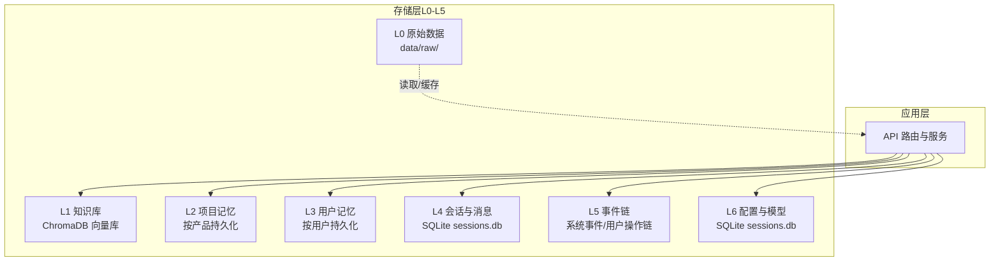

**图表来源**
- [backend/app/storage/session_store.py:1-251](file://backend/app/storage/session_store.py#L1-L251)
- [backend/app/storage/event_store.py:1-269](file://backend/app/storage/event_store.py#L1-L269)
- [backend/app/storage/project_memory.py:1-141](file://backend/app/storage/project_memory.py#L1-L141)
- [backend/app/storage/user_memory.py:1-84](file://backend/app/storage/user_memory.py#L1-L84)
- [backend/app/knowledge/store.py:1-227](file://backend/app/knowledge/store.py#L1-L227)
- [backend/app/storage/raw_store.py:1-134](file://backend/app/storage/raw_store.py#L1-L134)

**章节来源**
- [backend/app/storage/__init__.py:1-2](file://backend/app/storage/__init__.py#L1-L2)

## 核心组件
- 用户存储（L6）：SQLite 表 users，支持密码哈希、角色管理与管理员初始化。
- 会话存储（L4）：SQLite 表 sessions 与 messages，支持会话列表、消息增删改查、索引优化。
- 原始数据存储（L0）：RawStore 类，按分类读取 JSON 并缓存，提供 HS/VAT/认证矩阵查询。
- 项目记忆（L2）：按产品目录持久化合规历史，支持最新记录与历史查询。
- 用户记忆（L3）：按用户目录持久化画像与偏好，支持常用市场与搜索历史。
- 事件链（L5）：EventStore 类，统一系统事件与用户操作链，支持筛选与迁移。
- Agent 配置（L6）：SQLite 表 agent_configs，支持默认 Agent 初始化与 CRUD。
- 模型配置（L6）：SQLite 表 model_configs，支持激活配置热重载。
- 知识库（L1）：ChromaDB 多 collection，按市场分仓，支持 upsert、查询与降级。
- 数据模型（L1/L4/L5）：Pydantic 模型定义，支撑 API 请求/响应与事件/会话结构。
- 配置中心（L0-L6）：Settings 提供数据库、Chroma、数据目录等全局配置。

**章节来源**
- [backend/app/storage/user_store.py:1-133](file://backend/app/storage/user_store.py#L1-L133)
- [backend/app/storage/session_store.py:1-251](file://backend/app/storage/session_store.py#L1-L251)
- [backend/app/storage/raw_store.py:1-134](file://backend/app/storage/raw_store.py#L1-L134)
- [backend/app/storage/project_memory.py:1-141](file://backend/app/storage/project_memory.py#L1-L141)
- [backend/app/storage/user_memory.py:1-84](file://backend/app/storage/user_memory.py#L1-L84)
- [backend/app/storage/event_store.py:1-269](file://backend/app/storage/event_store.py#L1-L269)
- [backend/app/storage/agent_config_store.py:1-310](file://backend/app/storage/agent_config_store.py#L1-L310)
- [backend/app/storage/model_config_store.py:1-174](file://backend/app/storage/model_config_store.py#L1-L174)
- [backend/app/knowledge/store.py:1-227](file://backend/app/knowledge/store.py#L1-L227)
- [backend/app/models/schemas.py:1-264](file://backend/app/models/schemas.py#L1-L264)
- [backend/app/config.py:1-183](file://backend/app/config.py#L1-L183)

## 架构总览
存储层采用“关系型 + 向量”的混合架构：
- 关系型数据库（PostgreSQL）：当前 SQLAlchemy 已定义，但实际业务主要使用 SQLite（复用 sessions.db）承载用户、会话、Agent/模型配置等；PostgreSQL 作为未来扩展与高并发场景的候选。
- 向量数据库（ChromaDB）：本地持久化，按市场分 collection，SentenceTransformer 多语言嵌入，支持语义检索与降级容错。
- 分层存储（L0-L5）：面向不同读写特征与一致性要求，分别采用内存缓存、文件系统与数据库存储，形成清晰的职责边界。

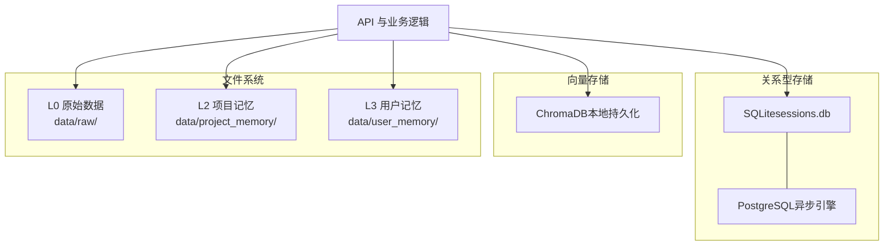

**图表来源**
- [backend/app/models/database.py:1-15](file://backend/app/models/database.py#L1-L15)
- [backend/app/knowledge/store.py:1-227](file://backend/app/knowledge/store.py#L1-L227)
- [backend/app/storage/session_store.py:1-251](file://backend/app/storage/session_store.py#L1-L251)
- [backend/app/storage/raw_store.py:1-134](file://backend/app/storage/raw_store.py#L1-L134)
- [backend/app/storage/project_memory.py:1-141](file://backend/app/storage/project_memory.py#L1-L141)
- [backend/app/storage/user_memory.py:1-84](file://backend/app/storage/user_memory.py#L1-L84)

## 详细组件分析

### 用户存储（L6）
- 设计要点
  - 单表 users：主键 id、唯一 username、hashed_pw、role、created_at。
  - 密码使用 bcrypt 哈希，提供 hash_password 与 verify_password。
  - 支持创建、查询、列表、删除、角色更新、密码更新。
  - 启动时若表为空自动创建默认管理员账号。
- 读写优化
  - 仅在首次使用时建表，减少冷启动开销。
  - 唯一约束冲突时抛出异常，上层捕获并转换为业务错误。
- 一致性
  - 使用事务提交，失败回滚；用户名唯一约束保障幂等。

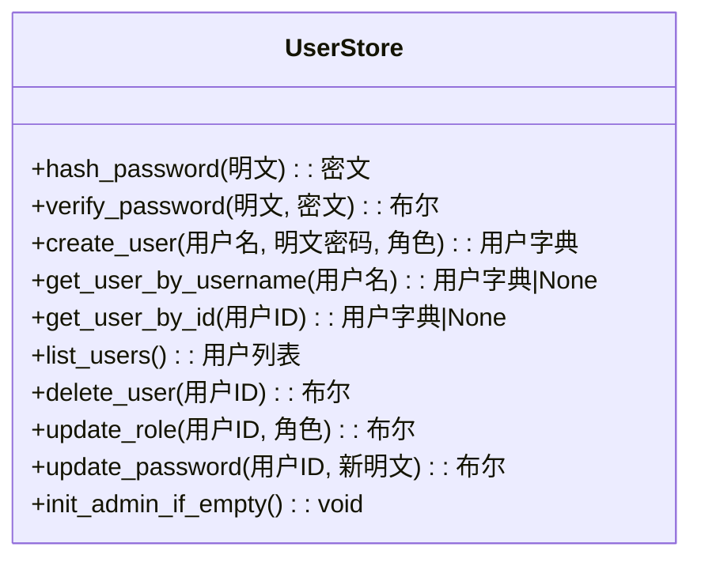

**图表来源**
- [backend/app/storage/user_store.py:1-133](file://backend/app/storage/user_store.py#L1-L133)

**章节来源**
- [backend/app/storage/user_store.py:1-133](file://backend/app/storage/user_store.py#L1-L133)

### 会话存储（L4）
- 设计要点
  - 两表：sessions（id, title, created_at, updated_at, user_id 可选）与 messages（id, session_id, role, content, 结果/意图/来源 JSON, created_at）。
  - 约束：messages.session_id 外键关联 sessions.id，级联删除。
  - 索引：messages.session_id、sessions.updated_at DESC。
  - 迁移：自动为旧表增加 user_id 列。
- 读写优化
  - 列表查询按 updated_at 降序，支持按 user_id 过滤。
  - 获取会话时一次性加载消息并反序列化 JSON。
  - 添加消息后同步更新 session.updated_at。
- 一致性
  - 单条插入与更新在同一事务内提交，保证消息与会话时间戳一致。

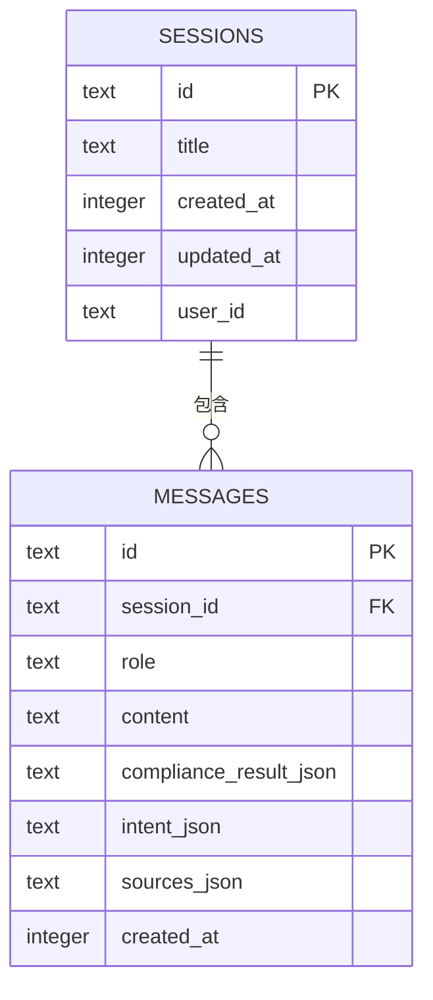

**图表来源**
- [backend/app/storage/session_store.py:37-62](file://backend/app/storage/session_store.py#L37-L62)

**章节来源**
- [backend/app/storage/session_store.py:1-251](file://backend/app/storage/session_store.py#L1-L251)

### 原始数据存储（L0）
- 设计要点
  - RawStore 类：按 category/filename 读取 data/raw/ 下的 JSON 文件，内存缓存。
  - 提供 HS 编码、VAT 税率、认证矩阵的查询接口。
  - 支持缓存失效与热加载。
- 读写优化
  - 首次读取磁盘，后续走内存缓存，避免重复 IO。
  - 模糊匹配与别名映射提升产品名匹配鲁棒性。
- 一致性
  - 缓存与文件系统解耦，支持显式失效与按目录批量清理。

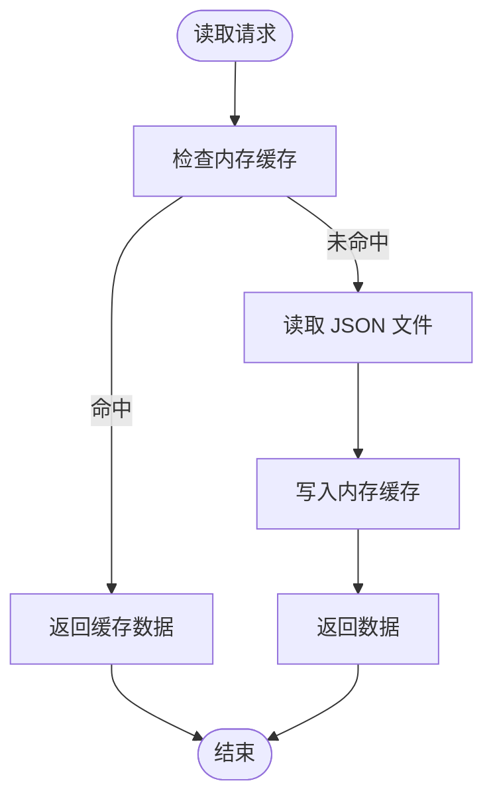

**图表来源**
- [backend/app/storage/raw_store.py:28-53](file://backend/app/storage/raw_store.py#L28-L53)

**章节来源**
- [backend/app/storage/raw_store.py:1-134](file://backend/app/storage/raw_store.py#L1-L134)

### 项目记忆（L2）
- 设计要点
  - 按 product_id 创建目录，文件 compliance.json 记录产品合规历史。
  - 保存时追加新记录，读取时加载历史并按时间排序。
  - 支持列出所有产品摘要（含最近检查时间）。
- 读写优化
  - 追加写入，避免频繁重写大文件。
  - 目录结构简单，遍历成本低。
- 一致性
  - 单文件原子写入，避免并发写入导致的数据损坏。

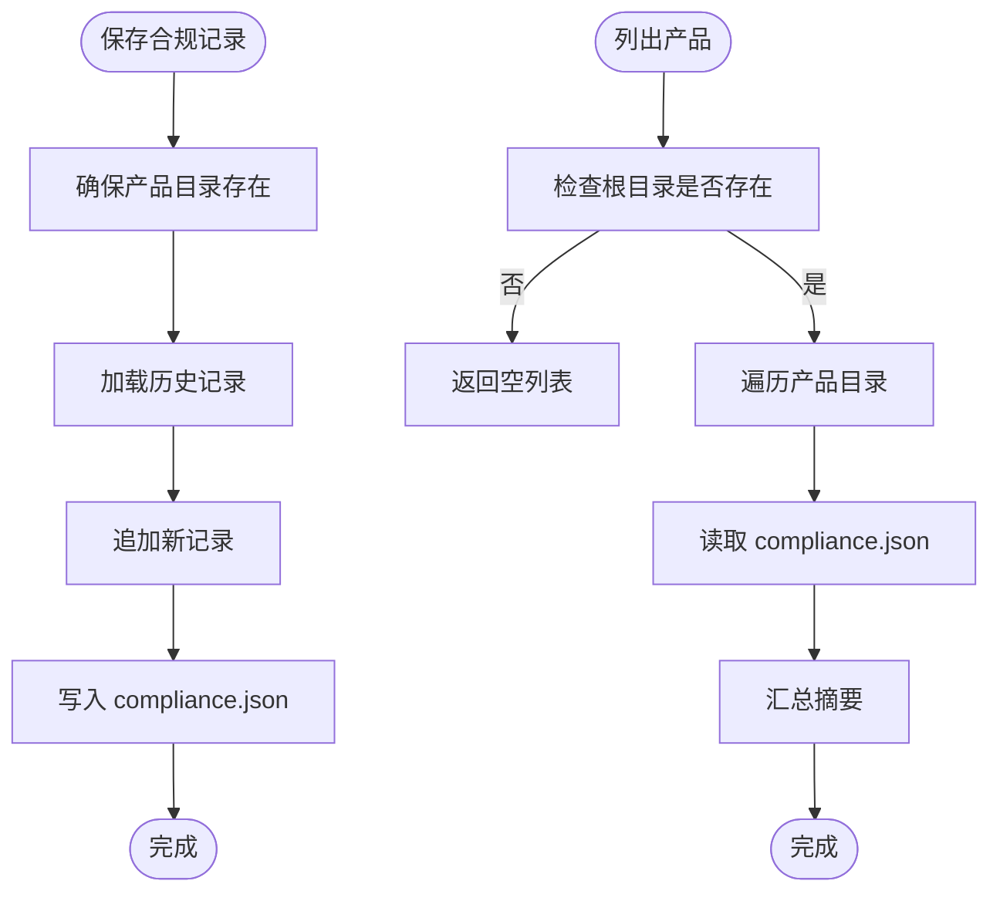

**图表来源**
- [backend/app/storage/project_memory.py:36-141](file://backend/app/storage/project_memory.py#L36-L141)

**章节来源**
- [backend/app/storage/project_memory.py:1-141](file://backend/app/storage/project_memory.py#L1-L141)

### 用户记忆（L3）
- 设计要点
  - 按 user_id 创建目录，文件 profile.json 记录用户画像。
  - 支持常用目标市场更新与最近搜索记录维护（去重与截断）。
- 读写优化
  - 合并更新，保留历史字段，避免覆盖。
  - 最近搜索最多保留 N 条，控制文件大小。
- 一致性
  - 单文件写入，保证用户画像的最终一致性。

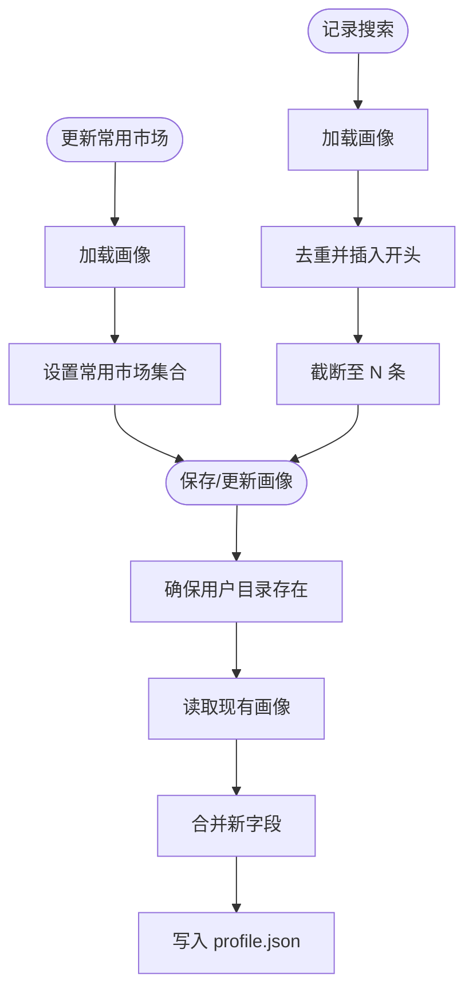

**图表来源**
- [backend/app/storage/user_memory.py:31-84](file://backend/app/storage/user_memory.py#L31-L84)

**章节来源**
- [backend/app/storage/user_memory.py:1-84](file://backend/app/storage/user_memory.py#L1-L84)

### 事件链（L5）
- 设计要点
  - EventRecord 统一事件结构；EventStore 统一系统事件与用户操作链。
  - 系统事件按 chain_id 维度存储于 data/event_chain/system_events/；用户事件按 user_id 维度存储于 data/event_chain/action_chains/。
  - 支持筛选（类型/来源/严重度）、列出链 ID、迁移旧目录。
- 读写优化
  - 追加写入，维护 total_events 与 updated_at。
  - 支持按条件快速筛选与分页。
- 一致性
  - 单文件写入，保证事件链完整性；迁移脚本提供向后兼容。

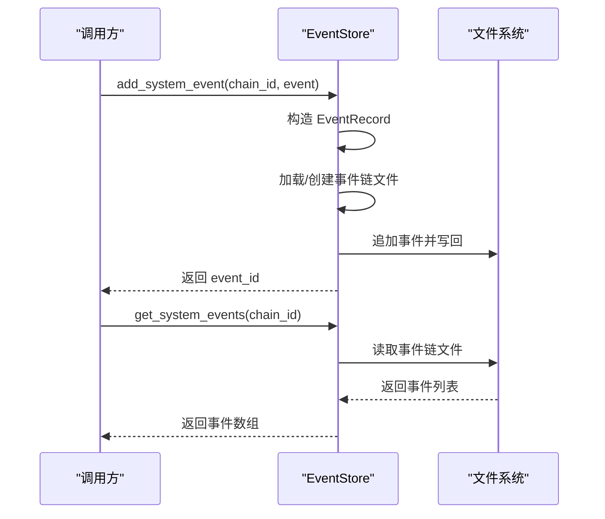

**图表来源**
- [backend/app/storage/event_store.py:76-170](file://backend/app/storage/event_store.py#L76-L170)

**章节来源**
- [backend/app/storage/event_store.py:1-269](file://backend/app/storage/event_store.py#L1-L269)

### Agent 配置（L6）
- 设计要点
  - 表 agent_configs：id/name/type/description/system_prompt/enabled/sort_order/created_at/updated_at。
  - 默认内置多个 Agent（通用合规、出境法律、税务、文化、认证等），启动时自动注入。
  - 支持 CRUD、启用/禁用、按类型查询。
- 读写优化
  - SQLite 复用 sessions.db，减少连接数。
  - 启动时检查空表并初始化默认配置。
- 一致性
  - 固定内置 Agent 不可删除，防止误删。

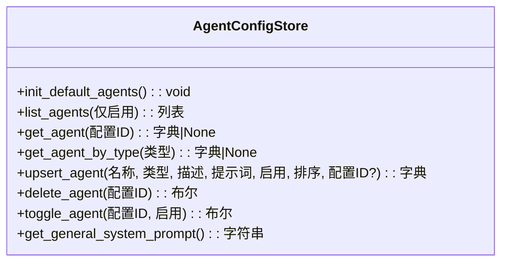

**图表来源**
- [backend/app/storage/agent_config_store.py:163-310](file://backend/app/storage/agent_config_store.py#L163-L310)

**章节来源**
- [backend/app/storage/agent_config_store.py:1-310](file://backend/app/storage/agent_config_store.py#L1-L310)

### 模型配置（L6）
- 设计要点
  - 表 model_configs：id/name/api_key/base_url/model/temperature/top_p/max_tokens/embed_model/is_active/created_at/updated_at。
  - is_active 唯一键，激活某条时自动将其他置 0。
  - 支持 CRUD、激活切换、热重载 settings。
- 读写优化
  - 激活切换时同步更新全局 settings，实现热重载。
  - 列表返回时隐藏敏感字段（仅展示掩码）。
- 一致性
  - 原子更新 is_active，避免并发竞争。

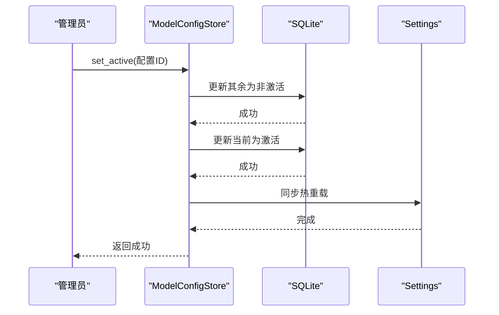

**图表来源**
- [backend/app/storage/model_config_store.py:118-157](file://backend/app/storage/model_config_store.py#L118-L157)

**章节来源**
- [backend/app/storage/model_config_store.py:1-174](file://backend/app/storage/model_config_store.py#L1-L174)

### 知识库（L1）
- 设计要点
  - ChromaDB 多 collection：eu_knowledge、us_knowledge、jp_knowledge、kr_knowledge。
  - 嵌入模型：paraphrase-multilingual-MiniLM-L12-v2（SentenceTransformer），本地加载。
  - upsert_documents：幂等写入，ID 由 regulation_id 与 chunk 索引组合。
  - search：支持按市场或自动检测市场，无结果时全库兜底。
  - 降级：查询异常返回空结果，不阻塞主流程。
- 读写优化
  - 懒加载 client 与 embedding function，首次使用时初始化。
  - 按 collection 查询，必要时全库聚合并排序。
- 一致性
  - upsert 幂等，避免重复写入；collection metadata 记录市场与相似度空间。

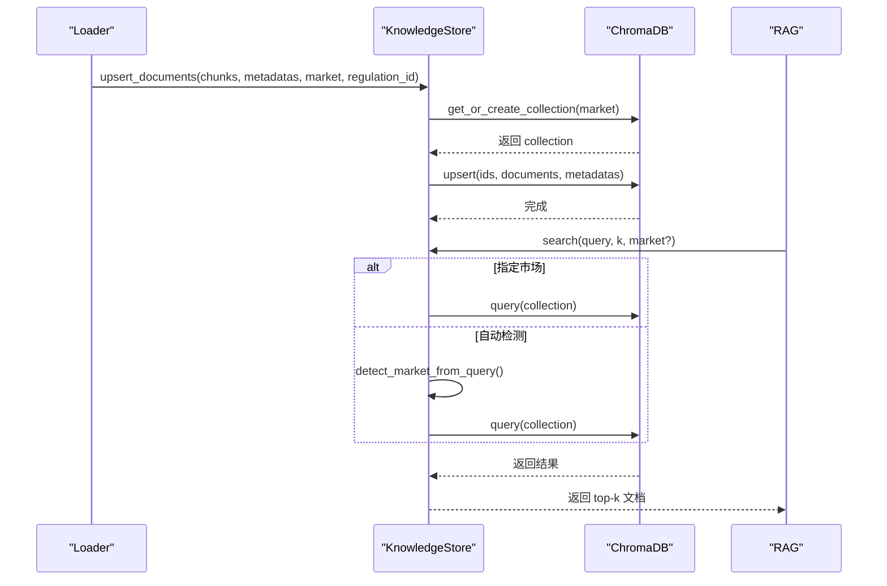

**图表来源**
- [backend/app/knowledge/store.py:81-192](file://backend/app/knowledge/store.py#L81-L192)

**章节来源**
- [backend/app/knowledge/store.py:1-227](file://backend/app/knowledge/store.py#L1-L227)

### 数据模型与表结构关系
- Pydantic 模型
  - 定义了会话、事件链、操作链、合规结果、Shopify 数据等结构，支撑 API 请求/响应与前端展示。
- 表结构关系
  - sessions 与 messages：一对多，messages.session_id 外键关联 sessions.id。
  - agent_configs 与 model_configs：独立配置表，均复用 sessions.db。
  - PostgreSQL 引擎已定义，当前业务未直接使用，可作为未来扩展。

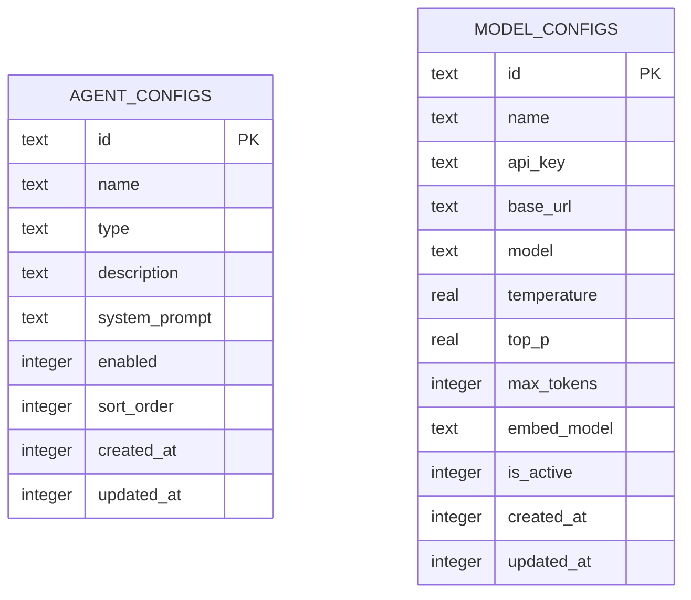

**图表来源**
- [backend/app/storage/agent_config_store.py:163-178](file://backend/app/storage/agent_config_store.py#L163-L178)
- [backend/app/storage/model_config_store.py:20-38](file://backend/app/storage/model_config_store.py#L20-L38)

**章节来源**
- [backend/app/models/schemas.py:1-264](file://backend/app/models/schemas.py#L1-L264)
- [backend/app/models/database.py:1-15](file://backend/app/models/database.py#L1-L15)

## 依赖分析
- 组件耦合
  - 会话存储与事件链：会话变更触发事件链写入，二者通过业务流程耦合。
  - 项目记忆与会话存储：合规检查完成后写入 L2，随后可回查 L4。
  - 用户记忆与 NLU/LLM：推理后写入 L3，后续意图解析与个性化读取 L3。
  - 知识库与规则引擎：RAG 依赖 L1，规则引擎依赖 L0。
- 外部依赖
  - ChromaDB：本地持久化，SentenceTransformer 嵌入。
  - SQLite：sessions.db 复用，承载用户、会话、Agent/模型配置。
  - PostgreSQL：异步引擎定义，当前未启用。
- 循环依赖
  - 存储层内部无循环依赖；事件链迁移脚本与存储层解耦。

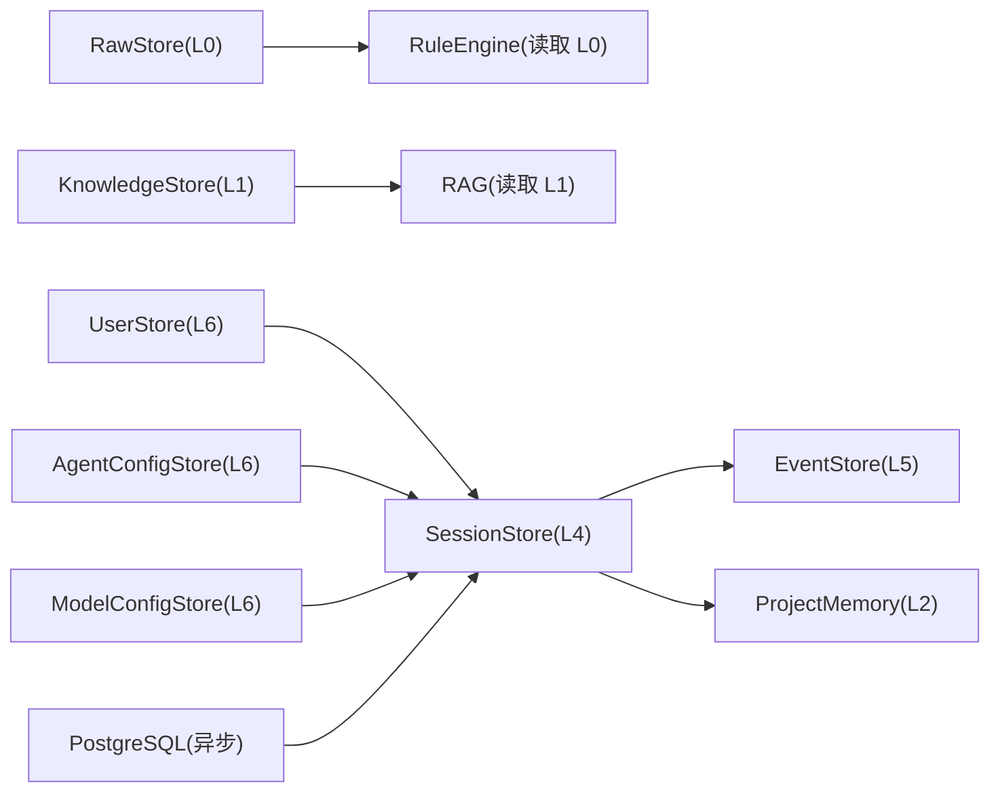

**图表来源**
- [backend/app/storage/raw_store.py:1-134](file://backend/app/storage/raw_store.py#L1-L134)
- [backend/app/knowledge/store.py:1-227](file://backend/app/knowledge/store.py#L1-L227)
- [backend/app/storage/session_store.py:1-251](file://backend/app/storage/session_store.py#L1-L251)
- [backend/app/storage/event_store.py:1-269](file://backend/app/storage/event_store.py#L1-L269)
- [backend/app/storage/project_memory.py:1-141](file://backend/app/storage/project_memory.py#L1-L141)
- [backend/app/storage/user_store.py:1-133](file://backend/app/storage/user_store.py#L1-L133)
- [backend/app/storage/agent_config_store.py:1-310](file://backend/app/storage/agent_config_store.py#L1-L310)
- [backend/app/storage/model_config_store.py:1-174](file://backend/app/storage/model_config_store.py#L1-L174)
- [backend/app/models/database.py:1-15](file://backend/app/models/database.py#L1-L15)

**章节来源**
- [backend/app/storage/session_store.py:1-251](file://backend/app/storage/session_store.py#L1-L251)
- [backend/app/storage/event_store.py:1-269](file://backend/app/storage/event_store.py#L1-L269)
- [backend/app/storage/project_memory.py:1-141](file://backend/app/storage/project_memory.py#L1-L141)
- [backend/app/storage/user_memory.py:1-84](file://backend/app/storage/user_memory.py#L1-L84)
- [backend/app/knowledge/store.py:1-227](file://backend/app/knowledge/store.py#L1-L227)
- [backend/app/storage/raw_store.py:1-134](file://backend/app/storage/raw_store.py#L1-L134)
- [backend/app/storage/user_store.py:1-133](file://backend/app/storage/user_store.py#L1-L133)
- [backend/app/storage/agent_config_store.py:1-310](file://backend/app/storage/agent_config_store.py#L1-L310)
- [backend/app/storage/model_config_store.py:1-174](file://backend/app/storage/model_config_store.py#L1-L174)
- [backend/app/models/database.py:1-15](file://backend/app/models/database.py#L1-L15)

## 性能考量
- 读写优化
  - L0：RawStore 内存缓存，避免重复磁盘 IO；按需失效与批量清理。
  - L1：ChromaDB 懒加载与本地嵌入，首次查询可能有延迟；查询失败降级返回空结果。
  - L4：SQLite 建立索引（messages.session_id、sessions.updated_at），减少排序与过滤成本。
  - L2/L3：单文件追加写入，避免大文件重写；目录结构简单，遍历成本低。
- 缓存机制
  - L0：内存缓存；支持按目录/文件粒度失效。
  - L1：ChromaDB 本地持久化，无需额外缓存；查询结果按相似度排序。
- 一致性保证
  - SQLite 事务保证单次操作原子性；文件系统写入保证最终一致性。
  - 激活配置热重载通过 settings 同步，避免并发竞争。
- 扩展性与可维护性
  - 分层清晰，职责单一；新增市场只需新增 collection 与路由。
  - 迁移脚本与事件链迁移功能，降低升级成本。

[本节为通用性能讨论，不直接分析具体文件]

## 故障排查指南
- ChromaDB 查询异常
  - 现象：search 返回空结果或警告日志。
  - 排查：确认 collection 是否存在、文档是否 upsert 成功、embedding 模型是否加载。
  - 处理：检查日志与 settings.chroma_persist_dir，必要时重建 collection。
- SQLite 唯一约束冲突
  - 现象：创建用户时报用户名重复。
  - 排查：确认用户名是否已存在。
  - 处理：更换用户名或删除重复项。
- 事件链迁移失败
  - 现象：旧目录数据未迁移。
  - 排查：确认旧目录路径与新目录权限。
  - 处理：运行迁移脚本并检查返回统计。
- 模型配置热重载无效
  - 现象：切换激活配置后 settings 未更新。
  - 排查：确认 set_active 返回值与数据库 is_active 状态。
  - 处理：重新 set_active 并检查同步逻辑。

**章节来源**
- [backend/app/knowledge/store.py:171-173](file://backend/app/knowledge/store.py#L171-L173)
- [backend/app/storage/user_store.py:61-64](file://backend/app/storage/user_store.py#L61-L64)
- [backend/app/storage/event_store.py:224-268](file://backend/app/storage/event_store.py#L224-L268)
- [backend/app/storage/model_config_store.py:143-156](file://backend/app/storage/model_config_store.py#L143-L156)

## 结论
避风港项目的存储层通过“分层存储 + 关系型 + 向量”的架构，实现了确定性规则与语义检索的协同、用户与合规历史的分离、以及事件链的统一归档。SQLite 复用 sessions.db 承载用户、会话与配置，ChromaDB 提供多语言语义检索能力，RawStore 与文件系统满足 L0 与 L2/L3 的高效读写。未来可在 PostgreSQL 上扩展高并发场景，并完善监控与备份策略以增强可靠性。

[本节为总结性内容，不直接分析具体文件]

## 附录

### 数据迁移策略
- L0 原始数据迁移：将旧文件复制到 data/raw/ 下，保持目录结构。
- L5 事件链迁移：通过 EventStore.migrate_from_old_dirs 将旧目录迁移至新结构。
- 认证矩阵：cert_matrix.json 需手动创建或由上游流程生成。

**章节来源**
- [backend/scripts/migrate_storage.py:27-94](file://backend/scripts/migrate_storage.py#L27-L94)
- [backend/app/storage/event_store.py:224-268](file://backend/app/storage/event_store.py#L224-L268)

### 备份与恢复方案
- 备份对象
  - SQLite：sessions.db（用户、会话、Agent/模型配置）。
  - 文件系统：data/raw/、data/project_memory/、data/user_memory/、data/event_chain/。
  - ChromaDB：settings.chroma_persist_dir。
- 恢复流程
  - 停止服务 → 备份上述目录 → 恢复目标目录 → 启动服务。
  - 若 ChromaDB 损坏，可重建 collection 并重新初始化知识库。

**章节来源**
- [backend/app/config.py:147-151](file://backend/app/config.py#L147-L151)
- [backend/scripts/init_knowledge.py:28-67](file://backend/scripts/init_knowledge.py#L28-L67)

### 性能监控方法
- 指标建议
  - ChromaDB：文档数量、查询耗时、失败率。
  - SQLite：连接数、慢查询、锁等待。
  - 文件系统：读写延迟、磁盘占用。
- 工具建议
  - Prometheus/Grafana 监控指标导出。
  - 日志采样与告警（如 ChromaDB 查询异常）。

[本节为通用指导，不直接分析具体文件]

### 启动与初始化流程
- 启动时自动初始化调度器、默认管理员、默认模型配置与默认 Agent。

**章节来源**
- [backend/app/main.py:62-71](file://backend/app/main.py#L62-L71)