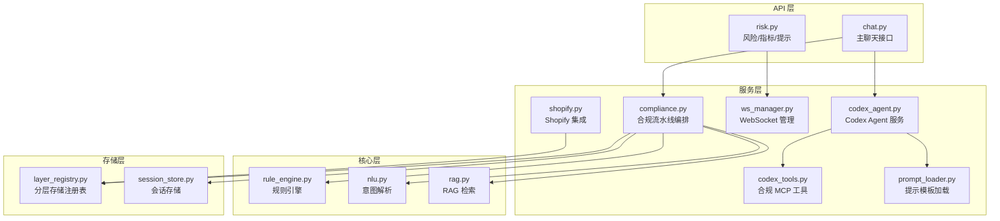
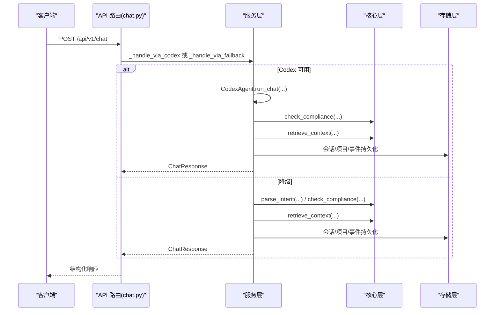
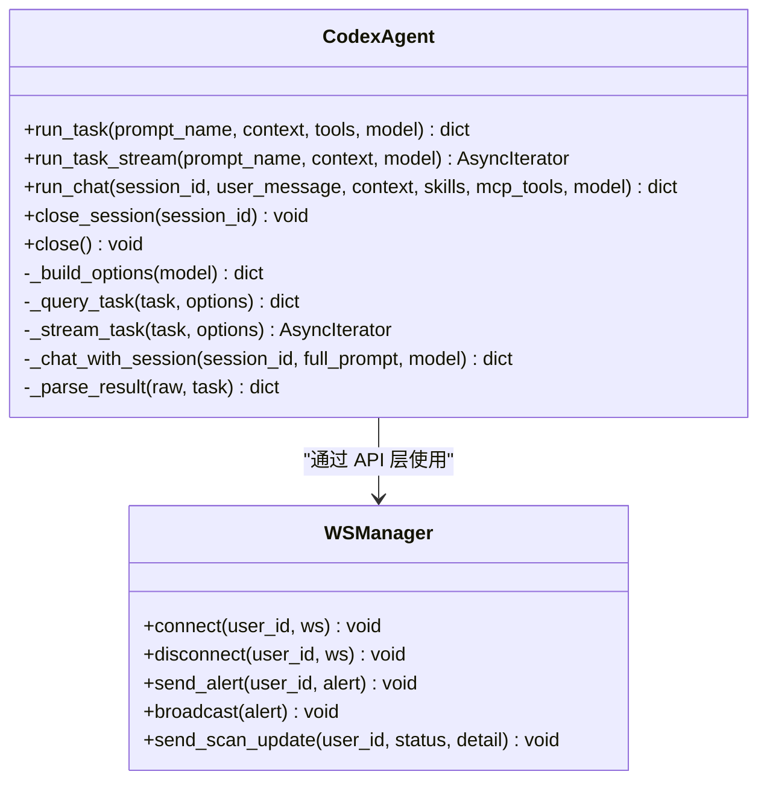
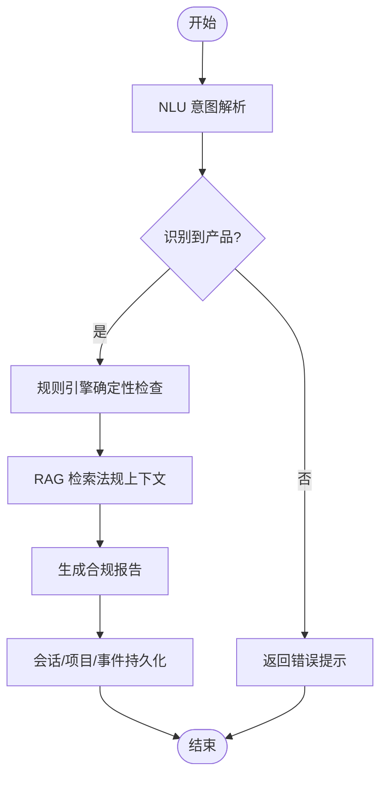
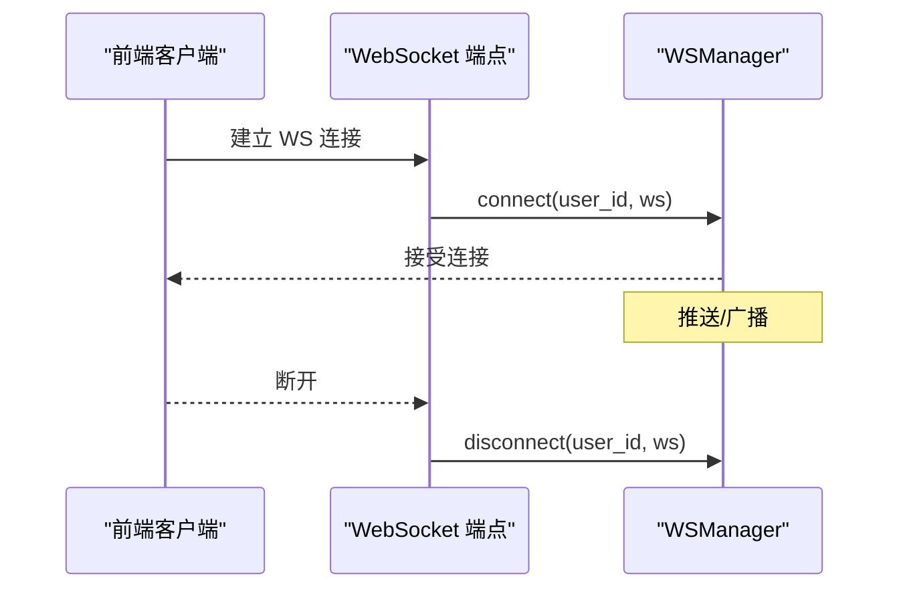
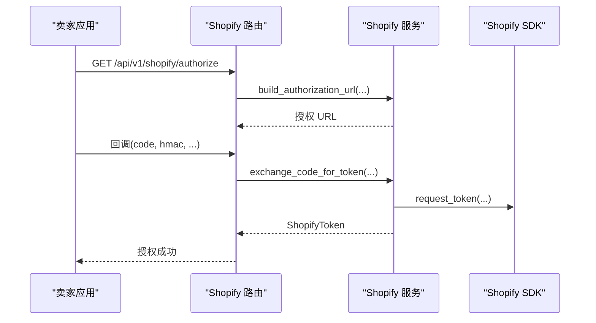
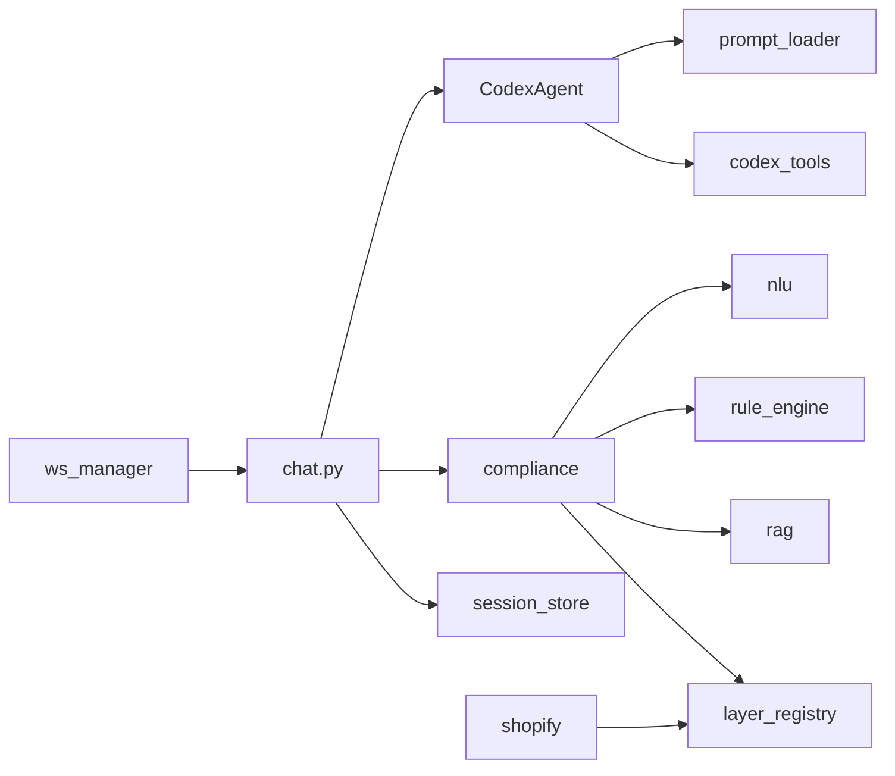

# 服务层设计

<cite>
**本文档引用的文件**
- [backend/app/services/codex_agent.py](file://backend/app/services/codex_agent.py)
- [backend/app/services/codex_tools.py](file://backend/app/services/codex_tools.py)
- [backend/app/services/compliance.py](file://backend/app/services/compliance.py)
- [backend/app/services/prompt_loader.py](file://backend/app/services/prompt_loader.py)
- [backend/app/services/ws_manager.py](file://backend/app/services/ws_manager.py)
- [backend/app/services/shopify.py](file://backend/app/services/shopify.py)
- [backend/app/api/chat.py](file://backend/app/api/chat.py)
- [backend/app/api/risk.py](file://backend/app/api/risk.py)
- [backend/app/main.py](file://backend/app/main.py)
- [backend/app/config.py](file://backend/app/config.py)
- [backend/app/core/rule_engine.py](file://backend/app/core/rule_engine.py)
- [backend/app/core/nlu.py](file://backend/app/core/nlu.py)
- [backend/app/core/rag.py](file://backend/app/core/rag.py)
- [backend/app/storage/layer_registry.py](file://backend/app/storage/layer_registry.py)
- [backend/app/storage/session_store.py](file://backend/app/storage/session_store.py)
</cite>

## 目录
1. [简介](#简介)
2. [项目结构](#项目结构)
3. [核心组件](#核心组件)
4. [架构总览](#架构总览)
5. [详细组件分析](#详细组件分析)
6. [依赖分析](#依赖分析)
7. [性能考虑](#性能考虑)
8. [故障排查指南](#故障排查指南)
9. [结论](#结论)
10. [附录](#附录)

## 简介
本文件系统化阐述避风港项目“服务层”的设计与实现，重点说明服务层在整体架构中的角色定位、职责边界与协作关系。服务层作为业务逻辑的封装层，向上承接 API 层的请求编排与协议转换，向下协调核心层（规则引擎、NLU、RAG）与存储层（会话、项目、事件等），并通过工具与 MCP 机制扩展 AI 能力。本文将围绕以下主题展开：
- 服务层在架构中的定位与边界
- 各服务模块设计与职责：Codex Agent 服务、合规检查服务、提示模板加载服务、WebSocket 管理服务、Shopify 集成服务
- 依赖注入与生命周期管理
- 业务流程编排与复杂逻辑处理
- 异常处理、事务管理与性能优化策略
- 服务调用示例与设计模式应用

## 项目结构
服务层位于 backend/app/services 目录，围绕“业务编排 + 能力扩展 + 会话与实时推送”三大方向组织：
- Codex Agent 服务：封装 Claude Agent SDK，提供单次任务与多轮对话能力，内置合规 MCP 工具链
- 合规检查服务：编排 NLU + 规则引擎 + RAG 的端到端合规流水线
- 提示模板加载服务：统一加载与渲染 YAML 模板，支持热加载与缓存
- WebSocket 管理服务：全局单例管理用户连接与实时预警推送
- Shopify 集成服务：OAuth 授权、产品数据同步、Webhook 验证与合规请求转换

图表来源
- [backend/app/api/chat.py](file://backend/app/api/chat.py)
- [backend/app/api/risk.py](file://backend/app/api/risk.py)
- [backend/app/services/codex_agent.py](file://backend/app/services/codex_agent.py)
- [backend/app/services/codex_tools.py](file://backend/app/services/codex_tools.py)
- [backend/app/services/compliance.py](file://backend/app/services/compliance.py)
- [backend/app/services/prompt_loader.py](file://backend/app/services/prompt_loader.py)
- [backend/app/services/ws_manager.py](file://backend/app/services/ws_manager.py)
- [backend/app/services/shopify.py](file://backend/app/services/shopify.py)
- [backend/app/core/rule_engine.py](file://backend/app/core/rule_engine.py)
- [backend/app/core/nlu.py](file://backend/app/core/nlu.py)
- [backend/app/core/rag.py](file://backend/app/core/rag.py)
- [backend/app/storage/layer_registry.py](file://backend/app/storage/layer_registry.py)
- [backend/app/storage/session_store.py](file://backend/app/storage/session_store.py)

章节来源
- [backend/app/main.py](file://backend/app/main.py)
- [backend/app/config.py](file://backend/app/config.py)

## 核心组件
- Codex Agent 服务：提供 run_task/run_chat 接口，封装 Claude Agent SDK 的工具集、MCP 工具、权限模式与工作目录配置；支持流式事件推送与会话生命周期管理
- 合规检查服务：编排 NLU 意图解析、规则引擎确定性检查、RAG 上下文增强与报告生成，形成端到端合规流水线
- 提示模板加载服务：集中加载 YAML 模板、变量渲染与热加载，避免硬编码并提升迭代效率
- WebSocket 管理服务：全局单例维护 user_id → WebSocket 集合，支持推送与广播，具备断连清理与健壮性处理
- Shopify 集成服务：封装官方 SDK 的 OAuth 授权、令牌持久化、产品数据同步与 Webhook 验证，提供合规请求转换

章节来源
- [backend/app/services/codex_agent.py](file://backend/app/services/codex_agent.py)
- [backend/app/services/compliance.py](file://backend/app/services/compliance.py)
- [backend/app/services/prompt_loader.py](file://backend/app/services/prompt_loader.py)
- [backend/app/services/ws_manager.py](file://backend/app/services/ws_manager.py)
- [backend/app/services/shopify.py](file://backend/app/services/shopify.py)

## 架构总览
服务层在整体架构中的职责边界清晰：
- 业务编排：API 层负责路由与协议转换，服务层负责业务流程编排与错误降级
- 能力扩展：通过 MCP 工具与 Claude SDK 能力，将规则引擎与 RAG 等核心能力以工具形式注入 AI
- 会话与状态：统一管理用户会话、持久化上下文与实时推送
- 配置与环境：集中读取 settings，支持热加载与运行时切换

图表来源
- [backend/app/api/chat.py](file://backend/app/api/chat.py)
- [backend/app/services/codex_agent.py](file://backend/app/services/codex_agent.py)
- [backend/app/core/rule_engine.py](file://backend/app/core/rule_engine.py)
- [backend/app/core/rag.py](file://backend/app/core/rag.py)
- [backend/app/storage/session_store.py](file://backend/app/storage/session_store.py)

## 详细组件分析

### Codex Agent 服务
- 设计要点
  - 统一 run_task 与 run_chat 接口，前者面向一次性任务，后者面向多轮会话
  - 通过 ClaudeAgentOptions 注入工具集、MCP 服务器、权限模式与系统提示词
  - 支持流式事件推送，便于前端增量渲染
  - 会话生命周期管理：按 session_id 维持 ClaudeSDKClient，支持关闭与资源释放
- 错误处理
  - SDK 不可用或 API Key 缺失时返回降级响应
  - 对 SDK 异常进行包装与日志记录，必要时清理会话
- 性能优化
  - 工作目录与环境变量透传，减少子进程启动成本
  - 允许禁用思考模式以降低延迟（通过配置）

图表来源
- [backend/app/services/codex_agent.py](file://backend/app/services/codex_agent.py)
- [backend/app/services/ws_manager.py](file://backend/app/services/ws_manager.py)

章节来源
- [backend/app/services/codex_agent.py](file://backend/app/services/codex_agent.py)

### 合规检查服务
- 设计要点
  - full_compliance_pipeline 串联 NLU → 规则引擎 → RAG，形成 MVP 合规流水线
  - 未来扩展：加入 RAG 上下文增强与多智能体协调
- 业务流程
  - NLU 解析用户输入，提取产品与目标市场
  - 规则引擎执行确定性合规检查（HS 编码、VAT、认证、风险、物流、清关材料、文化注意事项）
  - RAG 检索法规知识库，补充上下文
  - 组装结构化合规报告返回

图表来源
- [backend/app/services/compliance.py](file://backend/app/services/compliance.py)
- [backend/app/core/nlu.py](file://backend/app/core/nlu.py)
- [backend/app/core/rule_engine.py](file://backend/app/core/rule_engine.py)
- [backend/app/core/rag.py](file://backend/app/core/rag.py)
- [backend/app/storage/session_store.py](file://backend/app/storage/session_store.py)

章节来源
- [backend/app/services/compliance.py](file://backend/app/services/compliance.py)

### 提示模板加载服务
- 设计要点
  - 所有 prompt 从 YAML 文件读取，支持热加载与全局缓存
  - 渲染时进行简单变量替换，后续可升级为 Jinja2
- 使用场景
  - Codex Agent 的系统提示词与任务提示
  - NLU 的 system prompt
- 性能与可靠性
  - 缓存避免重复 I/O
  - 热加载支持微调后无需重启

章节来源
- [backend/app/services/prompt_loader.py](file://backend/app/services/prompt_loader.py)

### WebSocket 管理服务
- 设计要点
  - 全局单例维护 user_id → set[WebSocket]，支持多标签页连接
  - 提供推送与广播，自动清理失效连接
  - 与风险扫描流程配合，推送扫描状态与预警
- 生命周期
  - 连接建立 accept，断开清理
  - 提供连接状态查询与广播能力

图表来源
- [backend/app/main.py](file://backend/app/main.py)
- [backend/app/services/ws_manager.py](file://backend/app/services/ws_manager.py)

章节来源
- [backend/app/services/ws_manager.py](file://backend/app/services/ws_manager.py)

### Shopify 集成服务
- 设计要点
  - 基于官方 SDK 完成 OAuth 授权、令牌持久化与产品数据同步
  - 提供 Webhook HMAC 验证与合规请求转换
- 关键流程
  - OAuth 授权 URL 构建与令牌交换
  - 产品列表与详情的 SDK 同步
  - 合规请求转换：将 Shopify 产品转为合规查询数据结构

图表来源
- [backend/app/services/shopify.py](file://backend/app/services/shopify.py)

章节来源
- [backend/app/services/shopify.py](file://backend/app/services/shopify.py)

## 依赖分析
- 服务层内部耦合
  - Codex Agent 依赖提示模板加载与合规 MCP 工具
  - 合规检查服务依赖 NLU、规则引擎与 RAG，并通过分层存储注册表访问 L0-L5 数据
  - WebSocket 管理服务被风险扫描与聊天接口使用
  - Shopify 服务通过分层存储注册表访问 L0 数据
- 外部依赖
  - Claude Agent SDK（可选，降级时禁用）
  - Shopify SDK
  - OpenAI 客户端（NLU 与通用对话）
- 配置依赖
  - settings 提供 API Key、模型、目录与开关等配置

图表来源
- [backend/app/services/codex_agent.py](file://backend/app/services/codex_agent.py)
- [backend/app/services/codex_tools.py](file://backend/app/services/codex_tools.py)
- [backend/app/services/compliance.py](file://backend/app/services/compliance.py)
- [backend/app/services/prompt_loader.py](file://backend/app/services/prompt_loader.py)
- [backend/app/services/ws_manager.py](file://backend/app/services/ws_manager.py)
- [backend/app/services/shopify.py](file://backend/app/services/shopify.py)
- [backend/app/api/chat.py](file://backend/app/api/chat.py)
- [backend/app/core/nlu.py](file://backend/app/core/nlu.py)
- [backend/app/core/rule_engine.py](file://backend/app/core/rule_engine.py)
- [backend/app/core/rag.py](file://backend/app/core/rag.py)
- [backend/app/storage/layer_registry.py](file://backend/app/storage/layer_registry.py)
- [backend/app/storage/session_store.py](file://backend/app/storage/session_store.py)

章节来源
- [backend/app/config.py](file://backend/app/config.py)

## 性能考虑
- 降级与容错
  - Codex Agent 在 SDK 不可用或 API Key 缺失时返回降级响应，保证服务可用性
  - 合规流水线在 NLU 失败时回退到关键字提取与规则引擎
- 缓存与热加载
  - 提示模板加载服务采用全局缓存与热加载，减少 I/O 并支持快速迭代
  - 分层存储注册表统一访问 L0 数据，避免重复初始化
- 异步与并发
  - Codex Agent 的流式事件推送与会话管理采用异步模式
  - Shopify 服务通过线程池执行 SDK 同步调用，避免阻塞事件循环
- 配置优化
  - 可禁用思考模式以降低延迟
  - 通过设置工作目录与环境变量减少子进程开销

## 故障排查指南
- Codex Agent 异常
  - 现象：调用失败或返回降级响应
  - 排查：检查 settings 中 codex_enabled、anthropic_api_key、codex_cwd 等配置
  - 处理：启用 SDK、补齐密钥、确认工作目录可写
- WebSocket 推送失败
  - 现象：部分用户无法接收预警
  - 排查：查看 WSManager 的断连清理日志，确认连接状态
  - 处理：前端重连，后端自动清理失效连接
- Shopify 授权失败
  - 现象：令牌交换失败或产品数据为空
  - 排查：确认回调参数完整性与 HMAC 验证，检查令牌文件是否存在
  - 处理：重新授权，检查回调地址与密钥配置
- 合规流水线中断
  - 现象：NLU 或规则引擎异常导致返回空结果
  - 排查：检查 L0 数据是否就绪，确认分层存储注册表可用
  - 处理：修复数据源或等待热加载生效

章节来源
- [backend/app/services/codex_agent.py](file://backend/app/services/codex_agent.py)
- [backend/app/services/ws_manager.py](file://backend/app/services/ws_manager.py)
- [backend/app/services/shopify.py](file://backend/app/services/shopify.py)
- [backend/app/core/rule_engine.py](file://backend/app/core/rule_engine.py)

## 结论
服务层通过清晰的职责划分与稳健的编排机制，将 API 层、核心层与存储层有机整合，既满足 MVP 的确定性合规检查，又为未来引入 RAG 增强与多智能体协作预留空间。Codex Agent 服务提供了强大的 AI 能力扩展点，合规检查服务实现了端到端的业务闭环，提示模板加载与 WebSocket 管理保障了可运维性与用户体验，Shopify 集成服务打通了电商数据源。整体设计强调降级容错、性能优化与可观测性，适合在生产环境中持续演进。

## 附录
- 服务调用示例（路径指引）
  - 主聊天接口：POST /api/v1/chat
    - [backend/app/api/chat.py](file://backend/app/api/chat.py)
  - 风险扫描与预警推送：POST /api/v1/risk/scan
    - [backend/app/api/risk.py](file://backend/app/api/risk.py)
  - WebSocket 实时推送：GET ws://host/api/v1/ws?user_id={user_id}
    - [backend/app/main.py](file://backend/app/main.py)
  - Shopify 授权与产品同步：GET /api/v1/shopify/authorize, GET /api/v1/shopify/products
    - [backend/app/services/shopify.py](file://backend/app/services/shopify.py)
- 设计模式应用
  - 单例模式：WSManager、LayerRegistry
  - 工厂模式：get_compliance_mcp_server
  - 命令模式：MCP 工具函数
  - 策略模式：Codex Agent 的权限模式映射
  - 适配器模式：Shopify SDK 适配与序列化