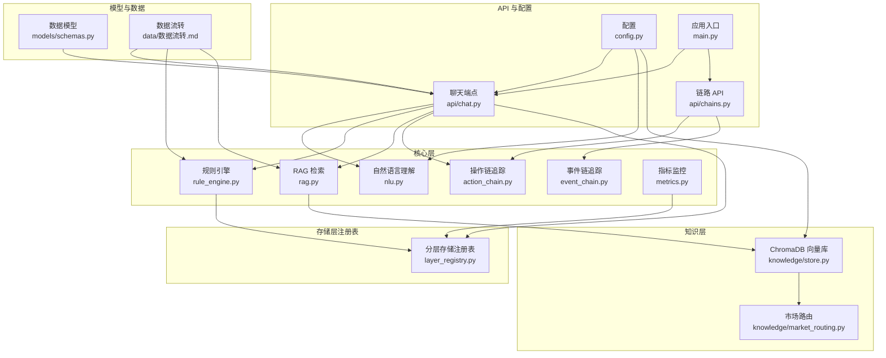
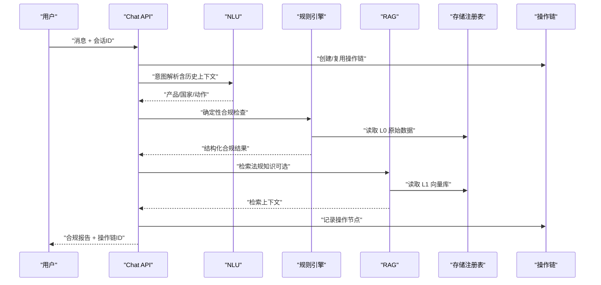
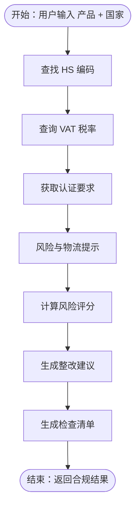
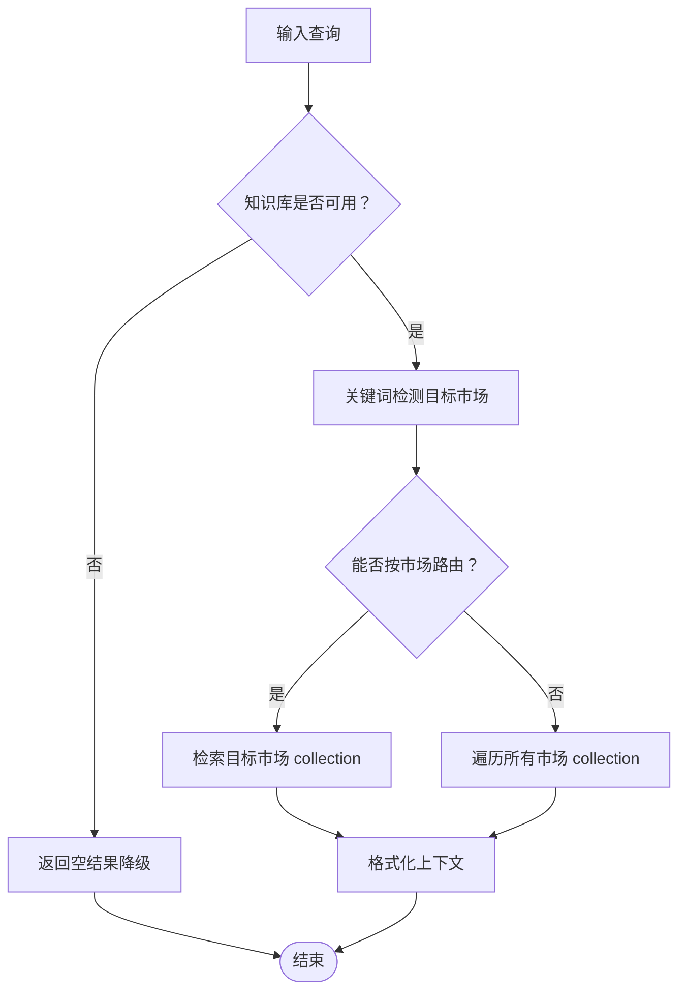
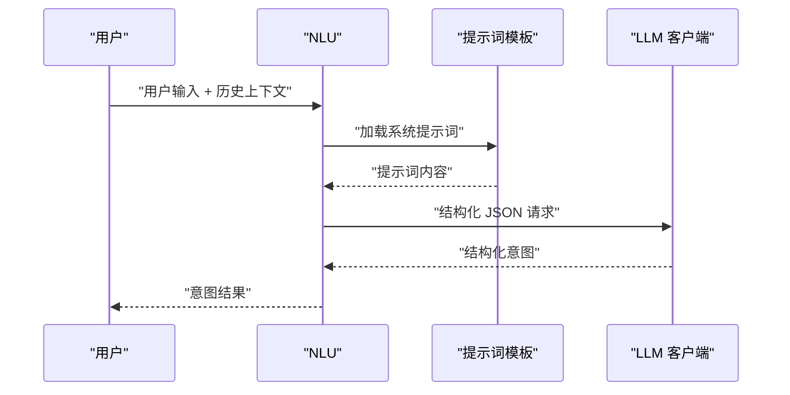
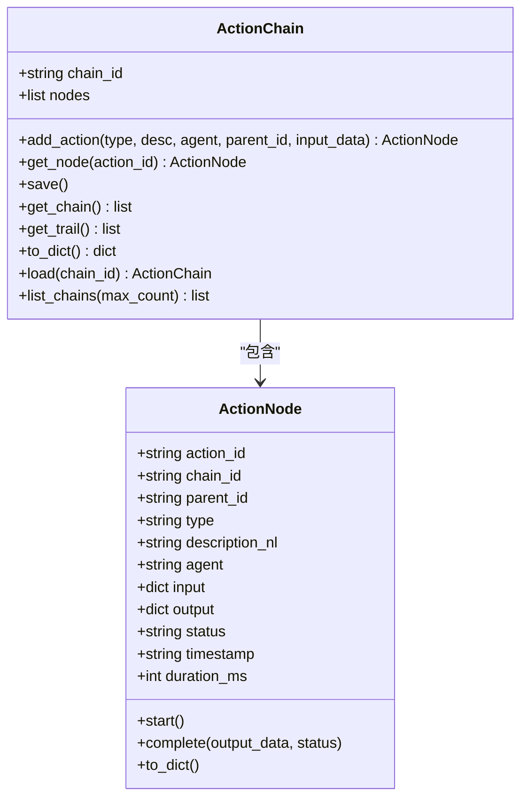
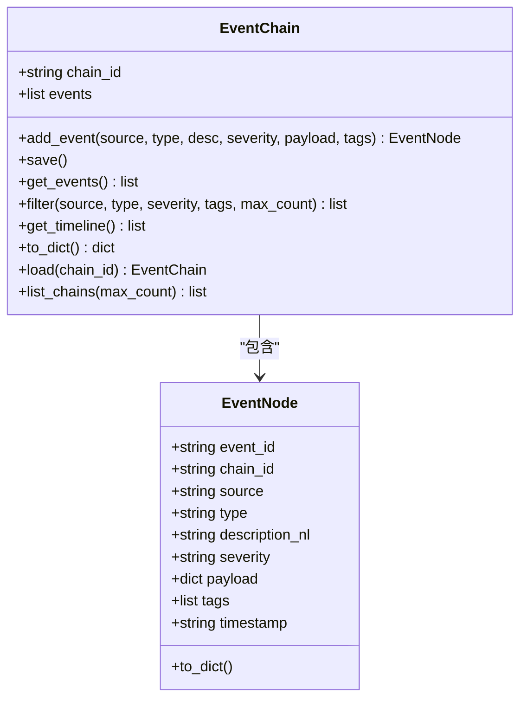
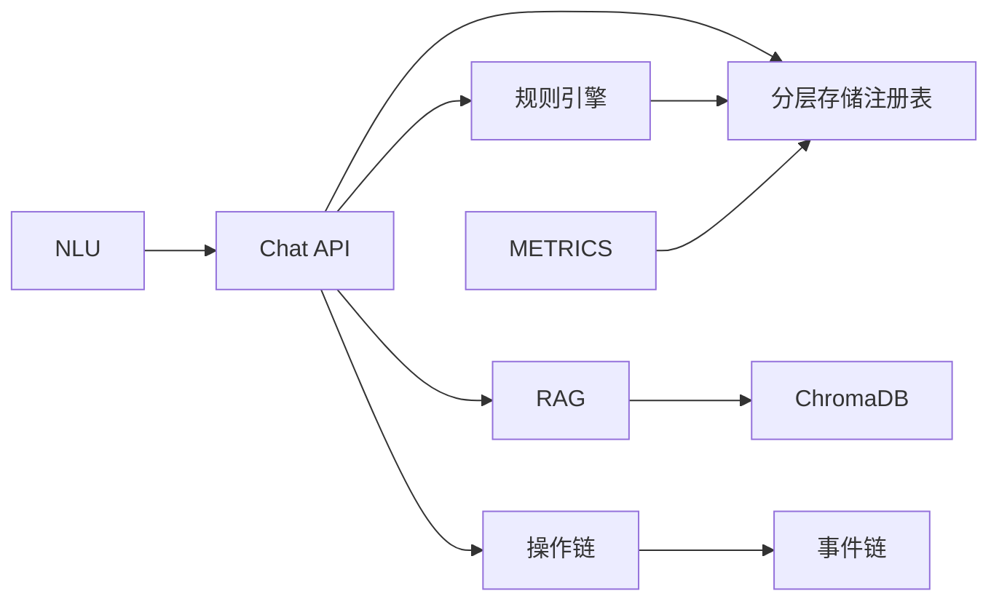

# 核心层设计

<cite>
**本文引用的文件**
- [backend/app/core/rule_engine.py](file://backend/app/core/rule_engine.py)
- [backend/app/core/rag.py](file://backend/app/core/rag.py)
- [backend/app/core/nlu.py](file://backend/app/core/nlu.py)
- [backend/app/core/action_chain.py](file://backend/app/core/action_chain.py)
- [backend/app/core/event_chain.py](file://backend/app/core/event_chain.py)
- [backend/app/core/metrics.py](file://backend/app/core/metrics.py)
- [backend/app/knowledge/store.py](file://backend/app/knowledge/store.py)
- [backend/app/knowledge/market_routing.py](file://backend/app/knowledge/market_routing.py)
- [backend/app/storage/layer_registry.py](file://backend/app/storage/layer_registry.py)
- [backend/app/models/schemas.py](file://backend/app/models/schemas.py)
- [backend/app/config.py](file://backend/app/config.py)
- [backend/app/api/chat.py](file://backend/app/api/chat.py)
- [backend/app/api/chains.py](file://backend/app/api/chains.py)
- [backend/app/main.py](file://backend/app/main.py)
- [backend/data/数据流转.md](file://backend/data/数据流转.md)
- [backend/app/services/codex_agent.py](file://backend/app/services/codex_agent.py)
</cite>

## 目录
1. [引言](#引言)
2. [项目结构](#项目结构)
3. [核心组件](#核心组件)
4. [架构总览](#架构总览)
5. [详细组件分析](#详细组件分析)
6. [依赖分析](#依赖分析)
7. [性能考虑](#性能考虑)
8. [故障排查指南](#故障排查指南)
9. [结论](#结论)
10. [附录](#附录)

## 引言
本文件聚焦“避风港”项目的核心层设计，阐述其作为系统算法与业务规则中心的关键地位。核心层围绕规则引擎、RAG 检索、自然语言理解、操作链追踪等关键组件，构建确定性合规检查与智能化问答的双轨流水线，既保证高频确定性场景的快速稳定，又通过 LLM 与知识库实现开放性与可解释性增强。本文同时给出数据流、交互模式、参数配置、性能调优与扩展机制，帮助读者全面理解核心层如何保障系统的智能化与自动化能力。

## 项目结构
核心层位于后端应用的 app/core 与 app/knowledge 目录，配合分层存储注册表与模型定义，向上支撑 API 端点与前端交互，向下对接 L0-L5 存储层与外部工具。

图表来源
- [backend/app/api/chat.py:1-540](file://backend/app/api/chat.py#L1-L540)
- [backend/app/core/rule_engine.py:1-247](file://backend/app/core/rule_engine.py#L1-L247)
- [backend/app/core/rag.py:1-59](file://backend/app/core/rag.py#L1-L59)
- [backend/app/core/nlu.py:1-99](file://backend/app/core/nlu.py#L1-L99)
- [backend/app/core/action_chain.py:1-236](file://backend/app/core/action_chain.py#L1-L236)
- [backend/app/core/event_chain.py:1-215](file://backend/app/core/event_chain.py#L1-L215)
- [backend/app/core/metrics.py:1-176](file://backend/app/core/metrics.py#L1-L176)
- [backend/app/knowledge/store.py:1-227](file://backend/app/knowledge/store.py#L1-L227)
- [backend/app/knowledge/market_routing.py:1-77](file://backend/app/knowledge/market_routing.py#L1-L77)
- [backend/app/storage/layer_registry.py:1-45](file://backend/app/storage/layer_registry.py#L1-L45)
- [backend/app/models/schemas.py:1-264](file://backend/app/models/schemas.py#L1-L264)
- [backend/app/config.py:1-183](file://backend/app/config.py#L1-L183)
- [backend/app/main.py:1-76](file://backend/app/main.py#L1-L76)
- [backend/data/数据流转.md:1-361](file://backend/data/数据流转.md#L1-L361)

章节来源
- [backend/app/main.py:1-76](file://backend/app/main.py#L1-L76)
- [backend/app/api/chat.py:1-540](file://backend/app/api/chat.py#L1-L540)
- [backend/data/数据流转.md:1-361](file://backend/data/数据流转.md#L1-L361)

## 核心组件
- 规则引擎：面向高频确定性合规检查，读取 L0 原始数据（HS 编码、VAT、认证矩阵），输出结构化合规结果与风险评分。
- RAG 检索：基于 ChromaDB 向量库，按市场路由检索相关法规知识，为 LLM 提供可溯源的上下文。
- 自然语言理解（NLU）：通过结构化 JSON 输出的提示词驱动，抽取用户输入中的产品、目标国家与动作意图。
- 操作链追踪：记录每次交互的完整决策链路，支持可视化与回溯，写入 L5 事件链。
- 事件链追踪：记录系统内外部重要事件，支持筛选与时间线展示。
- 指标监控：聚合用户级仪表盘数据，提供健康度与趋势分析。
- 分层存储注册表：统一 L0-L5 存储入口，屏蔽底层细节，便于扩展与维护。
- 知识库与市场路由：按市场分 collection 的向量库，支持关键词路由与全库回退。

章节来源
- [backend/app/core/rule_engine.py:1-247](file://backend/app/core/rule_engine.py#L1-L247)
- [backend/app/core/rag.py:1-59](file://backend/app/core/rag.py#L1-L59)
- [backend/app/core/nlu.py:1-99](file://backend/app/core/nlu.py#L1-L99)
- [backend/app/core/action_chain.py:1-236](file://backend/app/core/action_chain.py#L1-L236)
- [backend/app/core/event_chain.py:1-215](file://backend/app/core/event_chain.py#L1-L215)
- [backend/app/core/metrics.py:1-176](file://backend/app/core/metrics.py#L1-L176)
- [backend/app/knowledge/store.py:1-227](file://backend/app/knowledge/store.py#L1-L227)
- [backend/app/knowledge/market_routing.py:1-77](file://backend/app/knowledge/market_routing.py#L1-L77)
- [backend/app/storage/layer_registry.py:1-45](file://backend/app/storage/layer_registry.py#L1-L45)

## 架构总览
核心层采用“确定性规则 + 智能增强”的双轨架构：
- 确定性规则路径：NLU → 规则引擎 → RAG（可选）→ 报告生成 → 记忆与事件写入。
- 智能增强路径：Codex Agent 驱动，结合 MCP 工具、联网搜索与知识库，生成结构化合规结果。
- 两条路径共享操作链与事件链，确保可审计与可回溯。

图表来源
- [backend/app/api/chat.py:227-540](file://backend/app/api/chat.py#L227-L540)
- [backend/app/core/nlu.py:59-99](file://backend/app/core/nlu.py#L59-L99)
- [backend/app/core/rule_engine.py:197-247](file://backend/app/core/rule_engine.py#L197-L247)
- [backend/app/core/rag.py:10-59](file://backend/app/core/rag.py#L10-L59)
- [backend/app/storage/layer_registry.py:23-45](file://backend/app/storage/layer_registry.py#L23-L45)
- [backend/app/core/action_chain.py:77-184](file://backend/app/core/action_chain.py#L77-L184)

章节来源
- [backend/app/api/chat.py:1-540](file://backend/app/api/chat.py#L1-L540)
- [backend/data/数据流转.md:270-310](file://backend/data/数据流转.md#L270-L310)

## 详细组件分析

### 规则引擎（RuleEngine）
- 职责：面向高频确定性合规检查，基于 L0 原始数据（HS 编码、VAT、认证矩阵）生成合规结果。
- 关键流程：
  - 产品名模糊匹配 HS 编码
  - 查询目标国家 VAT 税率
  - 获取认证要求与风险提示
  - 计算风险评分与整改建议
  - 生成检查清单与风险等级
- 数据来源：L0 RawStore（通过分层存储注册表）
- 输出：结构化合规结果（模型见合规结果 Schema）

图表来源
- [backend/app/core/rule_engine.py:197-247](file://backend/app/core/rule_engine.py#L197-L247)
- [backend/app/storage/layer_registry.py:23-45](file://backend/app/storage/layer_registry.py#L23-L45)

章节来源
- [backend/app/core/rule_engine.py:1-247](file://backend/app/core/rule_engine.py#L1-L247)
- [backend/app/models/schemas.py:79-93](file://backend/app/models/schemas.py#L79-L93)

### RAG 检索（RAG）
- 职责：语义检索相关法规知识，为 LLM 提供可溯源上下文。
- 关键流程：
  - 检查知识库文档数量（降级策略）
  - 按市场路由检索（关键词推断 + 全库回退）
  - 格式化检索结果为提示词上下文
- 数据来源：L1 ChromaDB（按市场分 collection）
- 输出：检索上下文字符串（含来源链接、生效日期等）

图表来源
- [backend/app/core/rag.py:10-59](file://backend/app/core/rag.py#L10-L59)
- [backend/app/knowledge/store.py:127-193](file://backend/app/knowledge/store.py#L127-L193)
- [backend/app/knowledge/market_routing.py:48-77](file://backend/app/knowledge/market_routing.py#L48-L77)

章节来源
- [backend/app/core/rag.py:1-59](file://backend/app/core/rag.py#L1-L59)
- [backend/app/knowledge/store.py:1-227](file://backend/app/knowledge/store.py#L1-L227)
- [backend/app/knowledge/market_routing.py:1-77](file://backend/app/knowledge/market_routing.py#L1-L77)

### 自然语言理解（NLU）
- 职责：将用户自然语言解析为结构化意图（产品、目标国家、动作、置信度）。
- 关键流程：
  - 获取系统提示词（Agent 配置优先，其次 YAML，再硬编码兜底）
  - 构造消息列表（system + 最近历史 + 当前输入）
  - 调用 LLM 生成结构化 JSON
  - 控制思考模式（可禁用）
- 输出：意图字典（产品、国家、动作、置信度）

图表来源
- [backend/app/core/nlu.py:59-99](file://backend/app/core/nlu.py#L59-L99)
- [backend/app/config.py:125-143](file://backend/app/config.py#L125-L143)

章节来源
- [backend/app/core/nlu.py:1-99](file://backend/app/core/nlu.py#L1-L99)
- [backend/app/config.py:1-183](file://backend/app/config.py#L1-L183)

### 操作链追踪（ActionChain）
- 职责：记录一次交互中的所有操作节点，支持增删改查、保存加载、链路回溯与可视化。
- 关键流程：
  - 创建链实例（可指定 chain_id）
  - 添加节点（类型、描述、Agent、父节点、输入数据）
  - 记录开始/完成（计时、状态、输出）
  - 保存为 JSON 文件（按 chain_id 命名）
  - 列表/加载/筛选（按时间排序、状态汇总）
- 输出：链路字典（节点列表、状态、轨迹）

图表来源
- [backend/app/core/action_chain.py:23-184](file://backend/app/core/action_chain.py#L23-L184)

章节来源
- [backend/app/core/action_chain.py:1-236](file://backend/app/core/action_chain.py#L1-L236)
- [backend/app/api/chains.py:31-68](file://backend/app/api/chains.py#L31-L68)

### 事件链追踪（EventChain）
- 职责：记录系统内外部事件，支持按来源/类型/严重度筛选与时间线展示。
- 关键流程：
  - 创建事件链（按 chain_id）
  - 添加事件（来源、类型、描述、严重度、负载、标签）
  - 保存为 JSON 文件
  - 过滤与时间线生成（按时间倒序）
- 输出：事件列表与时间线

图表来源
- [backend/app/core/event_chain.py:24-166](file://backend/app/core/event_chain.py#L24-L166)

章节来源
- [backend/app/core/event_chain.py:1-215](file://backend/app/core/event_chain.py#L1-L215)
- [backend/app/api/chains.py:74-138](file://backend/app/api/chains.py#L74-L138)

### 指标监控（Metrics）
- 职责：聚合用户级仪表盘数据，提供产品数、风险分布、最近预警、活跃市场、健康度与趋势。
- 关键流程：
  - 读取 L2 产品记忆、L3 用户记忆、L5 预警
  - 计算风险分布、最近预警、健康度（含加分/扣分规则）、趋势（近 30 天检查次数）
- 输出：仪表盘聚合字典

章节来源
- [backend/app/core/metrics.py:1-176](file://backend/app/core/metrics.py#L1-L176)

### 分层存储注册表（LayerRegistry）
- 职责：统一暴露 L0-L5 存储层入口，屏蔽底层实现细节，新增存储层只需在此注册。
- 关键层：
  - L0 RawStore：读取 data/raw 静态数据
  - L2 ProjectMemory：产品合规档案
  - L3 UserMemory：用户画像/偏好
  - L4 SessionMemory：会话上下文
  - L5 EventStore：事件链与操作链

章节来源
- [backend/app/storage/layer_registry.py:1-45](file://backend/app/storage/layer_registry.py#L1-L45)

## 依赖分析
- 组件耦合与内聚：
  - 规则引擎与 RAG 均依赖分层存储注册表读取 L0/L1 数据，耦合度低，内聚于各自职责。
  - NLU 与 API 端点耦合，负责意图抽取与历史上下文注入。
  - 操作链与事件链作为横切关注点，贯穿所有业务流程，写入 L5。
- 外部依赖：
  - ChromaDB 向量库（按市场分 collection）
  - LLM/OpenAI 客户端（NLU 与 LLM 兜底）
  - Claude Agent SDK（Codex Agent，可选）
- 潜在循环依赖：
  - 通过注册表与 API 端点解耦，未发现循环依赖迹象。

图表来源
- [backend/app/api/chat.py:1-540](file://backend/app/api/chat.py#L1-L540)
- [backend/app/core/rule_engine.py:1-247](file://backend/app/core/rule_engine.py#L1-L247)
- [backend/app/core/rag.py:1-59](file://backend/app/core/rag.py#L1-L59)
- [backend/app/core/nlu.py:1-99](file://backend/app/core/nlu.py#L1-L99)
- [backend/app/core/action_chain.py:1-236](file://backend/app/core/action_chain.py#L1-L236)
- [backend/app/core/event_chain.py:1-215](file://backend/app/core/event_chain.py#L1-L215)
- [backend/app/core/metrics.py:1-176](file://backend/app/core/metrics.py#L1-L176)
- [backend/app/storage/layer_registry.py:1-45](file://backend/app/storage/layer_registry.py#L1-L45)
- [backend/app/knowledge/store.py:1-227](file://backend/app/knowledge/store.py#L1-L227)

章节来源
- [backend/app/api/chat.py:1-540](file://backend/app/api/chat.py#L1-L540)
- [backend/app/knowledge/store.py:1-227](file://backend/app/knowledge/store.py#L1-L227)

## 性能考虑
- 规则引擎：
  - L0 数据一次性读入内存缓存，避免重复 IO；评分与建议生成为纯函数，时间复杂度低。
  - 优化建议：对 HS 匹配引入索引或缓存，减少模糊匹配成本。
- RAG：
  - ChromaDB 懒加载嵌入函数与客户端，首次使用时初始化；按市场路由减少检索空间。
  - 优化建议：top_k 参数调优（默认 3），在召回质量与延迟间平衡；对查询进行清洗与标准化。
- NLU：
  - 客户端按 API Key 变更自动重建，避免配置错误；禁用思考模式降低延迟。
  - 优化建议：温度与采样参数微调；历史上下文截断避免上下文污染。
- 操作链/事件链：
  - JSON 文件存储，批量写入；链路回溯按需加载，避免全量读取。
  - 优化建议：定期清理旧链路；对链路长度与节点数量做上限控制。
- 指标监控：
  - 只读聚合，避免写入；趋势计算按天统计，避免频繁 IO。
  - 优化建议：缓存近期聚合结果，定时刷新。

## 故障排查指南
- 规则引擎无结果或报错：
  - 检查 L0 数据文件是否存在且可读；确认产品名与国家是否在映射范围内。
  - 参考数据流转文档中 L0 层说明。
- RAG 检索为空：
  - 检查 ChromaDB 是否可用与 collection 是否存在；确认市场路由是否正确。
  - 如无匹配，确认是否执行了知识库初始化或增量更新。
- NLU 解析失败：
  - 检查 LLM API Key 与 Base URL；确认提示词模板是否存在且可热加载。
  - 若无 Key，系统将降级为关键字提取。
- 操作链/事件链加载失败：
  - 检查 data 目录权限与 JSON 文件完整性；必要时重建链路。
- 指标监控异常：
  - 检查 L2/L3/L5 数据目录是否存在；确认用户 ID 与产品记录格式。

章节来源
- [backend/data/数据流转.md:42-116](file://backend/data/数据流转.md#L42-L116)
- [backend/app/core/rag.py:16-18](file://backend/app/core/rag.py#L16-L18)
- [backend/app/knowledge/store.py:163-174](file://backend/app/knowledge/store.py#L163-L174)
- [backend/app/core/nlu.py:35-50](file://backend/app/core/nlu.py#L35-L50)
- [backend/app/api/chat.py:94-99](file://backend/app/api/chat.py#L94-L99)

## 结论
核心层通过规则引擎、RAG 检索、NLU、操作链与事件链的协同，实现了确定性合规检查与智能化问答的有机融合。分层存储注册表与清晰的数据流规范，确保了系统的可扩展性与可维护性。在性能方面，通过懒加载、路由与缓存等策略，兼顾了实时性与稳定性。未来可在 HS 匹配索引、RAG top_k 与提示词模板微调等方面持续优化，进一步提升智能化水平与用户体验。

## 附录
- 参数配置要点（来自配置模块）：
  - LLM 主 Key/Base URL 与备用 Key/Base URL
  - ChromaDB 持久化目录
  - Prompt 模板目录
  - 市场轮询间隔与风险预警目录
  - JWT 密钥与过期时间
- 数据模型要点（来自模型定义）：
  - 合规结果模型（含 HS、VAT、认证、风险、整改建议、检查清单）
  - 操作链/事件链模型（节点、状态、轨迹、时间线）
  - 会话消息模型（含合规结果与来源）

章节来源
- [backend/app/config.py:125-176](file://backend/app/config.py#L125-L176)
- [backend/app/models/schemas.py:79-162](file://backend/app/models/schemas.py#L79-L162)