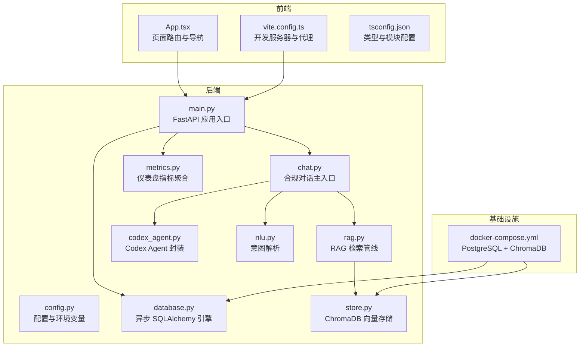
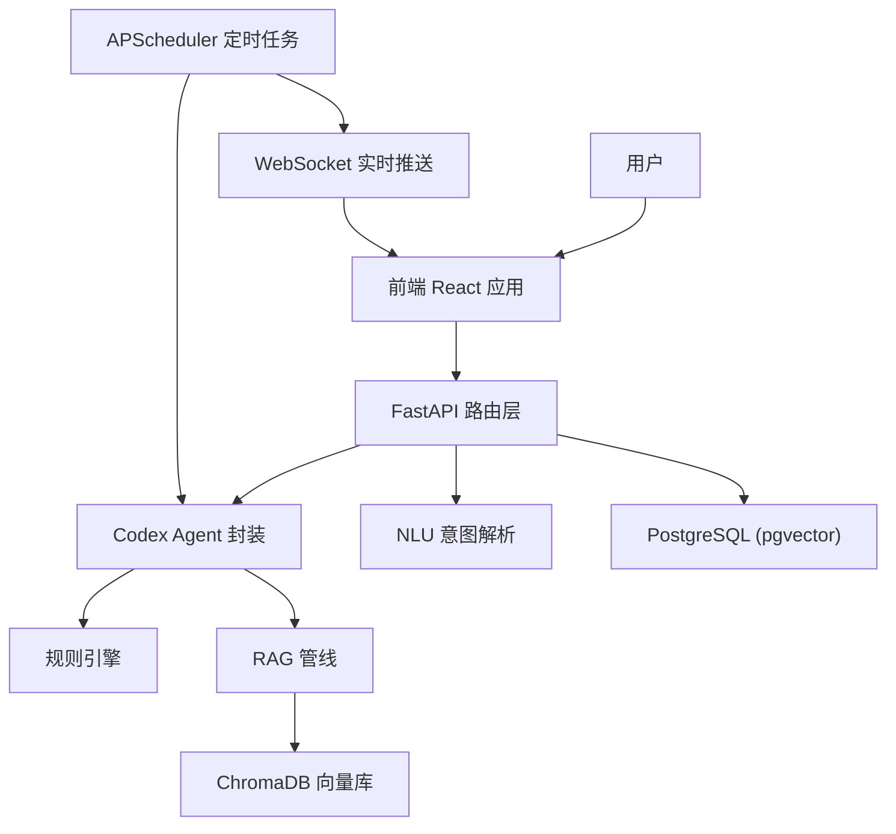
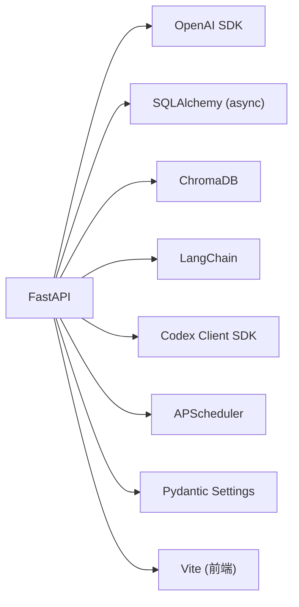

# 技术栈选型

<cite>
**本文引用的文件**
- [requirements.txt](file://backend/requirements.txt)
- [main.py](file://backend/app/main.py)
- [config.py](file://backend/app/config.py)
- [database.py](file://backend/app/models/database.py)
- [store.py](file://backend/app/knowledge/store.py)
- [rag.py](file://backend/app/core/rag.py)
- [codex_agent.py](file://backend/app/services/codex_agent.py)
- [chat.py](file://backend/app/api/chat.py)
- [nlu.py](file://backend/app/core/nlu.py)
- [docker-compose.yml](file://docker-compose.yml)
- [package.json](file://frontend/package.json)
- [vite.config.ts](file://frontend/vite.config.ts)
- [App.tsx](file://frontend/src/App.tsx)
- [tsconfig.json](file://frontend/tsconfig.json)
- [README.md](file://README.md)
- [metrics.py](file://backend/app/core/metrics.py)
</cite>

## 目录
1. [引言](#引言)
2. [项目结构](#项目结构)
3. [核心组件](#核心组件)
4. [架构总览](#架构总览)
5. [详细组件分析](#详细组件分析)
6. [依赖分析](#依赖分析)
7. [性能考量](#性能考量)
8. [故障排查指南](#故障排查指南)
9. [结论](#结论)
10. [附录](#附录)

## 引言
本文件面向“避风港”项目，系统化阐述技术栈选型与架构设计，重点包括：
- 后端技术栈：FastAPI、LangChain、OpenAI、SQLAlchemy、ChromaDB 的选择理由与优势
- 前端技术栈：React、TypeScript、Vite 的技术决策
- 数据库选型：PostgreSQL 与 ChromaDB 的组合策略
- 容器化与部署：Docker、Docker Compose 的选择原因
- 技术栈对比分析与替代方案考虑
- 技术选型对系统性能、可维护性、扩展性的综合影响

## 项目结构
项目采用前后端分离架构，后端以 FastAPI 为核心，结合 LangChain/OpenAI、ChromaDB 向量检索、SQLAlchemy 异步 ORM、Codex Agent SDK，以及分层存储与调度器；前端以 React + TypeScript + Vite 构建，通过代理访问后端 API，并通过 WebSocket 实时接收风险预警。

图表来源
- [main.py:1-76](file://backend/app/main.py#L1-L76)
- [config.py:1-75](file://backend/app/config.py#L1-L75)
- [database.py:1-15](file://backend/app/models/database.py#L1-L15)
- [store.py:1-227](file://backend/app/knowledge/store.py#L1-L227)
- [rag.py:1-59](file://backend/app/core/rag.py#L1-L59)
- [codex_agent.py:1-372](file://backend/app/services/codex_agent.py#L1-L372)
- [chat.py:1-541](file://backend/app/api/chat.py#L1-L541)
- [nlu.py:1-99](file://backend/app/core/nlu.py#L1-L99)
- [metrics.py:1-175](file://backend/app/core/metrics.py#L1-L175)
- [docker-compose.yml:1-31](file://docker-compose.yml#L1-L31)

章节来源
- [README.md:92-200](file://README.md#L92-L200)

## 核心组件
- 后端框架与路由：FastAPI 提供高性能 ASGI 服务、自动 OpenAPI 文档、CORS 中间件与生命周期钩子，统一挂载各业务路由与 WebSocket 端点。
- 数据库与 ORM：SQLAlchemy 异步引擎连接 PostgreSQL（pgvector 扩展），支持异步会话与未来扩展。
- 向量检索：ChromaDB 本地持久化向量库，按市场维度拆分 collection，支持懒加载嵌入函数与多集合查询。
- 大模型与检索增强：OpenAI SDK 与 LangChain 生态（通过 requirements 体现）配合 RAG 管线，实现结构化合规数据与法规上下文融合。
- Agent 与工具：Codex Agent SDK 封装，提供 run_task/run_chat/stream，支持 MCP 工具与 Skills，具备降级路径（NLU → 规则引擎 → RAG）。
- 前端：React + TypeScript + Vite，开发服务器通过代理转发 /api 请求至后端，使用 WebSocket 接收实时预警。

章节来源
- [main.py:1-76](file://backend/app/main.py#L1-L76)
- [config.py:1-75](file://backend/app/config.py#L1-L75)
- [database.py:1-15](file://backend/app/models/database.py#L1-L15)
- [store.py:1-227](file://backend/app/knowledge/store.py#L1-L227)
- [rag.py:1-59](file://backend/app/core/rag.py#L1-L59)
- [codex_agent.py:1-372](file://backend/app/services/codex_agent.py#L1-L372)
- [chat.py:1-541](file://backend/app/api/chat.py#L1-L541)
- [nlu.py:1-99](file://backend/app/core/nlu.py#L1-L99)
- [docker-compose.yml:1-31](file://docker-compose.yml#L1-L31)
- [package.json:1-22](file://frontend/package.json#L1-L22)
- [vite.config.ts:1-15](file://frontend/vite.config.ts#L1-L15)
- [App.tsx:1-75](file://frontend/src/App.tsx#L1-L75)

## 架构总览
后端采用“对话主引擎 + 规则引擎 + RAG + 市场监控”的解耦架构。Codex Agent 作为主交互引擎，负责多轮会话、工具调用与联网搜索；规则引擎提供确定性合规数据；RAG 从 ChromaDB 检索法规上下文；市场监控通过 Codex 定时扫描并推送预警；前端通过 WebSocket 实时接收风险提醒。

图表来源
- [chat.py:1-541](file://backend/app/api/chat.py#L1-L541)
- [codex_agent.py:1-372](file://backend/app/services/codex_agent.py#L1-L372)
- [nlu.py:1-99](file://backend/app/core/nlu.py#L1-L99)
- [rag.py:1-59](file://backend/app/core/rag.py#L1-L59)
- [store.py:1-227](file://backend/app/knowledge/store.py#L1-L227)
- [database.py:1-15](file://backend/app/models/database.py#L1-L15)
- [docker-compose.yml:1-31](file://docker-compose.yml#L1-L31)

## 详细组件分析

### 后端技术栈选型与优势

- FastAPI
  - 优势：高性能 ASGI 框架、自动 OpenAPI 文档、Pydantic 数据校验、CORS 中间件、生命周期钩子便于初始化与资源清理。
  - 选型理由：满足高并发 API 场景，简化认证、路由与 WebSocket 集成。
  章节来源
  - [main.py:1-76](file://backend/app/main.py#L1-L76)

- LangChain 与 OpenAI
  - 优势：统一的 LLM 工作流抽象、结构化输出、Prompt 管理与热加载、与第三方工具集成。
  - 选型理由：结合 Codex Agent 与 RAG 管线，实现意图解析、合规规则与法规检索的协同。
  章节来源
  - [requirements.txt:8-10](file://backend/requirements.txt#L8-L10)
  - [nlu.py:1-99](file://backend/app/core/nlu.py#L1-L99)
  - [chat.py:1-541](file://backend/app/api/chat.py#L1-L541)

- SQLAlchemy（异步）
  - 优势：异步 I/O、类型安全、与 Pydantic schema 协同，便于演进为生产级 ORM。
  - 选型理由：支撑用户、会话、Agent/模型配置等数据持久化，为未来扩展打基础。
  章节来源
  - [database.py:1-15](file://backend/app/models/database.py#L1-L15)
  - [config.py:17-18](file://backend/app/config.py#L17-L18)

- ChromaDB
  - 优势：本地持久化、多集合、懒加载嵌入函数、支持 cosine 距离、查询结果包含元数据。
  - 选型理由：按市场维度拆分 collection，支持中文查询与降级策略，保障主流程不被向量库异常阻断。
  章节来源
  - [requirements.txt](file://backend/requirements.txt#L7)
  - [store.py:1-227](file://backend/app/knowledge/store.py#L1-L227)
  - [rag.py:1-59](file://backend/app/core/rag.py#L1-L59)

- Codex Agent SDK
  - 优势：统一 run_task/run_chat/stream 接口、持久化 Thread、MCP 工具与 Skills、结构化结果解析。
  - 选型理由：提供复杂推理、联网搜索与多步分析能力，支持降级路径，提升鲁棒性。
  章节来源
  - [requirements.txt](file://backend/requirements.txt#L21)
  - [codex_agent.py:1-372](file://backend/app/services/codex_agent.py#L1-L372)
  - [chat.py:1-541](file://backend/app/api/chat.py#L1-L541)

### 前端技术栈选型与优势

- React + TypeScript
  - 优势：强类型约束、组件化开发、生态成熟、可维护性强。
  - 选型理由：支撑多页面路由、会话管理、实时推送与可视化面板。
  章节来源
  - [package.json:11-21](file://frontend/package.json#L11-L21)
  - [App.tsx:1-75](file://frontend/src/App.tsx#L1-L75)
  - [tsconfig.json:1-20](file://frontend/tsconfig.json#L1-L20)

- Vite
  - 优势：快速冷启动、热更新、零配置开箱即用、代理转发 /api。
  - 选型理由：开发体验优秀，与后端联调便捷。
  章节来源
  - [vite.config.ts:1-15](file://frontend/vite.config.ts#L1-L15)

### 数据库选型：PostgreSQL 与 ChromaDB 的组合策略

- PostgreSQL（pgvector）
  - 作用：结构化数据存储（用户、会话、配置、事件链等），支持向量扩展。
  - 优势：事务一致性、成熟生态、与 SQLAlchemy 异步 ORM 协同。
  章节来源
  - [docker-compose.yml:4-18](file://docker-compose.yml#L4-L18)
  - [config.py:17-18](file://backend/app/config.py#L17-L18)
  - [database.py:1-15](file://backend/app/models/database.py#L1-L15)

- ChromaDB
  - 作用：合规法规知识的向量检索，按市场维度分集合，支持懒加载嵌入函数。
  - 优势：本地持久化、查询结果包含元数据、降级策略保证主流程可用。
  章节来源
  - [store.py:1-227](file://backend/app/knowledge/store.py#L1-L227)
  - [rag.py:1-59](file://backend/app/core/rag.py#L1-L59)

- 组合策略
  - 结构化数据（用户、会话、配置）与非结构化知识（法规）分离存储，降低耦合，提升可维护性与扩展性。
  - ChromaDB 作为检索增强的“知识库”，与规则引擎输出的结构化数据互补，形成“确定性 + 上下文”的双重保障。

章节来源
- [docker-compose.yml:1-31](file://docker-compose.yml#L1-L31)
- [config.py:17-46](file://backend/app/config.py#L17-L46)
- [store.py:1-227](file://backend/app/knowledge/store.py#L1-L227)
- [rag.py:1-59](file://backend/app/core/rag.py#L1-L59)

### 容器化与部署：Docker 与 Docker Compose

- Docker Compose
  - 作用：一键拉起 PostgreSQL（pgvector）与 ChromaDB 容器，暴露必要端口，挂载持久化卷。
  - 优势：环境一致、易于本地开发与演示部署。
  章节来源
  - [docker-compose.yml:1-31](file://docker-compose.yml#L1-L31)

- 部署建议
  - 后端：使用 Uvicorn/Gunicorn 运行 FastAPI，结合 Nginx 反向代理与 HTTPS。
  - 数据库：生产环境使用托管 PostgreSQL（开启备份与只读副本），并启用连接池。
  - 向量库：ChromaDB 使用持久化卷，定期快照；必要时可迁移到云原生向量服务。
  - 前端：构建产物部署于静态 CDN，配置缓存与跨域。

章节来源
- [docker-compose.yml:1-31](file://docker-compose.yml#L1-L31)
- [README.md:33-78](file://README.md#L33-L78)

### 技术栈对比分析与替代方案考虑

- 后端框架
  - FastAPI vs Django：FastAPI 更适合 API 驱动、文档自动生成与高性能场景；Django 更适合传统 Web 应用与后台管理。
  - 选型依据：本项目以 API 为中心，强调可观测性与可测试性，FastAPI 更契合。

- 向量库
  - ChromaDB vs Weaviate/Pinecone：ChromaDB 本地易部署、成本低；Weaviate/Pinecone 提供更强的云原生能力与运维支持。
  - 选型依据：本地开发与演示阶段优先，生产可按需迁移。

- 大模型与检索
  - OpenAI SDK + LangChain vs LlamaIndex：LangChain 提供更丰富的链式组合与工具集成；LlamaIndex 更专注检索增强。
  - 选型依据：结合 Codex Agent 与 MCP 工具，LangChain 生态适配度更高。

- 前端
  - React + Vite vs Next.js：Vite 更轻量、开发体验佳；Next.js 提供 SSR/ISR 等高级特性。
  - 选型依据：本项目为 SPA + API 驱动，Vite 已满足需求。

章节来源
- [requirements.txt:1-27](file://backend/requirements.txt#L1-L27)
- [README.md:282-296](file://README.md#L282-L296)

## 依赖分析

图表来源
- [requirements.txt:1-27](file://backend/requirements.txt#L1-L27)
- [main.py:1-76](file://backend/app/main.py#L1-L76)

章节来源
- [requirements.txt:1-27](file://backend/requirements.txt#L1-L27)
- [main.py:1-76](file://backend/app/main.py#L1-L76)

## 性能考量
- 后端
  - 异步 I/O：SQLAlchemy 异步引擎与 FastAPI 协同，减少阻塞，提升吞吐。
  - 向量检索降级：ChromaDB 查询异常时返回空结果，避免阻塞主流程。
  - 大模型调用：通过结构化输出与 Prompt 热加载，减少重复计算与网络往返。
- 前端
  - Vite 热更新与按需打包，缩短开发周期；生产构建开启压缩与 Tree-shaking。
- 数据库
  - PostgreSQL + pgvector 适合中小规模向量与结构化混合场景；建议开启连接池与索引优化。
- 容器化
  - Docker Compose 便于本地压测与快速迭代；生产建议使用 Kubernetes 与 HPA。

章节来源
- [store.py:163-173](file://backend/app/knowledge/store.py#L163-L173)
- [nlu.py:88-96](file://backend/app/core/nlu.py#L88-L96)
- [database.py:1-15](file://backend/app/models/database.py#L1-L15)
- [docker-compose.yml:1-31](file://docker-compose.yml#L1-L31)

## 故障排查指南
- 向量检索失败
  - 现象：RAG 返回空结果或警告日志。
  - 排查：确认 ChromaDB 容器健康、持久化目录存在、嵌入函数已懒加载。
  章节来源
  - [store.py:43-51](file://backend/app/knowledge/store.py#L43-L51)
  - [store.py:163-173](file://backend/app/knowledge/store.py#L163-L173)

- 大模型 API Key 未配置
  - 现象：通用对话不可用或提示配置。
  - 排查：检查配置项与 .env 文件，确认 active_llm_api_key 与 base_url。
  章节来源
  - [config.py:21-37](file://backend/app/config.py#L21-L37)
  - [chat.py:381-413](file://backend/app/api/chat.py#L381-L413)

- 数据库连接失败
  - 现象：应用启动时报连接错误。
  - 排查：确认 PostgreSQL 容器运行、端口映射、凭据与数据库名。
  章节来源
  - [docker-compose.yml:4-18](file://docker-compose.yml#L4-L18)
  - [config.py:17-18](file://backend/app/config.py#L17-L18)

- WebSocket 未收到推送
  - 现象：前端风险面板无更新。
  - 排查：确认后端 WebSocket 端点、用户 ID 参数、前端连接地址与代理配置。
  章节来源
  - [main.py:40-56](file://backend/app/main.py#L40-L56)
  - [vite.config.ts:8-13](file://frontend/vite.config.ts#L8-L13)

## 结论
本项目采用“FastAPI + LangChain + OpenAI + SQLAlchemy + ChromaDB + Codex Agent SDK”的技术栈，围绕合规问答与风险监控构建了高内聚、低耦合的系统。该选型在性能、可维护性与扩展性之间取得平衡：后端以 API 为中心，前端以 SPA 与 WebSocket 实时推送为体验核心；数据库与向量库分离，既满足结构化数据一致性，又提供灵活的知识检索能力。容器化与本地编排进一步降低了部署门槛。后续可在生产环境中引入云原生向量服务、Kubernetes 编排与更完善的监控告警体系，持续提升稳定性与可扩展性。

## 附录
- API 端点概览与认证策略见 README 的“API 端点一览”与“技术栈”章节。
- 项目整体结构与模块职责见 README 的“项目结构”。

章节来源
- [README.md:222-296](file://README.md#L222-L296)