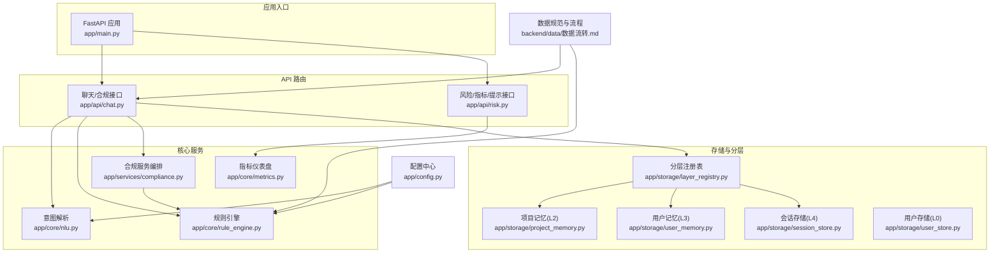
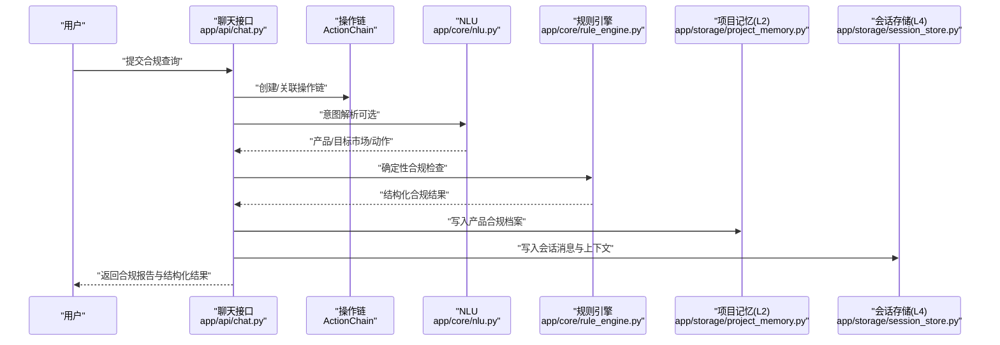
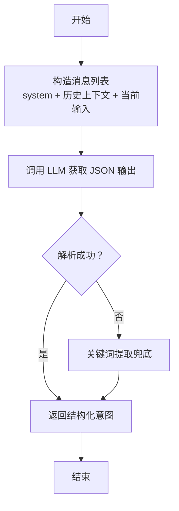
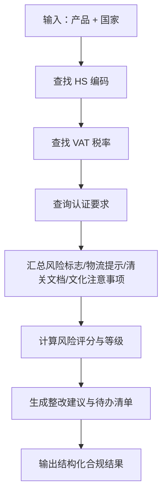
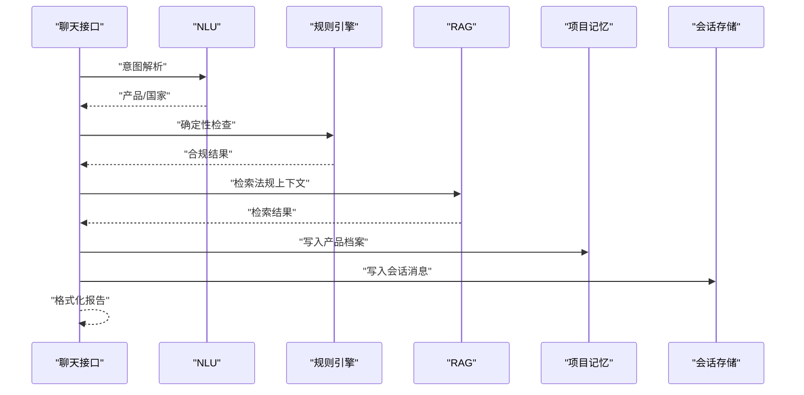
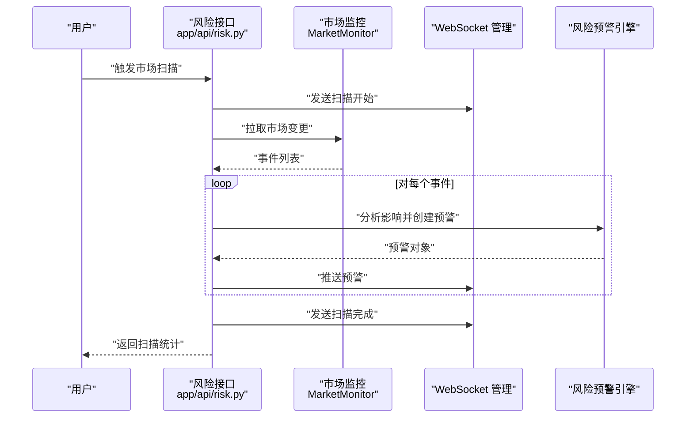
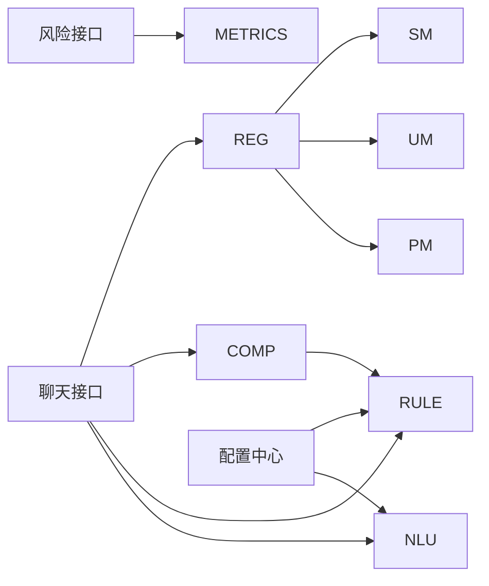

# 数据流设计

<cite>
**本文引用的文件**
- [backend/app/main.py](file://backend/app/main.py)
- [backend/app/config.py](file://backend/app/config.py)
- [backend/data/数据流转.md](file://backend/data/数据流转.md)
- [backend/app/models/schemas.py](file://backend/app/models/schemas.py)
- [backend/app/api/risk.py](file://backend/app/api/risk.py)
- [backend/app/core/rule_engine.py](file://backend/app/core/rule_engine.py)
- [backend/app/core/nlu.py](file://backend/app/core/nlu.py)
- [backend/app/services/compliance.py](file://backend/app/services/compliance.py)
- [backend/app/storage/layer_registry.py](file://backend/app/storage/layer_registry.py)
- [backend/app/api/chat.py](file://backend/app/api/chat.py)
- [backend/app/core/metrics.py](file://backend/app/core/metrics.py)
- [backend/app/storage/project_memory.py](file://backend/app/storage/project_memory.py)
- [backend/app/storage/user_memory.py](file://backend/app/storage/user_memory.py)
- [backend/app/storage/session_store.py](file://backend/app/storage/session_store.py)
- [backend/app/storage/user_store.py](file://backend/app/storage/user_store.py)
</cite>

## 目录
1. [引言](#引言)
2. [项目结构](#项目结构)
3. [核心组件](#核心组件)
4. [架构总览](#架构总览)
5. [详细组件分析](#详细组件分析)
6. [依赖分析](#依赖分析)
7. [性能考虑](#性能考虑)
8. [故障排查指南](#故障排查指南)
9. [结论](#结论)
10. [附录](#附录)

## 引言
本文件面向“避风港”跨境合规智能体项目，系统化梳理从用户输入到合规报告输出的完整数据流设计。重点包括：
- 数据在六层存储（L0-L5）之间的流转路径与转换过程
- 数据格式标准化与验证机制
- 异步处理与并发控制策略
- 缓存策略与性能优化措施
- 数据流图与时序图
- 错误处理与异常恢复机制
- 数据安全与隐私保护措施

## 项目结构
后端采用 FastAPI 应用，API 路由集中于 app/api，核心业务逻辑位于 app/core，服务编排位于 app/services，数据存储与分层注册表位于 app/storage，配置与模型定义位于 app/config 与 app/models。

图表来源
- [backend/app/main.py:1-76](file://backend/app/main.py#L1-L76)
- [backend/app/api/chat.py:1-541](file://backend/app/api/chat.py#L1-L541)
- [backend/app/api/risk.py:1-154](file://backend/app/api/risk.py#L1-L154)
- [backend/app/core/nlu.py:1-99](file://backend/app/core/nlu.py#L1-L99)
- [backend/app/core/rule_engine.py:1-247](file://backend/app/core/rule_engine.py#L1-L247)
- [backend/app/services/compliance.py:1-35](file://backend/app/services/compliance.py#L1-L35)
- [backend/app/storage/layer_registry.py:1-45](file://backend/app/storage/layer_registry.py#L1-L45)
- [backend/app/storage/project_memory.py:1-141](file://backend/app/storage/project_memory.py#L1-L141)
- [backend/app/storage/user_memory.py:1-84](file://backend/app/storage/user_memory.py#L1-L84)
- [backend/app/storage/session_store.py:1-251](file://backend/app/storage/session_store.py#L1-L251)
- [backend/app/storage/user_store.py:1-133](file://backend/app/storage/user_store.py#L1-L133)
- [backend/app/config.py:1-75](file://backend/app/config.py#L1-L75)
- [backend/data/数据流转.md:1-361](file://backend/data/数据流转.md#L1-L361)

章节来源
- [backend/app/main.py:1-76](file://backend/app/main.py#L1-L76)
- [backend/app/config.py:1-75](file://backend/app/config.py#L1-L75)
- [backend/data/数据流转.md:1-361](file://backend/data/数据流转.md#L1-L361)

## 核心组件
- 应用入口与中间件：注册 CORS、路由、WebSocket、生命周期钩子，提供健康检查端点。
- API 路由：
  - 聊天/合规接口：主交互端点，支持 Codex 驱动与降级链路（NLU→规则引擎→RAG），并记录操作链。
  - 风险/指标/提示接口：市场扫描、预警列表、未读数、仪表盘、Prompt 热加载。
- 核心服务：
  - NLU：基于 LLM 的意图解析，支持兜底 Prompt 与上下文注入。
  - 规则引擎：基于 L0 原始数据的确定性合规检查，输出结构化结果。
  - 合规服务编排：串联 NLU 与规则引擎，形成端到端流水线。
  - 指标仪表盘：聚合用户级健康度、风险分布、趋势等。
- 存储与分层：
  - 分层注册表：统一访问 L0-L5 存储层。
  - 项目记忆（L2）：产品合规档案与历史记录。
  - 用户记忆（L3）：用户画像与偏好。
  - 会话存储（L4）：会话与消息持久化。
  - 用户存储（L0）：用户账户与权限。
- 配置中心：统一管理 LLM、数据库、调度器、Shopify、JWT 等配置。

章节来源
- [backend/app/api/chat.py:1-541](file://backend/app/api/chat.py#L1-L541)
- [backend/app/api/risk.py:1-154](file://backend/app/api/risk.py#L1-L154)
- [backend/app/core/nlu.py:1-99](file://backend/app/core/nlu.py#L1-L99)
- [backend/app/core/rule_engine.py:1-247](file://backend/app/core/rule_engine.py#L1-L247)
- [backend/app/services/compliance.py:1-35](file://backend/app/services/compliance.py#L1-L35)
- [backend/app/core/metrics.py:1-176](file://backend/app/core/metrics.py#L1-L176)
- [backend/app/storage/layer_registry.py:1-45](file://backend/app/storage/layer_registry.py#L1-L45)
- [backend/app/storage/project_memory.py:1-141](file://backend/app/storage/project_memory.py#L1-L141)
- [backend/app/storage/user_memory.py:1-84](file://backend/app/storage/user_memory.py#L1-L84)
- [backend/app/storage/session_store.py:1-251](file://backend/app/storage/session_store.py#L1-L251)
- [backend/app/storage/user_store.py:1-133](file://backend/app/storage/user_store.py#L1-L133)
- [backend/app/config.py:1-75](file://backend/app/config.py#L1-L75)

## 架构总览
下图展示从用户输入到合规报告输出的主数据流，以及风险监控与预警的异步数据流。

图表来源
- [backend/app/api/chat.py:228-541](file://backend/app/api/chat.py#L228-L541)
- [backend/app/core/nlu.py:59-99](file://backend/app/core/nlu.py#L59-L99)
- [backend/app/core/rule_engine.py:197-247](file://backend/app/core/rule_engine.py#L197-L247)
- [backend/app/storage/project_memory.py:36-87](file://backend/app/storage/project_memory.py#L36-L87)
- [backend/app/storage/session_store.py:186-217](file://backend/app/storage/session_store.py#L186-L217)

章节来源
- [backend/app/api/chat.py:1-541](file://backend/app/api/chat.py#L1-L541)
- [backend/app/core/nlu.py:1-99](file://backend/app/core/nlu.py#L1-L99)
- [backend/app/core/rule_engine.py:1-247](file://backend/app/core/rule_engine.py#L1-L247)
- [backend/app/storage/project_memory.py:1-141](file://backend/app/storage/project_memory.py#L1-L141)
- [backend/app/storage/session_store.py:1-251](file://backend/app/storage/session_store.py#L1-L251)

## 详细组件分析

### 数据层与数据格式标准化
- L0 原始数据层（Raw Data）：HS 编码、VAT 税率、认证矩阵、法规 Markdown。通过注册表统一读取，支持热加载与一次性缓存。
- L1 知识库层（ChromaDB）：按市场隔离的向量集合，检索失败具备降级策略。
- L2 项目记忆层（Project Memory）：产品合规档案，JSON 结构化，包含历史记录与最新检查。
- L3 用户记忆层（User Memory）：用户画像与偏好，JSON 结构化。
- L4 会话记忆层（Session Store）：SQLite 持久化，消息与会话表，支持多轮上下文。
- L5 事件链层（Event Chain）：系统事件与操作链，支持审计与回溯。
- Pydantic 模型：对请求/响应进行强类型校验，确保数据一致性与可预测性。

章节来源
- [backend/data/数据流转.md:42-266](file://backend/data/数据流转.md#L42-L266)
- [backend/app/storage/layer_registry.py:1-45](file://backend/app/storage/layer_registry.py#L1-L45)
- [backend/app/storage/project_memory.py:1-141](file://backend/app/storage/project_memory.py#L1-L141)
- [backend/app/storage/user_memory.py:1-84](file://backend/app/storage/user_memory.py#L1-L84)
- [backend/app/storage/session_store.py:1-251](file://backend/app/storage/session_store.py#L1-L251)
- [backend/app/models/schemas.py:1-264](file://backend/app/models/schemas.py#L1-L264)

### NLU 意图解析与实体抽取
- 通过系统 Prompt 与多轮上下文注入，将用户输入解析为结构化意图（产品、目标国家、动作、置信度）。
- 支持兜底 Prompt 与关键词提取，保证在 LLM 不可用时仍可工作。

图表来源
- [backend/app/core/nlu.py:59-99](file://backend/app/core/nlu.py#L59-L99)

章节来源
- [backend/app/core/nlu.py:1-99](file://backend/app/core/nlu.py#L1-L99)

### 规则引擎：确定性合规检查
- 读取 L0 原始数据（HS/VAT/认证），结合产品与国家，计算风险评分、风险等级、整改建议、清关材料与文化注意事项。
- 提供风险标志、物流提示、清关文档清单等，形成结构化结果。

图表来源
- [backend/app/core/rule_engine.py:197-247](file://backend/app/core/rule_engine.py#L197-L247)

章节来源
- [backend/app/core/rule_engine.py:1-247](file://backend/app/core/rule_engine.py#L1-L247)

### 合规服务编排与报告生成
- 编排 NLU 与规则引擎，支持降级路径（通用问题直连 LLM）。
- 将合规结果格式化为 Markdown 报告，附加 RAG 检索来源摘要。
- 记录操作链、会话消息与项目记忆，便于审计与回溯。

图表来源
- [backend/app/api/chat.py:228-541](file://backend/app/api/chat.py#L228-L541)
- [backend/app/services/compliance.py:11-35](file://backend/app/services/compliance.py#L11-L35)

章节来源
- [backend/app/api/chat.py:1-541](file://backend/app/api/chat.py#L1-L541)
- [backend/app/services/compliance.py:1-35](file://backend/app/services/compliance.py#L1-L35)

### 风险监控与预警（异步与并发）
- 市场扫描：Codex 联网搜索→事件分析→生成预警→实时推送/轮询。
- 并发控制：扫描任务通过调度器触发，前端通过 WebSocket 实时接收扫描状态与预警。
- 指标仪表盘：聚合用户级健康度、风险分布、趋势等，支持热加载 Prompt。

图表来源
- [backend/app/api/risk.py:63-127](file://backend/app/api/risk.py#L63-L127)

章节来源
- [backend/app/api/risk.py:1-154](file://backend/app/api/risk.py#L1-L154)
- [backend/app/core/metrics.py:1-176](file://backend/app/core/metrics.py#L1-L176)

### 数据格式标准化与验证机制
- 请求/响应模型：通过 Pydantic 模型定义字段、示例、约束（枚举、范围、必填），确保前后端契约一致。
- 存储格式：JSON 文件（L2/L3/L5）、SQLite 表（L4），统一编码与时间格式。
- 配置模型：Settings 使用 pydantic-settings，支持环境变量与默认值，提供活跃 LLM Key/Base URL 的派生属性。

章节来源
- [backend/app/models/schemas.py:1-264](file://backend/app/models/schemas.py#L1-L264)
- [backend/app/config.py:1-75](file://backend/app/config.py#L1-L75)
- [backend/app/storage/project_memory.py:36-87](file://backend/app/storage/project_memory.py#L36-L87)
- [backend/app/storage/session_store.py:37-63](file://backend/app/storage/session_store.py#L37-L63)

### 缓存策略与性能优化
- L0 原始数据：模块加载时一次性读入内存缓存，减少 IO。
- L1 知识库：ChromaDB 按市场分 collection，检索失败降级，避免阻塞主流程。
- L4 会话存储：SQLite 索引优化，消息与会话分离，支持高效查询。
- LLM 调用：MiMo 思维模式可关闭以降低延迟；Prompt 热加载避免重启。
- 指标聚合：只读聚合，避免写放大；趋势计算按日期聚合，减少扫描范围。

章节来源
- [backend/data/数据流转.md:42-116](file://backend/data/数据流转.md#L42-L116)
- [backend/app/storage/session_store.py:37-63](file://backend/app/storage/session_store.py#L37-L63)
- [backend/app/core/nlu.py:52-56](file://backend/app/core/nlu.py#L52-L56)
- [backend/app/core/metrics.py:146-160](file://backend/app/core/metrics.py#L146-L160)

### 错误处理与异常恢复
- 降级链路：Codex 失败自动切换至 NLU→规则引擎→RAG；LLM Key 缺失时返回引导提示。
- 存储失败容错：记忆层写入异常不阻断响应，保证用户体验。
- 操作链记录：每步操作均有状态与耗时，便于定位与回溯。
- WebSocket 推送：扫描异常通过 WebSocket 发送错误状态，前端可重试或轮询。

章节来源
- [backend/app/api/chat.py:250-264](file://backend/app/api/chat.py#L250-L264)
- [backend/app/api/chat.py:381-413](file://backend/app/api/chat.py#L381-L413)
- [backend/app/api/chat.py:184-203](file://backend/app/api/chat.py#L184-L203)
- [backend/app/api/risk.py:105-107](file://backend/app/api/risk.py#L105-L107)

### 数据安全与隐私保护
- 认证与授权：JWT 密钥与过期时间配置，可选携带 Token 的匿名兼容。
- 会话存储：SQLite 文件持久化，消息 JSON 字段存储合规结果与来源，便于审计。
- 用户隐私：用户画像与偏好仅在用户维度隔离，不跨用户泄露。
- 配置安全：敏感配置通过环境变量加载，生产环境需替换默认密钥。

章节来源
- [backend/app/config.py:65-67](file://backend/app/config.py#L65-L67)
- [backend/app/storage/session_store.py:186-217](file://backend/app/storage/session_store.py#L186-L217)
- [backend/app/storage/user_memory.py:31-51](file://backend/app/storage/user_memory.py#L31-L51)

## 依赖分析
- 组件耦合：API 路由依赖核心服务与存储层；核心服务依赖配置中心与分层注册表；存储层通过注册表解耦。
- 外部依赖：OpenAI 客户端、SQLite、ChromaDB（通过 RAG 模块间接使用）。
- 并发与异步：WebSocket 管理器负责实时推送；风险扫描通过调度器触发；会话存储使用 SQLite，线程安全开启。

图表来源
- [backend/app/api/chat.py:1-541](file://backend/app/api/chat.py#L1-L541)
- [backend/app/api/risk.py:1-154](file://backend/app/api/risk.py#L1-L154)
- [backend/app/core/nlu.py:1-99](file://backend/app/core/nlu.py#L1-L99)
- [backend/app/core/rule_engine.py:1-247](file://backend/app/core/rule_engine.py#L1-L247)
- [backend/app/services/compliance.py:1-35](file://backend/app/services/compliance.py#L1-L35)
- [backend/app/storage/layer_registry.py:1-45](file://backend/app/storage/layer_registry.py#L1-L45)
- [backend/app/config.py:1-75](file://backend/app/config.py#L1-L75)

章节来源
- [backend/app/api/chat.py:1-541](file://backend/app/api/chat.py#L1-L541)
- [backend/app/api/risk.py:1-154](file://backend/app/api/risk.py#L1-L154)
- [backend/app/core/nlu.py:1-99](file://backend/app/core/nlu.py#L1-L99)
- [backend/app/core/rule_engine.py:1-247](file://backend/app/core/rule_engine.py#L1-L247)
- [backend/app/services/compliance.py:1-35](file://backend/app/services/compliance.py#L1-L35)
- [backend/app/storage/layer_registry.py:1-45](file://backend/app/storage/layer_registry.py#L1-L45)
- [backend/app/config.py:1-75](file://backend/app/config.py#L1-L75)

## 性能考虑
- 低延迟：关闭 LLM 思维模式、关键词兜底、SQLite 索引、内存缓存 L0 数据。
- 可扩展：分层存储与注册表解耦，支持按需扩展 L1 知识库与 L5 事件链。
- 可观测：操作链记录每步耗时与状态，指标仪表盘提供健康度与趋势。
- 可靠性：检索失败降级、存储写入容错、WebSocket 心跳与断线重连。

## 故障排查指南
- 未配置 LLM Key：通用问题无法回答，合规查询降级为关键词提取；检查配置中心与 Prompt 热加载。
- Codex 失败：自动切换降级链路，检查网络与工具可用性；查看操作链降级节点。
- 存储异常：记忆层写入失败不影响响应；检查磁盘空间与权限。
- WebSocket 推送失败：前端可轮询 /risk/alerts；检查后端连接与消息格式。
- 指标异常：确认用户产品与预警文件存在，检查时间格式与编码。

章节来源
- [backend/app/api/chat.py:250-264](file://backend/app/api/chat.py#L250-L264)
- [backend/app/api/chat.py:381-413](file://backend/app/api/chat.py#L381-L413)
- [backend/app/api/risk.py:63-127](file://backend/app/api/risk.py#L63-L127)
- [backend/app/core/metrics.py:19-46](file://backend/app/core/metrics.py#L19-L46)

## 结论
本设计以“确定性规则 + LLM 增强”的双轨路径实现高吞吐、可审计、可扩展的合规数据流。通过分层存储与注册表解耦、操作链记录与指标聚合、Prompt 热加载与 WebSocket 实时推送，系统在保证数据安全与隐私的前提下，实现了从用户输入到合规报告输出的全链路可观测与可恢复。

## 附录
- 数据流图与时序图见“架构总览”与“详细组件分析”章节。
- 配置项与模型定义见“配置中心”与“数据格式标准化与验证机制”。