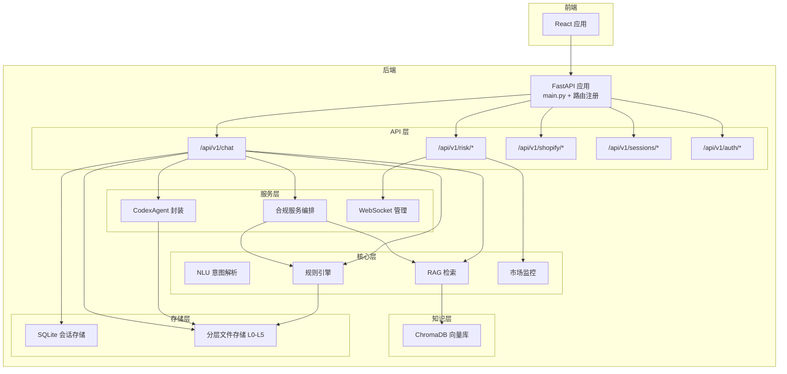
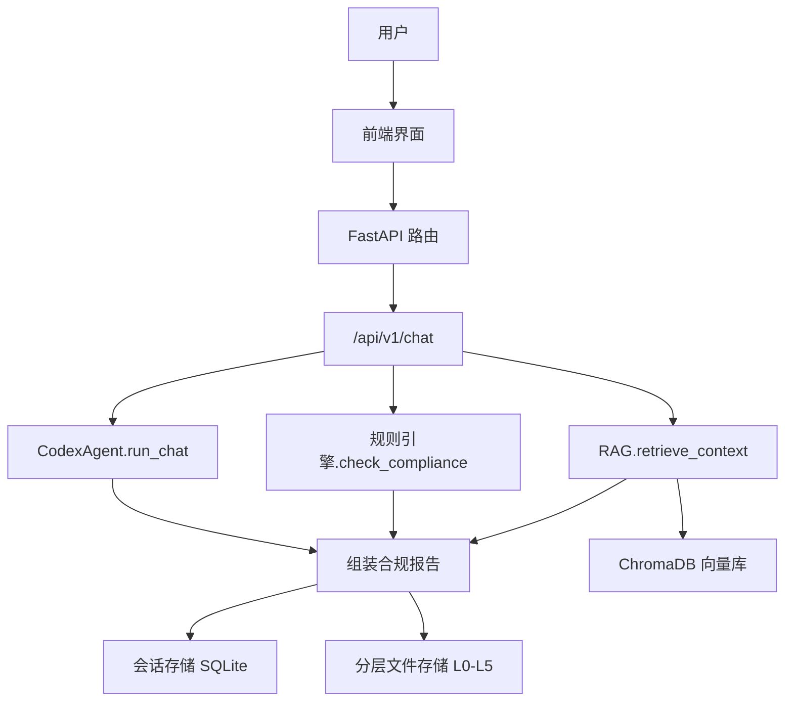
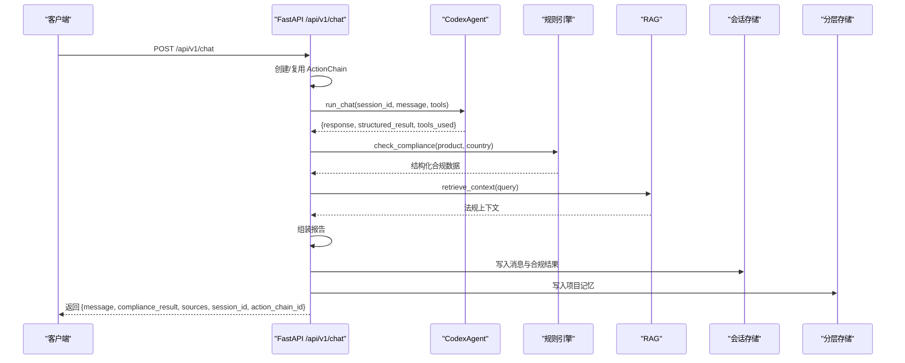
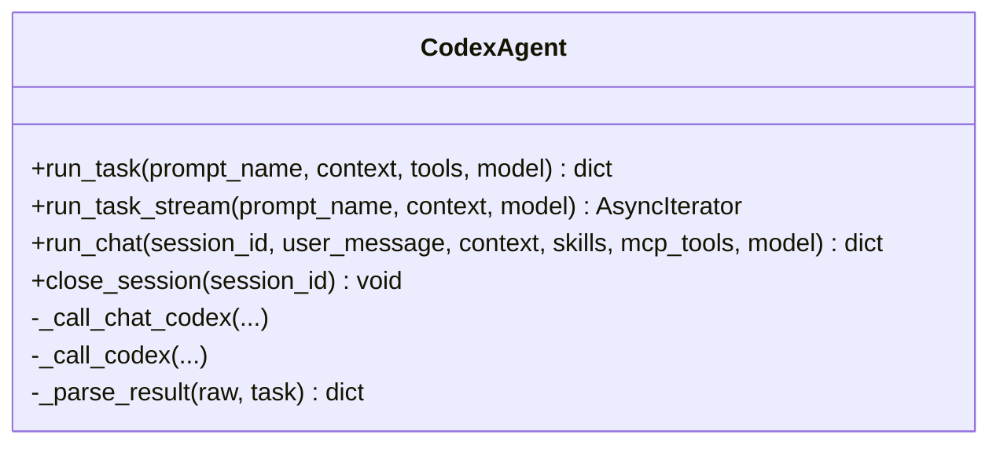
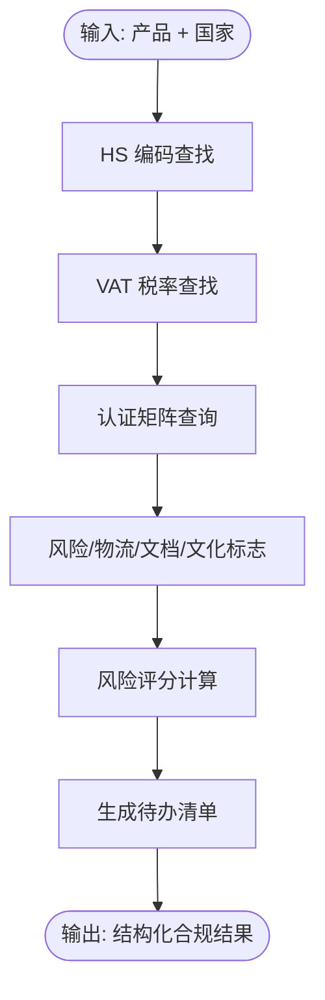
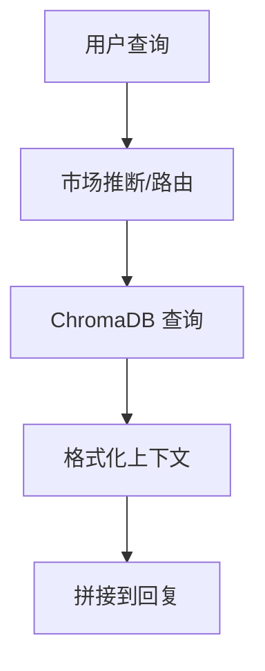
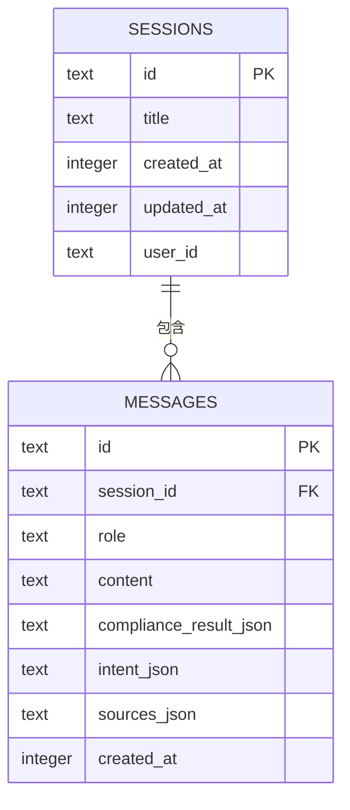
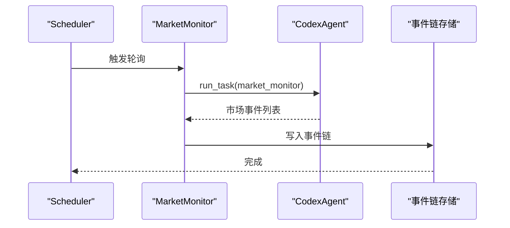
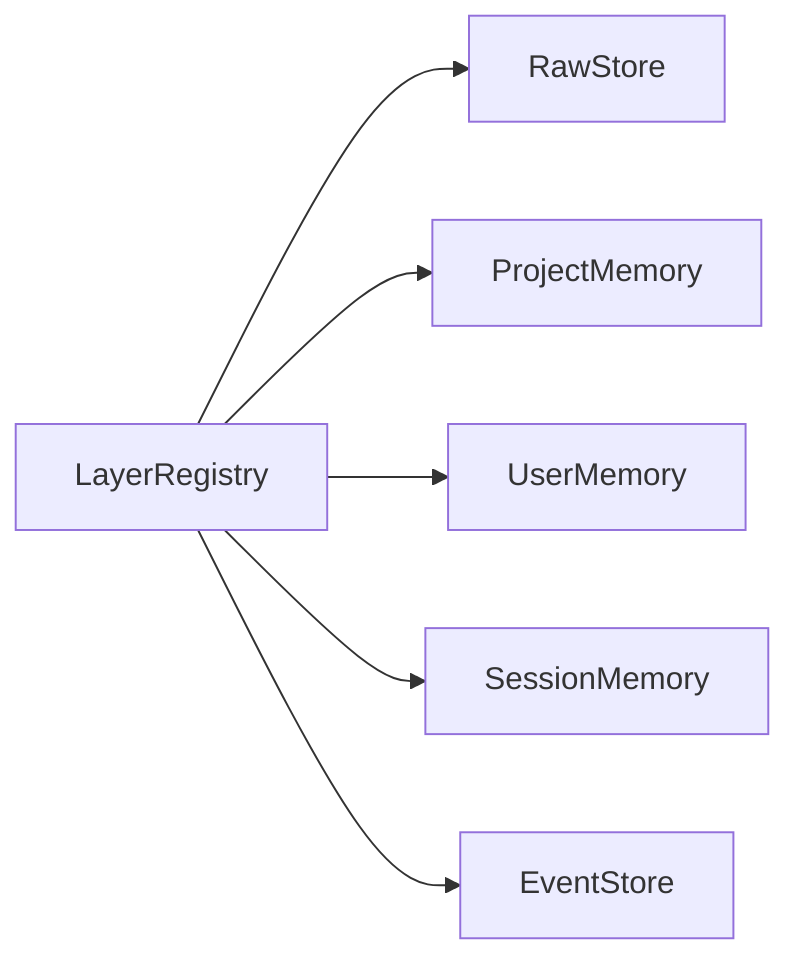
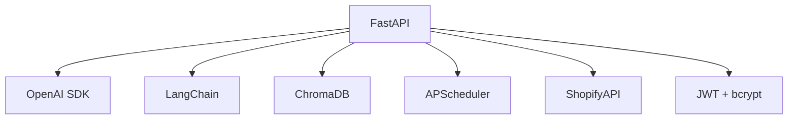

# 架构设计

<cite>
**本文引用的文件**
- [backend/app/main.py](file://backend/app/main.py)
- [backend/app/config.py](file://backend/app/config.py)
- [backend/requirements.txt](file://backend/requirements.txt)
- [README.md](file://README.md)
- [DEVELOPMENT_PLAN.md](file://DEVELOPMENT_PLAN.md)
- [backend/app/api/chat.py](file://backend/app/api/chat.py)
- [backend/app/core/rule_engine.py](file://backend/app/core/rule_engine.py)
- [backend/app/core/rag.py](file://backend/app/core/rag.py)
- [backend/app/services/codex_agent.py](file://backend/app/services/codex_agent.py)
- [backend/app/storage/session_store.py](file://backend/app/storage/session_store.py)
- [backend/app/knowledge/store.py](file://backend/app/knowledge/store.py)
- [backend/app/core/market_monitor.py](file://backend/app/core/market_monitor.py)
- [backend/app/services/compliance.py](file://backend/app/services/compliance.py)
- [backend/app/storage/layer_registry.py](file://backend/app/storage/layer_registry.py)
</cite>

## 目录
1. [引言](#引言)
2. [项目结构](#项目结构)
3. [核心组件](#核心组件)
4. [架构总览](#架构总览)
5. [详细组件分析](#详细组件分析)
6. [依赖分析](#依赖分析)
7. [性能考虑](#性能考虑)
8. [故障排查指南](#故障排查指南)
9. [结论](#结论)
10. [附录](#附录)

## 引言
避风港项目是一个面向中小出海企业的“跨境合规智能体”，以“对话即合规”为核心体验，提供从产品与目标市场的自然语言输入，到合规报告输出的完整自动化流程。系统采用分层架构与模块化设计，围绕 API 层、服务层、核心层、存储层进行组织，结合 Codex SDK 对话引擎、规则引擎、RAG 检索系统、会话管理系统以及市场监控与风险预警体系，形成可扩展、可观测、可回溯的合规自动化平台。

## 项目结构
后端采用 FastAPI 作为统一入口，按功能域划分为 API、核心、知识、服务、存储与模型等子包，配合前端 React 应用与 Docker 编排，形成前后端分离、容器化的工程化架构。

**图表来源**
- [backend/app/main.py:1-76](file://backend/app/main.py#L1-L76)
- [backend/app/api/chat.py:1-541](file://backend/app/api/chat.py#L1-L541)
- [backend/app/services/codex_agent.py:1-370](file://backend/app/services/codex_agent.py#L1-L370)
- [backend/app/core/rule_engine.py:1-247](file://backend/app/core/rule_engine.py#L1-L247)
- [backend/app/core/rag.py:1-59](file://backend/app/core/rag.py#L1-L59)
- [backend/app/knowledge/store.py:1-227](file://backend/app/knowledge/store.py#L1-L227)
- [backend/app/storage/session_store.py:1-251](file://backend/app/storage/session_store.py#L1-L251)
- [backend/app/core/market_monitor.py:1-156](file://backend/app/core/market_monitor.py#L1-L156)

**章节来源**
- [backend/app/main.py:1-76](file://backend/app/main.py#L1-L76)
- [README.md:92-200](file://README.md#L92-L200)

## 核心组件
- API 层：统一暴露 REST 与 WebSocket 接口，负责路由注册、CORS、健康检查与 WebSocket 实时推送。
- 服务层：封装 Codex Agent、合规服务编排、Prompt 模板渲染、Shopify 集成与 WebSocket 管理。
- 核心层：NLU 意图解析、规则引擎、RAG 检索、市场监控与风险预警。
- 存储层：SQLite 会话存储、分层文件系统（L0-L5）、ChromaDB 向量库。
- 知识层：多市场 collection 的向量检索与市场路由。

**章节来源**
- [backend/app/api/chat.py:1-541](file://backend/app/api/chat.py#L1-L541)
- [backend/app/services/codex_agent.py:1-370](file://backend/app/services/codex_agent.py#L1-L370)
- [backend/app/core/rule_engine.py:1-247](file://backend/app/core/rule_engine.py#L1-L247)
- [backend/app/core/rag.py:1-59](file://backend/app/core/rag.py#L1-L59)
- [backend/app/knowledge/store.py:1-227](file://backend/app/knowledge/store.py#L1-L227)
- [backend/app/storage/session_store.py:1-251](file://backend/app/storage/session_store.py#L1-L251)
- [backend/app/core/market_monitor.py:1-156](file://backend/app/core/market_monitor.py#L1-L156)
- [backend/app/services/compliance.py:1-35](file://backend/app/services/compliance.py#L1-L35)

## 架构总览
系统采用“主路径 Codex 引擎 + 降级路径 NLU/规则引擎/RAG”的双通道设计。Codex 负责复杂推理、联网搜索与工具调用，规则引擎负责高频确定性合规检查，RAG 补充法规上下文，会话管理保障多轮对话连续性，市场监控与风险预警通过定时任务与 WebSocket 实时推送联动。

**图表来源**
- [backend/app/api/chat.py:205-541](file://backend/app/api/chat.py#L205-L541)
- [backend/app/services/codex_agent.py:110-160](file://backend/app/services/codex_agent.py#L110-L160)
- [backend/app/core/rule_engine.py:197-247](file://backend/app/core/rule_engine.py#L197-L247)
- [backend/app/core/rag.py:10-59](file://backend/app/core/rag.py#L10-L59)
- [backend/app/storage/session_store.py:74-217](file://backend/app/storage/session_store.py#L74-L217)
- [backend/app/knowledge/store.py:127-192](file://backend/app/knowledge/store.py#L127-L192)

## 详细组件分析

### API 层与主对话流程
- 路由注册：统一在应用入口注册聊天、会话、风险、Shopify、认证、用户、模型配置与代理配置等路由。
- 主对话端点：/api/v1/chat 支持 Codex 主路径与 NLU/规则引擎/RAG 降级路径，自动创建 ActionChain 记录每步动作，支持会话 ID 恢复与回溯。
- 降级策略：当 Codex 不可用或异常时，自动切换至 NLU → 规则引擎 → RAG 管线，并支持通用问题直连 LLM。

**图表来源**
- [backend/app/api/chat.py:228-541](file://backend/app/api/chat.py#L228-L541)
- [backend/app/services/codex_agent.py:110-160](file://backend/app/services/codex_agent.py#L110-L160)
- [backend/app/core/rule_engine.py:197-247](file://backend/app/core/rule_engine.py#L197-L247)
- [backend/app/core/rag.py:10-59](file://backend/app/core/rag.py#L10-L59)
- [backend/app/storage/session_store.py:186-217](file://backend/app/storage/session_store.py#L186-L217)

**章节来源**
- [backend/app/main.py:21-30](file://backend/app/main.py#L21-L30)
- [backend/app/api/chat.py:205-541](file://backend/app/api/chat.py#L205-L541)

### Codex SDK 对话引擎
- 能力矩阵：联网搜索、CLI 智能、复杂推理、工具调用（MCP）、Skills、多轮会话（持久化 Thread）。
- 接口抽象：run_task（一次性任务，非持久化）、run_chat（多轮会话，支持 skills + MCP 工具 + 联网搜索）。
- 错误处理：导入失败或调用异常时返回 mock 响应，保证主流程不中断。
- 工具链路：通过 MCP 工具集（HS/VAT/认证/风险/RAG）与结构化输出解析，提升准确性与可解释性。

**图表来源**
- [backend/app/services/codex_agent.py:40-370](file://backend/app/services/codex_agent.py#L40-L370)

**章节来源**
- [backend/app/services/codex_agent.py:1-370](file://backend/app/services/codex_agent.py#L1-L370)

### 规则引擎（确定性合规）
- 数据来源：L0 原始数据（HS 编码、VAT 税率、认证矩阵、风险标志）。
- 功能范围：产品 HS 归类、目标国家 VAT 税率、认证要求、风险提示、物流与运输提示、清关材料建议、文化与标签注意事项、风险评分与整改建议、待办清单。
- 输出结构：标准化合规结果，便于前端展示与后续编排。

**图表来源**
- [backend/app/core/rule_engine.py:197-247](file://backend/app/core/rule_engine.py#L197-L247)

**章节来源**
- [backend/app/core/rule_engine.py:1-247](file://backend/app/core/rule_engine.py#L1-L247)

### RAG 检索系统
- 向量库：ChromaDB 多市场 collection（eu/us/jp/kr），本地嵌入模型（SentenceTransformer）。
- 检索流程：查询 → 多 collection 搜索 → 结果排序与格式化 → 作为上下文拼接到回复。
- 市场路由：根据查询自动推断市场，无结果时全库聚合检索。

**图表来源**
- [backend/app/core/rag.py:10-59](file://backend/app/core/rag.py#L10-L59)
- [backend/app/knowledge/store.py:127-192](file://backend/app/knowledge/store.py#L127-L192)

**章节来源**
- [backend/app/core/rag.py:1-59](file://backend/app/core/rag.py#L1-L59)
- [backend/app/knowledge/store.py:1-227](file://backend/app/knowledge/store.py#L1-L227)

### 会话管理系统
- 数据模型：sessions 与 messages 两张表，支持会话列表、详情、消息增删、最近消息读取。
- 多轮上下文：降级路径中将历史消息注入 LLM，提升通用问答质量。
- 持久化：SQLite 文件数据库，支持用户维度过滤与标题更新。

**图表来源**
- [backend/app/storage/session_store.py:37-70](file://backend/app/storage/session_store.py#L37-L70)
- [backend/app/storage/session_store.py:134-167](file://backend/app/storage/session_store.py#L134-L167)

**章节来源**
- [backend/app/storage/session_store.py:1-251](file://backend/app/storage/session_store.py#L1-L251)

### 市场监控与风险预警
- 市场监控：委托 Codex Agent 执行联网搜索与分析，解析市场事件并写入事件链。
- 影响分析：读取 L2 项目记忆中的产品列表，评估事件对用户的潜在影响。
- 风险预警：通过定时任务触发扫描，WebSocket 实时推送未读预警与状态。

**图表来源**
- [backend/app/core/market_monitor.py:35-54](file://backend/app/core/market_monitor.py#L35-L54)

**章节来源**
- [backend/app/core/market_monitor.py:1-156](file://backend/app/core/market_monitor.py#L1-L156)

### 分层存储与模块化设计
- 分层注册表：统一暴露 L0（原始数据）、L2（项目记忆）、L3（用户记忆）、L4（会话记忆）、L5（事件链）。
- 存储策略：L0 为只读静态数据，L2-L5 为可写持久化层，支持隔离与审计。
- 模块解耦：上层仅依赖注册表接口，新增存储层只需在此注册即可被上层使用。

**图表来源**
- [backend/app/storage/layer_registry.py:23-45](file://backend/app/storage/layer_registry.py#L23-L45)

**章节来源**
- [backend/app/storage/layer_registry.py:1-45](file://backend/app/storage/layer_registry.py#L1-L45)

## 依赖分析
- 后端框架：FastAPI + Uvicorn，提供高性能异步服务。
- 大模型与嵌入：OpenAI SDK、LangChain、OpenRouter（备用）、SentenceTransformer（本地嵌入）。
- 向量库：ChromaDB（持久化）。
- 调度与任务：APScheduler。
- 第三方集成：Shopify API（OAuth、产品同步、Webhook）。
- 认证与安全：JWT + bcrypt（Passlib）。

**图表来源**
- [backend/requirements.txt:1-27](file://backend/requirements.txt#L1-L27)
- [backend/app/config.py:5-75](file://backend/app/config.py#L5-L75)

**章节来源**
- [backend/requirements.txt:1-27](file://backend/requirements.txt#L1-L27)
- [backend/app/config.py:1-75](file://backend/app/config.py#L1-L75)

## 性能考虑
- 响应延迟优化：Codex 模型参数可配置，生产环境建议关闭思考模式以降低延迟；必要时对嵌入与检索结果做缓存与分页。
- 并发与资源：Codex 会话线程池与工具调用并发需受控，避免外部服务限流；RAG 检索 top_k 控制在合理范围。
- 存储性能：SQLite 适合中小规模会话，若并发高可考虑引入连接池或迁移至 Postgres；ChromaDB 查询需关注集合数量与元数据大小。
- 网络与稳定性：Codex 与外部 LLM 服务均存在网络抖动风险，应设置超时与重试策略，并在异常时快速降级。

## 故障排查指南
- Codex 不可用：检查配置开关与 SDK 安装；查看错误日志并确认 approval_policy 与模型参数；必要时启用降级路径。
- RAG 无结果：确认知识库是否初始化、ChromaDB 是否可用、市场路由是否正确；检查检索关键词与集合数量。
- 会话异常：确认 session_id 是否有效、SQLite 文件权限与磁盘空间；检查最近消息读取逻辑。
- 认证问题：核对 JWT 密钥与过期时间、用户是否存在且密码哈希正确；检查前端是否携带 Bearer Token。
- 市场监控失败：检查 Codex 任务模板与网络访问；查看事件链写入是否成功。

**章节来源**
- [backend/app/services/codex_agent.py:255-262](file://backend/app/services/codex_agent.py#L255-L262)
- [backend/app/core/rag.py:16-18](file://backend/app/core/rag.py#L16-L18)
- [backend/app/storage/session_store.py:170-183](file://backend/app/storage/session_store.py#L170-L183)
- [backend/app/api/chat.py:381-413](file://backend/app/api/chat.py#L381-L413)

## 结论
避风港项目通过清晰的分层架构与模块化设计，将复杂的合规流程拆解为可演进的子系统：Codex 对话引擎提供强推理与工具化能力，规则引擎承担高频确定性检查，RAG 补充法规上下文，会话管理保障用户体验，市场监控与风险预警实现持续治理闭环。技术栈选择兼顾易用性与可控性（FastAPI、LangChain、ChromaDB、Codex SDK），并在关键环节提供降级与可观测性保障，具备良好的可扩展性与工程落地价值。

## 附录
- 系统边界与集成点
  - 外部 LLM 服务：OpenRouter 或自定义 LLM，支持主/备两套配置。
  - 外部知识源：通过脚本初始化向量库，支持多市场 collection。
  - 外部平台集成：Shopify OAuth、产品同步与 Webhook。
  - 实时推送：WebSocket 端点用于风险预警与扫描更新推送。
- 可扩展性建议
  - 多 Agent 协同：在现有 ActionChain 与事件链基础上扩展多智能体编排。
  - 指标与可观测性：接入 Prometheus/Grafana，完善链路追踪与告警。
  - 存储迁移：从 SQLite 迁移至 Postgres，满足更高并发与可靠性需求。
  - 模型与提示：引入提示模板热加载与 A/B 测试能力，持续优化效果。

**章节来源**
- [README.md:282-296](file://README.md#L282-L296)
- [backend/app/main.py:38-56](file://backend/app/main.py#L38-L56)
- [backend/app/config.py:55-61](file://backend/app/config.py#L55-L61)