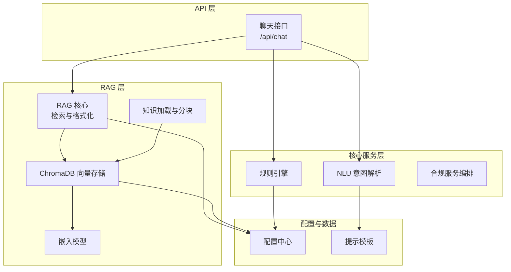
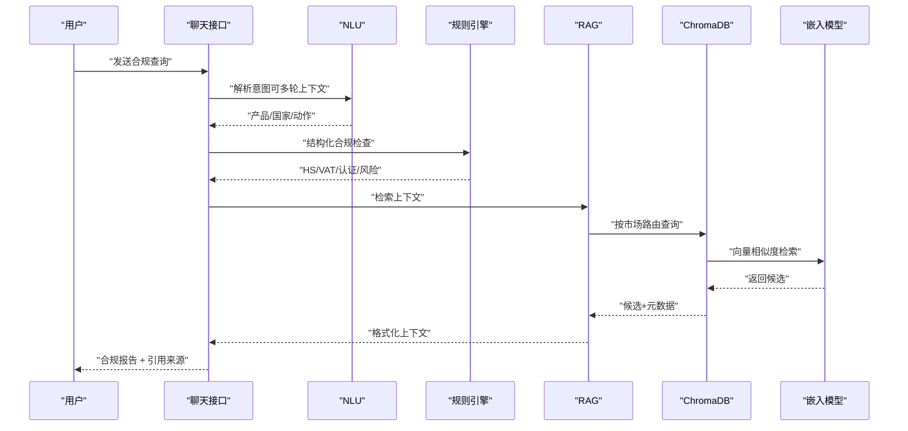
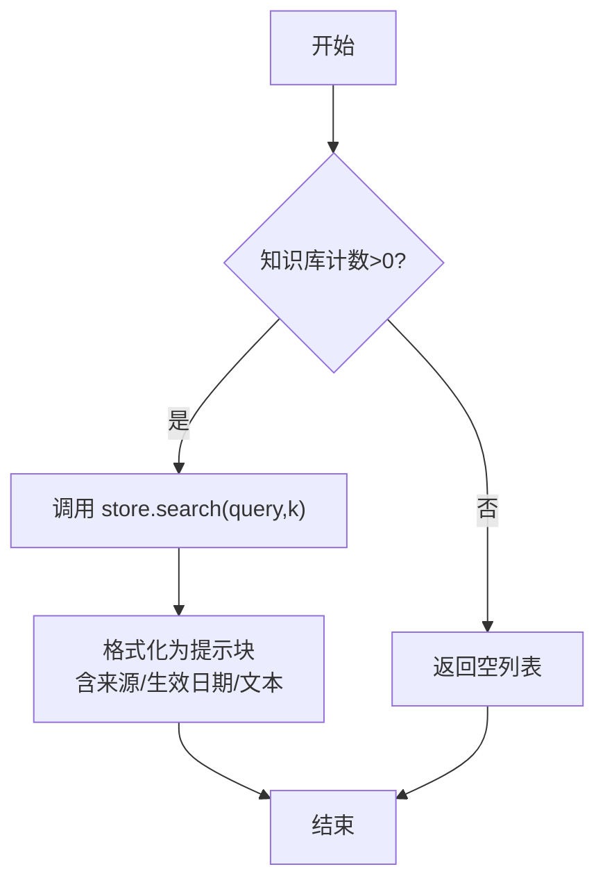
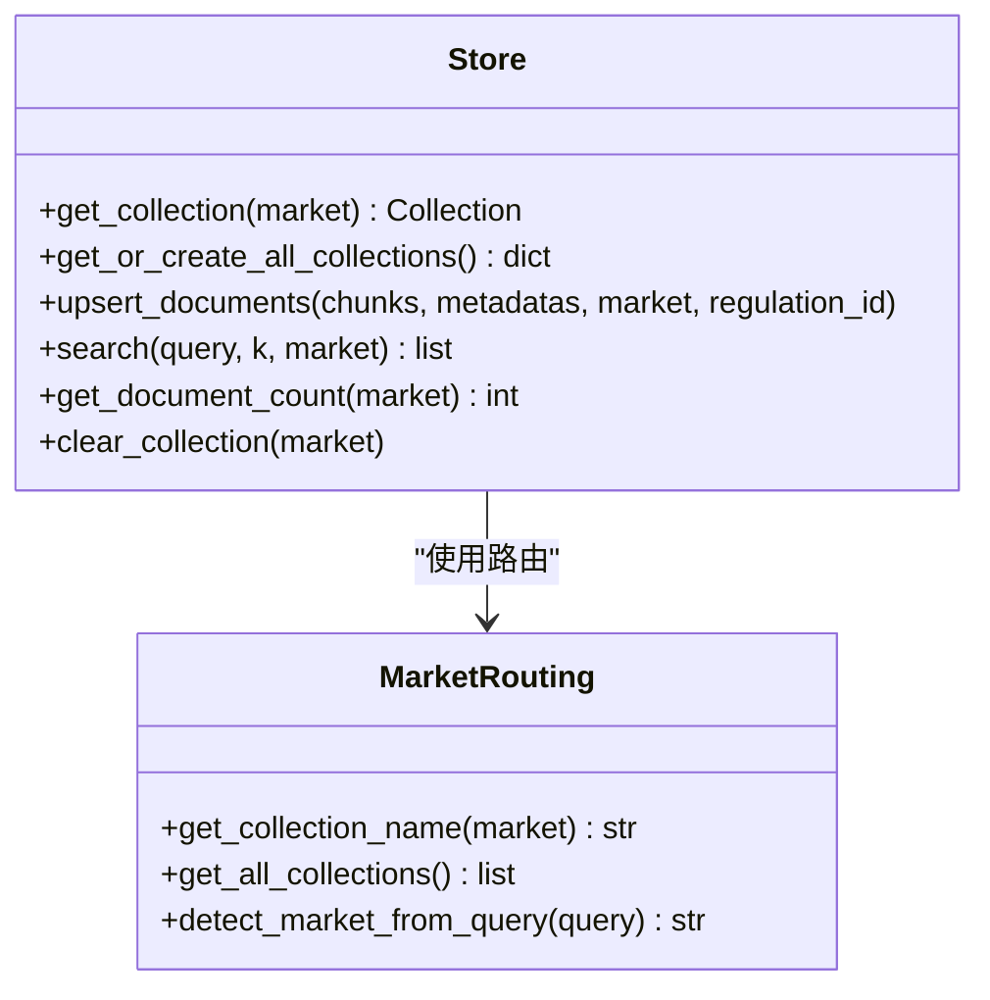
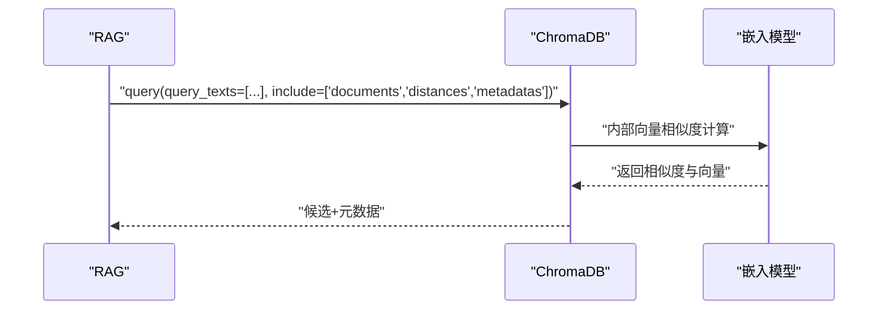
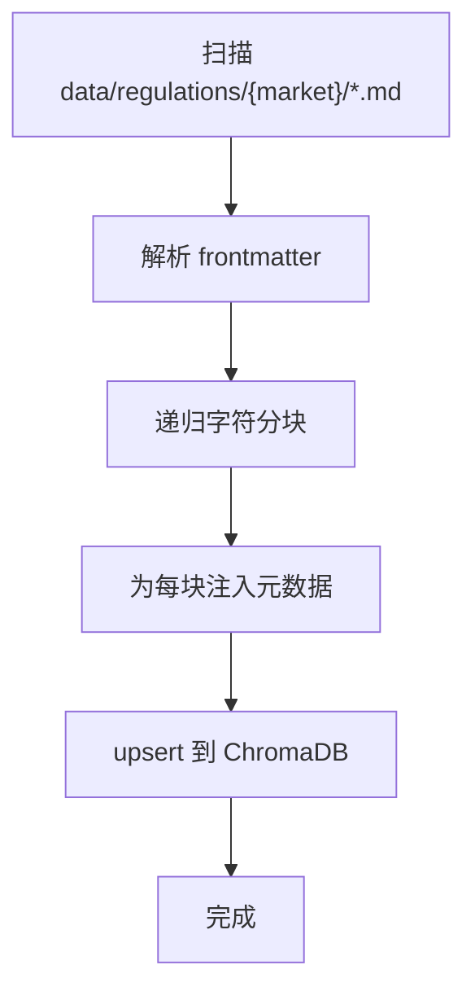
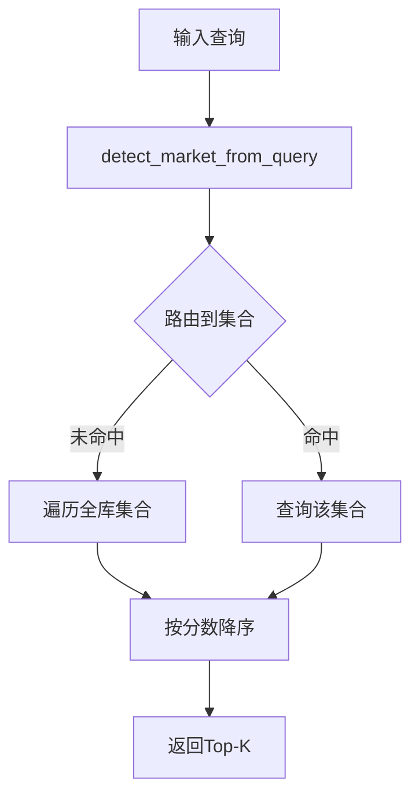
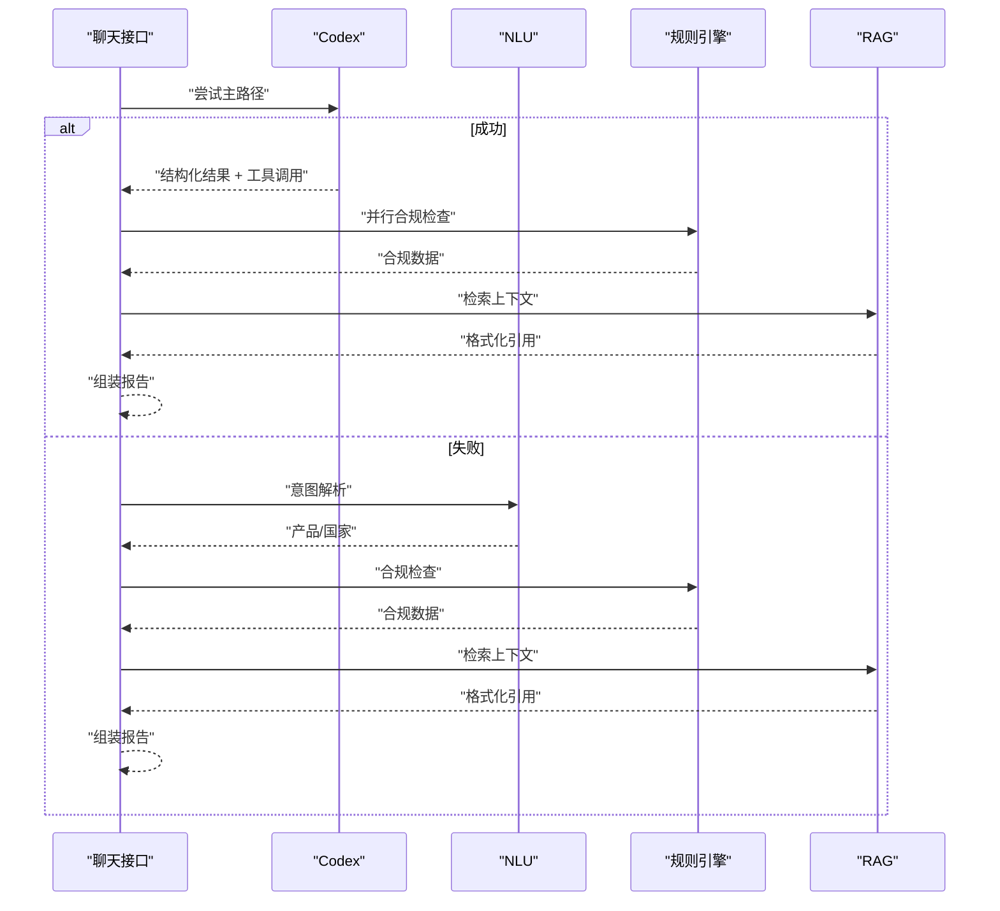
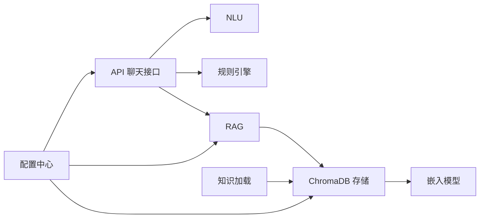

# RAG检索增强系统

<cite>
**本文档引用的文件**
- [backend/app/core/rag.py](file://backend/app/core/rag.py)
- [backend/app/knowledge/store.py](file://backend/app/knowledge/store.py)
- [backend/app/knowledge/embeddings.py](file://backend/app/knowledge/embeddings.py)
- [backend/app/knowledge/loader.py](file://backend/app/knowledge/loader.py)
- [backend/app/knowledge/market_routing.py](file://backend/app/knowledge/market_routing.py)
- [backend/app/api/chat.py](file://backend/app/api/chat.py)
- [backend/app/services/compliance.py](file://backend/app/services/compliance.py)
- [backend/app/core/rule_engine.py](file://backend/app/core/rule_engine.py)
- [backend/app/core/nlu.py](file://backend/app/core/nlu.py)
- [backend/app/config.py](file://backend/app/config.py)
- [backend/scripts/init_knowledge.py](file://backend/scripts/init_knowledge.py)
- [backend/data/regulations.md](file://backend/data/regulations.md)
- [backend/data/prompts/nlu_fallback.yaml](file://backend/data/prompts/nlu_fallback.yaml)
- [backend/data/prompts/chat_compliance.yaml](file://backend/data/prompts/chat_compliance.yaml)
- [backend/app/storage/layer_registry.py](file://backend/app/storage/layer_registry.py)
- [backend/requirements.txt](file://backend/requirements.txt)
</cite>

## 目录
1. [简介](#简介)
2. [项目结构](#项目结构)
3. [核心组件](#核心组件)
4. [架构总览](#架构总览)
5. [组件详解](#组件详解)
6. [依赖关系分析](#依赖关系分析)
7. [性能考量](#性能考量)
8. [故障排查指南](#故障排查指南)
9. [结论](#结论)
10. [附录](#附录)

## 简介
本文件面向“RAG检索增强系统”的实现与运维，聚焦以下主题：
- 向量检索与上下文获取的技术实现
- ChromaDB向量存储的配置与管理
- 嵌入模型的选择与优化
- 检索算法工作原理（相似度计算、上下文选择、结果排序）
- 检索性能优化与内存管理
- 与知识库系统的集成与数据同步
- 检索效果评估指标与调优建议
- 合规查询场景的应用与最佳实践

## 项目结构
后端采用分层架构，RAG位于“知识库层（L1）”与“主交互层（API）”之间，负责将用户查询转换为结构化法规上下文，供上层规则引擎与LLM组合使用。

图表来源
- [backend/app/api/chat.py:204-540](file://backend/app/api/chat.py#L204-L540)
- [backend/app/core/rag.py:10-59](file://backend/app/core/rag.py#L10-L59)
- [backend/app/knowledge/store.py:127-193](file://backend/app/knowledge/store.py#L127-L193)
- [backend/app/knowledge/embeddings.py:19-35](file://backend/app/knowledge/embeddings.py#L19-L35)
- [backend/app/knowledge/loader.py:57-118](file://backend/app/knowledge/loader.py#L57-L118)
- [backend/app/config.py:147-151](file://backend/app/config.py#L147-L151)

章节来源
- [backend/app/api/chat.py:204-540](file://backend/app/api/chat.py#L204-L540)
- [backend/app/core/rag.py:10-59](file://backend/app/core/rag.py#L10-L59)
- [backend/app/knowledge/store.py:127-193](file://backend/app/knowledge/store.py#L127-L193)
- [backend/app/knowledge/embeddings.py:19-35](file://backend/app/knowledge/embeddings.py#L19-L35)
- [backend/app/knowledge/loader.py:57-118](file://backend/app/knowledge/loader.py#L57-L118)
- [backend/app/config.py:147-151](file://backend/app/config.py#L147-L151)

## 核心组件
- RAG检索与上下文格式化：负责检索、评分、格式化引用来源
- ChromaDB向量存储：按市场分集合、Cosine相似度、SentenceTransformer本地嵌入
- 嵌入模型：OpenRouter兼容的文本嵌入模型，或本地SentenceTransformer
- 知识加载与分块：递归字符分块器，保留frontmatter元数据
- 市场路由：基于查询关键词自动选择集合，支持全库兜底
- API编排：Codex主路径与NLU→规则引擎→RAG降级路径

章节来源
- [backend/app/core/rag.py:10-59](file://backend/app/core/rag.py#L10-L59)
- [backend/app/knowledge/store.py:127-193](file://backend/app/knowledge/store.py#L127-L193)
- [backend/app/knowledge/embeddings.py:19-35](file://backend/app/knowledge/embeddings.py#L19-L35)
- [backend/app/knowledge/loader.py:57-118](file://backend/app/knowledge/loader.py#L57-L118)
- [backend/app/knowledge/market_routing.py:48-77](file://backend/app/knowledge/market_routing.py#L48-L77)
- [backend/app/api/chat.py:268-376](file://backend/app/api/chat.py#L268-L376)

## 架构总览
RAG在API层被触发，先尝试Codex主路径，失败则降级至NLU→规则引擎→RAG。检索阶段按市场路由选择集合，若首选无结果则全库聚合排序。

图表来源
- [backend/app/api/chat.py:268-376](file://backend/app/api/chat.py#L268-L376)
- [backend/app/core/rag.py:10-59](file://backend/app/core/rag.py#L10-L59)
- [backend/app/knowledge/store.py:127-193](file://backend/app/knowledge/store.py#L127-L193)
- [backend/app/knowledge/embeddings.py:19-35](file://backend/app/knowledge/embeddings.py#L19-L35)

## 组件详解

### RAG检索与上下文格式化
- 检索入口：接收查询与top_k，若知识库为空直接返回空结果
- 上下文格式化：将检索结果转为带来源引用的提示块，包含法规名称、来源URL、生效日期与文本内容
- 全流程封装：检索→格式化→返回字符串

图表来源
- [backend/app/core/rag.py:10-59](file://backend/app/core/rag.py#L10-L59)

章节来源
- [backend/app/core/rag.py:10-59](file://backend/app/core/rag.py#L10-L59)

### ChromaDB向量存储与管理
- 多集合设计：按市场划分集合（eu、de、us、jp、kr），默认集合兼容旧数据
- 相似度空间：Cosine距离，检索返回余弦相似度
- 嵌入函数：SentenceTransformer本地模型，首次使用懒加载，避免启动时下载
- 写入策略：upsert幂等写入，ID由法规ID与块索引构成，重复运行不产生重复
- 查询策略：优先按检测到的市场查询；若无结果则遍历全库聚合，按分数降序
- 计数与清理：支持按市场或全库统计文档数，支持清空指定集合或全部

图表来源
- [backend/app/knowledge/store.py:54-78](file://backend/app/knowledge/store.py#L54-L78)
- [backend/app/knowledge/market_routing.py:31-77](file://backend/app/knowledge/market_routing.py#L31-L77)

章节来源
- [backend/app/knowledge/store.py:127-193](file://backend/app/knowledge/store.py#L127-L193)
- [backend/app/knowledge/market_routing.py:48-77](file://backend/app/knowledge/market_routing.py#L48-L77)

### 嵌入模型与向量化
- OpenRouter兼容嵌入：通过配置的模型名与base_url调用，返回固定维度向量
- 本地SentenceTransformer：ChromaDB集合创建时自动使用，首次使用懒加载，本地文件优先
- 查询路径：RAG检索使用ChromaDB内置向量；初始化写入时也使用SentenceTransformer

图表来源
- [backend/app/knowledge/embeddings.py:19-35](file://backend/app/knowledge/embeddings.py#L19-L35)
- [backend/app/knowledge/store.py:166-170](file://backend/app/knowledge/store.py#L166-L170)

章节来源
- [backend/app/knowledge/embeddings.py:19-35](file://backend/app/knowledge/embeddings.py#L19-L35)
- [backend/app/knowledge/store.py:31-40](file://backend/app/knowledge/store.py#L31-L40)

### 知识加载与分块
- 目录扫描：按市场目录扫描Markdown文件，支持frontmatter元数据
- 分块策略：递归字符分块器，保留段落、标题层级与空行，Overlap提升连贯性
- 元数据注入：每个块附带市场、法规ID、名称、来源URL、生效日期、标签等
- 初始化脚本：支持按市场批量写入，支持重置、预览、拉取文档后再初始化

图表来源
- [backend/app/knowledge/loader.py:57-118](file://backend/app/knowledge/loader.py#L57-L118)
- [backend/scripts/init_knowledge.py:28-67](file://backend/scripts/init_knowledge.py#L28-L67)

章节来源
- [backend/app/knowledge/loader.py:57-118](file://backend/app/knowledge/loader.py#L57-L118)
- [backend/scripts/init_knowledge.py:28-67](file://backend/scripts/init_knowledge.py#L28-L67)

### 市场路由与查询
- 路由逻辑：根据查询关键词优先判定目标市场，DE关键词优先于EU；无匹配则默认EU
- 查询顺序：先按路由集合查询；若无结果则遍历全库，聚合后按分数降序返回

图表来源
- [backend/app/knowledge/market_routing.py:48-77](file://backend/app/knowledge/market_routing.py#L48-L77)
- [backend/app/knowledge/store.py:127-158](file://backend/app/knowledge/store.py#L127-L158)

章节来源
- [backend/app/knowledge/market_routing.py:48-77](file://backend/app/knowledge/market_routing.py#L48-L77)
- [backend/app/knowledge/store.py:127-158](file://backend/app/knowledge/store.py#L127-L158)

### API编排与降级路径
- Codex主路径：优先使用Codex Agent + MCP工具 + 联网搜索，同时并行执行规则引擎
- 降级路径：当Codex不可用时，走NLU→规则引擎→RAG，支持通用问题直连LLM回复
- 会话与记忆：持久化用户消息、合规结果、当前产品/市场上下文，异常不阻断主流程

图表来源
- [backend/app/api/chat.py:268-376](file://backend/app/api/chat.py#L268-L376)
- [backend/app/api/chat.py:414-539](file://backend/app/api/chat.py#L414-L539)

章节来源
- [backend/app/api/chat.py:268-376](file://backend/app/api/chat.py#L268-L376)
- [backend/app/api/chat.py:414-539](file://backend/app/api/chat.py#L414-L539)

### 合规服务编排
- 当前MVP阶段：编排NLU与规则引擎，未来将接入RAG上下文增强
- 服务职责：意图解析、规则引擎执行、错误兜底与结构化输出

章节来源
- [backend/app/services/compliance.py:11-35](file://backend/app/services/compliance.py#L11-L35)

### 规则引擎与NLU
- 规则引擎：基于L0原始数据（HS编码、VAT、认证矩阵）的确定性检查，输出风险评分、整改建议、清关清单
- NLU：通过结构化JSON提示，抽取产品、国家、动作与置信度，支持多轮上下文截断

章节来源
- [backend/app/core/rule_engine.py:197-247](file://backend/app/core/rule_engine.py#L197-L247)
- [backend/app/core/nlu.py:59-99](file://backend/app/core/nlu.py#L59-L99)

## 依赖关系分析
- 外部依赖：FastAPI、ChromaDB、LangChain、OpenAI、SentenceTransformer（通过ChromaDB embedding function）
- 内部耦合：API层依赖NLU、规则引擎、RAG；RAG依赖知识存储与嵌入；知识加载依赖分块器与配置

图表来源
- [backend/requirements.txt:1-27](file://backend/requirements.txt#L1-L27)
- [backend/app/api/chat.py:204-540](file://backend/app/api/chat.py#L204-L540)
- [backend/app/knowledge/store.py:127-193](file://backend/app/knowledge/store.py#L127-L193)
- [backend/app/knowledge/loader.py:57-118](file://backend/app/knowledge/loader.py#L57-L118)
- [backend/app/config.py:147-151](file://backend/app/config.py#L147-L151)

章节来源
- [backend/requirements.txt:1-27](file://backend/requirements.txt#L1-L27)
- [backend/app/api/chat.py:204-540](file://backend/app/api/chat.py#L204-L540)
- [backend/app/knowledge/store.py:127-193](file://backend/app/knowledge/store.py#L127-L193)
- [backend/app/knowledge/loader.py:57-118](file://backend/app/knowledge/loader.py#L57-L118)
- [backend/app/config.py:147-151](file://backend/app/config.py#L147-L151)

## 性能考量
- 检索性能
  - 集合规模：按市场分集合，减少无关域扫描，提高命中率
  - Top-K控制：合理设置k值，避免过多候选影响LLM上下文长度
  - 路由优化：关键词路由优先，无结果时再全库聚合，降低平均延迟
- 向量性能
  - 懒加载嵌入函数：首次使用才下载模型，避免启动时阻塞
  - Cosine相似度：适合多语言与跨领域文本，稳定性好
- 内存与磁盘
  - ChromaDB持久化：配置持久化目录，定期备份
  - 分块大小：600字符、100字符重叠，兼顾召回与上下文长度
- LLM与API
  - 多轮上下文截断：避免合规报告污染历史，控制token开销
  - 错误降级：Codex失败自动切换NLU→规则引擎→RAG，保证可用性

## 故障排查指南
- ChromaDB查询失败
  - 现象：查询返回空，日志出现警告
  - 排查：确认集合存在且非空；检查嵌入函数初始化；查看异常堆栈
- 知识库为空
  - 现象：检索直接返回空
  - 排查：确认已执行初始化脚本；检查frontmatter与分块；确认写入成功
- 嵌入模型加载失败
  - 现象：首次查询卡顿或报错
  - 排查：网络可达性；本地文件优先；确认模型名称与配置一致
- 路由错误
  - 现象：检索不到目标市场法规
  - 排查：检查关键词匹配逻辑；必要时增加关键词或调整默认市场
- API不可用
  - 现象：Codex失败，自动降级
  - 排查：检查API Key与Base URL；确认提示模板可用

章节来源
- [backend/app/knowledge/store.py:163-173](file://backend/app/knowledge/store.py#L163-L173)
- [backend/scripts/init_knowledge.py:28-67](file://backend/scripts/init_knowledge.py#L28-L67)
- [backend/app/knowledge/embeddings.py:9-16](file://backend/app/knowledge/embeddings.py#L9-L16)
- [backend/app/knowledge/market_routing.py:48-77](file://backend/app/knowledge/market_routing.py#L48-L77)
- [backend/app/api/chat.py:250-263](file://backend/app/api/chat.py#L250-L263)

## 结论
本系统通过“按市场分集合”的ChromaDB设计与“关键词路由+全库兜底”的检索策略，实现了跨区域、多语言的合规知识检索。结合规则引擎与NLU，形成“确定性+检索增强”的混合合规检查流水线。未来可在以下方向持续优化：
- 检索质量：引入rerank、过滤条件、元数据筛选
- 性能：索引参数调优、缓存热点集合、异步写入
- 可观测性：埋点检索耗时、命中率、来源质量
- 数据治理：增量同步、版本化元数据、增量分块

## 附录

### 检索效果评估指标与调优建议
- 指标
  - 召回率：检索到的相关文档比例
  - 精度：检索结果中相关文档比例
  - MRR/MAP：首个相关位置与平均平均精度
  - 人工评估：相关性、引用完整性、可读性
- 调优建议
  - 分块与重叠：平衡召回与上下文长度
  - 路由关键词：持续迭代关键词集，提升首选命中
  - Top-K：结合LLM上下文上限设定k值
  - 元数据丰富度：来源URL、生效日期、标签提升可信度

### 合规查询应用场景与最佳实践
- 场景
  - 出口合规：产品→国家→HS/VAT/认证/风险→清关清单
  - 开放问答：结合联网搜索与知识库引用
- 最佳实践
  - 明确产品与国家，提升NLU与规则引擎准确性
  - 使用引用来源，标注生效日期与来源URL
  - 多轮对话中截断历史，避免污染上下文
  - 失败时优先使用规则引擎兜底，再叠加RAG引用

章节来源
- [backend/app/core/rule_engine.py:197-247](file://backend/app/core/rule_engine.py#L197-L247)
- [backend/app/core/nlu.py:59-99](file://backend/app/core/nlu.py#L59-L99)
- [backend/app/api/chat.py:414-539](file://backend/app/api/chat.py#L414-L539)
- [backend/data/prompts/nlu_fallback.yaml:1-20](file://backend/data/prompts/nlu_fallback.yaml#L1-L20)
- [backend/data/prompts/chat_compliance.yaml:1-21](file://backend/data/prompts/chat_compliance.yaml#L1-L21)