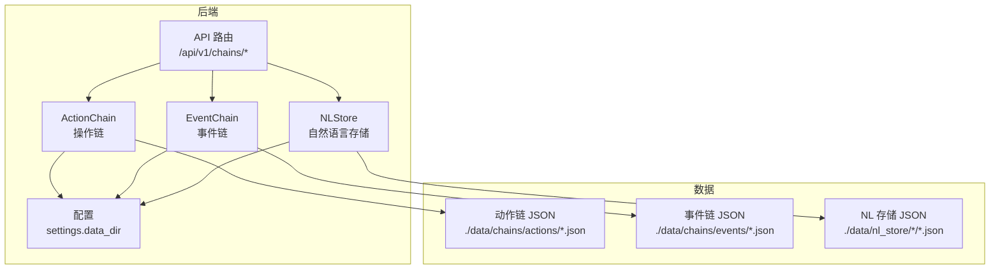
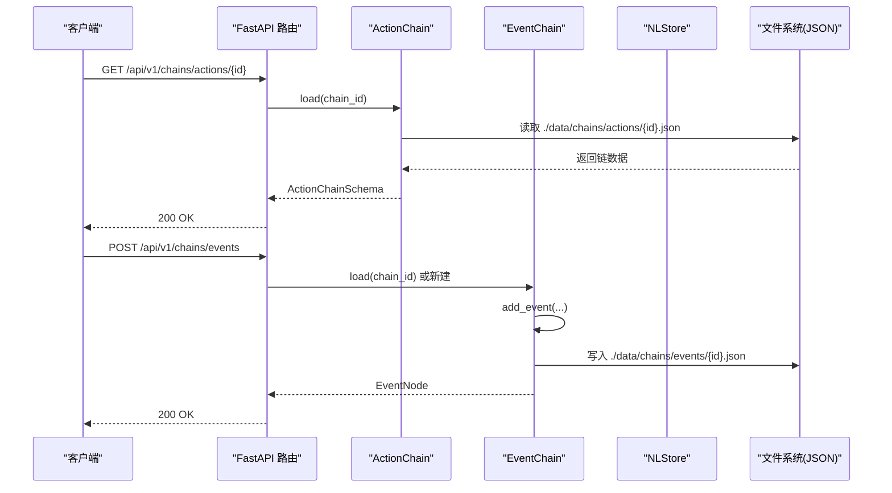
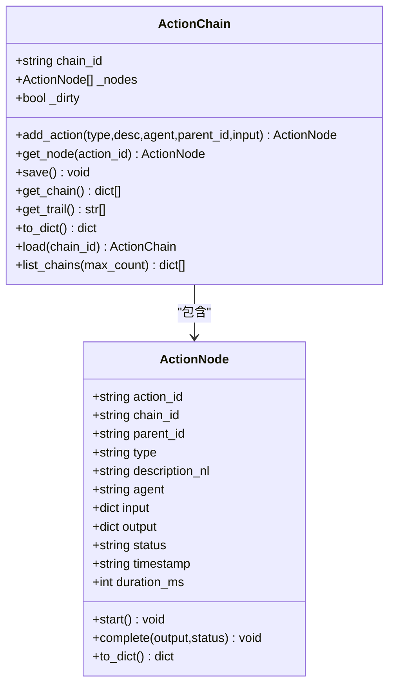
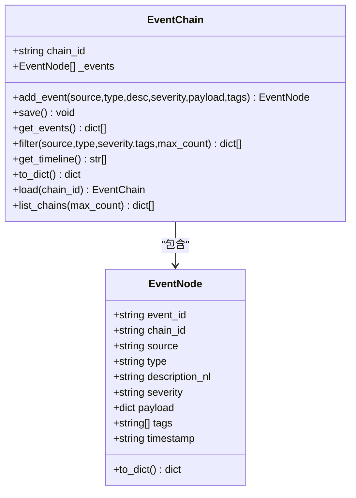
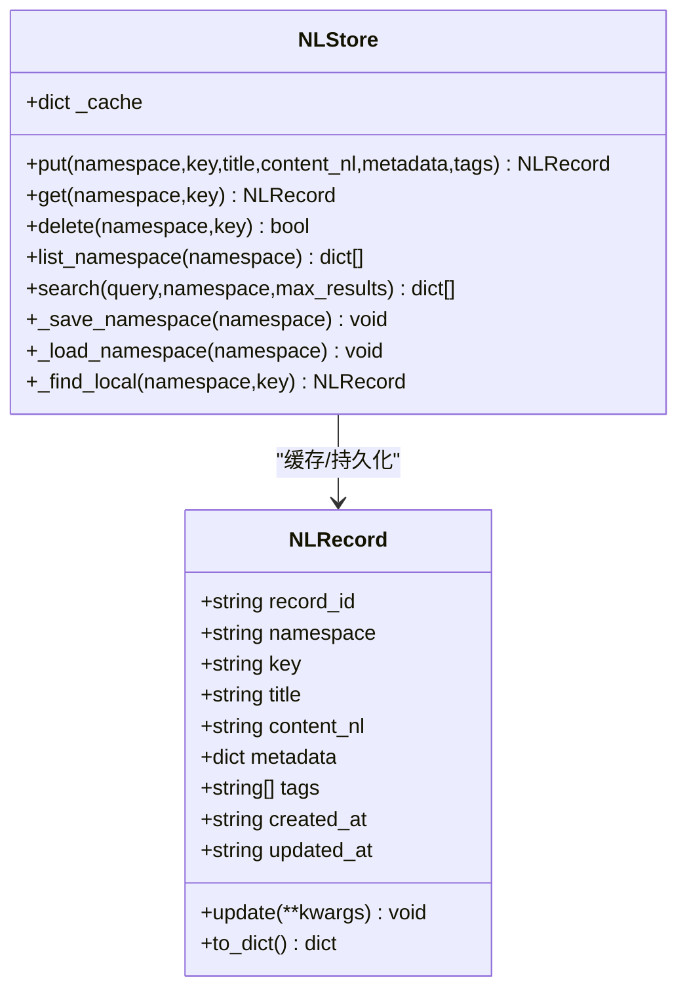
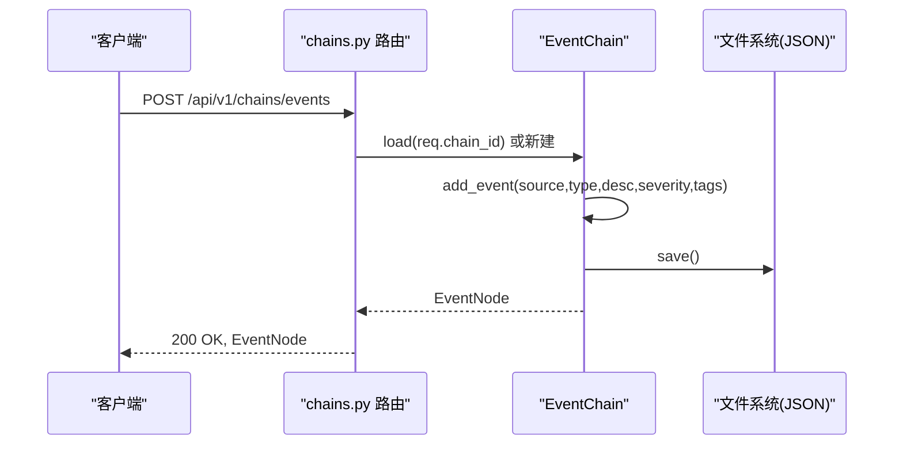
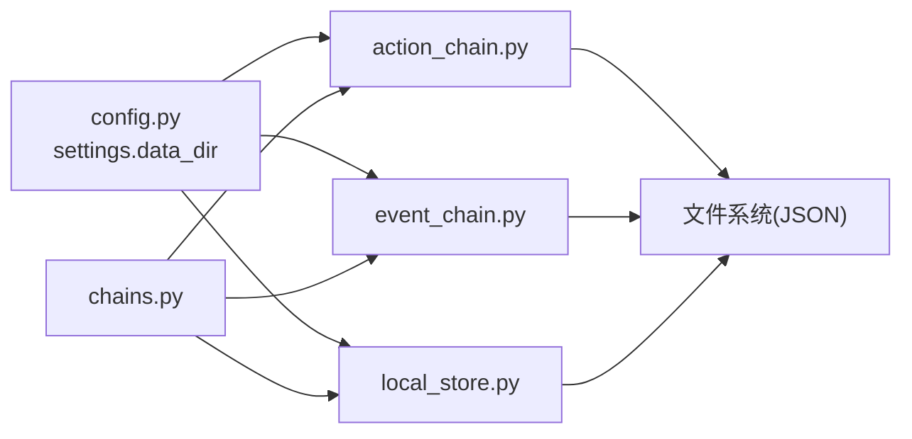

# 操作链追踪系统

<cite>
**本文引用的文件**
- [action_chain.py](file://backend/app/core/action_chain.py)
- [event_chain.py](file://backend/app/core/event_chain.py)
- [chains.py](file://backend/app/api/chains.py)
- [schemas.py](file://backend/app/models/schemas.py)
- [local_store.py](file://backend/app/core/local_store.py)
- [config.py](file://backend/app/config.py)
- [test_chains.py](file://backend/tests/test_chains.py)
- [test_chain_001.json](file://backend/data/chains/actions/test_chain_001.json)
- [eu_regulations_2026.json](file://backend/data/chains/events/eu_regulations_2026.json)
- [market_monitor.yaml](file://backend/data/prompts/market_monitor.yaml)
- [main.py](file://backend/app/main.py)
</cite>

## 目录
1. [简介](#简介)
2. [项目结构](#项目结构)
3. [核心组件](#核心组件)
4. [架构总览](#架构总览)
5. [组件详解](#组件详解)
6. [依赖关系分析](#依赖关系分析)
7. [性能与监控](#性能与监控)
8. [故障排查指南](#故障排查指南)
9. [结论](#结论)
10. [附录](#附录)

## 简介
本文件系统性阐述“操作链追踪系统”的设计理念与实现机制，围绕 ActionChain（操作链）与 EventChain（事件链）两大核心模块，详细说明其生命周期管理、状态跟踪、事件记录、执行顺序与依赖关系、回滚机制、配置与扩展方式、监控与调试手段，以及在复杂业务流程中的应用模式与最佳实践。系统采用纯文本 JSON 文件持久化，结合 RESTful API 提供统一的查询与管理能力，便于审计、回溯与可视化展示。

## 项目结构
- 后端核心模块位于 backend/app/core，包含操作链与事件链的实现，以及自然语言本地存储 NLStore。
- API 层位于 backend/app/api，提供操作链与事件链的 HTTP 接口。
- 数据样例位于 backend/data/chains，包含示例操作链与事件链 JSON。
- 配置位于 backend/app/config.py，定义数据目录等关键路径。
- 测试位于 backend/tests，验证链式功能与持久化行为。

图表来源
- [action_chain.py:1-236](file://backend/app/core/action_chain.py#L1-L236)
- [event_chain.py:1-215](file://backend/app/core/event_chain.py#L1-L215)
- [local_store.py:1-293](file://backend/app/core/local_store.py#L1-L293)
- [chains.py:1-282](file://backend/app/api/chains.py#L1-L282)
- [config.py:150-155](file://backend/app/config.py#L150-L155)

章节来源
- [main.py:22-32](file://backend/app/main.py#L22-L32)
- [config.py:150-155](file://backend/app/config.py#L150-L155)

## 核心组件
- ActionChain：记录一次交互中的所有操作步骤，支持追加、开始、完成、持久化、回溯与状态计算。
- EventChain：记录系统内外部事件，支持追加、筛选、时间线展示与持久化。
- NLStore：以自然语言为核心的本地文件存储，支持 CRUD 与全文搜索。
- API 路由：提供操作链与事件链的 REST 接口，包括列表、详情、筛选、时间线等。

章节来源
- [action_chain.py:77-236](file://backend/app/core/action_chain.py#L77-L236)
- [event_chain.py:61-215](file://backend/app/core/event_chain.py#L61-L215)
- [local_store.py:80-293](file://backend/app/core/local_store.py#L80-L293)
- [chains.py:27-282](file://backend/app/api/chains.py#L27-L282)

## 架构总览
系统采用“核心模块 + API 层 + 数据持久化”的分层架构。核心模块负责业务逻辑与数据结构，API 层提供对外接口，数据持久化采用 JSON 文件，按会话/链 ID 组织，便于审计与可视化。

图表来源
- [chains.py:48-160](file://backend/app/api/chains.py#L48-L160)
- [action_chain.py:187-212](file://backend/app/core/action_chain.py#L187-L212)
- [event_chain.py:170-192](file://backend/app/core/event_chain.py#L170-L192)

## 组件详解

### ActionChain（操作链）
- 设计理念
  - 以“自然语言描述 + 结构化数据”记录每一步操作，形成可追溯的决策链条。
  - 支持父子节点关系（parent_id），构建树状链路，便于回溯与可视化。
- 生命周期
  - 创建：生成链 ID，内部维护节点列表。
  - 追加：add_action 自动生成 action_id，若未显式指定 parent_id，则默认指向链尾节点。
  - 执行：start 标记开始（记录计时起点），complete 标记结束（计算耗时、写入输出）。
  - 持久化：save 将链序列化为 JSON，按 chain_id 命名文件。
  - 加载：load 从 JSON 文件重建链对象。
  - 查询：get_chain 返回节点列表，get_trail 返回自然语言描述链，便于前端展示。
  - 状态：_calc_status 基于节点状态聚合，支持 empty/running/completed/failed/partial。
- 数据结构
  - ActionNode：包含 action_id、chain_id、parent_id、type、description_nl、agent、input、output、status、timestamp、duration_ms。
  - ActionChain：包含 nodes 列表、脏标记（_dirty）、链 ID、持久化与查询方法。
- 执行顺序与依赖
  - 通过 parent_id 显式建立父子依赖；未指定 parent_id 时默认继承上一节点，保证顺序一致性。
- 回滚机制
  - 当前实现未内置自动回滚；可通过在业务层记录节点状态并在失败时撤销后续节点来模拟回滚。
- 性能与可观测性
  - 使用 perf_counter 记录毫秒级耗时，便于性能分析与告警。
  - get_trail 提供带状态与耗时的可视化展示。

图表来源
- [action_chain.py:23-74](file://backend/app/core/action_chain.py#L23-L74)
- [action_chain.py:77-184](file://backend/app/core/action_chain.py#L77-L184)

章节来源
- [action_chain.py:77-236](file://backend/app/core/action_chain.py#L77-L236)
- [test_chain_001.json:1-46](file://backend/data/chains/actions/test_chain_001.json#L1-L46)

### EventChain（事件链）
- 设计理念
  - 记录系统内外部重要事件，支持按来源、类型、严重度、标签筛选，形成事件时间线。
- 生命周期
  - 创建：指定 chain_id。
  - 追加：add_event 添加事件节点。
  - 持久化：save 写入 JSON 文件。
  - 加载：load 从 JSON 重建链。
  - 查询：get_events 返回事件列表，filter 支持多维筛选，get_timeline 输出带严重度与时间戳的自然语言时间线。
- 数据结构
  - EventNode：包含 event_id、chain_id、source、type、description_nl、severity、payload、tags、timestamp。
  - EventChain：包含 events 列表、链 ID、查询与筛选方法。
- 事件传播与影响范围
  - 通过 tags 与 severity 建立事件传播与影响范围的语义维度；filter 可按标签交集进行传播范围控制。
- 回滚机制
  - 当前未内置回滚；可在业务层基于时间线与标签进行人工干预或重放。

图表来源
- [event_chain.py:24-58](file://backend/app/core/event_chain.py#L24-L58)
- [event_chain.py:61-166](file://backend/app/core/event_chain.py#L61-L166)

章节来源
- [event_chain.py:61-215](file://backend/app/core/event_chain.py#L61-L215)
- [eu_regulations_2026.json:1-39](file://backend/data/chains/events/eu_regulations_2026.json#L1-L39)

### NLStore（自然语言本地存储）
- 设计理念
  - 以“自然语言描述 + 结构化元数据”为核心，支持 CRUD 与全文搜索，便于人类可读与机器检索。
- 生命周期
  - put：创建或更新记录，自动更新 updated_at。
  - get/delete：按 namespace/key 读取或删除。
  - list_namespace：列出命名空间下记录摘要。
  - search：基于关键词匹配的全文搜索，返回按匹配分数排序的结果。
  - 持久化：_save_namespace 将命名空间内所有记录写入 _all.json 与各记录独立文件。
- 数据结构
  - NLRecord：包含 record_id、namespace、key、title、content_nl、metadata、tags、created_at、updated_at。
  - NLStore：缓存命名空间记录，惰性加载与保存。

图表来源
- [local_store.py:29-78](file://backend/app/core/local_store.py#L29-L78)
- [local_store.py:80-293](file://backend/app/core/local_store.py#L80-L293)

章节来源
- [local_store.py:80-293](file://backend/app/core/local_store.py#L80-L293)

### API 路由与数据模型
- 操作链 API
  - GET /chains/actions：列出最近操作链摘要。
  - GET /chains/actions/{chain_id}：获取完整操作链。
  - GET /chains/actions/{chain_id}/trail：获取自然语言描述链。
- 事件链 API
  - GET /chains/events：列出最近事件链摘要。
  - GET /chains/events/{chain_id}：获取完整事件链。
  - GET /chains/events/{chain_id}/timeline：获取自然语言时间线。
  - GET /chains/events/{chain_id}/filter：按来源/类型/严重度/标签筛选事件。
  - POST /chains/events：向事件链追加事件（不存在则自动创建）。
- 数据模型
  - ActionChainSchema/ActionNodeSchema/ActionChainSummary
  - EventChainSchema/EventNodeSchema/EventChainSummary
  - NLRecordSchema/NLRecordCreateRequest/NLRecordUpdateRequest/NLSearchResult/NLSummaryItem

图表来源
- [chains.py:146-160](file://backend/app/api/chains.py#L146-L160)
- [event_chain.py:86-106](file://backend/app/core/event_chain.py#L86-L106)

章节来源
- [chains.py:27-282](file://backend/app/api/chains.py#L27-L282)
- [schemas.py:106-181](file://backend/app/models/schemas.py#L106-L181)

## 依赖关系分析
- 模块耦合
  - ActionChain 与 EventChain 分别依赖配置 settings.data_dir，决定 JSON 存储根目录。
  - API 路由同时依赖 ActionChain、EventChain 与 NLStore，形成统一入口。
- 外部依赖
  - Python 标准库（json、uuid、time、pathlib、datetime、typing）。
  - FastAPI（路由与响应模型）。
  - Pydantic（数据模型校验）。
- 潜在循环依赖
  - 未发现循环导入；各模块职责清晰，API 层仅作为门面。

图表来源
- [config.py:150-155](file://backend/app/config.py#L150-L155)
- [action_chain.py:20](file://backend/app/core/action_chain.py#L20)
- [event_chain.py:19](file://backend/app/core/event_chain.py#L19)
- [local_store.py:26](file://backend/app/core/local_store.py#L26)
- [chains.py:20-22](file://backend/app/api/chains.py#L20-L22)

章节来源
- [config.py:150-155](file://backend/app/config.py#L150-L155)
- [chains.py:20-22](file://backend/app/api/chains.py#L20-L22)

## 性能与监控
- 性能特性
  - 操作链耗时统计：使用 perf_counter 记录毫秒级耗时，便于定位慢节点。
  - 事件链筛选：filter 基于内存列表过滤，适合中小规模事件链。
  - NLStore 搜索：简单关键词匹配，无需外部索引，适合小中型知识库。
- 监控与调试
  - API 提供 trail/timeline 预览，便于前端快速定位问题。
  - list_chains 提供摘要列表，支持按更新时间排序，便于巡检。
  - 测试用例验证了基本 CRUD、持久化与查询流程，可作为回归测试基线。
- 优化建议
  - 大规模事件链：考虑引入轻量索引（如按时间戳/严重度分区）。
  - NLStore：可引入倒排索引或向量检索以提升搜索性能。
  - 并发写入：当前未做并发控制，生产环境需考虑锁或队列化写入。

章节来源
- [action_chain.py:49-60](file://backend/app/core/action_chain.py#L49-L60)
- [event_chain.py:123-141](file://backend/app/core/event_chain.py#L123-L141)
- [local_store.py:176-221](file://backend/app/core/local_store.py#L176-L221)
- [test_chains.py:11-99](file://backend/tests/test_chains.py#L11-L99)

## 故障排查指南
- 常见问题
  - 链不存在：API 返回 404，检查 chain_id 是否正确或是否已保存。
  - JSON 文件损坏：load 失败或解析异常，检查文件完整性与编码。
  - 存储目录权限不足：save 失败，确认 data_dir 可写。
- 排查步骤
  - 使用 list_chains 确认链是否存在与更新时间。
  - 使用 get_trail/get_timeline 快速定位失败节点或高严重度事件。
  - 在本地打开 JSON 文件核对字段（如 status、timestamp、duration_ms）。
- 测试参考
  - test_chains.py 展示了完整的 CRUD、筛选与持久化流程，可作为集成测试模板。

章节来源
- [chains.py:50-53](file://backend/app/api/chains.py#L50-L53)
- [chains.py:93-96](file://backend/app/api/chains.py#L93-L96)
- [test_chains.py:11-99](file://backend/tests/test_chains.py#L11-L99)

## 结论
本系统以纯文本 JSON 为基础，提供了简洁可靠的“操作链 + 事件链 + 自然语言存储”组合，满足合规场景下的可追溯性、可审计性与可解释性需求。通过标准化的数据模型与 RESTful API，系统易于扩展与集成。建议在生产环境中补充并发控制、索引与监控告警，以进一步提升稳定性与性能。

## 附录

### 配置示例与路径
- 数据目录：settings.data_dir，默认为 ./data，用于存放 chains 与 nl_store。
- 操作链存储：./data/chains/actions/{chain_id}.json
- 事件链存储：./data/chains/events/{chain_id}.json
- NLStore 存储：./data/nl_store/{namespace}/{key}.json 与 ./data/nl_store/{namespace}/_all.json

章节来源
- [config.py:150-155](file://backend/app/config.py#L150-L155)
- [action_chain.py:20](file://backend/app/core/action_chain.py#L20)
- [event_chain.py:19](file://backend/app/core/event_chain.py#L19)
- [local_store.py:26](file://backend/app/core/local_store.py#L26)

### 自定义链开发指南
- 新增操作链节点
  - 使用 ActionChain.add_action(type, description_nl, agent, parent_id?, input_data?) 追加节点。
  - 节点状态：pending → running → success/failed。
  - 完成后调用 save 持久化。
- 新增事件链事件
  - 使用 EventChain.add_event(source, type, description_nl, severity?, payload?, tags?)。
  - 支持按 severity 与 tags 进行传播范围控制。
- 自然语言存储
  - 使用 NLStore.put(namespace, key, title, content_nl, metadata?, tags?) 写入。
  - 使用 search 进行关键词检索，list_namespace 列出摘要。

章节来源
- [action_chain.py:101-122](file://backend/app/core/action_chain.py#L101-L122)
- [event_chain.py:86-106](file://backend/app/core/event_chain.py#L86-L106)
- [local_store.py:115-145](file://backend/app/core/local_store.py#L115-L145)

### 应用案例与设计模式
- 市场监控驱动的事件链
  - market_monitor.yaml 定义了多市场关键词与来源，可用于驱动 EventChain 的自动化采集与入库。
- 会话与合规检查的链路追踪
  - ActionChain 记录 NLU、规则引擎、RAG 等步骤，结合 ChatResponse 的 action_chain_id，便于前端展示与审计。
- 事件传播与影响评估
  - 通过 tags 与 severity，EventChain 的 filter 可实现事件传播范围与影响评估，辅助风险中心与合规面板。

章节来源
- [market_monitor.yaml:1-36](file://backend/data/prompts/market_monitor.yaml#L1-L36)
- [schemas.py:95-104](file://backend/app/models/schemas.py#L95-L104)