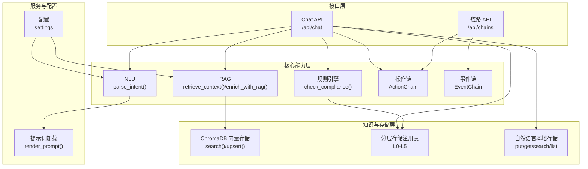
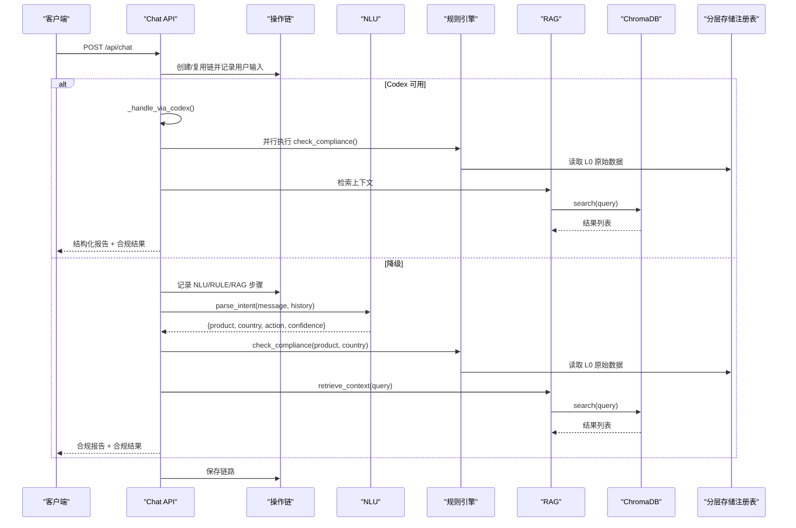
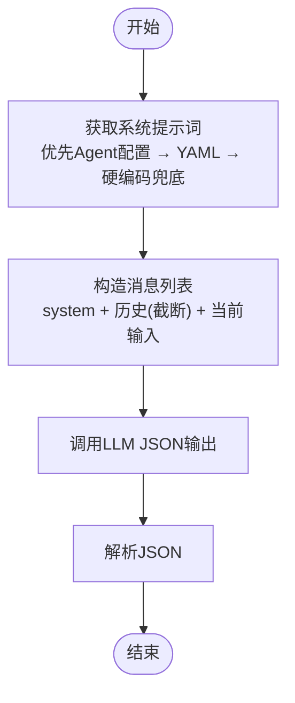
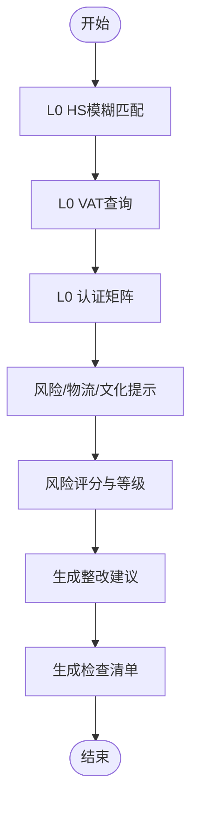
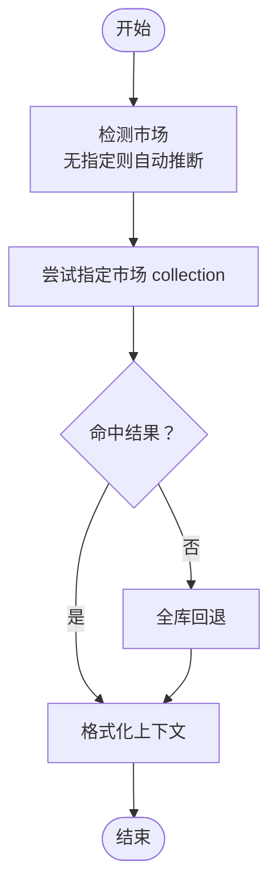
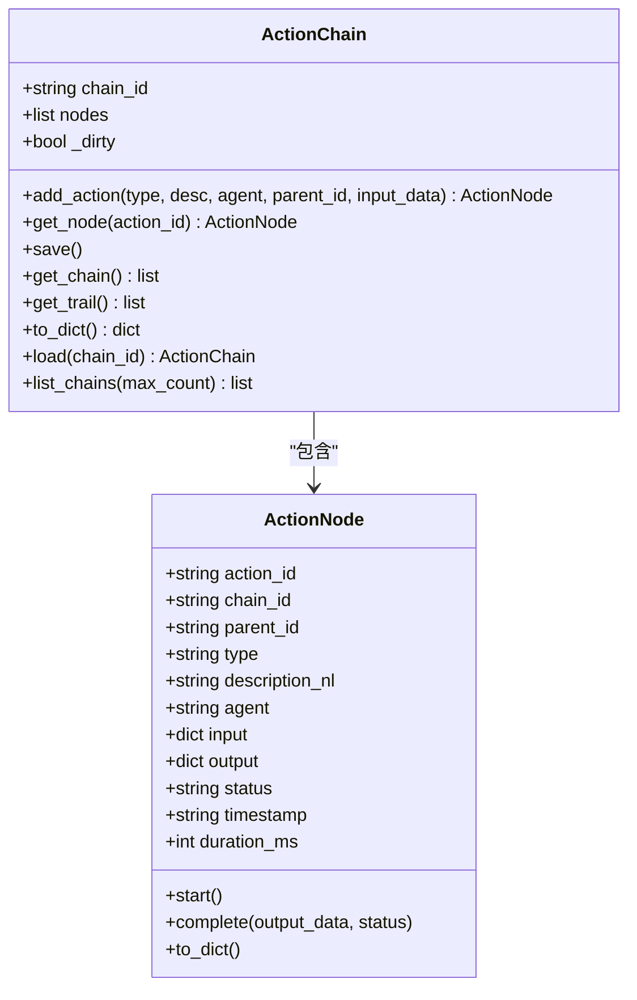
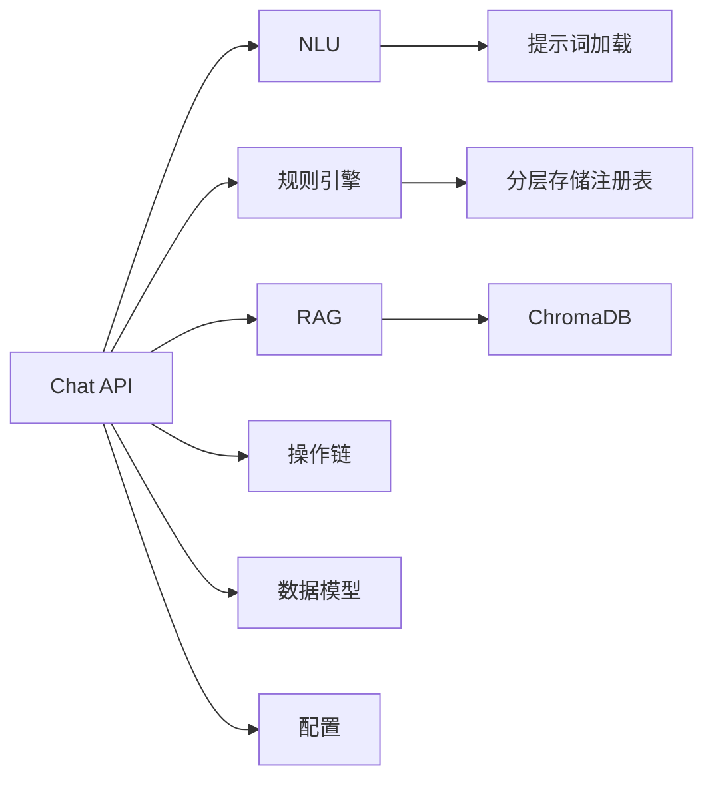

# 核心组件设计

<cite>
**本文档引用的文件**
- [nlu.py](file://backend/app/core/nlu.py)
- [rule_engine.py](file://backend/app/core/rule_engine.py)
- [rag.py](file://backend/app/core/rag.py)
- [action_chain.py](file://backend/app/core/action_chain.py)
- [event_chain.py](file://backend/app/core/event_chain.py)
- [store.py](file://backend/app/knowledge/store.py)
- [layer_registry.py](file://backend/app/storage/layer_registry.py)
- [prompt_loader.py](file://backend/app/services/prompt_loader.py)
- [chat.py](file://backend/app/api/chat.py)
- [chains.py](file://backend/app/api/chains.py)
- [schemas.py](file://backend/app/models/schemas.py)
- [config.py](file://backend/app/config.py)
- [nlu_fallback.yaml](file://backend/data/prompts/nlu_fallback.yaml)
- [market_routing.py](file://backend/app/knowledge/market_routing.py)
- [local_store.py](file://backend/app/core/local_store.py)
</cite>

## 目录
1. [简介](#简介)
2. [项目结构](#项目结构)
3. [核心组件](#核心组件)
4. [架构总览](#架构总览)
5. [详细组件分析](#详细组件分析)
6. [依赖分析](#依赖分析)
7. [性能考虑](#性能考虑)
8. [故障排查指南](#故障排查指南)
9. [结论](#结论)
10. [附录](#附录)

## 简介
本设计文档聚焦避风港项目的四大核心组件：自然语言理解（NLU）、规则引擎、RAG检索系统、操作链追踪系统。文档从设计理念、算法实现、性能特征、组件协作与数据流、可插拔扩展点、错误处理与降级策略等方面进行深入剖析，并提供组件交互图与处理流程图，辅以代码片段路径与使用场景说明，帮助开发者与产品人员快速理解并高效迭代。

## 项目结构
后端采用分层与职责分离的组织方式：
- 核心能力层：NLU、规则引擎、RAG、操作链/事件链
- 知识与存储层：向量知识库（ChromaDB）、分层存储注册表、本地自然语言存储
- 服务与接口层：Chat API、链路查询 API、模型与提示词管理
- 配置与模型：全局配置、Pydantic 数据模型

图表来源
- [chat.py:205-264](file://backend/app/api/chat.py#L205-L264)
- [nlu.py:59-99](file://backend/app/core/nlu.py#L59-L99)
- [rule_engine.py:197-247](file://backend/app/core/rule_engine.py#L197-L247)
- [rag.py:10-59](file://backend/app/core/rag.py#L10-L59)
- [action_chain.py:77-236](file://backend/app/core/action_chain.py#L77-L236)
- [event_chain.py:61-215](file://backend/app/core/event_chain.py#L61-L215)
- [store.py:127-193](file://backend/app/knowledge/store.py#L127-L193)
- [layer_registry.py:23-45](file://backend/app/storage/layer_registry.py#L23-L45)
- [prompt_loader.py:54-70](file://backend/app/services/prompt_loader.py#L54-L70)
- [config.py:5-75](file://backend/app/config.py#L5-L75)

章节来源
- [chat.py:1-541](file://backend/app/api/chat.py#L1-L541)
- [nlu.py:1-99](file://backend/app/core/nlu.py#L1-L99)
- [rule_engine.py:1-247](file://backend/app/core/rule_engine.py#L1-L247)
- [rag.py:1-59](file://backend/app/core/rag.py#L1-L59)
- [action_chain.py:1-236](file://backend/app/core/action_chain.py#L1-L236)
- [event_chain.py:1-215](file://backend/app/core/event_chain.py#L1-L215)
- [store.py:1-227](file://backend/app/knowledge/store.py#L1-L227)
- [layer_registry.py:1-45](file://backend/app/storage/layer_registry.py#L1-L45)
- [prompt_loader.py:1-79](file://backend/app/services/prompt_loader.py#L1-L79)
- [config.py:1-75](file://backend/app/config.py#L1-L75)

## 核心组件
本节概述四大核心组件的目标、职责与关键特性。

- 自然语言理解（NLU）
  - 目标：将用户输入解析为结构化意图（产品、目标国家、动作、置信度），支持多轮上下文注入与JSON输出约束。
  - 关键点：基于配置的LLM客户端、系统提示词热加载、MiMo思考模式开关、历史上下文截断。
  - 性能：单次调用，响应格式为JSON，适合高频、低延迟场景。

- 规则引擎
  - 目标：对“明确产品+国家”的确定性合规检查，提供HS编码、VAT、认证、风险与整改建议。
  - 关键点：L0原始数据读取（RawStore）、风险评分与等级映射、文档清单与文化提示。
  - 性能：纯内存计算，O(1)复杂度，极低延迟。

- RAG检索系统
  - 目标：从ChromaDB向量库检索相关法规上下文，格式化为LLM可读的引用块。
  - 关键点：按市场路由collection、懒加载嵌入函数、跨库回退、异常降级为空结果。
  - 性能：向量相似度检索，受集合规模与topK影响，具备可扩展性。

- 操作链追踪系统
  - 目标：记录每次交互的完整决策链路，支持增删查改、状态计算、链路可视化。
  - 关键点：节点计时与状态机、JSON持久化、链路回溯与摘要列表。
  - 性能：本地文件IO，写放大与读放大取决于链路长度与文件数量。

章节来源
- [nlu.py:59-99](file://backend/app/core/nlu.py#L59-L99)
- [rule_engine.py:197-247](file://backend/app/core/rule_engine.py#L197-L247)
- [rag.py:10-59](file://backend/app/core/rag.py#L10-L59)
- [action_chain.py:77-236](file://backend/app/core/action_chain.py#L77-L236)

## 架构总览
下图展示了主对话接口的两条路径：Codex驱动与NLU→规则引擎→RAG降级路径，以及各组件之间的数据流向与协作关系。

图表来源
- [chat.py:228-377](file://backend/app/api/chat.py#L228-L377)
- [chat.py:415-541](file://backend/app/api/chat.py#L415-L541)
- [nlu.py:59-99](file://backend/app/core/nlu.py#L59-L99)
- [rule_engine.py:197-247](file://backend/app/core/rule_engine.py#L197-L247)
- [rag.py:10-59](file://backend/app/core/rag.py#L10-L59)
- [store.py:127-193](file://backend/app/knowledge/store.py#L127-L193)
- [layer_registry.py:23-45](file://backend/app/storage/layer_registry.py#L23-L45)

## 详细组件分析

### 自然语言理解（NLU）系统
- 设计理念
  - 单轮提示词驱动的结构化解析，强调确定性与低延迟。
  - 支持系统提示词热加载与多轮上下文截断，兼顾准确性与稳定性。
- 算法实现
  - 客户端懒加载与密钥变更自动重建，避免并发问题。
  - 系统提示词优先来自Agent配置，其次YAML兜底，最后硬编码兜底。
  - 构造消息列表：system + 最近N条上下文（助手消息截断）+ 当前用户输入。
  - JSON输出约束与响应格式化。
- 性能特征
  - 单次LLM调用，响应时间主要受网络与模型服务影响。
  - 历史上下文截断减少上下文长度，提升稳定性。
- 可插拔与扩展点
  - 提示词模板来自YAML，支持热加载；可通过修改模板调整解析策略。
  - MiMo思考模式可通过配置关闭，进一步降低延迟。
- 错误处理与降级
  - LLM不可用或异常时，回退到关键词抽取策略，保证基本意图识别。
- 使用场景
  - 用户输入“手机出口德国” → 提取产品=手机、国家=德国、动作=export_check。

图表来源
- [nlu.py:27-99](file://backend/app/core/nlu.py#L27-L99)
- [prompt_loader.py:54-70](file://backend/app/services/prompt_loader.py#L54-L70)
- [nlu_fallback.yaml:1-20](file://backend/data/prompts/nlu_fallback.yaml#L1-L20)
- [config.py:20-38](file://backend/app/config.py#L20-L38)

章节来源
- [nlu.py:1-99](file://backend/app/core/nlu.py#L1-L99)
- [prompt_loader.py:1-79](file://backend/app/services/prompt_loader.py#L1-L79)
- [nlu_fallback.yaml:1-20](file://backend/data/prompts/nlu_fallback.yaml#L1-L20)
- [config.py:1-75](file://backend/app/config.py#L1-L75)

### 规则引擎
- 设计理念
  - 高频、确定性合规检查由规则引擎承担，LLM负责模糊意图与开放问答。
  - 数据来源L0原始数据，输出标准化合规结果，便于UI与告警。
- 算法实现
  - 产品→HS编码模糊匹配；国家→VAT查询；认证矩阵；风险与物流提示；文化提示。
  - 风险评分与等级映射，整改建议优先级生成，检查清单组装。
- 性能特征
  - 纯内存查询与逻辑运算，O(1)复杂度，极低延迟。
  - L0数据不可用时返回空结果并标记，不阻塞主流程。
- 可插拔与扩展点
  - L0数据通过注册表统一读取，新增数据源只需在RawStore扩展。
  - 风险规则、文档清单、文化提示可按国家/品类扩展。
- 错误处理与降级
  - L0不可用返回空结果并标记，不抛出异常。
- 使用场景
  - 输入产品“LED灯”、国家“德国”，输出HS、VAT、认证、风险与整改建议。

图表来源
- [rule_engine.py:17-247](file://backend/app/core/rule_engine.py#L17-L247)
- [layer_registry.py:23-45](file://backend/app/storage/layer_registry.py#L23-L45)

章节来源
- [rule_engine.py:1-247](file://backend/app/core/rule_engine.py#L1-L247)
- [layer_registry.py:1-45](file://backend/app/storage/layer_registry.py#L1-L45)

### RAG检索系统
- 设计理念
  - 将用户查询转换为向量相似度检索，返回带来源引用的上下文，增强LLM回答可信度。
- 算法实现
  - 按市场路由collection（eu/de/us/jp/kr），无市场指定时自动推断，失败则全库回退。
  - 懒加载嵌入函数，首次使用才下载模型，避免启动时阻塞。
  - 结果格式化：标题、来源、生效日期、文本块，便于LLM拼接。
- 性能特征
  - 检索复杂度与集合大小和topK相关；通过collection隔离与回退策略平衡准确与性能。
  - 异常时返回空结果，不影响主流程。
- 可插拔与扩展点
  - 新增市场只需扩展collection映射与路由规则。
  - 模板化检索结果格式，便于前端渲染。
- 错误处理与降级
  - ChromaDB不可用或查询异常时返回空结果，不中断主流程。
- 使用场景
  - 查询“德国LED灯合规要求” → 返回相关法规块与来源链接。

图表来源
- [rag.py:10-59](file://backend/app/core/rag.py#L10-L59)
- [store.py:127-193](file://backend/app/knowledge/store.py#L127-L193)
- [market_routing.py:48-77](file://backend/app/knowledge/market_routing.py#L48-L77)

章节来源
- [rag.py:1-59](file://backend/app/core/rag.py#L1-L59)
- [store.py:1-227](file://backend/app/knowledge/store.py#L1-L227)
- [market_routing.py:1-77](file://backend/app/knowledge/market_routing.py#L1-L77)

### 操作链追踪系统
- 设计理念
  - 以自然语言描述记录每一步操作，形成可追溯的决策链条，支持状态机与可视化。
- 算法实现
  - ActionNode记录类型、描述、代理、输入输出、状态、耗时与时间戳。
  - ActionChain维护节点树，支持追加、完成、保存、加载、列表与摘要。
  - 状态计算：empty/running/completed/failed/partial。
- 性能特征
  - 本地JSON文件存储，写放大与链路长度相关；读取按需加载。
- 可插拔与扩展点
  - 通过API暴露链路列表、详情、自然语言链路与筛选，便于前端集成。
- 错误处理与降级
  - 加载/保存异常不影响主流程，链路仍可继续记录。
- 使用场景
  - 展示“第1步: [NLU] 解析用户输入 → 产品=LED灯, 国家=德国”。

图表来源
- [action_chain.py:23-236](file://backend/app/core/action_chain.py#L23-L236)

章节来源
- [action_chain.py:1-236](file://backend/app/core/action_chain.py#L1-L236)
- [chains.py:31-161](file://backend/app/api/chains.py#L31-L161)
- [schemas.py:106-140](file://backend/app/models/schemas.py#L106-L140)

### 事件链与自然语言本地存储（扩展）
- 事件链（EventChain）
  - 记录系统内外部事件，支持按来源/类型/严重度筛选与时间线展示。
  - 适用于监管政策变化、系统告警等重要事件追踪。
- 自然语言本地存储（NLStore）
  - 以“自然语言描述 + 结构化元数据”形式存储，支持CRUD与全文搜索。
  - 适用于产品合规档案、会话记忆、策略与知识沉淀。

章节来源
- [event_chain.py:1-215](file://backend/app/core/event_chain.py#L1-L215)
- [local_store.py:1-293](file://backend/app/core/local_store.py#L1-L293)
- [chains.py:140-282](file://backend/app/api/chains.py#L140-L282)

## 依赖分析
- 组件耦合与内聚
  - Chat API是编排中心，NLU/规则引擎/RAG/操作链相互独立，通过ActionChain串联。
  - RAG依赖ChromaDB与市场路由；规则引擎依赖分层存储注册表；NLU依赖提示词加载与配置。
- 外部依赖与集成点
  - LLM服务（OpenAI/MiMo）、ChromaDB、FastAPI路由、YAML提示词模板。
- 潜在循环依赖
  - 通过模块导入顺序与职责边界避免循环；API层仅编排，核心层解耦。

图表来源
- [chat.py:14-26](file://backend/app/api/chat.py#L14-L26)
- [nlu.py:7-10](file://backend/app/core/nlu.py#L7-L10)
- [rag.py:7](file://backend/app/core/rag.py#L7)
- [layer_registry.py:16-21](file://backend/app/storage/layer_registry.py#L16-L21)
- [prompt_loader.py:10-14](file://backend/app/services/prompt_loader.py#L10-L14)
- [config.py:5-75](file://backend/app/config.py#L5-L75)
- [schemas.py:1-264](file://backend/app/models/schemas.py#L1-L264)

章节来源
- [chat.py:1-541](file://backend/app/api/chat.py#L1-L541)
- [nlu.py:1-99](file://backend/app/core/nlu.py#L1-L99)
- [rag.py:1-59](file://backend/app/core/rag.py#L1-L59)
- [layer_registry.py:1-45](file://backend/app/storage/layer_registry.py#L1-L45)
- [prompt_loader.py:1-79](file://backend/app/services/prompt_loader.py#L1-L79)
- [config.py:1-75](file://backend/app/config.py#L1-L75)
- [schemas.py:1-264](file://backend/app/models/schemas.py#L1-L264)

## 性能考虑
- NLU
  - 控制历史上下文长度与截断策略，避免上下文膨胀。
  - 关闭思考模式可显著降低延迟。
- 规则引擎
  - L0数据本地化，查询为O(1)，整体延迟极低。
- RAG
  - 懒加载嵌入函数避免冷启动；collection隔离减少无关扫描；异常降级保证可用性。
  - topK与集合规模成正比，可根据SLA调优。
- 操作链
  - JSON文件存储，建议按会话拆分链路，避免单文件过大。
- Chat API
  - Codex路径并行执行规则引擎，缩短端到端时延；降级路径保证基本可用。

## 故障排查指南
- NLU不可用
  - 现象：解析失败，回落到关键词抽取。
  - 排查：检查LLM API Key与Base URL配置；确认提示词模板存在且可热加载。
  - 参考
    - [config.py:20-38](file://backend/app/config.py#L20-L38)
    - [nlu.py:95-100](file://backend/app/core/nlu.py#L95-L100)
    - [prompt_loader.py:35-46](file://backend/app/services/prompt_loader.py#L35-L46)
- 规则引擎数据缺失
  - 现象：返回空结果并标记，不报错。
  - 排查：确认L0数据文件存在且格式正确；检查RawStore读取逻辑。
  - 参考
    - [layer_registry.py:23-45](file://backend/app/storage/layer_registry.py#L23-L45)
    - [rule_engine.py:26](file://backend/app/core/rule_engine.py#L26)
- RAG检索异常
  - 现象：返回空上下文。
  - 排查：检查ChromaDB可用性、collection是否存在、路由逻辑；确认懒加载嵌入函数初始化。
  - 参考
    - [store.py:163-174](file://backend/app/knowledge/store.py#L163-L174)
    - [store.py:31-40](file://backend/app/knowledge/store.py#L31-L40)
    - [market_routing.py:48-77](file://backend/app/knowledge/market_routing.py#L48-L77)
- 操作链保存失败
  - 现象：链路记录仍在内存，但未落盘。
  - 排查：检查数据目录权限与磁盘空间；确认路径存在。
  - 参考
    - [action_chain.py:133-140](file://backend/app/core/action_chain.py#L133-L140)
- Chat API返回通用提示
  - 现象：未配置LLM Key时返回引导提示。
  - 排查：在管理后台配置模型Key与Base URL。
  - 参考
    - [chat.py:382-413](file://backend/app/api/chat.py#L382-L413)
    - [config.py:20-38](file://backend/app/config.py#L20-L38)

章节来源
- [config.py:1-75](file://backend/app/config.py#L1-L75)
- [nlu.py:95-100](file://backend/app/core/nlu.py#L95-L100)
- [prompt_loader.py:35-46](file://backend/app/services/prompt_loader.py#L35-L46)
- [layer_registry.py:23-45](file://backend/app/storage/layer_registry.py#L23-L45)
- [store.py:163-174](file://backend/app/knowledge/store.py#L163-L174)
- [market_routing.py:48-77](file://backend/app/knowledge/market_routing.py#L48-L77)
- [action_chain.py:133-140](file://backend/app/core/action_chain.py#L133-L140)
- [chat.py:382-413](file://backend/app/api/chat.py#L382-L413)

## 结论
避风港项目通过“NLU+规则引擎+RAG+操作链”的组合，实现了高确定性合规检查与高可信知识增强的平衡。NLU负责意图解析，规则引擎承担高频确定性检查，RAG提供法规上下文增强，操作链保障全程可追溯。系统具备良好的可插拔性与扩展性，支持提示词热加载、多市场知识库、分层存储与事件链追踪。在错误处理与降级方面，系统采用“异常即降级、失败不阻断”的策略，确保主流程稳定可用。

## 附录
- 使用场景示例
  - 场景1：用户输入“手机出口德国”，Codex路径并行执行规则引擎与RAG，返回结构化合规报告。
  - 场景2：用户输入“如何在德国销售LED灯”，Codex路径返回通用指导；降级路径同样可用。
  - 场景3：管理员在“模型配置”页面录入API Key后，通用问答与合规问答均可用。
- 代码片段路径
  - NLU解析：[nlu.py:59-99](file://backend/app/core/nlu.py#L59-L99)
  - 规则引擎检查：[rule_engine.py:197-247](file://backend/app/core/rule_engine.py#L197-L247)
  - RAG检索：[rag.py:10-59](file://backend/app/core/rag.py#L10-L59)
  - Chat主流程：[chat.py:228-377](file://backend/app/api/chat.py#L228-L377)
  - 操作链API：[chains.py:31-161](file://backend/app/api/chains.py#L31-L161)
  - 数据模型：[schemas.py:79-104](file://backend/app/models/schemas.py#L79-L104)