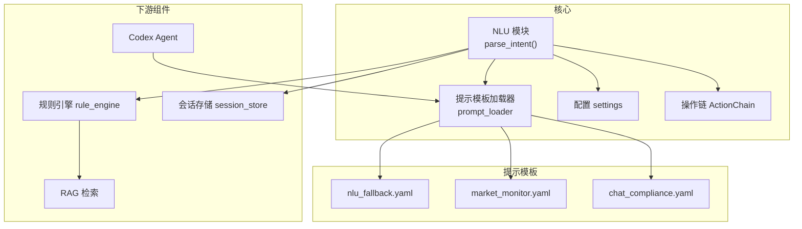
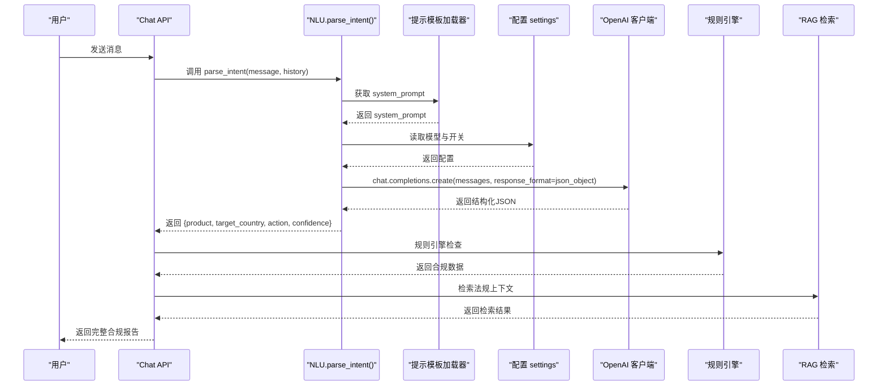
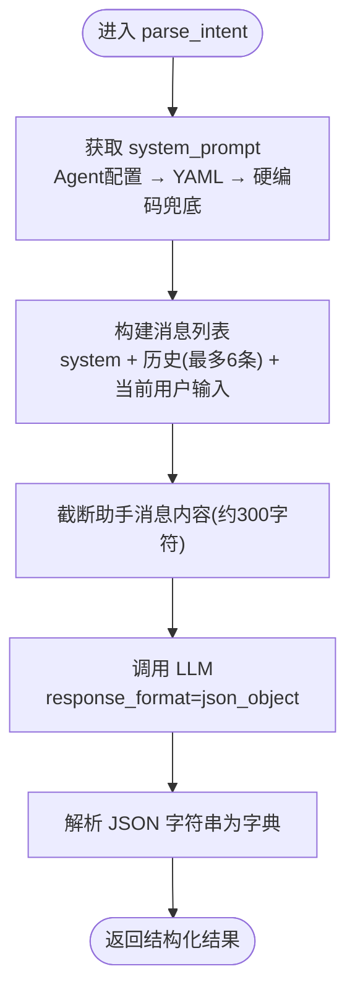
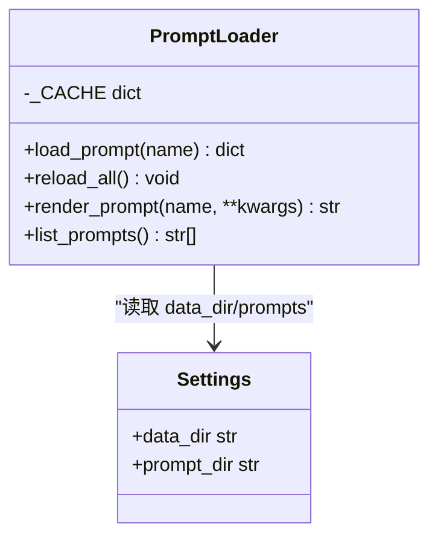
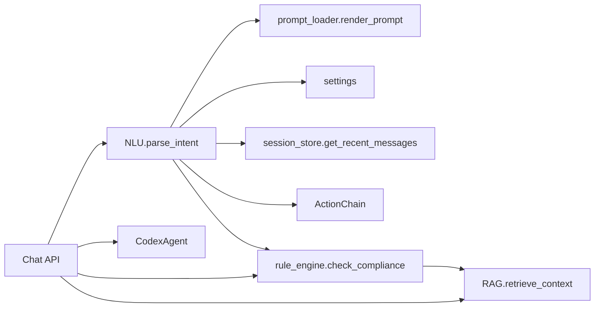

# 自然语言理解系统

<cite>
**本文档引用的文件**
- [nlu.py](file://backend/app/core/nlu.py)
- [prompt_loader.py](file://backend/app/services/prompt_loader.py)
- [nlu_fallback.yaml](file://backend/data/prompts/nlu_fallback.yaml)
- [chat.py](file://backend/app/api/chat.py)
- [schemas.py](file://backend/app/models/schemas.py)
- [config.py](file://backend/app/config.py)
- [agent_config_store.py](file://backend/app/storage/agent_config_store.py)
- [rule_engine.py](file://backend/app/core/rule_engine.py)
- [session_store.py](file://backend/app/storage/session_store.py)
- [action_chain.py](file://backend/app/core/action_chain.py)
- [codex_agent.py](file://backend/app/services/codex_agent.py)
- [market_monitor.yaml](file://backend/data/prompts/market_monitor.yaml)
- [chat_compliance.yaml](file://backend/data/prompts/chat_compliance.yaml)
</cite>

## 目录
1. [简介](#简介)
2. [项目结构](#项目结构)
3. [核心组件](#核心组件)
4. [架构总览](#架构总览)
5. [详细组件分析](#详细组件分析)
6. [依赖关系分析](#依赖关系分析)
7. [性能考量](#性能考量)
8. [故障排查指南](#故障排查指南)
9. [结论](#结论)
10. [附录](#附录)

## 简介
本系统提供“自然语言理解（NLU）”能力，通过大模型（LLM）对用户输入进行意图解析与实体抽取，输出标准化结构化结果（产品、目标国家、动作类型、置信度）。NLU模块采用单一高质量提示词模板，保证快速、稳定、可预测的解析效果；同时支持MiMo思维模式控制与提示模板热加载，便于在不重启服务的情况下持续优化提示词质量。

系统还提供与规则引擎、RAG、Codex Agent、会话存储、操作链追踪等组件的无缝集成，形成“NLU → 规则引擎 → RAG”的降级管线，以及“Codex Agent + 规则引擎 + RAG”的主路径，确保在不同配置与环境下均能提供一致的用户体验。

## 项目结构
- 核心NLU逻辑位于 backend/app/core/nlu.py
- 提示模板加载与热加载位于 backend/app/services/prompt_loader.py
- NLU兜底提示模板位于 backend/data/prompts/nlu_fallback.yaml
- 主对话接口与降级路径位于 backend/app/api/chat.py
- 数据模型定义位于 backend/app/models/schemas.py
- 全局配置位于 backend/app/config.py
- Agent配置（含通用合规Agent）位于 backend/app/storage/agent_config_store.py
- 规则引擎位于 backend/app/core/rule_engine.py
- 会话存储位于 backend/app/storage/session_store.py
- 操作链追踪位于 backend/app/core/action_chain.py
- Codex Agent封装位于 backend/app/services/codex_agent.py
- 其他提示模板（如市场监控、合规对话）位于 backend/data/prompts/

图表来源
- [nlu.py:1-99](file://backend/app/core/nlu.py#L1-L99)
- [prompt_loader.py:1-79](file://backend/app/services/prompt_loader.py#L1-L79)
- [nlu_fallback.yaml:1-20](file://backend/data/prompts/nlu_fallback.yaml#L1-L20)
- [market_monitor.yaml:1-36](file://backend/data/prompts/market_monitor.yaml#L1-L36)
- [chat_compliance.yaml:1-21](file://backend/data/prompts/chat_compliance.yaml#L1-L21)
- [config.py:1-75](file://backend/app/config.py#L1-L75)
- [action_chain.py:1-236](file://backend/app/core/action_chain.py#L1-L236)
- [rule_engine.py:1-247](file://backend/app/core/rule_engine.py#L1-L247)
- [session_store.py:1-251](file://backend/app/storage/session_store.py#L1-L251)
- [codex_agent.py:1-372](file://backend/app/services/codex_agent.py#L1-L372)

章节来源
- [nlu.py:1-99](file://backend/app/core/nlu.py#L1-L99)
- [prompt_loader.py:1-79](file://backend/app/services/prompt_loader.py#L1-L79)
- [nlu_fallback.yaml:1-20](file://backend/data/prompts/nlu_fallback.yaml#L1-L20)
- [chat.py:1-541](file://backend/app/api/chat.py#L1-L541)
- [config.py:1-75](file://backend/app/config.py#L1-L75)

## 核心组件
- NLU模块：负责构建system prompt、拼接历史上下文、调用LLM进行意图解析与实体抽取，并返回结构化JSON。
- 提示模板加载器：从YAML文件加载提示模板，支持全局缓存与热加载，避免重复I/O并允许微调后即时生效。
- Agent配置存储：提供通用合规Agent的system prompt，优先于YAML兜底模板，实现灵活的提示词管理。
- 规则引擎：在NLU之后执行确定性合规检查，提供HS编码、VAT税率、认证要求、风险提示等结构化数据。
- 会话存储：维护多轮对话的历史消息，供NLU在降级路径中注入上下文。
- 操作链：记录每次交互的完整操作链路，便于回溯与审计。
- Codex Agent：在主路径中提供多轮对话、工具调用、联网搜索等高级能力。

章节来源
- [nlu.py:1-99](file://backend/app/core/nlu.py#L1-L99)
- [prompt_loader.py:1-79](file://backend/app/services/prompt_loader.py#L1-L79)
- [agent_config_store.py:1-310](file://backend/app/storage/agent_config_store.py#L1-L310)
- [rule_engine.py:1-247](file://backend/app/core/rule_engine.py#L1-L247)
- [session_store.py:1-251](file://backend/app/storage/session_store.py#L1-L251)
- [action_chain.py:1-236](file://backend/app/core/action_chain.py#L1-L236)
- [codex_agent.py:1-372](file://backend/app/services/codex_agent.py#L1-L372)

## 架构总览
NLU在系统中扮演“意图解析器”的角色，既可作为主路径（Codex Agent）的前置，也可在Codex不可用时作为降级路径的核心。其工作流如下：
- 从Agent配置或YAML兜底模板获取system prompt
- 将历史消息（最多6条）与当前用户输入拼接为消息列表
- 调用LLM，要求返回JSON格式
- 解析LLM输出为结构化字典

图表来源
- [chat.py:228-540](file://backend/app/api/chat.py#L228-L540)
- [nlu.py:59-99](file://backend/app/core/nlu.py#L59-L99)
- [prompt_loader.py:23-70](file://backend/app/services/prompt_loader.py#L23-L70)
- [config.py:20-46](file://backend/app/config.py#L20-L46)
- [rule_engine.py:197-247](file://backend/app/core/rule_engine.py#L197-L247)

## 详细组件分析

### NLU模块：parse_intent函数详解
- system prompt构建
  - 优先从Agent配置存储中读取通用合规Agent的system prompt
  - 若不可用，则从YAML模板目录加载nlu_fallback.yaml
  - 若仍不可用，则使用硬编码兜底提示
- 消息历史处理
  - 从会话存储中读取最近最多6条消息，作为上下文注入
  - 助手消息内容截断（约300字符），避免过长合规报告污染上下文
- JSON格式化输出
  - 调用LLM时设置response_format为json_object
  - 严格要求返回JSON，避免Markdown包裹与多余文字
  - 解析LLM返回的字符串为Python字典
- MiMo思维模式控制
  - 通过配置项控制是否禁用MiMo的thinking模式，以降低延迟
  - 在特定场景下可关闭thinking模式提升响应速度

图表来源
- [nlu.py:27-99](file://backend/app/core/nlu.py#L27-L99)
- [agent_config_store.py:297-309](file://backend/app/storage/agent_config_store.py#L297-L309)
- [nlu_fallback.yaml:1-20](file://backend/data/prompts/nlu_fallback.yaml#L1-L20)
- [session_store.py:170-184](file://backend/app/storage/session_store.py#L170-L184)

章节来源
- [nlu.py:27-99](file://backend/app/core/nlu.py#L27-L99)
- [agent_config_store.py:297-309](file://backend/app/storage/agent_config_store.py#L297-L309)
- [nlu_fallback.yaml:1-20](file://backend/data/prompts/nlu_fallback.yaml#L1-L20)
- [session_store.py:170-184](file://backend/app/storage/session_store.py#L170-L184)

### 提示模板加载器：热加载与渲染
- 全局缓存：首次加载后缓存模板，避免重复I/O
- 热加载：提供reload_all()，清空缓存后下次访问自动刷新
- 渲染：支持简单变量替换（后续可升级为Jinja2），便于模板参数化
- 目录：从配置settings.data_dir下的prompts目录读取

图表来源
- [prompt_loader.py:1-79](file://backend/app/services/prompt_loader.py#L1-L79)
- [config.py:42-46](file://backend/app/config.py#L42-L46)

章节来源
- [prompt_loader.py:1-79](file://backend/app/services/prompt_loader.py#L1-L79)
- [config.py:42-46](file://backend/app/config.py#L42-L46)

### Agent配置存储：通用合规Agent的system prompt
- 提供默认Agent预设（含general类型），其中通用合规Agent的system prompt用于NLU
- 支持CRUD与启用/禁用管理
- 提供get_general_system_prompt()，优先返回数据库中的通用Agent提示

章节来源
- [agent_config_store.py:24-158](file://backend/app/storage/agent_config_store.py#L24-L158)
- [agent_config_store.py:297-309](file://backend/app/storage/agent_config_store.py#L297-L309)

### 规则引擎：确定性合规检查
- 输入：产品名称、目标国家
- 输出：HS编码、VAT税率、认证要求、风险提示、物流与运输合规提示、清关材料建议、文化注意事项、整改建议、出口待办清单
- 确定性逻辑：基于本地数据源（L0层）进行规则匹配，不依赖LLM

章节来源
- [rule_engine.py:197-247](file://backend/app/core/rule_engine.py#L197-L247)

### 会话存储：多轮上下文注入
- 提供创建会话、添加消息、获取最近N条消息等功能
- 降级路径中，NLU将最近6条消息作为历史上下文注入，提升多轮对话理解能力

章节来源
- [session_store.py:74-184](file://backend/app/storage/session_store.py#L74-L184)

### 操作链：决策链路追踪
- 记录每次交互的完整操作链路，支持保存为JSON文件，便于回溯与审计
- Chat API中贯穿NLU、规则引擎、RAG等步骤，形成可追溯的决策链

章节来源
- [action_chain.py:77-236](file://backend/app/core/action_chain.py#L77-L236)
- [chat.py:238-376](file://backend/app/api/chat.py#L238-L376)

### Codex Agent：主路径的增强能力
- 支持多轮会话、工具调用（MCP）、联网搜索、CLI智能
- 在主路径中与规则引擎、RAG协同，提供更丰富的合规分析
- 当Codex不可用时，自动降级到NLU → 规则引擎 → RAG

章节来源
- [codex_agent.py:40-160](file://backend/app/services/codex_agent.py#L40-L160)
- [chat.py:251-264](file://backend/app/api/chat.py#L251-L264)

## 依赖关系分析
- NLU依赖
  - 提示模板加载器：获取system prompt
  - 配置settings：读取模型、API Key、Base URL、思维模式开关
  - 会话存储：读取历史消息
  - 操作链：记录NLU解析过程
- 与Chat API的耦合
  - Chat API在Codex不可用时自动降级到NLU → 规则引擎 → RAG
  - Chat API在Codex可用时，先由Codex处理，再并行执行规则引擎与RAG
- 与规则引擎、RAG的协作
  - NLU提供产品与目标国家，规则引擎与RAG分别提供结构化数据与法规上下文

图表来源
- [nlu.py:59-99](file://backend/app/core/nlu.py#L59-L99)
- [prompt_loader.py:54-70](file://backend/app/services/prompt_loader.py#L54-L70)
- [config.py:20-46](file://backend/app/config.py#L20-L46)
- [session_store.py:170-184](file://backend/app/storage/session_store.py#L170-L184)
- [action_chain.py:133-140](file://backend/app/core/action_chain.py#L133-L140)
- [chat.py:228-540](file://backend/app/api/chat.py#L228-L540)
- [rule_engine.py:197-247](file://backend/app/core/rule_engine.py#L197-L247)

章节来源
- [chat.py:228-540](file://backend/app/api/chat.py#L228-L540)
- [nlu.py:59-99](file://backend/app/core/nlu.py#L59-L99)

## 性能考量
- 快速解析：NLU采用单一高质量提示词，避免多轮对话与链式代理，响应更快、可预测性更强
- 上下文裁剪：助手消息截断，减少上下文长度，降低token消耗与延迟
- 热加载：提示模板缓存+热加载，微调后无需重启即可生效
- 思维模式控制：可关闭MiMo的thinking模式，进一步降低延迟
- 降级策略：在LLM不可用或不稳定时，自动降级到关键词提取与规则引擎，保障基本功能可用

[本节为通用性能讨论，不直接分析具体文件]

## 故障排查指南
- LLM不可用
  - 检查active_llm_api_key与active_llm_base_url是否正确配置
  - Chat API会在无Key时返回引导提示，或在降级路径中使用关键词提取
- 提示模板加载失败
  - 确认data_dir/prompts目录存在且nlu_fallback.yaml可读
  - 使用reload_all()刷新缓存
- NLU输出非JSON
  - 确保system prompt要求严格JSON输出
  - 检查response_format是否为json_object
- 思维模式导致延迟过高
  - 设置llm_disable_thinking为True，关闭MiMo thinking模式
- 会话历史为空
  - 确认session_id有效，或允许系统自动创建新会话

章节来源
- [chat.py:93-101](file://backend/app/api/chat.py#L93-L101)
- [prompt_loader.py:49-51](file://backend/app/services/prompt_loader.py#L49-L51)
- [nlu.py:88-96](file://backend/app/core/nlu.py#L88-L96)
- [config.py:20-24](file://backend/app/config.py#L20-L24)
- [session_store.py:420-429](file://backend/app/storage/session_store.py#L420-L429)

## 结论
本NLU模块通过高质量提示词与严格的JSON输出约束，实现了稳定、可预测的意图解析与实体抽取。配合提示模板热加载、MiMo思维模式控制、Agent配置管理与会话存储，系统在不同部署环境下均能提供一致的体验。在主路径中与Codex Agent、规则引擎、RAG协同，在降级路径中与规则引擎、RAG协同，确保在各种条件下都能输出结构化合规报告。

[本节为总结性内容，不直接分析具体文件]

## 附录

### 使用示例（场景与预期结果）
- 场景1：出口合规查询
  - 输入：“手机出口德国”
  - 预期输出：product=“手机”，target_country=“德国”，action=“export_check”，confidence较高
- 场景2：认证查询
  - 输入：“蓝牙耳机需要什么认证？”
  - 预期输出：action=“cert_query”，可能返回产品相关认证列表
- 场景3：通用问题
  - 输入：“你好”
  - 预期输出：action=“general”，返回通用问答（无合规流水线）

章节来源
- [chat.py:415-540](file://backend/app/api/chat.py#L415-L540)
- [nlu_fallback.yaml:15-20](file://backend/data/prompts/nlu_fallback.yaml#L15-L20)

### 配置选项
- 主交互LLM配置
  - llm_api_key / llm_base_url / llm_model：主模型配置
  - llm_disable_thinking：是否禁用MiMo thinking模式
- 提示模板与数据目录
  - data_dir：数据根目录
  - prompt_dir：提示模板目录
- Codex配置
  - codex_enabled：是否启用Codex
  - codex_model / codex_search_model：Codex使用的模型
  - codex_approval_policy：审批策略

章节来源
- [config.py:20-61](file://backend/app/config.py#L20-L61)

### 与其他组件的集成方式
- Chat API：在Codex不可用时自动降级到NLU → 规则引擎 → RAG
- 规则引擎：在NLU之后执行确定性合规检查
- RAG：在规则引擎基础上补充法规上下文
- 会话存储：在降级路径中注入多轮上下文
- 操作链：记录NLU与后续步骤的完整链路

章节来源
- [chat.py:228-540](file://backend/app/api/chat.py#L228-L540)
- [rule_engine.py:197-247](file://backend/app/core/rule_engine.py#L197-L247)
- [session_store.py:415-531](file://backend/app/storage/session_store.py#L415-L531)
- [action_chain.py:77-140](file://backend/app/core/action_chain.py#L77-L140)